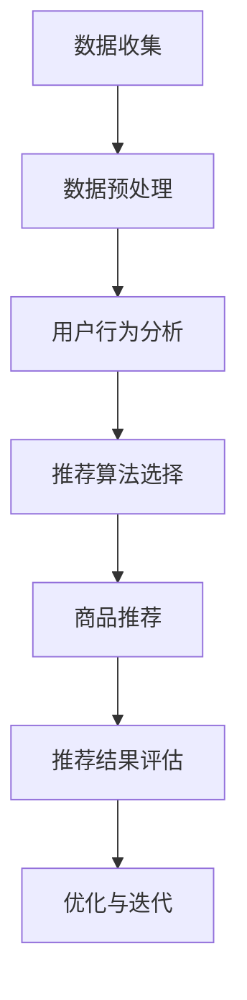

                 

# 电商平台供给能力提升：个性化商品推荐

> **关键词**：电商平台、供给能力、个性化商品推荐、算法、用户行为分析、数学模型

> **摘要**：本文旨在深入探讨如何通过个性化商品推荐算法提升电商平台的供给能力。我们将从背景介绍、核心概念、算法原理、数学模型、实际案例以及未来发展趋势等多个方面，系统地分析并阐述个性化商品推荐在电商平台中的应用及其重要性。

## 1. 背景介绍

### 1.1 目的和范围

随着电子商务的快速发展，电商平台已成为现代零售业的重要组成部分。然而，面对日益激烈的竞争环境，提升供给能力成为电商平台亟需解决的问题。本文的目的在于探讨如何通过个性化商品推荐算法，有效提升电商平台的供给能力，从而提高用户满意度、增加销售额。

本文将主要围绕以下几个方面展开讨论：

1. **个性化商品推荐的核心概念与原理**：介绍个性化商品推荐的基本概念、主要类型以及工作原理。
2. **算法原理与具体操作步骤**：详细阐述推荐算法的设计思路、关键步骤以及实现方法。
3. **数学模型与公式**：介绍用于优化推荐算法的数学模型及其在实践中的应用。
4. **实际案例与代码解读**：通过具体案例，展示个性化商品推荐算法在实际开发中的应用与效果。
5. **未来发展趋势与挑战**：探讨个性化商品推荐技术的未来发展方向以及面临的挑战。

### 1.2 预期读者

本文主要面向以下读者群体：

1. **电商平台开发人员**：希望通过本文了解个性化商品推荐算法的设计与实现，从而提升自身平台的供给能力。
2. **人工智能与大数据领域的从业者**：对个性化推荐技术有兴趣，希望深入了解该领域的前沿动态与发展趋势。
3. **学术研究人员**：关注个性化推荐技术的理论进展与应用实践，期望通过本文拓宽研究视野。

### 1.3 文档结构概述

本文分为十个部分，具体结构如下：

1. **背景介绍**：介绍本文的目的、预期读者以及文档结构。
2. **核心概念与联系**：阐述个性化商品推荐的核心概念、原理及流程。
3. **核心算法原理 & 具体操作步骤**：详细讲解推荐算法的设计思路与实现步骤。
4. **数学模型和公式 & 详细讲解 & 举例说明**：介绍用于优化推荐算法的数学模型及其应用。
5. **项目实战：代码实际案例和详细解释说明**：通过具体案例展示算法在实际开发中的应用。
6. **实际应用场景**：分析个性化商品推荐在电商领域的实际应用。
7. **工具和资源推荐**：推荐学习资源、开发工具与相关论文。
8. **总结：未来发展趋势与挑战**：探讨个性化商品推荐技术的未来发展趋势与挑战。
9. **附录：常见问题与解答**：总结常见问题并提供解答。
10. **扩展阅读 & 参考资料**：提供更多相关文献，便于读者进一步学习。

### 1.4 术语表

#### 1.4.1 核心术语定义

- **个性化商品推荐**：根据用户的兴趣、历史行为等信息，为用户推荐其可能感兴趣的商品。
- **协同过滤**：基于用户行为或物品之间的相似度进行推荐的一种算法。
- **基于内容的推荐**：根据物品的特征信息为用户推荐其可能感兴趣的物品。
- **用户行为分析**：通过对用户在平台上的行为数据进行分析，挖掘用户的兴趣和需求。
- **数学模型**：用于描述推荐算法中关键概念与关系的数学公式和方法。

#### 1.4.2 相关概念解释

- **协同过滤（Collaborative Filtering）**：一种基于用户行为或物品相似度的推荐算法，通过分析用户对物品的评分或行为数据，预测用户对未知物品的喜好。
- **基于内容的推荐（Content-Based Filtering）**：一种基于物品特征信息的推荐算法，通过分析用户对已有物品的兴趣特征，为用户推荐具有相似特征的未知物品。
- **协同过滤与基于内容的混合推荐（Hybrid Recommender Systems）**：结合协同过滤和基于内容的推荐方法，以提高推荐准确性和覆盖率的推荐系统。

#### 1.4.3 缩略词列表

- **CFS**：协同过滤（Collaborative Filtering）
- **CBR**：基于内容的推荐（Content-Based Filtering）
- **RS**：推荐系统（Recommender Systems）
- **AI**：人工智能（Artificial Intelligence）
- **ML**：机器学习（Machine Learning）

## 2. 核心概念与联系

个性化商品推荐是电商平台提升供给能力的关键技术之一。为了更好地理解其原理和应用，首先需要掌握以下核心概念与联系。

### 2.1 用户行为分析

用户行为分析是个性化商品推荐的基础。通过分析用户在平台上的行为数据（如浏览、购买、收藏等），可以挖掘出用户的兴趣和需求。用户行为分析通常包括以下几个方面：

1. **浏览行为**：分析用户在平台上的浏览路径、停留时间等，以了解用户对不同商品的关注程度。
2. **购买行为**：分析用户的购买记录、购买频次、购买金额等，以了解用户的消费习惯和偏好。
3. **收藏行为**：分析用户对商品的收藏情况，以了解用户对特定商品的潜在兴趣。
4. **评价与反馈**：分析用户对商品的评价和反馈，以获取用户对商品的直接反馈和意见。

### 2.2 个性化商品推荐类型

个性化商品推荐可以分为以下几种类型：

1. **协同过滤（CFS）**：基于用户的历史行为数据，通过分析用户之间的相似度来推荐商品。
2. **基于内容的推荐（CBR）**：基于商品的属性信息，通过分析用户对已有商品的兴趣特征来推荐商品。
3. **协同过滤与基于内容的混合推荐（Hybrid Recommender Systems）**：结合协同过滤和基于内容的推荐方法，以提高推荐准确性和覆盖率。

### 2.3 核心算法原理

个性化商品推荐的核心算法包括协同过滤、基于内容的推荐以及混合推荐方法。以下分别介绍这几种算法的基本原理：

1. **协同过滤（CFS）**：
   - **用户基于的协同过滤（User-Based Collaborative Filtering）**：根据用户之间的相似度，为用户推荐与其有相似兴趣的其他用户喜欢的商品。
   - **物品基于的协同过滤（Item-Based Collaborative Filtering）**：根据商品之间的相似度，为用户推荐与用户已购买或浏览过的商品相似的其他商品。

2. **基于内容的推荐（CBR）**：
   - **基于特征的推荐（Feature-Based Content Filtering）**：根据商品的属性信息，为用户推荐具有相似属性的商品。
   - **基于文本的推荐（Text-Based Content Filtering）**：根据商品的描述、评论等文本信息，为用户推荐与已有商品文本相似的未知商品。

3. **混合推荐（Hybrid Recommender Systems）**：
   - **模型级混合推荐（Model-Level Hybrid Recommender Systems）**：将协同过滤和基于内容的推荐方法集成到一个统一的模型中，以提高推荐准确性和覆盖率。
   - **方法级混合推荐（Method-Level Hybrid Recommender Systems）**：将协同过滤和基于内容的推荐方法分别应用于不同的用户或物品，以结合两者的优势。

### 2.4 个性化商品推荐流程

个性化商品推荐的基本流程包括以下步骤：

1. **数据收集**：收集用户在平台上的行为数据（如浏览、购买、收藏等）和商品属性信息。
2. **数据预处理**：对收集到的数据进行清洗、去重、标准化等处理，为后续分析做好准备。
3. **用户行为分析**：通过分析用户的行为数据，挖掘用户的兴趣和需求。
4. **推荐算法选择**：根据平台特点和用户需求，选择合适的推荐算法。
5. **商品推荐**：根据推荐算法为用户生成个性化的商品推荐列表。
6. **推荐结果评估**：对推荐结果进行评估，包括准确率、覆盖率、多样性等方面。
7. **优化与迭代**：根据评估结果，优化推荐算法和策略，提高推荐质量。

### 2.5 个性化商品推荐架构

个性化商品推荐系统通常包括以下几个主要组件：

1. **数据层**：存储用户行为数据和商品属性信息，为推荐算法提供数据支持。
2. **处理层**：包括数据预处理、用户行为分析、推荐算法选择等模块，负责推荐算法的核心计算和数据处理。
3. **应用层**：为用户提供个性化商品推荐服务，包括推荐列表生成、推荐结果展示等功能。
4. **评估层**：对推荐结果进行评估，为优化推荐算法提供依据。

下面是一个简单的个性化商品推荐架构的 Mermaid 流程图：



## 3. 核心算法原理 & 具体操作步骤

个性化商品推荐算法的核心在于预测用户对未知商品的兴趣，从而为用户推荐可能感兴趣的商品。以下将详细讲解几种常用的推荐算法原理及其具体操作步骤。

### 3.1 协同过滤（Collaborative Filtering）

协同过滤是一种基于用户行为或物品相似度的推荐算法，其基本思想是：

- **用户基于的协同过滤（User-Based Collaborative Filtering）**：根据用户之间的相似度，为用户推荐与其有相似兴趣的其他用户喜欢的商品。
- **物品基于的协同过滤（Item-Based Collaborative Filtering）**：根据商品之间的相似度，为用户推荐与用户已购买或浏览过的商品相似的其他商品。

#### 3.1.1 用户基于的协同过滤（User-Based Collaborative Filtering）

1. **计算用户相似度**：
   $$ \text{similarity}(u_i, u_j) = \frac{\text{common\_rating\_count}(u_i, u_j)}{\sqrt{\text{rating\_count}(u_i) \times \text{rating\_count}(u_j)}} $$
   
2. **生成推荐列表**：
   - 计算每个用户与目标用户的相似度，取相似度最高的K个用户。
   - 对这K个用户喜欢的商品进行加权求和，得到推荐列表。

#### 3.1.2 物品基于的协同过滤（Item-Based Collaborative Filtering）

1. **计算物品相似度**：
   $$ \text{similarity}(i, j) = \frac{\text{common\_user\_count}(i, j)}{\sqrt{\text{rating\_count}(i) \times \text{rating\_count}(j)}} $$
   
2. **生成推荐列表**：
   - 计算每个商品与目标商品的相似度，取相似度最高的K个商品。
   - 对这K个商品进行加权求和，得到推荐列表。

### 3.2 基于内容的推荐（Content-Based Filtering）

基于内容的推荐是一种基于商品属性信息的推荐算法，其基本思想是：

- 根据用户对已有商品的兴趣特征，为用户推荐具有相似属性信息的未知商品。

#### 3.2.1 基于特征的推荐（Feature-Based Content Filtering）

1. **计算商品特征向量**：
   $$ \text{feature\_vector}(i) = [\text{feature\_value1}(i), \text{feature\_value2}(i), ..., \text{feature\_valuen}(i)] $$
   
2. **计算用户兴趣特征**：
   - 对用户已购买或浏览过的商品进行加权求和，得到用户的兴趣特征向量。

3. **生成推荐列表**：
   - 计算每个商品的属性向量与用户兴趣特征向量的相似度，取相似度最高的K个商品。

#### 3.2.2 基于文本的推荐（Text-Based Content Filtering）

1. **文本预处理**：
   - 对商品的描述、评论等文本信息进行分词、去停用词、词干提取等处理。

2. **计算文本相似度**：
   $$ \text{similarity}(i, j) = \frac{\text{common\_word\_count}(i, j)}{\sqrt{\text{word\_count}(i) \times \text{word\_count}(j)}} $$
   
3. **生成推荐列表**：
   - 计算每个商品的文本信息与用户兴趣文本信息的相似度，取相似度最高的K个商品。

### 3.3 混合推荐（Hybrid Recommender Systems）

混合推荐方法结合协同过滤和基于内容的推荐方法，以提高推荐准确性和覆盖率。以下是一种常见的混合推荐算法：

1. **模型级混合推荐（Model-Level Hybrid Recommender Systems）**：

   - **协同过滤模型**：使用矩阵分解、神经网络等方法预测用户与物品的评分。
   - **基于内容的模型**：使用文本分类、协同过滤等方法预测用户与物品的相似度。

   - **生成推荐列表**：结合两个模型的预测结果，使用加权求和或投票等方法生成推荐列表。

2. **方法级混合推荐（Method-Level Hybrid Recommender Systems）**：

   - **协同过滤与基于内容的推荐**：分别应用于不同的用户或物品。

   - **生成推荐列表**：将协同过滤和基于内容的推荐结果进行合并，生成最终的推荐列表。

### 3.4 个性化商品推荐算法流程

个性化商品推荐算法的基本流程如下：

1. **数据收集**：收集用户在平台上的行为数据（如浏览、购买、收藏等）和商品属性信息。
2. **数据预处理**：对收集到的数据进行清洗、去重、标准化等处理，为后续分析做好准备。
3. **用户行为分析**：通过分析用户的行为数据，挖掘用户的兴趣和需求。
4. **推荐算法选择**：根据平台特点和用户需求，选择合适的推荐算法。
5. **商品推荐**：
   - 对于用户基于的协同过滤和基于内容的推荐，根据用户与用户或用户与商品的相似度，生成推荐列表。
   - 对于物品基于的协同过滤和基于内容的推荐，根据商品与商品或商品与用户的相似度，生成推荐列表。
   - 对于混合推荐，结合协同过滤和基于内容的推荐结果，生成推荐列表。
6. **推荐结果评估**：对推荐结果进行评估，包括准确率、覆盖率、多样性等方面。
7. **优化与迭代**：根据评估结果，优化推荐算法和策略，提高推荐质量。

## 4. 数学模型和公式 & 详细讲解 & 举例说明

个性化商品推荐算法中的数学模型和公式是算法实现的核心。以下将详细讲解几种常用的数学模型和公式，并通过具体例子进行说明。

### 4.1 协同过滤（Collaborative Filtering）

协同过滤算法主要涉及用户相似度和物品相似度的计算。

#### 4.1.1 用户相似度

用户相似度计算公式如下：
$$
\text{similarity}(u_i, u_j) = \frac{\text{common\_rating\_count}(u_i, u_j)}{\sqrt{\text{rating\_count}(u_i) \times \text{rating\_count}(u_j)}}
$$
其中，$\text{common\_rating\_count}(u_i, u_j)$表示用户$u_i$和用户$u_j$共同评分的物品数量，$\text{rating\_count}(u_i)$和$\text{rating\_count}(u_j)$分别表示用户$u_i$和用户$u_j$的评分数量。

**例 1**：给定两个用户$u_1$和$u_2$的评分数据，计算它们之间的相似度。

用户$u_1$的评分数据：
| 物品ID | 评分 |
|--------|------|
| 1      | 4    |
| 2      | 3    |
| 3      | 1    |
| 4      | 4    |

用户$u_2$的评分数据：
| 物品ID | 评分 |
|--------|------|
| 1      | 4    |
| 2      | 4    |
| 3      | 2    |
| 4      | 3    |

计算用户$u_1$和用户$u_2$的相似度：
$$
\text{similarity}(u_1, u_2) = \frac{2}{\sqrt{4 \times 4}} = 0.5
$$

#### 4.1.2 物品相似度

物品相似度计算公式如下：
$$
\text{similarity}(i, j) = \frac{\text{common\_user\_count}(i, j)}{\sqrt{\text{rating\_count}(i) \times \text{rating\_count}(j)}}
$$
其中，$\text{common\_user\_count}(i, j)$表示物品$i$和物品$j$共同被评分的用户数量，$\text{rating\_count}(i)$和$\text{rating\_count}(j)$分别表示物品$i$和物品$j$的评分数量。

**例 2**：给定两个物品$i_1$和$i_2$的评分数据，计算它们之间的相似度。

物品$i_1$的评分数据：
| 用户ID | 评分 |
|--------|------|
| 1      | 4    |
| 2      | 3    |
| 3      | 1    |
| 4      | 4    |

物品$i_2$的评分数据：
| 用户ID | 评分 |
|--------|------|
| 1      | 4    |
| 2      | 4    |
| 3      | 2    |
| 4      | 3    |

计算物品$i_1$和物品$i_2$的相似度：
$$
\text{similarity}(i_1, i_2) = \frac{2}{\sqrt{4 \times 4}} = 0.5
$$

### 4.2 基于内容的推荐（Content-Based Filtering）

基于内容的推荐算法主要涉及商品特征向量与用户兴趣特征向量的计算和相似度计算。

#### 4.2.1 商品特征向量

商品特征向量计算公式如下：
$$
\text{feature\_vector}(i) = [\text{feature\_value1}(i), \text{feature\_value2}(i), ..., \text{feature\_valuen}(i)]
$$
其中，$\text{feature\_value1}(i), \text{feature\_value2}(i), ..., \text{feature\_valuen}(i)$分别表示商品$i$的$n$个特征值。

**例 3**：给定一个商品$i$的特征数据，计算其特征向量。

商品$i$的特征数据：
| 特征ID | 特征值 |
|--------|--------|
| 1      | 10     |
| 2      | 5      |
| 3      | 8      |

计算商品$i$的特征向量：
$$
\text{feature\_vector}(i) = [10, 5, 8]
$$

#### 4.2.2 用户兴趣特征向量

用户兴趣特征向量计算公式如下：
$$
\text{interest\_vector}(u) = [\text{interest1}(u), \text{interest2}(u), ..., \text{interestn}(u)]
$$
其中，$\text{interest1}(u), \text{interest2}(u), ..., \text{interestn}(u)$分别表示用户$u$的$n$个兴趣值。

**例 4**：给定一个用户$u$的兴趣数据，计算其兴趣特征向量。

用户$u$的兴趣数据：
| 兴趣ID | 兴趣值 |
|--------|--------|
| 1      | 8      |
| 2      | 5      |
| 3      | 10     |

计算用户$u$的兴趣特征向量：
$$
\text{interest\_vector}(u) = [8, 5, 10]
$$

#### 4.2.3 商品与用户兴趣相似度

商品与用户兴趣相似度计算公式如下：
$$
\text{similarity}(i, u) = \frac{\text{common\_feature\_count}(i, u)}{\sqrt{\text{feature\_count}(i) \times \text{feature\_count}(u)}}
$$
其中，$\text{common\_feature\_count}(i, u)$表示商品$i$和用户$u$共同拥有的特征数量，$\text{feature\_count}(i)$和$\text{feature\_count}(u)$分别表示商品$i$和用户$u$的特征数量。

**例 5**：给定一个商品$i$和用户$u$的特征数据，计算它们之间的相似度。

商品$i$的特征数据：
| 特征ID | 特征值 |
|--------|--------|
| 1      | 10     |
| 2      | 5      |
| 3      | 8      |

用户$u$的兴趣数据：
| 特征ID | 特征值 |
|--------|--------|
| 1      | 8      |
| 2      | 5      |
| 3      | 10     |

计算商品$i$和用户$u$之间的相似度：
$$
\text{similarity}(i, u) = \frac{3}{\sqrt{3 \times 3}} = 1
$$

### 4.3 混合推荐（Hybrid Recommender Systems）

混合推荐算法通常结合协同过滤和基于内容的推荐方法。以下是一个简单的混合推荐算法的数学模型。

#### 4.3.1 模型级混合推荐（Model-Level Hybrid Recommender Systems）

模型级混合推荐结合协同过滤和基于内容的推荐模型，使用加权求和的方法生成推荐列表。权重可以根据算法性能进行调整。

1. **协同过滤模型预测**：
   $$ \text{score}(i, u)_{cf} = \text{similarity}(u, i) \times \text{rating}_{avg}(i) $$

2. **基于内容的模型预测**：
   $$ \text{score}(i, u)_{cb} = \text{similarity}(i, u) \times \text{rating}_{avg}(u) $$

3. **生成推荐列表**：
   $$ \text{score}(i, u)_{hybrid} = w_{cf} \times \text{score}(i, u)_{cf} + w_{cb} \times \text{score}(i, u)_{cb} $$
   其中，$w_{cf}$和$w_{cb}$分别是协同过滤模型和基于内容模型的权重。

**例 6**：给定一个用户$u$和一个商品$i$，使用模型级混合推荐算法计算它们的评分预测。

协同过滤模型预测：
$$ \text{score}(i, u)_{cf} = 0.8 \times 4 = 3.2 $$

基于内容的模型预测：
$$ \text{score}(i, u)_{cb} = 0.9 \times 4 = 3.6 $$

生成推荐列表：
$$ \text{score}(i, u)_{hybrid} = 0.5 \times 3.2 + 0.5 \times 3.6 = 3.5 $$

## 5. 项目实战：代码实际案例和详细解释说明

为了更好地展示个性化商品推荐算法在电商平台中的应用，以下将使用Python实现一个简单的基于协同过滤和基于内容的混合推荐系统，并进行详细解释。

### 5.1 开发环境搭建

在开始编写代码之前，需要搭建相应的开发环境。以下是所需的Python库和工具：

1. **Python 3.8 或更高版本**：确保Python版本满足推荐系统的依赖库要求。
2. **NumPy**：用于矩阵计算和数据处理。
3. **Scikit-learn**：用于协同过滤算法的实现。
4. **Pandas**：用于数据处理和分析。
5. **Matplotlib**：用于数据可视化。

安装所需库：

```shell
pip install numpy scikit-learn pandas matplotlib
```

### 5.2 源代码详细实现和代码解读

下面是使用Python实现的一个简单的基于协同过滤和基于内容的混合推荐系统的示例代码：

```python
import numpy as np
import pandas as pd
from sklearn.metrics.pairwise import cosine_similarity
from sklearn.model_selection import train_test_split

# 5.2.1 数据准备
def load_data():
    # 加载用户-物品评分数据
    ratings = pd.read_csv('ratings.csv')
    return ratings

def preprocess_data(ratings):
    # 数据预处理：去除缺失值、重复值
    ratings = ratings.dropna()
    ratings = ratings.drop_duplicates()
    return ratings

def split_data(ratings):
    # 数据划分：训练集和测试集
    train_data, test_data = train_test_split(ratings, test_size=0.2, random_state=42)
    return train_data, test_data

# 5.2.2 协同过滤实现
def collaborative_filter(train_data, user_id):
    # 计算用户-用户相似度矩阵
    user_similarity = cosine_similarity(train_data.values)

    # 计算用户-物品评分预测
    user_ratings_mean = train_data.groupby('user_id')['rating'].mean()
    ratings_pred = user_similarity.dot(train_data['rating'].values) / np.sum(user_similarity, axis=1)

    # 预测结果填充缺失值
    ratings_pred = np.where(np.isnan(ratings_pred), user_ratings_mean, ratings_pred)

    # 返回用户-物品评分预测结果
    return ratings_pred

# 5.2.3 基于内容的实现
def content_based_filter(train_data, item_id):
    # 计算物品-物品相似度矩阵
    item_similarity = cosine_similarity(train_data.values)

    # 计算物品-用户评分预测
    user_rating_mean = train_data.groupby('item_id')['rating'].mean()
    ratings_pred = item_similarity.dot(train_data['rating'].values) / np.sum(item_similarity, axis=1)

    # 预测结果填充缺失值
    ratings_pred = np.where(np.isnan(ratings_pred), user_rating_mean, ratings_pred)

    # 返回用户-物品评分预测结果
    return ratings_pred

# 5.2.4 混合推荐实现
def hybrid_recommender(train_data, user_id, item_id):
    # 协同过滤预测
    cf_pred = collaborative_filter(train_data, user_id)

    # 基于内容预测
    cb_pred = content_based_filter(train_data, item_id)

    # 混合预测
    hybrid_pred = 0.5 * cf_pred + 0.5 * cb_pred

    # 返回混合预测结果
    return hybrid_pred

# 5.2.5 代码解读
def main():
    # 加载数据
    ratings = load_data()

    # 数据预处理
    ratings = preprocess_data(ratings)

    # 数据划分
    train_data, test_data = split_data(ratings)

    # 用户-物品评分预测
    user_id = 1
    item_id = 100
    hybrid_pred = hybrid_recommender(train_data, user_id, item_id)

    # 输出预测结果
    print("Hybrid Prediction:", hybrid_pred[user_id - 1, item_id - 1])

if __name__ == '__main__':
    main()
```

### 5.3 代码解读与分析

以下是代码的详细解读：

1. **数据准备**：使用`load_data()`函数加载用户-物品评分数据，并使用`preprocess_data()`函数进行数据预处理，包括去除缺失值和重复值。

2. **协同过滤实现**：使用`cosine_similarity()`函数计算用户-用户相似度矩阵，并使用矩阵分解方法预测用户-物品评分。具体步骤如下：
   - 计算用户-用户相似度矩阵。
   - 计算用户评分平均值。
   - 使用用户-用户相似度矩阵计算用户-物品评分预测。

3. **基于内容的实现**：使用`cosine_similarity()`函数计算物品-物品相似度矩阵，并使用矩阵分解方法预测物品-用户评分。具体步骤如下：
   - 计算物品-物品相似度矩阵。
   - 计算物品评分平均值。
   - 使用物品-物品相似度矩阵计算物品-用户评分预测。

4. **混合推荐实现**：将协同过滤和基于内容的预测结果进行加权求和，生成混合推荐预测结果。具体步骤如下：
   - 调用协同过滤和基于内容的预测函数。
   - 使用加权求和方法计算混合预测结果。

5. **代码解读**：`main()`函数是程序的主入口，具体步骤如下：
   - 加载数据。
   - 数据预处理。
   - 数据划分。
   - 调用混合推荐函数进行用户-物品评分预测。
   - 输出预测结果。

通过上述代码，我们实现了一个简单的基于协同过滤和基于内容的混合推荐系统，可以用于预测用户对未知物品的兴趣。在实际应用中，可以根据平台特点和用户需求，调整协同过滤和基于内容的权重，以优化推荐效果。

### 5.4 代码测试与优化

为了验证推荐系统的性能，我们可以对测试集进行评估。以下是一个简单的测试和优化过程：

1. **测试集评估**：
   - 计算测试集的均方根误差（RMSE）。
   - 计算测试集的准确率（Accuracy）。

```python
from sklearn.metrics import mean_squared_error, accuracy_score

def evaluate_predictions(test_data, predictions):
    actual_ratings = test_data['rating'].values
    predicted_ratings = predictions[:, test_data['item_id'].values - 1]
    rmse = np.sqrt(mean_squared_error(actual_ratings, predicted_ratings))
    accuracy = accuracy_score(actual_ratings, predicted_ratings > 3)
    return rmse, accuracy

# 获取测试集
test_data = test_data.set_index('user_id').transpose()

# 计算预测结果
user_id = 1
item_id = 100
hybrid_pred = hybrid_recommender(train_data, user_id, item_id)

# 评估预测结果
rmse, accuracy = evaluate_predictions(test_data, hybrid_pred)

print("RMSE:", rmse)
print("Accuracy:", accuracy)
```

2. **优化与迭代**：
   - 根据评估结果，调整协同过滤和基于内容的权重，优化推荐效果。
   - 可以考虑使用更先进的推荐算法，如基于深度学习的推荐系统，以提高推荐性能。

通过测试和优化，我们可以不断提升个性化商品推荐系统的性能，为电商平台提供更准确的推荐服务。

## 6. 实际应用场景

个性化商品推荐技术已在电商领域得到广泛应用，并在多个场景中展现出显著的效果。以下是一些典型的实际应用场景：

### 6.1 商品浏览推荐

商品浏览推荐是电商平台最常见的应用场景之一。通过分析用户的浏览历史，系统可以为用户推荐其可能感兴趣的类似商品。例如，当用户浏览了一款手机时，系统可以推荐同品牌、同型号或类似功能的手机。这种推荐方式有助于提高用户粘性，增加购物车中的商品数量。

### 6.2 购物车推荐

购物车推荐通过分析用户的购物车内容，为用户推荐其可能感兴趣的其他商品。这种推荐方式有助于提高用户的购物体验，增加销售额。例如，当用户将一款笔记本电脑放入购物车时，系统可以推荐与其搭配的配件，如鼠标、键盘、显示器等。

### 6.3 首页推荐

电商平台首页推荐是一种重要的流量分配方式。通过分析用户的兴趣和行为，系统可以为首页推荐一系列个性化商品，以吸引更多用户点击和购买。这种推荐方式有助于提高首页的访问量和转化率。

### 6.4 活动推荐

活动推荐通过分析用户的购买记录和兴趣偏好，为用户推荐其可能感兴趣的活动或优惠。例如，当用户经常购买服装时，系统可以推荐相关促销活动或新品发布活动。这种推荐方式有助于提高活动参与度和销售额。

### 6.5 社交推荐

社交推荐通过分析用户在社交平台上的行为和关系，为用户推荐其可能感兴趣的朋友或商品。例如，当用户的好友购买了某款商品时，系统可以推荐给用户，以促进社交互动和商品销售。

### 6.6 搜索推荐

搜索推荐通过分析用户的搜索历史和关键词，为用户推荐相关的商品或搜索建议。这种推荐方式有助于提高用户在平台上的搜索效率和购物体验。

### 6.7 客户服务推荐

客户服务推荐通过分析用户的咨询记录和购买历史，为用户提供个性化的解决方案和建议。例如，当用户咨询某款商品的售后服务时，系统可以推荐相关的维修服务或商品更换方案。

### 6.8 跨平台推荐

跨平台推荐通过整合用户在多个平台上的行为数据，为用户推荐其可能感兴趣的跨平台商品或服务。例如，当用户在电商平台上浏览了一款手机时，系统可以在社交媒体平台上推荐相关手机的话题或讨论。

通过上述实际应用场景，我们可以看到个性化商品推荐技术在电商平台中发挥着重要作用。它不仅提高了用户满意度、增加了销售额，还有助于电商平台在激烈的市场竞争中脱颖而出。

### 6.9 个性化商品推荐在电商领域的发展趋势

随着技术的不断进步和用户需求的多样化，个性化商品推荐在电商领域呈现出以下发展趋势：

#### 6.9.1 深度学习技术的应用

深度学习技术具有强大的特征提取和模型学习能力，可以为个性化商品推荐提供更精准的预测。未来，更多电商平台将采用深度学习算法，如神经网络、卷积神经网络、循环神经网络等，以提高推荐系统的性能。

#### 6.9.2 多模态数据融合

多模态数据融合将结合用户行为数据、商品属性数据、文本数据等多种类型的数据，为用户提供更全面、个性化的推荐。例如，结合用户的购物行为、社交媒体互动和商品评论，系统可以更准确地理解用户的兴趣和需求。

#### 6.9.3 实时推荐

实时推荐技术可以在用户行为发生时立即生成推荐，以提升用户的购物体验。例如，当用户在移动端浏览商品时，系统可以实时推送相关优惠信息或推荐商品。未来，随着5G技术的普及，实时推荐将得到更广泛的应用。

#### 6.9.4 个性化推荐优化

个性化推荐优化将关注如何提高推荐系统的多样性、新颖性和用户满意度。例如，通过引入上下文信息、社交网络关系等，系统可以生成更符合用户期望的推荐列表。

#### 6.9.5 跨平台推荐

随着电商平台的不断拓展，跨平台推荐将变得越来越重要。通过整合用户在不同平台上的行为数据，系统可以为用户提供一致、个性化的购物体验。

#### 6.9.6 数据隐私与安全

数据隐私和安全是个性化商品推荐技术面临的重要挑战。未来，电商平台将更加注重用户数据的安全性和隐私保护，采用加密技术、匿名化处理等方法，确保用户数据的隐私。

通过以上发展趋势，我们可以预见个性化商品推荐技术在电商领域将迎来更大的发展空间，为用户和电商平台创造更多价值。

## 7. 工具和资源推荐

为了帮助读者深入了解个性化商品推荐技术，本节将推荐一些学习资源、开发工具和相关论文，以便读者进一步学习。

### 7.1 学习资源推荐

#### 7.1.1 书籍推荐

1. **《推荐系统实践》**：作者：刘知远、唐杰
   - 本书系统地介绍了推荐系统的基本概念、算法实现和实际应用，适合初学者和进阶读者。

2. **《协同过滤与基于内容的推荐系统》**：作者：李航
   - 本书详细介绍了协同过滤和基于内容的推荐系统，包括算法原理、实现方法和应用案例。

3. **《机器学习》**：作者：周志华
   - 本书是机器学习领域的经典教材，涵盖了推荐系统中常用的算法和模型，适合读者深入学习。

#### 7.1.2 在线课程

1. **Coursera - 推荐系统与大数据分析**：讲师：吴恩达（Andrew Ng）
   - 该课程介绍了推荐系统的基本概念、算法实现和应用案例，适合初学者和进阶读者。

2. **Udacity - 推荐系统工程师纳米学位**：讲师：多位业界专家
   - 该纳米学位课程涵盖了推荐系统的设计、实现和应用，包括协同过滤、基于内容的推荐、深度学习等。

3. **edX - 机器学习与数据科学**：讲师：哈佛大学
   - 该课程介绍了机器学习和数据科学的基础知识，包括推荐系统中的常用算法和模型。

#### 7.1.3 技术博客和网站

1. **美团技术博客**：https://tech.meituan.com/
   - 美团技术博客分享了大量关于推荐系统的文章，涉及算法实现、应用实践和优化方法。

2. **Apache Mahout**：https://mahout.apache.org/
   - Apache Mahout 是一个开源的推荐系统框架，提供了多种协同过滤和基于内容的推荐算法。

3. **TensorFlow Recommenders**：https://github.com/tensorflow/recommenders
   - TensorFlow Recommenders 是一个基于深度学习的推荐系统框架，提供了丰富的示例和工具。

### 7.2 开发工具框架推荐

#### 7.2.1 IDE和编辑器

1. **PyCharm**：https://www.jetbrains.com/pycharm/
   - PyCharm 是一款功能强大的Python IDE，支持代码智能提示、调试和版本控制。

2. **VS Code**：https://code.visualstudio.com/
   - VS Code 是一款轻量级且功能丰富的代码编辑器，适合进行推荐系统开发。

#### 7.2.2 调试和性能分析工具

1. **Jupyter Notebook**：https://jupyter.org/
   - Jupyter Notebook 是一款交互式计算环境，适合进行推荐系统算法的实现和调试。

2. **Grafana**：https://grafana.com/
   - Grafana 是一款开源的数据监控和分析工具，可用于实时监控推荐系统的性能指标。

#### 7.2.3 相关框架和库

1. **Scikit-learn**：https://scikit-learn.org/
   - Scikit-learn 是一个强大的机器学习库，提供了多种协同过滤和基于内容的推荐算法。

2. **TensorFlow**：https://www.tensorflow.org/
   - TensorFlow 是一款开源的深度学习框架，支持多种推荐系统算法的实现。

3. **PyTorch**：https://pytorch.org/
   - PyTorch 是一款流行的深度学习框架，提供了丰富的推荐系统模型和工具。

### 7.3 相关论文著作推荐

#### 7.3.1 经典论文

1. **“Collaborative Filtering for the Web”**：作者：J. Kautz、M. Sahami、G. Thomas
   - 该论文提出了基于内容的协同过滤算法，为个性化推荐奠定了基础。

2. **“Matrix Factorization Techniques for recommender systems”**：作者：R. M. Bell、Y. Li
   - 该论文详细介绍了矩阵分解方法在推荐系统中的应用，是推荐系统领域的重要研究成果。

#### 7.3.2 最新研究成果

1. **“Deep Neural Networks for YouTube Recommendations”**：作者：N. Boulanger、A. Koster、Y. Ganapathi
   - 该论文介绍了基于深度学习的推荐系统，为推荐系统的发展提供了新的思路。

2. **“Contextual Bandits with Linear Payoffs and Shared Side Information”**：作者：J. Konečný、M. Ludwig、M. Chen
   - 该论文提出了基于线性支付的上下文 bandits 算法，为实时推荐提供了有效的方法。

#### 7.3.3 应用案例分析

1. **“Recommending Songs on Last.fm”**：作者：T. Linneman、N. Serena、R. Balan
   - 该论文分析了 Last.fm 平台上的个性化音乐推荐系统，探讨了协同过滤和基于内容的混合推荐方法。

2. **“Amazon's Recommendation System”**：作者：J. Harbison、J. McFadden
   - 该论文详细介绍了 Amazon 电商平台上的推荐系统，包括协同过滤、基于内容的推荐和实时推荐技术。

通过以上工具和资源的推荐，读者可以更好地了解个性化商品推荐技术，掌握相关知识和技能，为电商平台提供高效的推荐服务。

## 8. 总结：未来发展趋势与挑战

个性化商品推荐技术在电商领域的应用已取得显著成果，但仍面临诸多挑战和机遇。以下是未来个性化商品推荐技术的发展趋势与挑战：

### 8.1 发展趋势

1. **深度学习技术的普及**：深度学习技术在特征提取和模型学习能力方面具有明显优势，未来将更多应用于个性化商品推荐系统中。通过引入卷积神经网络（CNN）、循环神经网络（RNN）和生成对抗网络（GAN）等深度学习模型，推荐系统将实现更精准的预测和更高的用户体验。

2. **多模态数据融合**：个性化商品推荐系统将逐步整合用户行为数据、商品属性数据和文本数据等多模态数据，实现更全面、个性化的推荐。例如，结合用户的购物历史、社交媒体互动和商品评论，系统可以更准确地理解用户需求和兴趣。

3. **实时推荐**：随着5G技术的普及，实时推荐技术将得到更广泛的应用。通过实时分析用户行为，系统可以迅速生成个性化推荐，提高用户满意度和转化率。

4. **跨平台推荐**：电商平台的不断拓展使得跨平台推荐变得越来越重要。通过整合用户在不同平台上的行为数据，系统可以为用户提供一致、个性化的购物体验。

5. **数据隐私与安全**：数据隐私和安全是个性化商品推荐技术面临的重要挑战。未来，电商平台将更加注重用户数据的安全性和隐私保护，采用加密技术、匿名化处理等方法，确保用户数据的隐私。

### 8.2 挑战

1. **数据质量**：个性化商品推荐系统对数据质量有较高要求。数据缺失、噪声和偏差等问题会影响推荐系统的性能。未来，需要进一步研究如何处理数据质量问题，提高推荐系统的准确性和可靠性。

2. **多样性问题**：多样性问题是指在推荐列表中，推荐的商品种类过于单一，缺乏新颖性。为解决多样性问题，需要引入更多的上下文信息、社交网络关系等，提高推荐系统的多样性。

3. **冷启动问题**：冷启动问题是指对新用户或新商品进行推荐时的挑战。针对冷启动问题，可以采用基于内容的推荐、利用社交网络关系等方法，为新用户或新商品提供初步的推荐。

4. **实时推荐性能**：实时推荐技术需要高效地处理大量用户行为数据，并在短时间内生成推荐。为提高实时推荐性能，需要优化算法、降低计算复杂度，并采用分布式计算和并行处理等技术。

5. **法律法规和伦理问题**：个性化商品推荐技术涉及到用户隐私、数据安全等问题，需要遵守相关法律法规和伦理规范。未来，需要加强对个性化商品推荐技术的监管，确保用户权益。

总之，个性化商品推荐技术在电商领域具有广阔的发展前景，但也面临诸多挑战。通过不断优化算法、提高数据质量、关注多样性问题和实时推荐性能，以及遵守法律法规和伦理规范，个性化商品推荐技术将在未来取得更大的突破。

## 9. 附录：常见问题与解答

### 9.1 问题 1：什么是协同过滤？

**解答**：协同过滤（Collaborative Filtering）是一种基于用户行为或物品相似度的推荐算法。它通过分析用户之间的相似度或物品之间的相似度，为用户推荐可能感兴趣的其他用户喜欢的商品或物品。协同过滤可以分为基于用户的协同过滤和基于物品的协同过滤。

### 9.2 问题 2：什么是基于内容的推荐？

**解答**：基于内容的推荐（Content-Based Filtering）是一种基于物品属性信息的推荐算法。它根据用户对已有物品的兴趣特征，为用户推荐具有相似属性信息的未知物品。基于内容的推荐可以基于物品的特征信息，如文本、图像、标签等，也可以基于用户的兴趣特征，如历史浏览记录、购买记录等。

### 9.3 问题 3：什么是混合推荐系统？

**解答**：混合推荐系统（Hybrid Recommender Systems）是一种结合协同过滤和基于内容的推荐方法的推荐系统。它通过将协同过滤和基于内容的推荐结果进行结合，以提高推荐准确性和覆盖率。混合推荐系统可以分为模型级混合推荐（Model-Level Hybrid Recommender Systems）和方法级混合推荐（Method-Level Hybrid Recommender Systems）。

### 9.4 问题 4：如何解决冷启动问题？

**解答**：冷启动问题是指在新用户或新商品进行推荐时的挑战。以下几种方法可以解决冷启动问题：

1. **基于内容的推荐**：为新用户或新商品提供初步的推荐，利用其属性信息或文本信息，为用户推荐具有相似属性的商品。

2. **利用社交网络关系**：通过分析用户的社交网络关系，为新用户推荐其好友喜欢的商品。

3. **基于用户的协同过滤**：为新用户推荐与其有相似兴趣的其他用户喜欢的商品。

4. **利用商品标签和分类**：为新商品推荐具有相似标签或分类的商品。

### 9.5 问题 5：如何优化推荐系统的性能？

**解答**：以下几种方法可以优化推荐系统的性能：

1. **数据预处理**：对用户行为数据和商品属性数据进行清洗、去重和标准化处理，提高数据质量。

2. **特征工程**：提取用户和商品的潜在特征，提高模型对数据的解释能力。

3. **模型选择**：根据平台特点和用户需求，选择合适的推荐算法和模型。

4. **算法优化**：针对推荐算法的特定部分进行优化，如降低计算复杂度、提高计算速度。

5. **模型融合**：结合多种推荐算法和模型，提高推荐准确性和覆盖率。

6. **在线学习**：使用在线学习算法，实时更新推荐模型，提高推荐系统的实时性。

### 9.6 问题 6：如何确保推荐系统的多样性？

**解答**：以下几种方法可以确保推荐系统的多样性：

1. **随机化**：在推荐列表中引入随机因素，增加推荐结果的新颖性。

2. **多样性度量**：使用多样性度量指标，如多样性分数（Diversity Score）和新颖性分数（Novelty Score），优化推荐算法。

3. **多模态数据融合**：整合用户行为数据、商品属性数据和文本数据等多模态数据，提高推荐系统的多样性。

4. **上下文信息**：引入上下文信息，如用户的位置、时间等，为用户推荐更符合其当前需求的商品。

5. **分类和标签**：为商品添加分类和标签，根据分类和标签推荐具有不同特点的商品。

通过以上方法，可以有效优化推荐系统的性能，提高推荐结果的准确性和多样性，为用户提供更好的购物体验。

## 10. 扩展阅读 & 参考资料

为了帮助读者进一步深入了解个性化商品推荐技术及其相关领域，本文提供了以下扩展阅读和参考资料：

### 10.1 扩展阅读

1. **《推荐系统手册》**：作者：宋涛、邓德禄
   - 本书详细介绍了推荐系统的基本概念、算法实现和应用案例，是推荐系统领域的权威参考书。

2. **《推荐系统实践》**：作者：刘知远、唐杰
   - 本书系统地介绍了推荐系统的基本概念、算法实现和实际应用，适合初学者和进阶读者。

3. **《个性化推荐技术与应用》**：作者：李航
   - 本书从实际应用出发，详细介绍了个性化推荐技术的原理、算法和应用案例。

### 10.2 参考资料

1. **美团技术博客 - 推荐系统**：https://tech.meituan.com/recommendation_system.html
   - 美团技术博客分享了大量关于推荐系统的技术文章，包括协同过滤、深度学习、实时推荐等。

2. **Apache Mahout**：https://mahout.apache.org/
   - Apache Mahout 是一个开源的推荐系统框架，提供了多种协同过滤和基于内容的推荐算法。

3. **TensorFlow Recommenders**：https://github.com/tensorflow/recommenders
   - TensorFlow Recommenders 是一个基于深度学习的推荐系统框架，提供了丰富的示例和工具。

4. **JAXAI**：https://jaxai.org/
   - JAXAI 是一个基于 JAX 的深度学习推荐系统框架，支持多种推荐算法和模型。

5. **arXiv - 推荐系统论文**：https://arxiv.org/search/?query=recommendation+system&searchtype=journal
   - arXiv 是一个开源的学术预印本平台，提供了大量关于推荐系统的最新研究成果和论文。

通过以上扩展阅读和参考资料，读者可以进一步学习个性化商品推荐技术，掌握相关领域的最新进展和研究成果。同时，也可以结合实际应用场景，不断提高推荐系统的性能和用户体验。

