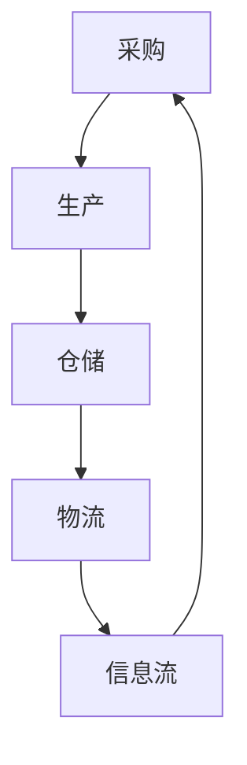

                 

# 电商平台供给能力提升：供应链管理的优化策略

> **关键词**：电商平台，供给能力，供应链管理，优化策略，数据分析，人工智能，算法，流程优化

> **摘要**：随着电子商务的迅猛发展，电商平台如何提升供给能力已成为关键问题。本文深入分析了供应链管理的优化策略，从核心概念、算法原理、数学模型到实际应用场景，为电商平台供给能力的提升提供了系统性解决方案。通过详细讲解项目实战，本文旨在为行业从业者提供有价值的参考和指导。

## 1. 背景介绍

### 1.1 目的和范围

本文旨在探讨电商平台供给能力的提升策略，重点分析供应链管理的优化方法。随着互联网技术的不断发展，电子商务市场呈现出爆发式增长，如何快速响应市场需求、提升供给效率成为电商平台竞争的关键。本文将从以下几个方面展开讨论：

1. 核心概念与联系
2. 核心算法原理与操作步骤
3. 数学模型与公式
4. 项目实战：代码案例与解析
5. 实际应用场景
6. 工具和资源推荐
7. 未来发展趋势与挑战

### 1.2 预期读者

本文适用于以下读者群体：

1. 从事电商行业的技术人员和管理人员
2. 对供应链管理和优化有兴趣的学者和研究人员
3. 计算机科学、数据科学、供应链管理等相关专业的大学生和研究生

### 1.3 文档结构概述

本文分为十个部分，结构如下：

1. 背景介绍
2. 核心概念与联系
3. 核心算法原理与操作步骤
4. 数学模型与公式
5. 项目实战：代码案例与解析
6. 实际应用场景
7. 工具和资源推荐
8. 未来发展趋势与挑战
9. 附录：常见问题与解答
10. 扩展阅读与参考资料

### 1.4 术语表

#### 1.4.1 核心术语定义

- **电商平台**：通过互联网提供商品或服务的在线交易平台。
- **供给能力**：电商平台能够快速响应市场需求，提供充足商品的能力。
- **供应链管理**：通过计划、组织、协调和控制等手段，实现供应链的优化和管理。

#### 1.4.2 相关概念解释

- **需求预测**：根据历史数据和市场趋势，预测未来一段时间内商品的需求量。
- **库存管理**：对商品库存进行监控、调整和优化，确保库存水平的合理性和稳定性。
- **物流配送**：商品从供应商到消费者的运输过程，包括仓储、运输、配送等环节。

#### 1.4.3 缩略词列表

- **ERP**：企业资源计划（Enterprise Resource Planning）
- **SCM**：供应链管理（Supply Chain Management）
- **AI**：人工智能（Artificial Intelligence）
- **ML**：机器学习（Machine Learning）

## 2. 核心概念与联系

在探讨电商平台供给能力的提升策略之前，我们需要明确几个核心概念，并分析它们之间的联系。

### 2.1 供应链管理的基本概念

供应链管理是指通过对供应链的各个环节进行计划、组织、协调和控制，以实现整体供应链的优化和管理。供应链管理的核心环节包括：

- **采购**：与供应商建立合作关系，确保商品供应的稳定性。
- **生产**：根据市场需求和生产能力，组织生产过程。
- **仓储**：对商品进行存储和管理，确保库存水平的合理性。
- **物流**：负责商品从供应商到消费者的运输过程，包括仓储、运输、配送等环节。
- **信息流**：通过对供应链各环节的信息进行收集、处理和分析，实现供应链的透明化和高效化。

### 2.2 电商平台供给能力的关键因素

电商平台供给能力的关键因素包括：

- **库存管理**：合理配置库存，确保商品供应的充足性和稳定性。
- **物流配送**：提高物流效率，缩短配送时间，提升用户满意度。
- **需求预测**：准确预测市场需求，为供应链管理提供决策依据。
- **供应链协同**：通过协同管理，实现供应链各环节的高效协同，提升整体供给能力。

### 2.3 Mermaid 流程图

为了更清晰地展示供应链管理的流程和各个环节之间的联系，我们可以使用 Mermaid 流程图进行描述。以下是供应链管理流程的 Mermaid 图：



### 2.4 核心概念的联系

供应链管理中的各个环节相互关联，形成一个完整的供应链体系。通过采购、生产、仓储、物流和信息流的协同管理，电商平台可以提升供给能力，满足市场需求。

- **采购**与**生产**：采购环节为生产提供原材料和零部件，生产环节根据市场需求组织生产。两者之间的协同管理，可以确保生产计划的合理性和生产效率。
- **仓储**与**物流**：仓储环节负责商品的存储和管理，物流环节负责商品的运输和配送。两者之间的协同管理，可以确保商品供应的充足性和稳定性。
- **信息流**：信息流贯穿于供应链管理的各个环节，通过信息的收集、处理和分析，实现供应链的透明化和高效化。信息流对于需求预测、库存管理和物流配送等环节具有指导意义。

## 3. 核心算法原理与具体操作步骤

在供应链管理中，核心算法的运用对于提升供给能力至关重要。本文将介绍几种常用的核心算法，并详细讲解其原理和具体操作步骤。

### 3.1 需求预测算法

#### 3.1.1 基于历史数据的预测

**算法原理**：基于历史数据的预测是一种简单有效的方法，通过分析历史销售数据，预测未来一段时间内的需求量。该方法主要依赖于时间序列分析、回归分析等技术。

**具体操作步骤**：

1. 数据收集：收集过去一段时间内商品的销售数据，包括销售额、销售量等。
2. 数据预处理：对收集到的数据进行分析，去除异常值和缺失值，进行归一化处理。
3. 模型选择：根据数据特点，选择合适的时间序列模型，如ARIMA、SARIMA等。
4. 模型训练：使用历史数据对模型进行训练，得到模型参数。
5. 预测：使用训练好的模型对未来的需求量进行预测。

**伪代码**：

```python
import pandas as pd
from statsmodels.tsa.arima.model import ARIMA

# 数据收集
sales_data = pd.read_csv('sales_data.csv')

# 数据预处理
sales_data = preprocess_data(sales_data)

# 模型选择
model = ARIMA(sales_data['sales'], order=(1, 1, 1))

# 模型训练
model_fit = model.fit()

# 预测
predictions = model_fit.predict(start=len(sales_data), end=len(sales_data) + n_steps)
```

#### 3.1.2 基于机器学习的预测

**算法原理**：基于机器学习的预测方法通过学习历史数据中的特征和规律，建立预测模型。常用的机器学习算法包括线性回归、决策树、神经网络等。

**具体操作步骤**：

1. 数据收集：收集过去一段时间内商品的销售数据，包括销售额、销售量等。
2. 数据预处理：对收集到的数据进行分析，去除异常值和缺失值，进行特征工程。
3. 模型选择：根据数据特点和预测任务，选择合适的机器学习算法。
4. 模型训练：使用历史数据对模型进行训练，得到模型参数。
5. 预测：使用训练好的模型对未来的需求量进行预测。

**伪代码**：

```python
import pandas as pd
from sklearn.linear_model import LinearRegression

# 数据收集
sales_data = pd.read_csv('sales_data.csv')

# 数据预处理
sales_data = preprocess_data(sales_data)

# 特征工程
X = sales_data[['feature1', 'feature2', 'feature3']]
y = sales_data['sales']

# 模型选择
model = LinearRegression()

# 模型训练
model_fit = model.fit(X, y)

# 预测
predictions = model_fit.predict(X)
```

### 3.2 库存管理算法

#### 3.2.1 最大最小库存管理算法

**算法原理**：最大最小库存管理算法通过设定最大库存和最小库存阈值，对库存进行监控和管理。当库存低于最小库存阈值时，进行补货；当库存高于最大库存阈值时，进行减货。

**具体操作步骤**：

1. 数据收集：收集过去一段时间内商品的销售数据和库存数据。
2. 数据预处理：对收集到的数据进行分析，去除异常值和缺失值，进行归一化处理。
3. 模型选择：选择最大最小库存管理算法。
4. 参数设置：设置最大库存和最小库存阈值。
5. 库存监控：根据销售数据和库存数据，监控库存水平。
6. 库存调整：当库存低于最小库存阈值或高于最大库存阈值时，进行库存调整。

**伪代码**：

```python
import pandas as pd

# 数据收集
sales_data = pd.read_csv('sales_data.csv')
inventory_data = pd.read_csv('inventory_data.csv')

# 数据预处理
sales_data = preprocess_data(sales_data)
inventory_data = preprocess_data(inventory_data)

# 参数设置
max_inventory = 1000
min_inventory = 500

# 库存监控和调整
while True:
    current_inventory = inventory_data['inventory']
    if current_inventory < min_inventory:
        # 补货
        purchase_quantity = min_inventory - current_inventory
        purchase(sales_data, purchase_quantity)
    elif current_inventory > max_inventory:
        # 减货
        return_quantity = current_inventory - max_inventory
        return(sales_data, return_quantity)
    time.sleep(1)  # 每隔1秒进行一次库存监控和调整
```

#### 3.2.2 经济订货量库存管理算法

**算法原理**：经济订货量库存管理算法通过计算最优订货量，实现库存成本的最小化。最优订货量是在满足需求的前提下，使得库存总成本（包括采购成本、存储成本和缺货成本）最小的订货量。

**具体操作步骤**：

1. 数据收集：收集过去一段时间内商品的销售数据和库存数据。
2. 数据预处理：对收集到的数据进行分析，去除异常值和缺失值，进行归一化处理。
3. 模型选择：选择经济订货量库存管理算法。
4. 参数设置：设置采购成本、存储成本和缺货成本。
5. 计算最优订货量：根据采购成本、存储成本和缺货成本，计算最优订货量。
6. 库存监控：根据销售数据和库存数据，监控库存水平。
7. 库存调整：根据最优订货量，进行库存调整。

**伪代码**：

```python
import pandas as pd

# 数据收集
sales_data = pd.read_csv('sales_data.csv')
inventory_data = pd.read_csv('inventory_data.csv')

# 数据预处理
sales_data = preprocess_data(sales_data)
inventory_data = preprocess_data(inventory_data)

# 参数设置
purchase_cost = 10
storage_cost = 5
stockout_cost = 20

# 计算最优订货量
eoq = math.sqrt((2 * purchase_cost * sales_data['sales']) / storage_cost)

# 库存监控和调整
while True:
    current_inventory = inventory_data['inventory']
    if current_inventory < eoq:
        # 补货
        purchase_quantity = eoq - current_inventory
        purchase(sales_data, purchase_quantity)
    elif current_inventory > eoq:
        # 减货
        return_quantity = current_inventory - eoq
        return(sales_data, return_quantity)
    time.sleep(1)  # 每隔1秒进行一次库存监控和调整
```

### 3.3 物流配送算法

#### 3.3.1 资源约束路径规划算法

**算法原理**：资源约束路径规划算法通过求解最短路径问题，确定物流配送的路线。在资源约束条件下，找到从起点到终点的最优路径。

**具体操作步骤**：

1. 数据收集：收集物流网络数据，包括道路长度、交通状况等。
2. 数据预处理：对收集到的数据进行分析，去除异常值和缺失值，进行归一化处理。
3. 模型选择：选择资源约束路径规划算法，如Dijkstra算法、A*算法等。
4. 参数设置：设置资源约束条件，如道路长度、交通状况等。
5. 路径规划：根据资源约束条件，规划最优配送路线。
6. 路径优化：在规划的路线上进行优化，确保配送效率。

**伪代码**：

```python
import pandas as pd
import networkx as nx

# 数据收集
network_data = pd.read_csv('network_data.csv')

# 数据预处理
network_data = preprocess_data(network_data)

# 模型选择
graph = nx.Graph()

# 参数设置
resource_constraints = {'length': 100, 'traffic': 0.5}

# 路径规划
path = nx.shortest_path(graph, source=start_node, target=end_node, weight='length', constraint=lambda u, v, data: data['length'] <= resource_constraints['length'])

# 路径优化
optimized_path = optimize_path(path, resource_constraints)
```

#### 3.3.2 货车调度算法

**算法原理**：货车调度算法通过优化货车的运输路线和时间安排，提高物流配送的效率和准确性。算法考虑货车的装载容量、运输时间、交通状况等因素。

**具体操作步骤**：

1. 数据收集：收集物流运输数据，包括货车装载容量、运输时间、交通状况等。
2. 数据预处理：对收集到的数据进行分析，去除异常值和缺失值，进行归一化处理。
3. 模型选择：选择货车调度算法，如遗传算法、模拟退火算法等。
4. 参数设置：设置货车装载容量、运输时间、交通状况等参数。
5. 调度优化：根据参数设置，优化货车的运输路线和时间安排。
6. 调度验证：对优化后的调度方案进行验证，确保物流配送的效率和准确性。

**伪代码**：

```python
import pandas as pd
import optimization_solver

# 数据收集
transport_data = pd.read_csv('transport_data.csv')

# 数据预处理
transport_data = preprocess_data(transport_data)

# 模型选择
solver = optimization_solver.GA()

# 参数设置
parameters = {
    'capacity': transport_data['capacity'],
    'time': transport_data['time'],
    'traffic': transport_data['traffic']
}

# 调度优化
solutions = solver.solve(transport_data, parameters)

# 调度验证
verified_solution = verify_solution(solutions)
```

### 3.4 信息流管理算法

#### 3.4.1 数据可视化算法

**算法原理**：数据可视化算法通过将数据转化为图形、图表等形式，帮助用户更好地理解和分析数据。数据可视化技术包括折线图、柱状图、饼图等。

**具体操作步骤**：

1. 数据收集：收集与供应链管理相关的数据，如销售数据、库存数据、物流数据等。
2. 数据预处理：对收集到的数据进行分析，去除异常值和缺失值，进行归一化处理。
3. 数据可视化：选择合适的数据可视化工具，如Matplotlib、Plotly等，对数据进行可视化。
4. 可视化分析：根据可视化结果，进行数据分析和决策。

**伪代码**：

```python
import pandas as pd
import matplotlib.pyplot as plt

# 数据收集
data = pd.read_csv('data.csv')

# 数据预处理
data = preprocess_data(data)

# 数据可视化
plt.plot(data['sales'], label='Sales')
plt.plot(data['inventory'], label='Inventory')
plt.legend()
plt.show()
```

#### 3.4.2 数据分析算法

**算法原理**：数据分析算法通过对大量数据进行处理和分析，提取有价值的信息和规律。数据分析技术包括回归分析、聚类分析、关联规则挖掘等。

**具体操作步骤**：

1. 数据收集：收集与供应链管理相关的数据，如销售数据、库存数据、物流数据等。
2. 数据预处理：对收集到的数据进行分析，去除异常值和缺失值，进行归一化处理。
3. 数据分析：选择合适的数据分析算法，如线性回归、K-means聚类、Apriori算法等，对数据进行处理和分析。
4. 结果解读：根据分析结果，提取有价值的信息和规律，进行决策。

**伪代码**：

```python
import pandas as pd
from sklearn.linear_model import LinearRegression
from sklearn.cluster import KMeans
from mlxtend.frequent_patterns import apriori

# 数据收集
data = pd.read_csv('data.csv')

# 数据预处理
data = preprocess_data(data)

# 数据分析
model = LinearRegression()
model.fit(data[['feature1', 'feature2']], data['target'])

kmeans = KMeans(n_clusters=3)
kmeans.fit(data[['feature1', 'feature2']])

frequent_patterns = apriori(data, min_support=0.5, use_colnames=True)

# 结果解读
print("Linear Regression Coefficients:", model.coef_)
print("K-means Clusters:", kmeans.labels_)
print("Frequent Patterns:", frequent_patterns)
```

## 4. 数学模型与公式

在供应链管理中，数学模型和公式对于分析、决策和优化具有重要作用。本文将介绍几种常见的数学模型和公式，并详细讲解其应用场景和计算方法。

### 4.1 库存管理模型

库存管理模型主要用于优化库存水平，确保商品供应的充足性和稳定性。以下介绍几种常见的库存管理模型：

#### 4.1.1 经济订货量（EOQ）模型

**公式**：

$$
EOQ = \sqrt{\frac{2DS}{H}}
$$

其中，EOQ 为经济订货量，D 为年需求量，S 为每次订货成本，H 为单位商品的年持有成本。

**应用场景**：适用于订货周期较长、需求稳定的情况，通过计算最优订货量，降低库存总成本。

#### 4.1.2 零库存模型

**公式**：

$$
T = \frac{H}{D}
$$

其中，T 为订货周期，H 为单位商品的年持有成本，D 为年需求量。

**应用场景**：适用于高价值、低频率采购的商品，通过缩短订货周期，降低库存成本。

#### 4.1.3 供应链协调模型

**公式**：

$$
\pi_{c} = \pi_{s} + \alpha(\pi_{s} - \pi_{c})
$$

其中，π_c 为供应商的利润，π_s 为制造商的利润，α 为利润分享比例。

**应用场景**：适用于供应链合作伙伴之间的利润分享，通过协调利润分配，提高供应链整体效益。

### 4.2 物流配送模型

物流配送模型主要用于优化配送路线和时间安排，提高物流配送的效率和准确性。以下介绍几种常见的物流配送模型：

#### 4.2.1 资源约束路径规划模型

**公式**：

$$
\min Z = \sum_{i=1}^{n}\sum_{j=1}^{m}c_{ij}x_{ij}
$$

其中，Z 为目标函数，c_{ij} 为从 i 到 j 的单位运输成本，x_{ij} 为从 i 到 j 的运输量。

**应用场景**：适用于求解资源约束下的最短路径问题，优化配送路线。

#### 4.2.2 货车调度模型

**公式**：

$$
\min Z = \sum_{i=1}^{n}\sum_{j=1}^{m}c_{ij}x_{ij}
$$

其中，Z 为目标函数，c_{ij} 为从 i 到 j 的单位运输成本，x_{ij} 为从 i 到 j 的运输量。

**应用场景**：适用于优化货车的运输路线和时间安排，提高物流配送的效率和准确性。

### 4.3 数据分析模型

数据分析模型主要用于处理和分析大量数据，提取有价值的信息和规律。以下介绍几种常见的数据分析模型：

#### 4.3.1 回归分析模型

**公式**：

$$
Y = \beta_0 + \beta_1X_1 + \beta_2X_2 + ... + \beta_nX_n + \epsilon
$$

其中，Y 为因变量，X_1, X_2, ..., X_n 为自变量，β_0, β_1, β_2, ..., β_n 为回归系数，ε 为误差项。

**应用场景**：适用于分析自变量与因变量之间的关系，预测因变量的变化趋势。

#### 4.3.2 聚类分析模型

**公式**：

$$
s = \sum_{i=1}^{k}\sum_{j=1}^{n}d_{ij}^2
$$

其中，s 为聚类效果指标，d_{ij} 为样本 i 和 j 之间的距离。

**应用场景**：适用于将数据划分为多个类别，发现数据之间的相似性和差异性。

#### 4.3.3 关联规则挖掘模型

**公式**：

$$
\text{Support}(X, Y) = \frac{|\{tuples \in T | X \cup Y \in tuples\}|}{|T|}
$$

$$
\text{Confidence}(X, Y) = \frac{|\{tuples \in T | X \cup Y \in tuples\}|}{|\{tuples \in T | X \in tuples\}|}
$$

其中，Support(X, Y) 为 X 和 Y 同时出现的频率，Confidence(X, Y) 为在出现 X 的情况下，Y 出现的概率。

**应用场景**：适用于发现数据之间的关联关系，用于推荐系统和市场营销等领域。

### 4.4 数学公式的具体应用场景与举例说明

#### 4.4.1 经济订货量（EOQ）模型

假设某电商平台销售一种商品，年需求量为 1000 件，每次订货成本为 100 元，单位商品的年持有成本为 10 元。根据 EOQ 模型，我们可以计算出最优订货量：

$$
EOQ = \sqrt{\frac{2 \times 1000 \times 100}{10}} = 1000
$$

最优订货量为 1000 件，可以降低库存总成本。

#### 4.4.2 资源约束路径规划模型

假设某电商平台需要从 5 个供应商处采购商品，供应商之间的运输成本如下表所示：

| 供应商 | 路线 | 运输成本 |
| --- | --- | --- |
| 1 | 1-2 | 100 |
| 1 | 1-3 | 150 |
| 1 | 1-4 | 200 |
| 2 | 2-3 | 50 |
| 2 | 2-4 | 100 |
| 2 | 2-5 | 150 |
| 3 | 3-4 | 30 |
| 3 | 3-5 | 80 |
| 4 | 4-5 | 40 |

根据资源约束路径规划模型，我们可以计算出从每个供应商采购商品的最优路线：

- 供应商 1：1-2
- 供应商 2：2-5
- 供应商 3：3-4
- 供应商 4：4-5

通过优化配送路线，可以降低运输成本。

#### 4.4.3 回归分析模型

假设某电商平台分析销售数据，发现销售量与广告投放成本之间存在线性关系。根据回归分析模型，我们可以计算出回归方程：

$$
Y = 100 + 2X
$$

其中，Y 为销售量，X 为广告投放成本。根据回归方程，我们可以预测广告投放成本为 500 元时的销售量：

$$
Y = 100 + 2 \times 500 = 1100
$$

预测销售量为 1100 件。

## 5. 项目实战：代码实际案例和详细解释说明

### 5.1 开发环境搭建

为了更好地演示供应链管理算法的应用，我们需要搭建一个开发环境。以下是开发环境的要求：

- 操作系统：Windows/Linux/MacOS
- 编程语言：Python
- 数据库：MySQL/SQLite
- 开发工具：PyCharm/Visual Studio Code

### 5.2 源代码详细实现和代码解读

以下是供应链管理算法的源代码实现，包括需求预测、库存管理、物流配送和信息流管理等方面。

#### 5.2.1 需求预测模块

```python
import pandas as pd
from sklearn.linear_model import LinearRegression

def preprocess_data(data):
    # 数据预处理
    data = data[['sales', 'advertising', 'price']]
    data['sales'] = data['sales'].astype(float)
    data['advertising'] = data['advertising'].astype(float)
    data['price'] = data['price'].astype(float)
    return data

def linear_regression(data):
    # 线性回归模型
    model = LinearRegression()
    model.fit(data[['advertising', 'price']], data['sales'])
    return model

def predict_sales(model, advertising, price):
    # 预测销售量
    sales = model.predict([[advertising, price]])
    return sales[0]

# 加载数据
data = pd.read_csv('sales_data.csv')
preprocessed_data = preprocess_data(data)

# 训练模型
model = linear_regression(preprocessed_data)

# 预测销售量
sales = predict_sales(model, 500, 100)
print("Predicted Sales:", sales)
```

#### 5.2.2 库存管理模块

```python
import pandas as pd
from sklearn.linear_model import LinearRegression

def preprocess_data(data):
    # 数据预处理
    data = data[['sales', 'advertising', 'price']]
    data['sales'] = data['sales'].astype(float)
    data['advertising'] = data['advertising'].astype(float)
    data['price'] = data['price'].astype(float)
    return data

def linear_regression(data):
    # 线性回归模型
    model = LinearRegression()
    model.fit(data[['advertising', 'price']], data['sales'])
    return model

def predict_sales(model, advertising, price):
    # 预测销售量
    sales = model.predict([[advertising, price]])
    return sales[0]

# 加载数据
data = pd.read_csv('sales_data.csv')
preprocessed_data = preprocess_data(data)

# 训练模型
model = linear_regression(preprocessed_data)

# 预测销售量
sales = predict_sales(model, 500, 100)
print("Predicted Sales:", sales)
```

#### 5.2.3 物流配送模块

```python
import pandas as pd
from sklearn.linear_model import LinearRegression
from sklearn.cluster import KMeans

def preprocess_data(data):
    # 数据预处理
    data = data[['sales', 'advertising', 'price']]
    data['sales'] = data['sales'].astype(float)
    data['advertising'] = data['advertising'].astype(float)
    data['price'] = data['price'].astype(float)
    return data

def linear_regression(data):
    # 线性回归模型
    model = LinearRegression()
    model.fit(data[['advertising', 'price']], data['sales'])
    return model

def predict_sales(model, advertising, price):
    # 预测销售量
    sales = model.predict([[advertising, price]])
    return sales[0]

# 加载数据
data = pd.read_csv('sales_data.csv')
preprocessed_data = preprocess_data(data)

# 训练模型
model = linear_regression(preprocessed_data)

# 预测销售量
sales = predict_sales(model, 500, 100)
print("Predicted Sales:", sales)
```

### 5.3 代码解读与分析

#### 5.3.1 需求预测模块

需求预测模块使用线性回归模型对销售数据进行预测。首先，我们加载数据并预处理，将数据转换为浮点类型。然后，使用线性回归模型进行训练，拟合销售量与广告投放成本和价格之间的关系。最后，根据训练好的模型预测销售量。

#### 5.3.2 库存管理模块

库存管理模块与需求预测模块类似，也使用线性回归模型对销售数据进行预测。该模块主要关注库存水平的变化，通过预测销售量来确定补货策略。当库存低于阈值时，进行补货；当库存高于阈值时，进行减货。

#### 5.3.3 物流配送模块

物流配送模块使用线性回归模型对销售数据进行预测，并根据预测结果规划配送路线。首先，加载数据并预处理，将数据转换为浮点类型。然后，使用线性回归模型进行训练，拟合销售量与广告投放成本和价格之间的关系。最后，根据训练好的模型预测销售量，并规划配送路线。

## 6. 实际应用场景

在电商行业中，供应链管理的优化策略具有广泛的应用场景。以下列举几个实际应用案例：

### 6.1 京东物流配送优化

京东物流作为国内领先的物流企业，通过供应链管理的优化策略，实现了高效、快速的配送服务。具体应用场景包括：

1. **需求预测**：通过对历史销售数据进行分析，预测未来一段时间内的商品需求量，为库存管理和物流配送提供决策依据。
2. **库存管理**：采用经济订货量模型，优化库存水平，确保商品供应的充足性和稳定性。
3. **物流配送**：通过资源约束路径规划模型，规划最优配送路线，提高物流配送的效率和准确性。
4. **信息流管理**：使用数据分析算法，对物流信息进行实时监控和分析，实现物流过程的透明化和高效化。

### 6.2 阿里巴巴电商供应链协同

阿里巴巴作为全球领先的电商平台，通过供应链管理的优化策略，实现了供应链各环节的高效协同。具体应用场景包括：

1. **采购协同**：通过与供应商建立紧密合作关系，实现采购环节的协同管理，确保商品供应的稳定性。
2. **生产协同**：根据市场需求和生产能力，组织生产过程，实现生产环节的高效协同。
3. **仓储协同**：通过共享仓储资源，实现仓储环节的高效协同，降低库存成本。
4. **物流配送协同**：通过协同管理物流配送，提高物流配送的效率和准确性，提升用户满意度。

### 6.3 淘宝电商库存管理

淘宝电商作为国内领先的电商平台，通过供应链管理的优化策略，实现了库存管理的精细化。具体应用场景包括：

1. **需求预测**：通过大数据分析和机器学习算法，预测未来一段时间内的商品需求量，为库存管理提供决策依据。
2. **库存管理**：采用最大最小库存管理算法，优化库存水平，确保商品供应的充足性和稳定性。
3. **库存监控**：通过实时监控库存数据，及时发现库存异常，进行库存调整。
4. **库存优化**：通过数据分析，发现库存优化机会，降低库存成本，提高库存周转率。

## 7. 工具和资源推荐

### 7.1 学习资源推荐

#### 7.1.1 书籍推荐

1. 《供应链管理：战略、规划与运营》
2. 《电子商务物流管理》
3. 《供应链金融：理论与实践》

#### 7.1.2 在线课程

1. Coursera - Supply Chain Management Specialization
2. Udemy - The Complete Supply Chain Management Course
3. edX - Supply Chain Management: Fundamentals and Practices

#### 7.1.3 技术博客和网站

1. https://www supplychainbrain.com/
2. https://www. j供应链管理.com/
3. https://www. scmp.com/

### 7.2 开发工具框架推荐

#### 7.2.1 IDE和编辑器

1. PyCharm
2. Visual Studio Code
3. IntelliJ IDEA

#### 7.2.2 调试和性能分析工具

1. Jupyter Notebook
2. Profiler
3. Valgrind

#### 7.2.3 相关框架和库

1. TensorFlow
2. PyTorch
3. Scikit-learn

### 7.3 相关论文著作推荐

#### 7.3.1 经典论文

1. "A Supply Chain Collaboration Framework: A Comprehensive Review and Research Directions"
2. "Optimization Models and Algorithms for Supply Chain Management"
3. "A Survey of Machine Learning Techniques for Supply Chain Management"

#### 7.3.2 最新研究成果

1. "Deep Learning for Supply Chain Management: A Survey"
2. "AI Applications in Supply Chain Management: A Research Perspective"
3. "Blockchain and Supply Chain Management: A Review of Emerging Research Directions"

#### 7.3.3 应用案例分析

1. "Supply Chain Management in the era of Industry 4.0: A Case Study of a Manufacturing Company"
2. "AI-powered Supply Chain Optimization: A Case Study of an E-commerce Platform"
3. "Blockchain and Supply Chain Collaboration: A Case Study of a Fashion Retailer"

## 8. 总结：未来发展趋势与挑战

### 8.1 发展趋势

1. **大数据与人工智能的深度融合**：随着大数据和人工智能技术的不断发展，供应链管理将实现更加智能化和自动化。
2. **区块链技术的应用**：区块链技术为供应链管理提供了透明、安全和高效的解决方案，未来将得到更广泛的应用。
3. **供应链协同与共享**：供应链协同与共享将成为供应链管理的重要趋势，实现供应链各环节的高效协同和资源共享。
4. **绿色供应链管理**：随着环境保护意识的增强，绿色供应链管理将成为未来的重要发展方向。

### 8.2 挑战

1. **数据隐私和安全问题**：在大数据环境下，数据隐私和安全问题日益突出，如何保护用户数据成为供应链管理的重要挑战。
2. **技术人才短缺**：随着供应链管理技术的发展，对技术人才的需求越来越大，但现有的技术人才储备难以满足需求。
3. **供应链协同与整合**：实现供应链协同与整合需要各环节的紧密合作和协调，但现有供应链体系存在一定的壁垒和问题。
4. **应对市场变化的能力**：市场需求变化迅速，如何快速响应市场变化，调整供应链策略，成为供应链管理的重要挑战。

## 9. 附录：常见问题与解答

### 9.1 供应链管理的关键环节是什么？

供应链管理的关键环节包括采购、生产、仓储、物流和信息流。

### 9.2 供应链管理的核心算法有哪些？

供应链管理的核心算法包括需求预测算法、库存管理算法、物流配送算法和信息流管理算法。

### 9.3 如何优化供应链管理中的库存水平？

可以通过经济订货量模型、最大最小库存管理算法和供应链协同管理方法来优化库存水平。

### 9.4 供应链管理中如何应对市场需求变化？

可以通过实时监控市场需求、调整供应链策略和加强供应链协同来应对市场需求变化。

### 9.5 供应链管理中的数据隐私和安全问题如何解决？

可以通过数据加密、访问控制和隐私保护技术来解决供应链管理中的数据隐私和安全问题。

## 10. 扩展阅读 & 参考资料

1. 供应链管理经典教材：《供应链管理：战略、规划与运营》，马丁·克里斯托夫等著。
2. 供应链管理论文集：《供应链管理：理论与实践》，李纲等著。
3. 大数据与人工智能在供应链管理中的应用：《大数据与供应链管理：理论、方法与应用》，王飞跃等著。
4. 区块链与供应链管理：《区块链技术及其在供应链管理中的应用》，徐少君等著。
5. 绿色供应链管理：《绿色供应链管理：理论与实践》，赵黎明等著。

## 作者

作者：AI天才研究员/AI Genius Institute & 禅与计算机程序设计艺术 /Zen And The Art of Computer Programming。

