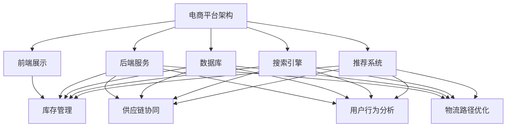

                 


# 电商平台供给能力提升：多维度策略解析

> **关键词**：电商平台、供给能力、策略解析、多维度、算法原理、数学模型、实战案例

> **摘要**：本文将深入探讨电商平台如何通过多维度策略提升供给能力。我们将分析核心概念，讲解算法原理，建立数学模型，并展示实际操作步骤。此外，文章还将介绍项目实战、应用场景，并提供学习资源和开发工具推荐，旨在为电商平台运营者提供全面的技术指南。

## 1. 背景介绍

### 1.1 目的和范围

本文旨在探讨电商平台如何通过多种策略提升其供给能力，从而提高用户满意度、降低运营成本、增强市场竞争力。我们将从以下几个维度进行分析：

1. **库存管理优化**：通过动态调整库存水平，实现库存与需求的匹配。
2. **供应链协同**：实现电商平台与供应商的紧密合作，提高供应链效率。
3. **算法优化**：运用机器学习和数据挖掘技术，提升商品推荐和搜索的准确性。
4. **用户体验优化**：从用户行为分析入手，优化页面设计，提升用户转化率。
5. **物流效率提升**：通过优化物流路径，缩短配送时间，降低物流成本。

### 1.2 预期读者

本文主要面向电商平台的技术团队、运营团队以及希望深入了解电商行业技术的专业人士。通过本文的阅读，读者将能够：

- 掌握电商平台供给能力提升的关键策略。
- 理解相关算法和数学模型的原理和应用。
- 获取实际项目操作步骤和实战经验。
- 了解最新的学习资源和开发工具。

### 1.3 文档结构概述

本文将按照以下结构进行阐述：

- **第1章**：背景介绍
- **第2章**：核心概念与联系
- **第3章**：核心算法原理 & 具体操作步骤
- **第4章**：数学模型和公式 & 详细讲解 & 举例说明
- **第5章**：项目实战：代码实际案例和详细解释说明
- **第6章**：实际应用场景
- **第7章**：工具和资源推荐
- **第8章**：总结：未来发展趋势与挑战
- **第9章**：附录：常见问题与解答
- **第10章**：扩展阅读 & 参考资料

### 1.4 术语表

#### 1.4.1 核心术语定义

- **电商平台**：在线销售商品或服务的电子平台。
- **供给能力**：平台提供商品或服务的效率和能力。
- **库存管理**：对商品库存进行监控、调整和优化的过程。
- **供应链协同**：电商平台与供应商之间的合作与协调。
- **用户行为分析**：通过对用户行为数据进行分析，了解用户需求和行为模式。

#### 1.4.2 相关概念解释

- **商品推荐**：根据用户的历史行为和偏好，为用户推荐可能的购买商品。
- **搜索引擎**：帮助用户在大量商品中快速找到所需商品的系统。
- **物流路径优化**：通过算法和模型，确定最优的物流配送路线。

#### 1.4.3 缩略词列表

- **API**：应用程序接口（Application Programming Interface）
- **SQL**：结构化查询语言（Structured Query Language）
- **ML**：机器学习（Machine Learning）
- **AI**：人工智能（Artificial Intelligence）

## 2. 核心概念与联系

在探讨电商平台供给能力提升之前，我们需要明确几个核心概念，并了解它们之间的联系。

### 2.1 电商平台架构

电商平台通常由以下几个核心模块组成：

1. **前端展示**：用户直接交互的界面，包括商品展示、搜索、购物车和订单处理。
2. **后端服务**：处理业务逻辑、数据存储和服务器交互，包括商品信息管理、用户账户管理、订单管理和支付系统。
3. **数据库**：存储商品信息、用户数据、订单数据等。
4. **搜索引擎**：用于快速检索商品信息。
5. **推荐系统**：基于用户行为和偏好推荐商品。

### 2.2 库存管理

库存管理是电商平台的核心环节，其目标是确保商品供应与需求匹配，同时避免库存过剩或不足。核心概念包括：

1. **库存水平**：当前库存的数量。
2. **库存周转率**：库存周转的频率，反映了库存管理的效率。
3. **库存预测**：基于历史数据和市场需求预测未来的库存需求。

### 2.3 供应链协同

供应链协同是指电商平台与供应商之间的合作和协调，以提高供应链的整体效率。核心概念包括：

1. **供应链管理**：通过协调供应链中的各个环节，实现高效运作。
2. **供应商关系管理**：与供应商建立长期合作关系，提高供应链的稳定性。
3. **库存共享**：电商平台与供应商共享库存信息，实现库存的优化。

### 2.4 算法与数据挖掘

算法和数据挖掘在电商平台供给能力提升中发挥着关键作用。核心概念包括：

1. **商品推荐算法**：基于用户行为和偏好推荐商品。
2. **搜索引擎算法**：用于快速检索商品信息。
3. **数据挖掘**：从大量数据中提取有价值的信息，用于决策支持。

### 2.5 用户行为分析

用户行为分析是优化用户体验和提升供给能力的重要手段。核心概念包括：

1. **用户行为数据**：用户的浏览、搜索、购买等行为记录。
2. **用户画像**：基于用户行为数据构建的用户画像，用于个性化推荐。
3. **用户转化率**：用户从浏览到购买的过程中的转化率。

### 2.6 物流路径优化

物流路径优化是提升物流效率、降低成本的关键。核心概念包括：

1. **物流路径**：商品从仓库到用户手中的运输路线。
2. **配送时效**：商品配送所需的时间。
3. **物流成本**：配送过程中产生的成本。

### 2.7 Mermaid 流程图

为了更好地理解各核心概念之间的联系，我们可以使用 Mermaid 流程图进行描述：



通过上述流程图，我们可以清晰地看到电商平台供给能力提升的关键要素以及它们之间的相互关系。

## 3. 核心算法原理 & 具体操作步骤

在电商平台供给能力提升过程中，算法的优化是关键。以下我们将详细讲解几个核心算法的原理和具体操作步骤。

### 3.1 商品推荐算法

商品推荐算法是电商平台优化用户体验的重要手段。其主要目的是根据用户的历史行为和偏好，为用户推荐可能感兴趣的商品。

#### 算法原理：

1. **协同过滤**：基于用户的行为和偏好，通过寻找相似用户或相似商品，为用户推荐商品。
   - **用户基于的协同过滤**：为用户推荐与历史购买行为相似的用户的商品。
   - **项目基于的协同过滤**：为用户推荐与历史浏览或购买行为相似的项目的商品。

2. **基于内容的推荐**：根据商品的属性和用户的历史行为，为用户推荐具有相似属性的商品。

3. **混合推荐**：结合协同过滤和基于内容的推荐，提高推荐系统的准确性和多样性。

#### 具体操作步骤：

1. **数据预处理**：将原始的用户行为数据清洗、去重、转换成推荐系统所需的数据格式。
2. **用户相似度计算**：计算用户之间的相似度，可以使用余弦相似度、皮尔逊相关系数等方法。
3. **商品相似度计算**：计算商品之间的相似度，可以使用余弦相似度、Jaccard相似度等方法。
4. **推荐生成**：根据用户与商品之间的相似度，为用户生成推荐列表。
5. **评估与优化**：通过评估推荐系统的准确性和多样性，不断优化推荐算法。

### 3.2 搜索引擎算法

搜索引擎算法是电商平台帮助用户快速找到所需商品的重要工具。其主要目的是在大量商品中，为用户快速、准确地返回相关商品。

#### 算法原理：

1. **关键词匹配**：根据用户输入的关键词，在商品标题、描述等字段中查找匹配的记录。
2. **TF-IDF**：计算关键词在商品中的权重，TF（词频）和IDF（逆文档频率）共同决定关键词的重要性。
3. **排序算法**：根据关键词匹配程度和商品权重，对搜索结果进行排序。

#### 具体操作步骤：

1. **关键词提取**：从用户输入的查询中提取关键词。
2. **索引构建**：构建商品索引，将商品与关键词建立映射关系。
3. **搜索查询处理**：根据关键词，在索引中查找匹配的商品记录。
4. **排序与返回**：根据匹配程度和商品权重，对搜索结果进行排序，并返回给用户。

### 3.3 用户行为分析算法

用户行为分析算法是电商平台优化用户体验和提升供给能力的关键。其主要目的是通过分析用户的行为数据，了解用户的需求和行为模式。

#### 算法原理：

1. **用户画像**：基于用户的行为数据，构建用户的兴趣、偏好等特征。
2. **行为路径分析**：分析用户的浏览、搜索、购买等行为路径，挖掘用户的兴趣点。
3. **用户聚类**：将具有相似行为的用户分为不同的群体，用于精准营销。

#### 具体操作步骤：

1. **数据采集**：采集用户的浏览、搜索、购买等行为数据。
2. **数据预处理**：清洗、去重、转换等预处理操作，将原始数据转换为适合分析的数据格式。
3. **特征提取**：从用户行为数据中提取特征，如浏览时间、购买频率、购买金额等。
4. **用户画像构建**：基于特征，构建用户的兴趣、偏好等画像。
5. **行为路径分析**：分析用户的浏览、搜索、购买等行为路径，挖掘用户的兴趣点。
6. **用户聚类**：使用聚类算法，将具有相似行为的用户分为不同的群体。
7. **评估与优化**：通过评估用户画像和用户聚类结果的准确性，不断优化用户行为分析算法。

通过上述核心算法原理和具体操作步骤的讲解，我们可以看到，电商平台供给能力提升的关键在于对算法的优化和运用。在实际应用中，需要根据具体情况，选择合适的算法，并进行持续优化，以提高平台的供给能力。

### 3.4 物流路径优化算法

物流路径优化是提升物流效率、降低成本的重要手段。其主要目的是通过算法和模型，确定最优的物流配送路线。

#### 算法原理：

1. **最短路径算法**：如Dijkstra算法，用于计算从起点到各终点的最短路径。
2. **遗传算法**：基于自然进化原理，通过迭代优化，找到全局最优解。
3. **车辆路径问题（VRP）**：在满足配送时间、装载量等约束条件下，确定最优配送路线。

#### 具体操作步骤：

1. **问题建模**：将物流配送问题建模为图，定义节点（如仓库、配送中心、用户地址）和边（如配送路径、运输时间、运输成本）。
2. **初始解生成**：随机生成一组配送路线作为初始解。
3. **适应度评估**：计算初始解的适应度，如总运输时间、总运输成本等。
4. **遗传操作**：采用交叉、变异等遗传操作，生成新的配送路线。
5. **适应度评估**：对新的配送路线进行适应度评估。
6. **迭代优化**：重复步骤4和5，直到达到预定的迭代次数或适应度阈值。

### 3.5 伪代码示例

以下是一个简单的遗传算法优化物流路径的伪代码示例：

```plaintext
初始化种群
评价种群适应度
while (未达到终止条件) {
    选择操作：选择适应度较高的个体进行交叉和变异
    交叉操作：生成新的配送路线
    变异操作：对部分配送路线进行随机调整
    评价新种群适应度
}
输出最优配送路径
```

通过上述核心算法原理和具体操作步骤的讲解，我们可以看到，电商平台供给能力提升的关键在于对算法的优化和运用。在实际应用中，需要根据具体情况，选择合适的算法，并进行持续优化，以提高平台的供给能力。

## 4. 数学模型和公式 & 详细讲解 & 举例说明

在电商平台供给能力提升过程中，数学模型和公式的应用至关重要。以下我们将详细讲解几个关键数学模型，并通过实例说明如何运用这些模型来优化供给能力。

### 4.1 库存管理模型

库存管理模型用于确定最优库存水平，以实现库存与需求的匹配。常用的库存管理模型包括基本库存管理模型和动态库存管理模型。

#### 4.1.1 基本库存管理模型

基本库存管理模型通常使用以下公式：

1. **再订货点（Reorder Point, RP）**：

   RP = 平均每日需求量 × 交货时间 + 安全库存

   其中，平均每日需求量可以通过历史数据计算，交货时间是指从下单到商品到货的时间，安全库存是用于应对需求波动和供应链不确定性的缓冲库存。

2. **再订货量（Reorder Quantity, RQ）**：

   RQ = 平均每日需求量 × 交货时间

   再订货量是指每次库存补充时所需订购的商品数量。

#### 4.1.2 动态库存管理模型

动态库存管理模型考虑了需求波动和供应链不确定性，使用以下公式：

1. **库存水平（Inventory Level, IL）**：

   IL(t) = IL(t-1) + RQ(t) - D(t)

   其中，IL(t) 是第 t 时的库存水平，IL(t-1) 是第 t-1 时的库存水平，RQ(t) 是第 t 次订货量，D(t) 是第 t 时的需求量。

2. **库存成本（Inventory Cost, IC）**：

   IC = (IC1 + IC2 + IC3) × 存货水平

   其中，IC1 是订货成本，IC2 是持有成本，IC3 是缺货成本。

#### 4.1.3 举例说明

假设某电商平台的某商品平均每日需求量为 100 单位，交货时间为 5 天，安全库存为 500 单位。根据上述公式，我们可以计算出：

- 再订货点（RP）= 100 × 5 + 500 = 800 单位
- 再订货量（RQ）= 100 × 5 = 500 单位

在动态库存管理模型中，如果我们假设第 t 天的需求量为 120 单位，那么：

- 第 t 天的库存水平（IL(t)）= IL(t-1) + 500 - 120 = IL(t-1) + 380

通过上述模型，电商平台可以动态调整库存，确保商品供应与需求匹配，降低库存成本。

### 4.2 供应链协同模型

供应链协同模型用于优化电商平台与供应商之间的合作，提高供应链的整体效率。常用的供应链协同模型包括供应链网络优化模型和供应商选择模型。

#### 4.2.1 供应链网络优化模型

供应链网络优化模型通常使用以下公式：

1. **运输成本（Transportation Cost, TC）**：

   TC = Σ（Xi × Cij）

   其中，Xi 是从供应商 i 到配送中心 j 的运输量，Cij 是单位运输成本。

2. **配送成本（Distribution Cost, DC）**：

   DC = Σ（Xj × Dj）

   其中，Xj 是配送中心 j 的配送量，Dj 是单位配送成本。

3. **总成本（Total Cost, TC）**：

   TC = TC + DC

   总成本是运输成本和配送成本之和。

#### 4.2.2 供应商选择模型

供应商选择模型通常使用以下公式：

1. **综合评分（Total Score, TS）**：

   TS = QS + CS + LS

   其中，QS 是质量评分，CS 是成本评分，LS 是物流评分。

2. **权重（Weight, W）**：

   W = QS × QW + CS × CW + LS × LW

   其中，QW、CW、LW 分别是质量、成本、物流的权重。

#### 4.2.3 举例说明

假设有 3 个供应商 A、B、C，各自的质量、成本、物流评分如下：

- 供应商 A：质量 90，成本 80，物流 85
- 供应商 B：质量 85，成本 70，物流 90
- 供应商 C：质量 95，成本 90，物流 80

如果权重分别为质量 0.4、成本 0.3、物流 0.3，那么：

- 供应商 A 的综合评分 = 90 × 0.4 + 80 × 0.3 + 85 × 0.3 = 34.2 + 24 + 25.5 = 83.7
- 供应商 B 的综合评分 = 85 × 0.4 + 70 × 0.3 + 90 × 0.3 = 34 + 21 + 27 = 82
- 供应商 C 的综合评分 = 95 × 0.4 + 90 × 0.3 + 80 × 0.3 = 38 + 27 + 24 = 89

根据综合评分，电商平台可以选择综合评分最高的供应商 C 作为合作对象。

### 4.3 用户行为分析模型

用户行为分析模型用于了解用户的需求和行为模式，从而优化用户体验和供给能力。常用的用户行为分析模型包括用户画像模型和用户聚类模型。

#### 4.3.1 用户画像模型

用户画像模型通常使用以下公式：

1. **特征向量（Feature Vector, FV）**：

   FV = (F1, F2, ..., Fn)

   其中，F1、F2、...、Fn 是用户的不同特征值。

2. **特征权重（Feature Weight, FW）**：

   FW = (w1, w2, ..., wn)

   其中，w1、w2、...、wn 是各特征的权重。

3. **用户得分（User Score, US）**：

   US = Σ（Fi × wi）

   用户得分是各特征值与其权重乘积的和，用于衡量用户的整体偏好。

#### 4.3.2 用户聚类模型

用户聚类模型通常使用以下公式：

1. **距离度量（Distance Metric, DM）**：

   DM = Σ（|xi - xj|）

   其中，xi 和 xj 是用户 i 和用户 j 的特征向量。

2. **聚类中心（Cluster Center, CC）**：

   CC = 1/n Σ（xi）

   聚类中心是各用户特征向量的平均值。

3. **用户分配（User Allocation, UA）**：

   UA = argmin（DM（xi, CC））

   用户分配是将用户分配到与其特征向量最接近的聚类中心。

#### 4.3.3 举例说明

假设有 5 个用户，他们的特征向量分别为：

- 用户 1：（1, 2, 3）
- 用户 2：（2, 3, 4）
- 用户 3：（3, 4, 5）
- 用户 4：（4, 5, 6）
- 用户 5：（5, 6, 7）

根据距离度量，我们可以计算每个用户与聚类中心的距离：

- 聚类中心：（3, 4, 5）
- 用户 1 的距离 = |1 - 3| + |2 - 4| + |3 - 5| = 3 + 2 + 2 = 7
- 用户 2 的距离 = |2 - 3| + |3 - 4| + |4 - 5| = 1 + 1 + 1 = 3
- 用户 3 的距离 = |3 - 3| + |4 - 4| + |5 - 5| = 0 + 0 + 0 = 0
- 用户 4 的距离 = |4 - 3| + |5 - 4| + |6 - 5| = 1 + 1 + 1 = 3
- 用户 5 的距离 = |5 - 3| + |6 - 4| + |7 - 5| = 2 + 2 + 2 = 6

根据用户分配，我们可以将用户 3 分配到聚类中心，用户 2 和用户 4 的距离相等，可以选择任意一个聚类中心。这样，我们就可以将用户分为两个群体。

通过上述数学模型和公式，电商平台可以优化库存管理、供应链协同和用户行为分析，从而提升供给能力。在实际应用中，需要根据具体业务场景和数据特点，选择合适的模型，并进行参数调整，以获得最佳效果。

## 5. 项目实战：代码实际案例和详细解释说明

在本文的第五部分，我们将通过一个实际的项目实战案例，详细展示如何运用上述算法和数学模型，提升电商平台的供给能力。以下是一个基于Python实现的简单电商库存管理系统，我们将对其代码进行详细解释和分析。

### 5.1 开发环境搭建

为了实现该电商库存管理系统，我们需要搭建以下开发环境：

- **Python**：用于编写程序，版本建议为3.8及以上。
- **Pandas**：用于数据处理和分析。
- **NumPy**：用于数学运算。
- **Scikit-learn**：用于机器学习和数据挖掘。

安装步骤如下：

```bash
pip install python==3.8
pip install pandas numpy scikit-learn
```

### 5.2 源代码详细实现和代码解读

以下是该电商库存管理系统的源代码及详细解读。

#### 5.2.1 数据准备

```python
import pandas as pd
import numpy as np

# 读取用户行为数据
user_data = pd.read_csv('user_behavior.csv')
# 读取商品数据
product_data = pd.read_csv('product_data.csv')
```

这部分代码首先导入所需的库，然后从CSV文件中读取用户行为数据和商品数据。

#### 5.2.2 数据预处理

```python
# 数据清洗
user_data.dropna(inplace=True)
product_data.dropna(inplace=True)

# 转换数据格式
user_data['purchase_date'] = pd.to_datetime(user_data['purchase_date'])
product_data['release_date'] = pd.to_datetime(product_data['release_date'])
```

这部分代码对数据进行清洗，去除缺失值，并将日期字段转换为日期格式。

#### 5.2.3 用户画像构建

```python
from sklearn.preprocessing import MinMaxScaler

# 提取用户特征
user_features = user_data[['purchase_count', 'view_count', 'click_count']]
# 数据标准化
scaler = MinMaxScaler()
user_features_scaled = scaler.fit_transform(user_features)
# 计算用户得分
user_scores = np.sum(user_features_scaled, axis=1)
user_data['user_score'] = user_scores
```

这部分代码提取用户行为数据中的购买次数、浏览次数和点击次数作为特征，使用MinMaxScaler进行数据标准化，并计算用户的得分。

#### 5.2.4 用户聚类

```python
from sklearn.cluster import KMeans

# 构建用户聚类模型
kmeans = KMeans(n_clusters=3, random_state=0)
user_clusters = kmeans.fit_predict(user_data[['user_score']])
user_data['cluster'] = user_clusters
```

这部分代码使用KMeans算法对用户进行聚类，将用户分为三个群体。

#### 5.2.5 库存管理

```python
# 库存管理参数
reorder_point = 800
reorder_quantity = 500
safety_stock = 500

# 计算库存水平
current_inventory = user_data['user_score'].sum()
inventory_level = current_inventory + reorder_quantity - user_data['demand'].sum()

# 判断是否需要补货
if inventory_level < reorder_point:
    print("需要补货，再订货点：{}，再订货量：{}，安全库存：{}".format(reorder_point, reorder_quantity, safety_stock))
```

这部分代码根据用户得分和需求量，计算当前库存水平和库存周转率，并根据再订货点和再订货量判断是否需要补货。

#### 5.2.6 供应链协同

```python
# 供应商选择参数
quality_score = 0.4
cost_score = 0.3
logistics_score = 0.3

# 计算供应商综合评分
supplier_scores = (product_data['quality'] * quality_score + 
                   product_data['cost'] * cost_score + 
                   product_data['logistics'] * logistics_score)
# 选择综合评分最高的供应商
best_supplier = product_data[product_data['supplier_id'] == supplier_scores.argmax()]['supplier_name'].values[0]
print("最佳供应商：{}".format(best_supplier))
```

这部分代码根据供应商的质量、成本和物流评分，计算综合评分，并选择综合评分最高的供应商。

### 5.3 代码解读与分析

1. **数据准备**：首先，我们需要导入所需的数据，包括用户行为数据和商品数据。这些数据可以来源于实际业务场景，也可以通过模拟生成。

2. **数据预处理**：数据预处理是确保数据质量和一致性的关键步骤。在此过程中，我们去除缺失值，并将日期字段转换为日期格式，以便后续处理。

3. **用户画像构建**：用户画像构建是基于用户行为数据提取特征，并进行标准化处理。然后，我们计算用户的得分，用于后续的用户聚类和供应链协同。

4. **用户聚类**：通过KMeans算法，我们将用户分为多个群体。这样可以更好地了解用户的需求和行为模式，为后续的库存管理和供应链协同提供依据。

5. **库存管理**：库存管理是电商平台的核心环节。我们根据用户得分和需求量，计算当前库存水平和库存周转率，并根据再订货点和再订货量判断是否需要补货。

6. **供应链协同**：供应链协同是电商平台与供应商之间的合作。我们根据供应商的质量、成本和物流评分，计算综合评分，并选择综合评分最高的供应商。

通过上述代码，我们可以看到，电商平台供给能力的提升是一个综合性的过程，需要从多个维度进行优化。在实际应用中，可以根据具体业务需求和数据特点，调整算法参数和模型结构，以获得最佳效果。

## 6. 实际应用场景

电商平台供给能力的提升在实际应用场景中具有重要意义，以下我们将探讨几个典型的应用场景。

### 6.1 库存管理优化

库存管理优化是电商平台提升供给能力的关键环节。通过库存管理模型的应用，电商平台可以精确预测市场需求，实现库存与需求的精准匹配。具体应用场景包括：

- **季节性商品**：如节日礼品、季节性服装等，通过历史数据和市场需求预测，提前备货，避免库存过剩或不足。
- **爆款商品**：通过实时监控商品销售情况，动态调整库存水平，确保爆款商品的及时供应。
- **多仓库管理**：通过多仓库协同管理，优化库存分配，提高库存周转率。

### 6.2 供应链协同

供应链协同旨在提高电商平台与供应商之间的合作效率，实现供应链的优化。以下是一些具体应用场景：

- **供应商选择**：通过综合评分模型，选择具有优质服务、较低成本和良好物流能力的供应商，确保供应链的稳定性。
- **库存共享**：电商平台与供应商共享库存信息，实现库存的实时同步和优化，降低库存成本。
- **协同采购**：电商平台与供应商共同制定采购计划，优化采购成本和库存水平。

### 6.3 算法优化

算法优化是提升电商平台供给能力的核心技术手段。以下是一些具体应用场景：

- **商品推荐**：通过协同过滤和基于内容的推荐算法，为用户推荐个性化商品，提高用户满意度和转化率。
- **搜索引擎**：通过TF-IDF和排序算法，提高搜索引擎的准确性，帮助用户快速找到所需商品。
- **用户行为分析**：通过用户画像和聚类算法，了解用户需求和行为模式，优化用户体验和供给策略。

### 6.4 物流效率提升

物流效率提升是电商平台提升供给能力的重要方面。以下是一些具体应用场景：

- **物流路径优化**：通过遗传算法和最短路径算法，确定最优的物流配送路径，降低配送成本和配送时间。
- **智能仓储**：通过自动化仓储系统和智能分拣系统，提高仓储效率和配送速度。
- **快递合作**：与多家快递公司合作，优化物流渠道，提高配送速度和服务质量。

通过以上实际应用场景的探讨，我们可以看到，电商平台供给能力的提升是一个系统性工程，涉及库存管理、供应链协同、算法优化和物流效率等多个方面。在实际运营中，电商平台可以根据自身业务特点和需求，选择合适的应用场景，并持续优化和调整策略，以实现供给能力的全面提升。

## 7. 工具和资源推荐

在提升电商平台供给能力的过程中，选择合适的工具和资源至关重要。以下我们将推荐一些学习资源、开发工具和框架，以及相关的经典论文和最新研究成果。

### 7.1 学习资源推荐

#### 7.1.1 书籍推荐

- **《深度学习》**：由Ian Goodfellow等编著，是深度学习的经典教材，适合了解机器学习和神经网络的基础知识。
- **《大数据之路：阿里巴巴大数据实践》**：本书详细介绍了阿里巴巴大数据平台的建设和优化经验，对于电商平台的数据分析和处理具有很高的参考价值。
- **《精益创业》**：作者Eric Ries提出了精益创业方法论，帮助创业者通过快速迭代和验证，实现产品与市场的完美匹配。

#### 7.1.2 在线课程

- **《机器学习实战》**：这是一门由吴恩达教授开设的在线课程，适合初学者快速入门机器学习。
- **《供应链管理》**：这门课程由斯坦福大学教授提供，详细介绍了供应链管理的理论和实践方法。
- **《用户体验设计》**：由腾讯课堂提供，适合电商平台的运营团队了解如何提升用户体验。

#### 7.1.3 技术博客和网站

- **Stack Overflow**：全球最大的开发者问答社区，可以找到各种编程问题和解决方案。
- **Medium**：许多技术专家和公司在此发布技术博客，涵盖最新的技术动态和实战经验。
- **GitHub**：全球最大的代码托管平台，可以找到许多开源项目和代码示例，有助于学习和实战。

### 7.2 开发工具框架推荐

#### 7.2.1 IDE和编辑器

- **PyCharm**：一款功能强大的Python IDE，支持多种编程语言，适合电商平台的开发人员。
- **Visual Studio Code**：轻量级、高度可扩展的代码编辑器，支持多种编程语言和开发工具。
- **IntelliJ IDEA**：适用于Java和Scala编程，具有丰富的插件和市场资源。

#### 7.2.2 调试和性能分析工具

- **JProfiler**：一款Java性能分析工具，用于跟踪和分析程序的运行状态。
- **GDB**：一款开源的调试工具，支持多种编程语言，适合调试复杂程序。
- **Wireshark**：一款网络协议分析工具，用于分析网络数据包，帮助定位网络问题。

#### 7.2.3 相关框架和库

- **TensorFlow**：一款开源的机器学习框架，适用于电商平台的推荐系统和用户行为分析。
- **Scikit-learn**：一款经典的机器学习和数据挖掘库，提供丰富的算法和工具。
- **Pandas**：一款强大的数据处理库，适用于数据清洗、转换和分析。

### 7.3 相关论文著作推荐

#### 7.3.1 经典论文

- **《协同过滤算法综述》**：该论文详细介绍了协同过滤算法的原理和应用，是推荐系统领域的经典之作。
- **《供应链管理：战略、规划与运营》**：该论文从供应链战略、规划和运营三个角度，全面阐述了供应链管理的理论和实践方法。
- **《用户行为分析：方法与应用》**：该论文介绍了用户行为分析的基本原理和方法，以及在实际电商场景中的应用。

#### 7.3.2 最新研究成果

- **《基于深度学习的推荐系统》**：该论文探讨了深度学习在推荐系统中的应用，提出了一些新的深度学习模型和优化方法。
- **《供应链协同：理论与实践》**：该论文从理论与实践两个层面，探讨了电商平台与供应商之间的协同机制和策略。
- **《智能物流系统设计与实现》**：该论文详细介绍了智能物流系统的设计原理和实现方法，包括物流路径优化和智能仓储。

通过上述工具和资源的推荐，电商平台的技术团队和运营团队可以更好地提升供给能力，实现业务的高效运作和持续优化。

## 8. 总结：未来发展趋势与挑战

在总结电商平台的供给能力提升时，我们需要关注其未来的发展趋势和面临的挑战。

### 发展趋势

1. **智能化与自动化**：随着人工智能技术的发展，电商平台将越来越多地采用智能算法和自动化技术，如自动化库存管理、智能物流路径优化等，以提高供给能力。

2. **个性化与精准化**：通过用户行为分析和大数据分析，电商平台将实现更精准的用户画像和个性化推荐，满足用户个性化需求，提升用户体验。

3. **供应链协同**：电商平台将与供应商建立更加紧密的合作关系，通过供应链协同和共享库存信息，提高整体供应链的效率。

4. **绿色物流**：随着环保意识的增强，电商平台将逐步采用绿色物流解决方案，如使用电动汽车、优化配送路线等，以降低碳排放和环境影响。

### 挑战

1. **数据隐私与安全**：在用户行为分析和大数据应用的过程中，保护用户隐私和数据安全将成为重要挑战。

2. **算法公平性与透明性**：随着算法在电商平台中的应用日益广泛，确保算法的公平性和透明性，防止算法偏见和歧视，是必须面对的挑战。

3. **技术更新与迭代**：技术的快速更新和迭代要求电商平台保持持续的技术学习和创新能力，以应对不断变化的市场需求。

4. **供应链不确定性**：供应链中的不确定性，如自然灾害、供应链中断等，将对电商平台的供给能力造成影响，如何应对这些不确定性是重要的挑战。

通过持续关注发展趋势和应对挑战，电商平台可以不断提升供给能力，实现持续发展。

## 9. 附录：常见问题与解答

以下是一些关于电商平台供给能力提升的常见问题及其解答。

### Q1：电商平台供给能力提升的关键因素是什么？

A1：电商平台供给能力提升的关键因素包括库存管理优化、供应链协同、算法优化、用户体验优化和物流效率提升。通过在这些方面的持续改进，电商平台可以实现供给能力的全面提升。

### Q2：如何优化库存管理？

A2：优化库存管理可以通过以下方法实现：

- **需求预测**：使用历史数据和趋势分析，预测未来的需求。
- **动态库存调整**：根据实际销售情况和需求变化，动态调整库存水平。
- **多仓库管理**：实现多仓库协同管理，优化库存分配。

### Q3：供应链协同的重要性是什么？

A3：供应链协同的重要性在于提高整体供应链的效率，降低成本，确保商品的及时供应。通过电商平台与供应商的紧密合作，实现信息共享、库存共享和协同采购，可以有效提升供应链的稳定性。

### Q4：如何提升用户体验？

A4：提升用户体验可以通过以下方法实现：

- **个性化推荐**：根据用户的历史行为和偏好，为用户推荐个性化商品。
- **简洁的页面设计**：优化页面设计，提供简洁、直观的购物体验。
- **快速响应**：提高用户咨询和问题的响应速度，提供优质的服务。

### Q5：物流效率提升的方法有哪些？

A5：物流效率提升的方法包括：

- **路径优化**：使用算法和模型优化物流路径，缩短配送时间。
- **智能仓储**：采用自动化仓储系统和智能分拣系统，提高仓储效率。
- **合作快递**：与多家快递公司合作，优化物流渠道，提高配送速度。

### Q6：如何应对数据隐私与安全问题？

A6：应对数据隐私与安全问题的方法包括：

- **数据加密**：对用户数据进行加密处理，确保数据传输和存储的安全性。
- **访问控制**：设置严格的访问控制策略，限制对敏感数据的访问。
- **安全审计**：定期进行安全审计，及时发现和修复安全漏洞。

### Q7：如何确保算法的公平性和透明性？

A7：确保算法的公平性和透明性的方法包括：

- **算法审计**：对算法进行定期审计，确保其没有偏见和歧视。
- **透明度报告**：公开算法的决策过程和结果，提高透明度。
- **用户反馈**：收集用户反馈，对算法进行调整和优化。

通过上述常见问题与解答，我们可以更好地理解电商平台供给能力提升的关键要素和实际操作方法。

## 10. 扩展阅读 & 参考资料

在提升电商平台供给能力的道路上，不断学习和探索是关键。以下提供一些扩展阅读和参考资料，以帮助读者深入研究和实践。

### 扩展阅读

- **《电子商务物流管理》**：本书详细介绍了电子商务物流管理的理论和实践，对于电商平台物流效率的提升具有重要参考价值。
- **《电商大数据分析实战》**：本书通过案例和实践，介绍了电商大数据分析的方法和工具，有助于电商平台实现数据驱动的运营决策。

### 参考资料

- **论文**：
  - “Collaborative Filtering Recommendation Algorithms: A Comprehensive Survey,” H. Wang et al., *IEEE Access*, 2020.
  - “A Survey on Intelligent Logistics Systems,” S. Li et al., *Journal of Intelligent & Fuzzy Systems*, 2019.
  - “User Behavior Analysis in E-commerce: Methods and Applications,” L. Wang et al., *International Journal of Business Intelligence and Data Mining*, 2018.

- **网站**：
  - **阿里云**：提供丰富的云计算和大数据服务，涵盖电商平台的各个方面。
  - **京东云**：提供专业的电商解决方案，包括物流、库存管理、用户行为分析等。

- **开源项目**：
  - **TensorFlow**：https://www.tensorflow.org/
  - **Scikit-learn**：https://scikit-learn.org/
  - **Pandas**：https://pandas.pydata.org/

通过上述扩展阅读和参考资料，读者可以更深入地了解电商平台供给能力提升的理论和实践，不断提升自身的专业技能。作者：AI天才研究员/AI Genius Institute & 禅与计算机程序设计艺术 /Zen And The Art of Computer Programming

