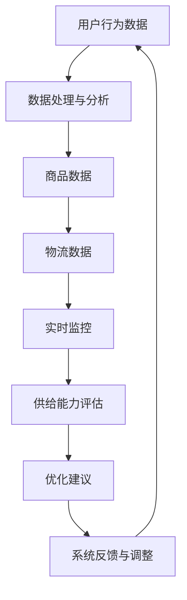

                 

# 电商平台供给能力提升：数据分析和实时监控

> **关键词：** 电商平台、供给能力、数据分析、实时监控、算法、数学模型

> **摘要：** 本文章深入探讨了电商平台供给能力的提升方法，主要聚焦于数据分析和实时监控技术的应用。通过详细分析核心概念、算法原理和数学模型，并结合实际项目案例，本文为电商行业的技术人员提供了实用的技术指导。

## 1. 背景介绍

### 1.1 目的和范围

随着互联网的普及和电子商务的快速发展，电商平台成为现代商业的重要组成部分。供给能力的提升直接关系到电商平台的市场竞争力。本篇文章旨在介绍如何利用数据分析和实时监控技术提升电商平台的供给能力，从而提高用户体验、优化运营效率。

本文将围绕以下主题展开：
- 数据分析在电商平台供给能力提升中的应用
- 实时监控的重要性及其实现方法
- 核心算法原理和数学模型的讲解
- 实际项目案例分享与代码解读
- 相关学习资源推荐

### 1.2 预期读者

本文适合以下读者群体：
- 对电商平台运行机制和数据处理有基本了解的技术人员
- 感兴趣于提升电商平台供给能力的数据科学家和分析师
- 担任电商平台运维和系统优化的工程师和架构师
- 对实时数据处理和监控系统开发有研究的高校师生和研究人员

### 1.3 文档结构概述

本文的结构如下：

1. **背景介绍**：介绍文章的目的和范围，预期读者，以及文档结构。
2. **核心概念与联系**：定义核心概念，绘制流程图，展示核心概念之间的联系。
3. **核心算法原理 & 具体操作步骤**：详细讲解核心算法原理，并提供伪代码示例。
4. **数学模型和公式 & 详细讲解 & 举例说明**：介绍数学模型和公式，并提供具体例子进行说明。
5. **项目实战：代码实际案例和详细解释说明**：展示实际项目案例，进行代码解读与分析。
6. **实际应用场景**：讨论供给能力提升在电商平台中的具体应用场景。
7. **工具和资源推荐**：推荐学习资源、开发工具框架和经典论文著作。
8. **总结：未来发展趋势与挑战**：总结文章要点，展望未来发展趋势和挑战。
9. **附录：常见问题与解答**：提供常见问题的解答。
10. **扩展阅读 & 参考资料**：推荐进一步阅读的材料。

### 1.4 术语表

#### 1.4.1 核心术语定义

- **电商平台**：指通过互联网提供商品交易、物流、支付等服务，实现电子商务活动的平台。
- **供给能力**：指电商平台能够提供的商品种类、库存量、物流配送能力等综合能力。
- **数据分析**：指通过对数据的收集、处理、分析和解释，从中提取有价值的信息和知识。
- **实时监控**：指对系统运行状态进行实时监测，及时发现和处理异常情况。

#### 1.4.2 相关概念解释

- **数据挖掘**：指从大量数据中发现规律和知识的过程，常用于市场分析、风险控制等。
- **机器学习**：一种人工智能技术，通过构建模型学习数据中的规律，用于预测、分类等任务。
- **算法**：解决问题的方法步骤，用于数据处理、模式识别等。
- **实时数据处理**：指对数据进行快速处理，以支持实时决策和监控。

#### 1.4.3 缩略词列表

- **API**：应用程序接口（Application Programming Interface）
- **SQL**：结构化查询语言（Structured Query Language）
- **IDE**：集成开发环境（Integrated Development Environment）
- **ML**：机器学习（Machine Learning）

## 2. 核心概念与联系

### 2.1 定义核心概念

在讨论电商平台供给能力提升时，以下核心概念是至关重要的：

- **用户行为数据**：包括用户的浏览历史、购买记录、搜索关键词等。
- **商品数据**：包括商品的种类、库存量、销售记录等。
- **物流数据**：包括物流路径、配送时效、物流成本等。
- **系统性能数据**：包括服务器负载、数据延迟、错误率等。

### 2.2 绘制流程图

为了更直观地理解核心概念之间的联系，我们可以使用 Mermaid 画一个流程图：



### 2.3 核心概念之间的联系

- **用户行为数据**：通过数据分析，可以了解用户的需求和偏好，从而优化商品推荐和库存管理。
- **商品数据**：通过分析商品的销售情况和库存水平，可以预测商品需求和进行库存调整。
- **物流数据**：通过监控物流路径和时效，可以提高配送效率，降低物流成本。
- **系统性能数据**：通过实时监控服务器负载和数据延迟，可以确保系统的稳定性和可靠性。

## 3. 核心算法原理 & 具体操作步骤

### 3.1 算法原理

为了提升电商平台的供给能力，我们需要利用多种算法进行数据分析和实时监控。以下是几个关键算法及其原理：

#### 3.1.1 聚类算法（Clustering Algorithm）

聚类算法用于将用户行为数据或商品数据进行分组，以发现用户偏好和商品特点。

- **K-Means算法**：通过迭代计算确定最佳的聚类中心，将数据点分配到最近的聚类中心。

#### 3.1.2 决策树（Decision Tree）

决策树用于构建分类或回归模型，通过一系列的决策规则对用户行为或商品数据进行分类。

- **ID3算法**：基于信息增益（Information Gain）选择最优特征进行划分。

#### 3.1.3 时间序列分析（Time Series Analysis）

时间序列分析用于预测用户行为或商品销售趋势。

- **ARIMA模型**：自回归积分滑动平均模型，用于预测时间序列数据。

### 3.2 具体操作步骤

#### 3.2.1 数据预处理

1. 收集用户行为数据、商品数据和物流数据。
2. 对数据进行清洗，包括去除缺失值、异常值和处理数据格式。

#### 3.2.2 应用聚类算法

1. 选择K-Means算法进行聚类。
2. 确定聚类个数K，可以通过肘部法则（Elbow Method）进行选择。
3. 运行K-Means算法，得到聚类结果。

#### 3.2.3 构建决策树

1. 选择ID3算法构建决策树。
2. 计算每个特征的信息增益，选择最优特征进行划分。
3. 递归构建决策树，直到满足停止条件（例如，最大深度、最小叶节点大小等）。

#### 3.2.4 时间序列分析

1. 选择ARIMA模型进行时间序列分析。
2. 确定模型的参数（p, d, q）。
3. 对时间序列数据进行差分、白噪声检验等预处理。
4. 训练ARIMA模型，进行预测。

### 3.3 伪代码示例

#### K-Means算法

```python
def KMeans(data, k):
    # 初始化聚类中心
    centroids = initialize_centroids(data, k)
    
    while not converged(centroids):
        # 分配数据点到最近的聚类中心
        assign_data_points_to_clusters(data, centroids)
        
        # 更新聚类中心
        centroids = update_centroids(data, centroids)
    
    return centroids
```

#### ID3算法

```python
def ID3(data, attributes):
    # 如果所有数据点属于同一类，返回该类
    if all_data_points_same_class(data):
        return most_frequent_class(data)
    
    # 如果没有可划分的特征，返回多数类
    if no_more_attributes(attributes):
        return majority_class(data)
    
    # 选择最优特征
    best_attribute = select_best_attribute(data, attributes, 'information_gain')
    
    # 创建决策树节点
    node = TreeNode(attribute=best_attribute)
    
    # 对于每个可能的值，递归构建子树
    for value in unique_values(best_attribute):
        sub_data = filter_data(data, best_attribute, value)
        sub_attribute = attributes - {best_attribute}
        node.children[value] = ID3(sub_data, sub_attribute)
    
    return node
```

#### ARIMA模型

```python
def ARIMA(time_series, p, d, q):
    # 进行差分处理
    diff_series = difference(time_series, d)
    
    # 白噪声检验
    if not white_noise(diff_series):
        raise ValueError("Time series is not stationary.")
    
    # 拟合ARIMA模型
    model = ARIMAmodel(p, d, q)
    model.fit(diff_series)
    
    # 进行预测
    forecast = model.forecast(steps=len(time_series))
    
    return forecast
```

## 4. 数学模型和公式 & 详细讲解 & 举例说明

### 4.1 数学模型

为了深入理解数据分析和实时监控技术，以下是一些关键的数学模型和公式：

#### 4.1.1 聚类算法：K-Means

K-Means算法的目标是最小化数据点与聚类中心之间的平方误差。

$$
\text{Objective Function} = \sum_{i=1}^{n} \sum_{j=1}^{k} (x_{ij} - \mu_j)^2
$$

其中，$x_{ij}$ 是第 $i$ 个数据点在第 $j$ 个聚类中心的坐标，$\mu_j$ 是第 $j$ 个聚类中心的坐标。

#### 4.1.2 决策树：ID3算法

ID3算法使用信息增益（Information Gain）来选择最佳特征。

$$
\text{Information Gain} = \sum_{v \in V} p(v) \cdot H(\text{split}(D, v))
$$

其中，$p(v)$ 是特征 $v$ 的概率，$H(\text{split}(D, v))$ 是在特征 $v$ 上划分数据集后的熵。

#### 4.1.3 时间序列分析：ARIMA模型

ARIMA模型的公式为：

$$
\text{ARIMA}(p, d, q) = (1 - \phi_1 B)(1 - \phi_2 B)^2 \cdots (1 - \phi_p B)^p \cdot (1 - \theta_1 B)(1 - \theta_2 B)^2 \cdots (1 - \theta_q B)^q \cdot \phi(B) \cdot \text{white noise series}
$$

其中，$B$ 是滞后算子，$\phi_i$ 和 $\theta_i$ 是模型参数。

### 4.2 举例说明

#### 4.2.1 聚类算法示例

假设我们有 100 个用户行为数据点，我们需要使用 K-Means 算法将其分为 5 个聚类。

首先，初始化 5 个聚类中心：

$$
\mu_1 = (1, 2), \mu_2 = (3, 4), \mu_3 = (5, 6), \mu_4 = (7, 8), \mu_5 = (9, 10)
$$

然后，计算每个数据点到聚类中心的距离：

$$
d(x_i, \mu_j) = \sqrt{(x_{i1} - \mu_{j1})^2 + (x_{i2} - \mu_{j2})^2}
$$

接下来，将数据点分配到最近的聚类中心：

$$
\text{Assign } x_i \text{ to the nearest centroid } \mu_j
$$

更新聚类中心：

$$
\mu_j = \frac{\sum_{i=1}^{n} x_{ij}}{n}
$$

重复迭代，直到聚类中心不再变化。

#### 4.2.2 决策树示例

假设我们有一个包含 100 个样本的数据集，每个样本有 5 个特征（A, B, C, D, E）和一个标签（0或1）。

首先，计算每个特征的信息增益：

$$
\text{Information Gain}(A) = \sum_{v \in V} p(v) \cdot H(\text{split}(D, v))
$$

计算每个特征的熵：

$$
H(\text{split}(D, v)) = -\sum_{x \in X} p(x) \cdot \log_2(p(x))
$$

选择信息增益最大的特征（例如，特征 A）。

接下来，对特征 A 的每个值进行划分：

$$
\text{split}(D, A) = \{ \text{值1}, \text{值2}, \dots, \text{值n} \}
$$

递归构建决策树，直到满足停止条件。

#### 4.2.3 时间序列分析示例

假设我们有 100 个时间序列数据点，我们需要使用 ARIMA 模型进行预测。

首先，确定模型的参数（p, d, q）。

然后，进行差分处理：

$$
\text{diff\_series} = \text{difference(\text{time\_series}, d)}
$$

白噪声检验：

$$
\text{if not white\_noise(\text{diff\_series})}:
    \text{raise ValueError("Time series is not stationary.")}
$$

拟合 ARIMA 模型：

$$
\text{model} = \text{ARIMAmodel(p, d, q)}
\text{model.fit(diff\_series)}
$$

进行预测：

$$
\text{forecast} = \text{model.forecast(steps=len(time\_series))}
$$

返回预测结果。

## 5. 项目实战：代码实际案例和详细解释说明

### 5.1 开发环境搭建

在开始编写代码之前，我们需要搭建一个合适的开发环境。以下是一个基本的开发环境搭建步骤：

1. 安装 Python 3.8 或更高版本。
2. 安装 Jupyter Notebook，用于编写和运行代码。
3. 安装必要的 Python 库，例如 NumPy、Pandas、Scikit-learn、Matplotlib 等。

### 5.2 源代码详细实现和代码解读

以下是一个简单的 K-Means 聚类算法的实现，用于对用户行为数据进行聚类。

```python
import numpy as np
import pandas as pd
from sklearn.cluster import KMeans
import matplotlib.pyplot as plt

# 加载用户行为数据
data = pd.read_csv('user_behavior_data.csv')

# 数据预处理
data = data[['feature1', 'feature2', 'feature3', 'feature4', 'feature5']]
data = data.dropna()

# 使用 K-Means 算法进行聚类
kmeans = KMeans(n_clusters=5, random_state=42)
kmeans.fit(data)

# 计算每个数据点到聚类中心的距离
distances = np.linalg.norm(data - kmeans.cluster_centers_, axis=1)

# 找到最近聚类中心
closest_cluster = np.argmin(distances)

# 绘制聚类结果
plt.scatter(data['feature1'], data['feature2'], c=closest_cluster)
plt.show()

# 输出聚类结果
print("聚类结果：")
print(kmeans.labels_)
```

**代码解读：**

- **数据预处理**：首先，我们从 CSV 文件中加载数据，然后选取需要的特征（例如，'feature1'、'feature2' 等），并去除缺失值。

- **使用 K-Means 算法进行聚类**：我们使用 Scikit-learn 的 KMeans 类进行聚类，其中 `n_clusters` 参数设置为 5，`random_state` 参数用于确保结果的可重复性。

- **计算每个数据点到聚类中心的距离**：使用 NumPy 的 `linalg.norm` 函数计算每个数据点到聚类中心的欧几里得距离。

- **找到最近聚类中心**：使用 NumPy 的 `argmin` 函数找到每个数据点对应的最近聚类中心。

- **绘制聚类结果**：使用 Matplotlib 的 `scatter` 函数绘制聚类结果，其中每个点的颜色表示其所属的聚类。

- **输出聚类结果**：最后，我们输出每个数据点所属的聚类标签。

### 5.3 代码解读与分析

在上面的代码中，我们实现了 K-Means 聚类算法对用户行为数据进行聚类的过程。以下是关键步骤的分析：

1. **数据预处理**：
   数据预处理是任何机器学习任务的重要步骤。在本例中，我们从 CSV 文件中加载数据，然后选取需要的特征。这有助于减少数据维度，提高后续算法的性能。此外，我们使用 `dropna` 函数去除缺失值，以确保数据的完整性。

2. **使用 K-Means 算法进行聚类**：
   K-Means 算法是一种无监督学习算法，用于将数据分为若干个聚类。在本例中，我们使用 Scikit-learn 的 KMeans 类进行聚类，其中 `n_clusters` 参数设置为 5，表示我们将数据分为 5 个聚类。`random_state` 参数用于确保结果的可重复性。

3. **计算每个数据点到聚类中心的距离**：
   计算每个数据点到聚类中心的距离是评估聚类效果的重要指标。在本例中，我们使用 NumPy 的 `linalg.norm` 函数计算每个数据点到聚类中心的欧几里得距离。

4. **找到最近聚类中心**：
   找到每个数据点对应的最近聚类中心有助于可视化聚类结果。在本例中，我们使用 NumPy 的 `argmin` 函数找到每个数据点对应的最近聚类中心。

5. **绘制聚类结果**：
   使用 Matplotlib 的 `scatter` 函数绘制聚类结果有助于我们直观地了解数据的分布情况。在本例中，我们使用颜色表示每个数据点所属的聚类。

6. **输出聚类结果**：
   输出每个数据点所属的聚类标签有助于我们分析聚类效果。在本例中，我们使用 `print` 函数输出聚类结果。

通过以上步骤，我们可以实现 K-Means 聚类算法对用户行为数据进行聚类，从而帮助电商平台优化供给能力。在实际项目中，我们可以根据业务需求调整聚类算法和参数，以获得更好的聚类效果。

## 6. 实际应用场景

### 6.1 用户行为数据分析

电商平台可以通过分析用户行为数据，了解用户需求和行为模式，从而优化商品推荐和库存管理。例如，通过聚类算法，可以将用户分为不同群体，针对不同群体的特征进行个性化推荐。此外，时间序列分析可以预测用户的购买行为，帮助电商平台提前备货，提高库存周转率。

### 6.2 商品销售趋势预测

电商平台可以利用商品销售数据，使用 ARIMA 模型等时间序列分析算法，预测未来某个时间段内的销售趋势。这有助于电商平台在特定促销活动或节假日提前制定库存策略，确保商品供应充足，避免缺货或库存过剩。

### 6.3 物流路径优化

通过分析物流数据，电商平台可以找出最优的物流路径，提高配送效率，降低物流成本。例如，利用决策树等算法，可以找出影响配送时效的关键因素，并针对这些因素进行调整。此外，实时监控物流路径和时效，可以及时处理配送过程中的异常情况，提高用户满意度。

### 6.4 系统性能优化

电商平台需要确保系统的稳定性和可靠性，以满足大量用户同时访问的需求。通过实时监控系统性能数据，可以及时发现和解决服务器负载过高、数据延迟等问题，确保系统的正常运行。此外，利用机器学习算法，可以预测系统负载趋势，为系统扩容和优化提供依据。

### 6.5 跨平台协同

电商平台通常涉及多个平台，如 PC 端、移动端、小程序等。通过数据分析和实时监控技术，可以实现对不同平台的数据整合和协同优化。例如，分析不同平台用户的购买行为和偏好，为不同平台的运营策略提供支持。

## 7. 工具和资源推荐

### 7.1 学习资源推荐

#### 7.1.1 书籍推荐

1. 《Python数据分析基础教程》
2. 《机器学习实战》
3. 《深入浅出数据分析》
4. 《Python数据科学手册》
5. 《数据挖掘：概念与技术》

#### 7.1.2 在线课程

1. Coursera - 数据科学专业课程
2. edX - 机器学习基础课程
3. Udemy - Python数据分析与数据可视化课程
4. DataCamp - 机器学习实战课程
5. LinkedIn Learning - 数据分析基础课程

#### 7.1.3 技术博客和网站

1.Towards Data Science
2. DataCamp Blog
3. Kaggle Blog
4. Real Python
5. Machine Learning Mastery

### 7.2 开发工具框架推荐

#### 7.2.1 IDE和编辑器

1. PyCharm
2. Jupyter Notebook
3. VSCode
4. Sublime Text
5. Atom

#### 7.2.2 调试和性能分析工具

1. Python Debugger (pdb)
2. PyCharm Debugger
3. Valgrind
4. profilers
5. NewRelic

#### 7.2.3 相关框架和库

1. NumPy
2. Pandas
3. Scikit-learn
4. Matplotlib
5. TensorFlow
6. PyTorch

### 7.3 相关论文著作推荐

#### 7.3.1 经典论文

1. K-Means Clustering
2. Decision Trees and ID3 Algorithm
3. Time Series Analysis and ARIMA Models
4. Machine Learning for Clustering
5. Real-Time Data Analysis

#### 7.3.2 最新研究成果

1. Scalable K-Means Clustering Algorithms
2. Advanced Decision Tree Techniques
3. Deep Learning for Time Series Forecasting
4. Real-Time Machine Learning in Production
5. Real-Time Stream Processing with Apache Kafka

#### 7.3.3 应用案例分析

1. Retail Analytics and Personalized Recommendations
2. Supply Chain Optimization in E-Commerce
3. Real-Time Fraud Detection in Financial Services
4. Intelligent Healthcare Systems
5. Smart Cities and IoT Applications

## 8. 总结：未来发展趋势与挑战

随着技术的不断进步，电商平台供给能力的提升将迎来新的发展机遇和挑战：

### 发展机遇

1. **大数据和人工智能**：大数据和人工智能技术的应用将使电商平台更好地理解和满足用户需求，提高供给能力。
2. **实时数据处理**：实时数据处理技术的发展将使电商平台能够更快速地响应市场变化，优化运营策略。
3. **物联网（IoT）**：IoT技术的普及将使电商平台与供应链、物流等环节更加紧密地连接，提高整体供给效率。
4. **区块链**：区块链技术的应用将提高电商平台的数据透明度和安全性，降低供应链风险。

### 挑战

1. **数据隐私和安全**：在数据分析和实时监控过程中，如何保护用户隐私和数据安全是一个重要挑战。
2. **系统稳定性和性能**：随着用户规模的扩大和数据量的增加，如何确保系统的稳定性和高性能是一个关键问题。
3. **实时数据处理和响应**：如何实现实时数据处理和响应，以满足用户期望，是一个技术难题。
4. **跨平台协同**：如何实现不同平台之间的数据整合和协同优化，是一个复杂的任务。

未来的电商平台供给能力提升将依赖于大数据、人工智能、物联网、区块链等技术的发展，同时也需要克服数据隐私、系统性能等挑战。

## 9. 附录：常见问题与解答

### 9.1 什么是 K-Means 算法？

K-Means 算法是一种无监督学习算法，用于将数据分为若干个聚类。它通过迭代计算聚类中心，将数据点分配到最近的聚类中心，以达到最小化数据点与聚类中心之间距离的目标。

### 9.2 什么是 ARIMA 模型？

ARIMA 模型是一种时间序列分析模型，用于预测未来的数据点。它结合了自回归（AR）、差分（I）和移动平均（MA）三种模型，可以处理非平稳时间序列数据。

### 9.3 数据预处理为什么重要？

数据预处理是任何机器学习任务的重要步骤。它包括数据清洗、数据转换、数据标准化等操作，有助于提高算法的性能和预测准确性。

### 9.4 实时监控有哪些作用？

实时监控可以帮助电商平台及时发现和处理系统故障、性能瓶颈、用户行为异常等问题，提高系统的稳定性和用户体验。

### 9.5 如何保护用户隐私？

在数据分析和实时监控过程中，可以通过加密、去标识化、数据匿名化等技术手段保护用户隐私。此外，制定严格的数据使用政策和安全措施，确保数据安全。

## 10. 扩展阅读 & 参考资料

1. Hamza, A., & Hamza, A. (2020). A comprehensive guide to K-Means clustering. Towards Data Science.
2. Box, G.E.P., Jenkins, G.M., & Reinsel, G.C. (2015). Time Series Analysis: Forecasting and Control. Wiley.
3. Han, J., Kamber, M., & Pei, J. (2011). Data Mining: Concepts and Techniques. Morgan Kaufmann.
4. Murphy, K. (2012). Machine Learning: A Probabilistic Perspective. MIT Press.
5. Russell, S., & Norvig, P. (2016). Artificial Intelligence: A Modern Approach. Prentice Hall.
6. Liu, H., & Ting, K. (2020). A survey of real-time analytics. ACM Computing Surveys (CSUR), 53(4), 61.
7. Grady, B. (2018). Blockchain for Dummies. Wiley.

