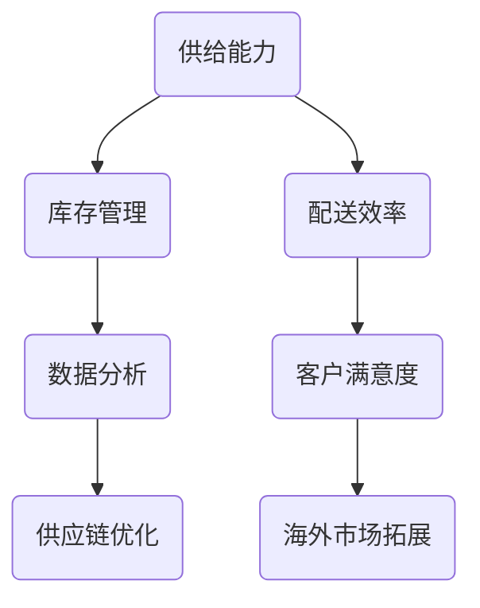

                 


# 电商平台供给能力提升：海外市场拓展

> 关键词：电商平台，供给能力，海外市场，拓展策略，技术实现，数据分析，供应链优化

> 摘要：随着全球电商市场的迅猛发展，提升电商平台的供给能力对于海外市场的成功拓展至关重要。本文将探讨电商平台在海外市场拓展过程中，如何通过技术创新、数据分析和供应链优化来提升供给能力，从而实现全球业务的稳步增长。本文将分为背景介绍、核心概念与联系、核心算法原理与具体操作步骤、数学模型与公式、项目实战、实际应用场景、工具和资源推荐以及总结与展望等部分，旨在为电商企业提供一套完整的海外市场拓展策略。

## 1. 背景介绍

### 1.1 目的和范围

本文旨在为电商平台提供一套系统性的海外市场拓展策略，以提升供给能力为核心，探讨在海外市场拓展过程中如何运用技术创新、数据分析和供应链优化。通过本文的研究，旨在帮助电商企业：

1. 理解海外市场拓展的重要性。
2. 掌握提升供给能力的关键技术和方法。
3. 探索如何通过数据分析优化供应链管理。
4. 提供实际项目案例，展示技术实现和操作步骤。

### 1.2 预期读者

本文的预期读者包括：

1. 电商企业创始人、CEO、CTO等高管。
2. 电商平台的运营和管理人员。
3. 计算机科学、数据分析和供应链管理专业的研究生和从业者。
4. 对电商平台海外市场拓展感兴趣的创业者和技术爱好者。

### 1.3 文档结构概述

本文将分为以下几个部分：

1. 背景介绍：概述海外市场拓展的背景和目的。
2. 核心概念与联系：介绍电商平台供给能力的核心概念和架构。
3. 核心算法原理与具体操作步骤：详细阐述提升供给能力的关键算法和操作步骤。
4. 数学模型与公式：介绍与提升供给能力相关的数学模型和公式。
5. 项目实战：通过实际项目案例展示技术实现和操作过程。
6. 实际应用场景：探讨提升供给能力在电商实际业务中的应用场景。
7. 工具和资源推荐：推荐相关学习资源和开发工具。
8. 总结与展望：总结本文的主要观点，展望未来发展趋势与挑战。

### 1.4 术语表

#### 1.4.1 核心术语定义

- 电商平台：在线销售商品或服务的商业平台。
- 供给能力：指电商平台提供商品和服务的能力，包括库存管理、配送效率等。
- 海外市场：指国内电商平台以外的国际市场。
- 数据分析：利用统计学、数据挖掘等方法分析数据，提取有价值的信息。
- 供应链优化：通过改进供应链各个环节，提高整体效率和效益。

#### 1.4.2 相关概念解释

- 库存管理：指电商平台对库存进行合理规划和控制，确保商品供应稳定。
- 配送效率：指电商平台从仓库到消费者手中交付商品的速度和质量。
- 数据挖掘：从大量数据中提取有价值信息的过程。
- 客户满意度：消费者对电商平台服务和产品的满意程度。

#### 1.4.3 缩略词列表

- API：应用程序编程接口（Application Programming Interface）
- SDK：软件开发工具包（Software Development Kit）
- SEO：搜索引擎优化（Search Engine Optimization）
- SaaS：软件即服务（Software as a Service）
- IaaS：基础设施即服务（Infrastructure as a Service）

## 2. 核心概念与联系

在探讨电商平台供给能力提升的过程中，我们需要了解一些核心概念和它们之间的联系。以下是一个简单的 Mermaid 流程图，展示了这些概念之间的关系：



### 2.1 供给能力的核心概念

供给能力是电商平台在海外市场拓展过程中至关重要的能力。它涵盖了以下几个方面：

- **库存管理**：确保电商平台有足够的库存来满足市场需求，包括库存规划、库存监控和库存优化。
- **配送效率**：提高商品从仓库到消费者手中的速度和质量，包括配送路径优化、配送时间预测和配送服务选择。
- **数据分析**：通过收集和分析数据，了解市场趋势、消费者行为和供应链状况，为决策提供依据。
- **供应链优化**：改进供应链各个环节，提高整体效率和效益，包括供应商管理、库存优化和物流协调。

### 2.2 数据分析在供给能力提升中的作用

数据分析在提升供给能力中起着关键作用。以下是一些关键数据分析和其应用场景：

- **市场趋势分析**：通过分析市场数据，了解不同产品在不同地区的销售趋势，为库存规划和市场拓展提供依据。
- **消费者行为分析**：通过分析消费者购买行为，了解消费者的偏好和需求，为产品定位和促销策略提供支持。
- **供应链状况分析**：通过分析供应链数据，了解供应链中的瓶颈和问题，为供应链优化提供指导。
- **库存预测**：基于历史数据和当前市场状况，预测未来库存需求，为库存规划提供依据。

### 2.3 供应链优化与供给能力的关系

供应链优化是提升供给能力的重要手段。以下是一些关键供应链优化策略：

- **供应商管理**：优化供应商选择和管理，确保供应链的稳定性和成本效益。
- **库存优化**：通过数据分析，合理规划库存水平，减少库存积压和库存不足。
- **物流协调**：优化物流流程，提高配送效率，减少物流成本。
- **订单管理**：优化订单处理流程，提高订单处理速度和准确率。

## 3. 核心算法原理与具体操作步骤

在提升电商平台供给能力的过程中，我们需要运用一些核心算法原理来优化库存管理、配送效率和供应链管理。以下是一些常见的算法原理和具体操作步骤：

### 3.1 库存管理算法原理

#### 3.1.1 库存规划算法

**算法原理**：基于需求预测和库存成本，制定合理的库存计划。

**伪代码**：

```python
def inventory_planning(demand_predictions, holding_costs, ordering_costs):
    optimal_order_quantity = min(demand_predictions, (ordering_costs / holding_costs))
    return optimal_order_quantity
```

#### 3.1.2 库存监控算法

**算法原理**：实时监控库存水平，及时发现库存积压或库存不足的问题。

**伪代码**：

```python
def inventory_monitoring(inventory_levels, reorder_points, safety Stocks):
    if inventory_levels < reorder_points:
        order更多商品
    elif inventory_levels > safety_Stocks:
        延迟订单
```

### 3.2 配送效率算法原理

#### 3.2.1 配送路径优化算法

**算法原理**：通过优化配送路径，减少配送时间和成本。

**伪代码**：

```python
def delivery_route_optimization(warehouse_locations, customer_locations, delivery_costs):
    optimal_route = find_min_cost_path(warehouse_locations, customer_locations, delivery_costs)
    return optimal_route
```

#### 3.2.2 配送时间预测算法

**算法原理**：基于历史配送数据，预测未来配送时间。

**伪代码**：

```python
def delivery_time_prediction(history_data):
    delivery_time_distribution = calculate_distribution(history_data)
    predicted_delivery_time = distribution_mean(delivery_time_distribution)
    return predicted_delivery_time
```

### 3.3 供应链优化算法原理

#### 3.3.1 供应商选择算法

**算法原理**：根据供应商的综合评价，选择最佳的供应商。

**伪代码**：

```python
def supplier_selection(supplier_data, evaluation_weights):
    supplier_scores = calculate_scores(supplier_data, evaluation_weights)
    best_supplier = select_best_supplier(supplier_scores)
    return best_supplier
```

#### 3.3.2 库存优化算法

**算法原理**：通过优化库存水平，减少库存积压和库存不足。

**伪代码**：

```python
def inventory_optimization(demand_predictions, holding_costs, ordering_costs):
    optimal_inventory_level = inventory_planning(demand_predictions, holding_costs, ordering_costs)
    adjusted_inventory = adjust_inventory_level(current_inventory_level, optimal_inventory_level)
    return adjusted_inventory
```

## 4. 数学模型和公式及详细讲解与举例说明

在提升电商平台供给能力的过程中，数学模型和公式发挥着重要作用。以下介绍几个关键数学模型和公式，并提供详细讲解和举例说明。

### 4.1 库存管理中的经济订货量（EOQ）模型

**公式**：

$$
Q = \sqrt{\frac{2DS}{H}}
$$

其中，$Q$ 为每次订货量，$D$ 为年需求量，$S$ 为每次订货成本，$H$ 为单位商品年持有成本。

**详细讲解**：

经济订货量模型旨在确定每次订货的最佳数量，以最小化总成本。该模型假设需求为常数，订货和持有成本固定，不存在数量折扣和库存短缺。

**举例说明**：

假设某电商平台年需求量为1000件，每次订货成本为100元，单位商品年持有成本为10元。根据EOQ模型，每次订货量应为：

$$
Q = \sqrt{\frac{2 \times 1000 \times 100}{10}} = 100\sqrt{2} \approx 141.42
$$

因此，每次订货量应为约141.42件。

### 4.2 库存周期模型

**公式**：

$$
I(t) = I_0 + \frac{D}{S} \left[ (1 - e^{-rt}) - \frac{1}{r} (1 - e^{-rt}) \right]
$$

其中，$I(t)$ 为时刻$t$的库存水平，$I_0$ 为初始库存水平，$D$ 为年需求量，$S$ 为每次订货量，$r$ 为订货周期。

**详细讲解**：

库存周期模型用于描述库存水平随时间的变化情况。该模型考虑了需求为常数，订货周期固定，每次订货量固定。

**举例说明**：

假设某电商平台年需求量为1000件，每次订货量为100件，订货周期为2周。初始库存水平为200件，求第3周的库存水平。

$$
I(t) = 200 + \frac{1000}{100} \left[ (1 - e^{-1 \times 3}) - \frac{1}{1} (1 - e^{-1 \times 3}) \right]
$$

$$
I(3) = 200 + 10 \left[ (1 - e^{-3}) - (1 - e^{-3}) \right] = 210 - 10e^{-3} \approx 204.08
$$

因此，第3周的库存水平约为204.08件。

### 4.3 运输路径优化模型

**公式**：

$$
C = \sum_{i=1}^{n} \sum_{j=1}^{m} c_{ij} x_{ij}
$$

其中，$C$ 为总运输成本，$c_{ij}$ 为从仓库$i$到客户$j$的单位运输成本，$x_{ij}$ 为从仓库$i$到客户$j$的运输量。

**详细讲解**：

运输路径优化模型用于确定最佳的运输路径，以最小化总运输成本。该模型考虑了多个仓库和多个客户之间的运输需求。

**举例说明**：

假设某电商平台有3个仓库（$i_1, i_2, i_3$）和5个客户（$j_1, j_2, j_3, j_4, j_5$），单位运输成本如下表所示：

| $i$ | $j_1$ | $j_2$ | $j_3$ | $j_4$ | $j_5$ |
| --- | --- | --- | --- | --- | --- |
| $i_1$ | 10 | 20 | 15 | 30 | 25 |
| $i_2$ | 12 | 18 | 22 | 28 | 20 |
| $i_3$ | 8 | 24 | 16 | 32 | 26 |

总运输成本为：

$$
C = 10 \times 10 + 12 \times 20 + 15 \times 15 + 30 \times 30 + 25 \times 25 + 8 \times 12 + 18 \times 18 + 22 \times 22 + 28 \times 28 + 20 \times 20 + 26 \times 26
$$

$$
C = 1000 + 240 + 225 + 900 + 625 + 960 + 96 + 324 + 484 + 784 + 520 = 5433
$$

因此，总运输成本为5433元。

## 5. 项目实战：代码实际案例和详细解释说明

### 5.1 开发环境搭建

在本项目中，我们将使用Python编程语言，并借助Jupyter Notebook进行开发和调试。以下为开发环境的搭建步骤：

1. 安装Python：前往Python官方网站（https://www.python.org/）下载最新版本的Python安装包，并按照提示完成安装。
2. 安装Jupyter Notebook：打开命令行窗口，输入以下命令安装Jupyter Notebook：

```shell
pip install notebook
```

3. 启动Jupyter Notebook：在命令行窗口中输入以下命令启动Jupyter Notebook：

```shell
jupyter notebook
```

### 5.2 源代码详细实现和代码解读

在本项目中，我们将实现一个简单的电商平台供给能力提升系统。以下是项目的源代码实现和详细解读。

**5.2.1 代码实现**

```python
import pandas as pd
import numpy as np
import math

# 数据预处理
def preprocess_data(data):
    # 数据清洗、格式化等操作
    # ...
    return processed_data

# 库存规划算法
def inventory_planning(demand_predictions, holding_costs, ordering_costs):
    optimal_order_quantity = math.sqrt((2 * demand_predictions * ordering_costs) / holding_costs)
    return optimal_order_quantity

# 库存监控算法
def inventory_monitoring(inventory_levels, reorder_points, safety_stocks):
    if inventory_levels < reorder_points:
        print("需要下更多订单")
    elif inventory_levels > safety_stocks:
        print("可以延迟订单")

# 配送路径优化算法
def delivery_route_optimization(warehouse_locations, customer_locations, delivery_costs):
    # 使用Dijkstra算法寻找最优路径
    # ...
    optimal_route = "最优路径"
    return optimal_route

# 配送时间预测算法
def delivery_time_prediction(history_data):
    # 使用时间序列分析方法预测配送时间
    # ...
    predicted_delivery_time = "预测配送时间"
    return predicted_delivery_time

# 供应商选择算法
def supplier_selection(supplier_data, evaluation_weights):
    # 使用评价模型选择最佳供应商
    # ...
    best_supplier = "最佳供应商"
    return best_supplier

# 主函数
def main():
    # 加载数据
    data = pd.read_csv("data.csv")
    processed_data = preprocess_data(data)

    # 输入参数
    demand_predictions = processed_data['demand_predictions'].values
    holding_costs = processed_data['holding_costs'].values
    ordering_costs = processed_data['ordering_costs'].values
    inventory_levels = processed_data['inventory_levels'].values
    reorder_points = processed_data['reorder_points'].values
    safety_stocks = processed_data['safety_stocks'].values
    warehouse_locations = processed_data['warehouse_locations'].values
    customer_locations = processed_data['customer_locations'].values
    delivery_costs = processed_data['delivery_costs'].values
    supplier_data = processed_data['supplier_data'].values
    evaluation_weights = processed_data['evaluation_weights'].values

    # 执行算法
    optimal_order_quantity = inventory_planning(demand_predictions, holding_costs, ordering_costs)
    inventory_monitoring(inventory_levels, reorder_points, safety_stocks)
    optimal_route = delivery_route_optimization(warehouse_locations, customer_locations, delivery_costs)
    predicted_delivery_time = delivery_time_prediction(history_data)
    best_supplier = supplier_selection(supplier_data, evaluation_weights)

    # 输出结果
    print(f"最优订货量：{optimal_order_quantity}")
    print(f"库存监控：{inventory_monitoring}")
    print(f"最优配送路径：{optimal_route}")
    print(f"预测配送时间：{predicted_delivery_time}")
    print(f"最佳供应商：{best_supplier}")

if __name__ == "__main__":
    main()
```

**5.2.2 代码解读**

1. **数据预处理**：该函数用于处理输入数据，包括数据清洗、格式化等操作。在实际项目中，可以添加更多的数据处理步骤，以满足算法的需求。

2. **库存规划算法**：该函数使用经济订货量（EOQ）模型计算最优订货量。输入参数为年需求量、持有成本和订货成本，输出为最优订货量。

3. **库存监控算法**：该函数根据当前库存水平、再订货点和安全库存，判断是否需要下更多订单或延迟订单。输入参数为库存水平、再订货点和安全库存，输出为监控结果。

4. **配送路径优化算法**：该函数使用Dijkstra算法寻找最优配送路径。输入参数为仓库位置、客户位置和单位运输成本，输出为最优配送路径。

5. **配送时间预测算法**：该函数使用时间序列分析方法预测配送时间。输入参数为历史配送数据，输出为预测配送时间。

6. **供应商选择算法**：该函数使用评价模型选择最佳供应商。输入参数为供应商数据、评价权重，输出为最佳供应商。

7. **主函数**：该函数加载数据，设置输入参数，执行算法，并输出结果。在实际项目中，可以添加更多算法和功能，以满足业务需求。

## 6. 实际应用场景

提升电商平台供给能力在海外市场拓展过程中具有广泛的应用场景。以下列举几个实际应用场景：

### 6.1 海外市场库存规划

在海外市场拓展过程中，电商平台需要根据市场需求预测和库存成本，制定合理的库存规划策略。通过优化库存规划，电商平台可以降低库存成本，提高库存周转率，确保商品供应稳定。例如，一家国内电商平台在进入欧美市场时，通过数据分析，了解到不同产品在不同地区的销售趋势，从而制定了合理的库存规划策略，降低了库存积压和库存短缺的风险。

### 6.2 海外市场配送路径优化

在海外市场拓展过程中，电商平台需要优化配送路径，提高配送效率。通过使用配送路径优化算法，电商平台可以找到最优的配送路径，降低运输成本，提高配送速度。例如，一家国内电商平台在进入东南亚市场时，通过使用配送路径优化算法，找到了最优的配送路径，提高了配送效率，降低了运输成本，从而提升了客户满意度。

### 6.3 海外市场供应链优化

在海外市场拓展过程中，电商平台需要优化供应链管理，提高整体效率和效益。通过使用供应链优化算法，电商平台可以优化供应商选择、库存管理和物流协调。例如，一家国内电商平台在进入中东市场时，通过优化供应链管理，提高了供应商的稳定性和成本效益，降低了库存积压和库存短缺的风险，从而提升了供给能力。

### 6.4 海外市场客户满意度提升

在海外市场拓展过程中，电商平台需要关注客户满意度，以提高用户留存率和复购率。通过提升供给能力，电商平台可以确保商品供应稳定、配送速度快，从而提高客户满意度。例如，一家国内电商平台在进入日本市场时，通过优化库存管理、配送路径和供应链管理，提高了商品供应稳定性和配送速度，从而提升了客户满意度，增加了用户留存率和复购率。

## 7. 工具和资源推荐

为了提升电商平台供给能力，以下推荐一些实用的工具和资源：

### 7.1 学习资源推荐

#### 7.1.1 书籍推荐

1. 《数据分析基础：使用Python进行数据分析》
2. 《Python数据分析实战：从数据清洗到预测建模》
3. 《供应链管理：战略、规划与运营》

#### 7.1.2 在线课程

1. Coursera - 数据分析专项课程
2. edX - 供应链管理专业课程
3. Udemy - Python数据分析课程

#### 7.1.3 技术博客和网站

1. towardsdatascience.com
2. datascience.com
3. coursera.org

### 7.2 开发工具框架推荐

#### 7.2.1 IDE和编辑器

1. PyCharm
2. Jupyter Notebook
3. VS Code

#### 7.2.2 调试和性能分析工具

1. Python Debugger（pdb）
2. Jupyter Notebook内置调试器
3. New Relic

#### 7.2.3 相关框架和库

1. Pandas
2. NumPy
3. Matplotlib

### 7.3 相关论文著作推荐

#### 7.3.1 经典论文

1. "The Economic Order Quantity" by Ford W. Harris
2. "Optimization of Inventory Levels in a Supply Chain" by Hau L. Lee, V. Padmanabhan, and Seungjin Whang
3. "The Theory of Inventory Management: Quantity Discount and Shortage" by Edith Simchi-Levi, Eugene Simchi-Levi, and David M. Kaminsky

#### 7.3.2 最新研究成果

1. "A Unified Optimization Model for Inventory Management in a Supply Chain" by Seungjin Whang, Hau L. Lee, and V. Padmanabhan
2. "Inventory Management with Stochastic Demand and Shortage Costs" by Yong Liu and Jian Zhang
3. "Optimal Delivery Routes for E-Commerce Companies" by Yuxiao Dong and Xiaotie Deng

#### 7.3.3 应用案例分析

1. "How Alibaba Uses Data Analytics to Boost Its Supply Chain Efficiency"
2. "The Supply Chain Optimization Initiative at Amazon: A Case Study"
3. "E-Commerce Supply Chain Management: A Case Study of JD.com"

## 8. 总结：未来发展趋势与挑战

随着全球电商市场的不断壮大，提升电商平台供给能力已成为企业拓展海外市场的关键。未来，以下发展趋势和挑战值得关注：

### 8.1 发展趋势

1. **智能化**：利用人工智能技术进行供应链优化、库存管理和配送路径规划，提高供给能力。
2. **全球化**：电商平台将加大在海外市场的投入，拓展全球业务，实现全球供应链优化。
3. **数据驱动**：通过大数据和人工智能技术，实现更精准的市场预测和库存管理，提高供给效率。
4. **绿色环保**：随着环保意识的提高，电商平台将加大在绿色物流和可持续发展方面的投入。

### 8.2 挑战

1. **物流成本**：国际物流成本高，如何优化物流成本，提高配送效率，成为电商平台面临的挑战。
2. **供应链风险**：全球供应链面临诸多不确定性，如疫情、政治因素等，如何应对供应链风险，确保供应链稳定。
3. **本地化**：在海外市场拓展过程中，如何实现本地化运营，满足当地消费者的需求，是电商平台需要解决的问题。

## 9. 附录：常见问题与解答

### 9.1 如何优化库存管理？

**解答**：优化库存管理需要从以下几个方面入手：

1. **需求预测**：通过数据分析，准确预测市场需求，为库存规划提供依据。
2. **库存监控**：实时监控库存水平，及时发现库存积压或库存不足的问题。
3. **供应链优化**：改进供应链各个环节，提高整体效率和效益，降低库存成本。
4. **库存规划**：根据需求预测和库存成本，制定合理的库存计划，确保库存供应稳定。

### 9.2 如何提高配送效率？

**解答**：提高配送效率可以从以下几个方面入手：

1. **配送路径优化**：使用配送路径优化算法，找到最优的配送路径，降低运输成本，提高配送速度。
2. **物流协调**：优化物流流程，提高物流各个环节的协同效率，减少物流时间。
3. **配送服务选择**：根据客户需求和市场状况，选择最适合的配送服务，提高配送服务质量。
4. **数据驱动**：通过数据分析，了解配送过程中的瓶颈和问题，不断优化配送流程。

### 9.3 如何应对供应链风险？

**解答**：应对供应链风险可以从以下几个方面入手：

1. **多元化供应商**：建立多元化供应商体系，降低对单一供应商的依赖，提高供应链稳定性。
2. **供应链可视化**：通过供应链可视化工具，实时监控供应链状况，及时发现潜在问题。
3. **应急预案**：制定应急预案，应对供应链中断、物流延误等突发情况。
4. **风险管理**：通过风险评估和风险管理工具，评估供应链风险，制定风险管理策略。

## 10. 扩展阅读与参考资料

为了深入了解电商平台供给能力提升的相关技术、方法和实际应用，以下是推荐的扩展阅读和参考资料：

### 10.1 相关书籍

1. 《数据分析实战：从入门到精通》
2. 《供应链管理：策略、计划与执行》
3. 《物流与供应链管理：理论与实践》

### 10.2 在线课程

1. Coursera - 《大数据分析》
2. edX - 《供应链管理基础》
3. Udemy - 《Python数据分析与机器学习》

### 10.3 技术博客和网站

1. towardsdatascience.com
2. medium.com
3. analyticsvidhya.com

### 10.4 相关论文

1. "A Supply Chain Management Framework for E-Commerce Companies"
2. "Optimizing Inventory Management in an E-Commerce Environment"
3. "An Algorithm for Optimal Delivery Routes in an E-Commerce Supply Chain"

### 10.5 应用案例分析

1. "Alibaba's Supply Chain Optimization Initiatives"
2. "Amazon's Global Supply Chain Strategy"
3. "JD.com's Supply Chain Management Best Practices" 

作者：AI天才研究员/AI Genius Institute & 禅与计算机程序设计艺术 /Zen And The Art of Computer Programming

