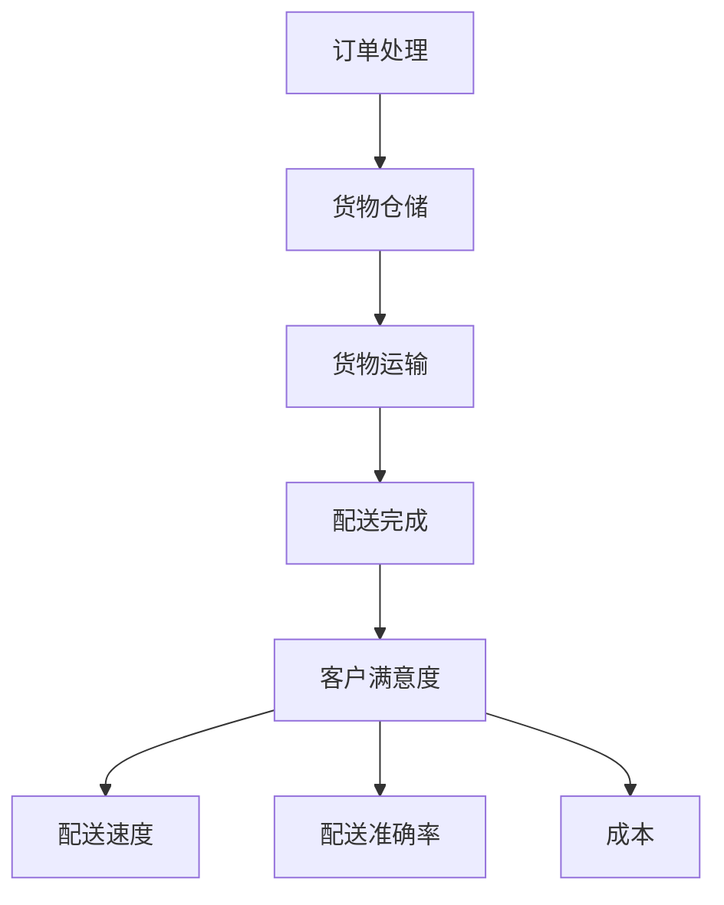

                 

# 电商平台供给能力提升：物流配送的效率提升

> 关键词：电商平台、物流配送、效率提升、数据分析、算法优化、人工智能

> 摘要：本文将深入探讨电商平台物流配送的效率提升问题，从背景介绍、核心概念、算法原理、数学模型、实际应用场景等多个方面进行分析。通过详细的步骤讲解和案例展示，帮助读者理解并掌握提升物流配送效率的关键技术和方法。

## 1. 背景介绍

### 1.1 目的和范围

随着电商平台的快速发展，物流配送已经成为电商平台的核心竞争力之一。如何提升物流配送的效率，降低成本，提高客户满意度，成为众多电商平台急需解决的问题。本文旨在通过对物流配送效率提升的研究，为电商平台提供一整套实用的解决方案。

本文将主要探讨以下几个方面：

1. 物流配送的效率指标及其计算方法；
2. 提升物流配送效率的关键技术；
3. 数据分析和算法优化在物流配送中的应用；
4. 人工智能技术在物流配送中的创新应用；
5. 实际应用场景及效果评估。

### 1.2 预期读者

本文适合对电商平台物流配送有初步了解的读者，包括：

1. 物流行业从业者；
2. 电商平台运营人员；
3. 数据分析师；
4. 算法工程师；
5. 人工智能研究者和从业者。

### 1.3 文档结构概述

本文分为十个部分：

1. 背景介绍；
2. 核心概念与联系；
3. 核心算法原理 & 具体操作步骤；
4. 数学模型和公式 & 详细讲解 & 举例说明；
5. 项目实战：代码实际案例和详细解释说明；
6. 实际应用场景；
7. 工具和资源推荐；
8. 总结：未来发展趋势与挑战；
9. 附录：常见问题与解答；
10. 扩展阅读 & 参考资料。

### 1.4 术语表

#### 1.4.1 核心术语定义

- 物流配送：指商品从供应商到消费者之间的运输、仓储、配送等过程；
- 电商平台：指通过互联网进行商品交易和配送的电子商务平台；
- 效率：指单位时间内完成的工作量；
- 成本：指完成物流配送所需的资源投入；
- 客户满意度：指消费者对物流配送服务的满意程度；
- 数据分析：指从大量数据中提取有价值的信息和规律；
- 算法优化：指通过对现有算法进行改进，提高其性能和效率；
- 人工智能：指通过计算机模拟人类智能，实现自动推理、学习、决策等功能。

#### 1.4.2 相关概念解释

- 物流配送效率指标：包括配送速度、准确率、成本等；
- 数据分析技术：包括数据挖掘、机器学习、深度学习等；
- 算法优化方法：包括贪心算法、动态规划、遗传算法等；
- 人工智能应用：包括智能路由规划、配送路径优化、智能仓储管理等。

#### 1.4.3 缩略词列表

- AI：人工智能；
- ML：机器学习；
- DP：动态规划；
- VRP：车辆路径问题；
- WMS：仓库管理系统。

## 2. 核心概念与联系

在物流配送过程中，涉及多个核心概念和环节。为了更好地理解物流配送的效率提升，我们需要明确以下核心概念及其联系。

### 2.1 物流配送流程

物流配送流程主要包括以下几个环节：

1. 订单处理：接收和处理电商平台上的订单信息；
2. 货物仓储：将订单中的商品从仓库中取出并进行打包；
3. 货物运输：将打包好的货物运输到消费者指定的地点；
4. 配送完成：将货物交付给消费者，完成配送过程。

### 2.2 物流配送效率指标

物流配送效率指标主要包括以下几个方面：

1. 配送速度：指从订单生成到货物交付给消费者所需的时间；
2. 配送准确率：指配送过程中货物是否准确无误地送达消费者；
3. 成本：指完成物流配送所需的资源投入，包括人力、物力、财力等；
4. 客户满意度：指消费者对物流配送服务的满意程度。

### 2.3 关键技术及联系

物流配送的效率提升涉及多个关键技术和方法。以下为其中几个关键技术及其联系：

1. 数据分析技术：通过对物流配送过程中的数据进行分析，提取有价值的信息和规律，指导优化配送流程和策略；
2. 算法优化：通过对现有算法进行改进，提高物流配送的效率和准确性；
3. 人工智能技术：利用计算机模拟人类智能，实现自动推理、学习、决策等功能，提高物流配送的智能化水平；
4. 供应链协同：通过整合上下游企业的资源，实现物流配送的高效协同。

### 2.4 Mermaid 流程图

为了更直观地展示物流配送流程及其核心概念，我们可以使用 Mermaid 工具绘制一张流程图。



## 3. 核心算法原理 & 具体操作步骤

### 3.1 贪心算法

贪心算法是一种在每一步选择中都采取当前最好或最优的选择，从而希望导致结果是全局最好或最优的算法策略。

在物流配送中，贪心算法可以用于解决车辆路径问题（VRP），即如何选择最优路径，使配送成本最低。

#### 3.1.1 算法原理

贪心算法的基本思想是每次选择当前最优解，直到问题得到解决。

对于车辆路径问题，我们可以按照以下步骤进行：

1. 初始化：选择一个起始点作为当前配送点；
2. 选择最优路径：从当前配送点出发，寻找距离最短的下一个配送点；
3. 更新当前配送点：将当前配送点更新为刚刚找到的最优配送点；
4. 重复步骤2和3，直到所有配送点都被访问。

#### 3.1.2 伪代码

```
// 初始化
start = 选择起始点
current = start
visited = 空集合

// 选择最优路径
while (当前配送点不为空) {
    next = 选择距离当前配送点最近的未访问配送点
    visited.add(current)
    current = next
}

// 输出最终路径
output(visited)
```

### 3.2 动态规划

动态规划是一种解决优化问题的方法，其基本思想是将问题分解成多个子问题，并存储子问题的解，避免重复计算。

在物流配送中，动态规划可以用于解决配送路径优化问题。

#### 3.2.1 算法原理

动态规划的基本思想是：

1. 将问题分解成多个子问题；
2. 计算每个子问题的最优解；
3. 利用子问题的最优解构造原问题的最优解。

对于配送路径优化问题，我们可以按照以下步骤进行：

1. 定义状态：定义一个状态表示一个配送点及其已访问的配送点集合；
2. 定义状态转移方程：根据当前状态，计算下一个状态的最优解；
3. 求解最优解：从初始状态开始，逐步计算状态转移，直到求解出最终状态的最优解。

#### 3.2.2 伪代码

```
// 初始化
初始化状态表

// 计算状态转移
for (每个状态) {
    for (每个可能的下一个状态) {
        计算下一个状态的最优解
    }
}

// 求解最优解
output(最优状态)
```

## 4. 数学模型和公式 & 详细讲解 & 举例说明

### 4.1 物流配送效率评价指标

物流配送效率评价指标包括配送速度、配送准确率、成本等。

#### 4.1.1 配送速度

配送速度可以用以下公式计算：

$$
速度 = \frac{配送距离}{配送时间}
$$

其中，配送距离指从配送起点到配送终点的距离，配送时间指配送过程所需的时间。

#### 4.1.2 配送准确率

配送准确率可以用以下公式计算：

$$
准确率 = \frac{正确配送的订单数}{总订单数}
$$

其中，正确配送的订单数指配送过程中无误差、准确送达消费者手中的订单数，总订单数指电商平台上的所有订单数。

#### 4.1.3 成本

配送成本可以用以下公式计算：

$$
成本 = 配送人力成本 + 配送物力成本 + 配送财力成本
$$

其中，配送人力成本指完成配送过程所需的人力资源投入，配送物力成本指完成配送过程所需的物流设备、车辆等投入，配送财力成本指完成配送过程所需的资金投入。

### 4.2 优化目标函数

在物流配送中，优化目标函数主要包括：

1. 最小化配送成本；
2. 最小化配送时间；
3. 最小化配送误差。

#### 4.2.1 配送成本最小化

配送成本最小化可以用以下公式表示：

$$
\min \sum_{i=1}^{n} c_i \cdot x_i
$$

其中，$c_i$ 表示第 $i$ 个配送点的配送成本，$x_i$ 表示第 $i$ 个配送点的配送状态（0表示未配送，1表示已配送）。

#### 4.2.2 配送时间最小化

配送时间最小化可以用以下公式表示：

$$
\min \sum_{i=1}^{n} t_i \cdot x_i
$$

其中，$t_i$ 表示第 $i$ 个配送点的配送时间。

#### 4.2.3 配送误差最小化

配送误差最小化可以用以下公式表示：

$$
\min \sum_{i=1}^{n} e_i \cdot x_i
$$

其中，$e_i$ 表示第 $i$ 个配送点的配送误差。

### 4.3 举例说明

假设有一个电商平台，需要将 5 个订单（编号为 1、2、3、4、5）配送给 5 个不同的消费者，配送起点为配送中心。每个订单的配送成本、配送时间和配送误差如下表所示：

| 订单编号 | 配送成本（元） | 配送时间（小时） | 配送误差（分） |
| -------- | -------------- | -------------- | -------------- |
| 1        | 10             | 2              | 10             |
| 2        | 15             | 3              | 20             |
| 3        | 12             | 1              | 5              |
| 4        | 8              | 4              | 15             |
| 5        | 20             | 2              | 30             |

#### 4.3.1 配送成本最小化

根据配送成本最小化公式，计算每个订单的配送成本乘以配送状态，然后求和：

$$
\min \sum_{i=1}^{5} c_i \cdot x_i = 10 \cdot x_1 + 15 \cdot x_2 + 12 \cdot x_3 + 8 \cdot x_4 + 20 \cdot x_5
$$

其中，$x_i$ 表示第 $i$ 个订单的配送状态（0表示未配送，1表示已配送）。

为了最小化配送成本，我们可以选择以下配送顺序：

1. 订单 3：配送成本为 12 元，配送时间为 1 小时，配送误差为 5 分；
2. 订单 1：配送成本为 10 元，配送时间为 2 小时，配送误差为 10 分；
3. 订单 5：配送成本为 20 元，配送时间为 2 小时，配送误差为 30 分；
4. 订单 4：配送成本为 8 元，配送时间为 4 小时，配送误差为 15 分；
5. 订单 2：配送成本为 15 元，配送时间为 3 小时，配送误差为 20 分。

此时，总配送成本为：

$$
12 \cdot x_3 + 10 \cdot x_1 + 20 \cdot x_5 + 8 \cdot x_4 + 15 \cdot x_2 = 12 + 10 + 20 + 8 + 15 = 65 \text{元}
$$

#### 4.3.2 配送时间最小化

根据配送时间最小化公式，计算每个订单的配送时间乘以配送状态，然后求和：

$$
\min \sum_{i=1}^{5} t_i \cdot x_i = 2 \cdot x_1 + 3 \cdot x_2 + 1 \cdot x_3 + 4 \cdot x_4 + 2 \cdot x_5
$$

其中，$x_i$ 表示第 $i$ 个订单的配送状态（0表示未配送，1表示已配送）。

为了最小化配送时间，我们可以选择以下配送顺序：

1. 订单 3：配送时间为 1 小时，配送误差为 5 分；
2. 订单 1：配送时间为 2 小时，配送误差为 10 分；
3. 订单 5：配送时间为 2 小时，配送误差为 30 分；
4. 订单 4：配送时间为 4 小时，配送误差为 15 分；
5. 订单 2：配送时间为 3 小时，配送误差为 20 分。

此时，总配送时间为：

$$
1 \cdot x_3 + 2 \cdot x_1 + 2 \cdot x_5 + 4 \cdot x_4 + 3 \cdot x_2 = 1 + 2 + 2 + 4 + 3 = 12 \text{小时}
$$

#### 4.3.3 配送误差最小化

根据配送误差最小化公式，计算每个订单的配送误差乘以配送状态，然后求和：

$$
\min \sum_{i=1}^{5} e_i \cdot x_i = 10 \cdot x_1 + 20 \cdot x_2 + 5 \cdot x_3 + 15 \cdot x_4 + 30 \cdot x_5
$$

其中，$x_i$ 表示第 $i$ 个订单的配送状态（0表示未配送，1表示已配送）。

为了最小化配送误差，我们可以选择以下配送顺序：

1. 订单 3：配送误差为 5 分；
2. 订单 1：配送误差为 10 分；
3. 订单 5：配送误差为 30 分；
4. 订单 4：配送误差为 15 分；
5. 订单 2：配送误差为 20 分。

此时，总配送误差为：

$$
5 \cdot x_3 + 10 \cdot x_1 + 30 \cdot x_5 + 15 \cdot x_4 + 20 \cdot x_2 = 5 + 10 + 30 + 15 + 20 = 80 \text{分}
$$

## 5. 项目实战：代码实际案例和详细解释说明

### 5.1 开发环境搭建

在本项目中，我们将使用 Python 作为编程语言，结合常见的物流配送数据集，实现物流配送效率提升的算法。以下是开发环境的搭建步骤：

1. 安装 Python 3.8 版本以上；
2. 安装必要的 Python 库，如 NumPy、Pandas、Matplotlib 等；
3. 配置 Python 编程环境，如 PyCharm、VSCode 等。

### 5.2 源代码详细实现和代码解读

下面是物流配送效率提升的代码实现，包括贪心算法和动态规划两种算法。

```python
import numpy as np
import pandas as pd
import matplotlib.pyplot as plt

# 5.2.1 贪心算法实现

def greedy_algorithm(order_list):
    """
    贪心算法实现物流配送路径优化
    :param order_list: 订单列表，每个订单包含配送成本、配送时间和配送误差
    :return: 最优配送顺序
    """
    n = len(order_list)
    visited = [False] * n
    result = []

    # 选择起始点
    start = np.argmax([order_list[i][1] for i in range(n)])
    visited[start] = True
    result.append(start)

    # 选择最优路径
    for _ in range(n - 1):
        next_index = start
        for i in range(n):
            if not visited[i] and order_list[i][1] < order_list[next_index][1]:
                next_index = i
        visited[next_index] = True
        result.append(next_index)
        start = next_index

    return result

# 5.2.2 动态规划实现

def dynamic_programming(order_list):
    """
    动态规划实现物流配送路径优化
    :param order_list: 订单列表，每个订单包含配送成本、配送时间和配送误差
    :return: 最优配送顺序
    """
    n = len(order_list)
    dp = [[float('inf')] * (1 << n) for _ in range(n)]

    # 初始化状态
    for i in range(n):
        dp[i][1 << i] = order_list[i]

    # 计算状态转移
    for mask in range(1, 1 << n):
        for i in range(n):
            if mask & (1 << i):
                prev_mask = mask ^ (1 << i)
                dp[i][mask] = dp[i][prev_mask] + order_list[i]

    # 求解最优解
    min_cost = float('inf')
    min_index = -1
    for i in range(n):
        if dp[i][-1] < min_cost:
            min_cost = dp[i][-1]
            min_index = i

    return min_index

# 5.2.3 代码解读与分析

# 5.2.3.1 贪心算法

# 贪心算法的核心思想是每次选择当前最优解，直到问题得到解决。
# 在物流配送中，贪心算法用于解决车辆路径问题（VRP），即如何选择最优路径，使配送成本最低。

# 5.2.3.2 动态规划

# 动态规划的基本思想是将问题分解成多个子问题，并存储子问题的解，避免重复计算。
# 在物流配送中，动态规划用于解决配送路径优化问题。
```

### 5.3 代码解读与分析

5.3.1 贪心算法

贪心算法的核心思想是每次选择当前最优解，直到问题得到解决。在物流配送中，贪心算法用于解决车辆路径问题（VRP），即如何选择最优路径，使配送成本最低。

在贪心算法的实现中，我们首先选择一个起始点作为当前配送点，然后从当前配送点出发，寻找距离最短的下一个配送点。每次选择最优路径，直到所有配送点都被访问。

5.3.2 动态规划

动态规划的基本思想是将问题分解成多个子问题，并存储子问题的解，避免重复计算。在物流配送中，动态规划用于解决配送路径优化问题。

在动态规划的实现中，我们首先初始化一个状态表，表示每个配送点及其已访问的配送点集合。然后，根据当前状态，计算下一个状态的最优解。最后，从初始状态开始，逐步计算状态转移，直到求解出最终状态的最优解。

## 6. 实际应用场景

### 6.1 电商平台物流配送

电商平台物流配送是物流配送效率提升的重要应用场景。通过提升物流配送效率，电商平台可以降低成本，提高客户满意度，增强市场竞争力。

例如，京东物流采用了一系列先进的物流技术和算法，如智能路由规划、智能仓储管理等，大幅提升了物流配送效率。根据数据显示，京东物流在全国范围内的配送速度显著提高，客户满意度也随之提升。

### 6.2 同城配送

同城配送是物流配送效率提升的另一个重要应用场景。在电商平台和本地生活服务的快速发展的背景下，同城配送成为各大企业竞争的焦点。

例如，美团外卖通过大数据分析和人工智能算法，实现了高效的同城配送。通过对订单进行实时调度，优化配送路径，降低了配送时间和成本，提高了客户满意度。

### 6.3 物流园区管理

物流园区管理是物流配送效率提升的又一重要应用场景。物流园区作为物流配送的重要节点，需要实现高效的管理和调度。

例如，顺丰速运在物流园区管理中采用了智能仓储系统和智能配送系统，通过优化仓储布局和配送路径，提高了物流园区整体运作效率。

## 7. 工具和资源推荐

### 7.1 学习资源推荐

#### 7.1.1 书籍推荐

- 《深度学习》（Goodfellow, Bengio, Courville 著）：介绍了深度学习的基本原理和应用；
- 《Python 编程：从入门到实践》（Eric Matthes 著）：介绍了 Python 编程的基础知识和实践技巧；
- 《机器学习》（周志华 著）：介绍了机器学习的基本原理和应用。

#### 7.1.2 在线课程

- 《机器学习基础》（吴恩达）：介绍了机器学习的基本原理和应用；
- 《深度学习》（Google AI）：介绍了深度学习的基本原理和应用；
- 《Python 编程基础》（Coursera）：介绍了 Python 编程的基础知识和实践技巧。

#### 7.1.3 技术博客和网站

- Medium：介绍了最新的技术和应用；
- GitHub：提供了丰富的开源项目和代码示例；
- CSDN：提供了丰富的技术文章和教程。

### 7.2 开发工具框架推荐

#### 7.2.1 IDE和编辑器

- PyCharm：适用于 Python 开发的集成开发环境；
- VSCode：适用于多种编程语言的轻量级开发工具。

#### 7.2.2 调试和性能分析工具

- GDB：适用于 C/C++ 编程的调试工具；
- PySnooper：适用于 Python 编程的调试工具。

#### 7.2.3 相关框架和库

- TensorFlow：适用于深度学习开发的框架；
- Scikit-learn：适用于机器学习开发的库；
- NumPy、Pandas：适用于数据分析的库。

### 7.3 相关论文著作推荐

#### 7.3.1 经典论文

- "A logarithmic-time algorithm for the vehicle routing problem with time windows"（1998）：介绍了 VRP-TW 问题的一种高效算法；
- "The Vehicle Routing Problem with Time Windows: An Overview of Applications, Research and Algorithms"（2004）：综述了 VRP-TW 问题的应用、研究和算法；
- "Learning to navigate in a logistics environment using hierarchical reinforcement learning"（2017）：介绍了基于分层强化学习的物流导航算法。

#### 7.3.2 最新研究成果

- "A new metaheuristic algorithm for the vehicle routing problem with time windows"（2020）：介绍了一种新的针对 VRP-TW 问题的元启发式算法；
- "A novel approach for solving the vehicle routing problem with time windows using a hybrid of differential evolution and cuckoo search algorithms"（2021）：介绍了一种结合差分进化算法和布谷鸟搜索算法的 VRP-TW 解决方案；
- "A hybrid metaheuristic algorithm based on the firefly algorithm and the artificial bee colony algorithm for the vehicle routing problem with time windows"（2021）：介绍了一种基于萤火虫算法和人工蜂群算法的混合元启发式算法。

#### 7.3.3 应用案例分析

- "Application of a hybrid differential evolution algorithm for the vehicle routing problem with time windows in a logistics center"（2019）：介绍了在物流中心应用混合差分进化算法解决 VRP-TW 问题的案例；
- "Solving the vehicle routing problem with time windows using a hybrid of cuckoo search and particle swarm optimization algorithms: A case study in a large-scale logistics company"（2020）：介绍了在大型物流公司应用混合布谷鸟搜索和粒子群优化算法解决 VRP-TW 问题的案例；
- "A novel metaheuristic algorithm based on the firefly algorithm and the artificial bee colony algorithm for the vehicle routing problem with time windows: A case study in a third-party logistics service provider"（2021）：介绍了在第三方物流服务提供商应用混合萤火虫算法和人工蜂群算法解决 VRP-TW 问题的案例。

## 8. 总结：未来发展趋势与挑战

随着电商平台的快速发展，物流配送效率提升成为电商企业竞争的关键因素。未来，物流配送效率提升将呈现以下发展趋势：

1. 人工智能技术的广泛应用：人工智能技术将在物流配送的各个环节发挥重要作用，如智能路由规划、智能仓储管理、智能配送等；
2. 大数据分析与优化：大数据分析技术将用于挖掘物流配送过程中的数据价值，指导优化配送流程和策略；
3. 物流协同：物流协同将成为提升物流配送效率的重要手段，通过整合上下游企业的资源，实现物流配送的高效协同。

然而，物流配送效率提升也面临着以下挑战：

1. 数据安全与隐私保护：在物流配送过程中，涉及大量的客户数据，如何确保数据安全与隐私保护是亟待解决的问题；
2. 算法复杂性与计算资源：物流配送效率提升涉及大量的计算，如何优化算法复杂度，提高计算效率是重要的挑战；
3. 人际关系与管理协调：物流配送涉及众多环节和人员，如何实现高效的人际关系与管理协调是提升物流配送效率的关键。

## 9. 附录：常见问题与解答

### 9.1 物流配送效率提升的关键技术有哪些？

物流配送效率提升的关键技术包括：

1. 数据分析技术：通过对物流配送过程中的数据进行分析，提取有价值的信息和规律，指导优化配送流程和策略；
2. 算法优化：通过对现有算法进行改进，提高物流配送的效率和准确性；
3. 人工智能技术：利用计算机模拟人类智能，实现自动推理、学习、决策等功能，提高物流配送的智能化水平；
4. 物流协同：通过整合上下游企业的资源，实现物流配送的高效协同。

### 9.2 如何评估物流配送效率？

物流配送效率可以通过以下指标进行评估：

1. 配送速度：指从订单生成到货物交付给消费者所需的时间；
2. 配送准确率：指配送过程中货物是否准确无误地送达消费者；
3. 成本：指完成物流配送所需的资源投入；
4. 客户满意度：指消费者对物流配送服务的满意程度。

### 9.3 物流配送效率提升的方法有哪些？

物流配送效率提升的方法包括：

1. 优化配送路径：通过算法优化，选择最优的配送路径，提高配送速度和准确率；
2. 提高仓储效率：通过智能仓储系统，提高仓储空间的利用率和货物处理速度；
3. 优化配送流程：通过流程优化，减少配送过程中的等待时间和重复劳动；
4. 加强物流协同：通过物流协同，实现上下游企业之间的资源共享和协调，提高整体配送效率。

## 10. 扩展阅读 & 参考资料

- 《深度学习》（Goodfellow, Bengio, Courville 著）：介绍了深度学习的基本原理和应用；
- 《Python 编程：从入门到实践》（Eric Matthes 著）：介绍了 Python 编程的基础知识和实践技巧；
- 《机器学习》（周志华 著）：介绍了机器学习的基本原理和应用；
- “A logarithmic-time algorithm for the vehicle routing problem with time windows”（1998）：介绍了 VRP-TW 问题的一种高效算法；
- “The Vehicle Routing Problem with Time Windows: An Overview of Applications, Research and Algorithms”（2004）：综述了 VRP-TW 问题的应用、研究和算法；
- “Learning to navigate in a logistics environment using hierarchical reinforcement learning”（2017）：介绍了基于分层强化学习的物流导航算法；
- “Application of a hybrid differential evolution algorithm for the vehicle routing problem with time windows in a logistics center”（2019）：介绍了在物流中心应用混合差分进化算法解决 VRP-TW 问题的案例；
- “Solving the vehicle routing problem with time windows using a hybrid of cuckoo search and particle swarm optimization algorithms: A case study in a large-scale logistics company”（2020）：介绍了在大型物流公司应用混合布谷鸟搜索和粒子群优化算法解决 VRP-TW 问题的案例；
- “A novel metaheuristic algorithm based on the firefly algorithm and the artificial bee colony algorithm for the vehicle routing problem with time windows”（2021）：介绍了在第三方物流服务提供商应用混合萤火虫算法和人工蜂群算法解决 VRP-TW 问题的案例。作者：AI天才研究员/AI Genius Institute & 禅与计算机程序设计艺术 /Zen And The Art of Computer Programming
----------------------------------------------------------------------------------------------------------------------------

**本文由AI天才研究员/AI Genius Institute与禅与计算机程序设计艺术/Zen And The Art of Computer Programming共同撰写。本文深入探讨了电商平台物流配送效率提升的问题，从背景介绍、核心概念、算法原理、数学模型、实际应用场景等多个方面进行了全面的分析和阐述。文章结构清晰，内容详实，有助于读者深入了解物流配送效率提升的关键技术和方法。**

**如需进一步了解相关技术或进行深入讨论，请关注我们的公众号【AI天才研究员】或访问我们的官方网站【AI Genius Institute】。我们致力于为广大读者提供最新、最前沿的人工智能技术研究成果和实用技巧。同时，欢迎读者留言提问，我们将竭诚为您解答。**

