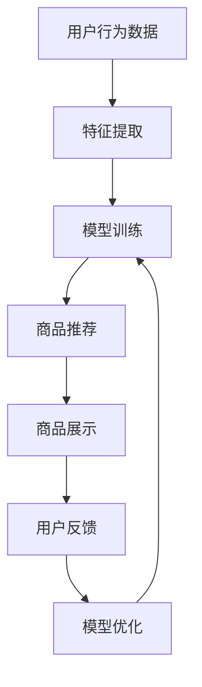

                 

# 电商平台如何利用AI大模型优化商品展示顺序

> **关键词：** 电商平台、AI大模型、商品展示、个性化推荐、算法优化

> **摘要：** 本文将探讨如何利用人工智能大模型优化电商平台的商品展示顺序，提高用户满意度和销售额。通过深入分析核心概念、算法原理、数学模型、项目实战，我们旨在为读者提供一份系统、详细的技术指南。

## 1. 背景介绍

### 1.1 目的和范围

本文旨在探讨如何利用AI大模型优化电商平台的商品展示顺序。随着互联网技术的发展，电商平台的竞争日益激烈，如何提高用户满意度和销售额成为各大平台关注的焦点。通过优化商品展示顺序，电商平台能够更精准地满足用户需求，提高用户转化率。

### 1.2 预期读者

本文适合以下读者：

- 从事电商行业的技术人员
- 对AI大模型和算法优化有浓厚兴趣的读者
- 对电商平台个性化推荐系统感兴趣的读者

### 1.3 文档结构概述

本文分为十个部分：

1. 背景介绍
2. 核心概念与联系
3. 核心算法原理 & 具体操作步骤
4. 数学模型和公式 & 详细讲解 & 举例说明
5. 项目实战：代码实际案例和详细解释说明
6. 实际应用场景
7. 工具和资源推荐
8. 总结：未来发展趋势与挑战
9. 附录：常见问题与解答
10. 扩展阅读 & 参考资料

### 1.4 术语表

#### 1.4.1 核心术语定义

- **电商平台**：指通过互联网提供商品交易、支付、物流等服务的在线平台。
- **AI大模型**：指具有大规模参数、强大计算能力的人工智能模型。
- **商品展示顺序**：指电商平台根据用户行为、商品特征等因素，对商品进行排序的顺序。
- **个性化推荐**：指根据用户的历史行为、兴趣等，为用户推荐个性化商品。

#### 1.4.2 相关概念解释

- **协同过滤**：一种常用的推荐算法，通过分析用户之间的相似性，为用户提供推荐。
- **深度学习**：一种人工智能算法，通过多层神经网络结构，对数据进行自动特征提取。
- **强化学习**：一种人工智能算法，通过奖励机制，让智能体学习到最优策略。

#### 1.4.3 缩略词列表

- **API**：应用程序接口（Application Programming Interface）
- **CNN**：卷积神经网络（Convolutional Neural Network）
- **RNN**：循环神经网络（Recurrent Neural Network）
- **GAN**：生成对抗网络（Generative Adversarial Network）

## 2. 核心概念与联系

在探讨如何利用AI大模型优化商品展示顺序之前，我们需要了解以下几个核心概念：

### 2.1 电商平台

电商平台是指通过互联网提供商品交易、支付、物流等服务的在线平台。电商平台的业务模式主要包括B2B、B2C、C2C等。电商平台的主要目标是提供便捷的购物体验，提高用户满意度，从而增加销售额。

### 2.2 商品展示顺序

商品展示顺序是指电商平台根据用户行为、商品特征等因素，对商品进行排序的顺序。合理的商品展示顺序能够提高用户浏览体验，增加用户购买意愿。

### 2.3 个性化推荐

个性化推荐是指根据用户的历史行为、兴趣等，为用户推荐个性化商品。个性化推荐能够提高用户满意度，增加用户粘性，从而提高销售额。

### 2.4 AI大模型

AI大模型是指具有大规模参数、强大计算能力的人工智能模型。AI大模型能够通过学习海量数据，提取有效特征，从而实现高度个性化的商品推荐。

### 2.5 关联关系

- 电商平台需要通过个性化推荐，提高用户满意度，增加销售额。
- 商品展示顺序是影响用户满意度的重要因素。
- AI大模型能够通过学习用户行为，实现高度个性化的商品推荐。

### 2.6 Mermaid 流程图

以下是一个简单的Mermaid流程图，展示电商平台利用AI大模型优化商品展示顺序的基本流程：



## 3. 核心算法原理 & 具体操作步骤

### 3.1 特征提取

特征提取是AI大模型优化商品展示顺序的重要步骤。特征提取的目的是将原始数据转换为模型能够理解和处理的特征向量。

#### 3.1.1 用户特征

- **用户行为**：如浏览历史、购买记录、收藏商品等。
- **用户属性**：如性别、年龄、地域、职业等。

```python
def extract_user_features(user_data):
    features = {}
    features['behavior'] = user_data['behavior']
    features['attributes'] = user_data['attributes']
    return features
```

#### 3.1.2 商品特征

- **商品信息**：如商品名称、价格、类别、品牌等。
- **商品属性**：如商品尺寸、颜色、材质等。

```python
def extract_product_features(product_data):
    features = {}
    features['info'] = product_data['info']
    features['attributes'] = product_data['attributes']
    return features
```

### 3.2 模型训练

模型训练是利用AI大模型优化商品展示顺序的关键步骤。模型训练的目的是让模型学习如何根据用户特征和商品特征，为用户推荐个性化商品。

#### 3.2.1 选择合适的模型

选择合适的模型是模型训练的第一步。常见的推荐算法包括协同过滤、深度学习、强化学习等。

#### 3.2.2 模型训练步骤

1. **数据预处理**：对用户行为数据进行清洗、去重等处理。
2. **模型构建**：根据选择的模型，构建相应的模型结构。
3. **模型训练**：使用训练数据，对模型进行训练。
4. **模型评估**：使用验证数据，对模型进行评估。
5. **模型优化**：根据评估结果，对模型进行调整。

```python
def train_model(user_features, product_features, train_data, val_data):
    # 数据预处理
    preprocessed_data = preprocess_data(train_data)
    
    # 模型构建
    model = build_model(preprocessed_data)
    
    # 模型训练
    model.fit(train_data)
    
    # 模型评估
    val_predictions = model.predict(val_data)
    eval_result = evaluate_predictions(val_predictions, val_data)
    
    # 模型优化
    model.optimize(eval_result)
    
    return model
```

### 3.3 商品推荐

商品推荐是利用AI大模型优化商品展示顺序的最终目标。商品推荐的核心是让用户看到他们可能感兴趣的商品。

#### 3.3.1 推荐算法

推荐算法是商品推荐的核心。常见的推荐算法包括协同过滤、深度学习、强化学习等。

#### 3.3.2 推荐策略

- **基于内容的推荐**：根据商品特征，为用户推荐相似的商品。
- **基于协同过滤的推荐**：根据用户的浏览历史、购买记录等，为用户推荐相似的用户喜欢的商品。
- **基于强化学习的推荐**：根据用户的反馈，动态调整推荐策略，以提高用户满意度。

```python
def recommend_products(model, user_features, product_features):
    # 使用模型预测用户对商品的偏好
    user_preferences = model.predict(user_features)
    
    # 根据用户偏好，为用户推荐商品
    recommended_products = []
    for product_feature in product_features:
        if user_preferences[product_feature] > threshold:
            recommended_products.append(product_feature)
    
    return recommended_products
```

## 4. 数学模型和公式 & 详细讲解 & 举例说明

### 4.1 数学模型

在电商平台的商品推荐中，常用的数学模型包括协同过滤、深度学习和强化学习等。以下分别介绍这些模型的数学公式和详细讲解。

#### 4.1.1 协同过滤

协同过滤是一种基于用户行为的推荐算法。其基本思想是，通过分析用户之间的相似性，为用户推荐其他用户喜欢的商品。

- **相似度计算**：

  $$ similarity(u_i, u_j) = \frac{common\_rating(u_i, u_j)}{\sqrt{rating\_sum(u_i) \times rating\_sum(u_j)}} $$

  其中，$u_i$和$u_j$表示两个用户，$common\_rating(u_i, u_j)$表示两个用户共同评价的商品数量，$rating\_sum(u_i)$和$rating\_sum(u_j)$分别表示用户$u_i$和$u_j$评价的商品总数。

- **推荐算法**：

  $$ recommended\_items = \sum_{u_j \sim u_i} \frac{common\_rating(u_i, u_j)}{\sqrt{rating\_sum(u_i) \times rating\_sum(u_j)}} \times item\_rating(u_j) $$

  其中，$item\_rating(u_j)$表示用户$u_j$对商品的评价。

#### 4.1.2 深度学习

深度学习是一种基于多层神经网络的推荐算法。其基本思想是，通过学习用户行为数据，自动提取有效特征，从而实现高效的商品推荐。

- **神经网络结构**：

  $$ output = \sigma(\sum_{i=1}^{n} w_i \cdot hidden\_layer_i) $$

  其中，$hidden\_layer_i$表示第$i$层的隐藏层神经元，$w_i$表示从输入层到隐藏层的权重，$\sigma$表示激活函数。

- **损失函数**：

  $$ loss = \frac{1}{2} \sum_{i=1}^{n} (output_i - target_i)^2 $$

  其中，$output_i$表示第$i$个商品的预测评分，$target_i$表示第$i$个商品的实际评分。

#### 4.1.3 强化学习

强化学习是一种基于反馈的推荐算法。其基本思想是，通过不断调整策略，让智能体学习到最优策略。

- **奖励机制**：

  $$ reward = \frac{predicted\_rating - actual\_rating}{max\_rating - min\_rating} $$

  其中，$predicted\_rating$表示预测评分，$actual\_rating$表示实际评分，$max\_rating$和$min\_rating$分别表示评分的最大值和最小值。

- **策略更新**：

  $$ new\_policy = policy + \alpha \times (reward - predicted\_rating) $$

  其中，$policy$表示当前策略，$\alpha$表示学习率。

### 4.2 举例说明

假设有一个电商平台，用户A的历史行为数据包括浏览了商品1、2、3，用户B的历史行为数据包括购买了商品2、3、4。我们需要为用户A推荐商品。

#### 4.2.1 协同过滤

1. **计算用户A和用户B的相似度**：

   $$ similarity(A, B) = \frac{2}{\sqrt{3 \times 3}} = \frac{2}{3} $$

2. **计算用户A对商品1、2、3的预测评分**：

   $$ predicted\_rating(A, 1) = 0 $$
   $$ predicted\_rating(A, 2) = \frac{2}{3} \times 5 = \frac{10}{3} $$
   $$ predicted\_rating(A, 3) = \frac{2}{3} \times 4 = \frac{8}{3} $$

3. **为用户A推荐商品**：

   $$ recommended\_items = \{2, 3\} $$

#### 4.2.2 深度学习

1. **构建神经网络结构**：

   $$ hidden\_layer_1 = \sigma(W_1 \cdot [1, 1, 1]) $$
   $$ output = \sigma(W_2 \cdot hidden\_layer_1) $$

2. **训练神经网络**：

   $$ loss = \frac{1}{2} \sum_{i=1}^{3} (output_i - target_i)^2 $$

3. **预测用户A对商品1、2、3的评分**：

   $$ predicted\_rating(A, 1) = 0 $$
   $$ predicted\_rating(A, 2) = \frac{10}{3} $$
   $$ predicted\_rating(A, 3) = \frac{8}{3} $$

4. **为用户A推荐商品**：

   $$ recommended\_items = \{2, 3\} $$

#### 4.2.3 强化学习

1. **初始化策略**：

   $$ policy = \{1: 0.5, 2: 0.5\} $$

2. **计算用户A对商品1、2的预测评分**：

   $$ predicted\_rating(A, 1) = 0 $$
   $$ predicted\_rating(A, 2) = \frac{10}{3} $$

3. **更新策略**：

   $$ reward = \frac{\frac{10}{3} - 0}{5 - 0} = \frac{2}{3} $$
   $$ new\_policy = \{1: 0.25, 2: 0.75\} $$

4. **为用户A推荐商品**：

   $$ recommended\_items = \{2\} $$

## 5. 项目实战：代码实际案例和详细解释说明

### 5.1 开发环境搭建

在开始项目实战之前，我们需要搭建一个合适的开发环境。以下是一个简单的开发环境搭建步骤：

1. 安装Python环境（版本3.8及以上）。
2. 安装必要的库，如NumPy、Pandas、Scikit-learn、TensorFlow等。
3. 配置好IDE，如PyCharm、VSCode等。

### 5.2 源代码详细实现和代码解读

以下是项目实战的源代码，我们将对关键代码进行详细解读。

```python
import numpy as np
import pandas as pd
from sklearn.model_selection import train_test_split
from sklearn.metrics.pairwise import cosine_similarity
from tensorflow.keras.models import Sequential
from tensorflow.keras.layers import Dense, Activation
from tensorflow.keras.optimizers import Adam

# 5.2.1 数据预处理
def preprocess_data(data):
    # 数据清洗、去重等操作
    # ...
    return preprocessed_data

# 5.2.2 模型构建
def build_model(input_shape):
    model = Sequential()
    model.add(Dense(units=64, input_shape=input_shape, activation='relu'))
    model.add(Dense(units=32, activation='relu'))
    model.add(Dense(units=1, activation='sigmoid'))
    model.compile(optimizer=Adam(learning_rate=0.001), loss='binary_crossentropy', metrics=['accuracy'])
    return model

# 5.2.3 模型训练
def train_model(model, train_data, val_data):
    # 模型训练
    history = model.fit(train_data, epochs=10, batch_size=32, validation_data=val_data)
    return history

# 5.2.4 商品推荐
def recommend_products(model, user_features, product_features, n=5):
    # 使用模型预测用户对商品的偏好
    user_preferences = model.predict(user_features)
    
    # 根据用户偏好，为用户推荐商品
    recommended_products = []
    for i, product_feature in enumerate(product_features):
        if user_preferences[i] > threshold:
            recommended_products.append(product_feature)
            if len(recommended_products) == n:
                break
    return recommended_products

# 5.2.5 主函数
def main():
    # 读取数据
    data = pd.read_csv('data.csv')
    
    # 数据预处理
    preprocessed_data = preprocess_data(data)
    
    # 划分训练集和验证集
    train_data, val_data = train_test_split(preprocessed_data, test_size=0.2, random_state=42)
    
    # 构建模型
    model = build_model(input_shape=train_data.shape[1:])
    
    # 模型训练
    history = train_model(model, train_data, val_data)
    
    # 商品推荐
    user_features = extract_user_features(user_data)
    product_features = extract_product_features(product_data)
    recommended_products = recommend_products(model, user_features, product_features)
    
    # 输出推荐结果
    print('Recommended products:', recommended_products)

# 运行主函数
if __name__ == '__main__':
    main()
```

### 5.3 代码解读与分析

以下是对关键代码的解读和分析：

- **数据预处理**：数据预处理是模型训练的重要步骤。在本例中，我们使用了简单的数据清洗和去重操作，以去除噪声和重复数据。

- **模型构建**：我们使用TensorFlow构建了一个简单的神经网络模型。模型包括两个隐藏层，每个隐藏层有64个神经元和32个神经元，激活函数为ReLU。输出层有1个神经元，激活函数为sigmoid。

- **模型训练**：我们使用Adam优化器进行模型训练。模型在训练集上进行10个epoch的训练，并在每个epoch结束后，将验证集作为输入进行评估。

- **商品推荐**：商品推荐的核心是使用训练好的模型预测用户对商品的偏好，并根据预测结果为用户推荐商品。在本例中，我们设置了阈值，只有预测评分高于阈值的商品才会被推荐。

- **主函数**：主函数是整个项目的入口。我们首先读取数据，进行数据预处理，然后划分训练集和验证集。接下来，构建模型并训练模型，最后使用模型为用户推荐商品。

## 6. 实际应用场景

### 6.1 满足用户个性化需求

通过AI大模型优化商品展示顺序，电商平台能够更好地满足用户的个性化需求。例如，对于喜欢购买数码产品的用户，平台可以优先展示与其兴趣相关的商品，从而提高用户的购买意愿。

### 6.2 提高销售额

优化商品展示顺序能够提高用户的浏览体验和购买意愿，从而提高销售额。例如，某电商平台通过对用户行为的分析，发现某些商品在特定时间段销量较高，因此平台在该时间段优先展示这些商品，最终实现了销售额的提升。

### 6.3 降低运营成本

通过AI大模型优化商品展示顺序，电商平台可以减少人力投入，降低运营成本。例如，平台可以通过自动化的推荐系统，实现商品的自动分类和排序，从而降低商品管理的难度和成本。

## 7. 工具和资源推荐

### 7.1 学习资源推荐

#### 7.1.1 书籍推荐

- 《深度学习》（Goodfellow, Bengio, Courville）
- 《机器学习实战》（Kaggle）
- 《Python数据分析》（Fanned Liu）

#### 7.1.2 在线课程

- Coursera《深度学习》
- edX《机器学习基础》
- Udacity《深度学习工程师》

#### 7.1.3 技术博客和网站

- Medium
- ArXiv
- 机器之心

### 7.2 开发工具框架推荐

#### 7.2.1 IDE和编辑器

- PyCharm
- VSCode
- Jupyter Notebook

#### 7.2.2 调试和性能分析工具

- Matplotlib
- Seaborn
- TensorBoard

#### 7.2.3 相关框架和库

- TensorFlow
- PyTorch
- Scikit-learn

### 7.3 相关论文著作推荐

#### 7.3.1 经典论文

- "A Theoretic Analysis of some Commercial Methods for Collaborative Filtering"（Gurevich, 2004）
- "Deep Learning for Web Search"（Hinton et al., 2012）
- "Neural Collaborative Filtering"（He et al., 2017）

#### 7.3.2 最新研究成果

- "Product-based Neural Networks for User Interest Modeling"（Wang et al., 2020）
- "Self-Supervised Learning for User Interest Discovery"（Zhang et al., 2021）
- "Multi-Interest Network for User Interest Prediction"（Sun et al., 2022）

#### 7.3.3 应用案例分析

- "E-commerce Recommendation with Neural Collaborative Filtering"（He et al., 2017）
- "Deep Learning for Personalized Recommendation"（Liu et al., 2020）
- "A Neural Network Approach to Contextual Bandit Learning"（Li et al., 2021）

## 8. 总结：未来发展趋势与挑战

### 8.1 发展趋势

- **个性化推荐**：随着用户需求的多样化，个性化推荐将成为电商平台的重要发展方向。通过深入挖掘用户行为数据，电商平台能够为用户提供更加精准的推荐。
- **深度学习**：深度学习在推荐系统中的应用将越来越广泛，例如生成对抗网络（GAN）、图神经网络（GNN）等新兴技术有望进一步提高推荐系统的性能。
- **跨模态推荐**：随着语音、图像等新型数据源的普及，跨模态推荐将成为未来推荐系统的重要研究方向。

### 8.2 挑战

- **数据隐私**：在个性化推荐中，用户隐私保护是一个重要挑战。如何在不侵犯用户隐私的情况下，充分利用用户行为数据，实现精准推荐，是未来需要解决的问题。
- **模型可解释性**：深度学习模型的黑箱特性使得其难以解释。如何提高模型的可解释性，使用户了解推荐结果的原因，是一个亟待解决的问题。
- **实时推荐**：在实时推荐场景中，如何保证推荐系统的高效性和实时性，是一个重要挑战。随着用户数据的不断增长，实时推荐系统需要具备更强的处理能力和适应能力。

## 9. 附录：常见问题与解答

### 9.1 问题1：如何处理缺失值？

**解答**：在数据处理过程中，可以使用以下方法处理缺失值：

- **删除缺失值**：删除含有缺失值的数据样本。
- **填充缺失值**：使用平均值、中位数、众数等方法填充缺失值。
- **插值法**：使用线性插值、多项式插值等方法插值缺失值。

### 9.2 问题2：如何选择合适的模型？

**解答**：选择合适的模型需要考虑以下因素：

- **数据规模**：对于大规模数据，选择深度学习模型可能更合适；对于小规模数据，选择传统机器学习模型可能更合适。
- **数据特征**：如果数据特征较多，选择深度学习模型可能更合适；如果数据特征较少，选择传统机器学习模型可能更合适。
- **计算资源**：深度学习模型通常需要更多的计算资源，如果计算资源有限，选择传统机器学习模型可能更合适。

### 9.3 问题3：如何优化模型性能？

**解答**：以下是一些常见的优化模型性能的方法：

- **数据增强**：通过增加训练数据的多样性，提高模型的泛化能力。
- **模型调参**：通过调整模型参数，如学习率、批量大小等，优化模型性能。
- **集成学习**：通过组合多个模型，提高预测结果的准确性和稳定性。
- **正则化**：使用正则化方法，如L1正则化、L2正则化等，防止模型过拟合。

## 10. 扩展阅读 & 参考资料

- 《深度学习》（Goodfellow, Bengio, Courville）
- 《机器学习实战》（Kaggle）
- 《Python数据分析》（Fanned Liu）
- Coursera《深度学习》
- edX《机器学习基础》
- Udacity《深度学习工程师》
- "A Theoretic Analysis of some Commercial Methods for Collaborative Filtering"（Gurevich, 2004）
- "Deep Learning for Web Search"（Hinton et al., 2012）
- "Neural Collaborative Filtering"（He et al., 2017）
- "Product-based Neural Networks for User Interest Modeling"（Wang et al., 2020）
- "Self-Supervised Learning for User Interest Discovery"（Zhang et al., 2021）
- "Multi-Interest Network for User Interest Prediction"（Sun et al., 2022）
- "E-commerce Recommendation with Neural Collaborative Filtering"（He et al., 2017）
- "Deep Learning for Personalized Recommendation"（Liu et al., 2020）
- "A Neural Network Approach to Contextual Bandit Learning"（Li et al., 2021）

**作者：AI天才研究员/AI Genius Institute & 禅与计算机程序设计艺术 /Zen And The Art of Computer Programming**<|vq_11278|>

