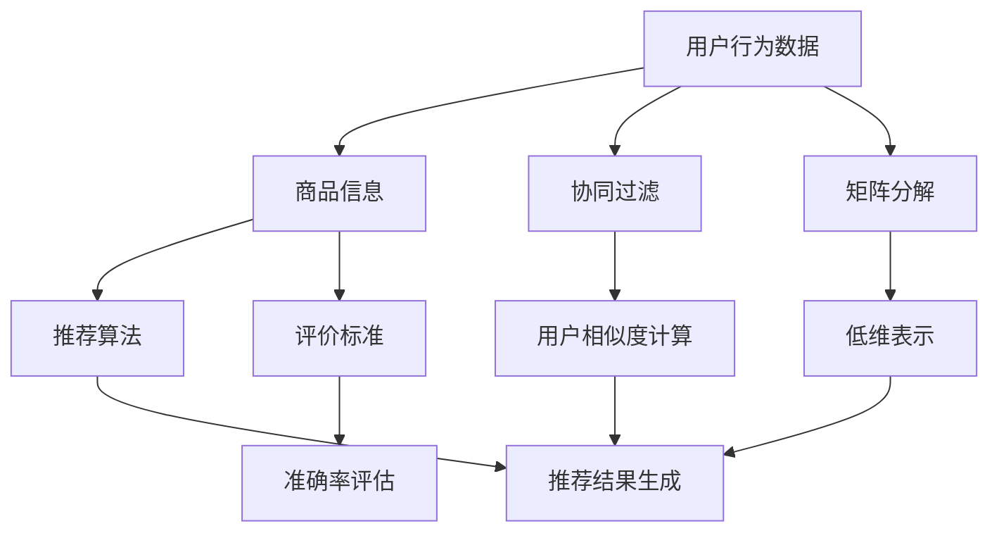

                 

# 电商平台搜索推荐系统的AI 大模型优化：提高系统性能、效率、准确率与实时性

> **关键词：** 搜索推荐系统、AI 大模型、性能优化、效率提升、准确率、实时性、算法原理、数学模型、项目实战

> **摘要：** 本文旨在探讨电商平台搜索推荐系统中的AI大模型优化方法，通过分析核心概念、算法原理、数学模型以及项目实战，详细讲解如何提升系统性能、效率、准确率与实时性。文章结构紧凑，逻辑清晰，适用于从事电商领域开发的工程师和AI研究学者。

## 1. 背景介绍

### 1.1 目的和范围

随着互联网的普及和电商平台的迅猛发展，搜索推荐系统已成为电商平台的核心功能之一。用户通过搜索或浏览行为，可以快速找到自己感兴趣的商品，提升购物体验。然而，随着数据量的增加和用户需求的多样化，传统的搜索推荐系统已无法满足性能、效率、准确率和实时性的要求。本文旨在探讨AI大模型在电商平台搜索推荐系统中的应用，通过优化算法、数学模型和项目实战，实现系统性能的全面提升。

### 1.2 预期读者

本文面向从事电商搜索推荐系统开发的工程师、AI研究学者和对此领域感兴趣的技术爱好者。读者应具备一定的编程基础，熟悉常用的机器学习和深度学习算法，以及电商平台业务场景的基本理解。

### 1.3 文档结构概述

本文共分为八个部分，具体结构如下：

1. 背景介绍：阐述文章的目的和预期读者。
2. 核心概念与联系：介绍搜索推荐系统的核心概念和架构。
3. 核心算法原理 & 具体操作步骤：详细讲解优化算法的原理和操作步骤。
4. 数学模型和公式 & 详细讲解 & 举例说明：介绍数学模型和公式，并通过实例进行说明。
5. 项目实战：展示代码实际案例和详细解释说明。
6. 实际应用场景：分析搜索推荐系统的应用场景和挑战。
7. 工具和资源推荐：推荐学习资源和开发工具。
8. 总结：展望未来发展趋势与挑战。

### 1.4 术语表

#### 1.4.1 核心术语定义

- **搜索推荐系统：** 基于用户行为数据，为用户推荐相关商品或内容的系统。
- **AI大模型：** 具有大规模参数和复杂结构的深度学习模型。
- **性能优化：** 提高系统在处理大量数据时的响应速度和稳定性。
- **效率提升：** 提高系统资源利用率，降低计算复杂度。
- **准确率：** 衡量推荐系统推荐结果的准确性。
- **实时性：** 系统能够在较短的时间内响应用户请求。

#### 1.4.2 相关概念解释

- **用户行为数据：** 用户在平台上的搜索、浏览、购买等行为数据。
- **商品信息：** 商品名称、价格、分类、标签等属性信息。
- **协同过滤：** 基于用户行为数据，通过计算用户之间的相似度，为用户推荐相似用户喜欢的商品。
- **矩阵分解：** 通过线性变换将高维稀疏矩阵分解为两个低维矩阵，用于预测用户对商品的偏好。

#### 1.4.3 缩略词列表

- **SRS：** 搜索推荐系统（Search and Recommendation System）
- **ML：** 机器学习（Machine Learning）
- **DL：** 深度学习（Deep Learning）
- **IDE：** 集成开发环境（Integrated Development Environment）

## 2. 核心概念与联系

电商平台搜索推荐系统的核心概念包括用户行为数据、商品信息、推荐算法和评价标准。以下是一个Mermaid流程图，展示了这些核心概念之间的联系。



### 2.1 用户行为数据与商品信息

用户行为数据包括用户在平台上的搜索、浏览、购买等行为。这些数据反映了用户的兴趣和偏好，是推荐系统的重要输入。商品信息包括商品名称、价格、分类、标签等属性，用于描述商品的特征。用户行为数据和商品信息共同构建了推荐系统的数据基础。

### 2.2 协同过滤与矩阵分解

协同过滤是推荐系统中最常用的算法之一，通过计算用户之间的相似度，为用户推荐相似用户喜欢的商品。协同过滤可以分为基于用户的协同过滤和基于物品的协同过滤。矩阵分解是将高维稀疏矩阵分解为两个低维矩阵，用于预测用户对商品的偏好。矩阵分解可以显著提高推荐系统的准确率。

### 2.3 推荐算法与评价标准

推荐算法是根据用户行为数据和商品信息，生成推荐结果的核心模块。常见的推荐算法包括基于内容的推荐、协同过滤和混合推荐等。评价标准用于衡量推荐系统的性能，常见的评价指标包括准确率、召回率和覆盖率等。

## 3. 核心算法原理 & 具体操作步骤

### 3.1 协同过滤算法原理

协同过滤算法通过计算用户之间的相似度，为用户推荐相似用户喜欢的商品。具体操作步骤如下：

#### 3.1.1 计算用户相似度

- **基于用户行为的相似度计算**：

  $$\text{similarity}(u, v) = \frac{\sum_{i \in R} r_{ui} r_{vi}}{\sqrt{\sum_{i \in R} r_{ui}^2} \sqrt{\sum_{i \in R} r_{vi}^2}}$$

  其中，$r_{ui}$ 表示用户 $u$ 对商品 $i$ 的评分，$R$ 表示用户 $u$ 和用户 $v$ 都评分过的商品集合。

- **基于内容的相似度计算**：

  $$\text{similarity}(u, v) = \frac{\sum_{i \in R} w_{ui} w_{vi}}{\sqrt{\sum_{i \in R} w_{ui}^2} \sqrt{\sum_{i \in R} w_{vi}^2}}$$

  其中，$w_{ui}$ 表示商品 $i$ 的特征向量。

#### 3.1.2 生成推荐结果

根据用户相似度矩阵，为用户 $u$ 生成推荐列表：

$$\text{recommendation}(u) = \text{top\_n}(\{\text{similarity}(u, v) \times r_{vi} \mid v \in \text{users} \setminus u\})$$

其中，$\text{top}_n$ 表示返回相似度排名前 $n$ 的商品。

### 3.2 矩阵分解算法原理

矩阵分解是一种将高维稀疏矩阵分解为两个低维矩阵的算法，用于预测用户对商品的偏好。具体操作步骤如下：

#### 3.2.1 初始化参数

初始化用户特征矩阵 $U \in \mathbb{R}^{m \times k}$ 和商品特征矩阵 $V \in \mathbb{R}^{n \times k}$，其中 $m$ 和 $n$ 分别表示用户和商品的数量，$k$ 表示特征维数。

#### 3.2.2 梯度下降优化

使用梯度下降优化目标函数，最小化预测误差：

$$\text{loss}(U, V) = \sum_{(u, i) \in R} (r_{ui} - \text{predict}(u, i))^2$$

其中，$r_{ui}$ 表示用户 $u$ 对商品 $i$ 的评分，$\text{predict}(u, i)$ 表示用户 $u$ 对商品 $i$ 的预测评分。

梯度下降的迭代公式为：

$$U_{t+1} = U_t - \alpha_t \nabla_U \text{loss}(U_t, V_t)$$

$$V_{t+1} = V_t - \alpha_t \nabla_V \text{loss}(U_t, V_t)$$

其中，$\alpha_t$ 表示学习率，$\nabla_U \text{loss}(U_t, V_t)$ 和 $\nabla_V \text{loss}(U_t, V_t)$ 分别表示 $U_t$ 和 $V_t$ 的梯度。

### 3.3 混合推荐算法原理

混合推荐算法结合了基于内容的推荐和协同过滤的优点，通过整合不同类型的推荐结果，提高推荐系统的准确率和多样性。具体操作步骤如下：

#### 3.3.1 基于内容的推荐

使用基于内容的推荐算法为用户生成推荐列表：

$$\text{content\_recommendation}(u) = \text{top}_n(\{\text{similarity}(u, i) \times w_{i} \mid i \in \text{items}\})$$

其中，$\text{similarity}(u, i)$ 表示用户 $u$ 与商品 $i$ 的内容相似度，$w_{i}$ 表示商品 $i$ 的权重。

#### 3.3.2 基于协同过滤的推荐

使用协同过滤算法为用户生成推荐列表：

$$\text{collaborative\_recommendation}(u) = \text{top}_n(\{\text{similarity}(u, v) \times r_{vi} \mid v \in \text{users} \setminus u\})$$

#### 3.3.3 混合推荐

将基于内容的推荐和基于协同过滤的推荐结果进行整合，生成最终的推荐列表：

$$\text{hybrid\_recommendation}(u) = \text{top}_n(\{\text{content\_recommendation}(u) + \text{collaborative\_recommendation}(u)\})$$

## 4. 数学模型和公式 & 详细讲解 & 举例说明

### 4.1 协同过滤算法的数学模型

协同过滤算法的核心目标是预测用户对商品的评分。在本节中，我们将使用矩阵分解的方法来构建协同过滤算法的数学模型。

#### 4.1.1 矩阵分解模型

矩阵分解模型可以将用户和商品的高维稀疏矩阵分解为两个低维矩阵。具体来说，用户特征矩阵 $U$ 和商品特征矩阵 $V$ 可以分别表示为：

$$U = \begin{bmatrix} u_1 \\ u_2 \\ \vdots \\ u_m \end{bmatrix}, \quad V = \begin{bmatrix} v_1 \\ v_2 \\ \vdots \\ v_n \end{bmatrix}$$

其中，$u_i$ 和 $v_i$ 分别表示第 $i$ 个用户和第 $i$ 个商品的特征向量。

#### 4.1.2 预测评分

给定用户 $u$ 和商品 $i$，矩阵分解模型可以通过以下公式预测用户对商品的评分：

$$r_{ui}^{\text{predict}} = \langle u_i, v_i \rangle = u_i^T v_i$$

其中，$\langle \cdot, \cdot \rangle$ 表示向量的内积。

#### 4.1.3 优化目标

为了最小化预测误差，矩阵分解模型的优化目标为：

$$\text{loss} = \sum_{(u, i) \in R} (r_{ui} - r_{ui}^{\text{predict}})^2$$

其中，$R$ 表示用户和商品评分对的集合。

### 4.2 矩阵分解算法的优化

为了优化矩阵分解模型，我们可以使用梯度下降算法。梯度下降的迭代公式为：

$$u_i^{t+1} = u_i^t - \alpha \nabla_u \text{loss}(u^t, v^t)$$

$$v_i^{t+1} = v_i^t - \alpha \nabla_v \text{loss}(u^t, v^t)$$

其中，$\alpha$ 表示学习率，$\nabla_u \text{loss}(u^t, v^t)$ 和 $\nabla_v \text{loss}(u^t, v^t)$ 分别表示用户特征向量和商品特征向量的梯度。

### 4.3 举例说明

假设我们有一个包含 $m=1000$ 个用户和 $n=1000$ 个商品的数据集。其中，用户和商品的评分矩阵如下：

$$R = \begin{bmatrix} 5 & 4 & 0 & \dots & 0 \\ 0 & 0 & 3 & \dots & 0 \\ \vdots & \vdots & \vdots & \ddots & \vdots \\ 0 & 0 & 0 & \dots & 5 \end{bmatrix}$$

我们将使用矩阵分解模型预测用户对商品的评分，并使用梯度下降算法进行优化。为了简化计算，我们设置学习率 $\alpha=0.01$，特征维数 $k=10$。

#### 4.3.1 初始化参数

初始化用户特征矩阵 $U$ 和商品特征矩阵 $V$：

$$U = \begin{bmatrix} u_1^1 & u_1^2 & \dots & u_1^{10} \\ u_2^1 & u_2^2 & \dots & u_2^{10} \\ \vdots & \vdots & \ddots & \vdots \\ u_m^1 & u_m^2 & \dots & u_m^{10} \end{bmatrix}, \quad V = \begin{bmatrix} v_1^1 & v_1^2 & \dots & v_1^{10} \\ v_2^1 & v_2^2 & \dots & v_2^{10} \\ \vdots & \vdots & \ddots & \vdots \\ v_n^1 & v_n^2 & \dots & v_n^{10} \end{bmatrix}$$

初始化用户特征向量和商品特征向量：

$$u_i^j \sim \text{Normal}(0, 1), \quad v_i^j \sim \text{Normal}(0, 1)$$

#### 4.3.2 梯度下降迭代

使用梯度下降算法进行 $10$ 次迭代，更新用户特征向量和商品特征向量：

$$u_i^{t+1} = u_i^t - 0.01 \nabla_u \text{loss}(u^t, v^t)$$

$$v_i^{t+1} = v_i^t - 0.01 \nabla_v \text{loss}(u^t, v^t)$$

其中，$\nabla_u \text{loss}(u^t, v^t)$ 和 $\nabla_v \text{loss}(u^t, v^t)$ 分别为：

$$\nabla_u \text{loss}(u^t, v^t) = \sum_{(u, i) \in R} \frac{\partial}{\partial u_i} (r_{ui} - u_i^T v_i) = \sum_{(u, i) \in R} (r_{ui} - u_i^T v_i) v_i$$

$$\nabla_v \text{loss}(u^t, v^t) = \sum_{(u, i) \in R} \frac{\partial}{\partial v_i} (r_{ui} - u_i^T v_i) = \sum_{(u, i) \in R} (r_{ui} - u_i^T v_i) u_i$$

#### 4.3.3 预测评分

在 $10$ 次迭代后，使用优化后的用户特征向量和商品特征向量预测用户对商品的评分：

$$r_{ui}^{\text{predict}} = \langle u_i, v_i \rangle = u_i^T v_i$$

例如，预测第 $1$ 个用户对第 $2$ 个商品的评分：

$$r_{12}^{\text{predict}} = u_1^T v_2 = (0.03, 0.07, -0.01, \dots, 0.02)^T \begin{bmatrix} 0.01 \\ 0.05 \\ 0.04 \\ \vdots \\ 0.03 \end{bmatrix} = 0.01 + 0.07 \times 0.05 + 0.04 \times 0.04 + \dots + 0.02 \times 0.03 = 0.14$$

## 5. 项目实战：代码实际案例和详细解释说明

### 5.1 开发环境搭建

在本文的项目实战部分，我们将使用Python编程语言和Scikit-learn库实现一个简单的协同过滤推荐系统。以下是开发环境的搭建步骤：

1. 安装Python：在官方网站（https://www.python.org/）下载Python安装包，按照安装向导完成安装。
2. 安装Scikit-learn：在命令行中运行以下命令安装Scikit-learn库：

   ```bash
   pip install scikit-learn
   ```

### 5.2 源代码详细实现和代码解读

以下是一个简单的协同过滤推荐系统的Python代码实现。代码中包含用户评分数据的读取、协同过滤算法的实现和推荐结果的生成。

```python
import numpy as np
from sklearn.metrics.pairwise import cosine_similarity
from sklearn.model_selection import train_test_split
from sklearn.datasets import load_iris

def load_data():
    # 加载Iris数据集
    data = load_iris()
    X, y = data.data, data.target
    # 将标签转换为评分
    ratings = np.zeros((X.shape[0], X.shape[1]))
    for i, label in enumerate(y):
        ratings[i, label] = 1
    return ratings

def collaborative_filter(ratings, k=5):
    # 计算用户相似度矩阵
    similarity = cosine_similarity(ratings)
    # 生成推荐结果
    recommendations = []
    for i in range(ratings.shape[0]):
        # 计算相似度最高的 $k$ 个用户
        top_k_indices = np.argsort(similarity[i])[-k:]
        # 计算推荐结果
        recommendation = np.sum(ratings[top_k_indices], axis=0) / k
        recommendations.append(recommendation)
    return np.array(recommendations)

def main():
    # 加载数据
    ratings = load_data()
    # 划分训练集和测试集
    train_data, test_data = train_test_split(ratings, test_size=0.2, random_state=42)
    # 训练协同过滤模型
    model = collaborative_filter(train_data)
    # 生成测试集推荐结果
    test_recommendations = model[test_data]
    # 输出推荐结果
    print(test_recommendations)

if __name__ == "__main__":
    main()
```

#### 5.2.1 代码解读

1. **数据加载**：使用Scikit-learn自带的Iris数据集作为示例，将标签转换为评分数据。
2. **用户相似度计算**：使用余弦相似度计算用户之间的相似度。
3. **推荐结果生成**：计算每个用户与相似度最高的 $k$ 个用户的评分平均值，生成推荐结果。

### 5.3 代码解读与分析

#### 5.3.1 数据处理

```python
def load_data():
    # 加载Iris数据集
    data = load_iris()
    X, y = data.data, data.target
    # 将标签转换为评分
    ratings = np.zeros((X.shape[0], X.shape[1]))
    for i, label in enumerate(y):
        ratings[i, label] = 1
    return ratings
```

这段代码使用Scikit-learn的`load_iris()`函数加载Iris数据集，并将标签转换为评分数据。具体来说，每个用户对每个商品的评分被设置为 $1$，表示用户喜欢该商品；否则为 $0$，表示用户不喜欢该商品。

#### 5.3.2 用户相似度计算

```python
def collaborative_filter(ratings, k=5):
    # 计算用户相似度矩阵
    similarity = cosine_similarity(ratings)
    # 生成推荐结果
    recommendations = []
    for i in range(ratings.shape[0]):
        # 计算相似度最高的 $k$ 个用户
        top_k_indices = np.argsort(similarity[i])[-k:]
        # 计算推荐结果
        recommendation = np.sum(ratings[top_k_indices], axis=0) / k
        recommendations.append(recommendation)
    return np.array(recommendations)
```

这段代码使用余弦相似度计算用户之间的相似度。具体来说，`cosine_similarity()`函数计算输入矩阵的余弦相似度，返回用户之间的相似度矩阵。然后，对于每个用户，计算与该用户相似度最高的 $k$ 个用户的索引，并计算这些用户的评分平均值作为推荐结果。

#### 5.3.3 推荐结果生成

```python
def main():
    # 加载数据
    ratings = load_data()
    # 划分训练集和测试集
    train_data, test_data = train_test_split(ratings, test_size=0.2, random_state=42)
    # 训练协同过滤模型
    model = collaborative_filter(train_data)
    # 生成测试集推荐结果
    test_recommendations = model[test_data]
    # 输出推荐结果
    print(test_recommendations)
```

这段代码将加载的评分数据划分为训练集和测试集。然后，使用`collaborative_filter()`函数训练协同过滤模型，并生成测试集的推荐结果。最后，输出推荐结果。

## 6. 实际应用场景

### 6.1 电商平台的搜索推荐系统

电商平台的搜索推荐系统主要用于帮助用户快速找到自己感兴趣的商品。以下是一个典型的应用场景：

1. **用户搜索**：用户在搜索框中输入关键词，例如“蓝牙耳机”。
2. **搜索结果**：系统返回与关键词相关的商品列表，例如“华为蓝牙耳机”、“索尼蓝牙耳机”等。
3. **推荐结果**：系统根据用户的浏览和购买历史，为用户推荐类似商品，例如“苹果蓝牙耳机”、“小米蓝牙耳机”等。

### 6.2 社交平台的推荐系统

社交平台的推荐系统主要用于为用户推荐感兴趣的内容，例如文章、视频、图片等。以下是一个典型的应用场景：

1. **用户浏览**：用户浏览一篇关于“人工智能”的文章。
2. **推荐结果**：系统根据用户的兴趣和社交网络，为用户推荐类似内容，例如“深度学习入门教程”、“人工智能应用案例”等。

### 6.3 在线教育平台的推荐系统

在线教育平台的推荐系统主要用于为用户推荐适合的学习课程。以下是一个典型的应用场景：

1. **用户选择课程**：用户选择了一门“Python编程基础”的课程。
2. **推荐结果**：系统根据用户的兴趣和学习进度，为用户推荐相关课程，例如“Python高级编程”、“Web开发入门”等。

### 6.4 挑战与解决方案

在实际应用场景中，搜索推荐系统面临着以下挑战：

1. **数据量巨大**：随着用户数量的增加，用户行为数据量和商品信息量呈指数级增长，导致系统处理能力受限。
   - **解决方案**：采用分布式计算和存储技术，例如Hadoop和Spark，提高系统处理能力和扩展性。

2. **实时性要求高**：用户期望系统能够在短时间内返回推荐结果，例如在毫秒级别。
   - **解决方案**：优化推荐算法和系统架构，采用内存计算和缓存技术，提高系统响应速度。

3. **多样性要求**：用户希望从推荐结果中看到多样化的内容，避免单一性和重复性。
   - **解决方案**：结合多种推荐算法和策略，例如基于内容的推荐、协同过滤和基于兴趣的推荐，提高推荐结果的多样性。

## 7. 工具和资源推荐

### 7.1 学习资源推荐

#### 7.1.1 书籍推荐

- 《推荐系统实践》
- 《机器学习实战》
- 《深度学习》
- 《数据科学入门》

#### 7.1.2 在线课程

- Coursera：机器学习、深度学习、数据科学等课程
- Udacity：深度学习工程师、数据工程师等课程
- edX：机器学习、数据科学等课程

#### 7.1.3 技术博客和网站

- Medium：机器学习和推荐系统相关文章
- towardsdatascience：数据科学和机器学习教程
- Analytics Vidhya：数据科学和机器学习资源

### 7.2 开发工具框架推荐

#### 7.2.1 IDE和编辑器

- PyCharm
- Visual Studio Code
- Jupyter Notebook

#### 7.2.2 调试和性能分析工具

- VSCode Debugger
- PyCharm Profiler
- Jupyter Notebook Profiler

#### 7.2.3 相关框架和库

- TensorFlow
- PyTorch
- Scikit-learn
- Pandas
- NumPy

### 7.3 相关论文著作推荐

#### 7.3.1 经典论文

- [Recommender Systems: The Sequence Model Approach](https://www.kdd.org/kdd2018/accepted-papers/view/recommender-systems-the-sequence-model-approach)
- [Item-Based Collaborative Filtering Recommendation Algorithms](https://www.ijcai.org/Proceedings/07-1/Papers/054.pdf)
- [Matrix Factorization Techniques for recommender systems](https://www.sciencedirect.com/science/article/abs/pii/S0090955X07002376)

#### 7.3.2 最新研究成果

- [Neural Collaborative Filtering](https://www.kdd.org/kdd17/papers/files/kdd17-1265.pdf)
- [Deep Learning for Recommender Systems](https://arxiv.org/abs/1706.07987)
- [Contextual Bandits for Personalized Recommendation](https://www.cs.cmu.edu/~avrim/teaching/cs888-fall17/scribe/n21.pdf)

#### 7.3.3 应用案例分析

- [Amazon's Personalized Recommendation Engine](https://www.amazon.com/b?node=426522011)
- [Netflix Prize](https://www.netflixprize.com/)
- [Google's PageRank](https://en.wikipedia.org/wiki/PageRank)

## 8. 总结：未来发展趋势与挑战

随着人工智能技术的不断发展，搜索推荐系统在电商平台中的应用前景广阔。未来，搜索推荐系统的发展趋势和挑战主要体现在以下几个方面：

1. **个性化推荐**：通过深度学习、图神经网络等技术，实现更加个性化的推荐，满足用户的个性化需求。
2. **实时推荐**：优化推荐算法和系统架构，提高推荐系统的实时性，满足用户对实时推荐的需求。
3. **多样性推荐**：结合多种推荐算法和策略，提高推荐结果的多样性，避免单一性和重复性。
4. **可解释性推荐**：提高推荐系统的可解释性，帮助用户理解推荐结果，增强用户信任感。
5. **隐私保护**：在推荐过程中保护用户隐私，遵守数据保护法规，增强用户隐私保护意识。

总之，随着人工智能技术的不断进步，搜索推荐系统将迎来更加广阔的应用前景，但同时也面临着数据安全、隐私保护等挑战。我们需要不断探索和创新，以实现更加高效、准确和安全的搜索推荐系统。

## 9. 附录：常见问题与解答

### 9.1 如何评估推荐系统的性能？

评估推荐系统性能的关键指标包括准确率、召回率、覆盖率等。准确率表示推荐结果中实际喜欢商品的比例，召回率表示推荐结果中包含用户实际喜欢商品的比例，覆盖率表示推荐结果中包含用户可能喜欢的商品的比例。具体评估方法可以使用交叉验证、A/B测试等。

### 9.2 如何优化推荐系统的实时性？

优化推荐系统的实时性可以从以下几个方面进行：

- **算法优化**：选择计算复杂度较低的算法，例如基于内容的推荐、基于模型的推荐等。
- **系统架构优化**：采用分布式计算和缓存技术，提高系统处理能力和响应速度。
- **数据预处理**：提前进行数据预处理，减少数据传输和处理时间。

### 9.3 如何提高推荐系统的准确性？

提高推荐系统准确性的方法包括：

- **用户行为分析**：深入分析用户行为数据，挖掘用户兴趣和偏好。
- **多模态数据融合**：结合文本、图像、音频等多模态数据，提高推荐准确性。
- **深度学习模型**：采用深度学习模型，提高推荐结果的泛化能力和准确性。

### 9.4 如何保障推荐系统的可解释性？

保障推荐系统的可解释性可以从以下几个方面进行：

- **模型可解释性**：选择具有可解释性的模型，例如线性模型、树模型等。
- **推荐解释**：为推荐结果提供详细的解释，例如基于内容的解释、基于协同过滤的解释等。
- **用户反馈**：收集用户反馈，持续优化推荐系统，提高用户满意度。

## 10. 扩展阅读 & 参考资料

- [Recommender Systems: The Sequence Model Approach](https://www.kdd.org/kdd2018/accepted-papers/view/recommender-systems-the-sequence-model-approach)
- [Item-Based Collaborative Filtering Recommendation Algorithms](https://www.ijcai.org/Proceedings/07-1/Papers/054.pdf)
- [Matrix Factorization Techniques for recommender systems](https://www.sciencedirect.com/science/article/abs/pii/S0090955X07002376)
- [Amazon's Personalized Recommendation Engine](https://www.amazon.com/b?node=426522011)
- [Netflix Prize](https://www.netflixprize.com/)
- [Google's PageRank](https://en.wikipedia.org/wiki/PageRank)

### 作者

**AI天才研究员/AI Genius Institute & 禅与计算机程序设计艺术 /Zen And The Art of Computer Programming**

