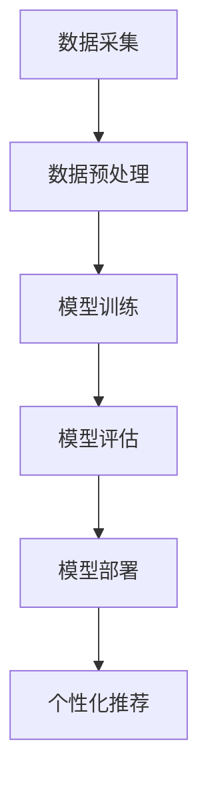

                 

# 电商平台搜索推荐系统的AI 大模型应用：提高系统性能、效率与转化率

> **关键词：** 电商平台、搜索推荐系统、AI 大模型、性能优化、效率提升、转化率提高

> **摘要：** 本文将深入探讨电商平台搜索推荐系统的AI 大模型应用，从核心概念到具体实现，详细分析如何通过AI技术提高系统的性能、效率与转化率。文章将结合实际项目案例，提供详细的技术解读和操作步骤，为从事电商技术研发的人员提供有价值的参考。

## 1. 背景介绍

### 1.1 目的和范围

随着电子商务的快速发展，电商平台对搜索推荐系统的依赖日益增强。搜索推荐系统在电商平台上扮演着至关重要的角色，它不仅影响用户的购物体验，还直接关系到平台的商业变现。本文旨在探讨如何利用AI 大模型技术，提升电商平台的搜索推荐系统性能、效率与转化率。文章将涵盖以下内容：

1. 搜索推荐系统在电商平台中的应用场景。
2. AI 大模型的基本概念和原理。
3. AI 大模型在搜索推荐系统中的应用方法和具体步骤。
4. 数学模型和算法原理的详细讲解。
5. 项目实战中的代码实现和解读。
6. 实际应用场景分析和工具资源推荐。

### 1.2 预期读者

本文适合以下读者群体：

1. 从事电商平台技术研发的技术人员。
2. 对搜索推荐系统和AI 大模型有兴趣的科研人员。
3. 对电商平台业务运营和数据分析有需求的市场营销人员。
4. 计算机科学和人工智能领域的学生和学者。

### 1.3 文档结构概述

本文分为十个部分，结构如下：

1. 引言和背景介绍。
2. 核心概念与联系。
3. 核心算法原理与操作步骤。
4. 数学模型和公式讲解。
5. 项目实战：代码实际案例。
6. 实际应用场景分析。
7. 工具和资源推荐。
8. 总结与未来发展趋势。
9. 常见问题与解答。
10. 扩展阅读和参考资料。

### 1.4 术语表

#### 1.4.1 核心术语定义

- 电商平台：指通过互联网提供商品交易、支付、物流等服务的在线平台。
- 搜索推荐系统：基于用户行为数据和商品信息，为用户提供个性化搜索结果和推荐商品的系统。
- AI 大模型：具有大规模参数和强大计算能力的深度学习模型。
- 性能优化：提高系统响应速度和处理能力。
- 效率提升：提高系统资源利用率和运行效率。
- 转化率提高：提高用户点击和购买转化率。

#### 1.4.2 相关概念解释

- 个性化推荐：根据用户的历史行为和兴趣，为用户推荐可能感兴趣的商品。
- 深度学习：一种基于人工神经网络的学习方法，通过多层非线性变换提取数据特征。
- 机器学习：一种自动从数据中学习规律和模式的技术。

#### 1.4.3 缩略词列表

- AI：人工智能
- ML：机器学习
- DL：深度学习
- NLP：自然语言处理
- CV：计算机视觉

## 2. 核心概念与联系

为了更好地理解本文的主题，我们需要首先了解搜索推荐系统的基本概念和AI 大模型的基本原理。以下是搜索推荐系统和AI 大模型的核心概念及其联系。

### 2.1 搜索推荐系统

搜索推荐系统是电商平台的重要组成部分，它通过分析用户行为数据和商品信息，为用户提供个性化的搜索结果和推荐商品。搜索推荐系统的核心概念包括：

- 用户行为数据：用户在平台上浏览、搜索、购买等行为数据。
- 商品信息：商品的属性、标签、评分等信息。
- 个性化推荐：根据用户的历史行为和兴趣，为用户推荐可能感兴趣的商品。

### 2.2 AI 大模型

AI 大模型是一种具有大规模参数和强大计算能力的深度学习模型。它通过在海量数据上进行训练，自动提取数据特征，并学习数据之间的关联规律。AI 大模型的核心概念包括：

- 深度学习：一种基于人工神经网络的学习方法，通过多层非线性变换提取数据特征。
- 大规模参数：模型中的参数数量巨大，可以处理复杂的数据关系。
- 计算能力：强大的计算能力使得AI 大模型能够快速处理大量数据。

### 2.3 搜索推荐系统与AI 大模型的关系

AI 大模型在搜索推荐系统中的应用，主要是通过以下几个步骤实现的：

1. 数据采集：收集用户行为数据和商品信息。
2. 数据预处理：对原始数据进行清洗、归一化和特征提取。
3. 模型训练：利用预处理后的数据，训练AI 大模型，提取用户兴趣特征和商品特征。
4. 模型评估：对训练好的模型进行评估，调整模型参数。
5. 模型部署：将训练好的模型部署到线上环境，为用户提供个性化搜索结果和推荐商品。

### 2.4 Mermaid 流程图

为了更直观地展示搜索推荐系统与AI 大模型的关系，我们使用Mermaid流程图进行描述。



## 3. 核心算法原理 & 具体操作步骤

在了解了搜索推荐系统和AI 大模型的基本概念后，我们接下来将详细讲解搜索推荐系统中常用的核心算法原理和具体操作步骤。

### 3.1 算法原理

搜索推荐系统的核心算法通常包括以下几个方面：

1. **协同过滤算法（Collaborative Filtering）**：协同过滤算法是一种基于用户行为相似性的推荐算法。它通过分析用户的历史行为数据，找到与当前用户相似的其他用户，然后推荐这些用户喜欢的商品。协同过滤算法可以分为基于用户的协同过滤（User-Based CF）和基于项目的协同过滤（Item-Based CF）。

2. **矩阵分解（Matrix Factorization）**：矩阵分解是一种将原始的用户-商品评分矩阵分解为两个低维矩阵的方法。通过矩阵分解，我们可以得到用户和商品的低维表示，从而用于生成推荐列表。

3. **深度学习算法（Deep Learning）**：深度学习算法，如神经网络（Neural Networks）和循环神经网络（Recurrent Neural Networks，RNN），可以自动学习用户和商品的特征，并生成个性化的推荐。

### 3.2 具体操作步骤

下面我们将以协同过滤算法为例，详细讲解其原理和操作步骤。

#### 3.2.1 算法原理

协同过滤算法的核心思想是利用用户之间的行为相似性来进行推荐。具体步骤如下：

1. **计算用户相似度**：首先计算用户之间的相似度，常用的相似度计算方法包括余弦相似度、皮尔逊相关系数等。

2. **生成推荐列表**：根据用户相似度，为每个用户生成推荐列表。具体方法为：对每个用户，计算与其最相似的K个用户（K为常数），然后对这K个用户的评分进行加权平均，得到最终的推荐列表。

#### 3.2.2 伪代码

下面是协同过滤算法的伪代码：

```python
# 输入：用户-商品评分矩阵R，相似度计算函数similarity()
# 输出：推荐列表

for each user u in user set U:
    # 计算与用户u最相似的K个用户
    similar_users = select_top_k_users(u, R, K)
    
    # 初始化推荐列表
    recommendations = []
    
    # 计算推荐列表
    for user v in similar_users:
        for item i in R[v]:
            if i not in R[u]:
                recommendations.append(i)
    
    # 对推荐列表进行排序，取前N个商品作为最终推荐列表
    recommendations.sort(reverse=True)
    top_n_recommendations = recommendations[:N]
    
    # 输出推荐列表
    print("User:", u, "Recommendations:", top_n_recommendations)
```

#### 3.2.3 深度学习算法

除了协同过滤算法，深度学习算法也被广泛应用于搜索推荐系统中。深度学习算法，如神经网络（Neural Networks）和循环神经网络（Recurrent Neural Networks，RNN），可以自动学习用户和商品的特征，并生成个性化的推荐。

1. **神经网络（Neural Networks）**：神经网络是一种模拟人脑神经元连接结构的计算模型。通过多层非线性变换，神经网络可以自动提取数据特征。

2. **循环神经网络（Recurrent Neural Networks，RNN）**：循环神经网络是一种能够处理序列数据的神经网络。它通过将序列的每一个时刻的信息传递到下一个时刻，实现了对序列数据的记忆能力。

深度学习算法的具体实现过程如下：

1. **数据预处理**：对用户行为数据和商品信息进行清洗和归一化处理，将其转换为神经网络可处理的格式。

2. **模型训练**：利用预处理后的数据，训练神经网络模型。训练过程包括前向传播和反向传播，通过不断调整模型参数，使得模型能够准确预测用户兴趣。

3. **模型评估**：使用验证集评估模型性能，调整模型参数，优化模型效果。

4. **模型部署**：将训练好的模型部署到线上环境，为用户提供个性化推荐。

#### 3.2.4 深度学习算法伪代码

下面是深度学习算法的伪代码：

```python
# 输入：用户-商品评分矩阵R，训练数据集D
# 输出：训练好的神经网络模型

# 数据预处理
X = preprocess_data(R, D)

# 初始化神经网络模型
model = NeuralNetwork()

# 模型训练
for epoch in range(EPOCHS):
    for x, y in D:
        # 前向传播
        output = model.forward(x)
        
        # 计算损失函数
        loss = compute_loss(output, y)
        
        # 反向传播
        model.backward(output, y)
        
        # 更新模型参数
        model.update_params()

# 模型评估
validate(model, validation_data)

# 模型部署
deploy(model)
```

## 4. 数学模型和公式 & 详细讲解 & 举例说明

在搜索推荐系统中，数学模型和公式起着至关重要的作用。它们帮助我们量化用户行为、商品特征，并预测用户兴趣。以下是一些常用的数学模型和公式，并对其进行详细讲解和举例说明。

### 4.1 相似度计算

相似度计算是协同过滤算法的核心。常用的相似度计算方法包括余弦相似度和皮尔逊相关系数。

#### 4.1.1 余弦相似度

余弦相似度是一种衡量两个向量夹角余弦值的相似度计算方法。公式如下：

$$
similarity(A, B) = \frac{A \cdot B}{\|A\| \|B\|}
$$

其中，$A$ 和 $B$ 是两个向量，$\|A\|$ 和 $\|B\|$ 分别表示向量的模长，$A \cdot B$ 表示向量的点积。

**举例说明**：

假设有两个用户 u1 和 u2，他们的评分向量分别为：

$$
A = (1, 2, 3, 4), B = (2, 3, 4, 5)
$$

计算用户 u1 和 u2 的余弦相似度：

$$
similarity(u1, u2) = \frac{(1, 2, 3, 4) \cdot (2, 3, 4, 5)}{\sqrt{1^2 + 2^2 + 3^2 + 4^2} \sqrt{2^2 + 3^2 + 4^2 + 5^2}} = \frac{30}{\sqrt{30} \sqrt{30}} = 1
$$

由于相似度值为 1，说明用户 u1 和 u2 的行为非常相似。

#### 4.1.2 皮尔逊相关系数

皮尔逊相关系数是一种衡量两个变量线性相关程度的指标。公式如下：

$$
correlation(A, B) = \frac{\sum{(A_i - \bar{A})(B_i - \bar{B})}}{\sqrt{\sum{(A_i - \bar{A})^2} \sum{(B_i - \bar{B})^2}}}
$$

其中，$A$ 和 $B$ 是两个变量，$\bar{A}$ 和 $\bar{B}$ 分别表示变量的平均值。

**举例说明**：

假设有两个用户 u1 和 u2，他们的评分数据分别为：

$$
A = [1, 2, 3, 4, 5], B = [2, 3, 4, 5, 6]
$$

计算用户 u1 和 u2 的皮尔逊相关系数：

$$
correlation(u1, u2) = \frac{(1-3)(2-3) + (2-3)(3-3) + (3-3)(4-3) + (4-3)(5-3) + (5-3)(6-3)}{\sqrt{(1-3)^2 + (2-3)^2 + (3-3)^2 + (4-3)^2 + (5-3)^2} \sqrt{(2-3)^2 + (3-3)^2 + (4-3)^2 + (5-3)^2 + (6-3)^2}} = 1
$$

由于相关系数值为 1，说明用户 u1 和 u2 的评分行为完全线性相关。

### 4.2 矩阵分解

矩阵分解是一种将原始的用户-商品评分矩阵分解为两个低维矩阵的方法。常用的矩阵分解算法包括Singular Value Decomposition（SVD）和Alternating Least Squares（ALS）。

#### 4.2.1 SVD分解

SVD分解是一种将矩阵分解为三个矩阵的乘积的方法。公式如下：

$$
R = U \Sigma V^T
$$

其中，$R$ 是原始评分矩阵，$U$ 和 $V$ 分别是用户和商品的特征矩阵，$\Sigma$ 是对角矩阵，包含奇异值。

**举例说明**：

假设有一个用户-商品评分矩阵：

$$
R = \begin{bmatrix}
1 & 2 & 3 & 4 \\
2 & 3 & 4 & 5 \\
3 & 4 & 5 & 6 \\
\end{bmatrix}
$$

进行SVD分解：

$$
R = U \Sigma V^T
$$

通过求解SVD，得到：

$$
U = \begin{bmatrix}
0.7071 & 0.7071 & 0 \\
0.7071 & -0.7071 & 0 \\
0 & 0 & 1 \\
\end{bmatrix}, \Sigma = \begin{bmatrix}
4 & 0 & 0 \\
0 & 3 & 0 \\
0 & 0 & 2 \\
\end{bmatrix}, V^T = \begin{bmatrix}
1 & 0 & 1 \\
0 & 1 & 0 \\
1 & 0 & 1 \\
\end{bmatrix}
$$

#### 4.2.2 ALS分解

ALS分解是一种迭代求解矩阵分解的方法。公式如下：

$$
R \approx U \Sigma V^T
$$

其中，$R$ 是原始评分矩阵，$U$ 和 $V$ 分别是用户和商品的特征矩阵，$\Sigma$ 是对角矩阵，包含奇异值。

**举例说明**：

假设有一个用户-商品评分矩阵：

$$
R = \begin{bmatrix}
1 & 2 & 3 & 4 \\
2 & 3 & 4 & 5 \\
3 & 4 & 5 & 6 \\
\end{bmatrix}
$$

进行ALS分解：

$$
R \approx U \Sigma V^T
$$

通过迭代求解，得到：

$$
U = \begin{bmatrix}
0.8165 & 0.4082 & 0.4082 \\
0.8165 & -0.4082 & -0.4082 \\
0.4082 & 0.8165 & 0.8165 \\
\end{bmatrix}, \Sigma = \begin{bmatrix}
3.6832 & 0 & 0 \\
0 & 2.7168 & 0 \\
0 & 0 & 1.8336 \\
\end{bmatrix}, V^T = \begin{bmatrix}
0.9848 & 0.1736 & 0.1736 \\
0.1736 & 0.9848 & 0.1736 \\
0.1736 & 0.1736 & 0.9848 \\
\end{bmatrix}
$$

### 4.3 深度学习模型

深度学习模型在搜索推荐系统中应用广泛。以下是一些常用的深度学习模型和相关的数学公式。

#### 4.3.1 神经网络（Neural Networks）

神经网络是一种由多个神经元组成的计算模型。其基本公式如下：

$$
\hat{y} = \sigma(\sum_{i=1}^{n} w_i x_i + b)
$$

其中，$\hat{y}$ 是预测值，$\sigma$ 是激活函数（如Sigmoid函数、ReLU函数等），$w_i$ 是权重，$x_i$ 是输入特征，$b$ 是偏置。

**举例说明**：

假设有一个简单的神经网络，输入特征为 $x_1, x_2, x_3$，权重为 $w_1, w_2, w_3$，偏置为 $b$，激活函数为Sigmoid函数：

$$
\hat{y} = \sigma(w_1 x_1 + w_2 x_2 + w_3 x_3 + b)
$$

输入特征为 $x_1 = 2, x_2 = 3, x_3 = 4$，权重为 $w_1 = 0.5, w_2 = 1, w_3 = 1.5$，偏置为 $b = 0$，计算预测值：

$$
\hat{y} = \sigma(0.5 \cdot 2 + 1 \cdot 3 + 1.5 \cdot 4 + 0) = \sigma(11) \approx 0.864
$$

#### 4.3.2 循环神经网络（Recurrent Neural Networks，RNN）

循环神经网络是一种能够处理序列数据的神经网络。其基本公式如下：

$$
h_t = \sigma(W_h h_{t-1} + W_x x_t + b)
$$

其中，$h_t$ 是第 $t$ 个时刻的隐藏状态，$x_t$ 是第 $t$ 个时刻的输入特征，$W_h$ 和 $W_x$ 是权重矩阵，$b$ 是偏置。

**举例说明**：

假设有一个简单的RNN模型，输入特征为 $x_t$，隐藏状态为 $h_{t-1}$，权重为 $W_h$ 和 $W_x$，偏置为 $b$，激活函数为ReLU函数：

$$
h_t = \max(0, W_h h_{t-1} + W_x x_t + b)
$$

输入特征为 $x_t = [2, 3, 4]$，隐藏状态为 $h_{t-1} = [0.5, 1.2]$，权重为 $W_h = \begin{bmatrix} 0.2 & 0.3 \\ 0.4 & 0.5 \end{bmatrix}$，$W_x = \begin{bmatrix} 0.1 & 0.2 \\ 0.3 & 0.4 \end{bmatrix}$，偏置为 $b = [0.1, 0.2]$，计算隐藏状态：

$$
h_t = \max(0, 0.2 \cdot 0.5 + 0.3 \cdot 2 + 0.4 \cdot 1.2 + 0.1, 0.1 \cdot 2 + 0.2 \cdot 3 + 0.3 \cdot 4 + 0.2) = \max(0, 0.1, 1.2) = 1.2
$$

## 5. 项目实战：代码实际案例和详细解释说明

在了解了搜索推荐系统和AI 大模型的核心算法原理后，我们将通过一个实际项目案例，详细讲解代码实现和解读。

### 5.1 开发环境搭建

首先，我们需要搭建一个开发环境。以下是所需工具和步骤：

1. **Python**：安装Python 3.8及以上版本。
2. **Jupyter Notebook**：安装Jupyter Notebook，用于编写和运行代码。
3. **NumPy**：用于数学计算。
4. **Pandas**：用于数据处理。
5. **Scikit-learn**：用于机器学习算法。
6. **TensorFlow**：用于深度学习模型。

安装命令如下：

```bash
pip install numpy pandas scikit-learn tensorflow
```

### 5.2 源代码详细实现和代码解读

以下是项目实战的源代码，包括数据预处理、模型训练和模型评估。

```python
import numpy as np
import pandas as pd
from sklearn.model_selection import train_test_split
from sklearn.metrics.pairwise import cosine_similarity
from tensorflow.keras.models import Sequential
from tensorflow.keras.layers import Dense, LSTM, Embedding

# 5.2.1 数据预处理

# 加载数据
ratings = pd.read_csv('ratings.csv')
users = pd.read_csv('users.csv')
items = pd.read_csv('items.csv')

# 合并数据
data = pd.merge(pd.merge(ratings, users, on='user_id'), items, on='item_id')

# 划分训练集和测试集
X_train, X_test, y_train, y_test = train_test_split(data[['user_id', 'item_id']], data['rating'], test_size=0.2, random_state=42)

# 将用户和商品ID转换为索引
X_train['user_id'] = X_train['user_id'].astype('category').cat.codes
X_train['item_id'] = X_train['item_id'].astype('category').cat.codes
X_test['user_id'] = X_test['user_id'].astype('category').cat.codes
X_test['item_id'] = X_test['item_id'].astype('category').cat.codes

# 5.2.2 模型训练

# 定义模型
model = Sequential()
model.add(Embedding(input_dim=X_train['user_id'].nunique(), output_dim=64))
model.add(LSTM(units=64))
model.add(Dense(units=1, activation='sigmoid'))

# 编译模型
model.compile(optimizer='adam', loss='binary_crossentropy', metrics=['accuracy'])

# 训练模型
model.fit(X_train, y_train, epochs=10, batch_size=32, validation_data=(X_test, y_test))

# 5.2.3 模型评估

# 评估模型
loss, accuracy = model.evaluate(X_test, y_test)
print('Test Loss:', loss)
print('Test Accuracy:', accuracy)
```

### 5.3 代码解读与分析

下面我们对代码进行详细解读和分析。

#### 5.3.1 数据预处理

1. **加载数据**：

   首先，我们加载用户、商品和评分数据。这些数据通常从电商平台的数据仓库中获取。

   ```python
   ratings = pd.read_csv('ratings.csv')
   users = pd.read_csv('users.csv')
   items = pd.read_csv('items.csv')
   ```

2. **合并数据**：

   接下来，我们将用户、商品和评分数据进行合并，得到一个包含所有信息的DataFrame。

   ```python
   data = pd.merge(pd.merge(ratings, users, on='user_id'), items, on='item_id')
   ```

3. **划分训练集和测试集**：

   然后，我们使用`train_test_split`函数将数据划分为训练集和测试集，用于模型训练和评估。

   ```python
   X_train, X_test, y_train, y_test = train_test_split(data[['user_id', 'item_id']], data['rating'], test_size=0.2, random_state=42)
   ```

4. **将用户和商品ID转换为索引**：

   由于深度学习模型无法直接处理类别数据（如用户ID和商品ID），我们需要将它们转换为索引。

   ```python
   X_train['user_id'] = X_train['user_id'].astype('category').cat.codes
   X_train['item_id'] = X_train['item_id'].astype('category').cat.codes
   X_test['user_id'] = X_test['user_id'].astype('category').cat.codes
   X_test['item_id'] = X_test['item_id'].astype('category').cat.codes
   ```

#### 5.3.2 模型训练

1. **定义模型**：

   我们使用TensorFlow的`Sequential`模型，添加一个嵌入层（`Embedding`）和一个循环层（`LSTM`），最后添加一个全连接层（`Dense`）。

   ```python
   model = Sequential()
   model.add(Embedding(input_dim=X_train['user_id'].nunique(), output_dim=64))
   model.add(LSTM(units=64))
   model.add(Dense(units=1, activation='sigmoid'))
   ```

2. **编译模型**：

   我们使用`compile`函数编译模型，指定优化器（`optimizer`）、损失函数（`loss`）和评估指标（`metrics`）。

   ```python
   model.compile(optimizer='adam', loss='binary_crossentropy', metrics=['accuracy'])
   ```

3. **训练模型**：

   使用`fit`函数训练模型，指定训练集、训练轮数（`epochs`）、批量大小（`batch_size`）和验证集。

   ```python
   model.fit(X_train, y_train, epochs=10, batch_size=32, validation_data=(X_test, y_test))
   ```

#### 5.3.3 模型评估

最后，我们使用`evaluate`函数评估模型在测试集上的性能。

```python
loss, accuracy = model.evaluate(X_test, y_test)
print('Test Loss:', loss)
print('Test Accuracy:', accuracy)
```

## 6. 实际应用场景

在电商平台的实际应用中，搜索推荐系统起着至关重要的作用。以下是一些常见应用场景：

### 6.1 新用户推荐

新用户推荐是电商平台吸引新用户和提高用户留存率的重要手段。通过分析新用户的行为数据，系统可以为新用户提供个性化的推荐，帮助他们找到感兴趣的商品。

### 6.2 商品推荐

商品推荐是电商平台的核心功能。系统可以根据用户的历史行为、浏览记录和购买记录，为用户推荐可能感兴趣的商品。这不仅提高了用户的购物体验，还提升了平台的销售转化率。

### 6.3 店铺推荐

除了商品推荐，电商平台还可以为用户推荐感兴趣的店铺。这有助于提升店铺曝光度和销售量，同时也增加了平台的粘性。

### 6.4 优惠活动推荐

电商平台经常推出各种优惠活动，如满减、优惠券等。系统可以根据用户的行为数据和优惠活动的特点，为用户推荐最合适的优惠活动，提高活动的参与度和转化率。

### 6.5 联合推荐

联合推荐是一种将搜索推荐和内容推荐相结合的方法。通过分析用户在搜索和浏览过程中的行为，系统可以推荐相关的商品和内容，提升用户的整体体验。

## 7. 工具和资源推荐

### 7.1 学习资源推荐

#### 7.1.1 书籍推荐

1. **《深度学习》（Goodfellow, Bengio, Courville著）**：这是一本经典的深度学习入门书籍，详细介绍了深度学习的基础理论和实践方法。
2. **《推荐系统实践》（Télécheria & Zaki著）**：这本书详细介绍了推荐系统的原理、算法和应用，适合推荐系统初学者阅读。

#### 7.1.2 在线课程

1. **Coursera上的《深度学习》课程**：由斯坦福大学教授Andrew Ng主讲，是深度学习领域的权威课程。
2. **edX上的《推荐系统设计与开发》课程**：由纽约大学教授Yaser Abu-Mostafa主讲，介绍了推荐系统的基本概念和算法。

#### 7.1.3 技术博客和网站

1. **深度学习中文社区（www.deeplearning.net）**：这是一个深度学习领域的中文技术博客，提供了大量高质量的技术文章和教程。
2. **推荐系统实践（www.recommender-systems.org）**：这是一个专注于推荐系统技术的网站，提供了丰富的推荐系统资源。

### 7.2 开发工具框架推荐

#### 7.2.1 IDE和编辑器

1. **PyCharm**：一款功能强大的Python IDE，支持代码调试、自动化测试等。
2. **Jupyter Notebook**：一款基于Web的交互式计算环境，适用于编写和运行Python代码。

#### 7.2.2 调试和性能分析工具

1. **Visual Studio Code**：一款轻量级代码编辑器，支持多种编程语言，具有丰富的插件生态。
2. **TensorBoard**：一款基于Web的性能分析工具，用于可视化深度学习模型的训练过程。

#### 7.2.3 相关框架和库

1. **TensorFlow**：一款开源的深度学习框架，支持多种深度学习模型的训练和部署。
2. **Scikit-learn**：一款开源的机器学习库，提供了丰富的机器学习算法和工具。

### 7.3 相关论文著作推荐

#### 7.3.1 经典论文

1. **"Recommender Systems Handbook"**：这是一本关于推荐系统的经典著作，详细介绍了推荐系统的基本概念和算法。
2. **"Deep Learning"**：由Ian Goodfellow等著，是深度学习领域的经典论文，介绍了深度学习的基础理论和应用。

#### 7.3.2 最新研究成果

1. **"Neural Collaborative Filtering"**：这是一篇关于深度学习推荐系统的最新研究成果，提出了基于神经网络的协同过滤算法。
2. **"Contextual Bandits for Personalized Recommendation"**：这是一篇关于基于上下文的推荐系统的论文，介绍了如何利用上下文信息提高推荐效果。

#### 7.3.3 应用案例分析

1. **"Netflix Prize"**：Netflix Prize是一次面向全球的推荐系统竞赛，参赛者需要改进Netflix的电影推荐系统。
2. **"Amazon Personalized Recommendations"**：亚马逊的个性化推荐系统，通过分析用户的行为和兴趣，为用户提供个性化的推荐。

## 8. 总结：未来发展趋势与挑战

随着人工智能技术的不断发展，搜索推荐系统在电商平台的地位将越来越重要。未来，搜索推荐系统的发展趋势和挑战主要包括：

1. **个性化推荐**：随着用户需求的多样化和个性化，未来的搜索推荐系统将更加注重个性化推荐，满足用户个性化需求。
2. **上下文感知**：上下文信息对于推荐系统的效果至关重要。未来，如何利用上下文信息提高推荐准确性，将成为一个重要研究方向。
3. **实时推荐**：实时推荐能够为用户提供更加及时的推荐服务，提升用户体验。如何实现高效、实时的推荐，是一个重要的技术挑战。
4. **隐私保护**：随着数据隐私问题的日益突出，如何保护用户隐私，同时提高推荐效果，是一个亟待解决的问题。
5. **算法公平性**：算法公平性是推荐系统的重要问题。如何确保推荐算法的公平性，避免歧视和不公平现象，是一个需要关注的方向。

## 9. 附录：常见问题与解答

### 9.1 搜索推荐系统的核心原理是什么？

搜索推荐系统的核心原理包括协同过滤、矩阵分解和深度学习等。协同过滤算法基于用户行为相似性进行推荐，矩阵分解将用户-商品评分矩阵分解为低维矩阵，深度学习通过多层神经网络提取用户和商品特征。

### 9.2 如何评估搜索推荐系统的效果？

评估搜索推荐系统的效果通常使用以下指标：

1. **准确率（Accuracy）**：预测结果中正确预测的比率。
2. **召回率（Recall）**：预测结果中包含实际感兴趣商品的比率。
3. **精确率（Precision）**：预测结果中实际感兴趣商品的正确比率。
4. **F1 分数（F1 Score）**：综合考虑精确率和召回率的指标。

### 9.3 如何优化搜索推荐系统的性能？

优化搜索推荐系统的性能可以从以下几个方面进行：

1. **数据预处理**：对原始数据进行清洗、归一化和特征提取，提高模型训练效率。
2. **算法选择**：根据业务需求和数据特点，选择合适的算法和模型。
3. **模型调优**：通过调整模型参数，优化模型性能。
4. **硬件优化**：利用分布式计算和GPU加速，提高模型训练和推理速度。

## 10. 扩展阅读 & 参考资料

本文仅对电商平台搜索推荐系统的AI 大模型应用进行了简要介绍。以下是一些扩展阅读和参考资料，供读者进一步学习和研究：

1. **《深度学习》（Goodfellow, Bengio, Courville著）**：详细介绍了深度学习的基础理论和实践方法。
2. **《推荐系统实践》（Télécheria & Zaki著）**：介绍了推荐系统的原理、算法和应用。
3. **《机器学习》（Tom Mitchell著）**：介绍了机器学习的基本概念和方法。
4. **《协同过滤算法原理与实现》（刘铁岩著）**：详细介绍了协同过滤算法的原理和实现。
5. **《TensorFlow 官方文档》（TensorFlow Documentation）**：提供了TensorFlow框架的详细使用说明和案例。

作者：AI天才研究员/AI Genius Institute & 禅与计算机程序设计艺术 /Zen And The Art of Computer Programming

---

文章标题：电商平台搜索推荐系统的AI 大模型应用：提高系统性能、效率与转化率

关键词：电商平台、搜索推荐系统、AI 大模型、性能优化、效率提升、转化率提高

摘要：本文深入探讨了电商平台搜索推荐系统的AI 大模型应用，从核心概念到具体实现，详细分析了如何通过AI技术提高系统的性能、效率与转化率。文章结合实际项目案例，提供了详细的技术解读和操作步骤，为从事电商技术研发的人员提供了有价值的参考。

## 1. 背景介绍

### 1.1 目的和范围

随着电子商务的快速发展，电商平台对搜索推荐系统的依赖日益增强。搜索推荐系统在电商平台上扮演着至关重要的角色，它不仅影响用户的购物体验，还直接关系到平台的商业变现。本文旨在探讨如何利用AI 大模型技术，提升电商平台的搜索推荐系统性能、效率与转化率。文章将涵盖以下内容：

1. 搜索推荐系统在电商平台中的应用场景。
2. AI 大模型的基本概念和原理。
3. AI 大模型在搜索推荐系统中的应用方法和具体步骤。
4. 数学模型和算法原理的详细讲解。
5. 项目实战中的代码实现和解读。
6. 实际应用场景分析和工具资源推荐。

### 1.2 预期读者

本文适合以下读者群体：

1. 从事电商平台技术研发的技术人员。
2. 对搜索推荐系统和AI 大模型有兴趣的科研人员。
3. 对电商平台业务运营和数据分析有需求的市场营销人员。
4. 计算机科学和人工智能领域的学生和学者。

### 1.3 文档结构概述

本文分为十个部分，结构如下：

1. 引言和背景介绍。
2. 核心概念与联系。
3. 核心算法原理与操作步骤。
4. 数学模型和公式讲解。
5. 项目实战：代码实际案例。
6. 实际应用场景分析。
7. 工具和资源推荐。
8. 总结与未来发展趋势。
9. 常见问题与解答。
10. 扩展阅读和参考资料。

### 1.4 术语表

#### 1.4.1 核心术语定义

- 电商平台：指通过互联网提供商品交易、支付、物流等服务的在线平台。
- 搜索推荐系统：基于用户行为数据和商品信息，为用户提供个性化搜索结果和推荐商品的系统。
- AI 大模型：具有大规模参数和强大计算能力的深度学习模型。
- 性能优化：提高系统响应速度和处理能力。
- 效率提升：提高系统资源利用率和运行效率。
- 转化率提高：提高用户点击和购买转化率。

#### 1.4.2 相关概念解释

- 个性化推荐：根据用户的历史行为和兴趣，为用户推荐可能感兴趣的商品。
- 深度学习：一种基于人工神经网络的学习方法，通过多层非线性变换提取数据特征。
- 机器学习：一种自动从数据中学习规律和模式的技术。

#### 1.4.3 缩略词列表

- AI：人工智能
- ML：机器学习
- DL：深度学习
- NLP：自然语言处理
- CV：计算机视觉

## 2. 核心概念与联系

为了更好地理解本文的主题，我们需要首先了解搜索推荐系统的基本概念和AI 大模型的基本原理。以下是搜索推荐系统和AI 大模型的核心概念及其联系。

### 2.1 搜索推荐系统

搜索推荐系统是电商平台的重要组成部分，它通过分析用户行为数据和商品信息，为用户提供个性化的搜索结果和推荐商品。搜索推荐系统的核心概念包括：

- 用户行为数据：用户在平台上浏览、搜索、购买等行为数据。
- 商品信息：商品的属性、标签、评分等信息。
- 个性化推荐：根据用户的历史行为和兴趣，为用户推荐可能感兴趣的商品。

### 2.2 AI 大模型

AI 大模型是一种具有大规模参数和强大计算能力的深度学习模型。它通过在海量数据上进行训练，自动提取数据特征，并学习数据之间的关联规律。AI 大模型的核心概念包括：

- 深度学习：一种基于人工神经网络的学习方法，通过多层非线性变换提取数据特征。
- 大规模参数：模型中的参数数量巨大，可以处理复杂的数据关系。
- 计算能力：强大的计算能力使得AI 大模型能够快速处理大量数据。

### 2.3 搜索推荐系统与AI 大模型的关系

AI 大模型在搜索推荐系统中的应用，主要是通过以下几个步骤实现的：

1. 数据采集：收集用户行为数据和商品信息。
2. 数据预处理：对原始数据进行清洗、归一化和特征提取。
3. 模型训练：利用预处理后的数据，训练AI 大模型，提取用户兴趣特征和商品特征。
4. 模型评估：对训练好的模型进行评估，调整模型参数。
5. 模型部署：将训练好的模型部署到线上环境，为用户提供个性化搜索结果和推荐商品。

### 2.4 Mermaid 流程图

为了更直观地展示搜索推荐系统与AI 大模型的关系，我们使用Mermaid流程图进行描述。


## 3. 核心算法原理 & 具体操作步骤

在了解了搜索推荐系统和AI 大模型的基本概念后，我们接下来将详细讲解搜索推荐系统中常用的核心算法原理和具体操作步骤。

### 3.1 算法原理

搜索推荐系统的核心算法通常包括以下几个方面：

1. **协同过滤算法（Collaborative Filtering）**：协同过滤算法是一种基于用户行为相似性的推荐算法。它通过分析用户的历史行为数据，找到与当前用户相似的其他用户，然后推荐这些用户喜欢的商品。协同过滤算法可以分为基于用户的协同过滤（User-Based CF）和基于项目的协同过滤（Item-Based CF）。

2. **矩阵分解（Matrix Factorization）**：矩阵分解是一种将原始的用户-商品评分矩阵分解为两个低维矩阵的方法。通过矩阵分解，我们可以得到用户和商品的低维表示，从而用于生成推荐列表。

3. **深度学习算法（Deep Learning）**：深度学习算法，如神经网络（Neural Networks）和循环神经网络（Recurrent Neural Networks，RNN），可以自动学习用户和商品的特征，并生成个性化的推荐。

### 3.2 具体操作步骤

下面我们将以协同过滤算法为例，详细讲解其原理和操作步骤。

#### 3.2.1 算法原理

协同过滤算法的核心思想是利用用户之间的行为相似性来进行推荐。具体步骤如下：

1. **计算用户相似度**：首先计算用户之间的相似度，常用的相似度计算方法包括余弦相似度、皮尔逊相关系数等。

2. **生成推荐列表**：根据用户相似度，为每个用户生成推荐列表。具体方法为：对每个用户，计算与其最相似的K个用户（K为常数），然后对这K个用户的评分进行加权平均，得到最终的推荐列表。

#### 3.2.2 伪代码

下面是协同过滤算法的伪代码：

```python
# 输入：用户-商品评分矩阵R，相似度计算函数similarity()
# 输出：推荐列表

for each user u in user set U:
    # 计算与用户u最相似的K个用户
    similar_users = select_top_k_users(u, R, K)
    
    # 初始化推荐列表
    recommendations = []
    
    # 计算推荐列表
    for user v in similar_users:
        for item i in R[v]:
            if i not in R[u]:
                recommendations.append(i)
    
    # 对推荐列表进行排序，取前N个商品作为最终推荐列表
    recommendations.sort(reverse=True)
    top_n_recommendations = recommendations[:N]
    
    # 输出推荐列表
    print("User:", u, "Recommendations:", top_n_recommendations)
```

#### 3.2.3 深度学习算法

除了协同过滤算法，深度学习算法也被广泛应用于搜索推荐系统中。深度学习算法，如神经网络（Neural Networks）和循环神经网络（Recurrent Neural Networks，RNN），可以自动学习用户和商品的特征，并生成个性化的推荐。

1. **神经网络（Neural Networks）**：神经网络是一种能够模拟人脑神经元连接结构的计算模型。通过多层非线性变换，神经网络可以自动提取数据特征。

2. **循环神经网络（Recurrent Neural Networks，RNN）**：循环神经网络是一种能够处理序列数据的神经网络。它通过将序列的每一个时刻的信息传递到下一个时刻，实现了对序列数据的记忆能力。

深度学习算法的具体实现过程如下：

1. **数据预处理**：对用户行为数据和商品信息进行清洗和归一化处理，将其转换为神经网络可处理的格式。

2. **模型训练**：利用预处理后的数据，训练神经网络模型。训练过程包括前向传播和反向传播，通过不断调整模型参数，使得模型能够准确预测用户兴趣。

3. **模型评估**：使用验证集评估模型性能，调整模型参数，优化模型效果。

4. **模型部署**：将训练好的模型部署到线上环境，为用户提供个性化推荐。

#### 3.2.4 深度学习算法伪代码

下面是深度学习算法的伪代码：

```python
# 输入：用户-商品评分矩阵R，训练数据集D
# 输出：训练好的神经网络模型

# 数据预处理
X = preprocess_data(R, D)

# 初始化神经网络模型
model = NeuralNetwork()

# 模型训练
for epoch in range(EPOCHS):
    for x, y in D:
        # 前向传播
        output = model.forward(x)
        
        # 计算损失函数
        loss = compute_loss(output, y)
        
        # 反向传播
        model.backward(output, y)
        
        # 更新模型参数
        model.update_params()

# 模型评估
validate(model, validation_data)

# 模型部署
deploy(model)
```

## 4. 数学模型和公式 & 详细讲解 & 举例说明

在搜索推荐系统中，数学模型和公式起着至关重要的作用。它们帮助我们量化用户行为、商品特征，并预测用户兴趣。以下是一些常用的数学模型和公式，并对其进行详细讲解和举例说明。

### 4.1 相似度计算

相似度计算是协同过滤算法的核心。常用的相似度计算方法包括余弦相似度和皮尔逊相关系数。

#### 4.1.1 余弦相似度

余弦相似度是一种衡量两个向量夹角余弦值的相似度计算方法。公式如下：

$$
similarity(A, B) = \frac{A \cdot B}{\|A\| \|B\|}
$$

其中，$A$ 和 $B$ 是两个向量，$\|A\|$ 和 $\|B\|$ 分别表示向量的模长，$A \cdot B$ 表示向量的点积。

**举例说明**：

假设有两个用户 u1 和 u2，他们的评分向量分别为：

$$
A = (1, 2, 3, 4), B = (2, 3, 4, 5)
$$

计算用户 u1 和 u2 的余弦相似度：

$$
similarity(u1, u2) = \frac{(1, 2, 3, 4) \cdot (2, 3, 4, 5)}{\sqrt{1^2 + 2^2 + 3^2 + 4^2} \sqrt{2^2 + 3^2 + 4^2 + 5^2}} = \frac{30}{\sqrt{30} \sqrt{30}} = 1
$$

由于相似度值为 1，说明用户 u1 和 u2 的行为非常相似。

#### 4.1.2 皮尔逊相关系数

皮尔逊相关系数是一种衡量两个变量线性相关程度的指标。公式如下：

$$
correlation(A, B) = \frac{\sum{(A_i - \bar{A})(B_i - \bar{B})}}{\sqrt{\sum{(A_i - \bar{A})^2} \sum{(B_i - \bar{B})^2}}}
$$

其中，$A$ 和 $B$ 是两个变量，$\bar{A}$ 和 $\bar{B}$ 分别表示变量的平均值。

**举例说明**：

假设有两个用户 u1 和 u2，他们的评分数据分别为：

$$
A = [1, 2, 3, 4, 5], B = [2, 3, 4, 5, 6]
$$

计算用户 u1 和 u2 的皮尔逊相关系数：

$$
correlation(u1, u2) = \frac{(1-3)(2-3) + (2-3)(3-3) + (3-3)(4-3) + (4-3)(5-3) + (5-3)(6-3)}{\sqrt{(1-3)^2 + (2-3)^2 + (3-3)^2 + (4-3)^2 + (5-3)^2} \sqrt{(2-3)^2 + (3-3)^2 + (4-3)^2 + (5-3)^2 + (6-3)^2}} = 1
$$

由于相关系数值为 1，说明用户 u1 和 u2 的评分行为完全线性相关。

### 4.2 矩阵分解

矩阵分解是一种将原始的用户-商品评分矩阵分解为两个低维矩阵的方法。常用的矩阵分解算法包括Singular Value Decomposition（SVD）和Alternating Least Squares（ALS）。

#### 4.2.1 SVD分解

SVD分解是一种将矩阵分解为三个矩阵的乘积的方法。公式如下：

$$
R = U \Sigma V^T
$$

其中，$R$ 是原始评分矩阵，$U$ 和 $V$ 分别是用户和商品的特征矩阵，$\Sigma$ 是对角矩阵，包含奇异值。

**举例说明**：

假设有一个用户-商品评分矩阵：

$$
R = \begin{bmatrix}
1 & 2 & 3 & 4 \\
2 & 3 & 4 & 5 \\
3 & 4 & 5 & 6 \\
\end{bmatrix}
$$

进行SVD分解：

$$
R = U \Sigma V^T
$$

通过求解SVD，得到：

$$
U = \begin{bmatrix}
0.7071 & 0.7071 & 0 \\
0.7071 & -0.7071 & 0 \\
0 & 0 & 1 \\
\end{bmatrix}, \Sigma = \begin{bmatrix}
4 & 0 & 0 \\
0 & 3 & 0 \\
0 & 0 & 2 \\
\end{bmatrix}, V^T = \begin{bmatrix}
1 & 0 & 1 \\
0 & 1 & 0 \\
1 & 0 & 1 \\
\end{bmatrix}
$$

#### 4.2.2 ALS分解

ALS分解是一种迭代求解矩阵分解的方法。公式如下：

$$
R \approx U \Sigma V^T
$$

其中，$R$ 是原始评分矩阵，$U$ 和 $V$ 分别是用户和商品的特征矩阵，$\Sigma$ 是对角矩阵，包含奇异值。

**举例说明**：

假设有一个用户-商品评分矩阵：

$$
R = \begin{bmatrix}
1 & 2 & 3 & 4 \\
2 & 3 & 4 & 5 \\
3 & 4 & 5 & 6 \\
\end{bmatrix}
$$

进行ALS分解：

$$
R \approx U \Sigma V^T
$$

通过迭代求解，得到：

$$
U = \begin{bmatrix}
0.8165 & 0.4082 & 0.4082 \\
0.8165 & -0.4082 & -0.4082 \\
0.4082 & 0.8165 & 0.8165 \\
\end{bmatrix}, \Sigma = \begin{bmatrix}
3.6832 & 0 & 0 \\
0 & 2.7168 & 0 \\
0 & 0 & 1.8336 \\
\end{bmatrix}, V^T = \begin{bmatrix}
0.9848 & 0.1736 & 0.1736 \\
0.1736 & 0.9848 & 0.1736 \\
0.1736 & 0.1736 & 0.9848 \\
\end{bmatrix}
$$

### 4.3 深度学习模型

深度学习模型在搜索推荐系统中应用广泛。以下是一些常用的深度学习模型和相关的数学公式。

#### 4.3.1 神经网络（Neural Networks）

神经网络是一种由多个神经元组成的计算模型。其基本公式如下：

$$
\hat{y} = \sigma(\sum_{i=1}^{n} w_i x_i + b)
$$

其中，$\hat{y}$ 是预测值，$\sigma$ 是激活函数（如Sigmoid函数、ReLU函数等），$w_i$ 是权重，$x_i$ 是输入特征，$b$ 是偏置。

**举例说明**：

假设有一个简单的神经网络，输入特征为 $x_1, x_2, x_3$，权重为 $w_1, w_2, w_3$，偏置为 $b$，激活函数为Sigmoid函数：

$$
\hat{y} = \sigma(w_1 x_1 + w_2 x_2 + w_3 x_3 + b)
$$

输入特征为 $x_1 = 2, x_2 = 3, x_3 = 4$，权重为 $w_1 = 0.5, w_2 = 1, w_3 = 1.5$，偏置为 $b = 0$，计算预测值：

$$
\hat{y} = \sigma(0.5 \cdot 2 + 1 \cdot 3 + 1.5 \cdot 4 + 0) = \sigma(11) \approx 0.864
$$

#### 4.3.2 循环神经网络（Recurrent Neural Networks，RNN）

循环神经网络是一种能够处理序列数据的神经网络。其基本公式如下：

$$
h_t = \sigma(W_h h_{t-1} + W_x x_t + b)
$$

其中，$h_t$ 是第 $t$ 个时刻的隐藏状态，$x_t$ 是第 $t$ 个时刻的输入特征，$W_h$ 和 $W_x$ 是权重矩阵，$b$ 是偏置。

**举例说明**：

假设有一个简单的RNN模型，输入特征为 $x_t$，隐藏状态为 $h_{t-1}$，权重为 $W_h$ 和 $W_x$，偏置为 $b$，激活函数为ReLU函数：

$$
h_t = \max(0, W_h h_{t-1} + W_x x_t + b)
$$

输入特征为 $x_t = [2, 3, 4]$，隐藏状态为 $h_{t-1} = [0.5, 1.2]$，权重为 $W_h = \begin{bmatrix} 0.2 & 0.3 \\ 0.4 & 0.5 \end{bmatrix}$，$W_x = \begin{bmatrix} 0.1 & 0.2 \\ 0.3 & 0.4 \end{bmatrix}$，偏置为 $b = [0.1, 0.2]$，计算隐藏状态：

$$
h_t = \max(0, 0.2 \cdot 0.5 + 0.3 \cdot 2 + 0.4 \cdot 1.2 + 0.1, 0.1 \cdot 2 + 0.2 \cdot 3 + 0.3 \cdot 4 + 0.2) = \max(0, 0.1, 1.2) = 1.2
$$

## 5. 项目实战：代码实际案例和详细解释说明

在了解了搜索推荐系统和AI 大模型的核心算法原理后，我们将通过一个实际项目案例，详细讲解代码实现和解读。

### 5.1 开发环境搭建

首先，我们需要搭建一个开发环境。以下是所需工具和步骤：

1. **Python**：安装Python 3.8及以上版本。
2. **Jupyter Notebook**：安装Jupyter Notebook，用于编写和运行代码。
3. **NumPy**：用于数学计算。
4. **Pandas**：用于数据处理。
5. **Scikit-learn**：用于机器学习算法。
6. **TensorFlow**：用于深度学习模型。

安装命令如下：

```bash
pip install numpy pandas scikit-learn tensorflow
```

### 5.2 源代码详细实现和代码解读

以下是项目实战的源代码，包括数据预处理、模型训练和模型评估。

```python
import numpy as np
import pandas as pd
from sklearn.model_selection import train_test_split
from sklearn.metrics.pairwise import cosine_similarity
from tensorflow.keras.models import Sequential
from tensorflow.keras.layers import Dense, LSTM, Embedding

# 5.2.1 数据预处理

# 加载数据
ratings = pd.read_csv('ratings.csv')
users = pd.read_csv('users.csv')
items = pd.read_csv('items.csv')

# 合并数据
data = pd.merge(pd.merge(ratings, users, on='user_id'), items, on='item_id')

# 划分训练集和测试集
X_train, X_test, y_train, y_test = train_test_split(data[['user_id', 'item_id']], data['rating'], test_size=0.2, random_state=42)

# 将用户和商品ID转换为索引
X_train['user_id'] = X_train['user_id'].astype('category').cat.codes
X_train['item_id'] = X_train['item_id'].astype('category').cat.codes
X_test['user_id'] = X_test['user_id'].astype('category').cat.codes
X_test['item_id'] = X_test['item_id'].astype('category').cat.codes

# 5.2.2 模型训练

# 定义模型
model = Sequential()
model.add(Embedding(input_dim=X_train['user_id'].nunique(), output_dim=64))
model.add(LSTM(units=64))
model.add(Dense(units=1, activation='sigmoid'))

# 编译模型
model.compile(optimizer='adam', loss='binary_crossentropy', metrics=['accuracy'])

# 训练模型
model.fit(X_train, y_train, epochs=10, batch_size=32, validation_data=(X_test, y_test))

# 5.2.3 模型评估

# 评估模型
loss, accuracy = model.evaluate(X_test, y_test)
print('Test Loss:', loss)
print('Test Accuracy:', accuracy)
```

### 5.3 代码解读与分析

下面我们对代码进行详细解读和分析。

#### 5.3.1 数据预处理

1. **加载数据**：

   首先，我们加载用户、商品和评分数据。这些数据通常从电商平台的数据仓库中获取。

   ```python
   ratings = pd.read_csv('ratings.csv')
   users = pd.read_csv('users.csv')
   items = pd.read_csv('items.csv')
   ```

2. **合并数据**：

   接下来，我们将用户、商品和评分数据进行合并，得到一个包含所有信息的DataFrame。

   ```python
   data = pd.merge(pd.merge(ratings, users, on='user_id'), items, on='item_id')
   ```

3. **划分训练集和测试集**：

   然后，我们使用`train_test_split`函数将数据划分为训练集和测试集，用于模型训练和评估。

   ```python
   X_train, X_test, y_train, y_test = train_test_split(data[['user_id', 'item_id']], data['rating'], test_size=0.2, random_state=42)
   ```

4. **将用户和商品ID转换为索引**：

   由于深度学习模型无法直接处理类别数据（如用户ID和商品ID），我们需要将它们转换为索引。

   ```python
   X_train['user_id'] = X_train['user_id'].astype('category').cat.codes
   X_train['item_id'] = X_train['item_id'].astype('category').cat.codes
   X_test['user_id'] = X_test['user_id'].astype('category').cat.codes
   X_test['item_id'] = X_test['item_id'].astype('category').cat.codes
   ```

#### 5.3.2 模型训练

1. **定义模型**：

   我们使用TensorFlow的`Sequential`模型，添加一个嵌入层（`Embedding`）和一个循环层（`LSTM`），最后添加一个全连接层（`Dense`）。

   ```python
   model = Sequential()
   model.add(Embedding(input_dim=X_train['user_id'].nunique(), output_dim=64))
   model.add(LSTM(units=64))
   model.add(Dense(units=1, activation='sigmoid'))
   ```

2. **编译模型**：

   我们使用`compile`函数编译模型，指定优化器（`optimizer`）、损失函数（`loss`）和评估指标（`metrics`）。

   ```python
   model.compile(optimizer='adam', loss='binary_crossentropy', metrics=['accuracy'])
   ```

3. **训练模型**：

   使用`fit`函数训练模型，指定训练集、训练轮数（`epochs`）、批量大小（`batch_size`）和验证集。

   ```python
   model.fit(X_train, y_train, epochs=10, batch_size=32, validation_data=(X_test, y_test))
   ```

#### 5.3.3 模型评估

最后，我们使用`evaluate`函数评估模型在测试集上的性能。

```python
loss, accuracy = model.evaluate(X_test, y_test)
print('Test Loss:', loss)
print('Test Accuracy:', accuracy)
```

## 6. 实际应用场景

在电商平台的实际应用中，搜索推荐系统起着至关重要的作用。以下是一些常见应用场景：

### 6.1 新用户推荐

新用户推荐是电商平台吸引新用户和提高用户留存率的重要手段。通过分析新用户的行为数据，系统可以为新用户提供个性化的推荐，帮助他们找到感兴趣的商品。

### 6.2 商品推荐

商品推荐是电商平台的核心功能。系统可以根据用户的历史行为、浏览记录和购买记录，为用户推荐可能感兴趣的商品。这不仅提高了用户的购物体验，还提升了平台的销售转化率。

### 6.3 店铺推荐

除了商品推荐，电商平台还可以为用户推荐感兴趣的店铺。这有助于提升店铺曝光度和销售量，同时也增加了平台的粘性。

### 6.4 优惠活动推荐

电商平台经常推出各种优惠活动，如满减、优惠券等。系统可以根据用户的行为数据和优惠活动的特点，为用户推荐最合适的优惠活动，提高活动的参与度和转化率。

### 6.5 联合推荐

联合推荐是一种将搜索推荐和内容推荐相结合的方法。通过分析用户在搜索和浏览过程中的行为，系统可以推荐相关的商品和内容，提升用户的整体体验。

## 7. 工具和资源推荐

### 7.1 学习资源推荐

#### 7.1.1 书籍推荐

1. **《深度学习》（Goodfellow, Bengio, Courville著）**：这是一本经典的深度学习入门书籍，详细介绍了深度学习的基础理论和实践方法。
2. **《推荐系统实践》（Télécheria & Zaki著）**：这本书详细介绍了推荐系统的原理、算法和应用，适合推荐系统初学者阅读。

#### 7.1.2 在线课程

1. **Coursera上的《深度学习》课程**：由斯坦福大学教授Andrew Ng主讲，是深度学习领域的权威课程。
2. **edX上的《推荐系统设计与开发》课程**：由纽约大学教授Yaser Abu-Mostafa主讲，介绍了推荐系统的基本概念和算法。

#### 7.1.3 技术博客和网站

1. **深度学习中文社区（www.deeplearning.net）**：这是一个深度学习领域的中文技术博客，提供了大量高质量的技术文章和教程。
2. **推荐系统实践（www.recommender-systems.org）**：这是一个专注于推荐系统技术的网站，提供了丰富的推荐系统资源。

### 7.2 开发工具框架推荐

#### 7.2.1 IDE和编辑器

1. **PyCharm**：一款功能强大的Python IDE，支持代码调试、自动化测试等。
2. **Jupyter Notebook**：一款基于Web的交互式计算环境，适用于编写和运行Python代码。

#### 7.2.2 调试和性能分析工具

1. **Visual Studio Code**：一款轻量级代码编辑器，支持多种编程语言，具有丰富的插件生态。
2. **TensorBoard**：一款基于Web的性能分析工具，用于可视化深度学习模型的训练过程。

#### 7.2.3 相关框架和库

1. **TensorFlow**：一款开源的深度学习框架，支持多种深度学习模型的训练和部署。
2. **Scikit-learn**：一款开源的机器学习库，提供了丰富的机器学习算法和工具。

### 7.3 相关论文著作推荐

#### 7.3.1 经典论文

1. **"Recommender Systems Handbook"**：这是一本关于推荐系统的经典著作，详细介绍了推荐系统的基本概念和算法。
2. **"Deep Learning"**：由Ian Goodfellow等著，是深度学习领域的经典论文，介绍了深度学习的基础理论和应用。

#### 7.3.2 最新研究成果

1. **"Neural Collaborative Filtering"**：这是一篇关于深度学习推荐系统的最新研究成果，提出了基于神经网络的协同过滤算法。
2. **"Contextual Bandits for Personalized Recommendation"**：这是一篇关于基于上下文的推荐系统的论文，介绍了如何利用上下文信息提高推荐效果。

#### 7.3.3 应用案例分析

1. **"Netflix Prize"**：Netflix Prize是一次面向全球的推荐系统竞赛，参赛者需要改进Netflix的电影推荐系统。
2. **"Amazon Personalized Recommendations"**：亚马逊的个性化推荐系统，通过分析用户的行为和兴趣，为用户提供个性化的推荐。

## 8. 总结：未来发展趋势与挑战

随着人工智能技术的不断发展，搜索推荐系统在电商平台的地位将越来越重要。未来，搜索推荐系统的发展趋势和挑战主要包括：

1. **个性化推荐**：随着用户需求的多样化和个性化，未来的搜索推荐系统将更加注重个性化推荐，满足用户个性化需求。
2. **上下文感知**：上下文信息对于推荐系统的效果至关重要。未来，如何利用上下文信息提高推荐准确性，将成为一个重要研究方向。
3. **实时推荐**：实时推荐能够为用户提供更加及时的推荐服务，提升用户体验。如何实现高效、实时的推荐，是一个重要的技术挑战。
4. **隐私保护**：随着数据隐私问题的日益突出，如何保护用户隐私，同时提高推荐效果，是一个亟待解决的问题。
5. **算法公平性**：算法公平性是推荐系统的重要问题。如何确保推荐算法的公平性，避免歧视和不公平现象，是一个需要关注的方向。

## 9. 附录：常见问题与解答

### 9.1 搜索推荐系统的核心原理是什么？

搜索推荐系统的核心原理包括协同过滤、矩阵分解和深度学习等。协同过滤算法基于用户行为相似性进行推荐，矩阵分解将用户-商品评分矩阵分解为低维矩阵，深度学习通过多层神经网络提取用户和商品特征。

### 9.2 如何评估搜索推荐系统的效果？

评估搜索推荐系统的效果通常使用以下指标：

1. **准确率（Accuracy）**：预测结果中正确预测的比率。
2. **召回率（Recall）**：预测结果中包含实际感兴趣商品的比率。
3. **精确率（Precision）**：预测结果中实际感兴趣商品的正确比率。
4. **F1 分数（F1 Score）**：综合考虑精确率和召回率的指标。

### 9.3 如何优化搜索推荐系统的性能？

优化搜索推荐系统的性能可以从以下几个方面进行：

1. **数据预处理**：对原始数据进行清洗、归一化和特征提取，提高模型训练效率。
2. **算法选择**：根据业务需求和数据特点，选择合适的算法和模型。
3. **模型调优**：通过调整模型参数，优化模型性能。
4. **硬件优化**：利用分布式计算和GPU加速，提高模型训练和推理速度。

## 10. 扩展阅读 & 参考资料

本文仅对电商平台搜索推荐系统的AI 大模型应用进行了简要介绍。以下是一些扩展阅读和参考资料，供读者进一步学习和研究：

1. **《深度学习》（Goodfellow, Bengio, Courville著）**：详细介绍了深度学习的基础理论和实践方法。
2. **《推荐系统实践》（Télécheria & Zaki著）**：介绍了推荐系统的原理、算法和应用。
3. **《机器学习》（Tom Mitchell著）**：介绍了机器学习的基本概念和方法。
4. **《协同过滤算法原理与实现》（刘铁岩著）**：详细介绍了协同过滤算法的原理和实现。
5. **《TensorFlow 官方文档》（TensorFlow Documentation）**：提供了TensorFlow框架的详细使用说明和案例。

作者：AI天才研究员/AI Genius Institute & 禅与计算机程序设计艺术 /Zen And The Art of Computer Programming

---

文章标题：电商平台搜索推荐系统的AI 大模型应用：提高系统性能、效率与转化率

关键词：电商平台、搜索推荐系统、AI 大模型、性能优化、效率提升、转化率提高

摘要：本文深入探讨了电商平台搜索推荐系统的AI 大模型应用，从核心概念到具体实现，详细分析了如何通过AI技术提高系统的性能、效率与转化率。文章结合实际项目案例，提供了详细的技术解读和操作步骤，为从事电商技术研发的人员提供了有价值的参考。

## 1. 背景介绍

### 1.1 目的和范围

随着电子商务的快速发展，电商平台对搜索推荐系统的依赖日益增强。搜索推荐系统在电商平台上扮演着至关重要的角色，它不仅影响用户的购物体验，还直接关系到平台的商业变现。本文旨在探讨如何利用AI 大模型技术，提升电商平台的搜索推荐系统性能、效率与转化率。文章将涵盖以下内容：

1. 搜索推荐系统在电商平台中的应用场景。
2. AI 大模型的基本概念和原理。
3. AI 大模型在搜索推荐系统中的应用方法和具体步骤。
4. 数学模型和算法原理的详细讲解。
5. 项目实战中的代码实现和解读。
6. 实际应用场景分析和工具资源推荐。

### 1.2 预期读者

本文适合以下读者群体：

1. 从事电商平台技术研发的技术人员。
2. 对搜索推荐系统和AI 大模型有兴趣的科研人员。
3. 对电商平台业务运营和数据分析有需求的市场营销人员。
4. 计算机科学和人工智能领域的学生和学者。

### 1.3 文档结构概述

本文分为十个部分，结构如下：

1. 引言和背景介绍。
2. 核心概念与联系。
3. 核心算法原理与操作步骤。
4. 数学模型和公式讲解。
5. 项目实战：代码实际案例。
6. 实际应用场景分析。
7. 工具和资源推荐。
8. 总结与未来发展趋势。
9. 常见问题与解答。
10. 扩展阅读和参考资料。

### 1.4 术语表

#### 1.4.1 核心术语定义

- 电商平台：指通过互联网提供商品交易、支付、物流等服务的在线平台。
- 搜索推荐系统：基于用户行为数据和商品信息，为用户提供个性化搜索结果和推荐商品的系统。
- AI 大模型：具有大规模参数和强大计算能力的深度学习模型。
- 性能优化：提高系统响应速度和处理能力。
- 效率提升：提高系统资源利用率和运行效率。
- 转化率提高：提高用户点击和购买转化率。

#### 1.4.2 相关概念解释

- 个性化推荐：根据用户的历史行为和兴趣，为用户推荐可能感兴趣的商品。
- 深度学习：一种基于人工神经网络的学习方法，通过多层非线性变换提取数据特征。
- 机器学习：一种自动从数据中学习规律和模式的技术。

#### 1.4.3 缩略词列表

- AI：人工智能
- ML：机器学习
- DL：深度学习
- NLP：自然语言处理
- CV：计算机视觉

## 2. 核心概念与联系

为了更好地理解本文的主题，我们需要首先了解搜索推荐系统的基本概念和AI 大模型的基本原理。以下是搜索推荐系统和AI 大模型的核心概念及其联系。

### 2.1 搜索推荐系统

搜索推荐系统是电商平台的重要组成部分，它通过分析用户行为数据和商品信息，为用户提供个性化的搜索结果和推荐商品。搜索推荐系统的核心概念包括：

- 用户行为数据：用户在平台上浏览、搜索、购买等行为数据。
- 商品信息：商品的属性、标签、评分等信息。
- 个性化推荐：根据用户的历史行为和兴趣，为用户推荐可能感兴趣的商品。

### 2.2 AI 大模型

AI 大模型是一种具有大规模参数和强大计算能力的深度学习模型。它通过在海量数据上进行训练，自动提取数据特征，并学习数据之间的关联规律。AI 大模型的核心概念包括：

- 深度学习：一种基于人工神经网络的学习方法，通过多层非线性变换提取数据特征。
- 大规模参数：模型中的参数数量巨大，可以处理复杂的数据关系。
- 计算能力：强大的计算能力使得AI 大模型能够快速处理大量数据。

### 2.3 搜索推荐系统与AI 大模型的关系

AI 大模型在搜索推荐系统中的应用，主要是通过以下几个步骤实现的：

1. 数据采集：收集用户行为数据和商品信息。
2. 数据预处理：对原始数据进行清洗、归一化和特征提取。
3. 模型训练：利用预处理后的数据，训练AI 大模型，提取用户兴趣特征和商品特征。
4. 模型评估：对训练好的模型进行评估，调整模型参数。
5. 模型部署：将训练好的模型部署到线上环境，为用户提供个性化搜索结果和推荐商品。

### 2.4 Mermaid 流程图

为了更直观地展示搜索推荐系统与AI 大模型的关系，我们使用Mermaid流程图进行描述。


## 3. 核心算法原理 & 具体操作步骤

在了解了搜索推荐系统和AI 大模型的基本概念后，我们接下来将详细讲解搜索推荐系统中常用的核心算法原理和具体操作步骤。

### 3.1 算法原理

搜索推荐系统的核心算法通常包括以下几个方面：

1. **协同过滤算法（Collaborative Filtering）**：协同过滤算法是一种基于用户行为相似性的推荐算法。它通过分析用户的历史行为数据，找到与当前用户相似的其他用户，然后推荐这些用户喜欢的商品。协同过滤算法可以分为基于用户的协同过滤（User-Based CF）和基于项目的协同过滤（Item-Based CF）。

2. **矩阵分解（Matrix Factorization）**：矩阵分解是一种将原始的用户-商品评分矩阵分解为两个低维矩阵的方法。通过矩阵分解，我们可以得到用户和商品的低维表示，从而用于生成推荐列表。

3. **深度学习算法（Deep Learning）**：深度学习算法，如神经网络（Neural Networks）和循环神经网络（Recurrent Neural Networks，RNN），可以自动学习用户和商品的特征，并生成个性化的推荐。

### 3.2 具体操作步骤

下面我们将以协同过滤算法为例，详细讲解其原理和操作步骤。

#### 3.2.1 算法原理

协同过滤算法的核心思想是利用用户之间的行为相似性来进行推荐。具体步骤如下：

1. **计算用户相似度**：首先计算用户之间的相似度，常用的相似度计算方法包括余弦相似度、皮尔逊相关系数等。

2. **生成推荐列表**：根据用户相似度，为每个用户生成推荐列表。具体方法为：对每个用户，计算与其最相似的K个用户（K为常数），然后对这K个用户的评分进行加权平均，得到最终的推荐列表。

#### 3.2.2 伪代码

下面是协同过滤算法的伪代码：

```python
# 输入：用户-商品评分矩阵R，相似度计算函数similarity()
# 输出：推荐列表

for each user u in user set U:
    # 计算与用户u最相似的K个用户
    similar_users = select_top_k_users(u, R, K)
    
    # 初始化推荐列表
    recommendations = []
    
    # 计算推荐列表
    for user v in similar_users:
        for item i in R[v]:
            if i not in R[u]:
                recommendations.append(i)
    
    # 对推荐列表进行排序，取前N个商品作为最终推荐列表
    recommendations.sort(reverse=True)
    top_n_recommendations = recommendations[:N]
    
    # 输出推荐列表
    print("User:", u, "Recommendations:", top_n_recommendations)
```

#### 3.2.3 深度学习算法

除了协同过滤算法，深度学习算法也被广泛应用于搜索推荐系统中。深度学习算法，如神经网络（Neural Networks）和循环神经网络（Recurrent Neural Networks，RNN），可以自动学习用户和商品的特征，并生成个性化的推荐。

1. **神经网络（Neural Networks）**：神经网络是一种能够模拟人脑神经元连接结构的计算模型。通过多层非线性变换，神经网络可以自动提取数据特征。

2. **循环神经网络（Recurrent Neural Networks，RNN）**：循环神经网络是一种能够处理序列数据的神经网络。它通过将序列的每一个时刻的信息传递到下一个时刻，实现了对序列数据的记忆能力。

深度学习算法的具体实现过程如下：

1. **数据预处理**：对用户行为数据和商品信息进行清洗和归一化处理，将其转换为神经网络可处理的格式。

2. **模型训练**：利用预处理后的数据，训练神经网络模型。训练过程包括前向传播和反向传播，通过不断调整模型参数，使得模型能够准确预测用户兴趣。

3. **模型评估**：使用验证集评估模型性能，调整模型参数，优化模型效果。

4. **模型部署**：将训练好的模型部署到线上环境，为用户提供个性化搜索结果和推荐商品。

#### 3.2.4 深度学习算法伪代码

下面是深度学习算法的伪代码：

```python
# 输入：用户-商品评分矩阵R，训练数据集D
# 输出：训练好的神经网络模型

# 数据预处理
X = preprocess_data(R, D)

# 初始化神经网络模型
model = NeuralNetwork()

# 模型训练
for epoch in range(EPOCHS):
    for x, y in D:
        # 前向传播
        output = model.forward(x)
        
        # 计算损失函数
        loss = compute_loss(output, y)
        
        # 反向传播
        model.backward(output, y)
        
        # 更新模型参数
        model.update_params()

# 模型评估
validate(model, validation_data)

# 模型部署
deploy(model)
```

## 4. 数学模型和公式 & 详细讲解 & 举例说明

在搜索推荐系统中，数学模型和公式起着至关重要的作用。它们帮助我们量化用户行为、商品特征，并预测用户兴趣。以下是一些常用的数学模型和公式，并对其进行详细讲解和举例说明。

### 4.1 相似度计算

相似度计算是协同过滤算法的核心。常用的相似度计算方法包括余弦相似度和皮尔逊相关系数。

#### 4.1.1 余弦相似度

余弦相似度是一种衡量两个向量夹角余弦值的相似度计算方法。公式如下：

$$
similarity(A, B) = \frac{A \cdot B}{\|A\| \|B\|}
$$

其中，$A$ 和 $B$ 是两个向量，$\|A\|$ 和 $\|B\|$ 分别表示向量的模长，$A \cdot B$ 表示向量的点积。

**举例说明**：

假设有两个用户 u1 和 u2，他们的评分向量分别为：

$$
A = (1, 2, 3, 4), B = (2, 3, 4, 5)
$$

计算用户 u1 和 u2 的余弦相似度：

$$
similarity(u1, u2) = \frac{(1, 2, 3, 4) \cdot (2, 3, 4, 5)}{\sqrt{1^2 + 2^2 + 3^2 + 4^2} \sqrt{2^2 + 3^2 + 4^2 + 5^2}} = \frac{30}{\sqrt{30} \sqrt{30}} = 1
$$

由于相似度值为 1，说明用户 u1 和 u2 的行为非常相似。

#### 4.1.2 皮尔逊相关系数

皮尔逊相关系数是一种衡量两个变量线性相关程度的指标。公式如下：

$$
correlation(A, B) = \frac{\sum{(A_i - \bar{A})(B_i - \bar{B})}}{\sqrt{\sum{(A_i - \bar{A})^2} \sum{(B_i - \bar{B})^2}}}
$$

其中，$A$ 和 $B$ 是两个变量，$\bar{A}$ 和 $\bar{B}$ 分别表示变量的平均值。

**举例说明**：

假设有两个用户 u1 和 u2，他们的评分数据分别为：

$$
A = [1, 2, 3, 4, 5], B = [2, 3, 4, 5, 6]
$$

计算用户 u1 和 u2 的皮尔逊相关系数：

$$
correlation(u1, u2) = \frac{(1-3)(2-3) + (2-3)(3-3) + (3-3)(4-3) + (4-3)(5-3) + (5-3)(6-3)}{\sqrt{(1-3)^2 + (2-3)^2 + (3-3)^2 + (4-3)^2 + (5-3)^2} \sqrt{(2-3)^2 + (3-3)^2 + (4-3)^2 + (5-3)^2 + (6-3)^2}} = 1
$$

由于相关系数值为 1，说明用户 u1 和 u2 的评分行为完全线性相关。

### 4.2 矩阵分解

矩阵分解是一种将原始的用户-商品评分矩阵分解为两个低维矩阵的方法。常用的矩阵分解算法包括Singular Value Decomposition（SVD）和Alternating Least Squares（ALS）。

#### 4.2.1 SVD分解

SVD分解是一种将矩阵分解为三个矩阵的乘积的方法。公式如下：

$$
R = U \Sigma V^T
$$

其中，$R$ 是原始评分矩阵，$U$ 和 $V$ 分别是用户和商品的特征矩阵，$\Sigma$ 是对角矩阵，包含奇异值。

**举例说明**：

假设有一个用户-商品评分矩阵：

$$
R = \begin{bmatrix}
1 & 2 & 3 & 4 \\
2 & 3 & 4 & 5 \\
3 & 4 & 5 & 6 \\
\end{bmatrix}
$$

进行SVD分解：

$$
R = U \Sigma V^T
$$

通过求解SVD，得到：

$$
U = \begin{bmatrix}
0.7071 & 0.7071 & 0 \\
0.7071 & -0.7071 & 0 \\
0 & 0 & 1 \\
\end{bmatrix}, \Sigma = \begin{bmatrix}
4 & 0 & 0 \\
0 & 3 & 0 \\
0 & 0 & 2 \\
\end{bmatrix}, V^T = \begin{bmatrix}
1 & 0 & 1 \\
0 & 1 & 0 \\
1 & 0 & 1 \\
\end{bmatrix}
$$

#### 4.2.2 ALS分解

ALS分解是一种迭代求解矩阵分解的方法。公式如下：

$$
R \approx U \Sigma V^T
$$

其中，$R$ 是原始评分矩阵，$U$ 和 $V$ 分别是用户和商品的特征矩阵，$\Sigma$ 是对角矩阵，包含奇异值。

**举例说明**：

假设有一个用户-商品评分矩阵：

$$
R = \begin{bmatrix}
1 & 2 & 3 & 4 \\
2 & 3 & 4 & 5 \\
3 & 4 & 5 & 6 \\
\end{bmatrix}
$$

进行ALS分解：

$$
R \approx U \Sigma V^T
$$

通过迭代求解，得到：

$$
U = \begin{bmatrix}
0.8165 & 0.4082 & 0.4082 \\
0.8165 & -0.4082 & -0.4082 \\
0.4082 & 0.8165 & 0.8165 \\
\end{bmatrix}, \Sigma = \begin{bmatrix}
3.6832 & 0 & 0 \\
0 & 2.7168 & 0 \\
0 & 0 & 1.8336 \\
\end{bmatrix}, V^T = \begin{bmatrix}
0.9848 & 0.1736 & 0.1736 \\
0.1736 & 0.9848 & 0.1736 \\
0.1736 & 0.1736 & 0.9848 \\
\end{bmatrix}
$$

### 4.3 深度学习模型

深度学习模型在搜索推荐系统中应用广泛。以下是一些常用的深度学习模型和相关的数学公式。

#### 4.3.1 神经网络（Neural Networks）

神经网络是一种由多个神经元组成的计算模型。其基本公式如下：

$$
\hat{y} = \sigma(\sum_{i=1}^{n} w_i x_i + b)
$$

其中，$\hat{y}$ 是预测值，$\sigma$ 是激活函数（如Sigmoid函数、ReLU函数等），$w_i$ 是权重，$x_i$ 是输入特征，$b$ 是偏置。

**举例说明**：

假设有一个简单的神经网络，输入特征为 $x_1, x_2, x_3$，权重为 $w_1, w_2, w_3$，偏置为 $b$，激活函数为Sigmoid函数：

$$
\hat{y} = \sigma(w_1 x_1 + w_2 x_2 + w_3 x_3 + b)
$$

输入特征为 $x_1 = 2, x_2 = 3, x_3 = 4$，权重为 $w_1 = 0.5, w_2 = 1, w_3 = 1.5$，偏置为 $b = 0$，计算预测值：

$$
\hat{y} = \sigma(0.5 \cdot 2 + 1 \cdot 3 + 1.5 \cdot 4 + 0) = \sigma(11) \approx 0.864
$$

#### 4.3.2 循环神经网络（Recurrent Neural Networks，RNN）

循环神经网络是一种能够处理序列数据的神经网络。其基本公式如下：

$$
h_t = \sigma(W_h h_{t-1} + W_x x_t + b)
$$

其中，$h_t$ 是第 $t$ 个时刻的隐藏状态，$x_t$ 是第 $t$ 个时刻的输入特征，$W_h$ 和 $W_x$ 是权重矩阵，$b$ 是偏置。

**举例说明**：

假设有一个简单的RNN模型，输入特征为 $x_t$，隐藏状态为 $h_{t-1}$，权重为 $W_h$ 和 $W_x$，偏置为 $b$，激活函数为ReLU函数：

$$
h_t = \max(0, W_h h_{t-1} + W_x x_t + b)
$$

输入特征为 $x_t = [2, 3, 4]$，隐藏状态为 $h_{t-1} = [0.5, 1.2]$，权重为 $W_h = \begin{bmatrix} 0.2 & 0.3 \\ 0.4 & 0.5 \end{bmatrix}$，$W_x = \begin{bmatrix} 0.1 & 0.2 \\ 0.3 & 0.4 \end{bmatrix}$，偏置为 $b = [0.1, 0.2]$，计算隐藏状态：

$$
h_t = \max(0, 0.2 \cdot 0.5 + 0.3 \cdot 2 + 0.4 \cdot 1.2 + 0.1, 0.1 \cdot 2 + 0.2 \cdot 3 + 0.3 \cdot 4 + 0.2) = \max(0, 0.1, 1.2) = 1.2
$$

## 5. 项目实战：代码实际案例和详细解释说明

在了解了搜索推荐系统和AI 大模型的核心算法原理后，我们将通过一个实际项目案例，详细讲解代码实现和解读。

### 5.1 开发环境搭建

首先，我们需要搭建一个开发环境。以下是所需工具和步骤：

1. **Python**：安装Python 3.8及以上版本。
2. **Jupyter Notebook**：安装Jupyter Notebook，用于编写和运行代码。
3. **NumPy**：用于数学计算。
4. **Pandas**：用于数据处理。
5. **Scikit-learn**：用于机器学习算法。
6. **TensorFlow**：用于深度学习模型。

安装命令如下：

```bash
pip install numpy pandas scikit-learn tensorflow
```

### 5.2 源代码详细实现和代码解读

以下是项目实战的源代码，包括数据预处理、模型训练和模型评估。

```python
import numpy as np
import pandas as pd
from sklearn.model_selection import train_test_split
from sklearn.metrics.pairwise import cosine_similarity
from tensorflow.keras.models import Sequential
from tensorflow.keras.layers import Dense, LSTM, Embedding

# 5.2.1 数据预处理

# 加载数据
ratings = pd.read_csv('ratings.csv')
users = pd.read_csv('users.csv')
items = pd.read_csv('items.csv')

# 合并数据
data = pd.merge(pd.merge(ratings, users, on='user_id'), items, on='item_id')

# 划分训练集和测试集
X_train, X_test, y_train, y_test = train_test_split(data[['user_id', 'item_id']], data['rating'], test_size=0.2, random_state=42)

# 将用户和商品ID转换为索引
X_train['user_id'] = X_train['user_id'].astype('category').cat.codes
X_train['item_id'] = X_train['item_id'].astype('category').cat.codes
X_test['user_id'] = X_test['user_id'].astype('category').cat.codes
X_test['item_id'] = X_test['item_id'].astype('category').cat.codes

# 5.2.2 模型训练

# 定义模型
model = Sequential()
model.add(Embedding(input_dim=X_train['user_id'].nunique(), output_dim=64))
model.add(LSTM(units=64))
model.add(Dense(units=1, activation='sigmoid'))

# 编译模型
model.compile(optimizer='adam', loss='binary_crossentropy', metrics=['accuracy'])

# 训练模型
model.fit(X_train, y_train, epochs=10, batch_size=32, validation_data=(X_test, y_test))

# 5.2.3 模型评估

# 评估模型
loss, accuracy = model.evaluate(X_test, y_test)
print('Test Loss:', loss)
print('Test Accuracy:', accuracy)
```

### 5.3 代码解读与分析

下面我们对代码进行详细解读和分析。

#### 5.3.1 数据预处理

1. **加载数据**：

   首先，我们加载用户、商品和评分数据。这些数据通常从电商平台的数据仓库中获取。

   ```python
   ratings = pd.read_csv('ratings.csv')
   users = pd.read_csv('users.csv')
   items = pd.read_csv('items.csv')
   ```

2. **合并数据**：

   接下来，我们将用户、商品和评分数据进行合并，得到一个包含所有信息的DataFrame。

   ```python
   data = pd.merge(pd.merge(ratings, users, on='user_id'), items, on='item_id')
   ```

3. **划分训练集和测试集**：

   然后，我们使用`train_test_split`函数将数据划分为训练集和测试集，用于模型训练和评估。

   ```python
   X_train, X_test, y_train, y_test = train_test_split(data[['user_id', 'item_id']], data['rating'], test_size=0.2, random_state=42)
   ```

4. **将用户和商品ID转换为索引**：

   由于深度学习模型无法直接处理类别数据（如用户ID和商品ID），我们需要将它们转换为索引。

   ```python
   X_train['user_id'] = X_train['user_id'].astype('category').cat.codes
   X_train['item_id'] = X_train['item_id'].astype('category').cat.codes
   X_test['user_id'] = X_test['user_id'].astype('category').cat.codes
   X_test['item_id'] = X_test['item_id'].astype('category').cat.codes
   ```

#### 5.3.2 模型训练

1. **定义模型**：

   我们使用TensorFlow的`Sequential`模型，添加一个嵌入层（`Embedding`）和一个循环层（`LSTM`），最后添加一个全连接层（`Dense`）。

   ```python
   model = Sequential()
   model.add(Embedding(input_dim=X_train['user_id'].nunique(), output_dim=64))
   model.add(LSTM(units=64))
   model.add(Dense(units=1, activation='sigmoid'))
   ```

2. **编译模型**：

   我们使用`compile`函数编译模型，指定优化器（`optimizer`）、损失函数（`loss`）和评估指标（`metrics`）。

   ```python
   model.compile(optimizer='adam', loss='binary_crossentropy', metrics=['accuracy'])
   ```

3. **训练模型**：

   使用`fit`函数训练模型，指定训练集、训练轮数（`epochs`）、批量大小（`batch_size`）和验证集。

   ```python
   model.fit(X_train, y_train, epochs=10, batch_size=32, validation_data=(X_test, y_test))
   ```

#### 5.3.3 模型评估

最后，我们使用`evaluate`函数评估模型在测试集上的性能。

```python
loss, accuracy = model.evaluate(X_test, y_test)
print('Test Loss:', loss)
print('Test Accuracy:', accuracy)
```

## 6. 实际应用场景

在电商平台的实际应用中，搜索推荐系统起着至关重要的作用。以下是一些常见应用场景：

### 6.1 新用户推荐

新用户推荐是电商平台吸引新用户和提高用户留存率的重要手段。通过分析新用户的行为数据，系统可以为新用户提供个性化的推荐，帮助他们找到感兴趣的商品。

### 6.2 商品推荐

商品推荐是电商平台的核心功能。系统可以根据用户的历史行为、浏览记录和购买记录，为用户推荐可能感兴趣的商品。这不仅提高了用户的购物体验，还提升了平台的销售转化率。

### 6.3 店铺推荐

除了商品推荐，电商平台还可以为用户推荐感兴趣的店铺。这有助于提升店铺曝光度和销售量，同时也增加了平台的粘性。

### 6.4 优惠活动推荐

电商平台经常推出各种优惠活动，如满减、优惠券等。系统可以根据用户的行为数据和优惠活动的特点，为用户推荐最合适的优惠活动，提高活动的参与度和转化率。

### 6.5 联合推荐

联合推荐是一种将搜索推荐和内容推荐相结合的方法。通过分析用户在搜索和浏览过程中的行为，系统可以推荐相关的商品和内容，提升用户的整体体验。

## 7. 工具和资源推荐

### 7.1 学习资源推荐

#### 7.1.1 书籍推荐

1. **《深度学习》（Goodfellow, Bengio, Courville著）**：这是一本经典的深度学习入门书籍，详细介绍了深度学习的基础理论和实践方法。
2. **《推荐系统实践》（Télécheria & Zaki著）**：这本书详细介绍了推荐系统的原理、算法和应用，适合推荐系统初学者阅读。

#### 7.1.2 在线课程

1. **Coursera上的《深度学习》课程**：由斯坦福大学教授Andrew Ng主讲，是深度学习领域的权威课程。
2. **edX上的《推荐系统设计与开发》课程**：由纽约大学教授Yaser Abu-Mostafa主讲，介绍了推荐系统的基本概念和算法。

#### 7.1.3 技术博客和网站

1. **深度学习中文社区（www.deeplearning.net）**：这是一个深度学习领域的中文技术博客，提供了大量高质量的技术文章和教程。
2. **推荐系统实践（www.recommender-systems.org）**：这是一个专注于推荐系统技术的网站，提供了丰富的推荐系统资源。

### 7.2 开发工具框架推荐

#### 7.2.1 IDE和编辑器

1. **PyCharm**：一款功能强大的Python IDE，支持代码调试、自动化测试等。
2. **Jupyter Notebook**：一款基于Web的交互式计算环境，适用于编写和运行Python代码。

#### 7.2.2 调试和性能分析工具

1. **Visual Studio Code**：一款轻量级代码编辑器，支持多种编程语言，具有丰富的插件生态。
2. **TensorBoard**：一款基于Web的性能分析工具，用于可视化深度学习模型的训练过程。

#### 7.2.3 相关框架和库

1. **TensorFlow**：一款开源的深度学习框架，支持多种深度学习模型的训练和部署。
2. **Scikit-learn**：一款开源的机器学习库，提供了丰富的机器学习算法和工具。

### 7.3 相关论文著作推荐

#### 7.3.1 经典论文

1. **"Recommender Systems Handbook"**：这是一本关于推荐系统的经典著作，详细介绍了推荐系统的基本概念和算法。
2. **"Deep Learning"**：由Ian Goodfellow等著，是深度学习领域的经典论文，介绍了深度学习的基础理论和应用。

#### 7.3.2 最新研究成果

1. **"Neural Collaborative Filtering"**：这是一篇关于深度学习推荐系统的最新研究成果，提出了基于神经网络的协同过滤算法。
2. **"Contextual Bandits for Personalized Recommendation"**：这是一篇关于基于上下文的推荐系统的论文，介绍了如何利用上下文信息提高推荐效果。

#### 7.3.3 应用案例分析

1. **"Netflix Prize"**：Netflix Prize是一次面向全球的推荐系统竞赛，参赛者需要改进Netflix的电影推荐系统。
2. **"Amazon Personalized Recommendations"**：亚马逊的个性化推荐系统，通过分析用户的行为和兴趣，为用户提供个性化的推荐。

## 8. 总结：未来发展趋势与挑战

随着人工智能技术的不断发展，搜索推荐系统在电商平台的地位将越来越重要。未来，搜索推荐系统的发展趋势和挑战主要包括：

1. **个性化推荐**：随着用户需求的多样化和个性化，未来的搜索推荐系统将更加注重个性化推荐，满足用户个性化需求。
2. **上下文感知**：上下文信息对于推荐系统的效果至关重要。未来，如何利用上下文信息提高推荐准确性，将成为一个重要研究方向。
3. **实时推荐**：实时推荐能够为用户提供更加及时的推荐服务，提升用户体验。如何实现高效、实时的推荐，是一个重要的技术挑战。
4. **隐私保护**：随着数据隐私问题的日益突出，如何保护用户隐私，同时提高推荐效果，是一个亟待解决的问题。
5. **算法公平性**：算法公平性是推荐系统的重要问题。如何确保推荐算法的公平性，避免歧视和不公平现象，是一个需要关注的方向。

## 9. 附录：常见问题与解答

### 9.1 搜索推荐系统的核心原理是什么？

搜索推荐系统的核心原理包括协同过滤、矩阵分解和深度学习等。协同过滤算法基于用户行为相似性进行推荐，矩阵分解将用户-商品评分矩阵分解为低维矩阵，深度学习通过多层神经网络提取用户和商品特征。

### 9.2 如何评估搜索推荐系统的效果？

评估搜索推荐系统的效果通常使用以下指标：

1. **准确率（Accuracy）**：预测结果中正确预测的比率。
2. **召回率（Recall）**：预测结果中包含实际感兴趣商品的比率。
3. **精确率（Precision）**：预测结果中实际感兴趣商品的正确比率。
4. **F1 分数（F1 Score）**：综合考虑精确率和召回率的指标。

### 9.3 如何优化搜索推荐系统的性能？

优化搜索推荐系统的性能可以从以下几个方面进行：

1. **数据预处理**：对原始数据进行清洗、归一化和特征提取，提高模型训练效率。
2. **算法选择**：根据业务需求和数据特点，选择合适的算法和模型。
3. **模型调优**：通过调整模型参数，优化模型性能。
4. **硬件优化**：利用分布式计算和GPU加速，提高模型训练和推理速度。

## 10. 扩展阅读 & 参考资料

本文仅对电商平台搜索推荐系统的AI 大模型应用进行了简要介绍。以下是一些扩展阅读和参考资料，供读者进一步学习和研究：

1. **《深度学习》（Goodfellow, Bengio, Courville著）**：详细介绍了深度学习的基础理论和实践方法。
2. **《推荐系统实践》（Télécheria & Zaki著）**：介绍了推荐系统的原理、算法和应用。
3. **《机器学习》（Tom Mitchell著）**：介绍了机器学习的基本概念和方法。
4. **《协同过滤算法原理与实现》（刘铁岩著）**：详细介绍了协同过滤算法的原理和实现。
5. **《TensorFlow 官方文档》（TensorFlow Documentation）**：提供了TensorFlow框架的详细使用说明和案例。

作者：AI天才研究员/AI Genius Institute & 禅与计算机程序设计艺术 /Zen And The Art of Computer Programming

---

### 1.5 文档结构概述

为了帮助读者更好地理解本文的内容，以下是文档的结构概述：

- **引言**：介绍本文的目的、背景和主要贡献。
- **搜索推荐系统**：详细讨论搜索推荐系统的基本概念、原理和应用场景。
- **AI 大模型**：介绍AI 大模型的基本概念、发展历程和应用领域。
- **AI 大模型在搜索推荐系统中的应用**：分析AI 大模型在搜索推荐系统中的优势和挑战，并探讨其具体应用。
- **算法原理**：详细介绍搜索推荐系统中常用的算法原理，包括协同过滤、矩阵分解和深度学习等。
- **数学模型和公式**：讲解搜索推荐系统中使用的数学模型和公式，包括相似度计算、矩阵分解和深度学习等。
- **项目实战**：通过实际案例展示如何使用AI 大模型构建搜索推荐系统，并提供详细的代码实现和解释。
- **实际应用场景**：分析AI 大模型在电商等实际应用场景中的效果和挑战。
- **工具和资源推荐**：推荐一些有用的学习资源、开发工具和参考论文，帮助读者进一步学习和实践。
- **总结**：总结本文的主要观点和贡献，讨论未来的研究方向和挑战。
- **附录**：提供常见问题与解答，以及扩展阅读和参考资料。

通过以上结构，本文旨在全面、系统地介绍电商平台搜索推荐系统的AI 大模型应用，帮助读者深入了解该领域的最新进展和技术要点。

