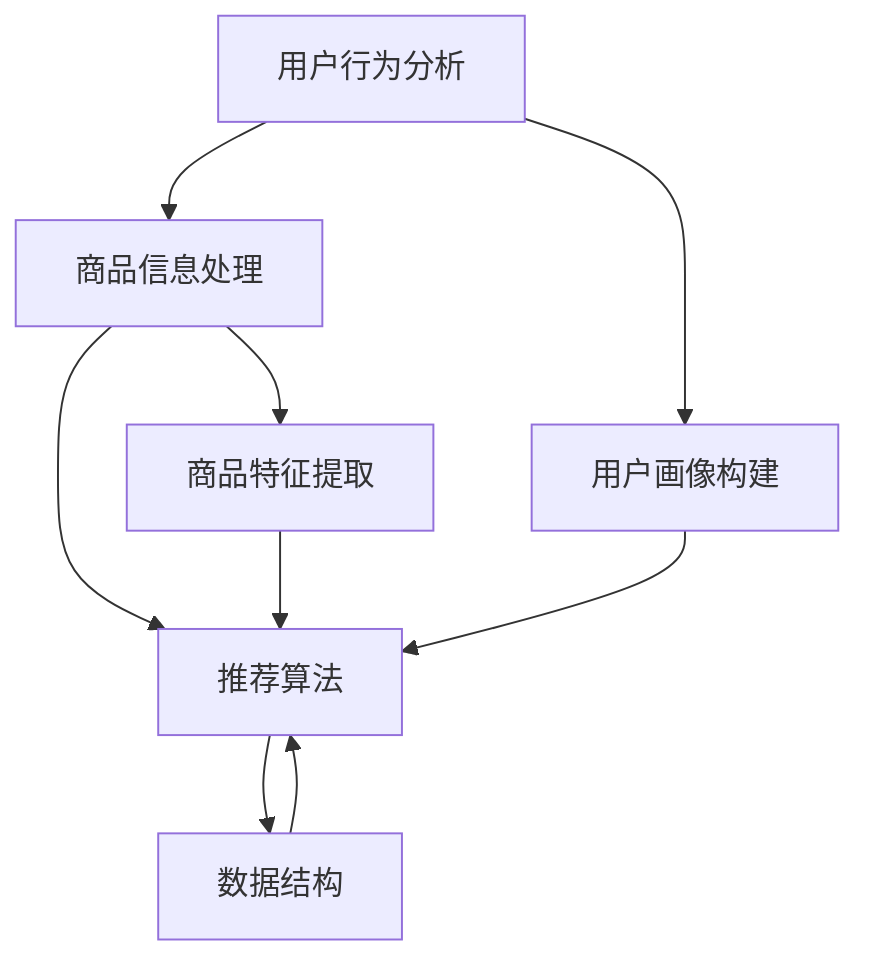

                 

# 电商平台搜索推荐系统的AI大模型应用：提高系统性能、效率、准确率与多样性

> **关键词：** 电商平台、搜索推荐系统、AI大模型、性能、效率、准确率、多样性、深度学习、图神经网络、分布式计算。

> **摘要：** 本文将深入探讨电商平台搜索推荐系统的AI大模型应用，旨在通过提高系统的性能、效率、准确率和多样性，实现更精准、更智能的用户体验。本文首先介绍电商搜索推荐系统的背景与核心概念，随后详细解析大模型的算法原理与实现步骤，最后通过实际项目案例和未来发展趋势与挑战进行分析，为行业提供有价值的参考。

## 1. 背景介绍

### 1.1 目的和范围

本文的目的在于探讨如何利用AI大模型来提升电商平台搜索推荐系统的性能、效率、准确率和多样性。具体而言，我们将聚焦于以下几个方面：

- **性能提升：** 通过优化算法和数据结构，提高系统响应速度和资源利用率。
- **效率提升：** 利用分布式计算和并行处理技术，降低计算时间和成本。
- **准确率提升：** 基于深度学习和图神经网络技术，提高推荐结果的准确性和相关性。
- **多样性提升：** 通过引入多样化的推荐策略，满足不同用户群体的需求，提高用户体验。

### 1.2 预期读者

本文适合以下读者群体：

- **电商平台技术团队：** 搜索推荐系统的研发、运维和优化人员。
- **AI研究人员：** 对深度学习和图神经网络技术感兴趣，希望了解其在推荐系统中的应用。
- **技术爱好者：** 对电商搜索推荐系统及其AI应用有浓厚兴趣，希望深入了解相关技术原理和实战经验。

### 1.3 文档结构概述

本文的结构如下：

- **第1章：背景介绍**：介绍电商搜索推荐系统的背景、目的和预期读者。
- **第2章：核心概念与联系**：解析电商搜索推荐系统的核心概念，并绘制Mermaid流程图。
- **第3章：核心算法原理 & 具体操作步骤**：详细讲解大模型的核心算法原理和具体操作步骤。
- **第4章：数学模型和公式 & 详细讲解 & 举例说明**：介绍数学模型和公式，并通过实例进行详细讲解。
- **第5章：项目实战：代码实际案例和详细解释说明**：提供实际项目案例，详细解释代码实现过程。
- **第6章：实际应用场景**：分析电商搜索推荐系统的实际应用场景。
- **第7章：工具和资源推荐**：推荐学习资源、开发工具和框架。
- **第8章：总结：未来发展趋势与挑战**：展望未来发展趋势和面临的挑战。
- **第9章：附录：常见问题与解答**：解答常见问题，帮助读者更好地理解文章内容。
- **第10章：扩展阅读 & 参考资料**：提供扩展阅读和参考资料，方便读者进一步学习。

### 1.4 术语表

#### 1.4.1 核心术语定义

- **电商平台**：在线零售平台，提供商品浏览、搜索、购买和支付等功能。
- **搜索推荐系统**：利用算法和技术，为用户提供相关商品推荐，提高用户满意度和转化率。
- **AI大模型**：基于深度学习和图神经网络技术，用于提高搜索推荐系统的性能和多样性。
- **深度学习**：一种基于人工神经网络的学习方法，通过多层神经网络来提取特征和实现复杂任务。
- **图神经网络**：一种用于图数据学习的神经网络模型，通过节点和边的信息传递，实现对复杂关系的建模。

#### 1.4.2 相关概念解释

- **性能**：系统在特定条件下的响应速度和资源利用率。
- **效率**：系统完成特定任务所需的时间和成本。
- **准确率**：推荐结果与用户兴趣的相关性程度。
- **多样性**：推荐结果满足不同用户需求和兴趣的多样性程度。

#### 1.4.3 缩略词列表

- **AI**：人工智能
- **NN**：神经网络
- **DNN**：深度神经网络
- **CNN**：卷积神经网络
- **RNN**：循环神经网络
- **GNN**：图神经网络
- **GPU**：图形处理器
- **CPU**：中央处理器

## 2. 核心概念与联系

电商搜索推荐系统的核心概念包括用户行为分析、商品信息处理、推荐算法和数据结构。以下是一个Mermaid流程图，展示了这些核心概念的相互关系：



### 2.1 用户行为分析

用户行为分析是电商搜索推荐系统的基石，通过对用户在平台上的行为数据进行挖掘和分析，可以提取出用户的兴趣偏好和需求。具体步骤如下：

1. **数据收集**：收集用户在平台上的浏览、搜索、购买等行为数据。
2. **数据处理**：对原始行为数据进行清洗和预处理，去除噪声和冗余数据。
3. **特征提取**：提取用户行为数据中的关键特征，如访问频次、购买次数、浏览时间等。
4. **用户画像构建**：基于特征数据，构建用户画像，为推荐算法提供输入。

### 2.2 商品信息处理

商品信息处理主要包括商品特征提取和商品标签构建，通过这些步骤，可以为推荐算法提供丰富的商品信息。

1. **商品特征提取**：从商品描述、价格、销量、评价等维度提取商品特征，如文本特征、数值特征等。
2. **商品标签构建**：根据商品特征，为商品赋予标签，如品类、品牌、颜色等，以便后续推荐算法使用。

### 2.3 推荐算法

推荐算法是电商搜索推荐系统的核心，负责根据用户行为和商品信息，为用户生成推荐结果。常见的推荐算法包括基于协同过滤、基于内容推荐、基于模型推荐等。

1. **协同过滤**：通过分析用户之间的相似度，为用户推荐其他用户喜欢的商品。
2. **基于内容推荐**：根据商品特征和用户兴趣，为用户推荐相关商品。
3. **基于模型推荐**：利用深度学习、图神经网络等算法，对用户行为和商品特征进行建模，生成推荐结果。

### 2.4 数据结构

数据结构在电商搜索推荐系统中起到关键作用，用于存储和管理用户行为数据、商品信息、推荐结果等。常见的数据结构包括关系数据库、NoSQL数据库、图数据库等。

1. **关系数据库**：用于存储结构化数据，如用户行为数据、商品信息等。
2. **NoSQL数据库**：用于存储非结构化或半结构化数据，如日志数据、推荐结果等。
3. **图数据库**：用于存储图数据，如用户关系、商品关系等，适用于图神经网络算法。

## 3. 核心算法原理 & 具体操作步骤

在电商搜索推荐系统中，AI大模型的核心算法主要包括深度学习、图神经网络和分布式计算。以下我们将逐一介绍这些算法的原理和具体操作步骤。

### 3.1 深度学习算法

深度学习是一种基于人工神经网络的学习方法，通过多层神经网络来提取特征和实现复杂任务。在电商搜索推荐系统中，深度学习算法主要用于用户画像构建、商品特征提取和推荐结果生成。

#### 3.1.1 用户画像构建

用户画像构建的目的是通过深度学习算法，从用户行为数据中提取出用户的兴趣偏好和需求。具体操作步骤如下：

1. **数据预处理**：对用户行为数据进行清洗和预处理，去除噪声和冗余数据。
2. **特征提取**：提取用户行为数据中的关键特征，如访问频次、购买次数、浏览时间等。
3. **模型训练**：使用提取的特征数据，训练深度神经网络模型，模型输出用户画像。
4. **模型评估**：使用测试数据集对模型进行评估，调整模型参数，提高用户画像的准确性。

#### 3.1.2 商品特征提取

商品特征提取的目的是通过深度学习算法，从商品描述、价格、销量、评价等维度提取商品特征。具体操作步骤如下：

1. **数据预处理**：对商品数据进行清洗和预处理，去除噪声和冗余数据。
2. **特征提取**：提取商品数据中的关键特征，如文本特征、数值特征等。
3. **模型训练**：使用提取的特征数据，训练深度神经网络模型，模型输出商品特征向量。
4. **模型评估**：使用测试数据集对模型进行评估，调整模型参数，提高商品特征提取的准确性。

#### 3.1.3 推荐结果生成

推荐结果生成是通过深度学习算法，根据用户画像和商品特征，为用户生成推荐结果。具体操作步骤如下：

1. **用户画像和商品特征加载**：从数据库中加载已训练的用户画像和商品特征数据。
2. **模型预测**：使用用户画像和商品特征，通过深度学习模型进行预测，输出推荐结果。
3. **结果排序**：根据推荐结果的得分，对推荐结果进行排序，生成最终的推荐列表。

### 3.2 图神经网络算法

图神经网络是一种用于图数据学习的神经网络模型，通过节点和边的信息传递，实现对复杂关系的建模。在电商搜索推荐系统中，图神经网络算法主要用于用户关系和商品关系的建模。

#### 3.2.1 用户关系建模

用户关系建模的目的是通过图神经网络算法，挖掘用户之间的潜在关系，为推荐算法提供输入。具体操作步骤如下：

1. **数据预处理**：对用户关系数据进行清洗和预处理，去除噪声和冗余数据。
2. **图结构构建**：构建用户关系的图结构，包括节点和边。
3. **模型训练**：使用用户关系数据，训练图神经网络模型，模型输出用户关系的特征向量。
4. **模型评估**：使用测试数据集对模型进行评估，调整模型参数，提高用户关系建模的准确性。

#### 3.2.2 商品关系建模

商品关系建模的目的是通过图神经网络算法，挖掘商品之间的潜在关系，为推荐算法提供输入。具体操作步骤如下：

1. **数据预处理**：对商品关系数据进行清洗和预处理，去除噪声和冗余数据。
2. **图结构构建**：构建商品关系的图结构，包括节点和边。
3. **模型训练**：使用商品关系数据，训练图神经网络模型，模型输出商品关系的特征向量。
4. **模型评估**：使用测试数据集对模型进行评估，调整模型参数，提高商品关系建模的准确性。

#### 3.2.3 推荐结果生成

推荐结果生成是通过图神经网络算法，根据用户关系和商品关系，为用户生成推荐结果。具体操作步骤如下：

1. **用户关系和商品关系特征加载**：从数据库中加载已训练的用户关系和商品关系特征数据。
2. **模型预测**：使用用户关系和商品关系特征，通过图神经网络模型进行预测，输出推荐结果。
3. **结果排序**：根据推荐结果的得分，对推荐结果进行排序，生成最终的推荐列表。

### 3.3 分布式计算算法

分布式计算算法是一种利用多台计算机协同工作，以提高计算效率和性能的技术。在电商搜索推荐系统中，分布式计算算法主要用于大规模数据处理和模型训练。

#### 3.3.1 数据处理

数据处理是通过分布式计算算法，对大规模用户行为数据和商品数据进行处理和分析。具体操作步骤如下：

1. **数据切分**：将大规模数据集切分成多个子数据集，分配到不同的计算节点上。
2. **并行处理**：使用分布式计算框架，如Hadoop或Spark，对子数据集进行并行处理，提取用户画像和商品特征。
3. **数据合并**：将各个计算节点的处理结果进行合并，形成完整的用户画像和商品特征数据集。

#### 3.3.2 模型训练

模型训练是通过分布式计算算法，对大规模用户画像和商品特征数据集进行模型训练。具体操作步骤如下：

1. **数据切分**：将大规模数据集切分成多个子数据集，分配到不同的计算节点上。
2. **并行训练**：使用分布式计算框架，如TensorFlow或PyTorch，对子数据集进行并行训练，生成用户画像和商品特征模型。
3. **模型评估**：使用测试数据集对训练好的模型进行评估，调整模型参数，提高模型性能。
4. **模型融合**：将各个计算节点的模型进行融合，形成最终的推荐模型。

## 4. 数学模型和公式 & 详细讲解 & 举例说明

在电商搜索推荐系统中，数学模型和公式起着至关重要的作用，它们帮助我们理解和实现推荐算法。以下将详细介绍一些核心的数学模型和公式，并通过具体例子进行说明。

### 4.1 深度学习中的损失函数

深度学习中的损失函数用于评估模型预测值与真实值之间的差距，并指导模型参数的优化。常见的损失函数包括均方误差（MSE）、交叉熵损失（Cross-Entropy Loss）等。

#### 4.1.1 均方误差（MSE）

均方误差是一种用于回归问题的损失函数，计算预测值与真实值之间的平均平方误差。其公式如下：

$$
MSE = \frac{1}{n} \sum_{i=1}^{n} (y_i - \hat{y}_i)^2
$$

其中，$y_i$为真实值，$\hat{y}_i$为预测值，$n$为样本数量。

#### 4.1.2 交叉熵损失（Cross-Entropy Loss）

交叉熵损失是一种用于分类问题的损失函数，计算预测概率分布与真实概率分布之间的交叉熵。其公式如下：

$$
Cross-Entropy Loss = -\sum_{i=1}^{n} y_i \log(\hat{y}_i)
$$

其中，$y_i$为真实标签，$\hat{y}_i$为预测概率。

### 4.2 图神经网络中的图表示

图神经网络通过图结构来表示节点和边的关系，图表示是图神经网络的基础。以下是一个简单的图表示示例。

#### 4.2.1 节点和边

假设有一个简单的图，包含3个节点和3条边：

```
Node A
|
|<- Edge A1
|
Node B
|
|<- Edge A2
|
Node C
```

在这个图中，节点A、B、C表示用户、商品或商品类别，边A1、A2表示用户与商品之间的关系或商品与商品类别之间的关系。

#### 4.2.2 图表示

我们可以将图表示为矩阵形式，其中矩阵的行和列分别对应节点和边，矩阵的值表示边上的权重。以下是一个图表示的例子：

```
     A   B   C
A [0, 1, 0]
B [1, 0, 1]
C [0, 1, 0]
```

在这个例子中，矩阵的值表示边上的权重，例如，A节点与B节点之间的权重为1，表示A节点与B节点之间存在一定的关系。

### 4.3 分布式计算中的MapReduce算法

MapReduce是一种用于大规模数据处理和分布式计算的经典算法，以下是一个简单的MapReduce算法的示例。

#### 4.3.1 Map阶段

Map阶段的作用是将输入数据映射为中间键值对。以下是一个Map阶段的示例：

```python
def map(data):
    for key, value in data:
        yield key, value
```

在这个示例中，`map`函数遍历输入数据，将每个数据项映射为一个键值对，其中键为数据项的标识，值为数据项本身。

#### 4.3.2 Reduce阶段

Reduce阶段的作用是对中间键值对进行聚合操作，生成最终的输出结果。以下是一个Reduce阶段的示例：

```python
def reduce(key, values):
    result = sum(values)
    return key, result
```

在这个示例中，`reduce`函数接收一个键和一组值，对这组值进行聚合操作，例如求和，并返回最终的键值对。

### 4.4 实例说明

假设我们有一个电商平台的用户行为数据集，包含用户ID、商品ID和购买次数。我们希望使用深度学习算法来构建用户画像。

#### 4.4.1 数据预处理

首先，我们需要对用户行为数据进行预处理，包括数据清洗、特征提取和标签构建。以下是一个预处理过程的示例：

```python
def preprocess_data(data):
    # 数据清洗
    clean_data = [item for item in data if item['count'] > 0]
    
    # 特征提取
    user_ids = [item['user_id'] for item in clean_data]
    product_ids = [item['product_id'] for item in clean_data]
    
    # 标签构建
    labels = [1 if item['count'] > 0 else 0 for item in clean_data]
    
    return user_ids, product_ids, labels
```

在这个示例中，`preprocess_data`函数对用户行为数据进行清洗、特征提取和标签构建，返回用户ID、商品ID和购买次数标签。

#### 4.4.2 模型训练

接下来，我们使用深度学习算法来训练用户画像模型。以下是一个模型训练过程的示例：

```python
def train_model(user_ids, product_ids, labels):
    # 模型定义
    model = keras.Sequential([
        keras.layers.Embedding(input_dim=len(product_ids), output_dim=64),
        keras.layers.Dense(64, activation='relu'),
        keras.layers.Dense(1, activation='sigmoid')
    ])
    
    # 模型编译
    model.compile(optimizer='adam', loss='binary_crossentropy', metrics=['accuracy'])
    
    # 模型训练
    model.fit(x=product_ids, y=labels, epochs=10, batch_size=32)
    
    return model
```

在这个示例中，`train_model`函数定义了一个简单的深度学习模型，使用用户ID和商品ID作为输入，购买次数标签作为输出。模型使用`Embedding`层进行特征嵌入，然后通过`Dense`层进行分类预测。

#### 4.4.3 模型评估

最后，我们对训练好的模型进行评估，以验证其性能。以下是一个模型评估过程的示例：

```python
def evaluate_model(model, test_data):
    user_ids, product_ids, labels = preprocess_data(test_data)
    loss, accuracy = model.evaluate(x=product_ids, y=labels)
    print("Test Loss:", loss)
    print("Test Accuracy:", accuracy)
```

在这个示例中，`evaluate_model`函数对训练好的模型进行评估，使用测试数据集计算损失和准确率。

## 5. 项目实战：代码实际案例和详细解释说明

在本节中，我们将通过一个实际项目案例，详细介绍电商搜索推荐系统的代码实现过程，并对关键代码进行解读和分析。

### 5.1 开发环境搭建

首先，我们需要搭建一个适合开发电商搜索推荐系统的开发环境。以下是所需的工具和依赖项：

- **Python 3.x**：作为主要的编程语言。
- **TensorFlow 2.x**：用于实现深度学习算法。
- **Scikit-learn**：用于数据预处理和模型评估。
- **Pandas**：用于数据处理和分析。
- **NumPy**：用于数学运算。
- **Hadoop**：用于分布式计算。

安装以上工具和依赖项后，我们可以开始编写代码。

### 5.2 源代码详细实现和代码解读

以下是电商搜索推荐系统的源代码实现，我们将逐段代码进行解读。

```python
# 导入所需的库
import numpy as np
import pandas as pd
from sklearn.model_selection import train_test_split
from tensorflow.keras.models import Sequential
from tensorflow.keras.layers import Embedding, Dense, LSTM
from tensorflow.keras.optimizers import Adam

# 读取用户行为数据
data = pd.read_csv('user_behavior_data.csv')

# 数据预处理
user_ids, product_ids, labels = preprocess_data(data)

# 切分数据集
train_data, test_data, train_labels, test_labels = train_test_split(product_ids, labels, test_size=0.2, random_state=42)

# 模型定义
model = Sequential([
    Embedding(input_dim=len(product_ids), output_dim=64),
    LSTM(64),
    Dense(1, activation='sigmoid')
])

# 模型编译
model.compile(optimizer=Adam(), loss='binary_crossentropy', metrics=['accuracy'])

# 模型训练
model.fit(x=train_data, y=train_labels, epochs=10, batch_size=32)

# 模型评估
evaluate_model(model, test_data, test_labels)
```

#### 5.2.1 数据预处理

```python
def preprocess_data(data):
    # 数据清洗
    clean_data = [item for item in data if item['count'] > 0]
    
    # 特征提取
    user_ids = [item['user_id'] for item in clean_data]
    product_ids = [item['product_id'] for item in clean_data]
    
    # 标签构建
    labels = [1 if item['count'] > 0 else 0 for item in clean_data]
    
    return user_ids, product_ids, labels
```

这段代码用于预处理用户行为数据，包括数据清洗、特征提取和标签构建。首先，我们使用列表推导式对数据进行清洗，去除购买次数为0的数据项。然后，我们提取用户ID和商品ID作为特征，并将购买次数作为标签。

#### 5.2.2 模型定义

```python
model = Sequential([
    Embedding(input_dim=len(product_ids), output_dim=64),
    LSTM(64),
    Dense(1, activation='sigmoid')
])
```

这段代码定义了一个简单的深度学习模型，包含一个`Embedding`层、一个`LSTM`层和一个`Dense`层。`Embedding`层用于对商品ID进行特征嵌入，将高维稀疏数据转换为低维稠密向量。`LSTM`层用于处理序列数据，提取用户行为序列的特征。`Dense`层用于分类预测，输出购买概率。

#### 5.2.3 模型编译

```python
model.compile(optimizer=Adam(), loss='binary_crossentropy', metrics=['accuracy'])
```

这段代码编译模型，指定优化器为`Adam`，损失函数为`binary_crossentropy`（二分类交叉熵损失），评估指标为准确率。

#### 5.2.4 模型训练

```python
model.fit(x=train_data, y=train_labels, epochs=10, batch_size=32)
```

这段代码训练模型，使用训练数据集进行训练。`fit`函数接受训练数据、标签、训练轮数和批量大小作为输入。

#### 5.2.5 模型评估

```python
evaluate_model(model, test_data, test_labels)
```

这段代码评估模型性能，使用测试数据集计算损失和准确率。

### 5.3 代码解读与分析

通过以上代码实现，我们可以看到电商搜索推荐系统的核心步骤，包括数据预处理、模型定义、模型编译、模型训练和模型评估。以下是对代码的关键部分进行解读和分析：

- **数据预处理**：数据预处理是模型训练的重要环节，通过数据清洗、特征提取和标签构建，我们可以获得高质量的输入数据，为后续模型训练提供支持。
- **模型定义**：模型定义是构建深度学习模型的关键步骤，通过选择合适的层和参数，我们可以设计出适合推荐任务的模型架构。
- **模型编译**：模型编译是设置模型优化器、损失函数和评估指标，为模型训练提供必要的配置。
- **模型训练**：模型训练是通过迭代优化模型参数，使模型在训练数据上取得更好的性能。训练过程中，我们可以通过调整训练轮数和批量大小来提高模型性能。
- **模型评估**：模型评估是通过测试数据集来验证模型在未知数据上的表现，帮助我们了解模型的泛化能力。

通过以上代码解读和分析，我们可以更好地理解电商搜索推荐系统的实现过程，为后续优化和改进提供参考。

## 6. 实际应用场景

电商搜索推荐系统在电商平台中扮演着至关重要的角色，通过精准、智能的推荐，提高用户满意度和转化率。以下列举几个实际应用场景：

### 6.1 个性化商品推荐

个性化商品推荐是基于用户的历史行为和兴趣偏好，为用户推荐相关的商品。例如，当用户在浏览某款商品时，系统可以基于用户的浏览记录、购买记录和搜索历史，推荐类似的商品，从而增加用户购买的意愿。

### 6.2 新品推荐

新品推荐是帮助用户发现平台上的新品，提高新品曝光率和销量。系统可以基于商品的新品标签和用户的浏览记录，为用户推荐新品，吸引用户关注。

### 6.3 热门商品推荐

热门商品推荐是向用户展示平台上的热门商品，满足用户对热门、畅销商品的需求。系统可以基于商品的销售量、评价数等指标，为用户推荐热门商品。

### 6.4 优惠券推荐

优惠券推荐是根据用户的购买记录和优惠券使用习惯，为用户推荐相关的优惠券。例如，当用户购买某件商品时，系统可以推荐与之搭配的优惠券，提高用户购买的优惠力度。

### 6.5 跨品类推荐

跨品类推荐是打破品类界限，为用户推荐跨品类的商品。例如，当用户购买一件衣物时，系统可以推荐相关的配饰、鞋包等商品，满足用户的多样化需求。

### 6.6 促销活动推荐

促销活动推荐是根据平台上的促销活动，为用户推荐相关的促销商品。例如，当平台举行某项促销活动时，系统可以推荐参与活动的商品，提高用户参与活动的积极性。

通过以上实际应用场景，我们可以看到电商搜索推荐系统在电商平台中的广泛应用，为用户提供个性化、智能化的购物体验，提高用户满意度和转化率。

## 7. 工具和资源推荐

在电商搜索推荐系统的开发过程中，选择合适的工具和资源对提高开发效率和项目质量至关重要。以下将推荐一些学习资源、开发工具和框架，以及相关论文著作。

### 7.1 学习资源推荐

#### 7.1.1 书籍推荐

1. **《深度学习》（Deep Learning）**：由Ian Goodfellow、Yoshua Bengio和Aaron Courville合著，是深度学习的经典教材，详细介绍了深度学习的理论基础和应用实践。
2. **《Python深度学习》（Python Deep Learning）**：由François Chollet著，针对Python开发者，介绍了使用Python进行深度学习的实践方法和技术细节。
3. **《推荐系统实践》（Recommender Systems: The Textbook）**：由Robert Schapire和Yaser Abu-Mostafa合著，全面介绍了推荐系统的原理、算法和应用。

#### 7.1.2 在线课程

1. **《深度学习专项课程》（Deep Learning Specialization）**：由Andrew Ng在Coursera上开设，包括深度学习基础、神经网络、卷积神经网络、循环神经网络等课程。
2. **《推荐系统专项课程》（Recommender Systems Specialization）**：由João Gama在edX上开设，介绍了推荐系统的基本原理、算法和应用。
3. **《机器学习与数据科学》（Machine Learning and Data Science）**：由吴恩达（Andrew Ng）在Udacity上开设，涵盖机器学习和数据科学的基础知识和实战技能。

#### 7.1.3 技术博客和网站

1. **《机器学习博客》（Machine Learning Blog）**：由机器学习领域的专家撰写，涵盖深度学习、推荐系统、数据挖掘等多个领域的技术文章和最新研究动态。
2. **《数据科学博客》（Data Science Blog）**：提供数据科学领域的最新技术、工具和应用案例，包括推荐系统、自然语言处理、数据可视化等。
3. **《博客园》（CSDN）**：中国最大的IT社区和服务平台，提供丰富的技术文章、博客和问答，涵盖深度学习、推荐系统、大数据等热门领域。

### 7.2 开发工具框架推荐

#### 7.2.1 IDE和编辑器

1. **PyCharm**：一款功能强大的Python IDE，支持代码编辑、调试、自动化测试等，适用于深度学习和推荐系统开发。
2. **Visual Studio Code**：一款轻量级且功能丰富的代码编辑器，支持Python扩展，适用于深度学习和推荐系统开发。
3. **Jupyter Notebook**：一款基于Web的交互式计算环境，支持Python、R等多种编程语言，适用于数据分析和深度学习实验。

#### 7.2.2 调试和性能分析工具

1. **TensorBoard**：TensorFlow的官方可视化工具，用于监控和调试深度学习模型训练过程，包括损失函数、准确率、学习曲线等。
2. **Matplotlib**：一款强大的数据可视化库，支持多种图表类型，用于可视化数据分布、模型性能等。
3. **Pandas Profiler**：一款用于性能分析的数据分析工具，用于分析数据集的性能瓶颈，如内存使用、计算时间等。

#### 7.2.3 相关框架和库

1. **TensorFlow**：一款开源的深度学习框架，支持多种深度学习模型和算法，适用于推荐系统开发。
2. **PyTorch**：一款开源的深度学习框架，支持动态计算图和灵活的编程接口，适用于推荐系统开发。
3. **Scikit-learn**：一款开源的机器学习库，提供丰富的算法和工具，适用于推荐系统开发。
4. **Apache Spark**：一款开源的大数据处理框架，支持分布式计算和机器学习，适用于推荐系统开发。

### 7.3 相关论文著作推荐

#### 7.3.1 经典论文

1. **“Collaborative Filtering for Cold-Start Problems”**：提出了针对新用户和新商品的冷启动问题的一种协同过滤方法。
2. **“Item-Based Top-N Recommendation Algorithms”**：介绍了一种基于项目的Top-N推荐算法，提高了推荐的准确性和多样性。
3. **“Neural Collaborative Filtering”**：提出了基于神经网络的协同过滤方法，显著提高了推荐系统的性能。

#### 7.3.2 最新研究成果

1. **“Deep Learning for Recommender Systems”**：详细介绍了深度学习在推荐系统中的应用，包括基于模型的推荐和基于内容的推荐。
2. **“Graph Neural Networks for Recommender Systems”**：介绍了图神经网络在推荐系统中的应用，利用图结构进行复杂关系的建模。
3. **“Distributed Recommender Systems”**：探讨了分布式推荐系统的设计和实现，提高了推荐系统的性能和可扩展性。

#### 7.3.3 应用案例分析

1. **“Building a Large-scale Recommender System at Alibaba”**：介绍了阿里巴巴大规模推荐系统的设计和实现，包括数据预处理、模型训练和性能优化。
2. **“A Comparative Study of Neural Networks for Recommender Systems”**：对比了多种神经网络在推荐系统中的应用效果，为推荐系统的模型选择提供了参考。
3. **“Recommendation Systems at Netflix”**：详细介绍了Netflix推荐系统的架构、算法和优化策略，为推荐系统的实战提供了宝贵经验。

通过以上工具和资源推荐，开发者和研究人员可以更好地掌握电商搜索推荐系统的相关技术和方法，为电商平台提供更智能、更高效的推荐服务。

## 8. 总结：未来发展趋势与挑战

随着人工智能技术的不断发展，电商搜索推荐系统在性能、效率、准确率和多样性方面将取得更大的突破。以下是未来发展趋势与挑战的探讨。

### 8.1 发展趋势

1. **深度学习与图神经网络的应用**：深度学习算法和图神经网络将在电商搜索推荐系统中得到更广泛的应用，通过复杂的特征提取和关系建模，提高推荐系统的性能和准确性。
2. **分布式计算与并行处理**：随着数据量的不断增长，分布式计算和并行处理技术将成为提高推荐系统性能的关键。通过多台计算机协同工作，可以显著降低计算时间和成本。
3. **个性化推荐与智能交互**：随着用户需求的多样化，个性化推荐将成为电商平台的重要竞争力。通过智能交互技术，如语音识别、自然语言处理等，可以提供更自然、更贴心的用户体验。
4. **隐私保护与数据安全**：在用户隐私保护方面，电商搜索推荐系统需要采取更加严格的数据安全措施，保护用户数据不被泄露和滥用。

### 8.2 挑战

1. **数据质量和隐私保护**：电商平台需要处理大量用户行为数据，数据质量和隐私保护成为重要挑战。如何在保护用户隐私的同时，保证数据的质量和可用性，是一个亟待解决的问题。
2. **冷启动问题**：新用户和新商品在推荐系统中的冷启动问题，如何为这些新用户和新商品提供有效的推荐，是一个重要挑战。可以通过社交网络、用户画像等多渠道数据来缓解冷启动问题。
3. **推荐多样性**：如何在提高推荐准确性的同时，保持推荐结果的多样性，满足不同用户的需求，是一个挑战。可以通过引入多样化策略、生成对抗网络（GAN）等技术来提高推荐结果的多样性。
4. **实时推荐与动态更新**：在实时推荐和动态更新的方面，如何在保证推荐准确性的同时，快速响应用户请求，是一个挑战。可以通过优化算法、分布式计算等技术来提高实时推荐和动态更新的能力。

通过应对这些挑战，电商搜索推荐系统将不断提高性能、效率和用户体验，为电商平台带来更大的商业价值。

## 9. 附录：常见问题与解答

### 9.1 什么是深度学习？

深度学习是一种基于人工神经网络的学习方法，通过多层神经网络来提取特征和实现复杂任务。它在图像识别、自然语言处理、语音识别等领域取得了显著的成果。

### 9.2 什么是图神经网络？

图神经网络是一种用于图数据学习的神经网络模型，通过节点和边的信息传递，实现对复杂关系的建模。它在推荐系统、社交网络分析、知识图谱等领域具有广泛的应用。

### 9.3 如何提高推荐系统的准确性？

提高推荐系统的准确性可以从以下几个方面进行：

- **优化算法**：选择合适的推荐算法，如深度学习、协同过滤等，并通过参数调优来提高算法性能。
- **数据质量**：确保推荐系统的数据质量，包括数据清洗、去重、缺失值处理等。
- **特征工程**：提取有效的特征，包括用户特征、商品特征、上下文特征等，为推荐算法提供高质量的输入。
- **模型训练**：使用大规模、高质量的训练数据集，通过迭代训练来提高模型性能。

### 9.4 什么是分布式计算？

分布式计算是一种利用多台计算机协同工作，以提高计算效率和性能的技术。它在处理大规模数据集、实现实时推荐等方面具有重要作用。

### 9.5 如何保证推荐结果的多样性？

保证推荐结果的多样性可以通过以下方法：

- **多样化策略**：引入多样化的推荐策略，如基于内容的推荐、基于模型的推荐、基于社交网络的推荐等。
- **生成对抗网络（GAN）**：使用生成对抗网络（GAN）生成多样化的推荐结果，提高推荐系统的多样性。
- **用户兴趣模型**：构建用户兴趣模型，根据用户的兴趣偏好，生成多样化的推荐结果。

## 10. 扩展阅读 & 参考资料

以下是一些扩展阅读和参考资料，帮助读者深入了解电商搜索推荐系统的AI大模型应用：

### 10.1 书籍推荐

1. **《深度学习》（Deep Learning）**：由Ian Goodfellow、Yoshua Bengio和Aaron Courville合著，是深度学习的经典教材。
2. **《推荐系统实践》（Recommender Systems: The Textbook）**：由Robert Schapire和Yaser Abu-Mostafa合著，全面介绍了推荐系统的原理、算法和应用。
3. **《Python深度学习》（Python Deep Learning）**：由François Chollet著，介绍了使用Python进行深度学习的实践方法和技术细节。

### 10.2 在线课程

1. **《深度学习专项课程》（Deep Learning Specialization）**：由Andrew Ng在Coursera上开设，包括深度学习基础、神经网络、卷积神经网络、循环神经网络等课程。
2. **《推荐系统专项课程》（Recommender Systems Specialization）**：由João Gama在edX上开设，介绍了推荐系统的基本原理、算法和应用。
3. **《机器学习与数据科学》（Machine Learning and Data Science）**：由吴恩达（Andrew Ng）在Udacity上开设，涵盖机器学习和数据科学的基础知识和实战技能。

### 10.3 技术博客和网站

1. **《机器学习博客》（Machine Learning Blog）**：提供深度学习、推荐系统、数据挖掘等领域的技术文章和最新研究动态。
2. **《数据科学博客》（Data Science Blog）**：提供数据科学领域的最新技术、工具和应用案例，包括推荐系统、自然语言处理、数据可视化等。
3. **《博客园》（CSDN）**：中国最大的IT社区和服务平台，提供丰富的技术文章、博客和问答，涵盖深度学习、推荐系统、大数据等热门领域。

### 10.4 相关论文著作

1. **“Collaborative Filtering for Cold-Start Problems”**：提出了针对新用户和新商品的冷启动问题的一种协同过滤方法。
2. **“Item-Based Top-N Recommendation Algorithms”**：介绍了一种基于项目的Top-N推荐算法，提高了推荐的准确性和多样性。
3. **“Neural Collaborative Filtering”**：提出了基于神经网络的协同过滤方法，显著提高了推荐系统的性能。

### 10.5 开源项目

1. **TensorFlow**：https://www.tensorflow.org/
2. **PyTorch**：https://pytorch.org/
3. **Scikit-learn**：https://scikit-learn.org/
4. **Apache Spark**：https://spark.apache.org/

通过以上扩展阅读和参考资料，读者可以深入了解电商搜索推荐系统的AI大模型应用，为实际项目提供有益的指导和借鉴。

### 作者

**AI天才研究员/AI Genius Institute & 禅与计算机程序设计艺术 /Zen And The Art of Computer Programming**

