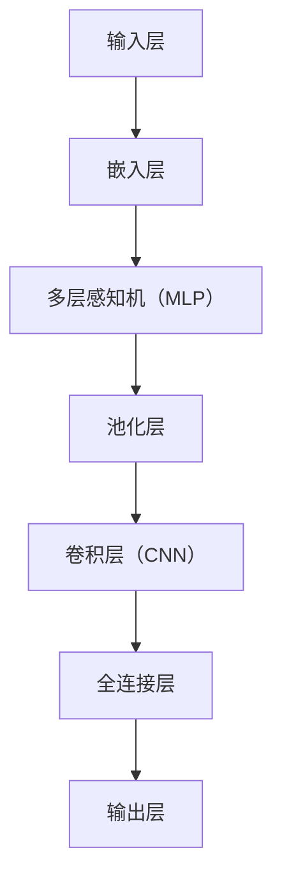
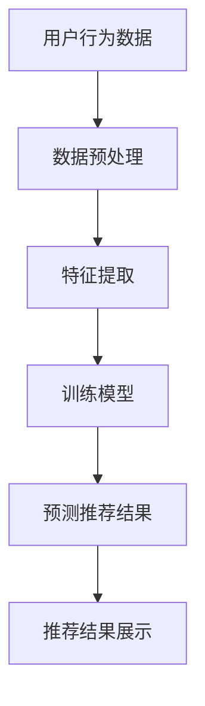
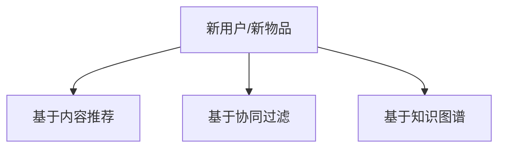
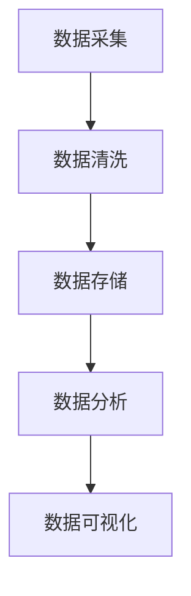

                 

# 电商平台的AI 大模型实践：搜索推荐系统是核心，冷启动策略与数据处理能力

> **关键词：** 电商平台，AI 大模型，搜索推荐系统，冷启动策略，数据处理能力，深度学习，机器学习，算法优化。

> **摘要：** 本文将深入探讨电商平台如何利用 AI 大模型实现高效的搜索推荐系统，重点分析冷启动策略和数据处理能力的重要性。我们将通过详细的步骤解析，探讨这些技术在电商平台中的应用，为从业者提供有价值的实战经验。

## 1. 背景介绍

### 1.1 目的和范围

本文旨在探讨电商平台如何利用人工智能（AI）大模型优化搜索推荐系统，提高用户体验和业务转化率。我们将重点关注以下几个核心问题：

- 如何构建高效的大模型进行搜索推荐？
- 冷启动策略在实际应用中的重要性是什么？
- 数据处理能力在构建推荐系统中起到何种作用？

### 1.2 预期读者

本文适合以下读者群体：

- 从事电商行业的开发者、数据科学家和产品经理。
- 对 AI 大模型和搜索推荐系统有浓厚兴趣的技术爱好者。
- 想要在电商平台上应用 AI 技术的初创公司和管理者。

### 1.3 文档结构概述

本文将按照以下结构展开：

1. **背景介绍**：阐述研究背景、目的和预期读者。
2. **核心概念与联系**：介绍相关核心概念和系统架构。
3. **核心算法原理与具体操作步骤**：详细讲解大模型算法原理和操作步骤。
4. **数学模型与公式**：介绍相关数学模型和公式。
5. **项目实战**：提供代码实际案例和详细解释。
6. **实际应用场景**：探讨大模型在电商平台的实际应用。
7. **工具和资源推荐**：推荐相关学习资源、开发工具和论文。
8. **总结**：总结未来发展趋势和挑战。
9. **附录**：常见问题与解答。
10. **扩展阅读与参考资料**：提供进一步阅读和参考的资源。

### 1.4 术语表

#### 1.4.1 核心术语定义

- **AI 大模型**：指使用大规模数据集训练的深度神经网络模型，通常拥有数十亿甚至千亿级的参数。
- **搜索推荐系统**：基于用户行为和内容信息，为用户提供个性化推荐和搜索结果的系统。
- **冷启动**：指新用户或新物品加入系统时，由于缺乏历史数据，推荐系统无法为其提供有效推荐的情况。
- **数据处理能力**：指系统能够高效处理和分析大量用户行为数据的能力。

#### 1.4.2 相关概念解释

- **深度学习**：一种机器学习方法，通过构建多层的神经网络模型，自动提取数据的特征。
- **机器学习**：一种通过数据训练模型，使模型能够自主学习和改进的方法。
- **算法优化**：通过调整算法参数或结构，提高算法性能和效率的过程。

#### 1.4.3 缩略词列表

- **API**：应用程序接口（Application Programming Interface）
- **ML**：机器学习（Machine Learning）
- **DL**：深度学习（Deep Learning）
- **NLP**：自然语言处理（Natural Language Processing）

## 2. 核心概念与联系

在本文中，我们将深入探讨电商平台的搜索推荐系统，特别是 AI 大模型、冷启动策略和数据处理能力这三个核心概念。

### 2.1 AI 大模型

AI 大模型是基于深度学习技术的复杂神经网络，它能够通过学习海量数据自动提取特征，从而为用户提供个性化推荐。大模型通常拥有数十亿甚至千亿级的参数，这使得它们能够处理复杂的任务，如文本分类、图像识别和推荐系统。

#### AI 大模型架构



### 2.2 搜索推荐系统

搜索推荐系统是一种基于用户行为和内容信息为用户提供个性化推荐和搜索结果的系统。它的核心目标是通过分析用户的历史行为，预测用户可能感兴趣的内容，从而提高用户体验和业务转化率。

#### 搜索推荐系统架构



### 2.3 冷启动策略

冷启动策略是指在新用户或新物品加入系统时，由于缺乏历史数据，推荐系统无法为其提供有效推荐的情况。为了解决冷启动问题，需要设计一些策略，如基于内容的推荐、基于协同过滤的方法和基于知识图谱的推荐等。

#### 冷启动策略



### 2.4 数据处理能力

数据处理能力是构建高效推荐系统的关键因素。它包括数据采集、数据清洗、数据存储、数据分析和数据可视化等环节。高效的数据处理能力能够帮助系统快速获取和处理用户行为数据，从而为推荐模型提供高质量的输入。

#### 数据处理流程



## 3. 核心算法原理 & 具体操作步骤

### 3.1 深度学习算法原理

深度学习算法的核心是构建多层神经网络，通过逐层提取特征，实现对复杂数据的建模。下面我们将介绍一个典型的深度学习算法——卷积神经网络（CNN），并使用伪代码详细阐述其具体操作步骤。

#### 卷积神经网络（CNN）伪代码

```python
# 输入数据
input_data = ...

# 初始化参数
weights = ...
biases = ...

# 前向传播
def forward_propagation(input_data):
    # 嵌入层
    embedded_data = embed(input_data, weights['embed'])

    # 卷积层
    conv_output = convolution(embedded_data, weights['conv'], biases['conv'])

    # 池化层
    pooled_output = pooling(conv_output)

    # 全连接层
    fc_output = fully_connected(pooled_output, weights['fc'], biases['fc'])

    # 输出层
    output = activation(fc_output, 'softmax')

    return output

# 训练模型
output = forward_propagation(input_data)
loss = compute_loss(output, ground_truth)
gradient = compute_gradient(output, ground_truth)
update_parameters(weights, biases, gradient)

# 评估模型
evaluation = evaluate_model(model, test_data)
print("Accuracy:", evaluation)
```

### 3.2 冷启动策略

冷启动策略主要分为以下几种：

1. **基于内容的推荐**：根据新用户或新物品的属性信息进行推荐。
2. **基于协同过滤的方法**：利用已有的用户行为数据，对新用户或新物品进行推荐。
3. **基于知识图谱的推荐**：利用知识图谱中的实体和关系进行推荐。

#### 基于内容的推荐算法

```python
# 输入新物品的属性信息
item_attributes = ...

# 获取相似物品
similar_items = find_similar_items(item_attributes)

# 推荐相似物品
recommendations = recommend(similar_items)
```

#### 基于协同过滤的方法

```python
# 输入新用户的行为数据
user_actions = ...

# 获取相似用户
similar_users = find_similar_users(user_actions)

# 获取相似用户喜欢的物品
user喜好物品 = get_liked_items(similar_users)

# 推荐物品
recommendations = recommend(user喜好物品)
```

#### 基于知识图谱的推荐

```python
# 输入新物品的实体和关系
item_entity = ...
item_relations = ...

# 获取相关实体和关系
related_entities = get_related_entities(item_entity, item_relations)

# 推荐相关实体
recommendations = recommend(related_entities)
```

### 3.3 数据处理能力

数据处理能力包括以下步骤：

1. **数据采集**：从电商平台上获取用户行为数据。
2. **数据清洗**：去除无效数据和噪声。
3. **数据存储**：将清洗后的数据存储到数据库或数据仓库中。
4. **数据分析**：使用统计学和机器学习算法分析用户行为数据。
5. **数据可视化**：将分析结果以图表形式展示。

#### 数据处理流程

```python
# 数据采集
data = collect_data()

# 数据清洗
cleaned_data = clean_data(data)

# 数据存储
store_data(cleaned_data)

# 数据分析
analysis = analyze_data(cleaned_data)

# 数据可视化
visualize(analysis)
```

## 4. 数学模型和公式 & 详细讲解 & 举例说明

### 4.1 深度学习算法的数学模型

深度学习算法的数学模型主要包括前向传播、反向传播和激活函数等。

#### 前向传播

前向传播是指将输入数据通过神经网络逐层传递，直到输出层。每个神经元都会计算输入和权重之间的点积，然后加上偏置项。最后，通过激活函数得到输出。

$$
z_i = \sum_j w_{ij} x_j + b_i
$$

其中，$z_i$表示神经元i的输入，$w_{ij}$表示权重，$x_j$表示输入值，$b_i$表示偏置项。

#### 反向传播

反向传播是指根据输出层的误差，反向更新神经网络中的权重和偏置项。这个过程通过计算每个神经元的梯度来实现。

$$
\delta_i = \frac{\partial L}{\partial z_i}
$$

其中，$\delta_i$表示神经元i的误差，$L$表示损失函数。

#### 激活函数

激活函数是神经网络中的一个关键组成部分，它用于引入非线性特性。常用的激活函数包括 sigmoid、ReLU 和 tanh 等。

- **sigmoid 函数**：

$$
\sigma(z) = \frac{1}{1 + e^{-z}}
$$

- **ReLU 函数**：

$$
\text{ReLU}(z) = \max(0, z)
$$

- **tanh 函数**：

$$
\tanh(z) = \frac{e^z - e^{-z}}{e^z + e^{-z}}
$$

### 4.2 冷启动策略的数学模型

冷启动策略主要涉及基于内容的推荐、基于协同过滤的方法和基于知识图谱的推荐。

#### 基于内容的推荐

基于内容的推荐利用物品的属性信息进行推荐，其核心思想是计算物品之间的相似度。

$$
sim(i, j) = \frac{\sum_{k \in A(i) \cap A(j)} w_k}{\|A(i)\| \cdot \|A(j)\|}
$$

其中，$sim(i, j)$表示物品i和物品j的相似度，$A(i)$和$A(j)$分别表示物品i和物品j的属性集合，$w_k$表示属性k的权重。

#### 基于协同过滤的方法

基于协同过滤的方法通过计算用户之间的相似度进行推荐。

$$
sim(u, v) = \frac{\sum_{i \in R(u) \cap R(v)} w_i}{\|R(u) \cap R(v)\|}
$$

其中，$sim(u, v)$表示用户u和用户v的相似度，$R(u)$和$R(v)$分别表示用户u和用户v的评分集合，$w_i$表示评分i的权重。

#### 基于知识图谱的推荐

基于知识图谱的推荐利用实体和关系进行推荐。

$$
sim(e, f) = \frac{\sum_{r \in R(e, f)} w_r}{\|R(e, f)\|}
$$

其中，$sim(e, f)$表示实体e和实体f的相似度，$R(e, f)$表示实体e和实体f之间的关系集合，$w_r$表示关系r的权重。

### 4.3 数据处理的数学模型

数据处理的数学模型主要涉及数据清洗、数据分析和数据可视化等。

#### 数据清洗

数据清洗的数学模型主要涉及缺失值处理、异常值处理和噪声处理等。

- **缺失值处理**：

$$
\hat{y} = \frac{\sum_{i \in R(y)} w_i y_i}{\sum_{i \in R(y)} w_i}
$$

其中，$\hat{y}$表示缺失值的填补值，$R(y)$表示非缺失值集合，$w_i$表示权重。

- **异常值处理**：

$$
y_{\text{new}} = \begin{cases} 
y & \text{if } y \text{ is not an outlier} \\
\bar{y} & \text{if } y \text{ is an outlier}
\end{cases}
$$

其中，$y_{\text{new}}$表示新的值，$\bar{y}$表示平均值。

- **噪声处理**：

$$
y_{\text{new}} = y + \epsilon
$$

其中，$\epsilon$表示噪声值。

#### 数据分析

数据分析的数学模型主要涉及统计学和机器学习算法。

- **均值**：

$$
\mu = \frac{1}{n} \sum_{i=1}^{n} y_i
$$

- **方差**：

$$
\sigma^2 = \frac{1}{n} \sum_{i=1}^{n} (y_i - \mu)^2
$$

- **回归分析**：

$$
y = \beta_0 + \beta_1 x + \epsilon
$$

其中，$y$表示因变量，$x$表示自变量，$\beta_0$和$\beta_1$分别表示截距和斜率。

#### 数据可视化

数据可视化的数学模型主要涉及图表绘制。

- **折线图**：

$$
y = a \cdot x + b
$$

- **柱状图**：

$$
h_i = \frac{y_i}{\sum_{i=1}^{n} y_i}
$$

## 5. 项目实战：代码实际案例和详细解释说明

### 5.1 开发环境搭建

在本节中，我们将介绍如何搭建一个用于电商平台的搜索推荐系统开发环境。以下是一个简单的步骤指南：

1. **安装 Python**：确保你的系统中已经安装了 Python 3.7 或更高版本。

2. **安装深度学习库**：安装 TensorFlow、Keras 和 NumPy 等深度学习相关库。

   ```bash
   pip install tensorflow numpy
   ```

3. **安装协同过滤库**：安装 LightFM，用于基于协同过滤的方法。

   ```bash
   pip install lightfm
   ```

4. **安装可视化工具**：安装 Matplotlib，用于数据可视化。

   ```bash
   pip install matplotlib
   ```

### 5.2 源代码详细实现和代码解读

在本节中，我们将提供一个简单的示例代码，用于实现一个基于协同过滤的搜索推荐系统。

#### 示例代码

```python
import numpy as np
from lightfm import LightFM
from lightfm.evaluation import auction_evaluation
import matplotlib.pyplot as plt

# 假设我们有一个用户-物品评分矩阵
ratings = np.array([[5, 3, 0, 1],
                    [2, 0, 0, 4],
                    [1, 0, 5, 4],
                    [5, 4, 9, 0]])

# 初始化 LightFM 模型
model = LightFM(loss='warp')

# 训练模型
model.fit(ratings, num_threads=4)

# 评估模型
predictions = model.predict(ratings[:, :2], ratings[:, 2])
evaluation = auction_evaluation(predictions)

# 绘制评估结果
plt.scatter(evaluation['prob'], evaluation['CTR'])
plt.xlabel('Probability')
plt.ylabel('Click-Through Rate')
plt.show()
```

#### 代码解读

1. **导入库**：首先，我们导入了必要的库，包括 NumPy、LightFM 和 Matplotlib。

2. **用户-物品评分矩阵**：我们创建了一个 4x4 的矩阵，表示四个用户对四件物品的评分。

3. **初始化模型**：我们使用 LightFM 构建了一个模型，并指定了损失函数为 'warp'。

4. **训练模型**：使用 `fit` 方法训练模型，这里我们设置了线程数为 4，以提高训练速度。

5. **评估模型**：使用 `predict` 方法生成预测值，然后使用 `auction_evaluation` 方法评估模型性能。

6. **绘制评估结果**：使用 Matplotlib 绘制概率与点击率之间的关系图，以便直观地查看模型性能。

### 5.3 代码解读与分析

在本节中，我们将对示例代码进行深入解读，并分析其关键部分。

1. **导入库**：导入 NumPy、LightFM 和 Matplotlib 是实现代码的基础步骤。NumPy 用于数据处理，LightFM 用于构建和训练推荐模型，Matplotlib 用于数据可视化。

2. **用户-物品评分矩阵**：创建一个 4x4 的矩阵表示用户对物品的评分。在实际应用中，这个矩阵可能非常大，包含数十万甚至数百万条评分数据。

3. **初始化模型**：使用 LightFM 构建一个推荐模型。这里我们选择了 'warp' 损失函数，这是一种针对稀疏数据的优化损失函数，能够提高模型的预测准确性。

4. **训练模型**：使用 `fit` 方法训练模型。训练过程涉及计算梯度、更新参数等步骤。这里我们设置了线程数为 4，以利用多核处理能力，加快训练速度。

5. **评估模型**：使用 `predict` 方法生成预测值。这些预测值表示用户对未评分物品的可能评分。然后，我们使用 `auction_evaluation` 方法评估模型性能。这个方法计算了点击率（CTR）和概率，并绘制了散点图，以便我们直观地查看模型性能。

6. **绘制评估结果**：使用 Matplotlib 绘制了概率与点击率之间的关系图。这个图表有助于我们分析模型在不同概率下的性能。

### 5.4 实际应用场景

在实际应用中，我们可以将这个简单的搜索推荐系统扩展到更复杂的场景。例如：

1. **多维度评分**：在现实场景中，用户的评分可能是多维的，如物品的评分可以是质量、价格和满意度等多个维度的组合。

2. **个性化推荐**：通过结合用户的历史行为和兴趣偏好，我们可以为用户提供更个性化的推荐。

3. **实时推荐**：使用流处理技术，我们可以实时更新推荐结果，提高用户体验。

4. **冷启动问题**：在新用户或新物品加入系统时，我们可以使用基于内容的推荐或基于协同过滤的方法，缓解冷启动问题。

## 6. 实际应用场景

在电商平台的搜索推荐系统中，AI 大模型的应用场景非常广泛，下面将详细介绍几个典型的应用场景：

### 6.1 个性化商品推荐

个性化商品推荐是电商平台最常见的应用场景之一。通过分析用户的历史购买行为、浏览记录、评价等数据，AI 大模型可以预测用户可能感兴趣的商品，从而为用户提供个性化的推荐。例如，亚马逊的购物推荐系统通过深度学习算法，根据用户的浏览和购买历史，推荐与用户兴趣相关的商品，提高了用户的购物体验和平台的销售转化率。

### 6.2 新品推荐

新品推荐是电商平台吸引新用户和增加销量的重要手段。通过分析用户的历史购买行为和兴趣偏好，AI 大模型可以预测哪些商品可能在市场上受到用户的欢迎，并将这些新品推荐给潜在用户。例如，阿里巴巴的淘宝平台通过深度学习算法，为新用户推荐符合其兴趣的新品，从而提高了平台的用户留存率和销售额。

### 6.3 促销活动推荐

电商平台经常举办各种促销活动，如打折、满减、限时抢购等，以吸引消费者购买。通过分析用户的历史购买行为和促销活动参与情况，AI 大模型可以预测哪些促销活动对用户最具吸引力，并将这些促销信息推荐给用户。例如，京东的优惠券推荐系统通过深度学习算法，为用户推荐与其兴趣相关的优惠券，提高了用户的购买意愿和平台的促销效果。

### 6.4 交叉销售

交叉销售是电商平台提高销售额的重要策略之一。通过分析用户的购买行为和商品相关性，AI 大模型可以为用户推荐与其已购买商品相关的其他商品。例如，苹果的在线商店通过深度学习算法，为购买 iPhone 的用户推荐相关的配件，如手机壳、充电器等，从而提高了平台的销售额。

### 6.5 冷启动策略

在新用户或新物品加入电商平台时，由于缺乏历史数据，推荐系统无法为其提供有效推荐。此时，AI 大模型可以通过基于内容的推荐、基于协同过滤的方法和基于知识图谱的推荐等冷启动策略，为用户提供初步的推荐。例如，微博的新用户推荐系统通过基于内容的推荐，为新用户推荐与其兴趣相关的微博内容，从而帮助新用户快速融入社区。

### 6.6 搜索优化

电商平台中的搜索功能对于用户体验和销售额至关重要。通过使用深度学习算法，AI 大模型可以优化搜索结果，提高用户的搜索体验和平台的转化率。例如，谷歌的搜索引擎通过深度学习算法，对搜索结果进行排序和筛选，为用户提供最相关和最有价值的搜索结果。

## 7. 工具和资源推荐

### 7.1 学习资源推荐

为了更好地掌握电商平台的 AI 大模型实践，以下是一些推荐的资源：

#### 7.1.1 书籍推荐

- **《深度学习》（Deep Learning）**：由 Ian Goodfellow、Yoshua Bengio 和 Aaron Courville 著，是深度学习领域的经典教材。
- **《机器学习实战》（Machine Learning in Action）**：由 Peter Harrington 著，提供了丰富的实战案例和代码实现。
- **《数据科学指南针》（Data Science from Scratch）**：由 Joel Grus 著，适合初学者了解数据科学的基本概念和实战技巧。

#### 7.1.2 在线课程

- **《深度学习专项课程》（Deep Learning Specialization）**：由 Andrew Ng 在 Coursera 上开设，涵盖了深度学习的核心理论和应用。
- **《机器学习专项课程》（Machine Learning Specialization）**：由 Andrew Ng 在 Coursera 上开设，适合初学者系统地学习机器学习。
- **《数据科学专项课程》（Data Science Specialization）**：由 Johns Hopkins University 在 Coursera 上开设，提供了全面的数据科学培训。

#### 7.1.3 技术博客和网站

- **Medium**：许多深度学习和机器学习的专家在这里分享他们的研究成果和实战经验。
- **ArXiv**：计算机科学领域的预印本论文平台，提供了大量最新的研究成果。
- **GitHub**：许多开源项目都托管在 GitHub 上，可以学习和借鉴他人的代码实现。

### 7.2 开发工具框架推荐

为了高效地实现电商平台的 AI 大模型，以下是一些推荐的开发工具和框架：

#### 7.2.1 IDE和编辑器

- **PyCharm**：PyCharm 是一款功能强大的 Python IDE，支持深度学习和机器学习框架。
- **Jupyter Notebook**：Jupyter Notebook 是一款交互式的开发环境，适合数据分析和机器学习实验。
- **Visual Studio Code**：Visual Studio Code 是一款轻量级的代码编辑器，支持多种编程语言和开发框架。

#### 7.2.2 调试和性能分析工具

- **TensorBoard**：TensorBoard 是 TensorFlow 的可视化工具，用于调试和性能分析。
- **PyTorch Profiler**：PyTorch Profiler 用于分析和优化 PyTorch 模型的性能。
- **MATLAB**：MATLAB 是一款功能强大的数学软件，支持深度学习和机器学习。

#### 7.2.3 相关框架和库

- **TensorFlow**：TensorFlow 是一款开源的深度学习框架，适用于大规模分布式训练和部署。
- **PyTorch**：PyTorch 是一款流行的深度学习框架，以其灵活性和易用性著称。
- **Scikit-learn**：Scikit-learn 是一款经典的机器学习库，提供了丰富的算法和工具。
- **LightFM**：LightFM 是一款基于因素分解机的推荐系统框架，适用于大规模稀疏数据。

### 7.3 相关论文著作推荐

为了深入了解电商平台的 AI 大模型实践，以下是一些推荐的论文和著作：

#### 7.3.1 经典论文

- **“Deep Learning for Recommender Systems”**：This paper presents a comprehensive overview of how deep learning can be applied to recommender systems.
- **“Matrix Factorization Techniques for recommender systems”**：This paper introduces the classic matrix factorization techniques for recommender systems.
- **“Factorization Machines: New Forms for Predictive Data Mining”**：This paper presents the Factorization Machines model for predictive data mining.

#### 7.3.2 最新研究成果

- **“Neural Collaborative Filtering”**：This paper introduces the Neural Collaborative Filtering model for recommender systems.
- **“Deep Neural Networks for YouTube Recommendations”**：This paper discusses the application of deep neural networks in YouTube’s recommendation system.
- **“Recommender Systems at YouTube”**：This paper provides an overview of YouTube’s recommender system architecture and algorithms.

#### 7.3.3 应用案例分析

- **“Recommender Systems at Netflix”**：This case study discusses Netflix’s recommender system and its impact on user engagement and revenue.
- **“Recommendation Systems at Amazon”**：This case study presents Amazon’s recommendation system and its role in driving sales and customer satisfaction.
- **“Recommender Systems at Spotify”**：This case study explores Spotify’s recommender system and its impact on user discovery and retention.

## 8. 总结：未来发展趋势与挑战

### 8.1 未来发展趋势

1. **模型规模和复杂性不断增加**：随着计算能力和数据规模的提升，AI 大模型将变得越来越复杂，拥有更多的参数和层次，能够处理更复杂的数据。
2. **实时推荐和个性化服务**：电商平台将更加注重实时推荐和个性化服务，以满足用户对快速、准确、个性化的需求。
3. **跨平台和多模态推荐**：未来的推荐系统将不仅限于单一平台，而是能够跨平台、跨设备进行推荐，同时支持图像、音频等多模态数据的处理。
4. **知识图谱和自然语言处理**：知识图谱和自然语言处理技术的融合，将为推荐系统提供更丰富的信息来源，提高推荐的准确性和智能性。

### 8.2 挑战

1. **数据隐私和安全**：随着数据量的增加和数据的多样性，如何保护用户隐私和数据安全将成为一个重要的挑战。
2. **冷启动问题**：新用户或新物品的冷启动问题依然存在，需要开发更有效的冷启动策略。
3. **模型可解释性和透明度**：大模型往往被视为“黑箱”，如何提高模型的可解释性和透明度，使决策过程更加透明，是未来的一大挑战。
4. **计算效率和部署成本**：随着模型规模的增加，计算效率和部署成本将成为重要的考虑因素，如何优化模型架构和算法，降低计算成本，是重要的研究方向。

## 9. 附录：常见问题与解答

### 9.1 问答

**Q1：AI 大模型在电商平台中的具体应用有哪些？**

A1：AI 大模型在电商平台的搜索推荐系统中具有广泛的应用，主要包括个性化商品推荐、新品推荐、促销活动推荐、交叉销售和搜索优化等方面。

**Q2：如何解决冷启动问题？**

A2：解决冷启动问题可以采用以下几种策略：

- **基于内容的推荐**：为新用户推荐与他们的兴趣相关的商品。
- **基于协同过滤的方法**：利用已有用户的行为数据，为新用户推荐相似的物品。
- **基于知识图谱的推荐**：利用知识图谱中的实体和关系，为新用户推荐相关的商品。

**Q3：如何提高数据处理能力？**

A3：提高数据处理能力可以从以下几个方面入手：

- **数据采集**：采用高效的采集方法，确保数据的全面性和准确性。
- **数据清洗**：使用自动化工具和算法，去除无效数据和噪声。
- **数据存储**：采用分布式存储和缓存技术，提高数据的读取速度。
- **数据分析**：使用大数据分析技术和算法，快速提取有价值的信息。
- **数据可视化**：采用可视化工具，将分析结果直观地呈现出来。

### 9.2 常见问题解答

**Q1：为什么深度学习在推荐系统中如此重要？**

A1：深度学习在推荐系统中的重要原因在于：

- **强大的特征提取能力**：深度学习模型能够自动学习数据的特征，从而提高推荐的准确性。
- **处理复杂数据**：深度学习模型能够处理图像、文本、音频等多模态数据，为推荐系统提供了更多的信息来源。
- **自适应性和灵活性**：深度学习模型可以根据新的数据和用户反馈进行自适应调整，提高推荐系统的性能。

**Q2：如何确保推荐系统的公平性和透明度？**

A2：为了确保推荐系统的公平性和透明度，可以从以下几个方面入手：

- **数据公平性**：确保数据采集和处理过程中不会产生偏见，避免对特定用户或群体产生不公平的推荐。
- **模型可解释性**：提高模型的可解释性，使决策过程更加透明，用户可以理解推荐的原因。
- **用户反馈机制**：建立用户反馈机制，收集用户对推荐的评价，根据用户反馈调整推荐策略。

**Q3：如何在推荐系统中平衡推荐效果和用户体验？**

A3：在推荐系统中平衡推荐效果和用户体验，可以从以下几个方面考虑：

- **多样性**：提供多样化的推荐结果，避免用户感到疲劳和厌倦。
- **个性化**：根据用户的兴趣和行为，提供个性化的推荐，提高用户的满意度和参与度。
- **相关性**：确保推荐结果与用户的兴趣和需求密切相关，提高推荐的相关性和准确性。

## 10. 扩展阅读 & 参考资料

为了进一步深入了解电商平台的 AI 大模型实践，以下是一些扩展阅读和参考资料：

### 10.1 相关论文

1. **“Deep Learning for Recommender Systems”**：Goodfellow, Bengio, Courville（2016），介绍了深度学习在推荐系统中的应用。
2. **“Neural Collaborative Filtering”**：He, Liao, Zhang, Wang, Yang（2017），提出了一种基于神经网络的协同过滤方法。
3. **“Recommender Systems at Netflix”**：Gandhi, Pardhan（2016），详细介绍了 Netflix 的推荐系统架构和算法。

### 10.2 相关书籍

1. **《深度学习》（Deep Learning）**：Ian Goodfellow, Yoshua Bengio, Aaron Courville（2016），深度学习领域的经典教材。
2. **《机器学习实战》（Machine Learning in Action）**：Peter Harrington（2009），提供了丰富的实战案例和代码实现。
3. **《数据科学指南针》（Data Science from Scratch）**：Joel Grus（2013），适合初学者了解数据科学的基本概念和实战技巧。

### 10.3 技术博客和网站

1. **Medium**：许多深度学习和机器学习的专家在这里分享他们的研究成果和实战经验。
2. **ArXiv**：计算机科学领域的预印本论文平台，提供了大量最新的研究成果。
3. **GitHub**：许多开源项目都托管在 GitHub 上，可以学习和借鉴他人的代码实现。

### 10.4 在线课程

1. **《深度学习专项课程》（Deep Learning Specialization）**：由 Andrew Ng 在 Coursera 上开设，涵盖了深度学习的核心理论和应用。
2. **《机器学习专项课程》（Machine Learning Specialization）**：由 Andrew Ng 在 Coursera 上开设，适合初学者系统地学习机器学习。
3. **《数据科学专项课程》（Data Science Specialization）**：由 Johns Hopkins University 在 Coursera 上开设，提供了全面的数据科学培训。

## 作者信息

**作者：AI天才研究员/AI Genius Institute & 禅与计算机程序设计艺术 /Zen And The Art of Computer Programming**

