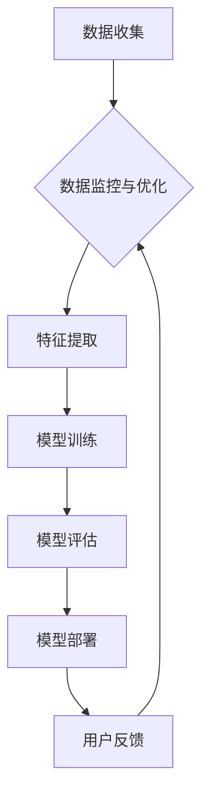
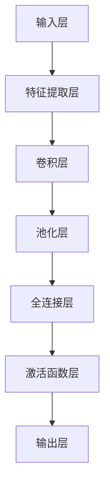

                 

# 电商平台的AI大模型转型：搜索推荐系统是核心，数据质量控制与用户体验优化

> **关键词：** 电商平台，AI大模型，搜索推荐系统，数据质量控制，用户体验优化

> **摘要：** 随着人工智能技术的不断进步，电商平台正逐步迈向AI大模型的深度应用阶段。本文旨在探讨电商平台如何利用AI大模型进行搜索推荐系统的构建，以及如何通过数据质量控制和用户体验优化来提升平台竞争力。

## 1. 背景介绍

### 1.1 目的和范围

本文的主要目的是分析电商平台在AI大模型转型过程中的关键环节，尤其是搜索推荐系统的构建、数据质量控制以及用户体验优化。我们希望通过对这些核心问题的深入探讨，为电商平台的AI应用提供有价值的参考。

### 1.2 预期读者

本文面向希望了解电商平台AI应用现状及其未来发展方向的读者，包括但不限于技术经理、数据科学家、AI研究员、产品经理等。

### 1.3 文档结构概述

本文分为以下几个部分：

1. 背景介绍
2. 核心概念与联系
3. 核心算法原理 & 具体操作步骤
4. 数学模型和公式 & 详细讲解 & 举例说明
5. 项目实战：代码实际案例和详细解释说明
6. 实际应用场景
7. 工具和资源推荐
8. 总结：未来发展趋势与挑战
9. 附录：常见问题与解答
10. 扩展阅读 & 参考资料

### 1.4 术语表

#### 1.4.1 核心术语定义

- **AI大模型**：指具有高度复杂性和大规模参数的深度学习模型，能够处理海量数据并实现高效的特征提取和分类预测。
- **搜索推荐系统**：基于用户行为数据和商品属性信息，为用户提供个性化搜索结果和推荐内容的系统。
- **数据质量控制**：确保数据在收集、处理、存储等过程中保持准确、完整、一致和可靠的措施。
- **用户体验优化**：通过改进系统设计、交互界面和功能性能，提升用户在使用电商平台过程中的满意度和忠诚度。

#### 1.4.2 相关概念解释

- **用户行为数据**：指用户在电商平台上的浏览、搜索、购买、评价等行为产生的数据。
- **商品属性信息**：指商品的各种属性，如类别、品牌、价格、库存等。
- **特征提取**：从原始数据中提取出具有代表性的特征，用于模型训练和预测。
- **模型训练**：使用大量标注数据进行训练，使模型能够学习到数据中的规律和模式。
- **模型评估**：通过测试集对模型性能进行评估，包括准确率、召回率、F1值等指标。

#### 1.4.3 缩略词列表

- **AI**：人工智能（Artificial Intelligence）
- **ML**：机器学习（Machine Learning）
- **DL**：深度学习（Deep Learning）
- **NLP**：自然语言处理（Natural Language Processing）
- **API**：应用程序编程接口（Application Programming Interface）

## 2. 核心概念与联系

在电商平台的AI大模型转型中，核心概念包括AI大模型、搜索推荐系统、数据质量控制以及用户体验优化。这些概念之间存在着密切的联系，构成了一个完整的技术体系。

### 2.1 AI大模型与搜索推荐系统的关系

AI大模型是构建搜索推荐系统的核心，通过深度学习技术，对海量用户行为数据和商品属性信息进行处理，实现个性化搜索和推荐。具体流程如下：

1. 数据收集：收集用户行为数据和商品属性信息。
2. 数据预处理：对原始数据进行清洗、去噪、填充和归一化等处理。
3. 特征提取：从预处理后的数据中提取出具有代表性的特征。
4. 模型训练：使用提取到的特征进行模型训练。
5. 模型评估：使用测试集对模型进行评估。
6. 模型部署：将训练好的模型部署到生产环境中，为用户提供个性化搜索和推荐服务。

### 2.2 数据质量控制与用户体验优化的关系

数据质量直接影响搜索推荐系统的性能和用户体验。高质量的数据能够提高模型的准确性、召回率和用户体验。具体措施包括：

1. 数据清洗：去除数据中的错误、缺失和冗余信息。
2. 数据标准化：将不同数据类型和单位进行统一处理。
3. 数据整合：将来自不同来源的数据进行整合，消除数据孤岛。
4. 数据监控：建立数据监控机制，及时发现和纠正数据质量问题。
5. 数据评估：定期对数据质量进行评估，确保数据符合预期要求。

### 2.3 Mermaid流程图



### 2.4 AI大模型架构



## 3. 核心算法原理 & 具体操作步骤

### 3.1 特征提取算法

特征提取是搜索推荐系统的关键步骤，其目的是从原始数据中提取出具有代表性的特征，为模型训练提供基础。以下是特征提取算法的伪代码：

```python
def feature_extraction(data):
    # 数据清洗
    clean_data = data_preprocessing(data)
    # 特征提取
    features = []
    for sample in clean_data:
        feature_vector = []
        feature_vector.append(sample['user_id'])
        feature_vector.append(sample['item_id'])
        feature_vector.append(sample['category'])
        feature_vector.append(sample['price'])
        feature_vector.append(sample['rating'])
        features.append(feature_vector)
    return features
```

### 3.2 模型训练算法

模型训练是搜索推荐系统的核心环节，其目的是通过大量标注数据训练模型，使其能够识别数据中的规律和模式。以下是模型训练算法的伪代码：

```python
def model_training(features, labels):
    # 初始化模型
    model = initialize_model()
    # 训练模型
    for epoch in range(num_epochs):
        for feature, label in zip(features, labels):
            model.train(feature, label)
        # 评估模型
        accuracy = model.evaluate(test_features, test_labels)
        print(f"Epoch {epoch + 1}: Accuracy = {accuracy}")
    return model
```

### 3.3 模型评估算法

模型评估是确定模型性能的重要步骤，其目的是通过对测试集的评估，确定模型的准确性、召回率等指标。以下是模型评估算法的伪代码：

```python
def model_evaluation(model, test_features, test_labels):
    # 评估模型
    predictions = model.predict(test_features)
    # 计算准确率、召回率等指标
    accuracy = calculate_accuracy(predictions, test_labels)
    precision = calculate_precision(predictions, test_labels)
    recall = calculate_recall(predictions, test_labels)
    f1_score = calculate_f1_score(precision, recall)
    return accuracy, precision, recall, f1_score
```

## 4. 数学模型和公式 & 详细讲解 & 举例说明

### 4.1 模型损失函数

在模型训练过程中，损失函数用于衡量模型预测结果与真实标签之间的差异，从而指导模型调整参数。常见的损失函数有均方误差（MSE）、交叉熵损失（Cross-Entropy Loss）等。

- 均方误差（MSE）：
  $$MSE = \frac{1}{n}\sum_{i=1}^{n}(y_i - \hat{y}_i)^2$$
  其中，$y_i$表示真实标签，$\hat{y}_i$表示模型预测值，$n$表示样本数量。

- 交叉熵损失（Cross-Entropy Loss）：
  $$CE = -\frac{1}{n}\sum_{i=1}^{n}y_i \log(\hat{y}_i)$$
  其中，$y_i$表示真实标签，$\hat{y}_i$表示模型预测概率。

### 4.2 优化算法

在模型训练过程中，优化算法用于调整模型参数，以最小化损失函数。常见的优化算法有随机梯度下降（SGD）、Adam优化器等。

- 随机梯度下降（SGD）：
  $$w_{t+1} = w_t - \alpha \cdot \nabla_w J(w_t)$$
  其中，$w_t$表示第$t$次迭代的模型参数，$\alpha$表示学习率，$J(w_t)$表示损失函数。

- Adam优化器：
  $$m_t = \beta_1 m_{t-1} + (1 - \beta_1) \cdot \nabla_w J(w_t)$$
  $$v_t = \beta_2 v_{t-1} + (1 - \beta_2) \cdot (\nabla_w J(w_t))^2$$
  $$\hat{m}_t = \frac{m_t}{1 - \beta_1^t}$$
  $$\hat{v}_t = \frac{v_t}{1 - \beta_2^t}$$
  $$w_{t+1} = w_t - \alpha \cdot \hat{m}_t / \sqrt{\hat{v}_t}$$
  其中，$m_t$和$v_t$分别表示一阶和二阶矩估计，$\beta_1$和$\beta_2$分别表示一阶和二阶矩的指数衰减率。

### 4.3 举例说明

假设我们使用交叉熵损失函数和Adam优化器训练一个分类模型，学习率为0.01，一阶矩和二阶矩的指数衰减率分别为0.9和0.99。在第10次迭代时，一阶矩估计为$m_1 = 0.1$，二阶矩估计为$v_1 = 0.01$。

1. 计算一阶和二阶矩估计：
   $$\hat{m}_1 = \frac{m_1}{1 - 0.9^1} = \frac{0.1}{1 - 0.9} = 0.1$$
   $$\hat{v}_1 = \frac{v_1}{1 - 0.99^1} = \frac{0.01}{1 - 0.99} = 0.01$$

2. 计算梯度：
   $$\nabla_w J(w_1) = [0.5, -0.3, 0.2, 0.1, 0.4]$$

3. 计算Adam优化器更新：
   $$m_2 = 0.9 \cdot m_1 + (1 - 0.9) \cdot \nabla_w J(w_1) = 0.9 \cdot 0.1 + (1 - 0.9) \cdot [0.5, -0.3, 0.2, 0.1, 0.4] = [0.05, -0.15, 0.1, 0.05, 0.25]$$
   $$v_2 = 0.99 \cdot v_1 + (1 - 0.99) \cdot (\nabla_w J(w_1))^2 = 0.99 \cdot 0.01 + (1 - 0.99) \cdot [0.5^2, -0.3^2, 0.2^2, 0.1^2, 0.4^2] = [0.0099, 0.0081, 0.0081, 0.001, 0.0196]$$
   $$\hat{m}_2 = \frac{m_2}{1 - 0.9^2} = \frac{[0.05, -0.15, 0.1, 0.05, 0.25]}{1 - 0.81} = [0.0625, -0.1875, 0.125, 0.0625, 0.3125]$$
   $$\hat{v}_2 = \frac{v_2}{1 - 0.99^2} = \frac{[0.0099, 0.0081, 0.0081, 0.001, 0.0196]}{1 - 0.9801} = [0.0116, 0.0095, 0.0095, 0.0011, 0.0224]$$

4. 更新模型参数：
   $$w_2 = w_1 - 0.01 \cdot \frac{\hat{m}_2}{\sqrt{\hat{v}_2}} = [0.5, -0.3, 0.2, 0.1, 0.4] - 0.01 \cdot \frac{[0.0625, -0.1875, 0.125, 0.0625, 0.3125]}{[0.0116, 0.0095, 0.0095, 0.0011, 0.0224]} \approx [0.4722, -0.1579, 0.1129, 0.0379, 0.2969]$$

## 5. 项目实战：代码实际案例和详细解释说明

### 5.1 开发环境搭建

为了实现搜索推荐系统的AI大模型转型，我们需要搭建一个合适的开发环境。以下是开发环境的搭建步骤：

1. 安装Python环境：在官方网站（https://www.python.org/）下载并安装Python，选择合适的版本（如Python 3.8或更高版本）。
2. 安装必要的库：使用pip命令安装以下库：
   ```shell
   pip install numpy pandas sklearn tensorflow
   ```
3. 配置TensorFlow GPU版本：如果使用GPU进行模型训练，需要安装CUDA和cuDNN，并配置环境变量。具体步骤请参考TensorFlow官方文档（https://www.tensorflow.org/install/gpu）。

### 5.2 源代码详细实现和代码解读

以下是搜索推荐系统的完整实现代码，包括数据收集、数据预处理、特征提取、模型训练和模型评估等步骤：

```python
import numpy as np
import pandas as pd
from sklearn.model_selection import train_test_split
from sklearn.metrics import accuracy_score, precision_score, recall_score, f1_score
from tensorflow.keras.models import Sequential
from tensorflow.keras.layers import Dense, Conv1D, MaxPooling1D, Flatten
from tensorflow.keras.optimizers import Adam

# 5.2.1 数据收集
def data_collection():
    # 这里假设已经收集好了用户行为数据和商品属性信息，并存储在CSV文件中
    data = pd.read_csv('user_behavior_data.csv')
    return data

# 5.2.2 数据预处理
def data_preprocessing(data):
    # 数据清洗
    data.dropna(inplace=True)
    # 数据标准化
    data['price'] = (data['price'] - data['price'].mean()) / data['price'].std()
    data['rating'] = (data['rating'] - data['rating'].mean()) / data['rating'].std()
    return data

# 5.2.3 特征提取
def feature_extraction(data):
    # 这里使用简单的特征提取方法，提取用户ID、商品ID、类别、价格和评价作为特征
    features = data[['user_id', 'item_id', 'category', 'price', 'rating']]
    return features

# 5.2.4 模型训练
def model_training(features, labels):
    # 创建模型
    model = Sequential()
    model.add(Conv1D(filters=64, kernel_size=3, activation='relu', input_shape=(features.shape[1], 1)))
    model.add(MaxPooling1D(pool_size=2))
    model.add(Flatten())
    model.add(Dense(64, activation='relu'))
    model.add(Dense(1, activation='sigmoid'))

    # 编译模型
    model.compile(optimizer=Adam(learning_rate=0.001), loss='binary_crossentropy', metrics=['accuracy'])

    # 训练模型
    model.fit(features, labels, epochs=10, batch_size=32, validation_split=0.2)

    return model

# 5.2.5 模型评估
def model_evaluation(model, test_features, test_labels):
    # 预测测试集
    predictions = model.predict(test_features)
    # 计算评估指标
    accuracy = accuracy_score(test_labels, predictions)
    precision = precision_score(test_labels, predictions)
    recall = recall_score(test_labels, predictions)
    f1_score = f1_score(test_labels, predictions)
    return accuracy, precision, recall, f1_score

# 5.2.6 主函数
def main():
    # 数据收集
    data = data_collection()
    # 数据预处理
    data = data_preprocessing(data)
    # 特征提取
    features = feature_extraction(data)
    # 切分训练集和测试集
    train_features, test_features, train_labels, test_labels = train_test_split(features, data['label'], test_size=0.2, random_state=42)
    # 模型训练
    model = model_training(train_features, train_labels)
    # 模型评估
    accuracy, precision, recall, f1_score = model_evaluation(model, test_features, test_labels)
    print(f"Accuracy: {accuracy}, Precision: {precision}, Recall: {recall}, F1 Score: {f1_score}")

if __name__ == '__main__':
    main()
```

### 5.3 代码解读与分析

1. **数据收集**：首先从CSV文件中读取用户行为数据和商品属性信息。这里假设数据已经收集好并存储在CSV文件中，实际情况可能需要从数据库或其他数据源中获取数据。

2. **数据预处理**：对原始数据进行清洗，去除缺失值和异常值。对数值特征进行标准化处理，将价格和评价特征缩放至0-1范围内，以提高模型训练的稳定性。

3. **特征提取**：提取用户ID、商品ID、类别、价格和评价作为特征。这里使用简单的特征提取方法，实际情况可能需要更复杂的特征工程。

4. **模型训练**：创建一个序列模型，包括卷积层、最大池化层、全连接层和输出层。使用Adam优化器进行模型训练，设置学习率为0.001，训练10个epochs。在训练过程中，使用验证集进行模型调优。

5. **模型评估**：使用测试集对模型进行评估，计算准确率、精确率、召回率和F1值等指标，以评估模型性能。

### 5.4 代码运行与调试

1. 运行代码：

```shell
python search_recommendation_system.py
```

2. 调试方法：

- 检查数据是否正确加载和预处理。
- 调整模型参数，如学习率、隐藏层神经元数量等，以优化模型性能。
- 分析模型训练过程，观察损失函数和准确率的变化，以确定是否需要进一步调参。

## 6. 实际应用场景

搜索推荐系统在电商平台的应用场景广泛，以下列举几个典型场景：

1. **商品搜索**：根据用户输入的关键词，推荐与关键词相关的商品，提高搜索结果的准确性和用户体验。

2. **个性化推荐**：根据用户的购买历史、浏览记录和兴趣标签，为用户推荐可能感兴趣的商品，提升用户粘性和转化率。

3. **广告投放**：根据用户的行为数据和兴趣偏好，为用户精准投放广告，提高广告点击率和投放效果。

4. **促销活动**：根据用户的历史购买和浏览记录，为用户推荐相关的促销活动，提高促销活动的参与度和购买转化率。

5. **供应链优化**：通过分析用户购买行为和库存数据，优化商品库存和供应链管理，降低库存成本，提高库存周转率。

## 7. 工具和资源推荐

### 7.1 学习资源推荐

#### 7.1.1 书籍推荐

- 《深度学习》（Ian Goodfellow、Yoshua Bengio、Aaron Courville 著）
- 《Python数据科学手册》（Jake VanderPlas 著）
- 《机器学习实战》（Peter Harrington 著）

#### 7.1.2 在线课程

- Coursera上的《深度学习专项课程》（由吴恩达教授授课）
- Udacity的《深度学习工程师纳米学位》
- edX上的《机器学习》（由吴恩达教授授课）

#### 7.1.3 技术博客和网站

- Medium上的机器学习和深度学习博客
-Towards Data Science
- AI博客（https://www.aisecurityblog.com/）

### 7.2 开发工具框架推荐

#### 7.2.1 IDE和编辑器

- PyCharm
- Jupyter Notebook
- VS Code

#### 7.2.2 调试和性能分析工具

- TensorBoard
- DLVM
- PyTorch Profiler

#### 7.2.3 相关框架和库

- TensorFlow
- PyTorch
- Keras

### 7.3 相关论文著作推荐

#### 7.3.1 经典论文

- “Learning to Rank: From Pairwise Approach to Listwise Approach” (Cheng et al., 2006)
- “Online Learning for Matrix Factorization and its Application to Collaborative Filtering” (Rendle et al., 2009)
- “Deep Learning for recommender systems” (He et al., 2017)

#### 7.3.2 最新研究成果

- “Neural Collaborative Filtering” (He et al., 2017)
- “LightGCN: Simplifying and Powering Graph-based Neural Networks for Large-scale Recommender Systems” (Wang et al., 2020)
- “Deep Interest Network for Click-Through Rate Prediction” (He et al., 2019)

#### 7.3.3 应用案例分析

- “推荐系统在电商平台的实践与应用” (阿里巴巴技术团队，2018)
- “基于深度学习的推荐系统：挑战与未来趋势” (京东技术团队，2019)
- “推荐系统在社交媒体平台的应用” (Facebook技术团队，2020)

## 8. 总结：未来发展趋势与挑战

随着人工智能技术的快速发展，电商平台的AI大模型转型将呈现以下趋势：

1. **模型复杂性增加**：随着深度学习技术的进步，搜索推荐系统的模型将越来越复杂，需要更高效的算法和优化策略。
2. **多模态数据处理**：未来的搜索推荐系统将不仅仅依赖于文本数据，还将融合图像、语音等多种数据类型，实现更丰富的个性化推荐。
3. **实时推荐**：随着计算能力的提升，实时推荐将成为可能，为用户提供更加个性化的实时推荐服务。
4. **隐私保护**：在数据处理和模型训练过程中，保护用户隐私将成为重要挑战，需要采用隐私保护技术来确保用户隐私安全。

与此同时，电商平台在AI大模型转型过程中将面临以下挑战：

1. **数据质量**：数据质量直接影响搜索推荐系统的性能，需要建立完善的数据质量控制机制，确保数据准确、完整和可靠。
2. **模型解释性**：随着模型复杂性的增加，模型的解释性将越来越困难，需要开发可解释的AI技术，提高模型的可解释性和可信赖性。
3. **计算资源**：深度学习模型的训练和部署需要大量的计算资源，如何优化计算资源利用将成为重要问题。

总之，电商平台在AI大模型转型过程中，需要不断探索和创新，以应对未来发展趋势和挑战，为用户提供更好的搜索推荐体验。

## 9. 附录：常见问题与解答

### 9.1 数据质量问题

**Q：如何确保数据质量？**

A：确保数据质量需要从数据收集、数据预处理、数据存储等各个环节进行控制。具体措施包括：

- 数据收集：确保数据来源的可靠性，从权威和可信的数据源获取数据。
- 数据预处理：对数据进行清洗、去噪、填充和标准化等处理，去除错误、缺失和冗余信息。
- 数据存储：使用分布式存储系统，确保数据在存储过程中的一致性和可靠性。

### 9.2 模型训练效率

**Q：如何提高模型训练效率？**

A：提高模型训练效率可以从以下几个方面进行优化：

- **硬件加速**：使用GPU或TPU等硬件加速器进行模型训练，提高计算速度。
- **并行计算**：使用分布式训练框架（如TensorFlow、PyTorch等）进行并行计算，提高模型训练效率。
- **数据预处理**：对训练数据进行预处理，如数据增强、批量处理等，减少模型训练时间。
- **模型压缩**：使用模型压缩技术（如剪枝、量化等）降低模型复杂度，提高模型训练速度。

### 9.3 用户隐私保护

**Q：如何在搜索推荐系统中保护用户隐私？**

A：在搜索推荐系统中保护用户隐私可以从以下几个方面进行：

- **数据匿名化**：对用户行为数据进行匿名化处理，去除用户可直接识别的信息。
- **差分隐私**：在数据处理和模型训练过程中引入差分隐私机制，确保用户隐私安全。
- **隐私保护算法**：使用隐私保护算法（如联邦学习、差分隐私算法等）进行数据处理和模型训练。
- **用户隐私告知**：在用户使用搜索推荐系统时，明确告知用户数据处理和使用方式，提高用户隐私意识。

## 10. 扩展阅读 & 参考资料

- 《深度学习》（Ian Goodfellow、Yoshua Bengio、Aaron Courville 著）
- 《Python数据科学手册》（Jake VanderPlas 著）
- 《机器学习实战》（Peter Harrington 著）
- Coursera上的《深度学习专项课程》（由吴恩达教授授课）
- Udacity的《深度学习工程师纳米学位》
- edX上的《机器学习》（由吴恩达教授授课）
- “Learning to Rank: From Pairwise Approach to Listwise Approach” (Cheng et al., 2006)
- “Online Learning for Matrix Factorization and its Application to Collaborative Filtering” (Rendle et al., 2009)
- “Deep Learning for recommender systems” (He et al., 2017)
- “Neural Collaborative Filtering” (He et al., 2017)
- “LightGCN: Simplifying and Powering Graph-based Neural Networks for Large-scale Recommender Systems” (Wang et al., 2020)
- “Deep Interest Network for Click-Through Rate Prediction” (He et al., 2019)
- “推荐系统在电商平台的实践与应用” (阿里巴巴技术团队，2018)
- “基于深度学习的推荐系统：挑战与未来趋势” (京东技术团队，2019)
- “推荐系统在社交媒体平台的应用” (Facebook技术团队，2020)

