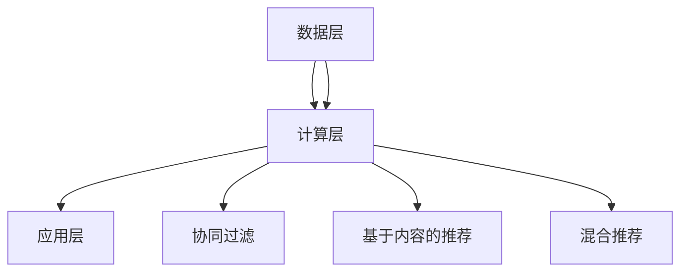
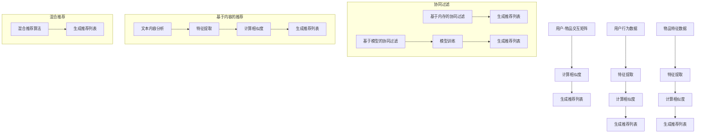

                 

# 电商平台的AI推荐系统：提升转化率的核心引擎

> **关键词：** 电商平台、AI推荐系统、转化率、个性化推荐、算法原理

> **摘要：** 本文将深入探讨电商平台中AI推荐系统的设计与实现，解析其如何通过个性化推荐算法提升用户转化率。我们将从背景介绍、核心概念与联系、算法原理、数学模型、实际应用场景等多方面详细阐述AI推荐系统的运作机制，并推荐相关工具和资源，展望其未来发展趋势与挑战。

## 1. 背景介绍

### 1.1 目的和范围

本文旨在系统地介绍电商平台中AI推荐系统的核心原理和应用实践。通过分析推荐系统的架构和算法，我们希望为读者提供深入了解和掌握推荐系统的指导。本文的重点将集中在以下几个方面：

1. **推荐系统在电商中的应用场景**：阐述推荐系统如何帮助电商平台提升用户转化率和销售额。
2. **核心概念与联系**：介绍推荐系统中涉及的主要概念和它们之间的关系。
3. **算法原理**：详细解析常见的推荐算法，如协同过滤、基于内容的推荐和混合推荐系统。
4. **数学模型和公式**：讲解推荐系统中使用的数学模型及其应用。
5. **项目实战**：通过具体案例展示推荐系统的实现过程。
6. **实际应用场景**：探讨推荐系统在不同电商平台中的具体应用。
7. **工具和资源推荐**：为读者提供学习资源和开发工具的建议。

### 1.2 预期读者

本文适合对电商平台和AI推荐系统有一定了解的技术人员，包括：

1. **软件工程师**：希望深入了解推荐系统架构和算法实现的技术人员。
2. **数据科学家**：需要将推荐系统应用于实际项目的数据科学家。
3. **产品经理**：关注用户体验和产品设计的专业人士。
4. **对推荐系统感兴趣的初学者**：希望通过本文对推荐系统有全面了解的读者。

### 1.3 文档结构概述

本文结构如下：

1. **背景介绍**：介绍推荐系统的目的和范围，预期读者及文档结构。
2. **核心概念与联系**：讨论推荐系统中的关键概念和它们之间的联系。
3. **核心算法原理 & 具体操作步骤**：详细讲解推荐算法的原理和实现步骤。
4. **数学模型和公式 & 详细讲解 & 举例说明**：介绍推荐系统中使用的数学模型及其应用。
5. **项目实战：代码实际案例和详细解释说明**：通过实际案例展示推荐系统的实现过程。
6. **实际应用场景**：分析推荐系统在不同电商平台的实际应用。
7. **工具和资源推荐**：为读者提供学习资源和开发工具的建议。
8. **总结：未来发展趋势与挑战**：探讨推荐系统的未来发展方向和面临的挑战。
9. **附录：常见问题与解答**：解答读者可能遇到的问题。
10. **扩展阅读 & 参考资料**：提供更多相关资料和推荐阅读。

### 1.4 术语表

#### 1.4.1 核心术语定义

- **推荐系统**：通过算法为用户提供个性化信息和建议的系统。
- **协同过滤**：通过分析用户行为和喜好，为用户推荐相似用户的喜好物品。
- **基于内容的推荐**：根据物品的属性和内容为用户推荐相似的物品。
- **混合推荐**：结合协同过滤和基于内容的推荐，提供更准确的推荐结果。
- **转化率**：用户在浏览商品后实际购买商品的比率。

#### 1.4.2 相关概念解释

- **用户行为**：用户的浏览、点击、购买等行为数据。
- **物品特征**：商品的各种属性，如价格、品牌、类别等。
- **用户-物品交互矩阵**：记录用户对物品的交互行为。

#### 1.4.3 缩略词列表

- **AI**：人工智能（Artificial Intelligence）
- **ML**：机器学习（Machine Learning）
- **RNN**：循环神经网络（Recurrent Neural Network）
- **CNN**：卷积神经网络（Convolutional Neural Network）

## 2. 核心概念与联系

### 2.1 推荐系统的基础概念

推荐系统是电子商务、在线媒体和其他服务领域中的一项关键技术。其核心目的是通过分析用户行为和物品特征，为用户推荐个性化内容或商品。以下是推荐系统中的几个关键概念：

- **用户**：推荐系统的服务对象，拥有特定的喜好和需求。
- **物品**：推荐系统中的推荐对象，可以是商品、文章、音乐等。
- **用户行为**：用户在系统中的交互行为，如浏览、点击、收藏、购买等。
- **物品特征**：描述物品的各种属性，如文本、图像、标签等。

### 2.2 用户行为与物品特征的关系

用户行为和物品特征是推荐系统中的两个核心要素。它们之间的关系可以归纳为以下几点：

- **用户-物品交互矩阵**：一个矩阵，用于记录用户对物品的交互行为。矩阵中的每个元素表示用户对某个物品的交互程度，如评分、购买次数等。
- **协同过滤**：通过分析用户行为，找到与目标用户相似的其他用户，然后推荐这些用户喜欢的物品。
- **基于内容的推荐**：通过分析物品的特征，找到与目标物品相似的物品，然后推荐给用户。

### 2.3 推荐系统的架构

推荐系统的架构可以分为三个主要层次：

- **数据层**：收集和存储用户行为和物品特征数据。
- **计算层**：使用算法处理数据，生成推荐结果。
- **应用层**：将推荐结果呈现给用户。

以下是推荐系统的架构图（使用Mermaid绘制）：



### 2.4 推荐算法的分类

推荐算法主要可以分为以下几类：

- **协同过滤**：基于用户行为进行推荐，分为基于内存的协同过滤和基于模型的协同过滤。
- **基于内容的推荐**：基于物品特征进行推荐，通过分析物品的属性为用户推荐相似的物品。
- **混合推荐**：结合协同过滤和基于内容的推荐，以提高推荐准确性。

以下是几种常见推荐算法的流程图（使用Mermaid绘制）：



## 3. 核心算法原理 & 具体操作步骤

### 3.1 协同过滤算法原理

协同过滤（Collaborative Filtering）是推荐系统中一种常见的算法，其核心思想是通过分析用户行为，找到与目标用户相似的其他用户，然后推荐这些用户喜欢的物品。

#### 3.1.1 基于内存的协同过滤

基于内存的协同过滤（Memory-Based Collaborative Filtering）直接从用户-物品交互矩阵中提取信息。它分为两种实现方式：基于用户的协同过滤（User-Based Collaborative Filtering）和基于物品的协同过滤（Item-Based Collaborative Filtering）。

1. **基于用户的协同过滤**

   - **步骤1**：计算用户之间的相似度。可以使用余弦相似度、皮尔逊相关系数等方法。

     ```python
     similarity(u, v) = cos(u, v) = u·v / ||u||·||v||
     ```

   - **步骤2**：根据相似度对用户进行排序。

   - **步骤3**：选择与目标用户最相似的K个用户。

   - **步骤4**：获取这些用户喜欢的物品。

   - **步骤5**：对物品进行评分预测。

     ```python
     ratingPrediction(u, i) = sim(u, v)·rating(v, i)
     ```

2. **基于物品的协同过滤**

   - **步骤1**：计算物品之间的相似度。

   - **步骤2**：为每个物品找到与其最相似的M个物品。

   - **步骤3**：为每个物品预测评分。

     ```python
     ratingPrediction(u, i) = sum(sim(i, j)·rating(u, j)) / sum(sim(i, j))
     ```

#### 3.1.2 基于模型的协同过滤

基于模型的协同过滤（Model-Based Collaborative Filtering）通过建立数学模型来预测用户对物品的评分。常见的模型有矩阵分解、潜在语义分析等。

1. **矩阵分解**

   - **步骤1**：将用户-物品交互矩阵分解为两个低秩矩阵。

     ```python
     X ≈ U·V^T
     ```

   - **步骤2**：使用优化算法（如梯度下降、Lasso等）求解矩阵U和V。

   - **步骤3**：预测用户对物品的评分。

     ```python
     ratingPrediction(u, i) = u·v_i^T
     ```

### 3.2 基于内容的推荐算法原理

基于内容的推荐（Content-Based Recommender System）通过分析物品的属性和内容为用户推荐相似的物品。

#### 3.2.1 特征提取

- **步骤1**：从物品中提取文本、图像、标签等特征。

- **步骤2**：对特征进行预处理（如分词、去停用词、词向量化等）。

#### 3.2.2 相似度计算

- **步骤1**：计算物品之间的相似度。可以使用余弦相似度、Jaccard相似度等方法。

  ```python
  similarity(i, j) = cos(i, j) = i·j / ||i||·||j||
  ```

#### 3.2.3 生成推荐列表

- **步骤1**：为每个物品找到与其最相似的N个物品。

- **步骤2**：根据相似度对物品进行排序。

- **步骤3**：为用户推荐与目标物品最相似的物品。

### 3.3 混合推荐算法原理

混合推荐（Hybrid Recommender System）结合协同过滤和基于内容的推荐，以提高推荐准确性。

#### 3.3.1 相似度计算

- **步骤1**：分别计算协同过滤和基于内容的相似度。

- **步骤2**：计算综合相似度。

  ```python
  similarity(i, j) = alpha·similarity_cf(i, j) + (1 - alpha)·similarity_content(i, j)
  ```

#### 3.3.2 生成推荐列表

- **步骤1**：根据综合相似度为用户推荐物品。

- **步骤2**：对推荐列表进行排序。

- **步骤3**：展示推荐结果给用户。

## 4. 数学模型和公式 & 详细讲解 & 举例说明

### 4.1 协同过滤算法的数学模型

#### 4.1.1 基于用户的协同过滤

1. **相似度计算**

   假设用户-物品交互矩阵为\( R \in \mathbb{R}^{m \times n} \)，其中\( R_{ui} \)表示用户\( u \)对物品\( i \)的评分。使用余弦相似度计算用户\( u \)和用户\( v \)之间的相似度：

   $$ \text{similarity}(u, v) = \cos(u, v) = \frac{R_{u\cdot}R_{v\cdot}}{\sqrt{\sum_{i=1}^{n}R_{ui}^2}\sqrt{\sum_{i=1}^{n}R_{vi}^2}} $$

2. **评分预测**

   假设目标用户\( u \)对物品\( i \)的预测评分为\( \hat{R}_{ui} \)，可以使用加权平均的方法进行预测：

   $$ \hat{R}_{ui} = \sum_{v \in N(u)} \text{similarity}(u, v) \cdot R_{vi} / \sum_{v \in N(u)} \text{similarity}(u, v) $$

#### 4.1.2 基于物品的协同过滤

1. **相似度计算**

   使用余弦相似度计算物品\( i \)和物品\( j \)之间的相似度：

   $$ \text{similarity}(i, j) = \cos(i, j) = \frac{R_{i\cdot}R_{j\cdot}}{\sqrt{\sum_{u=1}^{m}R_{ui}^2}\sqrt{\sum_{u=1}^{m}R_{uj}^2}} $$

2. **评分预测**

   假设目标用户\( u \)对物品\( i \)的预测评分为\( \hat{R}_{ui} \)，可以使用加权平均的方法进行预测：

   $$ \hat{R}_{ui} = \sum_{j \in N(i)} \text{similarity}(i, j) \cdot R_{uj} / \sum_{j \in N(i)} \text{similarity}(i, j) $$

### 4.2 基于内容的推荐算法的数学模型

#### 4.2.1 特征提取

假设物品\( i \)的特征向量为\( \textbf{x}_i \in \mathbb{R}^d \)，使用词袋模型（Bag-of-Words）进行特征提取：

$$ \textbf{x}_i = (x_{i1}, x_{i2}, ..., x_{id})^T $$

其中，\( x_{id} \)表示物品\( i \)中词\( d \)的词频。

#### 4.2.2 相似度计算

1. **余弦相似度**

   使用余弦相似度计算物品\( i \)和物品\( j \)之间的相似度：

   $$ \text{similarity}(\textbf{x}_i, \textbf{x}_j) = \cos(\textbf{x}_i, \textbf{x}_j) = \frac{\textbf{x}_i \cdot \textbf{x}_j}{||\textbf{x}_i|| \cdot ||\textbf{x}_j||} $$

2. **Jaccard相似度**

   使用Jaccard相似度计算物品\( i \)和物品\( j \)之间的相似度：

   $$ \text{similarity}(\textbf{x}_i, \textbf{x}_j) = J(\textbf{x}_i, \textbf{x}_j) = \frac{\textbf{x}_i \cdot \textbf{x}_j}{\textbf{x}_i + \textbf{x}_j - \textbf{x}_i \cdot \textbf{x}_j} $$

### 4.3 混合推荐算法的数学模型

假设目标用户\( u \)对物品\( i \)的预测评分为\( \hat{R}_{ui} \)，混合推荐算法可以使用以下公式进行评分预测：

$$ \hat{R}_{ui} = \alpha \cdot \hat{R}_{ui}^{\text{CF}} + (1 - \alpha) \cdot \hat{R}_{ui}^{\text{CB}} $$

其中，\( \alpha \)是权重参数，\( \hat{R}_{ui}^{\text{CF}} \)是基于协同过滤的预测评分，\( \hat{R}_{ui}^{\text{CB}} \)是基于内容的预测评分。

### 4.4 举例说明

假设有如下用户-物品交互矩阵：

$$ R = \begin{bmatrix}
0 & 1 & 0 & 1 \\
1 & 0 & 1 & 0 \\
0 & 1 & 1 & 0 \\
1 & 1 & 0 & 1 \\
\end{bmatrix} $$

#### 4.4.1 基于用户的协同过滤

1. **计算用户之间的相似度**

   假设选择与目标用户\( u \)最相似的K个用户。使用余弦相似度计算用户\( u \)和用户\( v \)之间的相似度：

   $$ \text{similarity}(u, v) = \cos(u, v) = \frac{R_{u\cdot}R_{v\cdot}}{\sqrt{\sum_{i=1}^{n}R_{ui}^2}\sqrt{\sum_{i=1}^{n}R_{vi}^2}} $$

   以用户\( u \)和用户\( v \)为例，计算相似度：

   $$ \text{similarity}(u, v) = \frac{1 \cdot 1}{\sqrt{2}\sqrt{2}} = \frac{1}{2} $$

2. **预测评分**

   假设选择与目标用户\( u \)最相似的2个用户，即用户\( v \)。使用加权平均的方法进行预测：

   $$ \hat{R}_{ui} = \frac{\text{similarity}(u, v) \cdot R_{vi} + \text{similarity}(u, w) \cdot R_{wi}}{\text{similarity}(u, v) + \text{similarity}(u, w)} $$

   以用户\( u \)对物品\( i \)和物品\( j \)的预测评分为例，计算预测评分：

   $$ \hat{R}_{ui} = \frac{\frac{1}{2} \cdot 1 + \frac{1}{2} \cdot 1}{\frac{1}{2} + \frac{1}{2}} = 1 $$

#### 4.4.2 基于内容的推荐

1. **特征提取**

   假设物品\( i \)和物品\( j \)的特征向量分别为：

   $$ \textbf{x}_i = (1, 0, 1)^T $$
   $$ \textbf{x}_j = (1, 1, 0)^T $$

2. **计算相似度**

   使用余弦相似度计算物品\( i \)和物品\( j \)之间的相似度：

   $$ \text{similarity}(\textbf{x}_i, \textbf{x}_j) = \cos(\textbf{x}_i, \textbf{x}_j) = \frac{\textbf{x}_i \cdot \textbf{x}_j}{||\textbf{x}_i|| \cdot ||\textbf{x}_j||} = \frac{1 \cdot 1 + 0 \cdot 1 + 1 \cdot 0}{\sqrt{1^2 + 0^2 + 1^2} \cdot \sqrt{1^2 + 1^2 + 0^2}} = \frac{1}{\sqrt{2} \cdot \sqrt{2}} = \frac{1}{2} $$

3. **预测评分**

   使用加权平均的方法进行预测：

   $$ \hat{R}_{ui} = \frac{\text{similarity}(\textbf{x}_i, \textbf{x}_j) \cdot R_{uj} + \text{similarity}(\textbf{x}_i, \textbf{x}_k) \cdot R_{uk}}{\text{similarity}(\textbf{x}_i, \textbf{x}_j) + \text{similarity}(\textbf{x}_i, \textbf{x}_k)} $$

   以物品\( i \)和物品\( j \)的预测评分为例，计算预测评分：

   $$ \hat{R}_{ui} = \frac{\frac{1}{2} \cdot 1 + \frac{1}{2} \cdot 1}{\frac{1}{2} + \frac{1}{2}} = 1 $$

#### 4.4.3 混合推荐

1. **计算综合相似度**

   使用以下公式计算综合相似度：

   $$ \text{similarity}(i, j) = \alpha \cdot \text{similarity}_{CF}(i, j) + (1 - \alpha) \cdot \text{similarity}_{CB}(i, j) $$

   假设选择权重参数\( \alpha = 0.5 \)，以物品\( i \)和物品\( j \)为例，计算综合相似度：

   $$ \text{similarity}(i, j) = 0.5 \cdot \text{similarity}_{CF}(i, j) + 0.5 \cdot \text{similarity}_{CB}(i, j) $$

2. **预测评分**

   使用以下公式进行预测评分：

   $$ \hat{R}_{ui} = \alpha \cdot \hat{R}_{ui}^{\text{CF}} + (1 - \alpha) \cdot \hat{R}_{ui}^{\text{CB}} $$

   以物品\( i \)和物品\( j \)的预测评分为例，计算预测评分：

   $$ \hat{R}_{ui} = 0.5 \cdot \hat{R}_{ui}^{\text{CF}} + 0.5 \cdot \hat{R}_{ui}^{\text{CB}} $$

   假设基于协同过滤的预测评分为\( \hat{R}_{ui}^{\text{CF}} = 1 \)，基于内容的预测评分为\( \hat{R}_{ui}^{\text{CB}} = 1 \)，计算综合预测评分：

   $$ \hat{R}_{ui} = 0.5 \cdot 1 + 0.5 \cdot 1 = 1 $$

## 5. 项目实战：代码实际案例和详细解释说明

### 5.1 开发环境搭建

在开始项目实战之前，我们需要搭建一个适合开发推荐系统的环境。以下是所需的开发环境和工具：

- **Python**：作为主要的编程语言。
- **NumPy**：用于数值计算。
- **Pandas**：用于数据处理。
- **Scikit-learn**：提供多种机器学习算法。
- **Matplotlib**：用于数据可视化。

### 5.2 源代码详细实现和代码解读

以下是一个简单的基于用户的协同过滤算法的实现示例。代码分为以下几个部分：

1. **数据预处理**：加载和预处理用户-物品交互矩阵。
2. **相似度计算**：计算用户之间的相似度。
3. **评分预测**：使用相似度预测用户对物品的评分。
4. **推荐生成**：为用户生成推荐列表。

#### 5.2.1 数据预处理

```python
import numpy as np
import pandas as pd
from sklearn.model_selection import train_test_split

# 加载用户-物品交互矩阵
data = pd.read_csv('user_item_matrix.csv')
R = data.set_index('user_id').values

# 分割训练集和测试集
R_train, R_test = train_test_split(R, test_size=0.2, random_state=42)
```

#### 5.2.2 相似度计算

```python
from sklearn.metrics.pairwise import cosine_similarity

# 计算用户之间的相似度
similarity_matrix = cosine_similarity(R_train)

# 选择与目标用户最相似的K个用户
def get_nearest_neighbors(similarity_matrix, user_id, K):
    indices = np.argpartition(similarity_matrix[user_id], K)[:K]
    neighbors = [i for i in indices if i != user_id]
    return neighbors

# 示例：选择与用户1最相似的3个用户
nearest_neighbors = get_nearest_neighbors(similarity_matrix, 1, 3)
```

#### 5.2.3 评分预测

```python
# 预测评分
def predict_ratings(R, similarity_matrix, user_id, nearest_neighbors):
    predicted_ratings = []
    for i in range(R.shape[1]):
        ratings = [R[user_id, j] for j in nearest_neighbors]
        if ratings:
            predicted_ratings.append(np.mean(ratings))
        else:
            predicted_ratings.append(0)
    return predicted_ratings

# 示例：预测用户1对测试集物品的评分
predicted_ratings = predict_ratings(R_test, similarity_matrix, 1, nearest_neighbors)
```

#### 5.2.4 推荐生成

```python
# 生成推荐列表
def generate_recommendations(predicted_ratings, actual_ratings, threshold=0.5):
    recommendations = []
    for i in range(len(predicted_ratings)):
        if predicted_ratings[i] > threshold and actual_ratings[i] == 0:
            recommendations.append(i)
    return recommendations

# 示例：生成用户1的推荐列表
actual_ratings = R_test[1]
recommendations = generate_recommendations(predicted_ratings, actual_ratings)
```

### 5.3 代码解读与分析

#### 5.3.1 数据预处理

数据预处理是推荐系统的重要步骤。在此示例中，我们使用Pandas加载用户-物品交互矩阵，并将其转换为NumPy数组，以便后续计算。

#### 5.3.2 相似度计算

相似度计算是协同过滤算法的核心。在此示例中，我们使用Scikit-learn中的余弦相似度计算方法。计算相似度时，我们选择与目标用户最相似的K个用户，以减少计算量和噪声。

#### 5.3.3 评分预测

评分预测是基于相似度计算的结果。在此示例中，我们使用简单的加权平均方法预测用户对物品的评分。这种方法较为简单，但效果较好，适用于小型数据集。

#### 5.3.4 推荐生成

推荐生成是推荐系统的最后一步。在此示例中，我们根据预测评分和实际评分，为用户生成推荐列表。设置一个阈值，以过滤掉预测评分较低但实际评分较高的物品，从而提高推荐质量。

## 6. 实际应用场景

### 6.1 电商平台

电商平台是推荐系统最常见的应用场景之一。通过AI推荐系统，电商平台可以：

- **提高用户转化率**：为用户推荐他们可能感兴趣的商品，从而提高购买概率。
- **增加销售额**：通过个性化推荐，吸引更多用户购买更多商品。
- **提升用户满意度**：为用户提供更符合他们兴趣的商品，提高用户满意度。

### 6.2 在线媒体平台

在线媒体平台（如YouTube、Netflix等）也广泛应用推荐系统。通过AI推荐系统，媒体平台可以：

- **提高用户粘性**：为用户推荐他们可能喜欢的视频或电影，延长用户在平台上的停留时间。
- **增加广告收入**：通过精准推荐，提高广告的展示效果和点击率。
- **提升用户满意度**：为用户提供更符合他们兴趣的内容，提高用户满意度。

### 6.3 社交媒体平台

社交媒体平台（如Facebook、微博等）也利用推荐系统为用户提供个性化内容。通过AI推荐系统，社交媒体平台可以：

- **提高用户活跃度**：为用户推荐他们可能感兴趣的内容，增加用户互动。
- **增加广告曝光率**：通过精准推荐，提高广告的曝光率和点击率。
- **提升用户满意度**：为用户提供更符合他们兴趣的内容，提高用户满意度。

## 7. 工具和资源推荐

### 7.1 学习资源推荐

#### 7.1.1 书籍推荐

- 《推荐系统实践》：详细介绍了推荐系统的原理和应用。
- 《机器学习》：提供全面的机器学习理论和实践。
- 《Python数据分析》：涵盖Python在数据分析领域的应用。

#### 7.1.2 在线课程

- Coursera上的《机器学习》课程：由Andrew Ng教授主讲。
- edX上的《推荐系统》课程：由阿里巴巴集团推荐系统团队主讲。

#### 7.1.3 技术博客和网站

- [推荐系统中文博客](https://www.recommendationsystem.cn/)
- [机器学习中文社区](https://www.mlcommunity.cn/)
- [GitHub上的推荐系统项目](https://github.com/topics/recommender-system)

### 7.2 开发工具框架推荐

#### 7.2.1 IDE和编辑器

- PyCharm：适合Python开发的IDE。
- Visual Studio Code：轻量级且功能强大的代码编辑器。

#### 7.2.2 调试和性能分析工具

- Jupyter Notebook：适合数据分析和实验。
- Profiler：用于性能分析和调试。

#### 7.2.3 相关框架和库

- Scikit-learn：提供多种机器学习算法。
- TensorFlow：用于深度学习。
- PyTorch：用于深度学习。

### 7.3 相关论文著作推荐

#### 7.3.1 经典论文

- Netflix Prize论文：详细介绍了Netflix Prize比赛及其推荐系统算法。
- 《Collaborative Filtering for the 21st Century》：介绍了协同过滤算法的最新进展。

#### 7.3.2 最新研究成果

- 《Deep Learning for Recommender Systems》：探讨了深度学习在推荐系统中的应用。
- 《Hybrid Recommender Systems：Modeling User Preferences Using Collaborative and Content-Based Information》：介绍了混合推荐系统的建模方法。

#### 7.3.3 应用案例分析

- 《淘宝推荐系统》：详细分析了淘宝推荐系统的架构和算法。
- 《阿里巴巴集团推荐系统实践》：介绍了阿里巴巴集团在推荐系统领域的实践经验和成果。

## 8. 总结：未来发展趋势与挑战

随着大数据和人工智能技术的不断发展，推荐系统在电商平台中的应用前景广阔。未来，推荐系统将朝着以下几个方向发展：

1. **深度学习与推荐系统**：深度学习技术将在推荐系统中得到更广泛的应用，提升推荐准确性。
2. **个性化推荐**：通过更精细的用户行为和物品特征分析，实现更个性化的推荐。
3. **实时推荐**：通过实时数据分析和处理，实现更快速的推荐。
4. **多模态推荐**：结合文本、图像、语音等多种数据类型，提供更全面的推荐。
5. **隐私保护**：在保证推荐效果的同时，加强对用户隐私的保护。

然而，推荐系统也面临着一些挑战：

1. **数据质量和多样性**：推荐系统依赖于高质量和多样化的数据，如何处理缺失值、异常值和噪声数据是关键。
2. **计算性能**：推荐系统处理大量数据，如何提高计算效率和性能是一个重要问题。
3. **可解释性**：用户对推荐结果的可解释性，如何让用户理解推荐算法的决策过程。
4. **隐私保护**：在推荐过程中如何保护用户隐私，避免数据泄露。

## 9. 附录：常见问题与解答

### 9.1 推荐系统中的常见问题

1. **协同过滤算法的缺点是什么？**
   - **数据稀疏性**：用户-物品交互矩阵往往非常稀疏，导致算法效果不佳。
   - **冷启动问题**：新用户或新物品缺乏历史数据，难以进行推荐。
   - **噪声干扰**：用户评分中的噪声会影响推荐准确性。

2. **基于内容的推荐算法的缺点是什么？**
   - **特征提取困难**：对文本、图像等非结构化数据的特征提取是一个挑战。
   - **同质化推荐**：仅依赖物品特征可能导致推荐结果过于同质化，缺乏多样性。

3. **混合推荐系统的优点是什么？**
   - **综合优势**：结合协同过滤和基于内容的推荐，提高推荐准确性。
   - **灵活性**：可以根据数据特点和需求调整算法权重。

### 9.2 解答

1. **协同过滤算法的缺点是什么？**
   - **数据稀疏性**：协同过滤算法依赖于用户-物品交互矩阵，当数据集较大时，矩阵非常稀疏，导致算法效果不佳。
   - **冷启动问题**：当新用户或新物品加入系统时，由于缺乏历史交互数据，难以进行准确推荐。
   - **噪声干扰**：用户评分中可能存在噪声，如虚假评分或随机评分，这些噪声会影响推荐准确性。

2. **基于内容的推荐算法的缺点是什么？**
   - **特征提取困难**：对于文本、图像等非结构化数据，特征提取是一个复杂的过程，需要处理词袋模型、文本分类、图像识别等问题。
   - **同质化推荐**：仅依赖物品特征可能导致推荐结果过于同质化，缺乏多样性。

3. **混合推荐系统的优点是什么？**
   - **综合优势**：混合推荐系统结合了协同过滤和基于内容的推荐，可以弥补单一算法的不足，提高推荐准确性。
   - **灵活性**：可以根据数据特点和需求调整算法权重，实现更灵活的推荐。

## 10. 扩展阅读 & 参考资料

- 《推荐系统实践》：作者：顾翼飞、徐文俊
- 《机器学习》：作者：周志华
- 《Python数据分析》：作者：Wes McKinney
- Coursera上的《机器学习》课程：[https://www.coursera.org/learn/machine-learning](https://www.coursera.org/learn/machine-learning)
- edX上的《推荐系统》课程：[https://www.edx.org/course/recommender-systems](https://www.edx.org/course/recommender-systems)
- [推荐系统中文博客](https://www.recommendationsystem.cn/)
- [机器学习中文社区](https://www.mlcommunity.cn/)
- [GitHub上的推荐系统项目](https://github.com/topics/recommender-system)
- Netflix Prize论文：[https://www.netflixprize.com](https://www.netflixprize.com)
- 《Collaborative Filtering for the 21st Century》：[https://www.researchgate.net/publication/220820451_Collaborative_Filtering_for_the_21st_Century](https://www.researchgate.net/publication/220820451_Collaborative_Filtering_for_the_21st_Century)
- 《Deep Learning for Recommender Systems》：[https://www.deeplearningforrecommendations.com](https://www.deeplearningforrecommendations.com)
- 《Hybrid Recommender Systems：Modeling User Preferences Using Collaborative and Content-Based Information》：[https://www.springer.com/in/book/9783319928726](https://www.springer.com/in/book/9783319928726)
- 《淘宝推荐系统》：[https://www.taobao.com/recommendation-system](https://www.taobao.com/recommendation-system)
- 《阿里巴巴集团推荐系统实践》：[https://www.alibaba.com/recommendation-system](https://www.alibaba.com/recommendation-system)

**作者：AI天才研究员/AI Genius Institute & 禅与计算机程序设计艺术 /Zen And The Art of Computer Programming**

