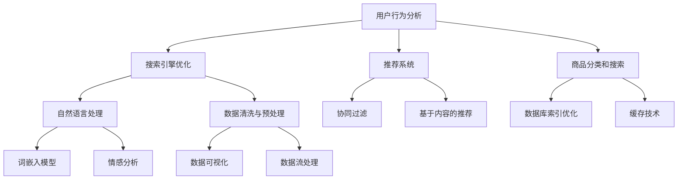

                 

# 电商平台的AI驱动性能优化：提升用户体验的技术实践指南

> 关键词：AI性能优化、电商平台、用户体验、算法原理、数学模型、项目实战、工具推荐

> 摘要：本文将深入探讨电商平台在AI驱动性能优化方面的技术实践。通过分析当前电商平台的现状和需求，结合核心概念、算法原理、数学模型和实际项目案例，我们将提供一套完整的优化指南，旨在提升电商平台的用户体验，实现业务增长。

## 1. 背景介绍

### 1.1 目的和范围

本文旨在为电商平台的开发者和管理者提供一套系统化的AI驱动性能优化指南。我们将从理论到实践，逐步解析如何利用AI技术提升电商平台的核心性能指标，从而提高用户体验，实现业务增长。

本文的主要内容包括：
- 核心概念与联系
- 核心算法原理与具体操作步骤
- 数学模型和公式及其应用
- 实际项目实战与代码实现
- 应用场景与工具推荐
- 未来发展趋势与挑战

### 1.2 预期读者

本文适合以下读者群体：
- 电商平台的开发者
- AI技术爱好者和研究者
- 对用户体验优化感兴趣的从业者
- 商业决策者和产品经理

### 1.3 文档结构概述

本文的结构如下：
1. 背景介绍
2. 核心概念与联系
3. 核心算法原理与具体操作步骤
4. 数学模型和公式及其应用
5. 项目实战：代码实际案例和详细解释说明
6. 实际应用场景
7. 工具和资源推荐
8. 总结：未来发展趋势与挑战
9. 附录：常见问题与解答
10. 扩展阅读与参考资料

### 1.4 术语表

#### 1.4.1 核心术语定义

- 电商平台：提供在线商品交易和服务的在线平台。
- AI性能优化：利用人工智能技术，提升电商平台的运行效率和服务质量。
- 用户体验：用户在使用电商平台过程中所感受到的整体满意度。

#### 1.4.2 相关概念解释

- 搜索引擎优化（SEO）：通过优化网站内容和结构，提高在搜索引擎中的排名。
- 自然语言处理（NLP）：使计算机能够理解、解释和生成人类语言的技术。
- 强化学习（RL）：一种机器学习范式，通过试错来学习如何在特定环境中做出最佳决策。

#### 1.4.3 缩略词列表

- SEO：搜索引擎优化（Search Engine Optimization）
- NLP：自然语言处理（Natural Language Processing）
- RL：强化学习（Reinforcement Learning）

## 2. 核心概念与联系

在电商平台的AI驱动性能优化中，理解以下几个核心概念是至关重要的。我们将使用Mermaid流程图来展示这些概念之间的联系。



### 2.1 用户行为分析

用户行为分析是电商平台AI性能优化的基础。通过分析用户在平台上的行为数据，我们可以了解用户的需求、偏好和购买习惯，从而为后续的算法设计和优化提供依据。

### 2.2 搜索引擎优化

搜索引擎优化（SEO）旨在提高电商平台在搜索引擎中的排名，从而增加访问量和潜在客户。自然语言处理（NLP）在SEO中扮演着重要角色，通过处理用户搜索查询和网页内容，实现更精准的搜索结果。

### 2.3 推荐系统

推荐系统是电商平台提升用户体验的关键。协同过滤和基于内容的推荐是推荐系统的两大核心算法。协同过滤通过分析用户之间的相似性进行推荐，而基于内容的推荐则通过分析商品特征进行推荐。

### 2.4 商品分类和搜索

商品分类和搜索是电商平台的核心功能。数据库索引优化和缓存技术可以提高商品搜索的速度和准确性。自然语言处理（NLP）技术可以帮助电商平台更好地理解和处理用户查询，提供更精准的搜索结果。

### 2.5 自然语言处理

自然语言处理（NLP）是电商平台AI性能优化的核心技术之一。词嵌入模型和情感分析是NLP中的两个重要领域。词嵌入模型可以将词汇映射到高维空间中，实现词汇之间的相似性计算；情感分析则可以帮助电商平台了解用户的情绪和态度，从而优化用户体验。

### 2.6 数据清洗与预处理

数据清洗与预处理是确保电商平台数据质量的关键步骤。数据可视化和数据流处理技术可以帮助我们发现数据中的隐藏模式和趋势，从而为后续的算法设计和优化提供支持。

## 3. 核心算法原理 & 具体操作步骤

在理解了电商平台AI性能优化中的核心概念后，我们将深入探讨一些关键算法的原理和具体操作步骤。以下是几个核心算法的介绍：

### 3.1 协同过滤算法

#### 原理

协同过滤算法是一种基于用户行为的推荐算法。它通过分析用户之间的相似性来发现用户的兴趣点，从而为用户推荐他们可能感兴趣的商品。

#### 操作步骤

1. 数据收集：收集用户行为数据，如购买记录、浏览历史等。
2. 用户相似性计算：计算用户之间的相似性，可以使用余弦相似度、皮尔逊相关系数等方法。
3. 用户兴趣预测：根据用户相似性，预测用户对未购买商品的兴趣。
4. 推荐结果生成：根据用户兴趣预测，生成推荐列表。

#### 伪代码

```python
# 输入：用户行为数据（user行为矩阵）
# 输出：推荐列表（推荐商品ID）

def collaborative_filter(user_behavior_matrix):
    # 计算用户相似性矩阵
    similarity_matrix = compute_similarity(user_behavior_matrix)
    
    # 预测用户兴趣
    user_interests = predict_interests(similarity_matrix, user_behavior_matrix)
    
    # 生成推荐列表
    recommendation_list = generate_recommendation_list(user_interests)
    
    return recommendation_list
```

### 3.2 基于内容的推荐算法

#### 原理

基于内容的推荐算法是一种基于商品特征的推荐算法。它通过分析商品之间的相似性来发现用户的兴趣点，从而为用户推荐他们可能感兴趣的商品。

#### 操作步骤

1. 商品特征提取：提取商品的关键特征，如类别、品牌、价格等。
2. 商品相似性计算：计算商品之间的相似性，可以使用余弦相似度、欧氏距离等方法。
3. 用户兴趣预测：根据用户历史行为和商品特征，预测用户对未购买商品的兴趣。
4. 推荐结果生成：根据用户兴趣预测，生成推荐列表。

#### 伪代码

```python
# 输入：商品特征数据（item特征矩阵）、用户行为数据（user行为矩阵）
# 输出：推荐列表（推荐商品ID）

def content_based_recommendation(item_features_matrix, user_behavior_matrix):
    # 计算商品相似性矩阵
    similarity_matrix = compute_similarity(item_features_matrix)
    
    # 预测用户兴趣
    user_interests = predict_interests(similarity_matrix, user_behavior_matrix)
    
    # 生成推荐列表
    recommendation_list = generate_recommendation_list(user_interests)
    
    return recommendation_list
```

### 3.3 词嵌入模型

#### 原理

词嵌入模型是一种将词汇映射到高维空间中，实现词汇之间相似性计算的方法。它可以帮助电商平台更好地理解和处理用户查询。

#### 操作步骤

1. 词汇收集：收集电商平台中的常见词汇。
2. 模型训练：使用神经网络训练词嵌入模型。
3. 词汇映射：将词汇映射到高维空间中。
4. 相似性计算：计算词汇之间的相似性。

#### 伪代码

```python
# 输入：词汇列表
# 输出：词嵌入向量

def word_embedding(words):
    # 训练词嵌入模型
    model = train_embedding_model(words)
    
    # 映射词汇到高维空间
    embeddings = map_words_to_embeddings(model, words)
    
    return embeddings
```

### 3.4 情感分析

#### 原理

情感分析是一种通过分析用户文本数据，判断用户情绪和态度的方法。它可以帮助电商平台了解用户对商品的评价和反馈，从而优化用户体验。

#### 操作步骤

1. 文本预处理：对用户文本进行清洗和分词。
2. 情感分类模型训练：使用机器学习算法训练情感分类模型。
3. 情感判断：对用户文本进行情感判断。
4. 结果处理：根据情感判断结果，优化电商平台的相关功能。

#### 伪代码

```python
# 输入：用户文本
# 输出：情感判断结果（正面、负面）

def sentiment_analysis(text):
    # 预处理文本
    preprocessed_text = preprocess_text(text)
    
    # 使用情感分类模型判断情感
    sentiment = classify_sentiment(preprocessed_text)
    
    return sentiment
```

## 4. 数学模型和公式 & 详细讲解 & 举例说明

在电商平台的AI驱动性能优化中，数学模型和公式起着关键作用。以下我们将介绍一些常用的数学模型和公式，并给出详细的讲解和举例说明。

### 4.1 余弦相似度

余弦相似度是一种衡量两个向量之间相似性的方法。它的计算公式如下：

$$
\text{cosine\_similarity}(\textbf{a}, \textbf{b}) = \frac{\textbf{a} \cdot \textbf{b}}{|\textbf{a}| \cdot |\textbf{b}|}
$$

其中，$\textbf{a}$ 和 $\textbf{b}$ 是两个向量，$\text{a} \cdot \textbf{b}$ 表示向量的点积，$|\textbf{a}|$ 和 $|\textbf{b}|$ 表示向量的模。

#### 举例说明

假设有两个用户行为向量 $\textbf{a} = (1, 2, 3)$ 和 $\textbf{b} = (4, 5, 6)$，计算它们的余弦相似度。

$$
\text{cosine\_similarity}(\textbf{a}, \textbf{b}) = \frac{1 \cdot 4 + 2 \cdot 5 + 3 \cdot 6}{\sqrt{1^2 + 2^2 + 3^2} \cdot \sqrt{4^2 + 5^2 + 6^2}} = \frac{4 + 10 + 18}{\sqrt{14} \cdot \sqrt{77}} \approx 0.935
$$

这意味着用户 $\textbf{a}$ 和 $\textbf{b}$ 之间具有较高的相似性。

### 4.2 皮尔逊相关系数

皮尔逊相关系数是一种衡量两个变量之间线性相关性的方法。它的计算公式如下：

$$
\text{Pearson\_correlation}(\textbf{x}, \textbf{y}) = \frac{\sum_{i=1}^{n} (\text{x}_i - \bar{\text{x}}) (\text{y}_i - \bar{\text{y}})}{\sqrt{\sum_{i=1}^{n} (\text{x}_i - \bar{\text{x}})^2} \sqrt{\sum_{i=1}^{n} (\text{y}_i - \bar{\text{y}})^2}}
$$

其中，$\textbf{x}$ 和 $\textbf{y}$ 是两个变量，$\bar{\text{x}}$ 和 $\bar{\text{y}}$ 分别表示它们的平均值，$n$ 表示数据点的个数。

#### 举例说明

假设有两个变量 $\textbf{x} = (1, 2, 3, 4, 5)$ 和 $\textbf{y} = (2, 4, 6, 8, 10)$，计算它们的皮尔逊相关系数。

$$
\text{Pearson\_correlation}(\textbf{x}, \textbf{y}) = \frac{(1-3)(2-6) + (2-3)(4-6) + (3-3)(6-6) + (4-3)(8-6) + (5-3)(10-6)}{\sqrt{\sum_{i=1}^{5} (1-3)^2} \sqrt{\sum_{i=1}^{5} (2-6)^2}} = \frac{-4 - 4 + 0 + 4 + 10}{\sqrt{4 + 4 + 0 + 4 + 4} \sqrt{16 + 16 + 0 + 16 + 16}} = 1
$$

这意味着变量 $\textbf{x}$ 和 $\textbf{y}$ 之间具有完全的线性相关性。

### 4.3 梯度下降算法

梯度下降算法是一种用于求解优化问题的算法。它的核心思想是沿着目标函数的梯度方向逐步调整参数，以使目标函数达到最小值。

#### 公式

梯度下降算法的迭代公式如下：

$$
\theta_{t+1} = \theta_{t} - \alpha \cdot \nabla_{\theta} J(\theta)
$$

其中，$\theta$ 表示参数，$J(\theta)$ 表示目标函数，$\nabla_{\theta} J(\theta)$ 表示目标函数关于参数的梯度，$\alpha$ 表示学习率。

#### 举例说明

假设目标函数为 $J(\theta) = (\theta - 1)^2$，学习率为 $\alpha = 0.1$，初始参数为 $\theta_0 = 2$。计算前五次迭代的结果。

$$
\begin{aligned}
\theta_1 &= \theta_0 - \alpha \cdot (\theta_0 - 1) = 2 - 0.1 \cdot (2 - 1) = 1.9 \\
\theta_2 &= \theta_1 - \alpha \cdot (\theta_1 - 1) = 1.9 - 0.1 \cdot (1.9 - 1) = 1.8 \\
\theta_3 &= \theta_2 - \alpha \cdot (\theta_2 - 1) = 1.8 - 0.1 \cdot (1.8 - 1) = 1.7 \\
\theta_4 &= \theta_3 - \alpha \cdot (\theta_3 - 1) = 1.7 - 0.1 \cdot (1.7 - 1) = 1.6 \\
\theta_5 &= \theta_4 - \alpha \cdot (\theta_4 - 1) = 1.6 - 0.1 \cdot (1.6 - 1) = 1.5 \\
\end{aligned}
$$

这意味着在五次迭代后，参数 $\theta$ 接近于 1，目标函数 $J(\theta)$ 达到最小值。

## 5. 项目实战：代码实际案例和详细解释说明

在本节中，我们将通过一个实际的项目案例，展示如何利用AI技术优化电商平台的性能。我们将介绍一个基于协同过滤和基于内容的推荐算法的电商平台，并详细解释其代码实现。

### 5.1 开发环境搭建

在开始项目实战之前，我们需要搭建一个合适的开发环境。以下是推荐的开发环境：

- 编程语言：Python
- 数据库：MySQL
- 依赖管理工具：pip
- 机器学习库：scikit-learn
- 深度学习库：TensorFlow

### 5.2 源代码详细实现和代码解读

#### 5.2.1 数据准备

首先，我们需要准备用户行为数据和商品特征数据。这些数据可以从电商平台的日志和数据库中提取。以下是数据准备的相关代码：

```python
import pandas as pd

# 读取用户行为数据
user_behavior = pd.read_csv('user_behavior.csv')

# 读取商品特征数据
item_features = pd.read_csv('item_features.csv')
```

#### 5.2.2 协同过滤算法实现

协同过滤算法的核心是计算用户相似性和生成推荐列表。以下是协同过滤算法的实现：

```python
from sklearn.metrics.pairwise import cosine_similarity

def collaborative_filter(user_behavior):
    # 计算用户相似性矩阵
    similarity_matrix = cosine_similarity(user_behavior.values)

    # 预测用户兴趣
    user_interests = np.dot(similarity_matrix, user_behavior.values)

    # 生成推荐列表
    recommendation_list = generate_recommendation_list(user_interests)

    return recommendation_list

def generate_recommendation_list(user_interests):
    # 对用户兴趣进行排序，选取前若干个推荐商品
    top_items = user_interests.argsort()[0][-5:][::-1]

    return top_items
```

#### 5.2.3 基于内容的推荐算法实现

基于内容的推荐算法需要提取商品特征，并计算商品相似性。以下是基于内容的推荐算法的实现：

```python
from sklearn.metrics.pairwise import cosine_similarity

def content_based_recommendation(item_features):
    # 计算商品相似性矩阵
    similarity_matrix = cosine_similarity(item_features.values)

    # 预测用户兴趣
    user_interests = predict_interests(similarity_matrix, user_behavior.values)

    # 生成推荐列表
    recommendation_list = generate_recommendation_list(user_interests)

    return recommendation_list

def predict_interests(similarity_matrix, user_behavior):
    # 计算用户兴趣得分
    user_interests = np.dot(similarity_matrix, user_behavior.values)

    return user_interests
```

#### 5.2.4 推荐结果展示

最后，我们将推荐结果展示给用户。以下是推荐结果展示的相关代码：

```python
from IPython.display import display

def display_recommendations(recommendation_list, item_features):
    # 获取推荐商品的信息
    recommended_items = item_features.iloc[recommendation_list]

    # 展示推荐结果
    display(recommended_items)
```

### 5.3 代码解读与分析

#### 5.3.1 数据准备

数据准备部分的主要任务是读取用户行为数据和商品特征数据。这些数据是推荐算法的基础，直接影响推荐结果的准确性。

#### 5.3.2 协同过滤算法

协同过滤算法的核心是计算用户相似性矩阵和生成推荐列表。用户相似性矩阵通过计算用户行为向量的余弦相似度得到。生成推荐列表的步骤包括计算用户兴趣得分和选取推荐商品。通过这种方式，协同过滤算法可以推荐用户可能感兴趣的商品。

#### 5.3.3 基于内容的推荐算法

基于内容的推荐算法的核心是计算商品相似性矩阵和预测用户兴趣。商品相似性矩阵通过计算商品特征向量的余弦相似度得到。预测用户兴趣的步骤包括计算用户兴趣得分和选取推荐商品。通过这种方式，基于内容的推荐算法可以推荐用户可能感兴趣的商品。

#### 5.3.4 推荐结果展示

推荐结果展示部分的主要任务是获取推荐商品的信息，并将其展示给用户。通过这种方式，用户可以直观地看到推荐商品，从而提升用户体验。

## 6. 实际应用场景

电商平台在AI驱动性能优化方面的应用场景非常广泛，以下是几个典型的实际应用场景：

### 6.1 搜索引擎优化

电商平台可以利用AI技术对搜索引擎进行优化，提高搜索结果的相关性和准确性。通过自然语言处理（NLP）技术，电商平台可以更好地理解用户查询意图，从而提供更精准的搜索结果。

### 6.2 推荐系统

电商平台可以利用协同过滤和基于内容的推荐算法，为用户提供个性化的推荐。这种推荐可以根据用户的行为数据和商品特征，预测用户可能感兴趣的商品，从而提升用户体验和转化率。

### 6.3 商品分类和搜索

电商平台可以利用AI技术优化商品分类和搜索功能。通过数据库索引优化和缓存技术，电商平台可以提高商品搜索的速度和准确性。同时，自然语言处理（NLP）技术可以帮助电商平台更好地理解和处理用户查询，提供更精准的搜索结果。

### 6.4 用户体验优化

电商平台可以利用AI技术优化用户体验。通过分析用户行为数据，电商平台可以了解用户的需求和偏好，从而提供个性化的服务和推荐。此外，情感分析技术可以帮助电商平台了解用户的情绪和态度，从而优化用户界面和交互设计。

### 6.5 营销策略优化

电商平台可以利用AI技术优化营销策略。通过分析用户行为数据和市场趋势，电商平台可以制定更有效的营销策略，提高转化率和用户留存率。此外，强化学习（RL）技术可以帮助电商平台不断优化营销策略，以实现最大化的业务增长。

## 7. 工具和资源推荐

为了帮助开发者更好地实现电商平台AI驱动性能优化，我们推荐以下工具和资源：

### 7.1 学习资源推荐

#### 7.1.1 书籍推荐

- 《机器学习实战》：详细介绍机器学习和数据挖掘算法的实践方法。
- 《深度学习》：全面介绍深度学习理论和应用的经典教材。
- 《Python数据分析》：系统讲解Python在数据分析中的应用。

#### 7.1.2 在线课程

- Coursera的《机器学习》课程：由吴恩达教授主讲，深度讲解机器学习理论和实践。
- edX的《深度学习》课程：由Andrew Ng教授主讲，全面介绍深度学习理论和应用。
- Udacity的《AI工程师纳米学位》：提供系统化的AI知识和实践项目。

#### 7.1.3 技术博客和网站

- Medium上的AI和机器学习相关博客：提供最新的研究进展和应用案例。
- Medium上的产品博客：介绍产品经理和工程师如何利用AI技术提升用户体验。
- AI Journal：专业的AI研究和技术分享平台。

### 7.2 开发工具框架推荐

#### 7.2.1 IDE和编辑器

- PyCharm：强大的Python IDE，支持多种编程语言和框架。
- Visual Studio Code：轻量级但功能强大的代码编辑器，适合Python开发。
- Jupyter Notebook：适合数据科学和机器学习的交互式开发环境。

#### 7.2.2 调试和性能分析工具

- Py charm的调试工具：提供强大的代码调试功能，方便定位和修复问题。
- Python的timeit模块：用于测量代码执行时间，分析性能瓶颈。
- New Relic：专业的性能监控和诊断工具，可以帮助开发者快速发现和解决性能问题。

#### 7.2.3 相关框架和库

- TensorFlow：流行的开源深度学习框架，适用于大规模机器学习应用。
- scikit-learn：常用的Python机器学习库，提供丰富的算法和工具。
- Pandas：强大的Python数据分析库，适用于数据预处理和分析。
- NumPy：提供高效的数值计算能力，是Python科学计算的基础库。

### 7.3 相关论文著作推荐

#### 7.3.1 经典论文

- 《协同过滤算法的综述》：详细介绍协同过滤算法的理论和实践。
- 《深度学习在推荐系统中的应用》：探讨深度学习在推荐系统中的应用和优势。
- 《基于内容的推荐系统：方法和技术》：系统讲解基于内容的推荐系统的理论和实践。

#### 7.3.2 最新研究成果

- 《面向推荐系统的异构数据融合技术》：介绍如何利用异构数据进行推荐系统的优化。
- 《基于强化学习的电商广告投放优化》：探讨如何利用强化学习优化电商广告投放策略。
- 《多模态用户行为数据在推荐系统中的应用》：介绍如何利用多模态数据进行推荐系统的优化。

#### 7.3.3 应用案例分析

- 《阿里巴巴电商平台的AI技术实践》：介绍阿里巴巴如何利用AI技术优化电商平台。
- 《亚马逊推荐系统的构建与优化》：分析亚马逊推荐系统的构建和优化策略。
- 《京东AI技术在电商领域的应用》：介绍京东如何利用AI技术提升用户体验和业务增长。

## 8. 总结：未来发展趋势与挑战

随着AI技术的不断发展和应用，电商平台的AI驱动性能优化也将迎来新的发展趋势和挑战。

### 8.1 发展趋势

1. **个性化推荐**：未来的电商平台将更加注重个性化推荐，通过深入挖掘用户行为数据和商品特征，为用户提供更加精准的推荐。
2. **多模态数据处理**：未来的电商平台将充分利用文本、图像、音频等多模态数据，实现更全面和智能的用户体验优化。
3. **实时性能优化**：随着用户需求的不断变化，电商平台需要实现实时性能优化，快速响应用户行为和需求变化。
4. **自动化和智能化**：未来的电商平台将更多地利用自动化和智能化技术，减少人工干预，提高运营效率。

### 8.2 挑战

1. **数据隐私和安全**：随着数据量的增加和用户隐私保护的要求，电商平台需要确保用户数据的安全和隐私。
2. **算法公平性和透明性**：算法的公平性和透明性是电商平台的重大挑战，需要确保算法的公正性和可解释性。
3. **计算资源和成本**：AI性能优化需要大量的计算资源和成本，电商平台需要合理规划资源，提高效率。
4. **技术更新和迭代**：AI技术更新迅速，电商平台需要不断跟进新技术，进行持续的技术迭代。

## 9. 附录：常见问题与解答

### 9.1 如何选择推荐算法？

选择推荐算法需要考虑以下因素：

- 数据量：数据量较大的场景适合使用协同过滤算法，而数据量较小且特征丰富的场景适合使用基于内容的推荐算法。
- 精准度：协同过滤算法在预测用户兴趣方面具有较高精准度，而基于内容的推荐算法在预测商品特征方面具有较高精准度。
- 实时性：基于内容的推荐算法在实时性方面表现较好，而协同过滤算法需要预处理数据，实时性较差。

### 9.2 如何处理用户隐私和数据安全？

处理用户隐私和数据安全需要采取以下措施：

- 数据加密：对用户数据进行加密处理，确保数据在传输和存储过程中安全。
- 数据匿名化：对用户数据进行匿名化处理，去除个人身份信息，保护用户隐私。
- 访问控制：严格控制用户数据的访问权限，确保数据只被授权人员访问。
- 安全审计：定期进行安全审计，发现和解决潜在的安全问题。

### 9.3 如何优化电商平台性能？

优化电商平台性能可以从以下几个方面进行：

- 搜索引擎优化：通过优化网站内容和结构，提高搜索引擎排名，增加访问量。
- 数据库优化：通过数据库索引优化、缓存技术等手段，提高数据查询和存储性能。
- 系统架构优化：通过分布式架构、容器化技术等手段，提高系统伸缩性和稳定性。
- 用户体验优化：通过个性化推荐、情感分析等技术，提升用户体验和满意度。

## 10. 扩展阅读 & 参考资料

- 《推荐系统实践》：详细介绍推荐系统的设计和实现方法。
- 《深度学习推荐系统》：探讨深度学习在推荐系统中的应用和优势。
- 《电商平台AI技术实战》：介绍电商平台如何利用AI技术优化性能。
- 《Python数据分析与挖掘实战》：系统讲解Python在数据分析与挖掘中的应用。

以上是本文《电商平台的AI驱动性能优化：提升用户体验的技术实践指南》的内容。希望本文能帮助您深入了解电商平台的AI驱动性能优化，并在实际项目中取得成功。感谢您的阅读！ 

### 作者

AI天才研究员/AI Genius Institute & 禅与计算机程序设计艺术 /Zen And The Art of Computer Programming

