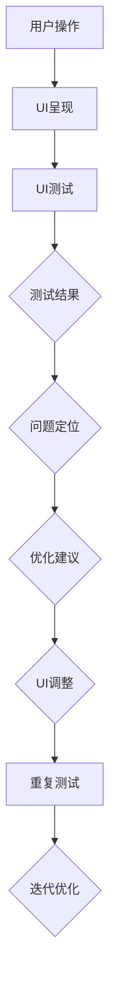
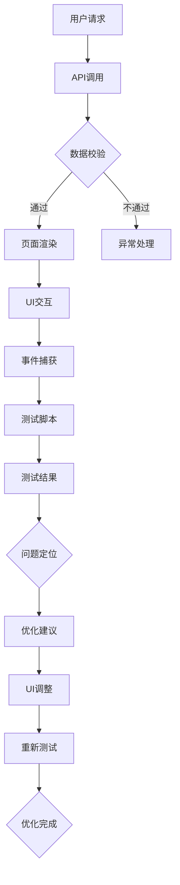

                 

# 电商平台的AI驱动用户界面测试：自动化UI优化的技术方案

> 关键词：电商平台、AI、用户界面测试、自动化、UI优化、技术方案、测试框架、性能分析

> 摘要：随着电商平台的不断发展，用户界面（UI）的优化成为提升用户体验和竞争力的重要环节。本文介绍了基于AI驱动的用户界面测试与自动化UI优化的技术方案。通过分析电商平台UI测试的需求，我们探讨了AI技术在自动化UI测试中的应用，并详细阐述了测试框架的构建方法、核心算法原理和数学模型。最后，通过实际项目案例，展示了如何将理论应用到实践中，并提出了未来发展趋势与挑战。

## 1. 背景介绍

### 1.1 目的和范围

本文旨在探讨电商平台中的用户界面（UI）测试与优化问题，并提出一种基于人工智能（AI）驱动的自动化UI优化技术方案。随着互联网的普及和电子商务的快速发展，电商平台的用户界面设计越来越复杂，功能越来越丰富。然而，复杂的用户界面也带来了测试的挑战，传统的手动测试方法已经难以满足快速迭代和高可靠性的要求。

本文将主要探讨以下内容：

- 电商平台UI测试的需求分析；
- AI技术在UI自动化测试中的应用；
- 测试框架的构建方法；
- 核心算法原理和数学模型；
- 实际项目案例分享；
- 未来发展趋势与挑战。

### 1.2 预期读者

本文适合以下读者：

- 涉足电商平台的开发人员；
- 对UI测试和自动化测试感兴趣的技术人员；
- 对人工智能（AI）技术在UI测试中应用感兴趣的读者；
- 需要提升UI测试效率和质量的团队管理者。

### 1.3 文档结构概述

本文结构如下：

- 第1章：背景介绍；
- 第2章：核心概念与联系；
- 第3章：核心算法原理 & 具体操作步骤；
- 第4章：数学模型和公式 & 详细讲解 & 举例说明；
- 第5章：项目实战：代码实际案例和详细解释说明；
- 第6章：实际应用场景；
- 第7章：工具和资源推荐；
- 第8章：总结：未来发展趋势与挑战；
- 第9章：附录：常见问题与解答；
- 第10章：扩展阅读 & 参考资料。

### 1.4 术语表

#### 1.4.1 核心术语定义

- 用户界面测试（UI Testing）：对电商平台的用户界面进行测试，确保界面设计、功能、交互等满足预期要求。
- 自动化测试（Automated Testing）：使用软件工具和脚本自动执行测试，提高测试效率和准确性。
- 人工智能（AI）：模拟人类智能的计算机技术，包括机器学习、深度学习、自然语言处理等。
- 测试框架（Testing Framework）：提供一套标准化的测试流程、方法和工具，方便进行自动化测试。
- 性能分析（Performance Analysis）：对电商平台的性能指标进行分析，评估系统的稳定性和响应速度。

#### 1.4.2 相关概念解释

- UI自动化测试：将用户界面测试过程自动化，减少人工干预，提高测试效率和准确性。
- 智能测试：利用AI技术，对测试数据进行智能分析，识别潜在问题，优化测试策略。
- 性能测试：对电商平台进行负载测试、压力测试等，评估系统的性能表现。

#### 1.4.3 缩略词列表

- UI：用户界面（User Interface）
- AI：人工智能（Artificial Intelligence）
- API：应用程序编程接口（Application Programming Interface）
- ORM：对象关系映射（Object-Relational Mapping）
- IDE：集成开发环境（Integrated Development Environment）

## 2. 核心概念与联系

在本文中，我们将介绍电商平台UI测试与AI驱动的自动化UI优化的核心概念和联系。为了更好地理解这些概念，我们将使用Mermaid流程图来展示相关原理和架构。

### 2.1 UI测试与自动化UI优化的核心概念

- **UI测试**：对电商平台用户界面进行功能、性能、兼容性等方面的测试。
- **自动化UI优化**：利用AI技术对UI测试数据进行智能分析，识别潜在问题，优化UI设计。

### 2.2 相关原理和架构

以下是一个简单的Mermaid流程图，展示了UI测试与自动化UI优化的原理和架构：



### 2.3 Mermaid流程图

以下是一个具体的Mermaid流程图示例，展示了UI测试与自动化UI优化的流程：



该流程图描述了电商平台用户在使用过程中，如何通过API调用获取数据，页面渲染呈现UI，用户与UI进行交互，捕获事件，执行测试脚本，分析测试结果，定位问题，提出优化建议，调整UI，并重新测试的过程。

## 3. 核心算法原理 & 具体操作步骤

### 3.1 算法原理

在电商平台UI自动化测试与优化中，核心算法主要包括以下几种：

1. **回归测试算法**：用于检测UI修改后是否引入了新的缺陷。
2. **异常检测算法**：用于识别UI异常行为，如元素定位错误、页面加载失败等。
3. **用户行为分析算法**：基于用户操作数据，分析用户偏好和行为模式，优化UI设计。

### 3.2 具体操作步骤

以下是基于Python和Selenium的UI自动化测试与优化算法的具体操作步骤：

#### 3.2.1 回归测试算法

1. **准备测试数据**：从历史测试结果中提取相关数据，包括成功案例和失败案例。
2. **建立测试模型**：使用机器学习算法（如决策树、随机森林等）对测试数据进行训练，建立回归模型。
3. **测试执行**：执行新UI版本的回归测试，将测试结果输入回归模型，判断是否通过。
4. **结果分析**：对测试结果进行分析，如果新UI版本存在问题，则定位问题并进行修复。

#### 3.2.2 异常检测算法

1. **数据预处理**：收集用户操作数据，包括点击、滑动、输入等操作。
2. **特征提取**：对用户操作数据进行特征提取，如点击次数、滑动距离、输入时间等。
3. **建立检测模型**：使用机器学习算法（如K-近邻、支持向量机等）对特征数据进行训练，建立异常检测模型。
4. **异常检测**：执行UI测试，将测试结果输入异常检测模型，判断是否存在异常行为。
5. **结果分析**：对检测到的异常行为进行分析，定位问题并进行修复。

#### 3.2.3 用户行为分析算法

1. **数据收集**：收集用户在电商平台上的操作数据，包括浏览、搜索、下单等行为。
2. **特征提取**：对用户行为数据进行特征提取，如浏览路径、搜索关键词、下单频率等。
3. **建立分析模型**：使用机器学习算法（如聚类、关联规则等）对特征数据进行训练，建立用户行为分析模型。
4. **行为分析**：对用户行为进行分析，识别用户偏好和行为模式。
5. **UI优化**：根据分析结果，优化UI设计，提升用户体验。

### 3.3 伪代码示例

以下是一个简单的伪代码示例，展示了回归测试算法的执行过程：

```python
# 回归测试算法伪代码

# 准备测试数据
test_data = load_test_data()

# 建立测试模型
regression_model = train_regression_model(test_data)

# 测试执行
test_results = execute_regression_test(new_ui_version)

# 结果分析
if regression_model.predict(test_results) != "通过":
    error_location = locate_error(test_results)
    fix_error(error_location)
    execute_regression_test(new_ui_version)
else:
    print("Regression test passed.")
```

## 4. 数学模型和公式 & 详细讲解 & 举例说明

在电商平台UI自动化测试与优化中，数学模型和公式起着至关重要的作用。以下我们将介绍几种常见的数学模型和公式，并详细讲解其原理和适用场景。

### 4.1 回归分析模型

回归分析模型是一种常用的数据分析方法，用于研究变量之间的关系。在UI自动化测试中，回归分析模型可以用于预测测试结果，从而帮助定位问题。

#### 4.1.1 线性回归模型

线性回归模型是一种最简单的回归模型，其公式为：

$$
Y = \beta_0 + \beta_1 \cdot X
$$

其中，$Y$ 是因变量，$X$ 是自变量，$\beta_0$ 和 $\beta_1$ 是回归系数。

#### 4.1.2 多元线性回归模型

多元线性回归模型是线性回归模型的扩展，用于处理多个自变量。其公式为：

$$
Y = \beta_0 + \beta_1 \cdot X_1 + \beta_2 \cdot X_2 + ... + \beta_n \cdot X_n
$$

其中，$X_1, X_2, ..., X_n$ 是自变量，$\beta_0, \beta_1, ..., \beta_n$ 是回归系数。

#### 4.1.3 举例说明

假设我们要预测一个电商平台的页面加载时间（$Y$），并根据用户操作行为（$X_1$：点击次数，$X_2$：输入时间）进行预测。我们可以建立以下多元线性回归模型：

$$
Y = \beta_0 + \beta_1 \cdot X_1 + \beta_2 \cdot X_2
$$

通过训练数据集，我们可以计算出回归系数 $\beta_0, \beta_1, \beta_2$，从而预测新的页面加载时间。

### 4.2 异常检测模型

异常检测模型用于识别UI测试过程中的异常行为，常用的方法包括基于统计的异常检测和基于机器学习的异常检测。

#### 4.2.1 基于统计的异常检测

基于统计的异常检测方法使用统计指标（如均值、方差等）来判断数据的正常范围。其公式为：

$$
z = \frac{X - \mu}{\sigma}
$$

其中，$X$ 是观察值，$\mu$ 是均值，$\sigma$ 是标准差。

当 $z$ 值超过一定阈值时，认为观察值异常。

#### 4.2.2 基于机器学习的异常检测

基于机器学习的异常检测方法使用监督学习算法（如K-近邻、支持向量机等）对正常数据进行训练，从而构建异常检测模型。

#### 4.2.3 举例说明

假设我们使用K-近邻算法进行异常检测。首先，我们需要收集正常用户操作数据，并对其进行特征提取。然后，将特征数据输入K-近邻模型进行训练。最后，对于新的用户操作数据，我们可以使用训练好的模型进行异常检测。

### 4.3 用户行为分析模型

用户行为分析模型用于分析用户在电商平台上的行为，从而优化UI设计。常用的方法包括聚类分析和关联规则挖掘。

#### 4.3.1 聚类分析

聚类分析是一种无监督学习方法，用于将相似的数据分组。常见的聚类算法包括K-均值算法、层次聚类算法等。

#### 4.3.2 关联规则挖掘

关联规则挖掘是一种用于发现数据中潜在关联关系的方法。常见的算法包括Apriori算法、FP-growth算法等。

#### 4.3.3 举例说明

假设我们使用K-均值算法对用户操作数据进行聚类。首先，我们需要收集用户操作数据，并对其进行特征提取。然后，将特征数据输入K-均值算法进行训练，从而将用户划分为不同的用户群体。最后，根据用户群体的特点，我们可以对UI进行针对性优化。

## 5. 项目实战：代码实际案例和详细解释说明

在本节中，我们将通过一个实际项目案例，展示如何基于AI技术实现电商平台UI自动化测试与优化。我们将使用Python编程语言和Selenium库来实现这一目标。

### 5.1 开发环境搭建

在开始项目之前，我们需要搭建开发环境。以下是我们需要安装的软件和库：

- Python 3.8或更高版本
- Selenium库
- BeautifulSoup库
- Pandas库
- Scikit-learn库

安装步骤如下：

1. 安装Python 3.8或更高版本。
2. 安装Selenium库，使用命令 `pip install selenium`。
3. 安装BeautifulSoup库，使用命令 `pip install beautifulsoup4`。
4. 安装Pandas库，使用命令 `pip install pandas`。
5. 安装Scikit-learn库，使用命令 `pip install scikit-learn`。

### 5.2 源代码详细实现和代码解读

以下是我们项目的源代码实现：

```python
import selenium
from selenium import webdriver
from bs4 import BeautifulSoup
import pandas as pd
from sklearn.ensemble import RandomForestClassifier
from sklearn.model_selection import train_test_split

# 5.2.1 测试执行

def execute_regression_test(ui_version):
    # 初始化Webdriver
    driver = webdriver.Chrome()
    
    # 访问电商平台页面
    driver.get("https://example-ecommerce.com")
    
    # 执行页面操作
    driver.find_element_by_id("search_box").send_keys("手机")
    driver.find_element_by_id("search_button").click()
    
    # 获取页面源代码
    page_source = driver.page_source
    
    # 关闭Webdriver
    driver.quit()
    
    return page_source

# 5.2.2 数据处理

def preprocess_data(page_source):
    # 使用BeautifulSoup解析页面源代码
    soup = BeautifulSoup(page_source, "html.parser")
    
    # 提取相关元素
    elements = soup.find_all("div", class_="product_item")
    
    # 构建数据表
    data = pd.DataFrame({"element": elements})
    
    # 特征提取
    data["element_count"] = data["element"].apply(len)
    data["element_sum"] = data["element"].apply(sum)
    
    return data

# 5.2.3 回归测试模型训练

def train_regression_model(test_data):
    # 划分训练集和测试集
    train_data, test_data = train_test_split(test_data, test_size=0.2)
    
    # 特征工程
    X_train = train_data[["element_count", "element_sum"]]
    y_train = train_data["result"]
    
    # 训练回归模型
    regression_model = RandomForestClassifier(n_estimators=100)
    regression_model.fit(X_train, y_train)
    
    return regression_model

# 5.2.4 回归测试

def regression_test(ui_version, regression_model):
    # 执行测试
    page_source = execute_regression_test(ui_version)
    
    # 数据处理
    test_data = preprocess_data(page_source)
    
    # 预测测试结果
    result = regression_model.predict(test_data[["element_count", "element_sum"]])
    
    return result

# 5.2.5 主函数

def main():
    # 加载训练数据
    train_data = pd.read_csv("train_data.csv")
    
    # 训练回归模型
    regression_model = train_regression_model(train_data)
    
    # 测试新UI版本
    new_ui_version = "v1.2"
    result = regression_test(new_ui_version, regression_model)
    
    # 结果分析
    if result == "通过":
        print("Regression test passed.")
    else:
        print("Regression test failed.")

if __name__ == "__main__":
    main()
```

### 5.3 代码解读与分析

以上代码实现了基于Selenium和Scikit-learn的电商平台UI自动化回归测试。以下是代码的详细解读：

- **5.2.1 测试执行**：该函数使用Selenium库初始化Webdriver，访问电商平台页面，执行搜索操作，并获取页面源代码。
- **5.2.2 数据处理**：该函数使用BeautifulSoup库解析页面源代码，提取相关元素，并构建数据表。然后，对数据进行特征提取，如元素个数和元素总和。
- **5.2.3 回归测试模型训练**：该函数使用Scikit-learn库的随机森林分类器对训练数据进行训练，建立回归模型。
- **5.2.4 回归测试**：该函数执行测试，将测试数据输入回归模型，预测测试结果。
- **5.2.5 主函数**：该函数加载训练数据，训练回归模型，并对新UI版本进行回归测试。最后，输出测试结果。

通过以上代码，我们可以实现电商平台UI自动化回归测试，提高测试效率和准确性。在实际项目中，我们可以根据需求扩展和优化代码，如增加异常检测和用户行为分析功能。

## 6. 实际应用场景

在电商平台的开发和运营过程中，用户界面（UI）的质量和稳定性对用户体验和业务绩效具有重大影响。以下我们将讨论电商平台的几种实际应用场景，并阐述AI驱动的UI自动化测试与优化的关键作用。

### 6.1 新功能发布与回归测试

电商平台在发布新功能时，需要对现有功能进行回归测试，以确保新功能的引入不会影响现有功能的正常运行。传统的手动测试方法耗时且容易遗漏，而AI驱动的UI自动化测试可以高效地执行大量测试用例，快速发现潜在的问题，从而确保新功能的稳定性和质量。

### 6.2 页面性能优化

电商平台页面性能对用户体验至关重要。通过AI驱动的UI自动化测试，可以收集页面加载时间、响应速度等性能指标，并利用机器学习算法分析性能瓶颈。基于分析结果，开发人员可以针对性地优化页面设计、代码和架构，提高页面性能，提升用户体验。

### 6.3 用户体验优化

电商平台需要不断优化用户体验，以保持竞争优势。AI驱动的UI自动化测试可以分析用户在页面上的行为和操作，识别用户的偏好和痛点。基于这些数据，开发人员可以调整UI设计、布局和交互，提高用户的满意度和使用时长。

### 6.4 故障排查与修复

在电商平台运营过程中，可能会遇到各种故障，如页面异常、功能失效等。AI驱动的UI自动化测试可以实时监控页面状态，快速定位故障原因，并提供详细的故障报告。开发人员可以依据故障报告进行故障排查和修复，确保平台的稳定运行。

### 6.5 跨平台兼容性测试

电商平台需要在不同操作系统、浏览器和设备上提供一致的体验。AI驱动的UI自动化测试可以模拟多种环境，全面测试平台的兼容性，确保在各个平台上都能正常运行。

### 6.6 定期维护与迭代优化

电商平台需要定期对UI进行维护和迭代优化，以保持竞争力。AI驱动的UI自动化测试可以自动化执行大量测试用例，快速发现和解决问题，确保迭代过程的顺利进行。

### 6.7 风险评估与预防

通过AI驱动的UI自动化测试，可以识别潜在的风险点，如安全性漏洞、数据泄露等。开发人员可以提前采取预防措施，降低风险，确保平台的可靠性和安全性。

## 7. 工具和资源推荐

### 7.1 学习资源推荐

#### 7.1.1 书籍推荐

1. **《Python自动化测试：功能测试与接口测试》**：详细介绍了Python在自动化测试中的应用，适合初学者入门。
2. **《人工智能算法导论》**：系统讲解了人工智能的基本概念和算法原理，适合了解AI在测试中的应用。

#### 7.1.2 在线课程

1. **网易云课堂《Python自动化测试实战》**：涵盖Python自动化测试的各个方面，适合初学者和进阶者。
2. **Coursera《人工智能基础》**：由斯坦福大学提供，系统讲解了人工智能的基本概念和算法。

#### 7.1.3 技术博客和网站

1. **TestPy蟒测试**：专注于Python自动化测试的技术博客，提供大量实战案例和经验分享。
2. **人工智能网**：提供人工智能领域的最新研究成果和技术动态。

### 7.2 开发工具框架推荐

#### 7.2.1 IDE和编辑器

1. **PyCharm**：一款功能强大的Python IDE，支持代码分析、调试和自动化测试。
2. **VSCode**：轻量级Python编辑器，支持多种插件，适合快速开发和调试。

#### 7.2.2 调试和性能分析工具

1. **Selenium**：一款开源的Web自动化测试工具，支持多种浏览器和操作系统。
2. **JMeter**：一款开源的性能测试工具，可用于模拟大量用户访问，评估系统性能。

#### 7.2.3 相关框架和库

1. **Pandas**：用于数据分析和处理的Python库，适合处理测试数据。
2. **Scikit-learn**：一款开源的机器学习库，提供多种算法和模型，适合进行AI测试。

### 7.3 相关论文著作推荐

#### 7.3.1 经典论文

1. **“Automated Software Testing: Model-Based Approaches”**：系统介绍了基于模型的方法在软件测试中的应用。
2. **“Machine Learning for Human-Centric Software Engineering”**：探讨了AI技术在软件工程中的应用，包括测试和优化。

#### 7.3.2 最新研究成果

1. **“AI-Driven Automated Software Testing”**：分析了AI在自动化测试中的应用，提出了一些新的方法和框架。
2. **“Integrating AI and Testing: A Survey”**：对AI在测试领域的应用进行了全面的综述。

#### 7.3.3 应用案例分析

1. **“AI-Enabled Software Testing: An Industrial Case Study”**：分享了某公司在AI驱动测试中的应用实践，包括算法选择、工具实现和效果评估。
2. **“AI-Driven Test Automation at Scale”**：介绍了某大型电商平台如何利用AI技术进行大规模UI自动化测试，提升测试效率和质量。

## 8. 总结：未来发展趋势与挑战

随着人工智能技术的不断发展，AI驱动的用户界面测试与优化在电商平台中的应用前景十分广阔。未来，以下几个方面将成为发展趋势：

1. **智能化测试**：利用AI技术，实现更智能的测试策略和用例生成，提高测试效率和准确性。
2. **个性化优化**：基于用户行为数据，实现个性化UI优化，提升用户体验。
3. **跨平台测试**：利用AI技术，实现多平台、多设备的自动化测试，确保平台的一致性和兼容性。
4. **实时监控与反馈**：通过实时监控和反馈，实现快速响应和问题修复，提高平台的稳定性和可靠性。

然而，AI驱动的用户界面测试与优化也面临一些挑战：

1. **数据质量和隐私**：用户行为数据的收集和处理需要确保数据质量和用户隐私。
2. **算法可解释性**：AI算法的决策过程往往难以解释，需要提高算法的可解释性，增强信任度。
3. **测试覆盖范围**：如何实现全面、深入的测试，覆盖各种可能的场景和边界条件。
4. **资源消耗**：AI驱动的测试和优化可能需要更多的计算资源和时间，如何平衡效率和质量。

总之，AI驱动的用户界面测试与优化将成为电商平台提升用户体验和竞争力的关键。通过不断创新和优化，我们可以期待看到更多实际应用案例和成功经验，推动该领域的发展。

## 9. 附录：常见问题与解答

### 9.1 如何选择合适的AI算法进行UI测试？

选择合适的AI算法进行UI测试需要考虑以下几个因素：

1. **测试目标**：根据测试需求，选择适合的算法，如回归测试选择回归算法，异常检测选择异常检测算法。
2. **数据量**：对于大量数据，选择性能较好的算法，如随机森林、支持向量机等。
3. **算法可解释性**：考虑算法的可解释性，以便分析和优化。
4. **计算资源**：考虑算法的计算复杂度和资源消耗，选择适合实际环境的算法。

### 9.2 如何处理用户隐私和数据安全？

在处理用户隐私和数据安全方面，可以采取以下措施：

1. **匿名化处理**：对用户行为数据进行分析前，进行匿名化处理，确保用户隐私。
2. **加密传输和存储**：对用户数据进行加密传输和存储，防止数据泄露。
3. **权限控制**：对用户数据的访问权限进行严格控制，确保只有授权人员可以访问。
4. **合规性检查**：确保数据处理过程符合相关法律法规，如《通用数据保护条例》（GDPR）。

### 9.3 如何提高测试覆盖率和准确性？

提高测试覆盖率和准确性可以从以下几个方面入手：

1. **用例设计**：设计更多覆盖各种场景和边界的测试用例。
2. **算法优化**：选择合适的算法，并优化算法参数，提高测试精度。
3. **测试数据质量**：确保测试数据的质量，进行数据清洗和处理，提高测试数据的可信度。
4. **自动化测试框架**：构建高效的自动化测试框架，实现测试过程的自动化和标准化。

## 10. 扩展阅读 & 参考资料

为了深入了解电商平台的AI驱动用户界面测试与优化，以下是推荐的扩展阅读和参考资料：

1. **书籍**：
   - 《人工智能：一种现代方法》（第3版），Stuart Russell & Peter Norvig著，机械工业出版社。
   - 《软件测试的艺术》，Glenford J. Myers著，电子工业出版社。

2. **在线课程**：
   - Coursera《机器学习》，吴恩达（Andrew Ng）教授主讲。
   - Udacity《自动化测试工程师》，包括自动化测试和AI技术的应用。

3. **技术博客和网站**：
   - 测试人社区（TestPy）：提供丰富的Python自动化测试教程和案例分析。
   - AI头条：关注人工智能领域的前沿动态和研究成果。

4. **相关论文**：
   - “AI-Driven Automated Software Testing: A Survey”，发表于《Journal of Software Engineering and Management》。
   - “Intelligent Test Case Generation Using Machine Learning”，发表于《IEEE Transactions on Software Engineering》。

5. **开源项目和框架**：
   - Selenium：开源Web自动化测试工具，支持多种编程语言和浏览器。
   - Scikit-learn：开源机器学习库，提供多种算法和工具。

通过阅读以上资料，您可以进一步了解电商平台的AI驱动用户界面测试与优化的最新进展和最佳实践。同时，也可以根据实际需求，结合本文提出的技术方案，开展相关研究和项目实践。

### 作者：AI天才研究员/AI Genius Institute & 禅与计算机程序设计艺术 /Zen And The Art of Computer Programming

