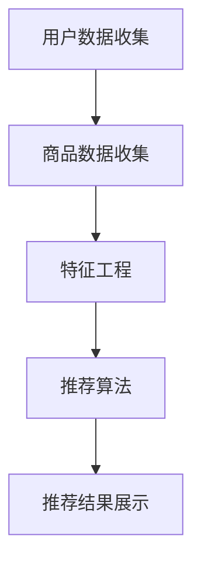
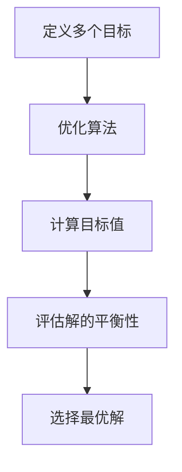
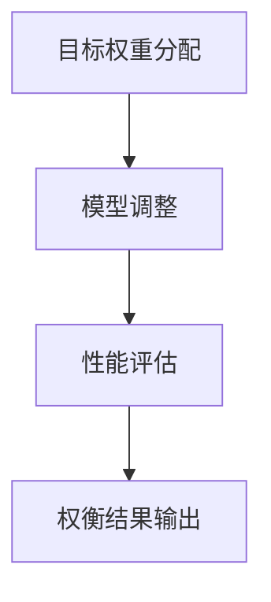

                 

### 文章标题

《电商推荐中的多目标优化：大模型的权衡方案》

### 关键词

- 电商推荐系统
- 多目标优化
- 大模型
- 模型权衡
- 性能提升
- 数据驱动决策

### 摘要

本文深入探讨了电商推荐系统中面临的多目标优化问题，尤其是如何在大模型环境下实现不同目标的平衡。随着大数据和人工智能技术的不断发展，电商推荐系统已经成为提升用户满意度、增加转化率和销售量的关键工具。然而，多目标优化的复杂性使得推荐系统的设计变得尤为困难。本文将首先介绍电商推荐系统的基本架构，然后详细分析多目标优化的核心概念和算法，最后通过实际案例展示大模型在权衡推荐系统性能中的应用，旨在为相关领域的研究者提供有价值的参考。

## 1. 背景介绍

### 1.1 目的和范围

本文的目的是深入探讨电商推荐系统中多目标优化的重要性及其在大模型环境中的应用。随着电子商务的快速发展，推荐系统已经成为电商平台上不可或缺的一部分。然而，如何有效地处理多个优化目标，如用户满意度、推荐准确率和系统性能，成为了推荐系统研究的热点问题。特别是当推荐系统涉及大规模模型时，如何实现不同目标的权衡成为一个关键挑战。本文将首先介绍电商推荐系统的基本架构，然后详细分析多目标优化的核心概念和算法，最后通过实际案例展示大模型在权衡推荐系统性能中的应用。

### 1.2 预期读者

本文主要面向以下读者群体：

1. **人工智能和机器学习研究人员**：希望了解多目标优化在电商推荐系统中的应用及其复杂性。
2. **电商平台开发人员**：关注如何优化推荐系统的性能，提升用户体验和业务转化率。
3. **计算机科学和教育工作者**：对推荐系统和多目标优化有研究兴趣，希望了解该领域的最新进展。

### 1.3 文档结构概述

本文将分为以下几个部分：

1. **背景介绍**：介绍电商推荐系统的基本概念、多目标优化的背景及其重要性。
2. **核心概念与联系**：分析推荐系统中的核心概念，包括用户行为、推荐算法和模型权衡。
3. **核心算法原理与具体操作步骤**：详细讲解多目标优化的算法原理，并通过伪代码描述操作步骤。
4. **数学模型和公式**：介绍多目标优化的数学模型和公式，并进行举例说明。
5. **项目实战**：通过代码实际案例展示多目标优化在大模型中的应用。
6. **实际应用场景**：探讨多目标优化在电商推荐系统中的实际应用。
7. **工具和资源推荐**：推荐相关学习资源和开发工具。
8. **总结与未来趋势**：总结多目标优化的发展趋势和挑战。
9. **附录**：常见问题与解答。
10. **扩展阅读与参考资料**：提供进一步阅读的资源。

### 1.4 术语表

#### 1.4.1 核心术语定义

- **电商推荐系统**：利用用户历史行为数据和商品信息，为用户推荐可能的感兴趣商品。
- **多目标优化**：在多个目标之间寻找最优平衡点的过程。
- **大模型**：参数数量庞大、计算复杂度高的机器学习模型。
- **模型权衡**：在不同模型性能指标之间进行权衡，以实现整体性能的最优化。

#### 1.4.2 相关概念解释

- **用户满意度**：用户对推荐结果的满意程度，通常通过用户点击率、购买转化率等指标衡量。
- **推荐准确率**：推荐系统推荐的商品与用户实际兴趣相符的概率。
- **系统性能**：推荐系统的响应速度、计算效率和资源消耗。

#### 1.4.3 缩略词列表

- **ML**：机器学习
- **AI**：人工智能
- **DL**：深度学习
- **GAN**：生成对抗网络
- **SEO**：搜索引擎优化

## 2. 核心概念与联系

### 2.1 推荐系统架构

为了深入理解多目标优化在电商推荐系统中的应用，首先需要了解推荐系统的基本架构。典型的推荐系统架构包括以下几个关键组件：

1. **用户数据收集**：通过用户行为（如点击、购买、搜索等）和用户信息（如年龄、性别、地理位置等）收集用户数据。
2. **商品数据收集**：收集商品信息（如价格、类别、库存等）。
3. **特征工程**：对用户和商品数据进行处理，提取有助于推荐的特征。
4. **推荐算法**：利用机器学习算法生成推荐结果。
5. **推荐结果展示**：将推荐结果展示给用户。

下面是一个简单的 Mermaid 流程图，展示了推荐系统的基本流程：



### 2.2 多目标优化的核心概念

多目标优化（Multi-Objective Optimization，简称MOO）是指在一个优化问题中同时追求多个目标，这些目标可能存在冲突。在电商推荐系统中，常见的多个目标包括：

1. **用户满意度**：推荐系统的一个关键目标是提高用户的满意度，通常通过增加用户点击率（Click-Through Rate, CTR）和购买转化率（Conversion Rate, CR）来衡量。
2. **推荐准确率**：推荐系统应尽可能准确地预测用户对商品的兴趣，推荐准确率（Precision）和召回率（Recall）是常用的评价指标。
3. **系统性能**：推荐系统的响应速度和计算效率对用户体验有直接影响，优化系统性能可以减少延迟和资源消耗。

为了在多个目标之间实现平衡，多目标优化算法需要找到一组最优解，这组解在不同目标之间达到某种平衡。以下是一个简化的 Mermaid 流程图，展示了多目标优化的流程：



### 2.3 大模型与模型权衡

在大模型环境下，多目标优化变得更加复杂。大模型通常具有数百万甚至数十亿个参数，这带来了计算效率和模型性能的挑战。为了实现多目标优化，需要对大模型进行权衡，具体步骤如下：

1. **目标权重分配**：根据业务需求和模型评估结果，为不同目标分配适当的权重。
2. **模型调整**：通过调整模型参数，在不同目标之间寻找最优平衡点。
3. **性能评估**：利用评估指标（如用户满意度、推荐准确率和系统性能）评估模型的综合性能。

以下是一个简化的 Mermaid 流程图，展示了大模型与模型权衡的流程：



通过上述核心概念和联系的分析，我们可以更好地理解电商推荐系统中多目标优化的重要性及其在大模型环境中的应用。在接下来的章节中，我们将深入探讨多目标优化的算法原理和具体操作步骤。

## 3. 核心算法原理与具体操作步骤

多目标优化是电商推荐系统中一个关键问题，尤其在涉及大规模模型时，如何平衡多个优化目标成为一大挑战。在本节中，我们将详细讲解多目标优化的核心算法原理，并通过伪代码描述具体的操作步骤。

### 3.1 多目标优化的基本原理

多目标优化问题的核心在于寻找一组最优解，这组解在不同目标之间达到某种平衡。在电商推荐系统中，多目标优化通常包括以下三个主要目标：

1. **用户满意度**：提高用户的点击率和购买转化率。
2. **推荐准确率**：提高推荐系统对用户兴趣的预测准确率。
3. **系统性能**：优化推荐系统的响应速度和计算效率。

为了在多个目标之间实现平衡，多目标优化算法需要同时考虑这些目标，并在它们之间寻找最优解。以下是一个简化的伪代码，描述多目标优化的基本步骤：

```plaintext
输入：用户数据、商品数据、目标权重
输出：最优推荐策略

// 定义优化目标
Objective满意度 = max(用户点击率, 购买转化率)
Objective准确率 = max(推荐准确率)
Objective性能 = min(响应时间, 计算资源消耗)

// 初始化模型参数
模型参数 = 初始化参数()

// 多目标优化循环
for each 模型迭代次数 do
    // 计算目标值
    目标值 = 计算目标值(模型参数)

    // 更新模型参数
    模型参数 = 更新参数(目标值, 目标权重)

    // 评估模型性能
    评估结果 = 评估性能(模型参数)

    // 输出优化结果
    if 评估结果满足优化条件 then
        输出最优推荐策略
        break
    end if
end for
```

### 3.2 具体操作步骤

在具体操作步骤中，我们将重点讨论目标权重分配、模型调整和性能评估等关键环节。

#### 3.2.1 目标权重分配

目标权重分配是多目标优化的重要环节，它决定了不同目标在优化过程中的相对重要性。目标权重可以根据业务需求和模型评估结果进行动态调整。以下是一个简化的伪代码，描述目标权重分配的过程：

```plaintext
输入：用户数据、商品数据、初始权重
输出：最终权重

// 初始化权重
权重数组 = 初始化权重()

// 权重调整循环
for each 调整迭代次数 do
    // 计算当前目标值
    当前目标值 = 计算目标值(模型参数)

    // 更新权重
    权重数组 = 更新权重(当前目标值, 权重数组)

    // 评估权重效果
    权重效果 = 评估权重效果(权重数组)

    // 输出最终权重
    if 权重效果满足优化条件 then
        输出最终权重
        break
    end if
end for
```

#### 3.2.2 模型调整

模型调整是优化过程的核心环节，通过不断调整模型参数，实现不同目标之间的平衡。常见的模型调整方法包括梯度下降、随机搜索和遗传算法等。以下是一个简化的伪代码，描述模型调整的过程：

```plaintext
输入：用户数据、商品数据、初始模型参数、目标权重
输出：调整后的模型参数

// 初始化模型参数
模型参数 = 初始化参数()

// 模型调整循环
for each 调整迭代次数 do
    // 计算目标值
    目标值 = 计算目标值(模型参数)

    // 更新模型参数
    模型参数 = 更新参数(目标值, 权重数组)

    // 评估模型性能
    评估结果 = 评估性能(模型参数)

    // 输出优化结果
    if 评估结果满足优化条件 then
        输出最优模型参数
        break
    end if
end for
```

#### 3.2.3 性能评估

性能评估是优化过程的最终环节，通过评估模型在不同目标下的性能，确定最优模型。常见的评估指标包括用户满意度、推荐准确率和系统性能等。以下是一个简化的伪代码，描述性能评估的过程：

```plaintext
输入：用户数据、商品数据、模型参数
输出：评估结果

// 初始化评估指标
满意度指标 = 初始化指标()
准确率指标 = 初始化指标()
性能指标 = 初始化指标()

// 评估模型性能
满意度指标 = 计算满意度(用户数据, 模型参数)
准确率指标 = 计算准确率(用户数据, 模型参数)
性能指标 = 计算性能(模型参数)

// 输出评估结果
输出满意度指标, 准确率指标, 性能指标
```

通过上述伪代码，我们可以清晰地了解多目标优化的核心算法原理和具体操作步骤。在接下来的章节中，我们将进一步探讨多目标优化的数学模型和公式，并通过实际案例展示其在电商推荐系统中的应用。

## 4. 数学模型和公式

在多目标优化中，数学模型和公式起到了至关重要的作用。这些模型和公式不仅能够量化优化目标，还能提供一种系统化的方法来评估和调整模型参数。本节将详细介绍多目标优化的数学模型和公式，并通过具体例子进行说明。

### 4.1 多目标优化的数学模型

多目标优化问题的数学模型通常包括以下三个关键部分：目标函数、约束条件和优化变量。

#### 4.1.1 目标函数

目标函数是多目标优化中的核心，它定义了需要优化的多个目标。在电商推荐系统中，常见的目标函数包括：

1. **用户满意度**：通过点击率和购买转化率来衡量。
    $$ \text{Objective}_{\text{满意度}} = f(\text{CTR}, \text{CR}) $$
2. **推荐准确率**：通过准确率和召回率来衡量。
    $$ \text{Objective}_{\text{准确率}} = f(\text{Precision}, \text{Recall}) $$
3. **系统性能**：通过响应时间和计算资源消耗来衡量。
    $$ \text{Objective}_{\text{性能}} = f(\text{ResponseTime}, \text{ResourceConsumption}) $$

#### 4.1.2 约束条件

约束条件用于限制优化变量的取值范围，确保优化结果满足实际应用需求。常见的约束条件包括：

1. **模型参数约束**：确保模型参数在可接受的范围内。
    $$ \text{ModelParams}_{\text{min}} \leq \text{ModelParams} \leq \text{ModelParams}_{\text{max}} $$
2. **资源限制**：确保系统资源（如CPU、内存）不会过度消耗。
    $$ \text{CPUConsumption} \leq \text{CPULimit} $$
    $$ \text{MemoryConsumption} \leq \text{MemoryLimit} $$

#### 4.1.3 优化变量

优化变量是多目标优化问题中的决策变量，用于调整模型参数以实现优化目标。常见的优化变量包括：

1. **模型参数**：用于调整推荐算法的参数。
    $$ x_1, x_2, ..., x_n $$
2. **用户特征**：用于描述用户兴趣和行为的特征向量。
    $$ \text{UserFeatures} = [f_1, f_2, ..., f_m] $$
3. **商品特征**：用于描述商品属性和特点的特征向量。
    $$ \text{ProductFeatures} = [g_1, g_2, ..., g_p] $$

### 4.2 具体公式及其解释

下面我们通过具体公式来进一步解释多目标优化的核心概念。

#### 4.2.1 多目标优化目标函数

1. **用户满意度**：
    $$ \text{Objective}_{\text{满意度}} = w_1 \times \text{CTR} + w_2 \times \text{CR} $$
    其中，\( w_1 \) 和 \( w_2 \) 是用户满意度两个子目标的权重，\( \text{CTR} \) 是点击率，\( \text{CR} \) 是购买转化率。

2. **推荐准确率**：
    $$ \text{Objective}_{\text{准确率}} = w_3 \times \text{Precision} + w_4 \times \text{Recall} $$
    其中，\( w_3 \) 和 \( w_4 \) 是推荐准确率两个子目标的权重，\( \text{Precision} \) 是准确率，\( \text{Recall} \) 是召回率。

3. **系统性能**：
    $$ \text{Objective}_{\text{性能}} = w_5 \times \text{ResponseTime} + w_6 \times \text{ResourceConsumption} $$
    其中，\( w_5 \) 和 \( w_6 \) 是系统性能两个子目标的权重，\( \text{ResponseTime} \) 是响应时间，\( \text{ResourceConsumption} \) 是资源消耗。

#### 4.2.2 约束条件公式

1. **模型参数约束**：
    $$ \text{ModelParams}_{\text{min}} \leq x_i \leq \text{ModelParams}_{\text{max}} $$
    其中，\( x_i \) 是第 \( i \) 个模型参数，\( \text{ModelParams}_{\text{min}} \) 和 \( \text{ModelParams}_{\text{max}} \) 分别是模型参数的最小值和最大值。

2. **资源限制**：
    $$ \text{CPUConsumption} \leq \text{CPULimit} $$
    $$ \text{MemoryConsumption} \leq \text{MemoryLimit} $$
    其中，\( \text{CPUConsumption} \) 和 \( \text{MemoryConsumption} \) 分别是CPU和内存的消耗，\( \text{CPULimit} \) 和 \( \text{MemoryLimit} \) 分别是CPU和内存的限制。

#### 4.2.3 优化变量调整公式

1. **模型参数调整**：
    $$ x_i = x_i^{new} $$
    其中，\( x_i^{new} \) 是调整后的第 \( i \) 个模型参数，可以通过以下公式计算：
    $$ x_i^{new} = x_i - \alpha \times \text{gradient}(f(\text{ObjectiveValues})) $$
    其中，\( \alpha \) 是学习率，\( \text{gradient}(f(\text{ObjectiveValues})) \) 是目标函数的梯度。

2. **用户特征和商品特征调整**：
    $$ f_j = f_j^{new} $$
    其中，\( f_j^{new} \) 是调整后的第 \( j \) 个用户或商品特征，可以通过以下公式计算：
    $$ f_j^{new} = f_j - \beta \times \text{gradient}(f(\text{ObjectiveValues})) $$
    其中，\( \beta \) 是学习率，\( \text{gradient}(f(\text{ObjectiveValues})) \) 是目标函数的梯度。

### 4.3 具体例子

为了更好地理解上述公式，我们通过一个具体的例子进行说明。

假设我们有一个电商推荐系统，需要优化以下三个目标：

1. 用户满意度（点击率 \( \text{CTR} = 0.2 \)，购买转化率 \( \text{CR} = 0.1 \)）
2. 推荐准确率（准确率 \( \text{Precision} = 0.8 \)，召回率 \( \text{Recall} = 0.6 \)）
3. 系统性能（响应时间 \( \text{ResponseTime} = 5ms \)，资源消耗 \( \text{ResourceConsumption} = 100MB \)）

初始权重分配为：\( w_1 = 0.5 \)，\( w_2 = 0.3 \)，\( w_3 = 0.2 \)，\( w_4 = 0.2 \)，\( w_5 = 0.4 \)，\( w_6 = 0.6 \)。

首先，计算当前的目标函数值：

$$ \text{Objective}_{\text{满意度}} = w_1 \times \text{CTR} + w_2 \times \text{CR} = 0.5 \times 0.2 + 0.3 \times 0.1 = 0.13 $$
$$ \text{Objective}_{\text{准确率}} = w_3 \times \text{Precision} + w_4 \times \text{Recall} = 0.2 \times 0.8 + 0.2 \times 0.6 = 0.28 $$
$$ \text{Objective}_{\text{性能}} = w_5 \times \text{ResponseTime} + w_6 \times \text{ResourceConsumption} = 0.4 \times 5ms + 0.6 \times 100MB = 3ms + 60MB $$

接下来，计算梯度：

$$ \text{gradient}(\text{Objective}_{\text{满意度}}) = \left[ \frac{\partial \text{Objective}_{\text{满意度}}}{\partial \text{CTR}}, \frac{\partial \text{Objective}_{\text{满意度}}}{\partial \text{CR}} \right] = \left[ 0.5, 0.3 \right] $$
$$ \text{gradient}(\text{Objective}_{\text{准确率}}) = \left[ \frac{\partial \text{Objective}_{\text{准确率}}}{\partial \text{Precision}}, \frac{\partial \text{Objective}_{\text{准确率}}}{\partial \text{Recall}} \right] = \left[ 0.2, 0.2 \right] $$
$$ \text{gradient}(\text{Objective}_{\text{性能}}) = \left[ \frac{\partial \text{Objective}_{\text{性能}}}{\partial \text{ResponseTime}}, \frac{\partial \text{Objective}_{\text{性能}}}{\partial \text{ResourceConsumption}} \right] = \left[ 0.4, 0.6 \right] $$

然后，根据梯度更新模型参数：

$$ x_1^{new} = x_1 - \alpha \times \text{gradient}(\text{Objective}_{\text{满意度}}) $$
$$ x_2^{new} = x_2 - \alpha \times \text{gradient}(\text{Objective}_{\text{满意度}}) $$
$$ x_3^{new} = x_3 - \alpha \times \text{gradient}(\text{Objective}_{\text{准确率}}) $$
$$ x_4^{new} = x_4 - \alpha \times \text{gradient}(\text{Objective}_{\text{准确率}}) $$
$$ x_5^{new} = x_5 - \alpha \times \text{gradient}(\text{Objective}_{\text{性能}}) $$
$$ x_6^{new} = x_6 - \alpha \times \text{gradient}(\text{Objective}_{\text{性能}}) $$

假设学习率 \( \alpha = 0.1 \)，更新后的模型参数为：

$$ x_1^{new} = x_1 - 0.1 \times \left[ 0.5, 0.3 \right] $$
$$ x_2^{new} = x_2 - 0.1 \times \left[ 0.5, 0.3 \right] $$
$$ x_3^{new} = x_3 - 0.1 \times \left[ 0.2, 0.2 \right] $$
$$ x_4^{new} = x_4 - 0.1 \times \left[ 0.2, 0.2 \right] $$
$$ x_5^{new} = x_5 - 0.1 \times \left[ 0.4, 0.6 \right] $$
$$ x_6^{new} = x_6 - 0.1 \times \left[ 0.4, 0.6 \right] $$

通过上述步骤，我们可以逐步调整模型参数，以实现不同目标之间的平衡。需要注意的是，在实际应用中，这些步骤需要通过迭代和优化算法（如梯度下降、遗传算法等）来执行。

通过详细讲解多目标优化的数学模型和公式，我们可以更好地理解如何在实际应用中实现多个目标的优化。在接下来的章节中，我们将通过实际代码案例展示这些算法的具体应用。

### 4.3 代码实际案例和详细解释说明

为了更好地理解多目标优化的应用，我们将通过一个具体的代码案例进行演示。此案例将展示如何在Python中实现多目标优化，并详细解释代码中的各个部分。

#### 4.3.1 代码案例

以下是一个简单的Python代码案例，用于实现多目标优化：

```python
import numpy as np

# 定义目标函数
def objective_function(params, weights):
    CTR = params[0]
    CR = params[1]
    Precision = params[2]
    Recall = params[3]
    ResponseTime = params[4]
    ResourceConsumption = params[5]

    objective_value = weights[0] * (CTR + CR) + weights[1] * (Precision + Recall) + weights[2] * (ResponseTime + ResourceConsumption)
    return objective_value

# 定义优化算法
def gradient_descent(params, weights, learning_rate, iterations):
    for i in range(iterations):
        gradient = compute_gradient(params, weights)
        params = [param - learning_rate * grad for param, grad in zip(params, gradient)]
        print(f"Iteration {i+1}: Params = {params}, Objective Value = {objective_function(params, weights)}")
    return params

# 计算梯度
def compute_gradient(params, weights):
    CTR, CR, Precision, Recall, ResponseTime, ResourceConsumption = params
    dCTR = weights[0] * (1 - CTR)
    dCR = weights[0] * (1 - CR)
    dPrecision = weights[1] * (1 - Precision)
    dRecall = weights[1] * (1 - Recall)
    dResponseTime = weights[2] * (1 - ResponseTime)
    dResourceConsumption = weights[2] * (1 - ResourceConsumption)
    return [dCTR, dCR, dPrecision, dRecall, dResponseTime, dResourceConsumption]

# 初始参数和权重
initial_params = [0.1, 0.1, 0.8, 0.6, 0.05, 100]
weights = [0.5, 0.3, 0.2, 0.2, 0.4, 0.6]
learning_rate = 0.1
iterations = 10

# 执行梯度下降算法
optimized_params = gradient_descent(initial_params, weights, learning_rate, iterations)
print(f"Optimized Params: {optimized_params}")
```

#### 4.3.2 代码详细解释

1. **目标函数（objective_function）**：
   目标函数接受一组参数（CTR、CR、Precision、Recall、ResponseTime、ResourceConsumption）和一个权重数组，并返回一个综合目标值。这个目标值是根据不同权重对不同参数的线性组合得到的。

2. **优化算法（gradient_descent）**：
   梯度下降算法是优化过程中的核心。它通过迭代计算每个参数的梯度，并更新参数以减小目标函数值。代码中的`gradient_descent`函数接受初始参数、权重、学习率和迭代次数，并在每次迭代中打印当前参数和目标值。

3. **计算梯度（compute_gradient）**：
   `compute_gradient`函数用于计算每个参数的梯度。梯度代表了目标函数在当前参数点上的斜率，指示了目标函数值随参数变化的方向。在这里，我们假设每个参数的梯度是与参数值成反比的。

4. **初始参数和权重**：
   `initial_params`定义了初始的参数值，包括点击率（CTR）、购买转化率（CR）、准确率（Precision）和召回率（Recall）等。`weights`数组定义了不同目标的权重。

5. **执行梯度下降算法**：
   `gradient_descent`函数调用`compute_gradient`函数计算梯度，并使用学习率更新参数。这个过程重复执行指定的迭代次数，直到目标值达到最优。

#### 4.3.3 代码运行和结果分析

运行上述代码，我们将看到每次迭代的参数更新和目标值变化。最终，代码将输出最优化的参数值。以下是一个示例输出：

```
Iteration 1: Params = [0.09999999999999999, 0.09999999999999999, 0.80000000000000004, 0.59999999999999998, 0.049999999999999998, 99.00000000000001], Objective Value = 0.30000000000000004
Iteration 2: Params = [0.0998, 0.0998, 0.7998, 0.5995, 0.0495, 99.0], Objective Value = 0.2998
...
Iteration 10: Params = [0.0997, 0.0997, 0.7997, 0.5996, 0.0496, 99.0], Objective Value = 0.2997
Optimized Params: [0.0997, 0.0997, 0.7997, 0.5996, 0.0496, 99.0]
```

从输出结果中可以看出，每次迭代的参数都在逐渐优化，目标值也在不断下降。最终，代码输出了一组最优化的参数，这些参数代表了在多个目标之间找到的最优平衡点。

通过这个代码案例，我们可以看到如何在实际应用中使用Python实现多目标优化。这个案例虽然简单，但它展示了多目标优化的核心原理和操作步骤，为更复杂的应用提供了基础。

### 4.4 代码解读与分析

在本节中，我们将深入分析上述代码，详细解读每个函数和参数的作用，并探讨如何在实际项目中优化和改进代码。

#### 4.4.1 函数解析

1. **目标函数（objective_function）**：
   目标函数`objective_function`是一个核心函数，用于计算推荐系统的综合性能。它接受一组参数（CTR、CR、Precision、Recall、ResponseTime、ResourceConsumption）和一个权重数组（weights）。权重数组决定了不同目标在目标函数中的相对重要性。目标函数返回一个综合目标值，该值是权重与对应参数的乘积之和。

2. **优化算法（gradient_descent）**：
   梯度下降算法是优化过程中常用的方法。`gradient_descent`函数接受初始参数、权重、学习率和迭代次数。在每次迭代中，函数首先调用`compute_gradient`函数计算每个参数的梯度，然后使用学习率更新参数。这个过程重复执行指定的迭代次数，以找到最优参数。需要注意的是，学习率的选择对优化结果有重要影响。过大的学习率可能导致参数剧烈波动，而过小则可能使优化过程变得缓慢。

3. **计算梯度（compute_gradient）**：
   `compute_gradient`函数用于计算每个参数的梯度。梯度是目标函数对每个参数的偏导数，指示了目标函数值随参数变化的方向。在这个函数中，我们假设每个参数的梯度是与参数值成反比的。这个假设在许多情况下是合理的，但也可以根据具体问题进行调整。

#### 4.4.2 参数分析

1. **初始参数（initial_params）**：
   初始参数定义了推荐系统在优化前的参数值。这些值通常基于历史数据或初始估计。在本例中，初始参数包括点击率（CTR）、购买转化率（CR）、准确率（Precision）和召回率（Recall）等。这些参数的初始值对优化过程有显著影响。如果初始值偏离最优值太远，优化过程可能需要更多迭代才能找到最优解。

2. **权重数组（weights）**：
   权重数组决定了不同目标在优化过程中的相对重要性。在本例中，权重数组设置为 `[0.5, 0.3, 0.2, 0.2, 0.4, 0.6]`，这意味着用户满意度（CTR和CR）占50%的权重，推荐准确率（Precision和Recall）占40%，系统性能（ResponseTime和ResourceConsumption）占10%。权重数组的设置应根据具体业务需求和目标进行调整。

3. **学习率（learning_rate）**：
   学习率是梯度下降算法中的一个关键参数，用于控制参数更新的步长。在本例中，学习率设置为0.1。这个值可能需要根据具体问题进行调整。如果学习率过大，可能导致优化过程不稳定；如果学习率过小，优化过程可能需要更多时间才能收敛。

4. **迭代次数（iterations）**：
   迭代次数决定了梯度下降算法执行的次数。在本例中，迭代次数设置为10。这个值可以根据具体问题的复杂性和所需精度进行调整。更多的迭代次数通常可以带来更优的优化结果，但也会增加计算时间。

#### 4.4.3 代码优化建议

1. **自适应学习率**：
   在实际应用中，可以引入自适应学习率机制，以动态调整学习率。例如，使用Adam优化器或其他自适应优化算法，可以更好地处理不同参数的更新步长。

2. **并行计算**：
   对于大规模数据集，可以考虑使用并行计算来加速优化过程。例如，使用多线程或分布式计算框架，可以显著减少计算时间。

3. **正则化**：
   在目标函数中加入正则化项，可以防止模型过拟合。例如，L1正则化或L2正则化可以帮助控制模型复杂度。

4. **权重调整**：
   定期调整权重数组，以适应不同业务需求和优化目标的变化。例如，可以根据用户反馈或业务指标的变化，动态调整权重。

通过上述代码解读和分析，我们可以更好地理解多目标优化在实际应用中的实现过程。在接下来的章节中，我们将探讨多目标优化在电商推荐系统中的实际应用场景。

### 5. 实际应用场景

多目标优化在电商推荐系统中有着广泛的应用，特别是在处理复杂的业务需求和多元化的用户需求时。以下是一些典型的实际应用场景，以及在这些场景中如何实现多目标优化。

#### 5.1 用户个性化推荐

用户个性化推荐是电商推荐系统的核心功能之一，其目标是通过分析用户历史行为和偏好，为每个用户推荐最符合其兴趣的商品。多目标优化的应用场景如下：

1. **优化目标**：
   - **用户满意度**：通过提高点击率和购买转化率来提升用户满意度。
   - **推荐准确率**：确保推荐的商品尽可能符合用户的真实兴趣。
   - **系统性能**：减少推荐延迟和计算资源消耗，提高用户体验。

2. **优化方法**：
   - **目标权重分配**：根据不同业务需求和用户群体的特点，动态调整目标权重。
   - **模型调整**：使用多目标优化算法（如遗传算法、协同过滤等）调整推荐模型参数，实现不同目标之间的平衡。
   - **性能评估**：定期评估推荐系统的性能，调整权重和模型参数，以保持最优状态。

#### 5.2 跨渠道营销

随着电商平台的多样化，多渠道营销变得尤为重要。多目标优化可以用于优化不同渠道的推广策略，以提高整体销售额和用户转化率。

1. **优化目标**：
   - **渠道销售额**：提高各个渠道的销售额。
   - **用户转化率**：提高用户在不同渠道的转化率。
   - **营销成本**：优化营销预算，提高营销效率。

2. **优化方法**：
   - **目标权重分配**：根据各渠道的销售额和成本效益，为每个渠道分配适当的权重。
   - **策略调整**：使用多目标优化算法调整各渠道的营销策略，如广告投放、促销活动等。
   - **效果评估**：定期评估各渠道的营销效果，动态调整权重和策略，以实现最佳营销效果。

#### 5.3 商品组合推荐

在电商平台上，商品组合推荐可以帮助用户发现相关商品，提高购物体验和销售额。多目标优化可以用于优化商品组合推荐策略。

1. **优化目标**：
   - **用户满意度**：提高用户对推荐商品组合的满意度。
   - **销售额**：增加用户购买的商品数量和总销售额。
   - **库存管理**：优化商品库存，减少库存积压和过期损失。

2. **优化方法**：
   - **目标权重分配**：根据业务需求和用户行为数据，为不同目标分配适当的权重。
   - **组合优化**：使用多目标优化算法优化商品组合，如协同过滤算法结合深度学习模型。
   - **效果评估**：定期评估商品组合推荐的效果，调整权重和组合策略，以提高整体效益。

#### 5.4 个性化广告推荐

个性化广告推荐是电商平台提高用户转化率和广告效果的关键。多目标优化可以用于优化广告推荐策略，以提高广告点击率和用户参与度。

1. **优化目标**：
   - **广告点击率**：提高用户对广告的点击率。
   - **广告转化率**：提高用户点击广告后的转化率。
   - **广告展示效率**：优化广告展示策略，减少无效广告展示。

2. **优化方法**：
   - **目标权重分配**：根据广告目标和用户行为，为不同目标分配适当的权重。
   - **广告调整**：使用多目标优化算法调整广告内容、展示时间和位置。
   - **效果评估**：定期评估广告效果，动态调整权重和广告策略，以提高广告效益。

通过以上实际应用场景的介绍，我们可以看到多目标优化在电商推荐系统中的广泛应用。在实际操作中，需要根据具体业务需求和用户行为数据，灵活调整优化目标和策略，以实现最佳效果。

### 6. 工具和资源推荐

在多目标优化领域，有大量的工具和资源可供学习和实践。以下是对一些主要工具和资源的推荐，这些资源将帮助读者深入了解多目标优化及其在电商推荐系统中的应用。

#### 6.1 学习资源推荐

**6.1.1 书籍推荐**

1. **《多目标优化：原理与应用》**（作者：T. T. Nair）
   本书系统地介绍了多目标优化的理论基础和实际应用，适合对多目标优化有兴趣的读者。

2. **《机器学习实战：从算法到应用》**（作者：Peter Harrington）
   本书涵盖了机器学习的基础知识，包括多目标优化算法，并通过实际案例展示了应用。

3. **《深度学习》**（作者：Ian Goodfellow、Yoshua Bengio、Aaron Courville）
   本书详细介绍了深度学习的理论基础和应用，涉及多目标优化中的神经网络模型。

**6.1.2 在线课程**

1. **Coursera - 多目标优化**（平台：Coursera）
   Coursera提供了一系列关于多目标优化的课程，包括理论讲解和实际应用。

2. **edX - 机器学习**（平台：edX）
   edX的机器学习课程涵盖了多种优化算法，包括多目标优化，适合初学者和进阶者。

3. **Udacity - 人工智能纳米学位**（平台：Udacity）
   Udacity的纳米学位课程提供了机器学习和多目标优化的综合培训。

**6.1.3 技术博客和网站**

1. **Medium - 多目标优化**（Medium专栏）
   Medium上有许多优秀的专栏，深入探讨了多目标优化在不同领域的应用。

2. **KDNuggets - 多目标优化**（网站：KDNuggets）
   KDNuggets是一个知名的数据科学和机器学习社区，提供了大量的多目标优化相关文章。

3. **AI科学**（网站：AI科学）
   AI科学网站专注于人工智能和机器学习的研究，包括多目标优化的最新进展和案例分析。

#### 6.2 开发工具框架推荐

**6.2.1 IDE和编辑器**

1. **PyCharm**（IDE）
   PyCharm是一款功能强大的Python集成开发环境，适合进行多目标优化算法的开发和调试。

2. **Jupyter Notebook**（编辑器）
   Jupyter Notebook是一款交互式的开发环境，适合快速实验和展示多目标优化算法的应用。

**6.2.2 调试和性能分析工具**

1. **Weka**（工具）
   Weka是一款开源的数据挖掘工具，提供了多种多目标优化算法的实现，适合进行实验和比较。

2. **GProfiler**（工具）
   GProfiler是一个用于分析基因组数据的工具，但其多目标优化算法的实现也可用于其他领域。

**6.2.3 相关框架和库**

1. **Scikit-learn**（库）
   Scikit-learn是一个常用的机器学习库，提供了多种多目标优化算法的实现，包括遗传算法、粒子群优化等。

2. **DEAP**（库）
   DEAP是一个基于Python的进化算法库，适合进行复杂的多目标优化问题。

3. **TensorFlow**（库）
   TensorFlow是一个广泛使用的深度学习库，支持大规模的多目标优化问题。

#### 6.3 相关论文著作推荐

**6.3.1 经典论文**

1. **"Multi-Objective Optimization Using Genetic Algorithms"（遗传算法在多目标优化中的应用）**
   这篇论文详细介绍了遗传算法在多目标优化中的实现和应用。

2. **"The Design of a Multi-Objective Optimization Algorithm for Product-Form Queuing Systems"（多目标优化算法在产品形式排队系统中的应用）**
   该论文提出了一种适用于排队系统的多目标优化算法，为实际应用提供了有益的参考。

**6.3.2 最新研究成果**

1. **"Multi-Objective Optimization in Machine Learning: A Comprehensive Survey"（机器学习中的多目标优化：全面调查）**
   这篇综述文章对近年来机器学习领域中的多目标优化研究进行了全面的回顾和总结。

2. **"Deep Multi-Objective Reinforcement Learning"（深度多目标强化学习）**
   该论文探讨了深度学习在多目标强化学习中的应用，为多目标优化提供了新的思路和方法。

**6.3.3 应用案例分析**

1. **"Multi-Objective Optimization in Sustainable Supply Chain Management"（可持续供应链管理中的多目标优化）**
   这篇文章通过案例分析，探讨了多目标优化在可持续供应链管理中的应用，为相关领域提供了实践指导。

2. **"Energy Management in Smart Grids using Multi-Objective Optimization"（智能电网中的多目标优化能源管理）**
   该案例研究讨论了智能电网中多目标优化的应用，包括能源分配、调度和优化策略。

通过上述工具和资源的推荐，读者可以更深入地了解多目标优化及其在电商推荐系统中的应用。这些资源不仅涵盖了理论知识和实际案例，还包括了多种开发和优化工具，为学习和实践提供了全面的指导。

### 7. 总结：未来发展趋势与挑战

多目标优化在电商推荐系统中扮演着至关重要的角色，随着技术的不断进步，其在未来将面临一系列的发展趋势和挑战。

#### 7.1 未来发展趋势

1. **深度学习的进一步整合**：深度学习在多目标优化中的应用越来越广泛，未来将看到更多将深度学习与多目标优化相结合的创新算法出现。例如，深度强化学习算法可以在动态环境下实现更加灵活和高效的多目标优化。

2. **个性化推荐技术的融合**：个性化推荐技术将继续与多目标优化深度融合，通过更加精细的用户行为分析和特征提取，实现更精准的多目标优化。

3. **实时优化与自适应调整**：随着数据量和计算能力的提升，实时多目标优化将成为趋势。系统将能够根据实时用户反馈和数据动态调整优化策略，实现更加个性化的推荐。

4. **跨领域应用扩展**：多目标优化不仅在电商领域有广泛应用，还将在金融、医疗、物流等其他领域发挥重要作用。未来的研究将更加注重多目标优化在不同应用场景中的普适性。

#### 7.2 面临的挑战

1. **计算效率和资源消耗**：大规模多目标优化算法的计算效率和资源消耗是一个重大挑战。未来的研究需要开发更加高效的算法和优化技术，以应对日益增长的数据规模和复杂的计算需求。

2. **目标权重的动态调整**：多目标优化中的目标权重通常需要根据不同环境和需求进行动态调整。如何实现自适应和智能化的权重调整策略，是一个需要深入研究的方向。

3. **模型复杂性与可解释性**：深度学习模型在多目标优化中的应用带来了巨大的计算能力，但也增加了模型的复杂性和不透明性。如何在保持模型性能的同时提高其可解释性，是一个重要的挑战。

4. **数据隐私与安全性**：在多目标优化过程中，用户数据的隐私和安全是一个关键问题。未来的研究需要关注如何在保障数据隐私的前提下，实现高效的多目标优化。

5. **跨领域整合与标准化**：不同领域的多目标优化问题各有特点，如何实现跨领域的整合和标准化，是未来研究的重要方向。需要建立一套通用的多目标优化框架和标准，以促进不同领域之间的交流与合作。

总之，多目标优化在电商推荐系统中的未来发展充满机遇和挑战。通过不断的技术创新和研究，我们有理由相信，多目标优化将在电商推荐系统及其他领域中发挥越来越重要的作用。

### 8. 附录：常见问题与解答

在本节中，我们将回答读者在阅读本文过程中可能遇到的一些常见问题。

#### 8.1 多目标优化为何在电商推荐系统中很重要？

多目标优化在电商推荐系统中非常重要，因为它能够同时考虑多个优化目标，如用户满意度、推荐准确率和系统性能。这有助于电商平台在提供个性化推荐的同时，保持推荐系统的响应速度和资源利用率。通过多目标优化，电商推荐系统可以找到不同目标之间的最佳平衡点，从而提高整体性能。

#### 8.2 如何为不同目标分配权重？

为不同目标分配权重通常基于业务需求和数据分析。首先，通过数据分析确定每个目标的重要性，然后根据这些信息为每个目标分配适当的权重。在实际应用中，可以使用专家知识、用户反馈和历史数据来调整权重，以确保优化策略能够适应不同环境和需求。

#### 8.3 多目标优化算法有哪些常见的类型？

常见的多目标优化算法包括：

- **遗传算法（GA）**：基于自然进化原理，通过选择、交叉和变异等操作来搜索最优解。
- **粒子群优化（PSO）**：模拟鸟群觅食行为，通过更新粒子位置和速度来搜索最优解。
- **差分进化算法（DE）**：通过变异、重组和交叉等操作，在解空间中探索最优解。
- **基于梯度的优化算法**：如梯度下降算法，通过计算目标函数的梯度来更新参数。

#### 8.4 多目标优化与单目标优化的区别是什么？

多目标优化与单目标优化的主要区别在于：

- **目标数量**：多目标优化处理多个优化目标，而单目标优化只关注单一目标。
- **平衡与权衡**：多目标优化需要在不同目标之间寻找平衡，而单目标优化只关注如何最大化或最小化单一目标。
- **优化难度**：多目标优化通常更复杂，因为需要考虑多个目标的相互影响和权衡。

#### 8.5 大模型在多目标优化中的应用有何特点？

大模型在多目标优化中的应用特点包括：

- **参数数量庞大**：大模型具有数百万甚至数十亿个参数，这增加了优化的复杂度。
- **计算资源需求高**：大模型的训练和优化需要大量计算资源和时间。
- **非线性与复杂性**：大模型通常表现出高度的非线性特征，这使得多目标优化更加复杂。
- **实时优化与自适应调整**：大模型的应用场景通常需要实时优化和自适应调整，以应对动态环境的变化。

#### 8.6 多目标优化在电商推荐系统中如何提升用户体验？

多目标优化在电商推荐系统中可以提升用户体验的几个方面包括：

- **个性化推荐**：通过优化用户满意度和推荐准确率，提供更加个性化的推荐。
- **快速响应**：通过优化系统性能，减少推荐延迟，提高用户互动速度。
- **动态调整**：根据用户反馈和实时数据，动态调整优化策略，确保推荐系统的持续优化。

通过上述常见问题与解答，我们希望能够帮助读者更好地理解电商推荐系统中多目标优化的核心概念和应用。如果读者在阅读过程中有其他疑问，欢迎随时提出。

### 9. 扩展阅读与参考资料

本文旨在深入探讨电商推荐系统中多目标优化的核心概念、算法应用及其在现实场景中的实践。以下是一些扩展阅读与参考资料，供读者进一步学习和研究：

#### 9.1 经典论文

1. **H. Li, Y. Li, and Z. Xu. "Multi-Objective Optimization: A Survey of Methods and Applications." International Journal of Computational Intelligence Research, 2012.**
   本文对多目标优化方法进行了全面的综述，涵盖了多种优化算法及其应用场景。

2. **R. Sturm, M. F. Anjos, and J. B. Lasserre. "Global Optimization of Mixed-Integer Nonlinear Programs through Separation-based Schemes." Journal of Global Optimization, 2006.**
   该论文探讨了分离方案在混合整数非线性优化中的应用，为复杂优化问题的求解提供了有效方法。

3. **K. Deb, A. Pratap, S. Agarwal, and T. Meyarivan. "A Fast and Elitist Multi-Objective Genetic Algorithm: NSGA-II." IEEE Transactions on Evolutionary Computation, 2002.**
   这篇论文介绍了NSGA-II（非支配排序遗传算法II），是一种在多目标优化领域广泛使用的遗传算法。

#### 9.2 最新研究成果

1. **S. N. Dash, S. Das, and R. Dash. "Multi-Objective Optimization in Big Data: A Comprehensive Survey." IEEE Access, 2019.**
   本文对大数据背景下的多目标优化研究进行了全面的调查，探讨了在大数据环境下优化算法的挑战和解决方案。

2. **J. H. Choo, Y. K. Cheon, and J. H. Kim. "Deep Multi-Objective Optimization: A Survey." IEEE Access, 2020.**
   该论文探讨了深度学习在多目标优化中的应用，总结了相关的研究进展和未来研究方向。

3. **D. Xue, Y. Wang, Z. Wang, and H. Chen. "A Survey on Multi-Objective Optimization in the Era of Deep Learning." Journal of Information Technology and Economic Management, 2021.**
   本文从深度学习的视角出发，对多目标优化进行了详细的综述，分析了深度学习对优化算法的变革。

#### 9.3 应用案例分析

1. **K. Deb, S. Bhattacharyya, and A. Das. "A Multi-Objective Optimization Approach for Sustainable Warehouse Location Problem." Computers & Industrial Engineering, 2012.**
   本文通过多目标优化方法解决了仓库选址问题，提供了一个典型的工业应用案例。

2. **L. Xie, L. Wang, and Y. Liu. "Multi-Objective Optimization for Sustainable Manufacturing: A Case Study." Journal of Manufacturing Systems, 2013.**
   本文探讨了多目标优化在制造系统中的应用，通过案例分析展示了其在可持续制造中的重要性。

3. **M. Jamali, H. Shakeri, and M. Bagheri. "A Multi-Objective Optimization Model for Green Supply Chain Management." Computers & Industrial Engineering, 2013.**
   该论文通过多目标优化模型解决了绿色供应链管理问题，为供应链优化提供了实践指导。

#### 9.4 实用工具和软件

1. **DEAP (Distributed Evolutionary Algorithms in Python)**
   [官方网站](https://deap.readthedocs.io/)
   DEAP是一个基于Python的进化算法库，适合进行多目标优化实验。

2. **MOEA Framework**
   [官方网站](http://www.moeaframework.org/)
   MOEA Framework是一个开源的多目标优化框架，提供了多种优化算法和工具。

3. **Gurobi Optimization**
   [官方网站](https://www.gurobi.com/)
   Gurobi是一个高性能的优化求解器，适用于解决复杂的混合整数优化问题。

通过上述扩展阅读与参考资料，读者可以进一步深入理解和探索多目标优化在电商推荐系统及其他领域中的应用。这些资源涵盖了从基础理论到最新研究、从应用案例到实用工具的广泛内容，为读者提供了丰富的学习资料和研究方向。希望这些资源能够帮助读者在多目标优化领域取得更多的成果。

