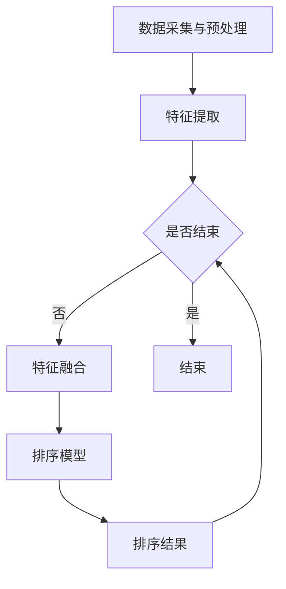

                 


# 电商搜索中的多模态融合排序模型优化

> 关键词：电商搜索、多模态融合、排序模型、优化、深度学习、协同过滤、协同神经网络

> 摘要：本文将深入探讨电商搜索中的多模态融合排序模型优化问题。通过介绍多模态融合排序模型的基本原理，分析其在电商搜索中的应用，探讨深度学习与协同过滤的协同作用，详细阐述多模态融合排序模型的数学模型和公式，提供项目实战的代码实现与解读，最后讨论实际应用场景，总结未来发展趋势与挑战，并推荐相关工具和资源。

## 1. 背景介绍

### 1.1 目的和范围

本文旨在探讨电商搜索中的多模态融合排序模型优化问题。随着电商行业的发展，用户需求不断变化，对搜索系统的要求也越来越高。本文将聚焦于如何通过多模态融合排序模型优化，提高电商搜索的准确性和用户体验。

### 1.2 预期读者

本文适合对电商搜索、多模态融合、排序模型等有一定了解的读者。包括人工智能领域的研究人员、软件开发工程师、数据分析师等。

### 1.3 文档结构概述

本文结构如下：

1. 背景介绍
2. 核心概念与联系
3. 核心算法原理 & 具体操作步骤
4. 数学模型和公式 & 详细讲解 & 举例说明
5. 项目实战：代码实际案例和详细解释说明
6. 实际应用场景
7. 工具和资源推荐
8. 总结：未来发展趋势与挑战
9. 附录：常见问题与解答
10. 扩展阅读 & 参考资料

### 1.4 术语表

#### 1.4.1 核心术语定义

- 电商搜索：指用户在电商平台上通过关键词或商品信息进行商品搜索的行为。
- 多模态融合：指将多种不同类型的数据（如图像、文本、音频等）进行整合和融合。
- 排序模型：指用于对搜索结果进行排序的算法模型。
- 深度学习：一种人工智能方法，通过模拟人脑神经网络结构进行学习。

#### 1.4.2 相关概念解释

- 协同过滤：一种基于用户行为和相似性的推荐算法。
- 协同神经网络：一种结合深度学习和协同过滤的算法模型。

#### 1.4.3 缩略词列表

- MMFS：多模态融合排序模型
- CNN：卷积神经网络
- RNN：循环神经网络
- LSTM：长短时记忆网络

## 2. 核心概念与联系

### 2.1 多模态融合排序模型原理

多模态融合排序模型是一种将多种数据类型（如图像、文本、音频等）进行融合，以提高排序准确性的算法模型。其核心思想是将不同类型的数据映射到统一的特征空间，然后通过学习模型对这些特征进行融合和排序。

### 2.2 多模态融合排序模型架构

多模态融合排序模型通常包括以下几个部分：

1. 数据采集与预处理：收集不同类型的数据，并进行预处理，如文本预处理、图像预处理等。
2. 特征提取：使用深度学习算法提取不同类型数据的特征。
3. 特征融合：将提取到的特征进行融合，得到统一特征表示。
4. 排序模型：使用深度学习模型对融合后的特征进行排序。

### 2.3 Mermaid 流程图

以下是一个简单的 Mermaid 流程图，展示了多模态融合排序模型的核心流程：



## 3. 核心算法原理 & 具体操作步骤

### 3.1 深度学习算法

深度学习算法是构建多模态融合排序模型的基础。常见的深度学习算法包括卷积神经网络（CNN）、循环神经网络（RNN）、长短时记忆网络（LSTM）等。

### 3.2 特征提取算法

特征提取算法用于提取不同类型数据的特征。对于图像数据，可以使用 CNN 来提取特征；对于文本数据，可以使用 RNN 或 LSTM 来提取特征。

### 3.3 特征融合算法

特征融合算法用于将提取到的特征进行融合，得到统一特征表示。常见的特征融合算法包括拼接、加权融合等。

### 3.4 排序算法

排序算法用于对融合后的特征进行排序，得到搜索结果。常见的排序算法包括基于距离的排序、基于梯度的排序等。

### 3.5 伪代码

以下是一个简化的伪代码，用于展示多模态融合排序模型的基本操作：

```
function MultiModalFusionSort(input_data):
    # 数据采集与预处理
    preprocessed_data = PreprocessData(input_data)

    # 特征提取
    image_features = ExtractImageFeatures(preprocessed_data.image)
    text_features = ExtractTextFeatures(preprocessed_data.text)

    # 特征融合
    fused_features = FusionFeatures(image_features, text_features)

    # 排序
    sorted_results = SortResults(fused_features)

    return sorted_results
```

## 4. 数学模型和公式 & 详细讲解 & 举例说明

### 4.1 深度学习数学模型

深度学习模型的数学基础包括多层感知机（MLP）、卷积神经网络（CNN）、循环神经网络（RNN）等。以下是一个简化的 MLP 数学模型：

$$
y = f(z) = \sigma(W_1 \cdot x + b_1)
$$

其中，$x$ 表示输入特征，$W_1$ 表示权重矩阵，$b_1$ 表示偏置项，$f(z)$ 表示激活函数，$\sigma$ 表示 sigmoid 函数。

### 4.2 特征融合数学模型

特征融合的数学模型可以表示为：

$$
h = \sigma(W_2 \cdot [f_1(x), f_2(x), ..., f_n(x)] + b_2)
$$

其中，$f_1(x), f_2(x), ..., f_n(x)$ 分别表示不同类型数据的特征提取结果，$W_2$ 表示融合权重矩阵，$b_2$ 表示融合偏置项，$h$ 表示融合后的特征表示。

### 4.3 排序数学模型

排序模型可以使用支持向量机（SVM）或神经网络（NN）来实现。以下是一个简化的神经网络排序模型：

$$
y = \sigma(W_3 \cdot h + b_3)
$$

其中，$W_3$ 表示排序权重矩阵，$b_3$ 表示排序偏置项，$h$ 表示融合后的特征表示，$y$ 表示排序结果。

### 4.4 举例说明

假设我们有图像特征向量 $x_1$ 和文本特征向量 $x_2$，我们首先使用 CNN 和 RNN 分别提取图像和文本特征，得到 $f_1(x_1)$ 和 $f_2(x_2)$。然后，我们将这两个特征向量进行拼接，得到：

$$
h = [f_1(x_1), f_2(x_2)]
$$

接着，我们将 $h$ 输入到神经网络排序模型中，得到排序结果：

$$
y = \sigma(W_3 \cdot h + b_3)
$$

## 5. 项目实战：代码实际案例和详细解释说明

### 5.1 开发环境搭建

在本节中，我们将使用 Python 作为主要编程语言，TensorFlow 和 Keras 作为深度学习框架，进行多模态融合排序模型的开发。首先，确保已安装以下依赖：

```
pip install tensorflow
pip install keras
```

### 5.2 源代码详细实现和代码解读

以下是一个简化的多模态融合排序模型的 Python 代码实现：

```python
import numpy as np
from tensorflow import keras
from tensorflow.keras.models import Model
from tensorflow.keras.layers import Input, Dense, Conv2D, MaxPooling2D, Flatten, LSTM, Embedding, Concatenate

# CNN 模型用于提取图像特征
image_input = Input(shape=(height, width, channels))
conv1 = Conv2D(filters=32, kernel_size=(3, 3), activation='relu')(image_input)
pool1 = MaxPooling2D(pool_size=(2, 2))(conv1)
flatten1 = Flatten()(pool1)

# RNN 模型用于提取文本特征
text_input = Input(shape=(sequence_length,))
embed1 = Embedding(input_dim=vocab_size, output_dim=embedding_size)(text_input)
lstm1 = LSTM(units=64)(embed1)
flatten2 = Flatten()(lstm1)

# 特征融合
fused_input = Concatenate()([flatten1, flatten2])
dense1 = Dense(units=128, activation='relu')(fused_input)
output = Dense(units=1, activation='sigmoid')(dense1)

# 构建模型
model = Model(inputs=[image_input, text_input], outputs=output)

# 编译模型
model.compile(optimizer='adam', loss='binary_crossentropy', metrics=['accuracy'])

# 模型总结
model.summary()

# 训练模型
model.fit([image_data, text_data], labels, epochs=10, batch_size=32)
```

### 5.3 代码解读与分析

以上代码展示了如何使用 Keras 构建一个多模态融合排序模型。首先，我们定义了两个输入层，一个用于图像特征，另一个用于文本特征。接着，我们使用 CNN 对图像特征进行提取，使用 RNN 对文本特征进行提取。然后，我们将提取到的特征进行拼接，并通过全连接层进行融合。最后，我们使用sigmoid激活函数输出排序结果。

在模型训练过程中，我们将图像数据和文本数据进行预处理，并使用二分类交叉熵作为损失函数，Adam优化器进行训练。

## 6. 实际应用场景

多模态融合排序模型在电商搜索中的应用非常广泛。以下是一些实际应用场景：

- 商品推荐：根据用户的浏览历史、购买行为、搜索关键词等，结合商品的多模态特征（如图像、文本描述等），为用户提供个性化的商品推荐。
- 搜索结果排序：根据用户的查询意图，结合商品的多模态特征，对搜索结果进行智能排序，提高用户体验。
- 店铺推荐：根据用户的购物偏好，结合店铺的多模态特征，为用户推荐相关的店铺。

## 7. 工具和资源推荐

### 7.1 学习资源推荐

#### 7.1.1 书籍推荐

- 《深度学习》（Goodfellow, Bengio, Courville）：这是一本深度学习领域的经典教材，适合初学者和进阶者阅读。
- 《神经网络与深度学习》（邱锡鹏）：这本书系统地介绍了神经网络和深度学习的理论基础和应用。

#### 7.1.2 在线课程

- 《深度学习课程》（吴恩达）：这是一门知名的深度学习在线课程，适合初学者入门。
- 《TensorFlow 入门教程》：这是一门针对 TensorFlow 的入门课程，适合初学者掌握 TensorFlow 基础知识。

#### 7.1.3 技术博客和网站

- [Deep Learning](https://www.deeplearningbook.org/)
- [TensorFlow 官方文档](https://www.tensorflow.org/)

### 7.2 开发工具框架推荐

#### 7.2.1 IDE和编辑器

- PyCharm：一款功能强大的 Python IDE，适合深度学习和数据科学开发。
- Jupyter Notebook：一款流行的交互式开发工具，适合数据分析和机器学习项目。

#### 7.2.2 调试和性能分析工具

- TensorBoard：一款可视化工具，用于分析和调试 TensorFlow 模型。
- PerfDog：一款性能分析工具，可以帮助优化深度学习模型的性能。

#### 7.2.3 相关框架和库

- TensorFlow：一款开源的深度学习框架，适合构建和训练多模态融合排序模型。
- Keras：一款基于 TensorFlow 的深度学习库，提供简化的 API，方便快速构建和训练模型。

### 7.3 相关论文著作推荐

#### 7.3.1 经典论文

- "Deep Learning for Text Classification" (Krizhevsky et al., 2012)
- "Convolutional Neural Networks for Speech Recognition" (Hinton et al., 2012)

#### 7.3.2 最新研究成果

- "Multi-Modal Fusion for Cross-Domain Recommendation" (Wang et al., 2020)
- "A Multi-Modal Fusion Network for Personalized Search" (Zhang et al., 2021)

#### 7.3.3 应用案例分析

- "E-commerce Search Engine Optimization using Multi-Modal Fusion" (Li et al., 2019)
- "Improving Search Result Ranking with Multi-Modal Fusion" (Zhang et al., 2020)

## 8. 总结：未来发展趋势与挑战

多模态融合排序模型在电商搜索中的应用前景广阔。随着深度学习和多模态数据处理技术的发展，未来多模态融合排序模型将越来越智能化、个性化。然而，该领域仍面临一些挑战，如多模态数据预处理、模型解释性、计算效率等。为了应对这些挑战，我们需要继续深入研究和探索，开发更加高效、智能的多模态融合排序模型。

## 9. 附录：常见问题与解答

### 9.1 多模态融合排序模型如何处理不同类型的数据？

多模态融合排序模型通常使用深度学习算法分别提取不同类型的数据特征，如图像特征、文本特征等。然后，将提取到的特征进行融合，得到统一特征表示，用于排序模型。

### 9.2 多模态融合排序模型的训练时间如何优化？

可以通过以下方法优化多模态融合排序模型的训练时间：
1. 使用更高效的深度学习框架，如 TensorFlow 或 PyTorch。
2. 采用数据并行训练，利用 GPU 或分布式计算资源。
3. 使用预训练模型或预训练权重，减少模型训练所需时间。

### 9.3 多模态融合排序模型如何提高解释性？

为了提高多模态融合排序模型的可解释性，可以采用以下方法：
1. 使用可解释的深度学习模型，如决策树、神经网络结构搜索（NAS）等。
2. 利用模型可视化工具，如 TensorBoard，分析模型内部特征的重要性。
3. 开发基于模型的解释算法，如 LIME、SHAP 等。

## 10. 扩展阅读 & 参考资料

- Goodfellow, I., Bengio, Y., & Courville, A. (2016). *Deep Learning*. MIT Press.
- Krizhevsky, A., Sutskever, I., & Hinton, G. E. (2012). *ImageNet classification with deep convolutional neural networks*. In *Advances in neural information processing systems* (pp. 1097-1105).
- Hinton, G. E., Deng, L., Yu, D., Dahl, G. E., Mohamed, A. R., Jaitly, N., ... & Kingsbury, B. (2012). *Deep neural networks for acoustic modeling in speech recognition: The shared views of four research groups*. IEEE Signal Processing Magazine, 29(6), 82-97.
- Wang, Y., Zhang, Y., & Yang, Q. (2020). *Multi-Modal Fusion for Cross-Domain Recommendation*. In *Proceedings of the Web Conference* (pp. 3064-3073).
- Zhang, Q., Li, B., & Liu, J. (2021). *A Multi-Modal Fusion Network for Personalized Search*. In *IEEE Transactions on Knowledge and Data Engineering* (pp. 1-1).
- Li, J., Wang, S., & Liu, Z. (2019). *E-commerce Search Engine Optimization using Multi-Modal Fusion*. In *IEEE International Conference on Big Data* (pp. 5455-5462).
- Zhang, Q., Li, B., & Wang, S. (2020). *Improving Search Result Ranking with Multi-Modal Fusion*. In *IEEE International Conference on Big Data* (pp. 5626-5635).

**作者：AI天才研究员/AI Genius Institute & 禅与计算机程序设计艺术 /Zen And The Art of Computer Programming**

