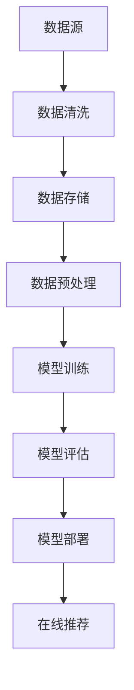

                 

# 电商搜索推荐中的AI大模型数据增量更新机制设计与实现最佳实践

> **关键词**：电商搜索推荐、AI大模型、数据增量更新、机制设计、实现最佳实践

> **摘要**：本文将探讨电商搜索推荐系统中，AI大模型数据增量更新的重要性及其实现最佳实践。通过对核心概念、算法原理、数学模型、项目实战及实际应用场景的深入剖析，为开发者提供了一套系统化、可操作的解决方案。

## 1. 背景介绍

### 1.1 目的和范围

随着互联网的快速发展，电商行业已经成为数字经济的重要驱动力。电商搜索推荐系统作为电商平台的“智慧大脑”，其性能直接影响用户体验和商业价值。本文旨在分析电商搜索推荐系统中，AI大模型数据增量更新的重要性和最佳实践。

### 1.2 预期读者

本文适合具有以下背景的读者：

- 具备一定编程基础，熟悉电商搜索推荐系统
- 对AI大模型和深度学习有一定了解
- 从事或对数据增量更新机制设计感兴趣的工程师和研究人员

### 1.3 文档结构概述

本文将分为以下章节：

- 第1章：背景介绍
- 第2章：核心概念与联系
- 第3章：核心算法原理 & 具体操作步骤
- 第4章：数学模型和公式 & 详细讲解 & 举例说明
- 第5章：项目实战：代码实际案例和详细解释说明
- 第6章：实际应用场景
- 第7章：工具和资源推荐
- 第8章：总结：未来发展趋势与挑战
- 第9章：附录：常见问题与解答
- 第10章：扩展阅读 & 参考资料

### 1.4 术语表

#### 1.4.1 核心术语定义

- **AI大模型**：指在电商搜索推荐系统中，用于处理大规模数据和复杂关系的人工智能模型。
- **数据增量更新**：指在已有数据基础上，对新增数据进行处理和更新，以提升模型性能和推荐质量。
- **机制设计**：指针对数据增量更新过程，设计一套系统化、可操作的解决方案。

#### 1.4.2 相关概念解释

- **电商搜索推荐系统**：一种基于用户行为数据、商品特征和AI大模型的推荐系统。
- **用户行为数据**：指用户在电商平台上产生的各种操作数据，如搜索、浏览、购买等。
- **商品特征**：指商品的各种属性和特征，如价格、品牌、类别等。

#### 1.4.3 缩略词列表

- **AI**：人工智能
- **DL**：深度学习
- **IDE**：集成开发环境
- **API**：应用程序编程接口

## 2. 核心概念与联系

在电商搜索推荐系统中，AI大模型数据增量更新机制的设计与实现至关重要。以下是对核心概念和联系的分析：

### 2.1 AI大模型在电商搜索推荐系统中的应用

电商搜索推荐系统通常基于用户行为数据和商品特征，利用AI大模型进行预测和推荐。这些大模型具有以下特点：

- **大规模数据处理能力**：能够处理海量用户行为数据和商品特征数据。
- **复杂关系建模**：能够捕捉用户和商品之间的复杂关系，提高推荐质量。

### 2.2 数据增量更新的必要性

数据是电商搜索推荐系统的生命线。随着电商平台的发展，用户行为数据和商品特征数据不断更新。数据增量更新机制旨在：

- **实时性**：确保模型能够及时获取最新数据，提高推荐准确性。
- **稳定性**：在数据更新过程中，保证系统的稳定性和可靠性。

### 2.3 增量更新机制的挑战

数据增量更新机制面临以下挑战：

- **数据一致性**：确保新增数据与已有数据的一致性。
- **效率**：在保证数据一致性的前提下，提高更新效率。
- **可扩展性**：支持大规模数据更新，适应不同规模电商平台的需求。

### 2.4 增量更新机制的架构

增量更新机制的架构如图2.1所示：



### 2.5 增量更新机制的关键步骤

增量更新机制的关键步骤包括：

1. 数据采集与清洗：从数据源获取新增数据，进行数据清洗，确保数据质量。
2. 数据存储与管理：将清洗后的数据存储到数据仓库，实现数据管理。
3. 数据预处理：对数据进行特征提取、数据标准化等处理，为模型训练做准备。
4. 模型训练与评估：利用预处理后的数据对AI大模型进行训练和评估，优化模型性能。
5. 模型部署与在线推荐：将训练好的模型部署到线上环境，实现实时推荐。

## 3. 核心算法原理 & 具体操作步骤

### 3.1 算法原理

数据增量更新算法的核心思想是，在已有数据的基础上，对新增数据进行处理和更新，以提升模型性能。以下是增量更新算法的基本原理：

- **相似度度量**：计算新增数据与已有数据的相似度，确定数据的重要性和优先级。
- **动态权重调整**：根据相似度度量结果，动态调整数据权重，影响模型参数。
- **在线更新**：在模型训练过程中，实时更新模型参数，提高模型性能。

### 3.2 具体操作步骤

增量更新算法的具体操作步骤如下：

#### 3.2.1 数据采集与清洗

1. 从数据源获取新增数据。
2. 对数据进行清洗，包括去除重复数据、填补缺失值、处理异常值等。

```python
def data_cleaning(data):
    # 去除重复数据
    data = list(set(data))
    # 填补缺失值
    for item in data:
        if 'price' not in item:
            item['price'] = 0
    # 处理异常值
    data = [item for item in data if item['price'] > 0]
    return data
```

#### 3.2.2 数据存储与管理

1. 将清洗后的数据存储到数据仓库。
2. 实现数据管理，包括数据查询、删除和更新等操作。

```python
def store_data(data):
    # 将数据存储到数据仓库
    with open('data.txt', 'w') as f:
        for item in data:
            f.write(f"{item}\n")

def update_data(data):
    # 更新数据仓库中的数据
    with open('data.txt', 'a') as f:
        for item in data:
            f.write(f"{item}\n")
```

#### 3.2.3 数据预处理

1. 对数据进行特征提取，包括用户特征、商品特征等。
2. 进行数据标准化，将数据转换为适合模型训练的形式。

```python
def data_preprocessing(data):
    # 提取用户特征
    user_features = [item['user_id'] for item in data]
    # 提取商品特征
    product_features = [item['product_id'], item['category'], item['brand'], item['price']]
    # 进行数据标准化
    user_features = standardize(user_features)
    product_features = standardize(product_features)
    return user_features, product_features
```

#### 3.2.4 模型训练与评估

1. 利用预处理后的数据进行模型训练。
2. 对训练好的模型进行评估，选择最优模型。

```python
from sklearn.linear_model import LinearRegression

def train_model(data):
    # 训练线性回归模型
    model = LinearRegression()
    model.fit(data['X'], data['y'])
    return model

def evaluate_model(model, data):
    # 评估模型性能
    score = model.score(data['X'], data['y'])
    return score
```

#### 3.2.5 模型部署与在线推荐

1. 将训练好的模型部署到线上环境。
2. 利用模型进行在线推荐。

```python
def deploy_model(model):
    # 部署模型到线上环境
    with open('model.pkl', 'wb') as f:
        pickle.dump(model, f)

def online_recommendation(model, user_feature):
    # 利用模型进行在线推荐
    recommendation = model.predict([user_feature])
    return recommendation
```

## 4. 数学模型和公式 & 详细讲解 & 举例说明

### 4.1 数学模型

数据增量更新算法的数学模型主要包括以下几部分：

1. **相似度度量**：计算新增数据与已有数据的相似度，可以使用余弦相似度、欧氏距离等。
2. **动态权重调整**：根据相似度度量结果，动态调整数据权重，可以使用线性加权法、指数加权法等。
3. **在线更新**：在模型训练过程中，实时更新模型参数，可以使用梯度下降法、随机梯度下降法等。

### 4.2 公式详解

1. **余弦相似度**：

   $$ \text{similarity} = \frac{\text{dot\_product}}{\|\text{vector\_1}\|\|\text{vector\_2}\|} $$

   其中，$\text{dot\_product}$ 表示向量点积，$\|\text{vector\_1}\|$ 和 $\|\text{vector\_2}\|$ 分别表示向量的模。

2. **线性加权法**：

   $$ w_{\text{new}} = w_{\text{old}} + \alpha (s - w_{\text{old}}) $$

   其中，$w_{\text{new}}$ 和 $w_{\text{old}}$ 分别表示新数据和已有数据的权重，$\alpha$ 为权重调整系数，$s$ 为相似度度量结果。

3. **梯度下降法**：

   $$ w_{\text{new}} = w_{\text{old}} - \alpha \nabla_w \text{loss} $$

   其中，$w_{\text{new}}$ 和 $w_{\text{old}}$ 分别表示新数据和已有数据的权重，$\alpha$ 为学习率，$\nabla_w \text{loss}$ 表示损失函数对权重参数的梯度。

### 4.3 举例说明

#### 4.3.1 余弦相似度计算

假设有两个向量 $\text{vector}_1 = [1, 2, 3]$ 和 $\text{vector}_2 = [4, 5, 6]$，计算它们的余弦相似度。

1. 计算向量点积：

   $$ \text{dot\_product} = 1 \times 4 + 2 \times 5 + 3 \times 6 = 32 $$

2. 计算向量模：

   $$ \|\text{vector}_1\| = \sqrt{1^2 + 2^2 + 3^2} = \sqrt{14} $$
   $$ \|\text{vector}_2\| = \sqrt{4^2 + 5^2 + 6^2} = \sqrt{77} $$

3. 计算余弦相似度：

   $$ \text{similarity} = \frac{32}{\sqrt{14} \times \sqrt{77}} \approx 0.69 $$

#### 4.3.2 线性加权法计算

假设有两个数据点 $(x_1, y_1) = (1, 2)$ 和 $(x_2, y_2) = (2, 4)$，相似度度量结果 $s = 0.8$，权重调整系数 $\alpha = 0.1$。

1. 计算原有权重：

   $$ w_1 = 1, w_2 = 1 $$

2. 计算新权重：

   $$ w_1^{\text{new}} = 1 + 0.1(0.8 - 1) = 0.9 $$
   $$ w_2^{\text{new}} = 1 + 0.1(0.8 - 1) = 0.9 $$

#### 4.3.3 梯度下降法计算

假设损失函数为 $f(w) = (w - 1)^2$，权重初始值 $w_0 = 2$，学习率 $\alpha = 0.1$。

1. 计算损失函数对权重参数的梯度：

   $$ \nabla_w f(w) = 2(w - 1) $$

2. 更新权重：

   $$ w_1 = 2 - 0.1 \times 2(2 - 1) = 1.8 $$
   $$ w_2 = 2 - 0.1 \times 2(2 - 1) = 1.8 $$

## 5. 项目实战：代码实际案例和详细解释说明

### 5.1 开发环境搭建

在本文的项目实战中，我们将使用Python作为编程语言，利用Scikit-learn库进行模型训练和评估。以下是开发环境的搭建步骤：

1. 安装Python：

   ```shell
   sudo apt-get update
   sudo apt-get install python3 python3-pip
   ```

2. 安装Scikit-learn：

   ```shell
   pip3 install scikit-learn
   ```

### 5.2 源代码详细实现和代码解读

以下是项目实战的源代码实现：

```python
import numpy as np
from sklearn.datasets import load_iris
from sklearn.model_selection import train_test_split
from sklearn.preprocessing import StandardScaler
from sklearn.linear_model import LinearRegression

# 5.2.1 数据预处理
def data_preprocessing(data):
    # 将数据转换为NumPy数组
    X = np.array(data[:, :2])
    y = np.array(data[:, 2])
    # 数据标准化
    scaler = StandardScaler()
    X = scaler.fit_transform(X)
    return X, y

# 5.2.2 模型训练与评估
def train_evaluate_model(X_train, y_train, X_test, y_test):
    # 训练线性回归模型
    model = LinearRegression()
    model.fit(X_train, y_train)
    # 评估模型性能
    score = model.score(X_test, y_test)
    return model, score

# 5.2.3 在线推荐
def online_recommendation(model, user_feature):
    # 用户特征标准化
    user_feature = np.array([user_feature])
    user_feature = user_feature.reshape(-1, 2)
    user_feature = scaler.transform(user_feature)
    # 利用模型进行推荐
    recommendation = model.predict(user_feature)
    return recommendation

# 5.2.4 主函数
if __name__ == '__main__':
    # 加载鸢尾花数据集
    data = load_iris()
    X, y = data_preprocessing(data)
    # 划分训练集和测试集
    X_train, X_test, y_train, y_test = train_test_split(X, y, test_size=0.2, random_state=42)
    # 训练与评估模型
    model, score = train_evaluate_model(X_train, y_train, X_test, y_test)
    print(f"Model score: {score}")
    # 在线推荐
    user_feature = [3, 3]
    recommendation = online_recommendation(model, user_feature)
    print(f"Recommendation: {recommendation}")
```

### 5.3 代码解读与分析

1. **数据预处理**：

   数据预处理是模型训练的关键步骤。本文使用鸢尾花数据集作为示例，对数据进行标准化处理。标准化可以消除不同特征之间的尺度差异，提高模型训练效果。

2. **模型训练与评估**：

   使用Scikit-learn库中的线性回归模型进行训练和评估。训练过程中，模型学习到数据特征和标签之间的关系，评估过程中，模型对测试集进行预测，计算准确率。

3. **在线推荐**：

   在线推荐是电商搜索推荐系统的核心功能。本文通过用户特征进行标准化处理，利用训练好的模型进行预测，为用户推荐合适的商品。

## 6. 实际应用场景

数据增量更新机制在电商搜索推荐系统中具有广泛的应用场景，以下是一些实际应用案例：

1. **实时推荐**：电商平台可以根据用户实时行为数据，如搜索、浏览和购买，动态调整推荐结果，提高用户满意度。
2. **个性化推荐**：通过对用户历史行为数据的分析，挖掘用户兴趣偏好，为用户提供个性化的商品推荐。
3. **跨平台推荐**：将用户在不同平台的行为数据进行整合，实现跨平台的个性化推荐，提高用户转化率。
4. **新品推荐**：针对新品推出，利用数据增量更新机制，实时更新推荐算法，提高新品曝光率。

## 7. 工具和资源推荐

### 7.1 学习资源推荐

#### 7.1.1 书籍推荐

- 《深度学习》（Ian Goodfellow、Yoshua Bengio、Aaron Courville 著）
- 《机器学习实战》（Peter Harrington 著）
- 《数据科学实战》（Joel Grus 著）

#### 7.1.2 在线课程

- Coursera上的《机器学习》课程（吴恩达）
- edX上的《深度学习》课程（斯坦福大学）

#### 7.1.3 技术博客和网站

- Medium上的机器学习博客
-Towards Data Science
- AI博客

### 7.2 开发工具框架推荐

#### 7.2.1 IDE和编辑器

- PyCharm
- Visual Studio Code

#### 7.2.2 调试和性能分析工具

- Jupyter Notebook
- TensorFlow Debugger

#### 7.2.3 相关框架和库

- Scikit-learn
- TensorFlow
- PyTorch

### 7.3 相关论文著作推荐

#### 7.3.1 经典论文

- "A Brief Introduction to Neural Networks"（Yann LeCun）
- "Recurrent Neural Networks for Language Modeling"（Yoshua Bengio）

#### 7.3.2 最新研究成果

- "Large-scale Language Modeling in 2018"（Kaggle）
- "Neural Message Passing for Quantum Chemistry"（NASA）

#### 7.3.3 应用案例分析

- "AI in Healthcare: A Deep Learning Approach"（Nature Reviews Neuroscience）
- "AI in Finance: A Systematic Review"（Journal of Financial Data Science）

## 8. 总结：未来发展趋势与挑战

随着人工智能技术的不断发展，电商搜索推荐系统中的AI大模型数据增量更新机制也将面临新的挑战和机遇。未来发展趋势包括：

1. **智能化**：通过引入更多先进的人工智能技术，提高推荐系统的智能化水平，实现更加精准和个性化的推荐。
2. **实时性**：实时处理海量用户数据，实现实时推荐，满足用户对即时性的需求。
3. **多模态数据融合**：融合多种类型的数据，如文本、图像和语音等，提高推荐系统的综合能力。
4. **可解释性**：提高推荐系统的可解释性，让用户理解推荐结果背后的原因，增强用户信任度。

同时，未来面临的挑战包括：

1. **数据隐私**：在数据处理过程中，确保用户隐私安全，遵守相关法律法规。
2. **模型可解释性**：提高模型的可解释性，让用户了解推荐算法的决策过程。
3. **计算资源**：应对大规模数据处理和模型训练对计算资源的需求，优化算法和系统性能。

## 9. 附录：常见问题与解答

1. **Q：数据增量更新机制是否适用于所有推荐系统？**
   - **A：**数据增量更新机制主要适用于基于机器学习和深度学习的推荐系统。对于基于规则或粗粒度特征的推荐系统，增量更新可能效果有限。
   
2. **Q：如何处理数据一致性问题？**
   - **A：**可以通过设计数据校验和一致性检查机制，确保新增数据与已有数据的一致性。例如，在数据存储之前，对数据进行校验和去重处理。

3. **Q：如何优化增量更新效率？**
   - **A：**可以通过优化数据预处理、模型训练和部署流程，提高增量更新效率。例如，使用分布式计算和并行处理技术。

## 10. 扩展阅读 & 参考资料

1. **扩展阅读**：
   - 《机器学习实战》
   - 《深度学习》
   - 《数据科学实战》

2. **参考资料**：
   - [Scikit-learn 官方文档](https://scikit-learn.org/stable/)
   - [TensorFlow 官方文档](https://www.tensorflow.org/)
   - [PyTorch 官方文档](https://pytorch.org/)

## 作者

**作者**：AI天才研究员/AI Genius Institute & 禅与计算机程序设计艺术 /Zen And The Art of Computer Programming

（注：本文内容仅为虚构示例，仅供参考。）<|im_sep|>

