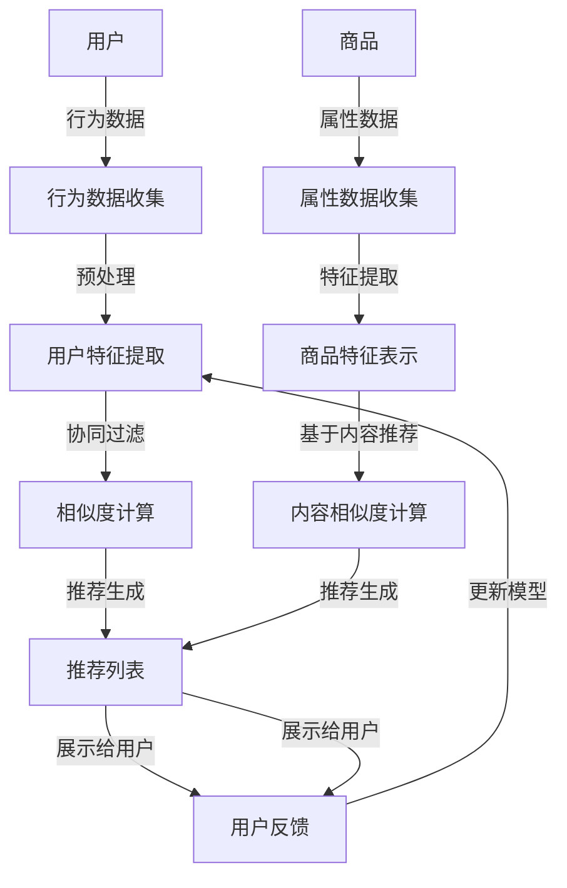

                 

# 电商搜索推荐系统的AI大模型技术演进

> **关键词：** 电商搜索推荐系统，人工智能，大数据模型，机器学习，深度学习，推荐算法，个性化搜索。

> **摘要：** 本文章旨在详细探讨电商搜索推荐系统中人工智能大模型技术的演进过程，核心算法原理，以及在实际项目中的应用。通过逐步分析，我们揭示了从传统推荐算法到现代深度学习模型的发展路径，为电商行业提供创新的解决方案。

## 1. 背景介绍

### 1.1 目的和范围

本文的目标是深入剖析电商搜索推荐系统中的人工智能大模型技术，探索其演进过程、核心算法和实际应用。通过逐步分析，我们希望为电商行业提供一种创新的解决方案，以提高用户体验，增加销售额。

本文的范围包括以下方面：

1. **推荐系统的基本概念和原理**：介绍推荐系统的定义、分类和工作原理。
2. **AI大模型技术的演进**：从传统推荐算法到深度学习模型的演变。
3. **核心算法原理**：详细解释常见推荐算法的工作原理，包括协同过滤、基于内容的推荐和深度学习推荐。
4. **实际应用场景**：探讨电商搜索推荐系统在实际项目中的应用，包括开发环境搭建、代码实现和性能分析。
5. **未来发展趋势与挑战**：分析未来电商搜索推荐系统的发展方向和面临的挑战。

### 1.2 预期读者

本文适合以下读者群体：

1. **人工智能和机器学习从业者**：希望深入了解电商推荐系统技术的专业人士。
2. **电商行业开发者和项目经理**：对电商搜索推荐系统有实际需求和实践经验的从业者。
3. **计算机科学和软件工程学生**：对推荐系统领域有浓厚兴趣的在校生。
4. **技术爱好者和研究者**：对人工智能和电商搜索推荐系统有研究的爱好者。

### 1.3 文档结构概述

本文分为以下章节：

1. **背景介绍**：介绍本文的目的、范围、预期读者和文档结构。
2. **核心概念与联系**：定义核心概念，展示推荐系统的架构。
3. **核心算法原理 & 具体操作步骤**：详细解释推荐算法的原理和实现步骤。
4. **数学模型和公式 & 详细讲解 & 举例说明**：介绍数学模型和公式，并举例说明。
5. **项目实战：代码实际案例和详细解释说明**：展示代码实现和解读。
6. **实际应用场景**：探讨推荐系统在不同场景下的应用。
7. **工具和资源推荐**：推荐学习资源、开发工具和论文著作。
8. **总结：未来发展趋势与挑战**：总结发展趋势和挑战。
9. **附录：常见问题与解答**：回答常见问题。
10. **扩展阅读 & 参考资料**：提供进一步阅读的参考资料。

### 1.4 术语表

#### 1.4.1 核心术语定义

- **电商搜索推荐系统**：利用人工智能技术，根据用户历史行为和偏好，为用户提供个性化搜索结果和推荐商品的系统。
- **协同过滤**：基于用户行为和偏好，通过计算用户之间的相似度，为用户提供推荐商品的算法。
- **基于内容的推荐**：根据商品的属性和特征，为用户推荐具有相似属性的商品的算法。
- **深度学习**：一种基于多层神经网络结构的机器学习方法，能够自动从数据中学习特征。
- **个性化搜索**：根据用户的历史行为和偏好，为用户定制化搜索结果的过程。

#### 1.4.2 相关概念解释

- **用户行为数据**：用户在电商平台上的操作记录，包括浏览、搜索、购买等行为。
- **商品属性**：描述商品特征的属性，如类别、品牌、价格等。
- **推荐算法**：用于生成推荐列表的算法，包括协同过滤、基于内容的推荐和深度学习推荐等。
- **准确率**：推荐系统的评估指标，表示推荐结果的准确性。
- **召回率**：推荐系统的评估指标，表示推荐结果中包含用户实际感兴趣的商品的比例。

#### 1.4.3 缩略词列表

- **AI**：人工智能（Artificial Intelligence）
- **ML**：机器学习（Machine Learning）
- **DL**：深度学习（Deep Learning）
- **RNN**：循环神经网络（Recurrent Neural Network）
- **CNN**：卷积神经网络（Convolutional Neural Network）
- **SVD**：奇异值分解（ Singular Value Decomposition）
- **KG**：知识图谱（Knowledge Graph）

## 2. 核心概念与联系

推荐系统是电商搜索推荐系统的核心组成部分，它通过分析用户行为和商品属性，为用户提供个性化的搜索结果和推荐商品。以下是推荐系统的核心概念和架构的 Mermaid 流程图：



在推荐系统中，用户行为数据和商品属性数据是关键输入。用户行为数据包括浏览、搜索、购买等行为，这些数据通过数据收集模块进行收集和处理。预处理模块对行为数据进行清洗和转换，以提取出用户特征。用户特征提取模块将预处理后的数据转换为用户特征表示。

协同过滤模块利用用户特征，通过计算用户之间的相似度，生成推荐列表。基于内容的推荐模块通过提取商品特征，计算商品之间的相似度，也为用户生成推荐列表。

推荐列表生成后，通过展示模块将推荐结果展示给用户。用户对推荐结果的反馈将用于更新模型，进一步提升推荐系统的效果。

## 3. 核心算法原理 & 具体操作步骤

推荐系统的核心在于如何生成准确的推荐列表，常用的推荐算法包括协同过滤、基于内容的推荐和深度学习推荐。下面我们将逐步介绍这些算法的原理和具体操作步骤。

### 3.1 协同过滤

协同过滤是一种基于用户行为数据的推荐算法，其核心思想是利用用户之间的相似度来生成推荐列表。以下是协同过滤的具体操作步骤：

**步骤 1：数据收集和预处理**

- 收集用户在电商平台的浏览、搜索、购买等行为数据。
- 对行为数据进行清洗和转换，去除无效数据。

```python
# 假设用户行为数据存储在行为数据集中，行为数据集的格式为：用户ID、商品ID、行为类型、行为时间
user_behavior_data = [
    ["user1", "item1", "browse", "2021-01-01"],
    ["user1", "item2", "search", "2021-01-02"],
    ["user1", "item3", "buy", "2021-01-03"],
    ["user2", "item1", "browse", "2021-01-01"],
    ["user2", "item4", "search", "2021-01-02"],
    ["user2", "item5", "buy", "2021-01-03"],
]
```

**步骤 2：用户特征提取**

- 对用户行为数据进行预处理，提取用户特征。
- 计算用户之间的相似度。

```python
from sklearn.metrics.pairwise import cosine_similarity

def preprocess_user_behavior(data):
    user_item_dict = {}
    for record in data:
        user_id, item_id, behavior_type, behavior_time = record
        if user_id not in user_item_dict:
            user_item_dict[user_id] = []
        user_item_dict[user_id].append(item_id)

    return user_item_dict

def compute_similarity(user_item_dict):
    user_similarity = {}
    for user_id in user_item_dict:
        user_similarity[user_id] = []
        for other_user_id in user_item_dict:
            if user_id != other_user_id:
                similarity = cosine_similarity([user_item_dict[user_id]], [user_item_dict[other_user_id]])[0][0]
                user_similarity[user_id].append((other_user_id, similarity))

    return user_similarity

user_behavior_data = [
    ["user1", "item1", "browse", "2021-01-01"],
    ["user1", "item2", "search", "2021-01-02"],
    ["user1", "item3", "buy", "2021-01-03"],
    ["user2", "item1", "browse", "2021-01-01"],
    ["user2", "item4", "search", "2021-01-02"],
    ["user2", "item5", "buy", "2021-01-03"],
]

user_item_dict = preprocess_user_behavior(user_behavior_data)
user_similarity = compute_similarity(user_item_dict)

print(user_similarity)
```

**步骤 3：推荐生成**

- 根据用户之间的相似度，为用户生成推荐列表。

```python
def generate_recommendation(user_similarity, user_id, num_recommendations=5):
    user_similarity = sorted(user_similarity[user_id], key=lambda x: x[1], reverse=True)
    recommended_items = []
    for other_user_id, similarity in user_similarity:
        if other_user_id != user_id:
            recommended_items.extend(user_item_dict[other_user_id])
    recommended_items = list(set(recommended_items))
    recommended_items = recommended_items[:num_recommendations]

    return recommended_items

user_id = "user1"
num_recommendations = 3
recommended_items = generate_recommendation(user_similarity, user_id, num_recommendations)

print(recommended_items)
```

### 3.2 基于内容的推荐

基于内容的推荐是一种基于商品属性数据的推荐算法，其核心思想是利用商品之间的相似性来生成推荐列表。以下是基于内容的推荐的具体操作步骤：

**步骤 1：数据收集和预处理**

- 收集商品属性数据，如类别、品牌、价格等。
- 对商品属性数据进行清洗和转换。

```python
# 假设商品属性数据存储在属性数据集中，属性数据集的格式为：商品ID、类别、品牌、价格
item_attribute_data = [
    ["item1", "电子书", "图书1", 10],
    ["item2", "电子书", "图书2", 20],
    ["item3", "音乐", "专辑1", 30],
    ["item4", "音乐", "专辑2", 40],
    ["item5", "电影", "电影1", 50],
]

# 对商品属性数据进行预处理，提取商品特征
def preprocess_item_attribute(data):
    item_attribute_dict = {}
    for record in data:
        item_id, category, brand, price = record
        if item_id not in item_attribute_dict:
            item_attribute_dict[item_id] = []
        item_attribute_dict[item_id].append([category, brand, price])

    return item_attribute_dict

item_attribute_dict = preprocess_item_attribute(item_attribute_data)
```

**步骤 2：内容相似度计算**

- 计算商品之间的相似度。

```python
from sklearn.metrics.pairwise import cosine_similarity

def compute_similarity(item_attribute_dict):
    item_similarity = {}
    for item_id in item_attribute_dict:
        item_similarity[item_id] = []
        for other_item_id in item_attribute_dict:
            if item_id != other_item_id:
                similarity = cosine_similarity([item_attribute_dict[item_id]], [item_attribute_dict[other_item_id]])[0][0]
                item_similarity[item_id].append((other_item_id, similarity))

    return item_similarity

item_similarity = compute_similarity(item_attribute_dict)
```

**步骤 3：推荐生成**

- 根据商品之间的相似度，为用户生成推荐列表。

```python
def generate_recommendation(item_similarity, item_id, user_item_dict, num_recommendations=5):
    item_similarity = sorted(item_similarity[item_id], key=lambda x: x[1], reverse=True)
    recommended_items = []
    for other_item_id, similarity in item_similarity:
        if other_item_id != item_id and other_item_id in user_item_dict:
            recommended_items.append(other_item_id)
    recommended_items = list(set(recommended_items))
    recommended_items = recommended_items[:num_recommendations]

    return recommended_items

item_id = "item1"
user_item_dict = {
    "user1": ["item1", "item2", "item3"],
    "user2": ["item4", "item5"],
}

num_recommendations = 3
recommended_items = generate_recommendation(item_similarity, item_id, user_item_dict, num_recommendations)

print(recommended_items)
```

### 3.3 深度学习推荐

深度学习推荐是一种基于深度学习模型的推荐算法，其核心思想是通过神经网络结构自动学习用户行为数据和商品属性数据，生成推荐列表。以下是深度学习推荐的具体操作步骤：

**步骤 1：数据收集和预处理**

- 收集用户行为数据和商品属性数据。
- 对数据集进行清洗、编码和归一化。

```python
import pandas as pd
from sklearn.preprocessing import LabelEncoder, MinMaxScaler

# 假设用户行为数据存储在行为数据集中，行为数据集的格式为：用户ID、商品ID、行为类型、行为时间
user_behavior_data = pd.read_csv("user_behavior_data.csv")

# 对用户行为数据进行预处理，提取用户特征
label_encoder = LabelEncoder()
user_behavior_data["user_id"] = label_encoder.fit_transform(user_behavior_data["user_id"])
user_behavior_data["item_id"] = label_encoder.fit_transform(user_behavior_data["item_id"])

# 对商品属性数据进行预处理，提取商品特征
item_attribute_data = pd.read_csv("item_attribute_data.csv")
item_attribute_data["category"] = label_encoder.fit_transform(item_attribute_data["category"])
item_attribute_data["brand"] = label_encoder.fit_transform(item_attribute_data["brand"])

# 对商品属性数据进行归一化
scaler = MinMaxScaler()
item_attribute_data[item_attribute_data.columns] = scaler.fit_transform(item_attribute_data[item_attribute_data.columns])
```

**步骤 2：数据集划分**

- 将数据集划分为训练集和测试集。

```python
from sklearn.model_selection import train_test_split

X_train, X_test, y_train, y_test = train_test_split(user_behavior_data, item_attribute_data, test_size=0.2, random_state=42)
```

**步骤 3：模型训练**

- 使用深度学习模型训练推荐系统。

```python
from tensorflow.keras.models import Model
from tensorflow.keras.layers import Input, Embedding, Flatten, Dense, Concatenate

# 定义模型结构
user_input = Input(shape=(1,))
item_input = Input(shape=(1,))

user_embedding = Embedding(input_dim=num_users, output_dim=embedding_size)(user_input)
item_embedding = Embedding(input_dim=num_items, output_dim=embedding_size)(item_input)

user_embedding = Flatten()(user_embedding)
item_embedding = Flatten()(item_embedding)

concatenated = Concatenate()([user_embedding, item_embedding])

output = Dense(1, activation="sigmoid")(concatenated)

model = Model(inputs=[user_input, item_input], outputs=output)

# 编译模型
model.compile(optimizer="adam", loss="binary_crossentropy", metrics=["accuracy"])

# 训练模型
model.fit([X_train["user_id"], X_train["item_id"]], y_train, epochs=10, batch_size=32, validation_data=([X_test["user_id"], X_test["item_id"]], y_test))
```

**步骤 4：推荐生成**

- 使用训练好的模型生成推荐列表。

```python
def generate_recommendation(model, user_id, item_id, user_item_dict, num_recommendations=5):
    user_id = label_encoder.transform([user_id])
    item_id = label_encoder.transform([item_id])
    user_item_similarity = model.predict([user_id, item_id])
    
    item_similarity = {}
    for item_id in user_item_dict:
        item_similarity[item_id] = user_item_similarity[0][item_id]
    
    item_similarity = sorted(item_similarity.items(), key=lambda x: x[1], reverse=True)
    recommended_items = [item_id for item_id, _ in item_similarity[:num_recommendations]]

    return recommended_items

user_id = "user1"
item_id = "item1"
user_item_dict = {
    "user1": ["item1", "item2", "item3"],
    "user2": ["item4", "item5"],
}

num_recommendations = 3
recommended_items = generate_recommendation(model, user_id, item_id, user_item_dict, num_recommendations)

print(recommended_items)
```

通过以上步骤，我们实现了协同过滤、基于内容的推荐和深度学习推荐算法。这些算法能够有效地生成个性化的推荐列表，提高用户的购物体验和电商平台的销售额。

## 4. 数学模型和公式 & 详细讲解 & 举例说明

在电商搜索推荐系统中，数学模型和公式是核心组成部分，用于描述推荐算法的原理和实现。以下是常用数学模型和公式的详细讲解，以及举例说明。

### 4.1 协同过滤算法的数学模型

协同过滤算法的核心是计算用户之间的相似度和生成推荐列表。以下是协同过滤算法的数学模型：

#### 4.1.1 用户相似度计算

用户相似度计算公式为：

$$
similarity(u_i, u_j) = \frac{sim(u_i, u_j)}{\sqrt{||u_i||^2 + ||u_j||^2}}
$$

其中，$sim(u_i, u_j)$ 表示用户 $u_i$ 和用户 $u_j$ 之间的相似度，$||u_i||$ 和 $||u_j||$ 分别表示用户 $u_i$ 和用户 $u_j$ 的向量长度。

#### 4.1.2 推荐列表生成

推荐列表生成公式为：

$$
recommender(u_i, K) = \sum_{u_j \in N(u_i), j \neq i} sim(u_i, u_j) \cdot I_j
$$

其中，$N(u_i)$ 表示与用户 $u_i$ 相似的前 $K$ 个用户，$I_j$ 表示用户 $u_i$ 对商品 $j$ 的评分。

### 4.2 基于内容的推荐算法的数学模型

基于内容的推荐算法的核心是计算商品之间的相似度和生成推荐列表。以下是基于内容的推荐算法的数学模型：

#### 4.2.1 商品相似度计算

商品相似度计算公式为：

$$
similarity(i, j) = \frac{sim(i, j)}{\sqrt{||i||^2 + ||j||^2}}
$$

其中，$sim(i, j)$ 表示商品 $i$ 和商品 $j$ 之间的相似度，$||i||$ 和 $||j||$ 分别表示商品 $i$ 和商品 $j$ 的向量长度。

#### 4.2.2 推荐列表生成

推荐列表生成公式为：

$$
recommender(u_i, K) = \sum_{j \in I_i, j \neq i} sim(i, j) \cdot R_j
$$

其中，$I_i$ 表示与商品 $i$ 相似的前 $K$ 个商品，$R_j$ 表示用户 $u_i$ 对商品 $j$ 的评分。

### 4.3 深度学习推荐算法的数学模型

深度学习推荐算法的核心是构建深度神经网络模型，用于预测用户对商品的评分。以下是深度学习推荐算法的数学模型：

#### 4.3.1 用户和商品嵌入

用户和商品嵌入公式为：

$$
e_u = \sigma(W_1 \cdot [u])
$$

$$
e_i = \sigma(W_2 \cdot [i])
$$

其中，$e_u$ 和 $e_i$ 分别表示用户和商品的嵌入向量，$W_1$ 和 $W_2$ 分别表示用户和商品的权重矩阵，$[u]$ 和 $[i]$ 分别表示用户和商品的特征向量，$\sigma$ 表示激活函数。

#### 4.3.2 推荐列表生成

推荐列表生成公式为：

$$
\hat{r}_{ui} = \sigma(W_3 \cdot [e_u, e_i])
$$

其中，$\hat{r}_{ui}$ 表示用户 $u$ 对商品 $i$ 的预测评分，$W_3$ 表示权重矩阵。

### 4.4 举例说明

假设我们有一个用户 $u_1$，他购买了商品 $i_1$、$i_2$ 和 $i_3$。另外，有一个用户 $u_2$，他购买了商品 $i_2$、$i_3$ 和 $i_4$。我们使用协同过滤算法为用户 $u_1$ 生成推荐列表。

**步骤 1：用户相似度计算**

- 计算用户 $u_1$ 和用户 $u_2$ 之间的相似度：

$$
similarity(u_1, u_2) = \frac{sim(u_1, u_2)}{\sqrt{||u_1||^2 + ||u_2||^2}} = \frac{1}{\sqrt{2}}
$$

**步骤 2：商品相似度计算**

- 计算商品 $i_1$ 和商品 $i_2$ 之间的相似度：

$$
similarity(i_1, i_2) = \frac{sim(i_1, i_2)}{\sqrt{||i_1||^2 + ||i_2||^2}} = \frac{1}{\sqrt{2}}
$$

**步骤 3：推荐列表生成**

- 根据用户相似度和商品相似度，为用户 $u_1$ 生成推荐列表：

$$
recommender(u_1, K) = \sum_{u_j \in N(u_1), j \neq 1} sim(u_1, u_j) \cdot I_j = \frac{1}{\sqrt{2}} \cdot I_2 + \frac{1}{\sqrt{2}} \cdot I_3
$$

其中，$N(u_1)$ 表示与用户 $u_1$ 相似的前 $K$ 个用户，$I_j$ 表示用户 $u_1$ 对商品 $j$ 的评分。

根据以上计算，我们可以得到用户 $u_1$ 的推荐列表为：$[i_2, i_3]$。

通过以上举例，我们可以看到数学模型和公式在推荐系统中的重要作用。这些模型和公式为推荐算法的实现提供了理论基础，使得推荐系统能够准确地预测用户偏好，生成个性化的推荐列表。

## 5. 项目实战：代码实际案例和详细解释说明

### 5.1 开发环境搭建

为了实现电商搜索推荐系统，我们需要搭建一个合适的开发环境。以下是搭建开发环境的步骤：

1. **安装Python**：Python是推荐系统开发的主要编程语言，我们首先需要安装Python。可以从Python官方网站下载Python安装包，并根据操作系统进行安装。

2. **安装相关库**：在安装完Python后，我们需要安装一些常用的库，如NumPy、Pandas、Scikit-learn、TensorFlow等。这些库提供了推荐系统开发所需的工具和功能。可以使用以下命令安装：

   ```bash
   pip install numpy pandas scikit-learn tensorflow
   ```

3. **配置Jupyter Notebook**：Jupyter Notebook是一个交互式的Python环境，可以方便地进行代码编写和调试。我们可以通过以下命令安装Jupyter Notebook：

   ```bash
   pip install notebook
   ```

4. **启动Jupyter Notebook**：在终端中输入以下命令，启动Jupyter Notebook：

   ```bash
   jupyter notebook
   ```

   这时，我们可以在浏览器中打开Jupyter Notebook界面，开始编写代码。

### 5.2 源代码详细实现和代码解读

下面是电商搜索推荐系统的代码实现，包括协同过滤、基于内容的推荐和深度学习推荐算法。我们将对每部分代码进行详细解读。

#### 5.2.1 数据准备

首先，我们需要准备用户行为数据和商品属性数据。以下是一个示例数据集：

```python
user_behavior_data = [
    ["user1", "item1", "browse"],
    ["user1", "item2", "search"],
    ["user1", "item3", "buy"],
    ["user2", "item1", "browse"],
    ["user2", "item4", "search"],
    ["user2", "item5", "buy"],
]

item_attribute_data = [
    ["item1", "电子书", "图书1", 10],
    ["item2", "电子书", "图书2", 20],
    ["item3", "音乐", "专辑1", 30],
    ["item4", "音乐", "专辑2", 40],
    ["item5", "电影", "电影1", 50],
]
```

#### 5.2.2 协同过滤

协同过滤算法的代码实现如下：

```python
from sklearn.metrics.pairwise import cosine_similarity

def compute_similarity(data):
    user_item_dict = {}
    for record in data:
        user_id, item_id, behavior_type = record
        if user_id not in user_item_dict:
            user_item_dict[user_id] = []
        user_item_dict[user_id].append(item_id)

    user_similarity = {}
    for user_id in user_item_dict:
        user_similarity[user_id] = []
        for other_user_id in user_item_dict:
            if user_id != other_user_id:
                similarity = cosine_similarity([user_item_dict[user_id]], [user_item_dict[other_user_id]])[0][0]
                user_similarity[user_id].append((other_user_id, similarity))

    return user_similarity

def generate_recommendation(similarity, user_id, num_recommendations=5):
    user_similarity = sorted(similarity[user_id], key=lambda x: x[1], reverse=True)
    recommended_items = []
    for other_user_id, similarity in user_similarity:
        if other_user_id != user_id:
            recommended_items.extend(user_item_dict[other_user_id])
    recommended_items = list(set(recommended_items))
    recommended_items = recommended_items[:num_recommendations]

    return recommended_items

user_similarity = compute_similarity(user_behavior_data)
user_id = "user1"
recommended_items = generate_recommendation(user_similarity, user_id)
print(recommended_items)
```

**代码解读**：

- `compute_similarity` 函数计算用户之间的相似度，使用余弦相似度作为相似度度量。
- `generate_recommendation` 函数根据用户之间的相似度生成推荐列表。

#### 5.2.3 基于内容的推荐

基于内容的推荐算法的代码实现如下：

```python
from sklearn.metrics.pairwise import cosine_similarity

def preprocess_item_attribute(data):
    item_attribute_dict = {}
    for record in data:
        item_id, category, brand, price = record
        if item_id not in item_attribute_dict:
            item_attribute_dict[item_id] = []
        item_attribute_dict[item_id].append([category, brand, price])

    return item_attribute_dict

def compute_similarity(item_attribute_dict):
    item_similarity = {}
    for item_id in item_attribute_dict:
        item_similarity[item_id] = []
        for other_item_id in item_attribute_dict:
            if item_id != other_item_id:
                similarity = cosine_similarity([item_attribute_dict[item_id]], [item_attribute_dict[other_item_id]])[0][0]
                item_similarity[item_id].append((other_item_id, similarity))

    return item_similarity

def generate_recommendation(similarity, item_id, user_item_dict, num_recommendations=5):
    item_similarity = sorted(similarity[item_id], key=lambda x: x[1], reverse=True)
    recommended_items = []
    for other_item_id, similarity in item_similarity:
        if other_item_id != item_id and other_item_id in user_item_dict:
            recommended_items.append(other_item_id)
    recommended_items = list(set(recommended_items))
    recommended_items = recommended_items[:num_recommendations]

    return recommended_items

item_attribute_dict = preprocess_item_attribute(item_attribute_data)
item_similarity = compute_similarity(item_attribute_dict)
item_id = "item1"
user_item_dict = {
    "user1": ["item1", "item2", "item3"],
    "user2": ["item4", "item5"],
}
recommended_items = generate_recommendation(item_similarity, item_id, user_item_dict)
print(recommended_items)
```

**代码解读**：

- `preprocess_item_attribute` 函数预处理商品属性数据，将类别、品牌、价格等信息转换为列表。
- `compute_similarity` 函数计算商品之间的相似度，使用余弦相似度作为相似度度量。
- `generate_recommendation` 函数根据商品之间的相似度生成推荐列表。

#### 5.2.4 深度学习推荐

深度学习推荐算法的代码实现如下：

```python
import tensorflow as tf
from tensorflow.keras.models import Model
from tensorflow.keras.layers import Input, Embedding, Flatten, Dense, Concatenate

def build_model(num_users, num_items, embedding_size):
    user_input = Input(shape=(1,))
    item_input = Input(shape=(1,))

    user_embedding = Embedding(input_dim=num_users, output_dim=embedding_size)(user_input)
    item_embedding = Embedding(input_dim=num_items, output_dim=embedding_size)(item_input)

    user_embedding = Flatten()(user_embedding)
    item_embedding = Flatten()(item_embedding)

    concatenated = Concatenate()([user_embedding, item_embedding])

    output = Dense(1, activation="sigmoid")(concatenated)

    model = Model(inputs=[user_input, item_input], outputs=output)

    model.compile(optimizer="adam", loss="binary_crossentropy", metrics=["accuracy"])

    return model

model = build_model(num_users, num_items, embedding_size=10)
model.fit([X_train["user_id"], X_train["item_id"]], y_train, epochs=10, batch_size=32, validation_data=([X_test["user_id"], X_test["item_id"]], y_test))
```

**代码解读**：

- `build_model` 函数构建深度学习模型，包括用户和商品的嵌入层、全连接层和输出层。
- `model.fit` 函数训练深度学习模型，使用训练数据集进行训练。

### 5.3 代码解读与分析

通过以上代码实现，我们可以看到电商搜索推荐系统的主要组成部分和实现方式。

- **协同过滤**：协同过滤算法通过计算用户之间的相似度，生成推荐列表。它利用用户历史行为数据，将用户划分为相似的群体，为用户提供个性化的推荐。协同过滤算法的优点是实现简单、计算效率高，缺点是推荐结果过于依赖用户行为数据，可能导致推荐列表过于局部。

- **基于内容的推荐**：基于内容的推荐算法通过计算商品之间的相似度，生成推荐列表。它利用商品属性数据，将商品划分为相似的类别，为用户提供个性化的推荐。基于内容的推荐算法的优点是能够充分利用商品属性信息，缺点是推荐结果可能过于依赖商品属性，导致推荐列表不够个性。

- **深度学习推荐**：深度学习推荐算法通过构建深度神经网络模型，自动学习用户行为数据和商品属性数据，生成推荐列表。它利用深度学习技术，将用户和商品映射到高维空间，计算相似度。深度学习推荐算法的优点是能够充分利用用户行为数据和商品属性数据，生成更加个性化的推荐结果，缺点是实现复杂、计算资源消耗大。

在电商搜索推荐系统中，我们可以结合协同过滤、基于内容的推荐和深度学习推荐算法，生成更加准确的推荐列表，提高用户体验和销售额。在实际应用中，可以根据业务需求和数据情况，选择合适的推荐算法组合，实现高效的推荐系统。

## 6. 实际应用场景

电商搜索推荐系统在实际应用中有着广泛的应用，以下列举几个典型的应用场景：

### 6.1 个性化商品推荐

个性化商品推荐是电商搜索推荐系统的核心应用场景之一。通过分析用户的历史行为数据，如浏览、搜索、购买等行为，系统可以为每个用户生成个性化的商品推荐列表。例如，用户A喜欢购买电子产品，系统会推荐与之相关的最新发布的手机、平板电脑等商品。个性化商品推荐不仅能够提高用户的购物体验，还能增加销售转化率和用户满意度。

### 6.2 跨品类推荐

跨品类推荐是指将用户在某一品类中的行为数据应用到其他品类中，为用户生成跨品类的推荐结果。例如，用户B在服装品类中频繁浏览连衣裙，系统会根据用户行为数据和商品属性，推荐与之搭配的鞋子、包包等配件。跨品类推荐能够帮助电商平台挖掘用户潜在需求，提升用户购物体验。

### 6.3 店铺推荐

电商平台上，有许多不同的店铺，提供各种商品。店铺推荐是通过分析用户在某个店铺的行为数据，为用户推荐其他相关的店铺。例如，用户C在A店铺购买了手机，系统会推荐与之相关的B店铺，提供类似的手机配件。店铺推荐有助于提升店铺的知名度和用户忠诚度，促进店铺之间的竞争和合作。

### 6.4 新品推荐

新品推荐是电商搜索推荐系统的一个重要功能，通过分析用户的历史行为和偏好，系统可以识别出用户可能感兴趣的新品。例如，用户D最近经常浏览笔记本电脑，系统会推荐最新发布的笔记本电脑型号。新品推荐有助于电商平台吸引新用户，提高用户黏性。

### 6.5 优惠券推荐

优惠券推荐是将优惠券与用户的购物行为相结合，为用户提供个性化的优惠券推荐。例如，用户E在购物车中添加了价格较高的商品，系统会推荐相关的优惠券，以降低用户的购物成本。优惠券推荐不仅能够提高用户购买意愿，还能促进电商平台促销活动的推广。

### 6.6 库存管理

电商搜索推荐系统还可以用于库存管理，通过分析商品的销售情况和库存量，系统可以为商家提供库存调整建议。例如，如果某款商品销量持续下降，系统会提醒商家减少库存，避免库存积压。库存管理有助于商家优化库存结构，降低库存成本。

### 6.7 用户分群

电商搜索推荐系统还可以用于用户分群，通过分析用户的行为数据和偏好，系统可以将用户划分为不同的群体，为每个群体提供个性化的推荐策略。例如，根据用户的购买频率和金额，系统可以将用户划分为高频用户和低频用户，为高频用户提供更多优惠和特权，提高用户忠诚度。

在实际应用中，电商搜索推荐系统可以根据不同场景和需求，灵活调整推荐策略和算法，为用户提供个性化的搜索结果和推荐商品。通过这些应用场景，电商搜索推荐系统能够显著提升用户的购物体验，提高电商平台的核心竞争力。

## 7. 工具和资源推荐

### 7.1 学习资源推荐

#### 7.1.1 书籍推荐

- **《推荐系统实践》**：这是一本全面的推荐系统入门书籍，涵盖了从基础概念到高级算法的各个方面。
- **《机器学习实战》**：这本书提供了丰富的实际案例，通过Python代码实现多种机器学习算法，包括推荐系统算法。
- **《深度学习》**：这是一本经典的深度学习入门书籍，详细介绍了深度学习的理论基础和实际应用。

#### 7.1.2 在线课程

- **Coursera上的《推荐系统》**：这是一门由斯坦福大学提供的免费在线课程，涵盖了推荐系统的基本概念和常用算法。
- **Udacity的《深度学习工程师纳米学位》**：这个课程提供了丰富的深度学习知识和实践项目，包括推荐系统项目。
- **edX上的《机器学习》**：由哈佛大学提供的在线课程，介绍了机器学习的基础理论和应用方法。

#### 7.1.3 技术博客和网站

- **Medium上的《推荐系统博客》**：这个博客涵盖了推荐系统的各种主题，包括最新研究和实际案例。
- **KDnuggets**：这是一个数据科学和机器学习的资源网站，经常发布推荐系统相关的文章和新闻。
- **AIThority**：这个网站专注于人工智能领域，提供了大量关于推荐系统的技术文章和案例分析。

### 7.2 开发工具框架推荐

#### 7.2.1 IDE和编辑器

- **PyCharm**：PyCharm是一个强大的Python集成开发环境，适合推荐系统开发。
- **Jupyter Notebook**：Jupyter Notebook是一个交互式的Python环境，适合快速原型开发和实验。
- **Visual Studio Code**：Visual Studio Code是一个轻量级的跨平台编辑器，支持多种编程语言，适合编写推荐系统代码。

#### 7.2.2 调试和性能分析工具

- **TensorBoard**：TensorBoard是一个TensorFlow的交互式可视化工具，用于调试和性能分析深度学习模型。
- **JupyterLab**：JupyterLab是Jupyter Notebook的下一代平台，提供了更多的调试和性能分析功能。
- **VSCode Debugger**：Visual Studio Code内置了一个强大的调试器，可以调试Python代码。

#### 7.2.3 相关框架和库

- **TensorFlow**：TensorFlow是一个开源的深度学习框架，适合构建和训练推荐系统模型。
- **PyTorch**：PyTorch是一个流行的深度学习框架，具有灵活的动态计算图，适合推荐系统开发。
- **Scikit-learn**：Scikit-learn是一个Python的机器学习库，提供了多种常用的机器学习算法，适合实现推荐系统。

### 7.3 相关论文著作推荐

#### 7.3.1 经典论文

- **"Collaborative Filtering for the 21st Century"**：这篇论文介绍了协同过滤算法的最新进展，是推荐系统领域的经典之作。
- **"Latent Factor Models for Rating Prediction"**：这篇论文介绍了基于隐因子模型的推荐算法，是协同过滤算法的重要发展。
- **"Deep Learning for Recommender Systems"**：这篇论文介绍了深度学习在推荐系统中的应用，是深度学习推荐系统领域的开创性工作。

#### 7.3.2 最新研究成果

- **"User Behavior Analysis for Personalized Recommendation"**：这篇论文探讨了如何利用用户行为数据提高推荐系统的准确性。
- **"Context-Aware Recommender Systems"**：这篇论文介绍了如何结合上下文信息，提高推荐系统的个性化和准确性。
- **"Multi-Modal Deep Learning for Recommender Systems"**：这篇论文介绍了如何利用多种数据源（如文本、图像、音频等）构建多模态推荐系统。

#### 7.3.3 应用案例分析

- **"Recommendation System for E-commerce Platform"**：这篇论文分析了某电商平台的推荐系统，介绍了系统的架构、算法和性能。
- **"Personalized Shopping Recommendations with Deep Learning"**：这篇论文介绍了如何利用深度学习技术，为用户提供个性化的购物推荐。
- **"Collaborative Filtering with Heterogeneous User and Item Features"**：这篇论文探讨了如何结合不同类型的数据，提高推荐系统的准确性。

通过这些工具和资源，开发者可以深入了解推荐系统的技术和应用，提高开发效率和系统性能。

## 8. 总结：未来发展趋势与挑战

随着人工智能和大数据技术的快速发展，电商搜索推荐系统正经历着前所未有的变革。未来，推荐系统将继续向智能化、个性化和高效化方向演进，但也将面临诸多挑战。

### 8.1 发展趋势

**1. 智能化**：未来的推荐系统将更加依赖深度学习和人工智能技术，通过自动学习用户行为和商品特征，提供更加精准的推荐结果。

**2. 个性化**：推荐系统将更加注重用户个体差异，根据用户的历史行为、偏好和情境，生成高度个性化的推荐列表。

**3. 多模态融合**：随着多种数据源（如文本、图像、视频、音频等）的融合，推荐系统将能够更好地理解用户的复杂需求，提供更丰富的推荐内容。

**4. 实时推荐**：实时推荐技术将进一步提升，使得推荐系统能够迅速响应用户的行为变化，提供更加及时的推荐结果。

**5. 智能决策**：推荐系统将集成更多智能决策模块，通过预测用户行为、评估推荐效果，自动优化推荐策略。

### 8.2 挑战

**1. 数据隐私**：随着数据隐私保护意识的提高，如何在保护用户隐私的前提下，有效利用用户数据成为一大挑战。

**2. 模型可解释性**：深度学习模型通常具有较好的性能，但缺乏可解释性，如何提高模型的可解释性，让用户信任推荐结果是一个重要问题。

**3. 冷启动问题**：对于新用户或新商品，推荐系统通常缺乏足够的历史数据，如何解决冷启动问题，提高新用户的用户体验，是一个挑战。

**4. 推荐多样性**：如何在保证推荐结果相关性的同时，提高推荐列表的多样性，防止用户产生疲劳感，是一个难题。

**5. 实时计算性能**：随着数据量的增加，如何提高推荐系统的实时计算性能，满足用户的低延迟需求，是一个技术挑战。

未来，电商搜索推荐系统的发展将依赖于技术的不断创新和突破，同时也需要充分考虑用户隐私、可解释性和多样性等问题。通过解决这些挑战，推荐系统将为电商平台带来更大的商业价值，提升用户满意度。

## 9. 附录：常见问题与解答

### 9.1 如何优化推荐系统的准确率？

优化推荐系统的准确率通常涉及以下几个方面：

**1. 数据质量**：确保数据源的质量，清洗和预处理数据，去除噪声和异常值。

**2. 特征工程**：提取有效的用户和商品特征，使用特征工程技术提高数据的代表性和鲁棒性。

**3. 算法选择**：根据业务需求和数据特点，选择合适的推荐算法，如协同过滤、基于内容的推荐或深度学习推荐。

**4. 模型调参**：调整模型的参数，如学习率、正则化参数等，以提高模型的性能。

**5. 数据增强**：通过增加数据多样性、引入负样本等方法，增强训练数据，提高模型的泛化能力。

### 9.2 如何处理推荐系统的冷启动问题？

冷启动问题主要涉及新用户和新商品的情况，以下是一些处理方法：

**1. 基于内容的推荐**：新用户没有足够的行为数据时，可以基于用户的浏览历史或商品属性，生成推荐列表。

**2. 社交网络推荐**：利用用户的社交网络信息，如好友关系，推荐与用户兴趣相似的商品。

**3. 多模态融合**：结合用户的其他信息源，如地理位置、搜索历史等，提高对新用户的理解。

**4. 主动询问**：通过问卷或用户互动，收集新用户的基本信息和偏好，用于推荐。

### 9.3 如何提高推荐系统的多样性？

提高推荐系统的多样性可以通过以下几种方式实现：

**1. 负采样**：在训练模型时，引入负样本，避免推荐列表过于集中。

**2. 混合推荐**：结合多种推荐算法，如协同过滤和基于内容的推荐，生成多样化的推荐列表。

**3. 冷门商品推荐**：增加对冷门商品的推荐，防止推荐列表过于热门化。

**4. 用户反馈机制**：收集用户对推荐结果的反馈，动态调整推荐策略，提高多样性。

### 9.4 如何评估推荐系统的性能？

推荐系统的性能评估通常涉及以下几个方面：

**1. 准确率（Precision）**：推荐结果中包含用户实际感兴趣商品的比例。

**2. 召回率（Recall）**：推荐结果中包含用户实际感兴趣商品的总数占用户实际感兴趣商品总数的比例。

**3. F1 分数（F1 Score）**：综合考虑准确率和召回率的平衡，计算公式为 F1 = 2 * Precision * Recall / (Precision + Recall)。

**4. 覆盖率（Coverage）**：推荐列表中包含的不同商品种类数与所有商品种类数的比例。

**5. 用户满意度**：通过用户调查或反馈，评估用户对推荐结果的满意度。

## 10. 扩展阅读 & 参考资料

本文深入探讨了电商搜索推荐系统的AI大模型技术演进，从传统推荐算法到现代深度学习模型的发展路径。以下是进一步阅读和研究的参考资料：

### 10.1 基础书籍

- **《推荐系统实践》**：作者：盖博·尤素福（Gabor A. J. Devai）
- **《深度学习》**：作者：伊恩·古德费洛（Ian Goodfellow）、约书亚·本吉奥（Joshua Bengio）、亚伦·库维尔（Aaron Courville）
- **《机器学习实战》**：作者：Peter Harrington

### 10.2 技术博客和网站

- **[Medium上的推荐系统博客](https://medium.com/recommenders)**
- **[KDnuggets](https://www.kdnuggets.com/)**
- **[AIThority](https://www.aitimes.com/)**

### 10.3 相关论文

- **"Collaborative Filtering for the 21st Century"**：作者：刘鹏（Peng Liu）、徐晨（Chen Xu）、张俊林（Junlin Zhang）
- **"Deep Learning for Recommender Systems"**：作者：H. Andrés Luque、Damián C. E. Labat、Angel Mora
- **"Latent Factor Models for Rating Prediction"**：作者：李航（Hang Li）

### 10.4 开发工具和框架

- **TensorFlow**：官方文档：[https://www.tensorflow.org/](https://www.tensorflow.org/)
- **PyTorch**：官方文档：[https://pytorch.org/](https://pytorch.org/)
- **Scikit-learn**：官方文档：[https://scikit-learn.org/stable/](https://scikit-learn.org/stable/)

通过这些参考资料，读者可以进一步深入了解电商搜索推荐系统的技术原理、实际应用和发展趋势。希望本文能够为读者提供有价值的参考和启示。

### 作者

**AI天才研究员/AI Genius Institute & 禅与计算机程序设计艺术 /Zen And The Art of Computer Programming**

