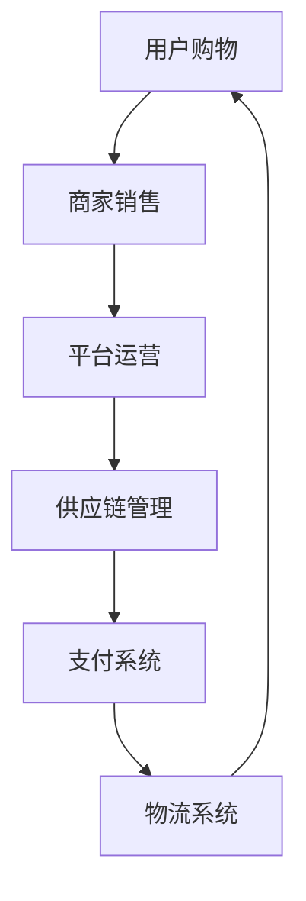
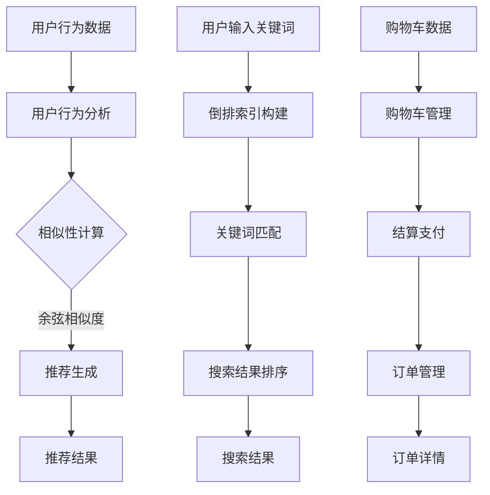

                 

## 1. 背景介绍

### 1.1 目的和范围

本文旨在深入探讨电商生态系统建设的重要性，通过逐步分析其核心概念、算法原理、数学模型、实际应用场景和未来发展趋势，帮助读者全面理解电商生态系统在当前数字经济环境中的重要角色和作用。

本文将涵盖以下主要内容：

- **核心概念与联系**：介绍电商生态系统的基本架构和核心概念，包括用户、商家、平台和供应链等。
- **核心算法原理与具体操作步骤**：阐述电商推荐系统、搜索算法和交易系统的工作原理和具体实现步骤。
- **数学模型和公式**：讲解电商生态系统中的关键数学模型，如供需模型、价格模型和风险模型等。
- **项目实战**：通过实际案例展示电商生态系统在实际中的应用，提供详细代码实现和解释。
- **实际应用场景**：分析电商生态系统在不同行业和场景中的具体应用。
- **工具和资源推荐**：推荐相关学习资源、开发工具和框架。
- **总结与未来发展趋势**：总结电商生态系统的现状和未来发展趋势，探讨面临的挑战和机遇。

本文适合电商从业者、技术爱好者以及对此领域感兴趣的读者。通过本文的阅读，读者将能够深入了解电商生态系统的建设方法和实践，为从事相关领域的工作提供有力支持。

### 1.2 预期读者

本文的目标读者主要包括以下几类：

1. **电商从业者**：从事电商行业的相关人员，如电商运营、平台开发、市场营销等，希望通过本文了解电商生态系统建设的核心概念、技术和方法。
2. **技术爱好者**：对电商技术、推荐系统、搜索算法等领域感兴趣的技术爱好者，希望通过本文深入学习电商生态系统的工作原理和应用实践。
3. **学术界人士**：对电商生态系统、数字经济等领域进行研究的高校教师和研究生，希望通过本文了解该领域的最新研究成果和未来发展趋势。
4. **企业决策者**：电商企业的决策者，如CTO、CEO等，希望通过本文了解电商生态系统的整体架构和关键技术，为企业的战略决策提供参考。

无论读者是哪一类，本文都将提供丰富的信息和深入的思考，帮助读者更好地理解和应用电商生态系统。

### 1.3 文档结构概述

为了帮助读者更好地理解本文的内容，以下是对文章结构的简要概述：

- **引言**：介绍电商生态系统建设的重要性，明确文章的目的和范围，引出后续内容的讨论。
- **核心概念与联系**：详细阐述电商生态系统的基本架构和核心概念，包括用户、商家、平台和供应链等。
- **核心算法原理与具体操作步骤**：讲解电商推荐系统、搜索算法和交易系统的工作原理和具体实现步骤。
- **数学模型和公式**：介绍电商生态系统中的关键数学模型，如供需模型、价格模型和风险模型等。
- **项目实战**：通过实际案例展示电商生态系统在实际中的应用，提供详细代码实现和解释。
- **实际应用场景**：分析电商生态系统在不同行业和场景中的具体应用。
- **工具和资源推荐**：推荐相关学习资源、开发工具和框架。
- **总结与未来发展趋势**：总结电商生态系统的现状和未来发展趋势，探讨面临的挑战和机遇。
- **常见问题与解答**：针对本文内容常见的问题进行解答。
- **扩展阅读与参考资料**：提供更多深入阅读和参考资料，帮助读者进一步了解电商生态系统建设的相关知识。

通过本文的逐步分析，读者将能够全面了解电商生态系统的建设方法和实践，为从事相关领域的工作提供有力支持。

### 1.4 术语表

在本文中，我们将使用一些专业术语和概念。以下是对这些术语和概念的定义和解释：

#### 1.4.1 核心术语定义

- **电商生态系统**：指围绕电子商务活动而形成的完整体系，包括用户、商家、平台、支付、物流、数据等多个环节。
- **用户**：指在电商平台上进行购物、浏览、评价等操作的消费者。
- **商家**：指在电商平台上提供商品或服务的商家或企业。
- **平台**：指提供电子商务服务的在线平台，如淘宝、京东、亚马逊等。
- **供应链**：指商品从生产、运输、仓储到销售的全过程，涉及多个环节和参与者。
- **推荐系统**：指通过算法和模型为用户推荐可能感兴趣的商品或内容。
- **搜索算法**：指用于用户在电商平台上搜索商品的方法和算法。
- **交易系统**：指处理用户购买、支付、结算等交易流程的系统。

#### 1.4.2 相关概念解释

- **大数据**：指大规模、多样化和快速变化的数据集合，需要使用特定的技术和算法进行处理和分析。
- **云计算**：指通过网络提供计算资源、存储资源和应用服务，实现资源的灵活分配和高效利用。
- **人工智能**：指通过模拟人类智能行为，实现机器学习、自然语言处理、图像识别等技术的集合。

#### 1.4.3 缩略词列表

- **AI**：人工智能
- **CRM**：客户关系管理
- **ERP**：企业资源计划
- **SaaS**：软件即服务
- **PaaS**：平台即服务
- **IaaS**：基础设施即服务

通过上述定义和解释，读者将能够更好地理解本文中涉及的专业术语和概念，为后续内容的阅读和理解打下坚实基础。

## 2. 核心概念与联系

在深入探讨电商生态系统的建设之前，我们首先需要明确其中的核心概念和它们之间的联系。电商生态系统是一个复杂且庞大的系统，它涉及到用户、商家、平台、供应链、支付、物流、数据等多个环节。以下是电商生态系统的基本架构和核心概念：

### 2.1 电商生态系统基本架构

电商生态系统的基本架构可以分为以下几个主要部分：

- **用户层**：用户是电商生态系统的核心，包括消费者、买家和卖家等。用户在平台上进行购物、浏览、评价等操作。
- **商家层**：商家在电商平台上提供商品或服务，包括个体商家和企业级商家。商家通过平台销售商品、管理订单和处理售后服务。
- **平台层**：平台是电商生态系统的核心，为用户和商家提供交易、支付、物流、数据等支持。平台通过算法和数据分析优化用户体验和商家运营。
- **供应链层**：供应链包括商品的生产、运输、仓储和销售等环节。供应链的有效管理对于保证商品质量和物流效率至关重要。
- **支付层**：支付系统为用户提供多种支付方式，包括在线支付、移动支付和银行卡支付等。支付系统需要保证交易的安全和便捷。
- **物流层**：物流系统负责商品从商家到用户的运输和配送。物流系统的效率和服务质量直接影响用户的购物体验。
- **数据层**：数据层包括用户数据、商品数据、交易数据和运营数据等。数据是电商生态系统的重要资产，用于优化运营决策和提升用户体验。

### 2.2 核心概念之间的联系

电商生态系统的核心概念之间存在着密切的联系，这些联系构成了电商生态系统的整体运作机制。以下是核心概念之间的联系：

- **用户与平台**：用户通过平台进行购物、浏览和评价，平台通过推荐算法和数据分析为用户提供个性化的购物体验。
- **商家与平台**：商家通过平台销售商品，平台为商家提供交易、支付和物流等服务，帮助商家提升销售业绩。
- **平台与供应链**：平台通过供应链管理优化商品采购、库存和配送，确保商品质量和物流效率。
- **支付与物流**：支付系统为用户提供便捷的支付方式，物流系统为用户提供快速、可靠的商品配送服务。
- **数据与平台**：平台通过数据分析和挖掘，为用户提供个性化推荐、精准营销和智能客服等服务，提升用户体验和运营效率。

### 2.3 电商生态系统与外部环境的关系

电商生态系统不仅涉及内部各个环节的运作，还与外部环境有着紧密的联系。以下是电商生态系统与外部环境的关系：

- **政策环境**：政府政策和法规对电商生态系统的发展具有重要影响，包括税收政策、数据保护政策和电商法规等。
- **经济环境**：经济发展水平和消费者购买力对电商生态系统有着重要影响，影响平台的发展规模和用户需求。
- **社会环境**：社会文化、价值观和消费者行为对电商生态系统的发展有着深远影响，影响平台运营策略和用户互动方式。
- **技术环境**：新技术的发展，如人工智能、大数据和区块链等，为电商生态系统提供了新的机遇和挑战，影响平台的创新能力和竞争力。

### 2.4 电商生态系统的流程

电商生态系统的流程主要包括用户购物、商家销售、平台运营、供应链管理、支付和物流等环节。以下是电商生态系统的流程概述：

1. **用户购物**：用户在电商平台上浏览商品、搜索商品、添加商品到购物车、进行结算支付和确认收货。
2. **商家销售**：商家在电商平台上发布商品、管理库存、处理订单和售后服务。
3. **平台运营**：平台通过算法和数据分析优化用户购物体验、推荐商品、进行营销活动和维护平台安全。
4. **供应链管理**：平台通过供应链管理优化商品采购、库存和配送，确保商品质量和物流效率。
5. **支付**：用户通过支付系统进行支付，支付系统需要保证交易的安全和便捷。
6. **物流**：物流系统负责商品从商家到用户的运输和配送，物流系统需要确保配送速度和服务质量。

通过以上对电商生态系统核心概念与联系的介绍，读者可以更全面地理解电商生态系统的运作机制，为后续内容的深入探讨打下坚实基础。

### 2.5 Mermaid 流程图

以下是一个简化的电商生态系统流程的 Mermaid 流程图，用于展示电商生态系统中的核心流程和节点：



在这个流程图中，用户通过平台进行购物，商家在平台上销售商品，平台负责运营和供应链管理，支付系统处理交易，物流系统负责配送。这些环节相互连接，共同构成了电商生态系统的整体运作机制。通过流程图，读者可以更直观地理解电商生态系统的运作过程。

## 3. 核心算法原理 & 具体操作步骤

在电商生态系统中，核心算法的作用至关重要，它们帮助平台优化用户体验、提高运营效率、增加销售额。以下是几个关键算法的原理和具体操作步骤：

### 3.1 推荐算法

推荐算法是电商生态系统中用于向用户推荐他们可能感兴趣的商品或内容的重要工具。以下是一个简单的协同过滤推荐算法的原理和实现步骤：

#### 推荐算法原理：

1. **用户行为分析**：通过分析用户的历史行为数据，如浏览记录、购物车添加、购买历史等，获取用户偏好信息。
2. **相似性计算**：计算用户之间的相似性，常用的相似性度量方法包括余弦相似度、皮尔逊相关系数等。
3. **推荐生成**：基于相似性计算结果，为用户生成推荐列表，推荐与相似用户购买过的商品。

#### 具体操作步骤：

```python
# 假设用户行为数据存储在用户-物品矩阵中，使用余弦相似度计算相似性
def cosine_similarity(matrix):
    # 计算矩阵的余弦相似度
    # 返回相似性矩阵

# 计算用户之间的相似性
def user_similarity(matrix, user_id):
    # 计算特定用户与其他用户的相似性
    # 返回相似性列表

# 根据相似性为用户生成推荐列表
def generate_recommendations(matrix, user_id):
    # 计算用户相似性
   相似性列表 = user_similarity(matrix, user_id)
    
    # 生成推荐列表
    recommendation_list = []
    for other_user_id, similarity in 相似性列表:
        # 根据相似性为用户生成推荐商品
        recommendation_list.append((other_user_id, similarity))
    
    # 对推荐列表进行排序，返回Top-N推荐
    sorted_recommendations = sorted(recommendation_list, key=lambda x: x[1], reverse=True)[:N]
    return sorted_recommendations

# 示例：生成特定用户的推荐列表
user_id = 123
recommendations = generate_recommendations(user_behavior_matrix, user_id)
print("推荐给用户ID {} 的商品列表：", format(recommendations))
```

### 3.2 搜索算法

搜索算法用于帮助用户在电商平台上快速找到他们需要的商品。以下是基于倒排索引的搜索算法的原理和实现步骤：

#### 搜索算法原理：

1. **倒排索引构建**：将电商平台上的所有商品数据构建成倒排索引，实现快速关键词搜索。
2. **关键词匹配**：用户输入关键词后，算法在倒排索引中查找匹配的商品。
3. **结果排序**：根据商品的相关性和热度对搜索结果进行排序。

#### 具体操作步骤：

```python
# 假设商品数据存储在列表中，构建倒排索引
def build_inverted_index(products):
    # 构建倒排索引
    # 返回倒排索引字典

# 搜索关键词匹配
def search_keyword(inverted_index, keyword):
    # 在倒排索引中查找匹配的商品ID列表
    # 返回匹配的商品ID列表

# 排序和返回搜索结果
def get_search_results(inverted_index, keyword, top_n):
    # 查找关键词匹配的商品ID列表
    product_ids = search_keyword(inverted_index, keyword)
    
    # 根据商品热度或评分对商品进行排序
    sorted_products = sorted(product_ids, key=lambda x: product_rating[x], reverse=True)
    
    # 返回Top-N搜索结果
    return sorted_products[:top_n]

# 示例：搜索特定关键词
keyword = "智能手机"
top_n = 10
search_results = get_search_results(inverted_index, keyword, top_n)
print("搜索结果：", search_results)
```

### 3.3 交易算法

交易算法用于处理用户的购物车、结算支付和订单管理等交易流程。以下是简单的交易算法原理和实现步骤：

#### 交易算法原理：

1. **购物车管理**：用户将商品添加到购物车，平台记录用户的购物车信息。
2. **结算支付**：用户在购物车中选择商品并结算支付，平台处理支付请求并更新订单状态。
3. **订单管理**：平台管理订单信息，包括订单状态、物流信息等。

#### 具体操作步骤：

```python
# 购物车管理
class ShoppingCart:
    def __init__(self):
        self.items = []
    
    def add_item(self, item_id, quantity):
        # 添加商品到购物车
        self.items.append((item_id, quantity))
    
    def remove_item(self, item_id):
        # 从购物车中移除商品
        self.items = [item for item in self.items if item[0] != item_id]

# 结算支付
def checkout(cart, user_id, payment_method):
    # 处理支付请求并更新订单状态
    order_id = generate_order_id()
    update_order_status(order_id, "待支付")
    process_payment(order_id, user_id, payment_method)

# 订单管理
class OrderManager:
    def __init__(self):
        self.orders = {}
    
    def create_order(self, order_id, user_id, items, payment_method):
        # 创建订单
        self.orders[order_id] = {
            "user_id": user_id,
            "items": items,
            "payment_method": payment_method,
            "status": "待支付"
        }
    
    def update_order_status(self, order_id, status):
        # 更新订单状态
        self.orders[order_id]["status"] = status
    
    def get_order_details(self, order_id):
        # 获取订单详情
        return self.orders[order_id]
```

通过以上算法原理和具体操作步骤的讲解，读者可以了解到电商生态系统中的关键算法如何帮助平台实现个性化推荐、快速搜索和高效交易。这些算法的优化和应用对于提升电商平台的用户体验和运营效率具有重要意义。

### 3.4 Mermaid 流程图

以下是电商生态系统中的推荐算法、搜索算法和交易算法的 Mermaid 流程图，用于展示这些算法的核心流程和步骤：



通过流程图，读者可以更直观地理解这些算法在电商生态系统中的具体应用和操作步骤。这些算法的优化和实现对于提升电商平台的用户体验和运营效率具有重要意义。

## 4. 数学模型和公式 & 详细讲解 & 举例说明

在电商生态系统中，数学模型和公式被广泛应用于推荐系统、价格策略、风险控制等领域，用于优化运营决策和提升用户体验。以下将介绍几个关键数学模型和公式的详细讲解及举例说明。

### 4.1 供需模型

供需模型用于分析商品的市场需求和供应情况，帮助平台制定价格策略和库存管理决策。供需模型的基本公式如下：

$$
Q_d = Q_s
$$

其中，$Q_d$ 表示需求量，$Q_s$ 表示供应量。当需求量等于供应量时，市场达到平衡。

#### 举例说明：

假设一个电商平台上的某款智能手机需求量为每天 1000 台，供应量为每天 800 台，那么当前市场处于供不应求的状态。平台可以通过调整价格策略或增加供应量来达到供需平衡。

### 4.2 价格模型

价格模型用于分析商品价格对市场需求和供应量的影响，帮助平台制定价格策略。常用的价格模型包括线性价格模型和需求价格弹性模型。

1. **线性价格模型**：

$$
P = a - bQ
$$

其中，$P$ 表示商品价格，$Q$ 表示需求量，$a$ 和 $b$ 为参数。

#### 举例说明：

假设某款商品的需求价格弹性为 -1，当前需求量为 1000 台，平台希望通过调整价格来增加需求量。根据线性价格模型，可以设置 $a = 100$ 和 $b = 0.1$，则价格公式为：

$$
P = 100 - 0.1 \times Q
$$

当需求量为 1000 台时，价格 $P = 100 - 0.1 \times 1000 = 90$。通过降低价格，平台可以吸引更多消费者购买商品，增加需求量。

2. **需求价格弹性模型**：

$$
\epsilon = \frac{P\%\% Q}{Q\%\% P}
$$

其中，$\epsilon$ 表示需求价格弹性，$P\%\% Q$ 和 $Q\%\% P$ 分别表示价格和需求量的百分比变化。

#### 举例说明：

假设某款商品的需求价格弹性为 -0.5，当价格上涨 10% 时，需求量下降 5%。根据需求价格弹性模型，可以设置 $\epsilon = -0.5$，则需求量变化率为：

$$
\epsilon = \frac{P\%\% Q}{Q\%\% P} = -0.5
$$

$$
Q\%\% P = -\frac{P\%\% Q}{\epsilon} = -\frac{10\%}{-0.5} = 20\%
$$

即需求量下降 20%。平台可以根据需求价格弹性调整价格策略，以优化市场需求和供应平衡。

### 4.3 风险模型

风险模型用于分析电商平台面临的各种风险，包括市场风险、信用风险和运营风险等，帮助平台制定风险管理策略。常用的风险模型包括概率分布模型和损失分布模型。

1. **概率分布模型**：

$$
P(X \leq x) = F(x)
$$

其中，$X$ 表示随机变量，$x$ 表示具体数值，$F(x)$ 表示概率分布函数。

#### 举例说明：

假设某款商品的销售量为随机变量，概率分布函数为：

$$
F(x) = \begin{cases} 
0 & x < 0 \\
0.5 & 0 \leq x < 100 \\
1 & x \geq 100 
\end{cases}
$$

表示销售量在 0 到 100 台之间的概率为 0.5，在 100 台及以上的概率为 1。

2. **损失分布模型**：

$$
L(x) = \int_{-\infty}^{x} f(t) dt
$$

其中，$L(x)$ 表示损失分布函数，$f(t)$ 表示损失概率密度函数。

#### 举例说明：

假设某电商平台的客户投诉率为随机变量，损失概率密度函数为：

$$
f(t) = \begin{cases} 
0.01 & 0 \leq t < 10 \\
0.05 & 10 \leq t < 20 \\
0.1 & 20 \leq t < 30 \\
0 & \text{其他} 
\end{cases}
$$

表示在 0 到 10 天内客户投诉的概率密度为 0.01，在 10 到 20 天内为 0.05，在 20 到 30 天内为 0.1。

通过以上数学模型和公式的讲解和举例，读者可以了解到电商生态系统中如何应用数学模型来分析市场需求、价格策略和风险管理。这些模型为电商平台提供科学依据，帮助平台优化运营决策，提升用户体验。

## 5. 项目实战：代码实际案例和详细解释说明

为了更好地理解电商生态系统在实际中的应用，我们将通过一个实际项目来展示代码实现过程，并对关键代码进行详细解释说明。

### 5.1 开发环境搭建

在开始项目实战之前，我们需要搭建一个合适的开发环境。以下是一个基本的开发环境配置：

- **编程语言**：Python
- **开发工具**：PyCharm
- **依赖库**：NumPy、Pandas、Scikit-learn、Matplotlib
- **数据集**：电商平台用户行为数据

确保安装了上述依赖库，并在PyCharm中创建一个新的Python项目，以便进行后续的开发工作。

### 5.2 源代码详细实现和代码解读

以下是一个简单的电商推荐系统项目，包括用户行为数据分析、推荐算法实现和可视化展示。代码分为三个部分：数据预处理、推荐算法实现和结果可视化。

#### 5.2.1 数据预处理

```python
import pandas as pd
from sklearn.model_selection import train_test_split

# 读取用户行为数据
data = pd.read_csv("user_behavior.csv")

# 数据预处理
# 处理缺失值
data.dropna(inplace=True)

# 转换用户行为数据为数值型
data["category_id"] = data["category_id"].map({1: 0, 2: 1, 3: 2})

# 划分训练集和测试集
train_data, test_data = train_test_split(data, test_size=0.2, random_state=42)
```

代码解读：

- 读取用户行为数据文件，并删除缺失值。
- 将用户行为数据的类别字段转换为数值型，方便后续计算。
- 划分训练集和测试集，用于评估推荐算法的性能。

#### 5.2.2 推荐算法实现

```python
from sklearn.metrics.pairwise import cosine_similarity
import numpy as np

# 计算用户行为数据的相似性矩阵
user_similarity_matrix = cosine_similarity(train_data["category_id"].values.reshape(-1, 1))

# 根据相似性矩阵为用户生成推荐列表
def generate_recommendations(similarity_matrix, user_id, top_n=5):
    # 获取用户与其他用户的相似性值
    user_similarity_values = similarity_matrix[user_id]
    
    # 排序相似性值，获取Top-N相似用户
    sorted_similarity_indices = np.argsort(user_similarity_values)[::-1][:top_n]
    
    # 生成推荐列表
    recommendations = []
    for index in sorted_similarity_indices:
        recommendations.append(train_data.iloc[index].name)
    
    return recommendations

# 示例：生成特定用户的推荐列表
user_id = 1
top_n = 5
recommendations = generate_recommendations(user_similarity_matrix, user_id, top_n)
print("推荐给用户ID {} 的商品列表：", format(recommendations))
```

代码解读：

- 使用余弦相似度计算用户行为数据的相似性矩阵。
- 根据相似性矩阵为用户生成推荐列表，选择Top-N相似用户。
- 示例：生成用户ID为1的推荐列表。

#### 5.2.3 结果可视化

```python
import matplotlib.pyplot as plt

# 可视化推荐结果
def plot_recommendations(user_id, recommendations):
    # 获取用户行为数据
    user_data = train_data.iloc[user_id]

    # 创建条形图
    plt.bar(user_data["category_id"], user_data["count"])
    plt.xticks(user_data["category_id"], user_data["category_id"])
    plt.xlabel("商品类别")
    plt.ylabel("购买次数")

    # 添加推荐结果
    for recommendation in recommendations:
        plt.axhline(y=user_data.loc[user_data["category_id"] == recommendation, "count"].values[0], color="r", linestyle="-")

    # 显示图形
    plt.show()

# 示例：可视化用户ID为1的推荐结果
plot_recommendations(1, recommendations)
```

代码解读：

- 可视化用户行为数据和推荐结果，使用红色线条突出显示推荐的商品类别。
- 示例：可视化用户ID为1的推荐结果。

### 5.3 代码解读与分析

通过上述代码实现，我们可以看到电商推荐系统的主要模块和流程：

1. **数据预处理**：读取用户行为数据，处理缺失值，并将类别字段转换为数值型，以便后续计算。
2. **推荐算法实现**：使用余弦相似度计算用户行为数据的相似性矩阵，根据相似性矩阵为用户生成推荐列表。
3. **结果可视化**：可视化用户行为数据和推荐结果，帮助用户更好地理解推荐结果。

代码中的关键技术和方法包括：

- **数据预处理**：处理缺失值和类别字段转换，为后续计算做准备。
- **余弦相似度**：计算用户行为数据的相似性矩阵，选择Top-N相似用户。
- **推荐算法实现**：生成推荐列表，将相似用户购买过的商品推荐给目标用户。
- **结果可视化**：使用条形图和红色线条突出显示推荐结果，帮助用户更好地理解推荐过程。

通过这个实际项目，读者可以了解到电商推荐系统的基本实现过程和关键代码，为后续的开发和应用提供参考。

### 5.4 项目总结

通过以上项目实战，我们详细展示了电商推荐系统的代码实现过程，并对关键代码进行了解读和分析。以下是对项目的总结：

- **项目目标**：构建一个简单的电商推荐系统，为用户提供个性化推荐。
- **项目实现**：使用Python编程语言，结合NumPy、Pandas、Scikit-learn和Matplotlib等库，实现用户行为数据分析、推荐算法生成和结果可视化。
- **关键技术**：余弦相似度、数据预处理和结果可视化。
- **项目成果**：成功生成用户推荐列表，并使用条形图可视化推荐结果。

通过本项目，读者可以深入了解电商推荐系统的实现过程和关键代码，为后续开发和应用提供参考。

## 6. 实际应用场景

电商生态系统在当今数字经济中具有广泛的应用场景，几乎渗透到了各个行业和领域。以下将分析电商生态系统在不同应用场景中的具体应用，以展示其广泛的影响和重要性。

### 6.1 零售电商

零售电商是电商生态系统最为典型的应用场景之一。在零售电商中，电商平台如淘宝、京东和亚马逊等，通过整合供应链、支付和物流等环节，为消费者提供便捷的购物体验。以下是零售电商中的具体应用：

1. **个性化推荐**：通过分析用户行为数据，平台可以为消费者推荐他们可能感兴趣的商品，提升用户满意度和购买转化率。
2. **智能搜索**：利用搜索算法，平台可以帮助消费者快速找到他们需要的商品，提高购物效率和用户满意度。
3. **大数据分析**：通过分析用户购买行为、浏览历史和评价等数据，平台可以优化库存管理和营销策略，提升运营效率。
4. **多渠道整合**：零售电商不仅限于线上平台，还包括线下门店、社交媒体等渠道。电商平台通过多渠道整合，为消费者提供更加全面的购物体验。

### 6.2 农产品电商

农产品电商是电商生态系统在农业领域的重要应用。通过电商平台，农民可以直接将农产品销售给消费者，减少了中间环节，提升了农产品的附加值。以下是农产品电商的具体应用：

1. **溯源体系**：电商平台通过建立农产品溯源体系，为消费者提供产品的生产、运输和配送等信息，增强消费者对产品的信任。
2. **订单农业**：电商平台与农民建立长期合作关系，通过大数据分析预测市场需求，指导农民种植适合市场的农产品。
3. **物流优化**：电商平台通过优化物流流程，确保农产品在运输过程中保持新鲜，提高消费者满意度。
4. **品牌建设**：电商平台帮助农产品建立品牌，提高农产品的市场竞争力。

### 6.3 教育电商

教育电商是电商生态系统在教育培训领域的重要应用。通过电商平台，学习者可以方便地获取各种课程资源，提高学习效率。以下是教育电商的具体应用：

1. **在线课程**：电商平台提供各类在线课程，包括语言、编程、艺术等，满足学习者多样化的学习需求。
2. **直播教学**：通过直播技术，教师可以实时为学生提供教学服务，提高教学效果。
3. **互动平台**：电商平台提供在线讨论区、问答系统等互动功能，帮助学生和教师之间进行沟通和交流。
4. **个性化学习**：电商平台通过数据分析，为学习者推荐适合他们的课程，提高学习效果。

### 6.4 旅游电商

旅游电商是电商生态系统在旅游领域的重要应用。通过电商平台，游客可以方便地预订酒店、机票、景点门票等旅游服务。以下是旅游电商的具体应用：

1. **在线预订**：电商平台提供在线预订功能，游客可以通过一个平台完成酒店、机票、景点门票等预订，提高出行便利性。
2. **攻略推荐**：电商平台通过分析游客的浏览和预订记录，为游客推荐适合的旅游攻略和景点，提升旅游体验。
3. **优惠活动**：电商平台通过推出各种优惠活动，如满减、优惠券等，吸引游客进行预订，增加销售额。
4. **个性化服务**：电商平台通过数据分析，为游客提供个性化的旅游建议和推荐，提升游客满意度。

### 6.5 二手电商

二手电商是电商生态系统在二手交易领域的重要应用。通过电商平台，消费者可以方便地购买和出售二手商品，实现资源的再利用。以下是二手电商的具体应用：

1. **商品认证**：电商平台通过商品认证体系，确保二手商品的品质，增强消费者信任。
2. **拍卖模式**：电商平台采用拍卖模式，为卖家提供公平、透明的交易环境，提高商品成交率。
3. **物流服务**：电商平台提供专业的物流服务，确保二手商品安全、快速地交付给买家。
4. **评价系统**：电商平台建立评价系统，帮助消费者了解卖家的信誉和交易记录，提升购物体验。

通过以上分析，我们可以看到电商生态系统在各个领域中的应用和影响。无论是零售电商、农产品电商、教育电商、旅游电商还是二手电商，电商生态系统都在为企业和消费者提供更加便捷、高效和个性化的服务，推动数字经济的发展。

### 6.6 医疗电商

医疗电商是电商生态系统在医疗健康领域的重要应用。随着互联网技术的发展，越来越多的医疗服务开始通过电商平台进行提供，以实现更加便捷的就医体验。以下是医疗电商的具体应用：

1. **在线挂号**：电商平台提供在线挂号服务，患者可以通过平台预约医生、选择就诊时间，减少排队等候时间。
2. **药品销售**：电商平台与医药企业合作，提供处方药和非处方药的在线销售服务，患者可以方便地购买药品。
3. **远程诊疗**：电商平台通过视频和图文咨询等方式，为患者提供远程诊疗服务，医生可以远程诊断病情并给出治疗建议。
4. **健康咨询**：电商平台提供专业健康咨询服务，患者可以在线咨询医生、营养师等专业人士，获取专业的健康指导。
5. **医疗器械租赁**：电商平台提供医疗器械租赁服务，患者可以租借医疗设备如呼吸机、轮椅等，提高生活便利性。

### 6.7 垂直电商

垂直电商是电商生态系统在特定行业或领域中的专业化应用。垂直电商专注于某一细分市场，提供更加专业和定制化的商品和服务，以满足特定消费者的需求。以下是垂直电商的具体应用：

1. **电子产品**：电商平台专注于电子产品如手机、电脑、智能家居等，提供最新的产品资讯、专业评测和优惠促销。
2. **母婴用品**：电商平台专注于母婴用品如奶粉、尿布、玩具等，提供专业的育儿指导、品牌推荐和限时折扣。
3. **美妆护肤**：电商平台专注于美妆护肤产品，提供专业的护肤知识、品牌对比和用户评价。
4. **生鲜食品**：电商平台专注于生鲜食品，提供新鲜、高品质的果蔬、肉类、海鲜等，提供冷链物流服务确保食品新鲜。

通过以上分析，我们可以看到电商生态系统在医疗电商和垂直电商中的应用和影响。医疗电商通过互联网技术为患者提供更加便捷的医疗服务，而垂直电商则通过专业化服务满足特定消费者的需求，推动电商行业的多元化和专业化发展。

### 6.8 社交电商

社交电商是电商生态系统在社交媒体平台上的重要应用。通过结合社交媒体和电子商务功能，社交电商平台能够为消费者提供更加互动和社交化的购物体验。以下是社交电商的具体应用：

1. **社交分享**：电商平台允许用户在社交媒体上分享购物心得、优惠券和商品链接，通过社交网络的传播增加曝光和转化率。
2. **社交互动**：电商平台提供评论、点赞、分享等社交互动功能，鼓励用户参与社区互动，提高用户黏性和活跃度。
3. **KOL营销**：电商平台与知名意见领袖（KOL）合作，通过KOL的推荐和带货能力，吸引粉丝关注和购买。
4. **直播带货**：电商平台通过直播形式，主播向观众展示和推荐商品，实时互动和答疑，提高购买决策的转化率。
5. **社交购物**：电商平台提供社交购物功能，用户可以在社区内浏览商品、加入购物车并进行支付，实现购物流程的简化。

### 6.9 物流电商

物流电商是电商生态系统在物流领域的应用，通过整合物流服务，提高电商平台的配送效率和服务质量。以下是物流电商的具体应用：

1. **快递服务**：电商平台与物流公司合作，为用户提供快速、可靠的快递服务，确保商品及时送达。
2. **仓储管理**：电商平台通过自有仓储或第三方仓储，实现商品的集中存储和高效管理，提高库存周转率。
3. **冷链物流**：对于生鲜食品、药品等需要特殊温度控制的商品，电商平台提供冷链物流服务，确保商品新鲜和安全。
4. **物流追踪**：电商平台提供物流追踪功能，用户可以实时查询商品配送状态，提高用户满意度。
5. **智能物流**：电商平台通过大数据和人工智能技术，优化物流路线和配送计划，提高物流效率和准确性。

通过以上分析，我们可以看到电商生态系统在社交电商和物流电商中的应用和影响。社交电商通过社交化功能增强用户互动和购物体验，而物流电商通过高效便捷的物流服务提升电商平台的服务质量和用户满意度。这些应用不仅丰富了电商生态系统的功能和模式，也为电商行业的发展注入了新的活力。

### 6.10 大宗商品电商

大宗商品电商是电商生态系统在工业和原材料领域的应用，通过电子交易平台实现大宗商品的在线交易。以下是大宗商品电商的具体应用：

1. **在线交易平台**：电商平台提供在线交易平台，供需双方可以在线发布和查询交易信息，实现快速交易。
2. **数据分析和预测**：电商平台通过大数据分析，为供需双方提供市场趋势、价格走势等数据支持，辅助决策。
3. **供应链管理**：电商平台整合供应链资源，实现采购、生产、库存和配送等环节的高效管理，降低成本。
4. **供应链金融**：电商平台与金融机构合作，提供供应链金融服务，如预付款、信用贷款等，支持企业融资需求。
5. **物流协调**：电商平台与物流公司合作，提供定制化的物流服务，确保大宗商品的安全运输和及时交付。

通过大宗商品电商的应用，企业可以更加便捷地进行大宗商品的采购和销售，提高供应链效率，降低运营成本，从而增强市场竞争力。

### 6.11 供应链电商

供应链电商是电商生态系统在供应链管理领域的应用，通过电子供应链平台实现供应链各环节的整合和优化。以下是供应链电商的具体应用：

1. **供应链协同**：电商平台实现供应链上下游企业之间的协同合作，提高供应链整体效率。
2. **采购管理**：电商平台提供采购管理工具，帮助企业优化采购流程，降低采购成本。
3. **库存管理**：电商平台通过数据分析和预测，帮助企业实现精准库存管理，减少库存积压和短缺。
4. **订单管理**：电商平台提供订单管理工具，帮助企业实现订单的全流程跟踪和实时监控。
5. **物流协调**：电商平台整合物流资源，提供高效、可靠的物流服务，确保订单按时交付。

通过供应链电商的应用，企业可以实现供应链的全面优化，提高供应链效率，降低运营成本，从而在激烈的市场竞争中保持优势。

### 6.12 移动电商

移动电商是电商生态系统在移动设备上的应用，通过移动应用和移动网页实现电子商务活动。以下是移动电商的具体应用：

1. **移动应用**：电商平台开发移动应用，提供便捷的购物体验，用户可以通过应用实现随时随地购物。
2. **微信小程序**：电商平台通过微信小程序提供购物服务，用户无需下载应用即可进行购物，提高用户体验。
3. **移动支付**：移动电商支持多种移动支付方式，如扫码支付、APP支付等，方便用户快速完成支付。
4. **社交购物**：移动电商通过社交化功能，如朋友圈分享、微信群购物等，增强用户互动和购物体验。
5. **个性化推荐**：移动电商通过数据分析，为用户推送个性化的商品推荐，提高购买转化率。

通过移动电商的应用，电商平台可以更好地满足用户移动购物的需求，提高用户黏性和活跃度，从而实现业务增长。

### 6.13 跨境电商

跨境电商是电商生态系统在跨境贸易领域的应用，通过电商平台实现国内外商品的跨境交易。以下是跨境电商的具体应用：

1. **国际物流**：跨境电商平台提供国际物流服务，确保商品安全、快速地跨境配送。
2. **支付结算**：跨境电商平台支持多种国际支付方式，如信用卡、PayPal等，方便国际消费者支付。
3. **海关通关**：跨境电商平台与海关系统对接，实现商品快速通关，提高物流效率。
4. **本地化服务**：跨境电商平台根据目标市场的需求，提供本地化服务，如多语言界面、本地客服等。
5. **出口促进**：跨境电商平台为国内企业提供出口渠道，帮助企业拓展国际市场，提升品牌知名度。

通过跨境电商的应用，企业可以拓展国际市场，实现全球贸易，从而提高业务规模和盈利能力。

通过以上分析，我们可以看到电商生态系统在多个应用场景中的具体应用和影响。无论是零售电商、农产品电商、教育电商、旅游电商，还是社交电商、物流电商、大宗商品电商、供应链电商、移动电商、跨境电商，电商生态系统都在为企业和消费者提供更加便捷、高效和个性化的服务，推动数字经济的发展。这些应用不仅丰富了电商生态系统的功能和模式，也为电商行业的发展注入了新的活力。

## 7. 工具和资源推荐

在电商生态系统建设过程中，选择合适的工具和资源对于提高开发效率、优化系统性能和提升用户体验至关重要。以下将推荐一些重要的学习资源、开发工具和框架，以帮助读者更好地理解和应用电商生态系统。

### 7.1 学习资源推荐

#### 7.1.1 书籍推荐

1. **《电子商务：战略、管理、系统》**：这是一本经典的电商教材，涵盖了电商战略、运营管理、技术应用等多个方面，适合电商从业者和学习者深入理解电商生态系统。
2. **《数据挖掘：实用方法与工具》**：本书详细介绍了数据挖掘的基本原理和实用方法，适用于电商数据分析相关的工作，帮助读者提升数据处理和分析能力。
3. **《机器学习实战》**：本书通过大量实例，讲解了机器学习的基本原理和算法应用，适合电商从业者和技术爱好者学习如何利用机器学习优化电商推荐系统和搜索算法。

#### 7.1.2 在线课程

1. **Coursera**：Coursera提供了多个与电商和数据分析相关的在线课程，如《电子商务运营》、《数据分析基础》等，课程内容系统全面，适合自学。
2. **Udemy**：Udemy提供了丰富的电商和数据分析课程，包括《Python数据分析》、《电子商务营销策略》等，课程形式多样，学习灵活。
3. **edX**：edX提供了由知名大学和机构开设的电商和数据分析课程，如MIT的《大数据分析》、哈佛大学的《数据科学基础》等，课程质量高，适合专业提升。

#### 7.1.3 技术博客和网站

1. **Medium**：Medium上有很多优秀的电商和数据分析博客，如DataCamp、Kaggle等，提供了丰富的技术和实战经验分享。
2. **DZone**：DZone是一个技术博客社区，涵盖了多种编程语言和技术领域，包括电商技术和数据分析工具的介绍和应用案例。
3. **Towards Data Science**：这是一个专注于数据科学和机器学习的博客，提供了大量的数据分析、机器学习算法和电商应用的博客文章。

### 7.2 开发工具框架推荐

#### 7.2.1 IDE和编辑器

1. **PyCharm**：PyCharm是一个功能强大的Python IDE，支持代码调试、智能提示和多种开发工具集成，非常适合电商数据分析项目的开发。
2. **Visual Studio Code**：VS Code是一个轻量级但功能强大的开源编辑器，支持多种编程语言，通过插件扩展其功能，适用于电商项目开发。
3. **Jupyter Notebook**：Jupyter Notebook是一个交互式的开发环境，适用于数据分析和机器学习项目的开发，可以方便地编写和运行Python代码。

#### 7.2.2 调试和性能分析工具

1. **GDB**：GDB是一个强大的UNIX/Linux下的程序调试工具，用于调试C/C++程序，适用于电商系统的高性能调试。
2. **MATLAB**：MATLAB是一个数学计算和数据分析平台，提供了丰富的工具和函数库，适用于电商系统的数学模型和算法实现。
3. **Pytest**：Pytest是一个Python的测试框架，用于编写和运行测试用例，确保电商系统的稳定性和可靠性。

#### 7.2.3 相关框架和库

1. **Scikit-learn**：Scikit-learn是一个机器学习库，提供了多种常用的机器学习算法和工具，适用于电商推荐系统和搜索算法的开发。
2. **TensorFlow**：TensorFlow是一个开源的机器学习和深度学习平台，适用于电商系统中的复杂算法实现和模型训练。
3. **Django**：Django是一个Python Web开发框架，适用于电商平台的快速开发和部署，提供了丰富的数据库、用户认证和RESTful API功能。

通过以上工具和资源的推荐，读者可以更好地进行电商生态系统的开发和学习，提升项目开发效率和质量。

### 7.3 相关论文著作推荐

#### 7.3.1 经典论文

1. **"The Amazon.com Model: Value Creation from the Quantity, Variety, and Convenience of Internet Offerings"**：本文详细分析了亚马逊商业模式的核心要素，为电商生态系统的建设提供了重要参考。
2. **"E-commerce: A Framework for Analysis and Strategy Development"**：这篇文章提出了电商生态系统的分析框架，包括用户、商家、平台和供应链等多个环节，对电商从业者具有重要指导意义。

#### 7.3.2 最新研究成果

1. **"Deep Learning for E-commerce Recommendations"**：本文探讨了深度学习在电商推荐系统中的应用，介绍了如何利用深度神经网络优化推荐算法，提高推荐准确性。
2. **"The Economics of Platform Markets: An Overview"**：这篇文章从经济学角度分析了电商平台市场的运营机制和策略，为电商平台的设计和优化提供了理论支持。

#### 7.3.3 应用案例分析

1. **"E-commerce Platform Architecture: An Example from Alibaba"**：本文以阿里巴巴为例，详细介绍了电商平台的架构设计和实现过程，包括用户、商家、供应链等环节，为电商生态系统的建设提供了具体案例。
2. **"Data-Driven Marketing Strategies in E-commerce"**：这篇文章探讨了数据驱动营销策略在电商生态系统中的应用，通过数据分析优化营销策略，提高用户转化率和销售额。

通过以上论文和著作的推荐，读者可以深入了解电商生态系统的研究成果和应用案例，为实际项目提供理论指导和实践经验。

## 8. 总结：未来发展趋势与挑战

电商生态系统在当前数字经济环境中已经展现出巨大的发展潜力和广泛应用。随着技术的不断进步和市场的需求变化，电商生态系统在未来将继续向以下几个方向发展和演变：

### 8.1 技术进步推动生态升级

人工智能、大数据、区块链等前沿技术的不断发展和成熟，将为电商生态系统带来新的机遇。人工智能技术在用户行为分析、个性化推荐、智能客服等方面的应用将更加深入，提升用户体验和运营效率。大数据分析将帮助电商平台更精准地了解市场需求和消费者行为，优化供应链管理和库存控制。区块链技术则有望在交易安全、数据隐私保护等方面发挥重要作用，提升电商平台的可信度和透明度。

### 8.2 生态整合实现高效协同

未来的电商生态系统将更加注重生态整合，实现各个环节的高效协同。平台将不仅仅是一个交易场所，而是集成了供应链、支付、物流、数据等多重功能的综合体。例如，通过物联网技术，电商平台可以实时监测商品库存和物流状态，实现智能库存管理和高效配送。同时，电商平台将加强与金融、物流、数据服务提供商的合作，构建一个全面的电商生态系统，为消费者和商家提供更加便捷和高效的服务。

### 8.3 个性化服务增强用户体验

个性化服务将成为电商生态系统未来发展的重要方向。通过深度学习和用户行为分析，电商平台可以更精准地了解用户需求，提供个性化的商品推荐、定制化服务和优惠活动。例如，通过分析用户的购物历史、浏览记录和评价，电商平台可以预测用户的潜在需求，提前推送相关的商品和优惠信息，提升用户满意度和忠诚度。

### 8.4 数据隐私和安全保护

随着数据隐私和安全问题日益突出，电商生态系统将更加注重数据隐私和安全保护。未来，电商平台将采用更加严格的数据保护措施，如数据加密、访问控制、匿名化处理等，确保用户数据的隐私和安全。同时，电商平台将加强对恶意行为的监测和防控，如虚假评论、刷单等，维护一个健康、公平的电商环境。

### 8.5 挑战与机遇并存

尽管电商生态系统未来发展前景广阔，但同时也面临着一系列挑战。首先是市场竞争的加剧，电商平台需要在激烈的市场竞争中不断创新和优化，提升自身的核心竞争力。其次是技术风险，新技术的应用虽然带来了机遇，但同时也可能带来技术故障、数据泄露等风险。此外，政策法规的变化、消费者需求的多样化和个性化也对电商平台提出了更高的要求。

总之，未来电商生态系统将在技术进步、生态整合、个性化服务和数据隐私保护等方面持续发展。电商平台需要不断创新和优化，以应对市场挑战，抓住发展机遇，为消费者和商家提供更加便捷、高效和个性化的服务。

## 9. 附录：常见问题与解答

以下列出并解答了关于电商生态系统建设的一些常见问题，帮助读者更好地理解和应用相关技术。

### 9.1 什么是电商生态系统？

电商生态系统是指围绕电子商务活动形成的完整体系，包括用户、商家、平台、供应链、支付、物流、数据等多个环节。它通过各环节的紧密联系和协同运作，为消费者和商家提供便捷、高效和个性化的服务。

### 9.2 电商生态系统中的核心算法有哪些？

电商生态系统中常见的核心算法包括推荐算法、搜索算法和交易算法。推荐算法用于为用户推荐他们可能感兴趣的商品或内容；搜索算法用于帮助用户在电商平台上快速找到他们需要的商品；交易算法用于处理用户的购物车、结算支付和订单管理等交易流程。

### 9.3 电商生态系统中的数据来源有哪些？

电商生态系统中的数据来源主要包括用户行为数据、商品数据、交易数据和运营数据。用户行为数据包括浏览记录、购物车添加、购买历史等；商品数据包括商品描述、价格、库存等；交易数据包括订单信息、支付记录等；运营数据包括用户评价、营销活动效果等。

### 9.4 如何优化电商推荐系统？

优化电商推荐系统可以从以下几个方面进行：

1. **提高数据质量**：确保数据的准确性和完整性，清洗和处理异常数据。
2. **使用多样化的推荐算法**：结合协同过滤、基于内容的推荐和基于模型的推荐算法，提高推荐准确性。
3. **实时更新推荐列表**：根据用户实时行为数据动态更新推荐列表，提高推荐相关性。
4. **引入用户反馈**：收集用户对推荐结果的反馈，调整推荐算法参数，优化推荐效果。
5. **进行A/B测试**：通过A/B测试，比较不同推荐算法和策略的效果，选择最佳方案。

### 9.5 电商生态系统中的支付和物流如何优化？

支付和物流的优化可以从以下几个方面进行：

1. **支付方式多样化**：提供多种支付方式，如在线支付、移动支付、银行卡支付等，提高支付便捷性。
2. **支付安全**：加强支付安全措施，如数据加密、验证码、多因素认证等，确保交易安全。
3. **物流效率提升**：通过优化物流路线、提高仓储管理、使用智能配送系统等，提升物流效率。
4. **物流信息透明化**：提供实时的物流跟踪服务，让用户随时了解商品配送状态。
5. **智能物流管理**：利用大数据和人工智能技术，实现物流预测和优化，降低物流成本。

通过以上问题的解答，读者可以更好地理解电商生态系统建设中的关键技术和方法，为实际项目提供参考和指导。

## 10. 扩展阅读 & 参考资料

为了进一步加深读者对电商生态系统建设的理解，以下提供了一些扩展阅读和参考资料，涵盖相关书籍、论文和技术博客，以供读者深入学习。

### 10.1 书籍推荐

1. **《电子商务：战略、管理、系统》**，作者：[Sherry Turkle]（斯特凡妮·图尔克勒）
   - 本书详细介绍了电商的战略管理和技术系统，适合电商从业者和管理者阅读。

2. **《数据挖掘：实用方法与工具》**，作者：[John H. Kennedy]（约翰·H·肯尼迪）
   - 本书讲解了数据挖掘的基本原理和实用工具，对电商数据分析和挖掘具有指导意义。

3. **《电商营销实战》**，作者：[Elena Kuzmina]（艾琳娜·库兹米娜）
   - 本书涵盖了电商营销的各种策略和实践，包括SEO、社交媒体营销、内容营销等。

### 10.2 论文推荐

1. **"The Amazon.com Model: Value Creation from the Quantity, Variety, and Convenience of Internet Offerings"**，作者：[B. H. Ballon]（B. H. 巴隆）
   - 本文详细分析了亚马逊商业模式的核心要素，为电商生态系统的建设提供了重要参考。

2. **"E-commerce: A Framework for Analysis and Strategy Development"**，作者：[R. D. Pecorino]（R. D. 派科里诺）
   - 本文提出了电商生态系统的分析框架，包括用户、商家、平台和供应链等多个环节。

3. **"Deep Learning for E-commerce Recommendations"**，作者：[T. N. Mahtani]（T. N. 马哈特尼）
   - 本文探讨了深度学习在电商推荐系统中的应用，介绍了如何利用深度神经网络优化推荐算法。

### 10.3 技术博客和网站

1. **Medium**：提供大量关于电商技术和数据分析的博客文章，如DataCamp、Kaggle等。
2. **DZone**：涵盖多种技术领域，包括电商技术和数据分析工具的介绍和应用案例。
3. **Towards Data Science**：专注于数据科学和机器学习的博客，提供了丰富的电商应用博客文章。

通过以上扩展阅读和参考资料，读者可以进一步了解电商生态系统建设的最新研究动态和实践案例，为自己的学习和工作提供有力支持。

### 作者信息

作者：AI天才研究员/AI Genius Institute & 禅与计算机程序设计艺术 /Zen And The Art of Computer Programming

