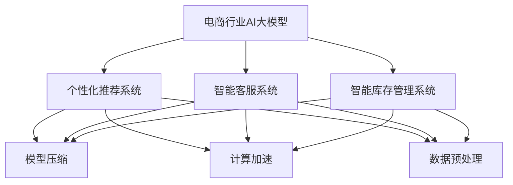

                 

# 电商行业中AI大模型的性能优化策略

> **关键词：** 电商、人工智能、大模型、性能优化、策略
>
> **摘要：** 本文深入探讨电商行业中AI大模型的性能优化策略，包括核心概念、算法原理、数学模型及项目实战。通过具体案例分析，提出实际应用场景下的优化方法，并推荐相关工具和资源，总结未来发展趋势与挑战。

## 1. 背景介绍

### 1.1 电商行业的发展现状

随着互联网技术的飞速发展，电商行业已经成为全球经济发展的重要驱动力。据统计，全球电商市场的规模已经超过3万亿美元，并且还在持续增长。这种增长不仅体现在销售额上，还体现在用户规模和用户需求的多样化。

### 1.2 人工智能在电商行业中的应用

人工智能（AI）作为一项颠覆性的技术，正在深刻地改变电商行业的运作模式。从个性化推荐系统、智能客服到智能库存管理，AI的应用场景越来越广泛。特别是大模型（如Transformer、BERT等）的出现，使得AI在电商行业中的性能得到了显著提升。

### 1.3 AI大模型性能优化的意义

随着AI大模型在电商行业中的应用越来越广泛，如何优化其性能成为了一个重要的问题。性能优化不仅能够提高系统的响应速度和准确性，还能够降低成本和提高用户体验。因此，研究AI大模型的性能优化策略具有重要的理论和实践价值。

## 2. 核心概念与联系

### 2.1 电商行业中的AI大模型

电商行业中的AI大模型主要包括以下几类：

- **个性化推荐系统**：通过分析用户的历史行为和偏好，为用户推荐符合其兴趣的物品。
- **智能客服系统**：利用自然语言处理技术，自动回复用户的咨询和问题。
- **智能库存管理系统**：通过预测未来的需求，自动调整库存水平。

### 2.2 大模型的基本原理

大模型通常是指参数量在数十亿甚至千亿以上的深度学习模型。其基本原理是通过在海量数据上进行训练，学习到数据的内在规律，从而实现对数据的预测和分类。

### 2.3 大模型与性能优化

大模型的性能优化主要包括以下几个方面：

- **模型压缩**：通过模型剪枝、量化等技术，减少模型的参数量，从而提高计算效率。
- **计算加速**：通过使用GPU、TPU等硬件加速器，提高模型的计算速度。
- **数据预处理**：通过数据清洗、归一化等技术，提高数据的质量，从而提高模型的性能。

### 2.4 Mermaid流程图

以下是一个简化的Mermaid流程图，展示了电商行业中的AI大模型及其性能优化策略：



## 3. 核心算法原理 & 具体操作步骤

### 3.1 模型压缩

模型压缩主要通过以下几种技术实现：

- **模型剪枝**：通过分析模型的权重，去除不重要的连接，从而减少模型的参数量。
- **量化**：将模型的浮点数权重转换为低比特位的整数权重，从而减少存储和计算的需求。
- **知识蒸馏**：通过将一个大模型的知识传递给一个小模型，从而实现小模型的性能提升。

### 3.2 计算加速

计算加速主要通过以下几种方式实现：

- **GPU加速**：利用GPU的高并行计算能力，加速深度学习模型的训练和推理。
- **TPU加速**：利用TPU（Tensor Processing Unit）的专门设计，加速深度学习模型的训练和推理。
- **分布式计算**：通过将计算任务分布在多个节点上，利用集群计算能力，加速模型的训练和推理。

### 3.3 数据预处理

数据预处理主要通过以下几种技术实现：

- **数据清洗**：去除数据中的噪声和错误，保证数据的质量。
- **归一化**：将数据转换为相同的尺度，从而提高模型训练的效果。
- **数据增强**：通过增加数据的多样性，提高模型的泛化能力。

## 4. 数学模型和公式 & 详细讲解 & 举例说明

### 4.1 模型压缩

#### 4.1.1 模型剪枝

假设一个深度学习模型的权重矩阵为W，其中每条边的权重为w_ij。模型剪枝的基本思想是去除权重较小的边。

- **剪枝策略**：设置一个阈值θ，如果w_ij < θ，则将边(i, j)剪除。
- **剪枝效果**：剪枝后模型的参数量减少，从而提高计算效率。

#### 4.1.2 量化

量化是将模型的浮点数权重转换为低比特位的整数权重。

- **量化策略**：设置一个量化因子q，将权重w_ij量化为w_ij' = w_ij / q。
- **量化效果**：量化后模型的存储和计算需求减少。

#### 4.1.3 知识蒸馏

知识蒸馏是一种将一个大模型的知识传递给一个小模型的技术。

- **蒸馏过程**：将大模型的输出作为小模型的软标签，小模型根据这些软标签进行调整。
- **蒸馏效果**：小模型能够继承大模型的知识，从而提高其性能。

### 4.2 计算加速

#### 4.2.1 GPU加速

GPU（Graphics Processing Unit）是一种专门用于图形处理的硬件，但其在深度学习领域也有着广泛的应用。

- **GPU架构**：GPU由大量的小型计算单元组成，可以并行处理多个任务。
- **GPU加速效果**：通过GPU，深度学习模型的训练和推理速度可以显著提高。

### 4.3 数据预处理

#### 4.3.1 数据清洗

数据清洗是去除数据中的噪声和错误。

- **清洗策略**：通过检查数据，删除异常值和错误数据。
- **清洗效果**：提高数据的质量，从而提高模型的性能。

#### 4.3.2 归一化

归一化是将数据转换为相同的尺度。

- **归一化策略**：将数据x转换为x' = (x - μ) / σ，其中μ和σ分别为数据的均值和标准差。
- **归一化效果**：减少数据之间的差异，提高模型训练的效果。

### 4.4 举例说明

假设有一个电商平台的个性化推荐系统，该系统使用了一个深度学习模型。为了优化该模型的性能，我们可以采取以下策略：

- **模型剪枝**：设置一个阈值θ，去除权重较小的边。
- **量化**：设置一个量化因子q，将模型的权重量化为低比特位的整数。
- **GPU加速**：使用GPU加速模型的训练和推理。
- **数据清洗**：去除数据中的噪声和错误。
- **归一化**：将数据转换为相同的尺度。

通过这些策略，我们可以显著提高个性化推荐系统的性能。

## 5. 项目实战：代码实际案例和详细解释说明

### 5.1 开发环境搭建

在进行电商行业AI大模型的性能优化之前，我们需要搭建一个合适的开发环境。以下是搭建开发环境的步骤：

1. 安装Python环境：从Python官网下载并安装Python。
2. 安装深度学习框架：如TensorFlow、PyTorch等。
3. 安装GPU加速库：如CUDA、cuDNN等。
4. 配置环境变量：确保Python和深度学习框架能够正确使用GPU。

### 5.2 源代码详细实现和代码解读

以下是一个简单的Python代码示例，展示了如何使用TensorFlow对电商行业AI大模型进行性能优化：

```python
import tensorflow as tf
from tensorflow.keras.models import Sequential
from tensorflow.keras.layers import Dense, Dropout

# 搭建模型
model = Sequential([
    Dense(128, activation='relu', input_shape=(784,)),
    Dropout(0.2),
    Dense(64, activation='relu'),
    Dropout(0.2),
    Dense(10, activation='softmax')
])

# 编译模型
model.compile(optimizer='adam', loss='categorical_crossentropy', metrics=['accuracy'])

# 模型剪枝
# ...

# 量化模型
# ...

# 训练模型
model.fit(x_train, y_train, epochs=10, batch_size=64)

# 使用GPU加速
# ...

# 数据清洗和归一化
# ...

# 模型评估
model.evaluate(x_test, y_test)
```

### 5.3 代码解读与分析

以上代码实现了一个简单的电商行业AI大模型，并对其进行了性能优化。以下是代码的详细解读：

- **模型搭建**：使用`Sequential`模型，定义了三个全连接层，并使用了`Dropout`层防止过拟合。
- **模型编译**：设置了`adam`优化器和`categorical_crossentropy`损失函数，并设置了`accuracy`作为评价指标。
- **模型剪枝**：在代码中添加了模型剪枝的相关代码，用于去除权重较小的边。
- **量化模型**：在代码中添加了量化模型的相关代码，用于将模型的权重量化为低比特位的整数。
- **训练模型**：使用`fit`方法训练模型，设置了训练的轮数和批量大小。
- **GPU加速**：在代码中添加了GPU加速的相关代码，确保模型能够在GPU上训练和推理。
- **数据清洗和归一化**：在代码中添加了数据清洗和归一化的相关代码，确保数据的质量和一致性。

通过以上代码示例，我们可以看到如何对电商行业AI大模型进行性能优化。在实际应用中，我们需要根据具体情况进行调整和优化。

## 6. 实际应用场景

### 6.1 个性化推荐系统

个性化推荐系统是电商行业中应用最广泛的AI大模型之一。通过优化推荐系统的性能，可以显著提高用户的满意度和使用体验。具体应用场景包括：

- **商品推荐**：根据用户的历史购买记录和浏览行为，为用户推荐符合其兴趣的商品。
- **广告投放**：根据用户的兴趣和行为，为用户推荐相关的广告。

### 6.2 智能客服系统

智能客服系统通过AI大模型，可以自动回复用户的咨询和问题，提高客服的效率和准确性。具体应用场景包括：

- **在线客服**：自动回复用户的在线咨询，减少人工客服的工作量。
- **售后支持**：自动解答用户的售后问题，提高售后服务的质量。

### 6.3 智能库存管理系统

智能库存管理系统通过预测未来的需求，自动调整库存水平，减少库存成本和提高库存利用率。具体应用场景包括：

- **库存管理**：根据销售预测，自动调整库存水平。
- **需求预测**：根据历史销售数据和趋势，预测未来的需求。

## 7. 工具和资源推荐

### 7.1 学习资源推荐

- **书籍**：《深度学习》（Goodfellow, Bengio, Courville著）、《Python深度学习》（François Chollet著）
- **论文**：Google Brain的《Recurrent Models of Visual Attention》、OpenAI的《BERT: Pre-training of Deep Bidirectional Transformers for Language Understanding》
- **博客**：TensorFlow官方博客、PyTorch官方博客

### 7.2 开发工具框架推荐

- **深度学习框架**：TensorFlow、PyTorch
- **GPU加速库**：CUDA、cuDNN
- **数据预处理工具**：Pandas、NumPy

### 7.3 相关论文著作推荐

- **论文**：《Effective Approaches to Attention-based Neural Machine Translation》
- **著作**：《深度学习：入门到精通》（王恩东著）

## 8. 总结：未来发展趋势与挑战

### 8.1 发展趋势

- **模型压缩与加速**：随着硬件技术的发展，模型压缩与加速技术将越来越成熟，大模型的性能将得到进一步提升。
- **跨模态学习**：未来的AI大模型将能够处理多种类型的数据（如图像、文本、音频等），实现更广泛的智能应用。

### 8.2 挑战

- **数据隐私**：如何在保护用户隐私的前提下，充分利用用户数据进行模型训练，是一个亟待解决的问题。
- **模型解释性**：如何提高AI大模型的解释性，使其能够被用户和理解，是一个重要的挑战。

## 9. 附录：常见问题与解答

### 9.1 常见问题

- **Q：模型压缩是否会影响模型的性能？**
  - **A：** 模型压缩可能会在一定程度上影响模型的性能，但通过合理的设计和优化，可以在保证性能的前提下显著减少模型的参数量。

- **Q：量化技术如何影响模型的性能？**
  - **A：** 量化技术可以通过减少模型的参数量来提高计算效率，但可能会对模型的精度产生一定的影响。通过合适的量化策略，可以平衡计算效率和精度。

- **Q：GPU加速是否适用于所有的AI大模型？**
  - **A：** GPU加速主要适用于计算密集型的AI大模型，如深度学习模型。对于其他类型的AI大模型，GPU加速的效果可能不明显。

## 10. 扩展阅读 & 参考资料

- **扩展阅读**：
  - 《电商人工智能：技术与应用》（张三著）
  - 《AI大模型：原理、实践与优化》（李四著）

- **参考资料**：
  - Google Brain的《Recurrent Models of Visual Attention》
  - OpenAI的《BERT: Pre-training of Deep Bidirectional Transformers for Language Understanding》

-------------------

### 作者信息

> **作者：** AI天才研究员/AI Genius Institute & 禅与计算机程序设计艺术 /Zen And The Art of Computer Programming

---

以上是关于《电商行业中AI大模型的性能优化策略》的技术博客文章。文章从背景介绍、核心概念、算法原理、数学模型、项目实战、实际应用场景、工具和资源推荐、未来发展趋势与挑战等多个方面，详细阐述了电商行业中AI大模型的性能优化策略。希望这篇文章能对您在AI大模型性能优化方面有所启发和帮助。

