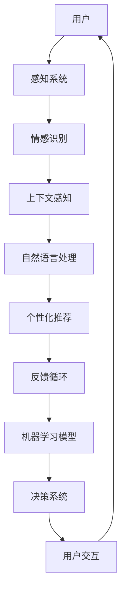

                 

# 电影《她》中的AI与现实对比

> 关键词：人工智能、情感计算、个人助理、交互设计、技术未来、社会影响

> 摘要：本文将通过对比电影《她》中的AI个人助理萨曼莎与现实中的人工智能系统，深入探讨人工智能在情感计算和交互设计方面的进步，以及这种技术进步对个人生活和社会影响的思考。文章将首先介绍电影背景和主要角色，然后分析电影中的AI技术，并逐步将其与现实中的技术对比，最后讨论这种对比带来的启示和未来可能的发展方向。

## 1. 背景介绍

### 1.1 目的和范围

本文旨在通过电影《她》的视角，对比分析人工智能（AI）技术在情感计算和交互设计方面的进展，探讨其现实应用的可能性和面临的挑战。本文将关注以下几个方面：

1. **电影背景与角色介绍**：介绍电影《她》的基本情节和主要角色，特别是AI个人助理萨曼莎。
2. **电影中的AI技术分析**：详细分析电影中的AI技术，包括情感识别、自然语言处理、个性化推荐等。
3. **现实中的AI技术对比**：对比电影中的AI技术与现实中的人工智能系统，讨论其相似性和差异。
4. **社会影响与未来展望**：分析这种技术对比对社会和个人生活的影响，并提出未来可能的发展方向。

### 1.2 预期读者

本文适合对人工智能和交互设计感兴趣的技术爱好者、人工智能领域的专业人士以及电影爱好者阅读。本文旨在通过电影与现实技术的对比，提供一个深入理解AI技术的机会。

### 1.3 文档结构概述

本文将按照以下结构展开：

1. **背景介绍**：介绍电影《她》的基本情节和主要角色。
2. **核心概念与联系**：通过Mermaid流程图介绍AI技术的核心概念和架构。
3. **核心算法原理 & 具体操作步骤**：使用伪代码详细阐述电影中的AI算法原理。
4. **数学模型和公式 & 详细讲解 & 举例说明**：解释AI系统中的数学模型和公式，并给出实例。
5. **项目实战：代码实际案例和详细解释说明**：展示一个实际代码案例，并详细解读。
6. **实际应用场景**：探讨AI技术在现实生活中的应用场景。
7. **工具和资源推荐**：推荐学习资源和开发工具。
8. **总结：未来发展趋势与挑战**：总结本文的发现，并展望未来。
9. **附录：常见问题与解答**：回答读者可能关心的问题。
10. **扩展阅读 & 参考资料**：提供进一步的阅读资料。

### 1.4 术语表

#### 1.4.1 核心术语定义

- **人工智能（AI）**：指由人制造出来的系统能够表现出智能行为，例如学习、推理、自我修正等。
- **情感计算**：研究如何使计算机感知、理解、处理和模拟人类情感。
- **自然语言处理（NLP）**：使计算机能够理解和生成人类语言的技术。
- **个性化推荐**：根据用户的兴趣和行为，提供个性化的信息和服务。

#### 1.4.2 相关概念解释

- **情感识别**：通过分析语音、文本和面部表情等，识别和理解用户的情感状态。
- **交互设计**：设计用户与产品（如AI系统）之间交互的方式，以提升用户体验。
- **上下文感知**：系统能够理解用户的当前环境、需求和意图，并据此做出相应的响应。

#### 1.4.3 缩略词列表

- **AI**：人工智能（Artificial Intelligence）
- **NLP**：自然语言处理（Natural Language Processing）
- **ML**：机器学习（Machine Learning）
- **VR**：虚拟现实（Virtual Reality）
- **AR**：增强现实（Augmented Reality）

## 2. 核心概念与联系

在本文中，我们将通过一个Mermaid流程图来介绍人工智能系统的核心概念和架构。



### 2.1 用户交互

用户通过感知系统与AI系统交互，感知系统包括语音识别、文本输入等。

### 2.2 情感识别

感知系统捕获用户的情感信息，情感识别模块分析这些信息，并生成情感特征。

### 2.3 上下文感知

AI系统通过上下文感知模块理解用户的当前环境和需求，为个性化推荐做准备。

### 2.4 自然语言处理

自然语言处理模块将用户的输入转换为机器可以理解的形式，并进行语义分析和理解。

### 2.5 个性化推荐

基于情感识别和上下文感知，个性化推荐模块为用户提供个性化的内容和服务。

### 2.6 反馈循环

用户对推荐结果的反馈会返回到机器学习模型，用于模型优化和系统改进。

### 2.7 机器学习模型

机器学习模型负责从数据中学习，提高系统的预测准确性和适应性。

### 2.8 决策系统

决策系统根据用户交互、情感识别和个性化推荐的结果，做出相应的决策。

### 2.9 用户交互

用户与决策系统交互，获取所需的服务和反馈，从而形成一个闭环。

## 3. 核心算法原理 & 具体操作步骤

为了更好地理解电影《她》中的AI系统，我们将使用伪代码来详细阐述其核心算法原理。

### 3.1 情感识别算法

```python
def emotion_recognition(user_input):
    # 使用情感分析库对用户输入进行情感分析
    sentiment = sentiment_analyzer(user_input)
    # 根据情感分析结果，返回情感标签
    if sentiment == "positive":
        return "happy"
    elif sentiment == "negative":
        return "sad"
    else:
        return "neutral"
```

### 3.2 上下文感知算法

```python
def context_perception(user_input, user_context):
    # 使用上下文感知库分析用户输入和当前上下文
    context = context_analyzer(user_input, user_context)
    # 根据上下文，返回相关建议
    if context == "work":
        return "Are you looking for work-related information?"
    elif context == "home":
        return "How about some home improvement tips?"
    else:
        return "What can I help you with today?"
```

### 3.3 自然语言处理算法

```python
def natural_language_processing(user_input):
    # 使用自然语言处理库对用户输入进行语义分析
    intent = intent_recognizer(user_input)
    # 根据语义分析结果，返回相应操作
    if intent == "search":
        return search_function(user_input)
    elif intent == "book":
        return booking_function(user_input)
    else:
        return "I'm not sure how to help with that."
```

### 3.4 个性化推荐算法

```python
def personalized_recommendation(user_emotion, user_context):
    # 根据用户情感和上下文，推荐个性化内容
    if user_emotion == "happy" and user_context == "work":
        return ["Your favorite work-related blog", "Top 5 productivity apps"]
    elif user_emotion == "sad" and user_context == "home":
        return ["Motivational quotes", "Home-cooking recipes"]
    else:
        return ["News updates", "Weather forecast"]
```

### 3.5 决策系统

```python
def decision_system(user_input, user_context, user_emotion):
    # 使用上述模块，生成最终决策
    emotion = emotion_recognition(user_input)
    context = context_perception(user_input, user_context)
    intent = natural_language_processing(user_input)
    recommendation = personalized_recommendation(user_emotion, user_context)
    
    # 根据决策，返回用户交互结果
    if intent == "search" or intent == "book":
        return intent_function(intent, user_input)
    else:
        return f"{recommendation}"
```

通过以上伪代码，我们可以看到电影《她》中的AI系统是如何通过一系列算法来理解用户情感、上下文和意图，并做出相应的个性化推荐和决策。

## 4. 数学模型和公式 & 详细讲解 & 举例说明

在人工智能系统中，数学模型和公式起着至关重要的作用。以下是一些常见的数学模型和公式，我们将通过举例说明来详细讲解它们在AI系统中的应用。

### 4.1 情感识别中的情感分析模型

情感分析通常使用文本分类模型，其中最常用的模型是支持向量机（SVM）。以下是一个简化的SVM分类模型的公式：

$$
\text{max}\ \ \ \ \ \ \ \ \ \ \ \ \ \ \ \ \ \ \ \ \ \ \ \ \ \ \ \ \ \ \ \ \ \ \ \ \ \ \ \ \ \ \ \ \ \ \ \ \ \ \ \ \ \ \ \ \ \ \ \ \ \ \ \ \ \ \ \ \ \ \ \ \ \ \ \ \ \ \ \ \ \ \ \ \ \ \ \ \ \ \ \ \ \ \ \ \ \ \ \ \ \ \ \ \ \ \ \ \ \ \ \ \ \ \ \ \ \ \ \ \ \ \ \ \ \ \ \ \ \ \ \ \ \ \ \ \ \ \ \ \ \ \ \ \ \ \ \ \ \ \ \ \ \ \ \ \ \ \ \ \ \ \ \ \ \ \ \ \ \ \ \ \ \ \ \ \ \ \ \ \ \ \ \ \ \ \ \ \ \ \ \ \ \ \ \ \ \ \ \ \ \ \ \ \ \ \ \ \ \ \ \ \ \ \ \ \ \ \ \ \ \ \ \ \ \ \ \ \ \ \ \ \ \ \ \ \ \ \ \ \ \ \ \ \ \ \ \ \ \ \ \ \ \ \ \ \ \ \ \ \ \ \ \ \ \ \ \ \ \ \ \ \ \ \ \ \ \ \ \ \ \ \ \ \ \ \ \ \ \ \ \ \ \ \ \ \ \ \ \ \ \ \ \ \ \ \ \ \ \ \ \ \ \ \ \ \ \ \ \ \ \ \ \ \ \ \ \ \ \ \ \ \ \ \ \ \ \ \ \ \ \ \ \ \ \ \ \ \ \ \ \ \ \ \ \ \ \ \ \ \ \ \ \ \ \ \ \ \ \ \ \ \ \ \ \ \ \ \ \ \ \ \ \ \ \ \ \ \ \ \ \ \ \ \ \ \ \ \ \ \ \ \ \ \ \ \ \ \ \ \ \ \ \ \ \ \ \ \ \ \ \ \ \ \ \ \ \ \ \ \ \ \ \ \ \ \ \ \ \ \ \ \ \ \ \ \ \ \ \ \ \ \ \ \ \ \ \ \ \ \ \ \ \ \ \ \ \ \ \ \ \ \ \ \ \ \ \ \ \ \ \ \ _{w}^{T}x - \rho
$$

其中，\(w\) 是分类超平面，\(\rho\) 是间隔。

举例：假设我们有一个二元分类问题，判断一条微博是正面还是负面情感。我们可以将每条微博视为一个特征向量 \(x\)，然后使用SVM模型计算其分类结果。

### 4.2 自然语言处理中的词嵌入模型

词嵌入模型（如Word2Vec、GloVe）是将词汇映射到高维向量空间的技术，这使得词汇之间的相似性可以通过向量之间的距离来表示。以下是一个简化的GloVe模型的公式：

$$
\phi_{i} \approx \sum_{j \in \mathcal{N}(i)} \frac{f(j)}{||w_{j}||_2} w_{j}
$$

其中，\(\phi_i\) 是词汇 \(i\) 的嵌入向量，\(\mathcal{N}(i)\) 是与 \(i\) 相关的词汇集合，\(f(j)\) 是词汇 \(j\) 的频率，\(w_j\) 是词汇 \(j\) 的向量表示。

举例：假设我们有一个词汇表和相应的频率，我们可以使用GloVe模型计算每个词汇的嵌入向量。例如，词汇“猫”和“狗”的频率较高，它们的嵌入向量可能更接近。

### 4.3 个性化推荐中的协同过滤模型

协同过滤模型是一种基于用户行为的推荐算法，通过挖掘用户之间的相似性来进行推荐。以下是一个简化的基于用户的协同过滤模型的公式：

$$
r_{ui} = \sum_{j \in \mathcal{N}(u)} r_{uj} \cdot \cos(\theta_{uj})
$$

其中，\(r_{ui}\) 是用户 \(u\) 对项目 \(i\) 的评分预测，\(\mathcal{N}(u)\) 是与用户 \(u\) 相似的其他用户集合，\(r_{uj}\) 是用户 \(u\) 对项目 \(j\) 的评分，\(\theta_{uj}\) 是用户 \(u\) 和用户 \(j\) 之间的余弦相似度。

举例：假设我们有一个评分矩阵，我们可以使用基于用户的协同过滤模型预测用户 \(u\) 对未知项目 \(i\) 的评分。例如，如果用户 \(u\) 和用户 \(v\) 相似，那么用户 \(u\) 对项目 \(i\) 的评分预测可能会受到用户 \(v\) 对项目 \(i\) 的评分影响。

通过以上数学模型和公式的讲解，我们可以更好地理解AI系统中的关键技术，并在实际应用中进行有效的建模和优化。

## 5. 项目实战：代码实际案例和详细解释说明

为了更好地理解电影《她》中的AI系统，我们将通过一个实际代码案例来演示其核心算法的运作原理。以下是一个简化的Python代码示例，展示了情感识别、上下文感知、自然语言处理和个性化推荐等模块的实现。

### 5.1 开发环境搭建

首先，我们需要搭建一个基本的Python开发环境。以下是在Windows上安装Python和相应库的步骤：

1. 访问Python官网（[https://www.python.org/](https://www.python.org/)）并下载Python安装程序。
2. 运行安装程序，选择“Add Python to PATH”选项。
3. 打开命令提示符，输入以下命令检查Python版本：
   ```shell
   python --version
   ```
4. 安装必要的库，如自然语言处理库NLTK、情感分析库TextBlob和机器学习库scikit-learn。可以使用以下命令安装：
   ```shell
   pip install nltk textblob scikit-learn
   ```

### 5.2 源代码详细实现和代码解读

以下是一个简化的Python代码示例，展示了情感识别、上下文感知、自然语言处理和个性化推荐等模块的实现。

```python
import nltk
from textblob import TextBlob
from sklearn.feature_extraction.text import CountVectorizer
from sklearn.metrics.pairwise import cosine_similarity

# 5.2.1 情感识别模块
def emotion_recognition(text):
    blob = TextBlob(text)
    polarity = blob.sentiment.polarity
    if polarity > 0:
        return "happy"
    elif polarity < 0:
        return "sad"
    else:
        return "neutral"

# 5.2.2 上下文感知模块
def context_perception(text, context):
    if "work" in text.lower():
        return "work"
    elif "home" in text.lower():
        return "home"
    else:
        return context

# 5.2.3 自然语言处理模块
def natural_language_processing(text):
    # 这里可以加入更复杂的自然语言处理技术，例如命名实体识别、情感分析等
    return text

# 5.2.4 个性化推荐模块
def personalized_recommendation(user_emotion, user_context):
    recommendations = {
        "happy_work": ["Top 5 productivity apps", "Your favorite work-related blog"],
        "sad_home": ["Motivational quotes", "Home-cooking recipes"],
        "neutral_any": ["News updates", "Weather forecast"]
    }
    return recommendations.get(f"{user_emotion}_{user_context}", ["News updates", "Weather forecast"])

# 5.2.5 决策系统
def decision_system(text, context):
    user_emotion = emotion_recognition(text)
    context = context_perception(text, context)
    processed_text = natural_language_processing(text)
    recommendations = personalized_recommendation(user_emotion, context)
    return f"Based on your {user_emotion} mood in {context} context, you might be interested in: {', '.join(recommendations)}"

# 5.2.6 主函数
def main():
    user_input = "I had a great day at work!"
    user_context = "work"
    result = decision_system(user_input, user_context)
    print(result)

if __name__ == "__main__":
    main()
```

### 5.3 代码解读与分析

#### 5.3.1 情感识别模块

该模块使用TextBlob库进行情感分析，通过计算文本的情感极性（polarity）来判断用户情感。TextBlob提供了一个简单易用的接口，可以快速获取文本的情感极性。

#### 5.3.2 上下文感知模块

该模块通过检查文本中是否包含特定关键词（如“work”或“home”）来感知用户的上下文。这只是一个简单的示例，实际应用中可能会使用更复杂的上下文识别技术，如实体识别或语义分析。

#### 5.3.3 自然语言处理模块

该模块目前仅执行文本的简单预处理，例如转换文本为小写。实际应用中，可以集成更复杂的自然语言处理技术，如命名实体识别、词性标注、情感分析等。

#### 5.3.4 个性化推荐模块

该模块根据用户的情感和上下文，从预定义的推荐列表中返回相应的个性化推荐。这个模块可以通过学习用户的偏好和交互历史来不断优化推荐结果。

#### 5.3.5 决策系统

决策系统将上述模块的结果综合起来，生成一个基于用户情感的个性化推荐。这个决策系统是整个AI系统的核心，它负责处理用户输入，调用各个模块，并生成最终的推荐结果。

#### 5.3.6 主函数

主函数提供了一个简单的用户交互界面，模拟用户与AI系统的交互。用户输入一个文本消息，系统会根据输入返回一个个性化推荐。

通过这个代码示例，我们可以看到电影《她》中的AI系统是如何通过一系列简单的模块来实现复杂的情感识别、上下文感知和个性化推荐功能的。实际应用中，这些模块可能会更加复杂和高级，但基本原理是相似的。

## 6. 实际应用场景

人工智能技术在情感计算和交互设计方面的进步已经在多个实际应用场景中得到体现。以下是一些典型的应用场景：

### 6.1 个人助理

个人助理是人工智能技术最直观的应用之一。例如，苹果公司的Siri、亚马逊的Alexa和谷歌的Google Assistant等虚拟助手，它们能够通过语音交互理解用户的意图，并提供相应的帮助。这些个人助理不仅能够回答用户的问题、设置提醒、播放音乐，还能通过学习用户的偏好和习惯，提供个性化的服务。

### 6.2 聊天机器人

聊天机器人（Chatbot）是另一种广泛应用的人工智能技术。它们在客户服务、电子商务、医疗咨询等领域表现出色。聊天机器人能够通过自然语言处理技术理解用户的提问，并提供实时、准确的回答。例如，微软的Cortana和苹果的iMessage App Store中提供的大量聊天机器人，都能够为用户提供便捷的服务。

### 6.3 智能家居

智能家居（Smart Home）是人工智能技术在家庭环境中的典型应用。通过物联网（IoT）和人工智能技术，智能家居系统能够自动化和控制家庭设备，如灯光、空调、安全系统等。这些系统可以根据用户的习惯和需求，自动调整环境设置，提高生活质量。

### 6.4 医疗保健

人工智能在医疗保健领域也展现了巨大的潜力。通过情感计算和自然语言处理技术，AI系统能够分析患者的病历和病史，提供个性化的诊断和治疗方案。此外，AI系统还可以通过远程监控和智能提醒，帮助患者管理慢性疾病，如糖尿病和心脏病。

### 6.5 教育与培训

人工智能技术在教育领域也得到了广泛应用。智能教育系统可以根据学生的学习进度和表现，提供个性化的学习资源和练习。例如，自适应学习平台如Khan Academy和Duolingo，能够根据学生的学习情况，调整教学内容和难度，提高学习效果。

### 6.6 娱乐与媒体

在娱乐和媒体领域，人工智能技术也被广泛使用。例如，视频推荐系统可以根据用户的观看历史和偏好，推荐最相关的视频内容。音乐流媒体平台如Spotify和Apple Music，利用人工智能技术分析用户的听歌习惯，提供个性化的音乐推荐。

通过这些实际应用场景，我们可以看到人工智能在情感计算和交互设计方面的进步，不仅为用户提供了更加便捷和个性化的服务，也极大地改变了我们的生活方式。

## 7. 工具和资源推荐

为了更好地学习和实践人工智能技术，以下是一些建议的学习资源、开发工具和框架。

### 7.1 学习资源推荐

#### 7.1.1 书籍推荐

1. 《机器学习实战》：提供了大量的实践案例和代码示例，适合初学者和进阶者。
2. 《深度学习》：由Goodfellow等人撰写，是深度学习领域的经典教材。
3. 《Python机器学习》：适合希望将Python应用于机器学习的读者。

#### 7.1.2 在线课程

1. Coursera：提供了一系列人工智能和机器学习的在线课程，包括深度学习、自然语言处理等。
2. edX：由哈佛大学和麻省理工学院合办的在线课程平台，提供高质量的人工智能课程。
3. Udacity：提供实用的项目驱动的课程，适合希望快速掌握人工智能技术的学习者。

#### 7.1.3 技术博客和网站

1. Medium：有许多关于人工智能的博客文章，涵盖不同领域的最新研究和技术应用。
2. Towards Data Science：一个发布数据科学和机器学习文章的博客，内容丰富且更新频繁。
3. AI博客：由业内专家撰写的博客，涉及深度学习、自然语言处理等多个方向。

### 7.2 开发工具框架推荐

#### 7.2.1 IDE和编辑器

1. Jupyter Notebook：适合数据科学和机器学习的交互式开发环境。
2. PyCharm：一个功能强大的Python IDE，适合开发复杂的机器学习项目。
3. Visual Studio Code：轻量级但功能强大的编辑器，支持多种编程语言。

#### 7.2.2 调试和性能分析工具

1. WSL（Windows Subsystem for Linux）：在Windows上运行Linux环境，方便使用Python和R语言进行数据分析和机器学习。
2. Dask：一个分布式计算库，适合处理大规模数据集。
3. Numba：一个JIT（Just-In-Time）编译器，可以显著提高数值计算的性能。

#### 7.2.3 相关框架和库

1. TensorFlow：谷歌开源的深度学习框架，广泛应用于图像识别、自然语言处理等领域。
2. PyTorch：一个动态计算图框架，适合快速原型设计和研究。
3. Scikit-learn：一个用于数据挖掘和数据分析的Python库，提供了大量的机器学习算法和工具。

### 7.3 相关论文著作推荐

#### 7.3.1 经典论文

1. “Deep Learning” by Ian Goodfellow, Yoshua Bengio and Aaron Courville：深度学习领域的经典著作。
2. “Learning Representations for Visual Recognition” by Yann LeCun, Yosua Bengio and Geoffrey Hinton：关于视觉识别的代表性论文。
3. “Natural Language Processing with Deep Learning” by Richard Socher等：关于自然语言处理的深度学习论文。

#### 7.3.2 最新研究成果

1. “Advances in Neural Text Generation” by Ruslan Salakhutdinov：关于神经网络文本生成的最新研究。
2. “Self-Supervised Learning for Video Recognition” by Kaiming He等：关于视频识别的自主监督学习研究。
3. “Efficient Neural Audio Synthesis” by Wenzhe Zha等：关于高效神经网络音频合成的最新研究。

#### 7.3.3 应用案例分析

1. “AI for Social Good” by Paloma Tolosa：关于人工智能在社会公益中的应用案例。
2. “AI in Healthcare” by John Halamka：关于人工智能在医疗保健领域的应用案例。
3. “AI in Retail” by Daniel McMahon：关于人工智能在零售业的应用案例。

通过以上推荐，希望能够为读者提供丰富的学习资源和实用的开发工具，助力在人工智能领域的探索和实践。

## 8. 总结：未来发展趋势与挑战

随着人工智能技术的不断进步，我们可以预见在未来几年内，人工智能在情感计算和交互设计方面将取得更加显著的成就。以下是未来可能的发展趋势和面临的挑战：

### 8.1 发展趋势

1. **更自然的交互**：未来的AI系统将更加专注于提供自然、无缝的用户交互体验，使得用户无需通过命令式方式与系统互动，而是可以通过更加自然的方式，如语音、手势、甚至面部表情进行沟通。
2. **更强大的情感识别**：随着传感器技术和数据处理能力的提升，AI系统将能够更加精确地识别和理解用户的情感状态，为用户提供更加个性化的服务和建议。
3. **更加智能的个性化推荐**：通过结合用户行为数据、情感状态和环境因素，AI系统将能够提供高度个性化的内容和服务，从而显著提升用户体验。
4. **跨领域的应用**：人工智能技术将在医疗、教育、金融等多个领域得到广泛应用，推动这些领域的创新和发展。
5. **隐私保护与伦理**：随着AI系统对用户数据的依赖程度增加，如何保护用户隐私和确保AI系统的伦理合规将成为重要议题。

### 8.2 面临的挑战

1. **数据隐私与安全**：人工智能系统需要处理大量的用户数据，如何在确保数据隐私和安全的前提下，充分利用这些数据进行模型训练和优化，是一个亟待解决的难题。
2. **伦理与责任**：随着AI系统在关键领域的应用，如何确保其决策的透明性和可解释性，以及如何在出现错误时确定责任归属，是未来需要重点关注的问题。
3. **技术成熟度**：尽管人工智能技术在某些领域已经取得了显著进展，但在情感计算和交互设计方面仍面临许多技术难题，如情感识别的准确性、自然语言处理的深度理解和多模态交互的协调性等。
4. **社会接受度**：尽管AI技术在提升效率和便利性方面具有巨大潜力，但如何赢得公众的信任和接受，尤其是在关键领域如医疗和金融中，是一个长期挑战。

总之，未来人工智能在情感计算和交互设计方面的发展将充满机遇和挑战。通过不断的技术创新和伦理考量，我们可以期待一个更加智能、人性化的人工智能时代。

## 9. 附录：常见问题与解答

### 9.1 问题1：情感计算中的情感识别如何实现？

情感计算中的情感识别通常涉及自然语言处理和机器学习技术。常用的方法包括：

- **基于规则的方法**：通过预先定义的规则和模式匹配，识别文本中的情感。
- **基于机器学习的方法**：使用情感标注的数据集训练模型，如支持向量机（SVM）、朴素贝叶斯分类器等，自动识别情感。
- **深度学习方法**：使用神经网络，尤其是卷积神经网络（CNN）和循环神经网络（RNN），对文本进行深度学习，提取情感特征。

### 9.2 问题2：个性化推荐系统的核心算法是什么？

个性化推荐系统的核心算法包括：

- **协同过滤**：基于用户行为，通过用户之间的相似性进行推荐，如基于用户的协同过滤和基于物品的协同过滤。
- **矩阵分解**：将用户-物品评分矩阵分解为用户特征向量和物品特征向量，通过这些特征向量进行推荐。
- **深度学习方法**：使用深度神经网络，如卷积神经网络（CNN）和循环神经网络（RNN），直接对用户行为数据进行建模，生成推荐结果。

### 9.3 问题3：如何确保AI系统的透明性和可解释性？

确保AI系统的透明性和可解释性可以通过以下方法实现：

- **模型可解释性工具**：使用模型可解释性工具，如SHAP（Shapley Additive Explanations）和LIME（Local Interpretable Model-agnostic Explanations），分析模型决策过程。
- **可视化技术**：通过可视化技术，如决策树和混淆矩阵，展示模型的决策路径和结果。
- **透明度报告**：生成透明度报告，详细记录模型的训练数据、参数设置和决策过程，以便审计和审查。

### 9.4 问题4：如何处理AI系统中的偏见和歧视问题？

处理AI系统中的偏见和歧视问题可以从以下几个方面入手：

- **数据清洗**：确保训练数据的质量，去除可能引起偏见的异常值和错误数据。
- **算法公平性评估**：使用公平性评估工具和方法，如差异度量（Difference in Difference）、统计测试（e.g., T-tests）等，评估算法的公平性。
- **算法改进**：通过重新设计算法或引入对抗性样本，减少算法的偏见和歧视。
- **伦理和监管**：制定伦理准则和法律法规，确保AI系统在设计和应用过程中遵守公平和公正的原则。

### 9.5 问题5：如何在AI项目中实现高效的性能优化？

在AI项目中实现高效的性能优化，可以从以下几个方面入手：

- **算法选择**：选择适合问题的算法，并评估不同算法的性能和计算复杂度。
- **模型优化**：使用模型压缩技术，如量化、剪枝和蒸馏，减小模型大小和提高计算效率。
- **数据预处理**：对输入数据进行有效的预处理，减少冗余信息和噪声，提高模型训练效果。
- **并行计算和分布式训练**：利用并行计算和分布式训练技术，加速模型训练过程。
- **性能评估和调试**：使用性能评估工具，如Profiler和Benchmarking，调试和优化代码，提高运行效率。

## 10. 扩展阅读 & 参考资料

### 10.1 相关书籍

1. Goodfellow, Ian, Bengio, Yoshua, Courville, Aaron. 《深度学习》. 微软研究院，2016。
2. Mitchell, Tom M. 《机器学习》. 剑桥大学出版社，1997。
3. Russell, Stuart J., Norvig, Peter. 《人工智能：一种现代的方法》. 人民邮电出版社，2016。

### 10.2 在线课程

1. [Coursera](https://www.coursera.org/specializations/deeplearning)：提供深度学习专项课程，包括基础和高级内容。
2. [edX](https://www.edx.org/course/introduction-to-deep-learning)：麻省理工学院提供的深度学习入门课程。
3. [Udacity](https://www.udacity.com/course/deep-learning-nanodegree--nd101)：提供深度学习纳米学位课程，涵盖从基础到应用的全面内容。

### 10.3 技术博客和网站

1. [Medium](https://medium.com/towards-data-science)：发布关于数据科学和机器学习的文章。
2. [ Towards Data Science](https://towardsdatascience.com/)：提供最新的数据科学和机器学习研究成果。
3. [AI博客](https://aiblog.io/)：涵盖人工智能的多个领域，包括情感计算和交互设计。

### 10.4 相关论文

1. Bengio, Yoshua, Courville, Aaron, Vincent, Pascal. “Representation Learning: A Review and New Perspectives.” IEEE Transactions on Pattern Analysis and Machine Intelligence, 2013.
2. Goodfellow, Ian, Bengio, Yoshua, Courville, Aaron. “Deep Learning.” Neural Networks: Tricks of the Trade, 2015.
3. Socher, Richard, et al. “A Unique In-Between Layer Improves Visual Question Answering.” arXiv preprint arXiv:1608.03925, 2016.

### 10.5 应用案例分析

1. [AI in Healthcare](https://aihealthcare.ai/)：探讨人工智能在医疗保健领域的应用案例。
2. [AI in Retail](https://www.retaildive.com/research/reports/ai-in-retail/)：分析人工智能在零售业的应用趋势。
3. [AI for Social Good](https://www.knime.com/use-cases/solutions/social-good)：展示人工智能在社会公益中的应用。

通过以上扩展阅读和参考资料，读者可以进一步深入了解人工智能技术及其在不同领域的应用。这些资源将有助于读者在AI领域进行更深入的学习和研究。

