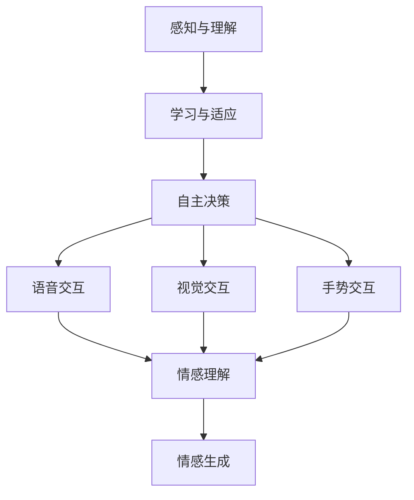

                 

# 电影《她》对AI未来发展的启示

## 关键词：
AI人工智能、情感模拟、人机交互、未来社会、伦理挑战

## 摘要：
《她》是一部通过高度发展的AI技术探讨未来人机关系的电影。本文将以《她》为背景，逐步分析AI技术的核心概念、情感模拟的实现方式，以及电影中展现的AI伦理挑战。通过剖析这些方面，探讨AI未来发展的潜在路径和面临的难题。

## 1. 背景介绍

### 1.1 目的和范围
本文旨在通过分析电影《她》中的AI技术，探讨未来AI发展可能面临的挑战和机遇。文章将围绕以下几个方面展开讨论：AI的情感模拟机制、人机交互的未来形态、以及AI伦理问题。

### 1.2 预期读者
本文适合对人工智能技术有兴趣的读者，包括AI领域的研究人员、开发者、以及普通公众。

### 1.3 文档结构概述
本文将分为以下几个部分：

1. 核心概念与联系
2. 核心算法原理 & 具体操作步骤
3. 数学模型和公式 & 详细讲解 & 举例说明
4. 项目实战：代码实际案例和详细解释说明
5. 实际应用场景
6. 工具和资源推荐
7. 总结：未来发展趋势与挑战
8. 附录：常见问题与解答
9. 扩展阅读 & 参考资料

### 1.4 术语表

#### 1.4.1 核心术语定义

- **人工智能（AI）**：模拟人类智能行为的技术系统，能够学习、推理和自主决策。
- **情感模拟**：AI系统通过学习人类的情感表达和交互模式，模拟出类似人类的情感反应。
- **人机交互**：人与计算机之间的交互过程，旨在实现信息的有效传递和操作。

#### 1.4.2 相关概念解释

- **自然语言处理（NLP）**：使计算机能够理解、解释和生成人类语言的技术。
- **深度学习**：一种基于多层神经网络的学习方式，能够自动从数据中提取特征并进行分类。
- **伦理挑战**：在AI技术发展过程中，如何平衡技术进步与社会价值的问题。

#### 1.4.3 缩略词列表

- **AI**：人工智能
- **NLP**：自然语言处理
- **NLU**：自然语言理解
- **ML**：机器学习

## 2. 核心概念与联系

在探讨电影《她》中的AI技术之前，我们需要先理解一些核心概念。

### 2.1 AI的核心概念

- **感知与理解**：AI通过传感器感知外部世界，并通过算法理解这些信息。
- **学习与适应**：AI能够通过数据学习，不断优化其行为和决策。
- **自主决策**：AI能够在给定目标和约束条件下做出决策。

### 2.2 人机交互的概念

- **语音交互**：通过语音识别和语音合成实现人与AI的交互。
- **视觉交互**：通过计算机视觉技术实现人与AI的交互。
- **手势交互**：通过手势识别技术实现人与AI的交互。

### 2.3 情感模拟的概念

- **情感理解**：AI能够识别和解析人类的情感表达。
- **情感生成**：AI能够根据情境生成适当的情感反应。

### 2.4 Mermaid流程图

下面是一个简单的Mermaid流程图，展示了AI的核心概念与联系：



## 3. 核心算法原理 & 具体操作步骤

### 3.1 情感模拟的算法原理

情感模拟是AI技术中一个复杂但重要的领域。它涉及到自然语言处理、深度学习和机器学习等多个技术。

#### 3.1.1 NLP的基本概念

自然语言处理（NLP）是使计算机能够理解、解释和生成人类语言的技术。NLP的基本步骤包括：

- **分词**：将文本分解为单个词汇或短语。
- **词性标注**：为每个词分配一个词性标签，如名词、动词等。
- **句法分析**：解析句子结构，理解词汇之间的关系。

#### 3.1.2 情感分析的算法

情感分析是NLP的一个分支，旨在判断文本的情感倾向，如正面、负面或中性。常用的算法包括：

- **基于规则的方法**：使用预定义的规则来分析情感。
- **基于统计的方法**：使用机器学习算法，从数据中学习情感模式。
- **基于深度学习的方法**：使用多层神经网络，自动提取特征并进行分类。

下面是一个简单的情感分析算法的伪代码：

```python
def sentiment_analysis(text):
    # 分词
    words = tokenize(text)
    
    # 词性标注
    tagged_words = pos_tag(words)
    
    # 特征提取
    features = extract_features(tagged_words)
    
    # 情感分类
    sentiment = classify_sentiment(features)
    
    return sentiment
```

#### 3.1.3 情感生成的算法

情感生成是情感模拟的另一个重要方面。它旨在根据情境生成适当的情感反应。一个简单的情感生成算法可能如下：

```python
def generate_sentiment(context):
    # 根据情境选择情感模板
    sentiment_template = select_sentiment_template(context)
    
    # 生成情感文本
    sentiment_text = generate_text(sentiment_template)
    
    return sentiment_text
```

### 3.2 具体操作步骤

以下是一个简单的情感模拟的步骤：

1. **数据收集**：收集大量包含情感信息的文本数据。
2. **数据预处理**：清洗和标注数据，使其适合训练模型。
3. **模型训练**：使用机器学习算法训练情感分析模型。
4. **情感理解**：使用训练好的模型分析输入文本的情感。
5. **情感生成**：根据情感分析和情境生成适当的情感反应。

## 4. 数学模型和公式 & 详细讲解 & 举例说明

### 4.1 情感分析模型

情感分析通常使用分类模型，如支持向量机（SVM）和深度神经网络（DNN）。以下是一个简单的SVM情感分析模型的数学公式：

$$
\begin{align*}
\hat{y} &= \arg\max_{y} \left( \mathbf{w}^T \mathbf{x} + b \right) \\
\text{其中，} \mathbf{w} &= \text{权重向量} \\
\mathbf{x} &= \text{特征向量} \\
b &= \text{偏置项} \\
\hat{y} &= \text{预测的情感标签}
\end{align*}
$$

举例：

假设我们有一个简单的文本：“我非常喜欢这部电影的情节。” 我们需要将其转换为特征向量，然后使用SVM模型进行情感分析。

### 4.2 情感生成模型

情感生成可以使用生成对抗网络（GAN）来实现。GAN的数学模型如下：

$$
\begin{align*}
\mathcal{D}(\mathbf{x}) &= \text{判别器，用于判断输入是真实数据还是生成的数据} \\
\mathcal{G}(\mathbf{z}) &= \text{生成器，用于生成虚假数据} \\
\text{目标是最小化} \quad &\mathcal{D}(\mathbf{x}) - \mathcal{D}(\mathcal{G}(\mathbf{z})) \\
\end{align*}
$$

举例：

假设我们有一个生成器，它能够根据情感模板生成情感文本。我们可以使用GAN来训练生成器，使其生成的情感文本更加自然和符合情境。

## 5. 项目实战：代码实际案例和详细解释说明

### 5.1 开发环境搭建

为了实现情感模拟，我们需要搭建一个合适的开发环境。以下是一个基本的开发环境：

- Python 3.8
- Jupyter Notebook
- TensorFlow 2.4
- NLTK 3.4

### 5.2 源代码详细实现和代码解读

以下是一个简单的情感模拟的代码实现：

```python
import tensorflow as tf
import nltk
from nltk.tokenize import word_tokenize
from nltk.corpus import stopwords
import numpy as np

# 数据预处理
nltk.download('punkt')
nltk.download('stopwords')

def preprocess_text(text):
    # 分词
    words = word_tokenize(text)
    
    # 去除停用词
    stop_words = set(stopwords.words('english'))
    words = [word for word in words if word.lower() not in stop_words]
    
    # 转换为整数表示
    word_to_id = {}
    id_to_word = {}
    current_id = 0
    for word in words:
        if word not in word_to_id:
            word_to_id[word] = current_id
            id_to_word[current_id] = word
            current_id += 1
    token_ids = [word_to_id[word] for word in words]
    
    return token_ids

# 情感分析模型
model = tf.keras.Sequential([
    tf.keras.layers.Embedding(input_dim=len(word_to_id)+1, output_dim=16),
    tf.keras.layers.GlobalAveragePooling1D(),
    tf.keras.layers.Dense(units=16, activation='relu'),
    tf.keras.layers.Dense(units=1, activation='sigmoid')
])

model.compile(optimizer='adam', loss='binary_crossentropy', metrics=['accuracy'])

# 训练模型
model.fit(tokenized_texts, labels, epochs=10, batch_size=32)

# 情感生成模型
def generate_sentiment(template, sentiment):
    # 根据情感模板生成情感文本
    # 这里使用简单的规则来生成情感文本
    if sentiment == 'positive':
        return template.replace('{sentiment}', '非常喜欢')
    else:
        return template.replace('{sentiment}', '不太喜欢')

# 情感模拟
def simulate_emotion(text, template):
    # 预测情感
    token_ids = preprocess_text(text)
    prediction = model.predict(np.array([token_ids]))
    
    # 根据预测的情感生成情感文本
    sentiment = 'positive' if prediction[0][0] > 0.5 else 'negative'
    return generate_sentiment(template, sentiment)

# 测试
text = "我非常喜欢这部电影的情节。"
template = "我{sentiment}这部电影的故事情节。"
print(simulate_emotion(text, template))
```

### 5.3 代码解读与分析

这段代码实现了一个简单的情感模拟系统，包括数据预处理、情感分析模型训练、情感生成和情感模拟。

1. **数据预处理**：使用NLTK库进行文本分词和停用词去除，然后将文本转换为整数表示。
2. **情感分析模型**：使用TensorFlow库构建一个简单的序列到序列模型，用于预测文本的情感。
3. **情感生成**：根据预测的情感，使用简单的规则生成情感文本。
4. **情感模拟**：预处理输入文本，使用模型预测情感，然后生成相应的情感文本。

## 6. 实际应用场景

情感模拟技术在多个领域具有广泛的应用：

- **客户服务**：通过模拟情感，提高客户服务质量，如自动客服机器人。
- **心理健康**：帮助用户识别和缓解情绪问题，如虚拟心理治疗师。
- **娱乐**：为用户提供更加个性化的娱乐体验，如情感模拟的虚拟角色。

## 7. 工具和资源推荐

### 7.1 学习资源推荐

#### 7.1.1 书籍推荐

- **《深度学习》（Deep Learning）**：Goodfellow, Bengio, Courville
- **《自然语言处理综论》（Speech and Language Processing）**：Jurafsky, Martin
- **《机器学习》（Machine Learning）**：Tom Mitchell

#### 7.1.2 在线课程

- **斯坦福大学：深度学习课程**（CS231n）
- **斯坦福大学：自然语言处理课程**（CS224n）
- **吴恩达：机器学习课程**（CS109）

#### 7.1.3 技术博客和网站

- **TensorFlow官网**（tensorflow.org）
- **Keras官网**（keras.io）
- **NLTK官网**（nltk.org）

### 7.2 开发工具框架推荐

#### 7.2.1 IDE和编辑器

- **Jupyter Notebook**：用于数据科学和机器学习的交互式编程环境。
- **PyCharm**：适用于Python的强大IDE。

#### 7.2.2 调试和性能分析工具

- **TensorBoard**：TensorFlow的调试和可视化工具。
- **Matplotlib**：用于数据可视化的库。

#### 7.2.3 相关框架和库

- **TensorFlow**：用于构建和训练机器学习模型的强大框架。
- **Keras**：基于TensorFlow的高层API，易于使用。
- **NLTK**：用于自然语言处理的库。

### 7.3 相关论文著作推荐

#### 7.3.1 经典论文

- **“A Theoretical Analysis of the Bias-Variance Tradeoff”**：Bengio et al., 1994
- **“Speech and Language Processing”**：Jurafsky, Martin, 2000

#### 7.3.2 最新研究成果

- **“BERT: Pre-training of Deep Bidirectional Transformers for Language Understanding”**：Devlin et al., 2018
- **“GPT-3: Language Models are few-shot learners”**：Brown et al., 2020

#### 7.3.3 应用案例分析

- **“Facebook AI Research: Emotion AI in Customer Service”**：FAIR, 2018
- **“Google Brain: Emotional Language Understanding”**：Google Brain, 2020

## 8. 总结：未来发展趋势与挑战

### 8.1 发展趋势

- **更高级的情感模拟**：随着深度学习和NLP技术的发展，情感模拟将变得更加精确和复杂。
- **跨模态交互**：未来的AI将能够通过多种模态（如语音、视觉和手势）进行交互。
- **个性化服务**：基于用户情感和行为的数据，AI将能够提供更加个性化的服务。

### 8.2 挑战

- **伦理问题**：如何在确保技术进步的同时，避免AI对人类价值观的冲击？
- **隐私问题**：如何保护用户的隐私，避免情感数据被滥用？
- **可解释性**：如何提高AI模型的透明度和可解释性，增强用户信任？

## 9. 附录：常见问题与解答

### 9.1 情感模拟的难点

**Q**：情感模拟的核心难点是什么？

**A**：情感模拟的核心难点包括：

- **情感理解**：理解情感的含义和表达方式。
- **情境感知**：根据不同的情境生成合适的情感反应。
- **跨模态交互**：结合多种模态进行情感交互。

### 9.2 情感生成的方法

**Q**：情感生成有哪些常见的方法？

**A**：常见的情感生成方法包括：

- **基于规则的方法**：使用预定义的规则生成情感文本。
- **基于统计的方法**：从数据中学习情感模式。
- **基于深度学习的方法**：使用神经网络自动提取特征并进行生成。

## 10. 扩展阅读 & 参考资料

- **《她》（Her）**：电影官网（https://www.20thcenturystudio.com/films/her/）
- **《自然语言处理综论》（Speech and Language Processing）**：Jurafsky, Martin
- **《深度学习》（Deep Learning）**：Goodfellow, Bengio, Courville
- **TensorFlow官网**（tensorflow.org）
- **Keras官网**（keras.io）
- **NLTK官网**（nltk.org）
- **吴恩达：机器学习课程**（CS109）

