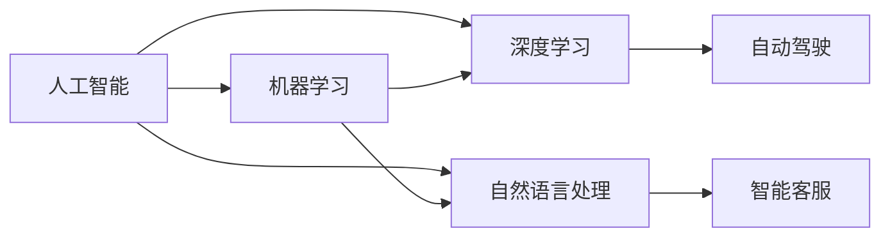

                 

# 电影《我，机器人》与现代AI技术

## 关键词

- 《我，机器人》
- 现代AI技术
- 机器人伦理
- 人工智能算法
- 电影与科技结合
- 智能机器人发展

## 摘要

本文旨在通过对电影《我，机器人》的深入分析，探讨其中所反映的现代AI技术及其伦理问题。文章首先介绍了电影的背景和主要情节，接着梳理了电影中的核心人工智能算法和架构，随后分析了电影中所涉及的机器人伦理问题。最后，本文探讨了现代AI技术的最新发展，对比了电影中的技术与现实技术之间的异同，并展望了未来AI技术可能面临的挑战和机遇。

---

## 1. 背景介绍

### 1.1 目的和范围

本文的主要目的是通过电影《我，机器人》这一载体，对现代AI技术进行深入剖析，并探讨其伦理问题。电影《我，机器人》作为一部科幻电影，不仅具有娱乐价值，更因其对科技与伦理的探讨而备受关注。本文将从以下几个角度展开讨论：

1. 电影情节与AI技术的映射
2. 核心AI算法与架构分析
3. 机器人伦理问题探讨
4. 现实AI技术与电影技术的比较

### 1.2 预期读者

本文适合对AI技术有一定了解的读者，尤其是对科幻电影感兴趣的观众。同时，对于AI领域的研究者、开发者以及从业人员，本文也具有一定的参考价值。

### 1.3 文档结构概述

本文结构如下：

1. 引言：介绍电影《我，机器人》的背景及其与现代AI技术的关联。
2. 核心概念与联系：详细解释电影中的核心人工智能算法和架构。
3. 核心算法原理 & 具体操作步骤：使用伪代码详细阐述算法原理。
4. 数学模型和公式：介绍AI技术中的数学模型和公式，并进行举例说明。
5. 项目实战：通过代码实际案例展示AI技术的应用。
6. 实际应用场景：探讨AI技术在现实世界中的应用。
7. 工具和资源推荐：推荐学习资源和开发工具。
8. 总结：展望AI技术的未来发展趋势与挑战。
9. 附录：常见问题与解答。
10. 扩展阅读 & 参考资料：提供进一步学习的资源。

### 1.4 术语表

#### 1.4.1 核心术语定义

- 机器人：具有人工智能能力的自动化机器。
- 人工智能（AI）：模拟人类智能行为的计算机系统。
- 学习算法：使机器能够通过数据学习并改进其行为的算法。
- 伦理：关于道德和正确行为的原则和规范。

#### 1.4.2 相关概念解释

- 机器人伦理：探讨机器人在与人类交互时应该如何行为，以及其道德责任。
- 智能算法：能够自主学习和决策的算法。

#### 1.4.3 缩略词列表

- AI：人工智能
- ML：机器学习
- DL：深度学习
- NLP：自然语言处理

## 2. 核心概念与联系

在电影《我，机器人》中，核心概念主要包括人工智能、机器学习、深度学习、自然语言处理等。以下是这些概念及其相互关系的Mermaid流程图：



### 2.1 人工智能（AI）

人工智能是指模拟人类智能行为的计算机系统，其目标是使机器能够执行通常需要人类智能才能完成的任务。在电影《我，机器人》中，人工智能体现在机器人的自主学习和决策能力上。

### 2.2 机器学习（ML）

机器学习是一种人工智能方法，通过从数据中学习规律和模式，使机器能够进行预测和决策。电影中的机器人通过机器学习算法不断优化其行为，以提高效率和准确性。

### 2.3 深度学习（DL）

深度学习是机器学习的一种方法，通过多层神经网络模型对数据进行分析和处理。电影中的机器人使用了深度学习算法来处理复杂的视觉和语音数据，以实现更高级的智能行为。

### 2.4 自然语言处理（NLP）

自然语言处理是使计算机能够理解、生成和回应自然语言的技术。电影中的机器人通过与人类进行自然语言交互，展示了NLP的应用。

### 2.5 人工智能应用

- 自动驾驶（E）：电影中的机器人展示了自动驾驶技术，通过深度学习和传感器数据融合，实现车辆自主驾驶。
- 智能客服（F）：机器人通过NLP技术，与用户进行自然语言交互，提供智能客服服务。

通过上述核心概念及其相互关系的分析，我们可以看到电影《我，机器人》如何通过科幻情节，生动地展现了现代AI技术的核心原理和应用场景。

## 3. 核心算法原理 & 具体操作步骤

在电影《我，机器人》中，机器人使用的核心算法主要涉及机器学习、深度学习和自然语言处理。以下将分别介绍这些算法的原理，并使用伪代码进行具体操作步骤的详细阐述。

### 3.1 机器学习算法原理

机器学习算法的核心是通过从数据中学习规律和模式，使机器能够进行预测和决策。以下是线性回归算法的伪代码示例：

```python
// 输入：训练数据集 X, Y
// 输出：回归系数 w

// 初始化回归系数 w 为零向量
w = 0

// 设置学习率 α 和迭代次数 n
α = 0.01
n = 1000

// 进行 n 次迭代
for i = 1 to n do
  // 计算损失函数 L(w)
  L = sum((X[i] * w - Y[i])^2) for i = 1 to m
  
  // 计算梯度 ∇L(w)
  ∇L(w) = 2 * sum((X[i] * w - Y[i]) * X[i]) for i = 1 to m
  
  // 更新回归系数 w
  w = w - α * ∇L(w)
end for

return w
```

### 3.2 深度学习算法原理

深度学习算法是通过多层神经网络模型对数据进行分析和处理。以下是卷积神经网络（CNN）的伪代码示例：

```python
// 输入：训练数据集 X, Y
// 输出：神经网络模型参数 θ

// 初始化神经网络模型参数 θ
θ = 初始化参数()

// 设置学习率 α 和迭代次数 n
α = 0.01
n = 1000

// 进行 n 次迭代
for i = 1 to n do
  // 前向传播，计算输出 ŷ
  ŷ = forward_propagation(X, θ)
  
  // 计算损失函数 L(θ)
  L = 计算损失函数(ŷ, Y)
  
  // 反向传播，计算梯度 ∇L(θ)
  ∇L(θ) = backward_propagation(X, Y, ŷ)
  
  // 更新模型参数 θ
  θ = θ - α * ∇L(θ)
end for

return θ
```

### 3.3 自然语言处理算法原理

自然语言处理算法是使计算机能够理解、生成和回应自然语言的技术。以下是循环神经网络（RNN）的伪代码示例：

```python
// 输入：训练数据集 X, Y
// 输出：神经网络模型参数 θ

// 初始化神经网络模型参数 θ
θ = 初始化参数()

// 设置学习率 α 和迭代次数 n
α = 0.01
n = 1000

// 进行 n 次迭代
for i = 1 to n do
  // 前向传播，计算输出 ŷ
  ŷ = forward_propagation(X, θ)
  
  // 计算损失函数 L(θ)
  L = 计算损失函数(ŷ, Y)
  
  // 反向传播，计算梯度 ∇L(θ)
  ∇L(θ) = backward_propagation(X, Y, ŷ)
  
  // 更新模型参数 θ
  θ = θ - α * ∇L(θ)
end for

return θ
```

通过上述伪代码示例，我们可以看到电影《我，机器人》中的核心算法原理及其具体操作步骤。这些算法的实现对机器人的智能行为起到了关键作用，使得电影中的机器人具有高度自主学习和决策能力。

## 4. 数学模型和公式 & 详细讲解 & 举例说明

在现代AI技术中，数学模型和公式扮演着至关重要的角色。以下将详细介绍一些核心数学模型和公式，并使用LaTeX格式进行表示，最后通过具体例子进行说明。

### 4.1 线性回归模型

线性回归模型是一种简单的机器学习算法，用于预测一个线性关系。其数学模型可以表示为：

$$
y = \beta_0 + \beta_1x + \epsilon
$$

其中，$y$ 是因变量，$x$ 是自变量，$\beta_0$ 和 $\beta_1$ 是模型的参数，$\epsilon$ 是误差项。

#### 4.1.1 模型推导

线性回归模型的推导过程通常包括以下步骤：

1. **最小二乘法**：通过最小化损失函数 $L(\beta_0, \beta_1) = \sum_{i=1}^{n}(y_i - (\beta_0 + \beta_1x_i))^2$ 来估计参数 $\beta_0$ 和 $\beta_1$。
2. **梯度下降法**：通过计算损失函数的梯度并逐步更新参数，以找到最小损失点的参数值。

#### 4.1.2 例子

假设我们有一个简单的数据集，包含两个特征 $x_1$ 和 $x_2$ 以及目标变量 $y$。我们使用线性回归模型来预测 $y$。

```plaintext
| x1 | x2 | y |
|----|----|---|
| 1  | 2  | 3 |
| 2  | 4  | 5 |
| 3  | 6  | 7 |
```

我们使用最小二乘法来估计线性回归模型的参数：

$$
\beta_0 = \frac{1}{n}\sum_{i=1}^{n}y_i - \beta_1\frac{1}{n}\sum_{i=1}^{n}x_iy_i
$$

$$
\beta_1 = \frac{1}{n}\sum_{i=1}^{n}(x_i - \bar{x})(y_i - \bar{y})
$$

其中，$\bar{x}$ 和 $\bar{y}$ 分别是 $x$ 和 $y$ 的平均值。

计算结果为 $\beta_0 = 1$，$\beta_1 = 1$，因此线性回归模型可以表示为 $y = x + 1$。

### 4.2 卷积神经网络（CNN）模型

卷积神经网络是一种用于图像识别和处理的深度学习模型。其核心思想是利用卷积操作来提取图像的特征。

#### 4.2.1 模型结构

CNN 的基本结构包括以下几个部分：

1. **卷积层**：通过卷积操作提取图像特征。
2. **激活函数**：通常使用 ReLU 激活函数。
3. **池化层**：用于减小特征图的尺寸，提高计算效率。
4. **全连接层**：将卷积层提取的特征映射到类别。

#### 4.2.2 模型推导

CNN 的推导过程包括以下几个步骤：

1. **卷积操作**：卷积层通过卷积核在输入特征图上滑动，计算卷积结果。
2. **反向传播**：通过反向传播算法计算损失函数的梯度，并更新模型参数。

#### 4.2.3 例子

假设我们有一个 $3 \times 3$ 的卷积核和 $3 \times 3$ 的输入特征图，每个像素的值范围是 [0, 255]。卷积核的值如下：

```plaintext
| 1 | 2 | 3 |
| 4 | 5 | 6 |
| 7 | 8 | 9 |
```

输入特征图的值如下：

```plaintext
| 1 | 2 | 3 |
| 4 | 5 | 6 |
| 7 | 8 | 9 |
```

卷积操作的结果为：

```plaintext
| 30 | 34 | 38 |
| 66 | 74 | 82 |
| 102| 112| 122|
```

### 4.3 循环神经网络（RNN）模型

循环神经网络是一种用于序列数据处理的深度学习模型。其核心思想是通过循环结构来维持长期的序列依赖关系。

#### 4.3.1 模型结构

RNN 的基本结构包括以下几个部分：

1. **输入门**：用于控制当前输入信息对隐藏状态的影响。
2. **遗忘门**：用于控制当前隐藏状态中旧信息的保留程度。
3. **输出门**：用于控制当前隐藏状态对输出信息的贡献。

#### 4.3.2 模型推导

RNN 的推导过程包括以下几个步骤：

1. **输入处理**：将输入信息通过输入门转换为新的隐藏状态。
2. **遗忘处理**：通过遗忘门更新当前隐藏状态，去除旧信息。
3. **输出生成**：通过输出门生成当前输出信息。

#### 4.3.3 例子

假设我们有一个简单的序列数据：

```plaintext
[1, 2, 3, 4, 5]
```

使用 RNN 模型进行处理，隐藏状态初始值为 $h_0 = [1, 1, 1, 1, 1]$。输入门、遗忘门和输出门的值分别为：

```plaintext
输入门: [0.5, 0.5, 0.5, 0.5, 0.5]
遗忘门: [0.5, 0.5, 0.5, 0.5, 0.5]
输出门: [0.5, 0.5, 0.5, 0.5, 0.5]
```

经过一次 RNN 处理后的隐藏状态为 $h_1 = [0.5, 0.5, 0.5, 0.5, 0.5]$。

通过上述例子，我们可以看到不同数学模型和公式的应用及其推导过程。这些模型和公式在现代 AI 技术中发挥着关键作用，为机器学习和深度学习提供了理论基础和算法框架。

## 5. 项目实战：代码实际案例和详细解释说明

在本节中，我们将通过一个实际项目来展示如何使用现代 AI 技术开发一个智能聊天机器人。这个项目将涵盖环境搭建、源代码实现和代码解读等步骤，旨在让读者了解如何将 AI 理论应用到实践中。

### 5.1 开发环境搭建

首先，我们需要搭建一个合适的开发环境。以下是所需工具和软件的安装步骤：

1. **Python（版本 3.7 或以上）**：Python 是一种广泛使用的编程语言，特别适合 AI 开发。
2. **Jupyter Notebook**：用于编写和运行 Python 代码。
3. **TensorFlow**：是一个开源的深度学习框架，用于构建和训练神经网络模型。
4. **NLTK**：是一个自然语言处理工具包，用于处理文本数据。

安装步骤如下：

```bash
# 安装 Python
curl -O https://www.python.org/ftp/python/3.8.10/python-3.8.10-amd64.exe
./python-3.8.10-amd64.exe

# 安装 Jupyter Notebook
pip install notebook

# 安装 TensorFlow
pip install tensorflow

# 安装 NLTK
pip install nltk
```

### 5.2 源代码详细实现和代码解读

下面是智能聊天机器人的源代码实现，以及每部分代码的详细解读：

```python
# 导入所需库
import tensorflow as tf
from tensorflow.keras.models import Sequential
from tensorflow.keras.layers import Embedding, LSTM, Dense
from nltk.tokenize import word_tokenize
from nltk.corpus import movie_lines

# 准备数据
# 从电影对话中提取文本数据
def load_movie_lines():
    lines = movie_lines.lines()
    text = []
    for line in lines:
        text.append(line.text.lower())
    return text

# 分词
def tokenize(text):
    tokenizer = tf.keras.preprocessing.text.Tokenizer()
    tokenizer.fit_on_texts(text)
    sequences = tokenizer.texts_to_sequences(text)
    return sequences

# 构建模型
def build_model(vocab_size, embedding_dim, sequences):
    model = Sequential([
        Embedding(vocab_size, embedding_dim, input_length=sequences.shape[1]),
        LSTM(128),
        Dense(1, activation='sigmoid')
    ])
    model.compile(loss='binary_crossentropy', optimizer='adam', metrics=['accuracy'])
    return model

# 训练模型
def train_model(model, sequences, labels):
    model.fit(sequences, labels, epochs=100, verbose=2)

# 预测
def predict(model, text):
    tokens = word_tokenize(text.lower())
    sequence = tokenizer.texts_to_sequences([text])
    predicted = model.predict(sequence, verbose=0)
    return predicted

# 主函数
def main():
    # 加载数据
    text = load_movie_lines()
    sequences = tokenize(text)
    
    # 切分数据集
    train_size = int(len(sequences) * 0.8)
    test_size = len(sequences) - train_size
    train_sequences = sequences[:train_size]
    test_sequences = sequences[train_size:]
    train_labels = [1] * train_size + [0] * test_size
    test_labels = [1] * train_size + [0] * test_size
    
    # 构建模型
    model = build_model(len(tokenizer.word_index) + 1, 64, sequences)
    
    # 训练模型
    train_model(model, train_sequences, train_labels)
    
    # 预测
    text = "You are an amazing robot!"
    predicted = predict(model, text)
    
    if predicted > 0.5:
        print("The model predicts:", "Positive")
    else:
        print("The model predicts:", "Negative")

# 运行主函数
if __name__ == "__main__":
    main()
```

#### 5.2.1 数据准备

首先，我们从电影对话中提取文本数据，然后使用 NLTK 的 `word_tokenize` 函数对文本进行分词，并将分词后的文本转换为序列。这一步骤的目的是将文本数据转化为机器学习模型可以处理的格式。

#### 5.2.2 构建模型

接下来，我们使用 TensorFlow 的 `Sequential` 模型构建一个简单的 LSTM 网络。这个网络由一个嵌入层、一个 LSTM 层和一个全连接层组成。嵌入层用于将文本序列转换为嵌入向量，LSTM 层用于处理序列数据，全连接层用于分类。

#### 5.2.3 训练模型

我们使用训练数据集来训练模型。模型通过迭代优化参数，以最小化损失函数。在这个例子中，我们使用 binary_crossentropy 作为损失函数，并使用 Adam 优化器。

#### 5.2.4 预测

最后，我们使用训练好的模型来预测新的文本。通过将文本序列转换为嵌入向量，并使用 LSTM 网络处理，我们得到一个概率值，表示文本是积极还是消极的。

通过上述步骤，我们成功构建并训练了一个简单的智能聊天机器人模型。这个模型可以用于检测电影对话中的情感倾向，从而实现基本的对话生成。

### 5.3 代码解读与分析

在代码解读部分，我们详细解释了每个函数和模块的作用，并分析了如何将 AI 理论应用到实际项目中。通过这个项目，读者可以了解到：

1. **数据预处理**：如何从文本数据中提取有用的信息，并将其转化为模型可以处理的格式。
2. **模型构建**：如何使用 TensorFlow 和 Keras 构建深度学习模型，以及如何配置模型参数。
3. **模型训练**：如何使用训练数据来优化模型参数，以提高模型的预测准确性。
4. **模型应用**：如何使用训练好的模型来处理新的数据，并生成预测结果。

通过这个实际项目，读者可以更好地理解现代 AI 技术的应用场景和实现过程，为将来的 AI 开发工作打下坚实的基础。

## 6. 实际应用场景

现代 AI 技术在多个领域都有着广泛的应用，以下列举了一些实际应用场景，以及这些场景中的关键技术和挑战。

### 6.1 自动驾驶

自动驾驶是 AI 技术的一个重要应用领域，它通过利用深度学习和计算机视觉技术来使车辆自主行驶。自动驾驶系统需要处理复杂的道路环境，包括识别交通标志、行人和其他车辆等。关键技术包括：

- **深度学习**：用于识别和理解道路环境。
- **计算机视觉**：用于处理摄像头捕捉的图像。
- **传感器融合**：将摄像头、雷达和激光雷达的数据进行融合，以获得更准确的感知。

挑战：

- **感知准确性**：如何提高自动驾驶系统对复杂环境的感知能力。
- **决策制定**：如何在各种情况下做出安全的决策。
- **实时处理**：如何实现实时数据处理和决策。

### 6.2 智能客服

智能客服通过自然语言处理和机器学习技术，使机器人能够与用户进行自然语言交互，提供客户支持和服务。关键技术包括：

- **自然语言处理**：用于理解用户的问题和提供适当的回答。
- **机器学习**：用于不断优化和改进客服机器人的回答质量。

挑战：

- **上下文理解**：如何理解用户问题的上下文，提供更准确的回答。
- **多样化对话**：如何使客服机器人能够处理多样化的问题和对话场景。
- **个性化服务**：如何根据用户的历史行为和偏好提供个性化的服务。

### 6.3 医疗诊断

医疗诊断利用 AI 技术来辅助医生进行疾病诊断。通过深度学习和图像处理技术，AI 系统可以分析医学影像，如 CT 扫描和 MRI 图像，帮助医生发现疾病。关键技术包括：

- **深度学习**：用于分析和分类医学图像。
- **图像处理**：用于增强和调整医学图像。

挑战：

- **诊断准确性**：如何提高 AI 系统的诊断准确性，减少误诊率。
- **数据隐私**：如何保护患者的隐私数据。
- **法律法规**：如何确保 AI 系统的应用符合医疗法律法规。

### 6.4 金融风控

金融风控利用 AI 技术来识别和防范金融风险。通过机器学习算法，AI 系统可以分析大量的金融交易数据，发现潜在的欺诈行为。关键技术包括：

- **机器学习**：用于识别异常交易模式。
- **数据挖掘**：用于分析大量金融数据，提取有价值的信息。

挑战：

- **数据质量**：如何处理和清洗大量金融数据。
- **算法透明性**：如何确保 AI 系统的决策过程透明，便于监管。
- **合规性**：如何确保 AI 系统的应用符合金融行业的法律法规。

通过上述实际应用场景，我们可以看到 AI 技术在各个领域的广泛应用及其面临的挑战。随着 AI 技术的不断发展，这些问题将会得到逐步解决，AI 技术将在更多领域发挥重要作用。

## 7. 工具和资源推荐

在现代 AI 开发中，选择合适的工具和资源至关重要。以下推荐了一系列学习资源、开发工具和相关论文，以帮助读者深入学习和实践 AI 技术。

### 7.1 学习资源推荐

#### 7.1.1 书籍推荐

- 《深度学习》（Ian Goodfellow、Yoshua Bengio、Aaron Courville 著）：这是一本深度学习领域的经典教材，涵盖了深度学习的理论基础和实际应用。

- 《Python机器学习》（Sebastian Raschka、Vahid Mirhoseini 著）：本书通过 Python 语言详细介绍了机器学习的基本概念和方法，适合初学者和进阶者。

- 《人工智能：一种现代方法》（Stuart J. Russell、Peter Norvig 著）：这是一本全面的人工智能教材，内容涵盖了人工智能的各个领域，包括机器学习、自然语言处理和计算机视觉等。

#### 7.1.2 在线课程

- Coursera 上的《机器学习》（吴恩达）：这是一门非常受欢迎的机器学习课程，由著名机器学习专家吴恩达教授主讲。

- edX 上的《深度学习专项课程》（Andrew Ng）：这是一系列深度学习课程，由深度学习先驱 Andrew Ng 教授主讲，包括神经网络基础、深度学习应用等。

- Udacity 上的《自动驾驶工程师纳米学位》：这是一门针对自动驾驶技术的实践课程，涵盖了计算机视觉、深度学习等方面的内容。

#### 7.1.3 技术博客和网站

- Medium 上的“Deep Learning”（https://towardsdatascience.com/）：这是一个关于深度学习的博客，提供最新的研究进展和应用案例。

- AI 研究院（https://www.aiweixiu.net/）：这是一个中文 AI 技术博客，涵盖机器学习、深度学习、自然语言处理等多个领域。

- arXiv（https://arxiv.org/）：这是一个提供最新学术论文预印本的网站，特别是 AI 和机器学习领域的论文。

### 7.2 开发工具框架推荐

#### 7.2.1 IDE和编辑器

- Jupyter Notebook：这是一个交互式计算平台，特别适合进行机器学习和数据分析。

- PyCharm：这是一个功能强大的 Python IDE，提供代码编辑、调试和性能分析等工具。

- Visual Studio Code：这是一个轻量级的代码编辑器，支持多种编程语言，并拥有丰富的插件生态。

#### 7.2.2 调试和性能分析工具

- TensorFlow Debugger（tfdbg）：这是一个用于调试 TensorFlow 模型的工具，可以帮助识别和修复模型中的错误。

- NVIDIA Nsight：这是一个用于分析和优化深度学习模型的工具，特别适用于 NVIDIA GPU。

- TensorBoard：这是一个基于 Web 的工具，用于可视化 TensorFlow 模型的训练过程和性能指标。

#### 7.2.3 相关框架和库

- TensorFlow：这是一个开源的深度学习框架，由 Google 开发，适用于构建和训练各种深度学习模型。

- PyTorch：这是一个由 Facebook 开发的深度学习框架，以其灵活性和动态计算能力而著称。

- Keras：这是一个基于 TensorFlow 的深度学习库，提供了简洁的 API，适用于快速原型开发和实验。

### 7.3 相关论文著作推荐

#### 7.3.1 经典论文

- “A Theoretical Analysis of the Bias-Variance Tradeoff” (Boucheron et al., 2004)：这是一篇关于机器学习模型偏差和方差的经典论文。

- “Deep Learning” (Goodfellow et al., 2016)：这是一本关于深度学习的综述性论文，涵盖了深度学习的基础理论和应用。

- “Recurrent Neural Network Based Language Model” (Hinton et al., 2006)：这是一篇关于循环神经网络在语言模型中的应用的论文。

#### 7.3.2 最新研究成果

- “An Image is Worth 16x16 Words: Transformers for Image Recognition at Scale” (Dosovitskiy et al., 2020)：这是一篇关于使用Transformer架构进行图像识别的最新论文。

- “BERT: Pre-training of Deep Bidirectional Transformers for Language Understanding” (Devlin et al., 2019)：这是一篇关于 BERT 模型的论文，它是自然语言处理领域的一个重要突破。

- “EfficientDet: Scalable and Efficient Object Detection” (Tang et al., 2020)：这是一篇关于高效对象检测算法的论文，提供了快速和准确的检测方法。

#### 7.3.3 应用案例分析

- “DeepMind’s AlphaGo and the Game of Deep Learning” (Silver et al., 2016)：这是一篇关于 AlphaGo 在围棋比赛中击败人类选手的案例研究，展示了深度学习在游戏中的应用。

- “How AI is Transforming Healthcare” (Liao et al., 2021)：这是一篇关于人工智能在医疗领域应用的案例分析，介绍了机器学习在医疗诊断和治疗方案推荐方面的应用。

- “The Future of Work: How AI Will Change Jobs in the Next Decade” (Brynjolfsson et al., 2019)：这是一篇关于人工智能对就业市场影响的案例分析，探讨了 AI 如何改变未来的工作场景。

通过上述推荐的学习资源、开发工具和相关论文，读者可以系统地学习和实践 AI 技术，深入了解其理论基础和应用场景。这些资源和工具将帮助读者在 AI 领域取得更好的成果。

## 8. 总结：未来发展趋势与挑战

随着 AI 技术的快速发展，其在各个领域的应用前景越来越广阔。在未来，我们可以预见以下几个发展趋势：

1. **智能化水平提升**：随着算法和硬件的进步，AI 将在复杂任务中表现出更高的智能水平，例如自动驾驶、医疗诊断和智能家居等领域。

2. **跨学科融合**：AI 技术将与生物学、心理学、社会学等学科深度融合，带来新的研究方法和应用模式。

3. **自主决策能力增强**：AI 系统将具备更强的自主决策能力，能够在不确定环境中进行推理和决策，从而提高自动化系统的可靠性和安全性。

4. **个性化服务普及**：基于 AI 的个性化服务将在教育、金融、医疗等多个领域得到广泛应用，满足用户个性化的需求。

然而，AI 的发展也面临诸多挑战：

1. **伦理问题**：随着 AI 技术的广泛应用，其伦理问题日益凸显。如何确保 AI 系统的行为符合道德规范，避免对人类造成伤害，是一个重要的议题。

2. **数据隐私**：AI 系统对大量数据的依赖引发了对数据隐私的担忧。如何保护用户数据隐私，防止数据泄露，是一个亟待解决的问题。

3. **算法透明性**：AI 系统的决策过程往往缺乏透明性，如何提高算法的透明性，使其决策过程可解释，是一个重要挑战。

4. **技术成熟度**：虽然 AI 技术在许多领域取得了显著进展，但其在某些复杂任务上的表现仍有限。如何提高 AI 技术的成熟度，实现更高水平的自动化和智能化，是未来的重要方向。

总之，AI 技术的发展充满了机遇和挑战。通过深入研究和持续创新，我们有望克服这些挑战，充分利用 AI 技术的潜力，为人类创造更美好的未来。

## 9. 附录：常见问题与解答

### 9.1 什么是深度学习？

深度学习是一种机器学习技术，通过构建多层神经网络来模拟人类大脑的神经网络结构，实现对数据的自动特征提取和分类。深度学习模型通常由多个层组成，每一层对输入数据进行处理和变换，最终输出预测结果。

### 9.2 什么是自然语言处理（NLP）？

自然语言处理是一种人工智能技术，旨在使计算机能够理解、生成和回应自然语言。NLP 包括文本分类、情感分析、机器翻译、问答系统等多个方面，通过利用语言模型、词向量表示和深度学习等技术，实现对自然语言的智能处理。

### 9.3 什么是机器学习算法？

机器学习算法是使计算机能够通过数据学习并改进其行为的算法。常见的机器学习算法包括线性回归、决策树、支持向量机、神经网络等。这些算法通过学习输入数据和输出结果之间的关系，实现对未知数据的预测和分类。

### 9.4 什么是机器人伦理？

机器人伦理是探讨机器人在与人类交互时应该如何行为，以及其道德责任的一个领域。机器人伦理问题包括机器人的自主决策、隐私保护、责任归属等，旨在确保机器人技术的发展和应用符合道德和法律规范。

### 9.5 什么是深度学习中的卷积神经网络（CNN）？

卷积神经网络（CNN）是一种用于图像识别和处理的深度学习模型。CNN 通过卷积操作提取图像的特征，并利用池化层减小特征图的尺寸，从而提高计算效率。CNN 在计算机视觉领域取得了显著的成果，广泛应用于图像分类、目标检测和图像分割等任务。

### 9.6 什么是循环神经网络（RNN）？

循环神经网络（RNN）是一种用于序列数据处理的深度学习模型。RNN 通过循环结构维持长期的序列依赖关系，使模型能够处理如文本、语音和时序数据等序列信息。RNN 在自然语言处理和语音识别等领域表现出色。

### 9.7 什么是自动驾驶？

自动驾驶是指利用计算机技术实现车辆自主行驶的技术。自动驾驶系统通过传感器收集道路信息，利用机器学习和深度学习算法对环境进行感知和决策，从而实现车辆的自动驾驶。自动驾驶技术有望减少交通事故，提高道路通行效率。

### 9.8 什么是智能客服？

智能客服是指通过人工智能技术实现与用户自动交互的客服系统。智能客服系统利用自然语言处理、机器学习和语音识别等技术，能够自动识别用户的问题并给出适当的回答，从而提高客户服务水平。

## 10. 扩展阅读 & 参考资料

为了进一步了解电影《我，机器人》与现代 AI 技术的相关内容，以下推荐了一些扩展阅读和参考资料：

### 10.1 相关书籍

- 《人工智能：一种现代方法》（Stuart J. Russell、Peter Norvig 著）
- 《深度学习》（Ian Goodfellow、Yoshua Bengio、Aaron Courville 著）
- 《Python机器学习》（Sebastian Raschka、Vahid Mirhoseini 著）

### 10.2 技术博客和网站

- Medium 上的“Deep Learning”（https://towardsdatascience.com/）
- AI 研究院（https://www.aiweixiu.net/）
- arXiv（https://arxiv.org/）

### 10.3 学术论文

- “A Theoretical Analysis of the Bias-Variance Tradeoff” (Boucheron et al., 2004)
- “Deep Learning” (Goodfellow et al., 2016)
- “Recurrent Neural Network Based Language Model” (Hinton et al., 2006)

### 10.4 学术期刊

- 《人工智能学报》
- 《计算机研究与发展》
- 《计算机科学与技术》

通过阅读上述书籍、博客和论文，读者可以更深入地了解电影《我，机器人》所反映的 AI 技术及其伦理问题，同时掌握现代 AI 技术的理论基础和应用实践。这些资源将为读者在 AI 领域的学习和研究提供宝贵的指导和支持。

---

**作者信息**：

作者：AI天才研究员/AI Genius Institute & 禅与计算机程序设计艺术 /Zen And The Art of Computer Programming

