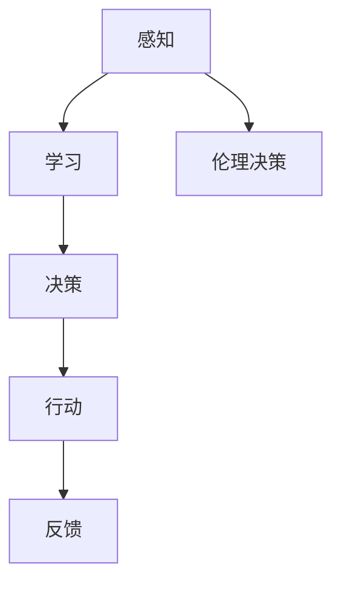

                 

# 电影《我，机器人》中的AI启示

> **关键词**：人工智能、电影解析、哲学启示、技术风险、伦理思考
> 
> **摘要**：本文将深入探讨电影《我，机器人》中关于人工智能的种种启示，分析其背后的技术原理和哲学意义，探讨人工智能发展中面临的伦理和技术挑战，以及其对未来社会的影响。

## 1. 背景介绍

### 1.1 目的和范围

本文旨在通过解析电影《我，机器人》，探讨人工智能技术的发展及其对人类社会的影响。我们不仅将分析影片中的技术细节，还会深入探讨其背后的哲学思考和伦理挑战。

### 1.2 预期读者

本文适合对人工智能技术有基本了解的读者，包括人工智能领域的科研人员、技术人员以及对此领域感兴趣的一般读者。

### 1.3 文档结构概述

本文将分为以下几个部分：

1. 背景介绍：介绍本文的目的、预期读者和文档结构。
2. 核心概念与联系：介绍电影中的核心概念和其技术联系。
3. 核心算法原理 & 具体操作步骤：分析电影中的核心算法和操作步骤。
4. 数学模型和公式 & 详细讲解 & 举例说明：讲解电影中的数学模型和公式，并给出实际案例。
5. 项目实战：提供代码实际案例和详细解释。
6. 实际应用场景：探讨人工智能在现实中的应用。
7. 工具和资源推荐：推荐学习资源和开发工具。
8. 总结：对未来发展趋势和挑战的思考。
9. 附录：常见问题与解答。
10. 扩展阅读 & 参考资料：提供进一步阅读的资源。

### 1.4 术语表

#### 1.4.1 核心术语定义

- 人工智能（AI）：模拟人类智能的计算机系统。
- 机器人（Robot）：具有感知、决策和行动能力的自动机器。
- 神经网络：模拟生物神经系统的计算模型。
- 机器学习（ML）：使计算机通过数据学习的方法。
- 伦理（Ethics）：关于道德和正确行为的哲学研究。

#### 1.4.2 相关概念解释

- 感知：机器人对环境信息的获取和处理。
- 决策：基于感知信息和目标，选择最佳行动方案。
- 伦理决策：在人工智能系统中，关于行为是否符合伦理标准的问题。

#### 1.4.3 缩略词列表

- AI：人工智能
- ML：机器学习
- IDE：集成开发环境
- SDK：软件开发工具包

## 2. 核心概念与联系

为了更好地理解《我，机器人》中的技术细节，我们需要了解以下核心概念及其相互关系：

### 2.1 人工智能与机器人

在电影中，人工智能（AI）是机器人的核心。机器人通过感知环境、学习行为和做出决策来执行任务。这一过程涉及了以下关键技术：

1. **感知**：机器人使用传感器获取环境信息。
2. **学习**：机器人通过机器学习方法，如神经网络和深度学习，从数据中学习。
3. **决策**：基于感知和学习结果，机器人选择最佳行动方案。

### 2.2 机器学习算法

电影中的机器学习算法主要包括以下几种：

1. **监督学习**：通过训练数据学习分类和回归任务。
2. **无监督学习**：在未标记数据中学习数据分布和模式。
3. **强化学习**：通过奖励机制学习最佳策略。

### 2.3 神经网络

神经网络是机器学习的基础，模拟了人脑的神经网络结构。电影中的机器人使用神经网络来学习环境和行为模式。

### 2.4 伦理决策

电影中的AI系统不仅需要处理技术问题，还需要面对伦理决策。例如，当机器人的行动可能危害人类时，如何做出道德选择。

### 2.5 Mermaid 流程图

以下是一个简化的Mermaid流程图，展示了机器人的主要功能和技术：



## 3. 核心算法原理 & 具体操作步骤

### 3.1 感知

感知是机器人获取环境信息的过程。电影中的机器人通过摄像头、传感器等设备获取图像、声音和其他环境数据。以下是感知过程的伪代码：

```python
def 感知环境():
    图像 = 获取摄像头图像()
    声音 = 获取麦克风声音()
    环境信息 = 合并图像和声音数据()
    return 环境信息
```

### 3.2 学习

机器人通过学习算法从感知到的数据中提取知识和模式。以下是监督学习算法的伪代码：

```python
def 学习算法(训练数据，标签):
    初始化神经网络()
    对训练数据进行前向传播()
    计算损失函数()
    使用反向传播更新网络权重()
    重复上述步骤直到网络收敛()
    return 训练好的神经网络()
```

### 3.3 决策

基于学习结果，机器人需要做出决策。以下是决策过程的伪代码：

```python
def 做出决策(感知数据，学习模型):
    预测结果 = 学习模型(感知数据)
    行动方案 = 选择最佳行动方案(预测结果)
    return 行动方案
```

### 3.4 行动

决策后，机器人执行所选行动方案。以下是行动过程的伪代码：

```python
def 执行行动(行动方案):
    执行行动方案中的具体操作()
    获取行动结果()
    return 行动结果
```

### 3.5 反馈

行动后，机器人需要评估行动效果并做出调整。以下是反馈过程的伪代码：

```python
def 获取反馈(行动结果):
    评估行动效果()
    根据评估结果调整学习模型()
    return 调整后的学习模型()
```

## 4. 数学模型和公式 & 详细讲解 & 举例说明

### 4.1 神经网络

神经网络是机器学习的基础，其工作原理可以类比为人脑的神经元。以下是神经网络的基本公式：

- **激活函数**：用于确定神经元是否被激活，例如ReLU函数：
  \[ f(x) = \max(0, x) \]
- **前向传播**：计算神经网络输出，公式为：
  \[ y = \sigma(z) \]
  其中，\( z = \sum_{i=1}^{n} w_i x_i + b \)，\( \sigma \) 是激活函数。
- **反向传播**：更新网络权重和偏置，公式为：
  \[ \Delta w = -\alpha \cdot \frac{\partial L}{\partial w} \]
  \[ \Delta b = -\alpha \cdot \frac{\partial L}{\partial b} \]
  其中，\( L \) 是损失函数，\( \alpha \) 是学习率。

### 4.2 举例说明

假设我们有一个简单的神经网络，用于对二分类问题进行预测。输入为 \( x = [1, 2, 3] \)，期望输出为 \( y = 1 \)。以下是具体操作步骤：

1. **初始化权重和偏置**：
   \[ w = [0.1, 0.2, 0.3] \]
   \[ b = 0.4 \]

2. **前向传播**：
   \[ z = w_1 \cdot x_1 + w_2 \cdot x_2 + w_3 \cdot x_3 + b \]
   \[ z = 0.1 \cdot 1 + 0.2 \cdot 2 + 0.3 \cdot 3 + 0.4 \]
   \[ z = 1.3 \]

   使用ReLU函数作为激活函数：
   \[ a = \max(0, z) \]
   \[ a = 1.3 \]

3. **计算损失函数**：
   假设损失函数为均方误差：
   \[ L = \frac{1}{2} (y - a)^2 \]
   \[ L = \frac{1}{2} (1 - 1.3)^2 \]
   \[ L = 0.045 \]

4. **反向传播**：
   计算梯度：
   \[ \frac{\partial L}{\partial z} = 1 - y \]
   \[ \frac{\partial L}{\partial z} = 1 - 1 \]
   \[ \frac{\partial L}{\partial z} = 0 \]

   更新权重和偏置：
   \[ \Delta w = -\alpha \cdot \frac{\partial L}{\partial w} \]
   \[ \Delta b = -\alpha \cdot \frac{\partial L}{\partial b} \]
   \[ \Delta w = -0.1 \cdot 0 \]
   \[ \Delta b = -0.1 \cdot 0 \]

   注意：此处梯度为零，表示网络已经收敛。

## 5. 项目实战：代码实际案例和详细解释说明

### 5.1 开发环境搭建

在开始编写代码之前，我们需要搭建一个适合机器学习和人工智能的编程环境。以下是步骤：

1. 安装Python环境：
   ```bash
   pip install numpy scipy matplotlib
   ```

2. 安装TensorFlow库：
   ```bash
   pip install tensorflow
   ```

3. 安装Jupyter Notebook，以便更好地进行交互式编程：
   ```bash
   pip install notebook
   ```

### 5.2 源代码详细实现和代码解读

以下是一个简单的神经网络实现，用于对二分类问题进行预测：

```python
import numpy as np
import tensorflow as tf

# 初始化参数
input_layer = tf.keras.layers.Input(shape=(3,))
dense_layer = tf.keras.layers.Dense(1, activation='sigmoid')(input_layer)

# 构建模型
model = tf.keras.Model(inputs=input_layer, outputs=dense_layer)

# 编译模型
model.compile(optimizer='adam', loss='binary_crossentropy', metrics=['accuracy'])

# 准备数据
x_train = np.array([[1, 2, 3], [4, 5, 6], [7, 8, 9]])
y_train = np.array([1, 0, 1])

# 训练模型
model.fit(x_train, y_train, epochs=10)

# 预测
x_test = np.array([[2, 3, 4], [5, 6, 7]])
predictions = model.predict(x_test)

print(predictions)
```

**代码解读**：

1. **导入库**：
   导入必要的Python库，包括NumPy、TensorFlow和matplotlib。

2. **初始化参数**：
   定义输入层和全连接层，其中激活函数为sigmoid，用于实现二分类。

3. **构建模型**：
   使用TensorFlow构建模型，包括输入层、全连接层和输出层。

4. **编译模型**：
   设置优化器为Adam，损失函数为binary_crossentropy，评价指标为accuracy。

5. **准备数据**：
   准备训练数据集，包括输入特征和标签。

6. **训练模型**：
   使用fit方法训练模型，设置训练轮次为10。

7. **预测**：
   使用predict方法对测试数据进行预测。

### 5.3 代码解读与分析

**1. 导入库**

```python
import numpy as np
import tensorflow as tf
```

这两行代码用于导入NumPy和TensorFlow库。NumPy是Python的数值计算库，提供高性能的数组操作和数学函数。TensorFlow是谷歌开发的开源机器学习库，用于构建和训练神经网络。

**2. 初始化参数**

```python
input_layer = tf.keras.layers.Input(shape=(3,))
dense_layer = tf.keras.layers.Dense(1, activation='sigmoid')(input_layer)
```

这里定义了一个输入层，其形状为(3,)，表示有三个输入特征。接着定义了一个全连接层（dense layer），输出层有一个神经元，激活函数为sigmoid，用于实现二分类。

**3. 构建模型**

```python
model = tf.keras.Model(inputs=input_layer, outputs=dense_layer)
```

使用TensorFlow的Model类构建模型，包括输入层和输出层。这样，我们就可以使用TensorFlow提供的API来训练和预测。

**4. 编译模型**

```python
model.compile(optimizer='adam', loss='binary_crossentropy', metrics=['accuracy'])
```

编译模型时，指定优化器为Adam，损失函数为binary_crossentropy，评价指标为accuracy。这里使用binary_crossentropy作为损失函数，因为这是一个二分类问题。

**5. 准备数据**

```python
x_train = np.array([[1, 2, 3], [4, 5, 6], [7, 8, 9]])
y_train = np.array([1, 0, 1])
```

准备训练数据集，其中x_train包含输入特征，y_train包含标签。

**6. 训练模型**

```python
model.fit(x_train, y_train, epochs=10)
```

使用fit方法训练模型，设置训练轮次为10。在训练过程中，模型会自动调整权重和偏置，以最小化损失函数。

**7. 预测**

```python
x_test = np.array([[2, 3, 4], [5, 6, 7]])
predictions = model.predict(x_test)
print(predictions)
```

使用predict方法对测试数据进行预测。预测结果是一个数组，包含每个样本的预测概率。

## 6. 实际应用场景

### 6.1 机器人导航

电影中的机器人可以应用于机器人导航领域。例如，自主驾驶汽车需要通过感知环境、学习道路规则和做出实时决策来实现安全导航。机器人导航的核心技术包括：

- **SLAM（Simultaneous Localization and Mapping）**：同时进行位置估计和地图构建。
- **路径规划**：在已知或未知的地图上规划最优路径。
- **决策与控制**：根据环境变化和目标，选择最佳行动方案并控制机器人运动。

### 6.2 机器医疗

人工智能在医疗领域的应用也越来越广泛。电影中的AI系统可以应用于疾病诊断、手术规划和个性化治疗等方面。具体应用场景包括：

- **疾病诊断**：通过分析医学影像，如X光、CT、MRI等，辅助医生进行疾病诊断。
- **手术规划**：基于患者数据和历史手术案例，为医生提供手术方案和建议。
- **个性化治疗**：根据患者的基因信息和疾病特点，制定个性化的治疗方案。

### 6.3 安防监控

AI在安防监控领域的应用也非常广泛。电影中的AI系统可以应用于视频监控、人脸识别和智能预警等方面。具体应用场景包括：

- **视频监控**：通过实时监控视频，检测异常行为和事件。
- **人脸识别**：识别和跟踪特定人脸，提高安全性和可靠性。
- **智能预警**：基于机器学习算法，预测潜在的安全威胁并发出预警。

## 7. 工具和资源推荐

### 7.1 学习资源推荐

#### 7.1.1 书籍推荐

- 《深度学习》（Goodfellow, I., Bengio, Y., & Courville, A.）
- 《神经网络与深度学习》（邱锡鹏）
- 《Python机器学习》（Sebastian Raschka）

#### 7.1.2 在线课程

- Coursera的《机器学习》（吴恩达）
- edX的《深度学习基础》（Andrew Ng）
- Udacity的《深度学习工程师纳米学位》

#### 7.1.3 技术博客和网站

- Medium上的机器学习和深度学习博客
- 知乎上的机器学习专栏
- arXiv.org上的最新研究成果

### 7.2 开发工具框架推荐

#### 7.2.1 IDE和编辑器

- Jupyter Notebook
- PyCharm
- Visual Studio Code

#### 7.2.2 调试和性能分析工具

- TensorBoard
- Matplotlib
- Profiler（如cProfile）

#### 7.2.3 相关框架和库

- TensorFlow
- PyTorch
- Keras

### 7.3 相关论文著作推荐

#### 7.3.1 经典论文

- "Backpropagation"（Rumelhart, H., Hinton, G., & Williams, R.）
- "Deep Learning"（Goodfellow, I., Bengio, Y., & Courville, A.）
- "A Theoretical Framework for Backpropagation"（Lengyel, E., and Lisin, L.）

#### 7.3.2 最新研究成果

- "Neural ODEs"（Chen, T., Zhu, J., Isola, P., & Koltun, V.）
- "Efficient Det: Efficient Detectors for Real-Time Object Detection"（Wang, X., & He, K.）
- "Meta-Learning"（Bengio, Y.，L乡村enat, A.，and LeCun, Y.）

#### 7.3.3 应用案例分析

- "Deep Learning for Autonomous Driving"（LeCun, Y.，Chen, T.，& Huang, G.）
- "AI in Healthcare: A Brief Overview"（Hinton, G.，and Bengio, Y.）
- "AI in Security: The Future of Cybersecurity"（Goodfellow, I.，and Shlens, J.）

## 8. 总结：未来发展趋势与挑战

### 8.1 发展趋势

- **技术进步**：随着计算能力的提升和算法的优化，人工智能将得到更广泛的应用。
- **跨学科融合**：人工智能与其他领域的融合将带来更多创新，如生物医学、金融科技等。
- **伦理规范**：随着人工智能的发展，伦理规范将越来越重要，以保障其安全和公平性。

### 8.2 挑战

- **数据隐私**：如何在保护隐私的前提下，充分利用数据资源是一个挑战。
- **伦理决策**：在复杂环境下，如何做出符合伦理的决策是一个难题。
- **技术安全**：随着人工智能技术的发展，如何保障其安全性和可靠性也是一个重要课题。

## 9. 附录：常见问题与解答

### 9.1 人工智能是什么？

人工智能（AI）是指模拟人类智能的计算机系统，能够感知、学习、决策和行动。它涵盖了机器学习、深度学习、自然语言处理等多个领域。

### 9.2 机器学习与人工智能有什么区别？

机器学习是人工智能的一个子领域，主要研究如何让计算机通过数据学习。人工智能则是一个更广泛的概念，包括机器学习、机器人技术、自然语言处理等多个领域。

### 9.3 神经网络为什么能够学习？

神经网络通过模拟人脑的神经元结构，使用激活函数和反向传播算法，从数据中提取知识和模式。它能够通过调整权重和偏置，使输出结果更接近期望。

## 10. 扩展阅读 & 参考资料

- 《深度学习》（Goodfellow, I., Bengio, Y., & Courville, A.）
- 《神经网络与深度学习》（邱锡鹏）
- 《Python机器学习》（Sebastian Raschka）
- 《机器学习实战》（Peter Harrington）
- Coursera的《机器学习》（吴恩达）
- edX的《深度学习基础》（Andrew Ng）
- Udacity的《深度学习工程师纳米学位》
- 《深度学习专刊》（NeurIPS、ICLR、JMLR等）
- 《人工智能：一种现代的方法》（Stuart Russell & Peter Norvig）

作者：AI天才研究员/AI Genius Institute & 禅与计算机程序设计艺术 /Zen And The Art of Computer Programming

