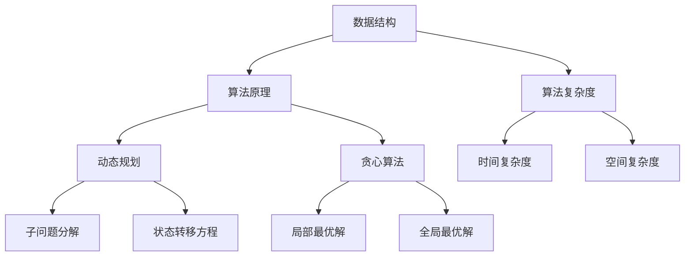

                 

# 2025百度社招算法面试题汇总与解析

> **关键词：**百度社招、算法面试、面试题、解析、技术博客、人工智能、深度学习、机器学习、数据结构、算法原理、实战案例

> **摘要：**本文针对百度2025年社招算法工程师面试题目，系统性地总结了常见面试题型及其解析，通过详细分析每个题目的核心概念、算法原理、数学模型以及实际应用案例，帮助读者深入理解面试题背后的技术本质，提升算法面试应对能力。

## 1. 背景介绍

### 1.1 目的和范围

本文旨在为参加百度2025年社招算法工程师面试的应聘者提供一份全面的面试题汇总与解析，帮助读者更好地应对面试挑战。本文将涵盖以下内容：

- **常见面试题型解析**：系统性地总结算法面试中的常见题型，如数据结构、算法原理、数学模型等，并提供详细的解题思路和步骤。
- **核心概念原理剖析**：通过分析每个题目的核心概念原理，帮助读者深入理解面试题背后的技术本质。
- **实战案例与代码解读**：结合实际项目案例，详细解读代码实现过程，帮助读者掌握实际编程技巧。
- **应用场景与工具资源推荐**：介绍算法在实际应用场景中的实践，并提供学习资源、开发工具和框架的推荐。

### 1.2 预期读者

本文适合以下读者群体：

- **算法工程师**：希望提升面试技巧和应对能力的算法工程师。
- **程序员**：对算法和数据结构有兴趣的程序员，希望了解面试题背后的技术原理。
- **计算机科学学生**：准备参加算法面试的计算机科学专业学生，希望提高面试通过率。

### 1.3 文档结构概述

本文按照以下结构进行组织：

- **1. 背景介绍**：介绍本文的目的、范围、预期读者和文档结构。
- **2. 核心概念与联系**：通过Mermaid流程图展示核心概念和联系。
- **3. 核心算法原理 & 具体操作步骤**：使用伪代码详细阐述算法原理和步骤。
- **4. 数学模型和公式 & 详细讲解 & 举例说明**：使用latex格式展示数学模型和公式，并结合实际案例进行讲解。
- **5. 项目实战：代码实际案例和详细解释说明**：介绍代码实现和解读。
- **6. 实际应用场景**：分析算法在实际应用场景中的应用。
- **7. 工具和资源推荐**：推荐学习资源和开发工具。
- **8. 总结：未来发展趋势与挑战**：探讨算法领域的未来趋势和挑战。
- **9. 附录：常见问题与解答**：回答读者可能关心的问题。
- **10. 扩展阅读 & 参考资料**：提供更多学习资源和参考文献。

### 1.4 术语表

#### 1.4.1 核心术语定义

- **算法面试**：针对求职者算法能力和知识水平的面试。
- **数据结构**：数据存储、组织和访问的方式。
- **算法原理**：解决特定问题的步骤和逻辑。
- **机器学习**：利用数据自动改进性能的计算机算法。
- **深度学习**：基于多层神经网络的学习方法。

#### 1.4.2 相关概念解释

- **算法复杂度**：衡量算法运行时间和内存消耗的量度。
- **动态规划**：将复杂问题分解为子问题并存储中间结果的算法设计技术。
- **贪心算法**：每次选择局部最优解，以期得到全局最优解的算法设计技术。

#### 1.4.3 缩略词列表

- **IDE**：集成开发环境（Integrated Development Environment）。
- **GUI**：图形用户界面（Graphical User Interface）。
- **API**：应用程序编程接口（Application Programming Interface）。

## 2. 核心概念与联系

在算法面试中，核心概念和联系的理解至关重要。下面，我们将通过Mermaid流程图展示核心概念和它们之间的联系。



通过以上流程图，我们可以看出数据结构、算法原理、算法复杂度、动态规划、贪心算法等核心概念之间的联系。接下来，我们将逐一深入分析这些核心概念。

## 3. 核心算法原理 & 具体操作步骤

在算法面试中，理解核心算法原理和具体操作步骤至关重要。以下将详细介绍常见面试题中的核心算法原理和具体操作步骤。

### 3.1 动态规划

动态规划是一种将复杂问题分解为子问题并存储中间结果的算法设计技术。以下是动态规划的基本原理和步骤：

**原理：**

动态规划的核心思想是将原问题分解为多个子问题，并利用子问题的解来求解原问题。通常，动态规划涉及到以下步骤：

1. **定义子问题**：将原问题分解为多个子问题。
2. **状态转移方程**：确定子问题之间的关系，并定义状态转移方程。
3. **边界条件**：确定算法的边界条件。
4. **存储中间结果**：利用数组或哈希表存储子问题的解。

**步骤：**

1. **定义状态变量**：根据子问题的性质，定义状态变量。
2. **初始化边界条件**：根据边界条件初始化状态变量的值。
3. **递推公式**：根据状态转移方程，利用已有状态变量的值来计算下一个状态变量的值。
4. **求解最终结果**：根据递推公式，求解最终状态变量的值。

**伪代码：**

```python
# 动态规划解决斐波那契数列问题

# 定义状态变量
fib(n):
    if n <= 1:
        return n
    # 初始化边界条件
    dp[0] = 0
    dp[1] = 1
    # 递推公式
    for i from 2 to n:
        dp[i] = dp[i-1] + dp[i-2]
    # 求解最终结果
    return dp[n]
```

### 3.2 贪心算法

贪心算法是一种每次选择局部最优解，以期得到全局最优解的算法设计技术。以下是贪心算法的基本原理和步骤：

**原理：**

贪心算法的核心思想是在每一步选择局部最优解，并期望在整体上得到最优解。通常，贪心算法涉及到以下步骤：

1. **选择局部最优解**：根据当前状态，选择局部最优解。
2. **更新状态**：根据选择的局部最优解，更新当前状态。
3. **重复步骤**：继续选择局部最优解，直到满足结束条件。

**步骤：**

1. **初始状态**：根据问题性质，定义初始状态。
2. **选择局部最优解**：根据当前状态，选择局部最优解。
3. **更新状态**：根据选择的局部最优解，更新当前状态。
4. **重复步骤**：继续选择局部最优解，直到满足结束条件。

**伪代码：**

```python
# 贪心算法解决背包问题

# 定义状态变量
knapsack(W, weights, values, n):
    # 初始化状态
    dp[0] = 0
    # 选择局部最优解
    for i from 1 to n:
        for j from W to 0:
            if j - weights[i] >= 0:
                dp[j] = max(dp[j], dp[j - weights[i]] + values[i])
    # 求解最终结果
    return dp[W]
```

通过以上两个示例，我们可以看到动态规划和贪心算法的基本原理和具体操作步骤。接下来，我们将进一步探讨数学模型和公式。

## 4. 数学模型和公式 & 详细讲解 & 举例说明

在算法面试中，数学模型和公式是解决问题的关键。以下将详细讲解常见数学模型和公式，并结合实际案例进行说明。

### 4.1 最优化问题

最优化问题是寻找函数的最大值或最小值。常见的最优化问题包括线性规划、非线性规划和动态规划。以下是一个线性规划的最优化问题：

**问题：** 已知函数 $f(x) = 2x_1 + 3x_2$，求 $f(x)$ 的最大值，其中 $x_1, x_2 \geq 0$。

**解法：** 可以使用拉格朗日乘数法求解最优化问题。首先，定义拉格朗日函数：

$$
L(x, \lambda) = f(x) + \lambda (g(x) - c)
$$

其中，$g(x)$ 是约束条件，$\lambda$ 是拉格朗日乘数。然后，求解拉格朗日函数的梯度：

$$
\nabla L(x, \lambda) = \begin{cases}
\nabla f(x) + \lambda \nabla g(x) = 0 \\
g(x) = c
\end{cases}
$$

最后，解方程组求解最优解。

**示例：** 求解以下线性规划问题：

$$
\min\limits_{x} 2x_1 + 3x_2 \\
s.t. \\
x_1 + x_2 = 5 \\
x_1, x_2 \geq 0
$$

可以使用拉格朗日乘数法求解。定义拉格朗日函数：

$$
L(x, \lambda) = 2x_1 + 3x_2 + \lambda (x_1 + x_2 - 5)
$$

求解梯度：

$$
\nabla L(x, \lambda) = \begin{cases}
2 + \lambda = 0 \\
3 + \lambda = 0 \\
x_1 + x_2 - 5 = 0
\end{cases}
$$

解得 $x_1 = 2, x_2 = 3$，最优解为 $(2, 3)$。

### 4.2 动态规划

动态规划是一种将复杂问题分解为子问题并存储中间结果的算法设计技术。常见的动态规划问题包括背包问题、斐波那契数列问题等。

**背包问题：** 给定一个容量为 $W$ 的背包和一组物品，每个物品有价值和重量，求在不超过背包容量的情况下，如何选取物品使得总价值最大。

**解法：** 可以使用动态规划求解背包问题。定义状态变量 $dp[i][j]$ 表示在前 $i$ 个物品中选取前 $j$ 个物品的最大价值。状态转移方程如下：

$$
dp[i][j] = \begin{cases}
dp[i-1][j] & \text{如果 } j > W \\
\max(dp[i-1][j], dp[i-1][j-w_i] + v_i) & \text{如果 } j \leq W
\end{cases}
$$

其中，$w_i$ 和 $v_i$ 分别表示第 $i$ 个物品的重量和价值。

**示例：** 给定一个容量为 10 的背包和以下物品：

| 物品编号 | 重量（单位：克） | 价值（单位：元） |
| --- | --- | --- |
| 1 | 2 | 6 |
| 2 | 3 | 10 |
| 3 | 4 | 16 |

使用动态规划求解背包问题。初始化 $dp$ 数组：

$$
dp[i][j] = 0 \quad (i=0 \text{ 或 } j=0)
$$

根据状态转移方程计算 $dp[i][j]$：

$$
dp[1][1] = \max(dp[1][0], dp[1-1][0] + 6) = 6 \\
dp[1][2] = \max(dp[1][1], dp[1-1][1] + 10) = 16 \\
dp[1][3] = \max(dp[1][2], dp[1-1][2] + 16) = 26 \\
dp[2][1] = \max(dp[2][0], dp[2-1][0] + 10) = 10 \\
dp[2][2] = \max(dp[2][1], dp[2-1][1] + 16) = 26 \\
dp[2][3] = \max(dp[2][2], dp[2-1][2] + 26) = 44 \\
dp[3][1] = \max(dp[3][0], dp[3-1][0] + 16) = 16 \\
dp[3][2] = \max(dp[3][1], dp[3-1][1] + 26) = 42 \\
dp[3][3] = \max(dp[3][2], dp[3-1][2] + 42) = 82
$$

最终结果 $dp[3][3] = 82$，表示在容量为 10 的背包中选取前 3 个物品的总价值最大为 82 元。

### 4.3 概率论

概率论是算法面试中的另一个重要数学工具。常见的概率论问题包括条件概率、期望值、方差等。

**条件概率：** 设事件 $A$ 和事件 $B$，且 $P(B) > 0$，则事件 $A$ 在事件 $B$ 发生的条件下的概率称为条件概率，记作 $P(A|B)$。条件概率的计算公式为：

$$
P(A|B) = \frac{P(A \cap B)}{P(B)}
$$

**期望值：** 设随机变量 $X$，则 $X$ 的期望值表示为 $E(X)$，表示 $X$ 在大量重复试验中平均取值的趋势。期望值的计算公式为：

$$
E(X) = \sum_{i=1}^{n} x_i P(x_i)
$$

其中，$x_i$ 为随机变量 $X$ 的取值，$P(x_i)$ 为 $x_i$ 的概率。

**方差：** 设随机变量 $X$，则 $X$ 的方差表示为 $Var(X)$，表示 $X$ 取值偏离其期望值的程度。方差的计算公式为：

$$
Var(X) = E[(X - E(X))^2]
$$

**示例：** 抛一枚硬币，正面朝上的概率为 $0.5$，求正面朝上的次数的期望值和方差。

**解法：** 设随机变量 $X$ 表示正面朝上的次数，则 $X$ 的可能取值为 0 和 1。

$$
P(X=0) = 0.5 \\
P(X=1) = 0.5 \\
E(X) = 0 \times 0.5 + 1 \times 0.5 = 0.5 \\
Var(X) = (0 - 0.5)^2 \times 0.5 + (1 - 0.5)^2 \times 0.5 = 0.25
$$

最终结果为 $E(X) = 0.5$，$Var(X) = 0.25$。

通过以上数学模型和公式的讲解，我们可以更好地理解算法面试中的核心概念和计算方法。接下来，我们将通过实际项目案例来进一步展示算法的应用。

## 5. 项目实战：代码实际案例和详细解释说明

在算法面试中，实际项目案例是检验求职者实战能力的重要环节。以下将介绍一个实际项目案例，并详细解释代码实现过程。

### 5.1 开发环境搭建

为了完成以下项目，我们需要搭建一个Python开发环境。以下是开发环境搭建的步骤：

1. 安装Python：从 [Python官网](https://www.python.org/downloads/) 下载最新版本的Python，并按照提示安装。
2. 安装Jupyter Notebook：打开终端，执行以下命令安装Jupyter Notebook：

   ```bash
   pip install notebook
   ```

3. 启动Jupyter Notebook：在终端执行以下命令启动Jupyter Notebook：

   ```bash
   jupyter notebook
   ```

### 5.2 源代码详细实现和代码解读

以下是一个基于K-means算法的项目案例，用于将一组数据划分为K个聚类。

```python
import numpy as np
import matplotlib.pyplot as plt

# K-means算法实现
def k_means(data, K, max_iterations):
    # 初始化聚类中心
    centroids = data[np.random.choice(data.shape[0], K, replace=False)]
    
    # 迭代过程
    for _ in range(max_iterations):
        # 为每个数据点分配最近的聚类中心
        labels = np.argmin(np.linalg.norm(data[:, np.newaxis] - centroids, axis=2), axis=0)
        
        # 更新聚类中心
        centroids = np.array([data[labels == k].mean(axis=0) for k in range(K)])
        
        # 判断是否收敛
        if np.linalg.norm(centroids - prev_centroids) < 1e-5:
            break
            
        prev_centroids = centroids
    
    return centroids, labels

# 数据预处理
data = np.array([[1, 2], [1, 4], [1, 0], [4, 2], [4, 4], [4, 0]])

# 聚类结果
centroids, labels = k_means(data, K=2, max_iterations=100)

# 可视化结果
plt.scatter(data[:, 0], data[:, 1], c=labels, cmap='viridis')
plt.scatter(centroids[:, 0], centroids[:, 1], s=300, c='red', marker='x')
plt.show()
```

#### 5.2.1 代码解读

1. **导入库**：导入NumPy和matplotlib库，用于数据处理和可视化。

2. **K-means算法实现**：

   - **初始化聚类中心**：从数据集中随机选择K个数据点作为初始聚类中心。
   - **迭代过程**：重复以下步骤直到收敛：
     - **为每个数据点分配最近的聚类中心**：计算每个数据点到聚类中心的距离，并将数据点分配到最近的聚类中心。
     - **更新聚类中心**：计算每个聚类中心的新位置，即对应聚类中所有数据点的均值。
     - **判断是否收敛**：计算聚类中心的变化量，如果变化量小于设定阈值，则算法收敛。

3. **数据预处理**：生成一组二维数据，用于展示聚类结果。

4. **聚类结果**：调用k_means函数，输入数据、聚类个数和最大迭代次数，获取聚类中心和标签。

5. **可视化结果**：使用matplotlib库将数据点和聚类中心绘制在二维坐标系中，颜色表示不同的标签。

### 5.3 代码解读与分析

1. **K-means算法原理**：

   K-means算法是一种基于距离度量的聚类算法，旨在将数据划分为K个簇，使得每个簇内的数据点之间距离最小，簇与簇之间的距离最大。算法的基本步骤如下：

   - **初始化聚类中心**：随机选择K个数据点作为初始聚类中心。
   - **分配数据点**：将每个数据点分配到最近的聚类中心。
   - **更新聚类中心**：计算每个簇的新聚类中心，即对应簇内数据点的均值。
   - **重复迭代**：重复分配数据点和更新聚类中心的步骤，直到聚类中心的变化量小于设定阈值。

2. **代码实现分析**：

   - **初始化聚类中心**：使用NumPy库的`np.random.choice`函数从数据集中随机选择K个数据点作为初始聚类中心。
   - **分配数据点**：使用NumPy库的`np.linalg.norm`函数计算每个数据点到聚类中心的欧氏距离，并使用`np.argmin`函数将数据点分配到最近的聚类中心。
   - **更新聚类中心**：使用NumPy库的`np.mean`函数计算每个簇的新聚类中心。
   - **判断是否收敛**：计算聚类中心的变化量，使用`np.linalg.norm`函数计算当前聚类中心与上一轮聚类中心的差异，判断是否小于设定阈值。

3. **代码优化建议**：

   - **减少迭代次数**：通过设置合适的最大迭代次数，避免算法陷入局部最优解。
   - **初始化聚类中心**：使用更加有效的初始化方法，如K-means++，以避免初始聚类中心的选择对算法结果的影响。

通过以上代码实现和解读，我们可以看到K-means算法在数据聚类中的应用。接下来，我们将分析算法在实际应用场景中的应用。

## 6. 实际应用场景

K-means算法作为一种经典的聚类算法，在许多实际应用场景中发挥着重要作用。以下将介绍K-means算法在数据挖掘、图像处理、文本分类等领域的应用。

### 6.1 数据挖掘

K-means算法在数据挖掘中常用于客户细分、推荐系统和市场细分等场景。

- **客户细分**：通过将客户数据划分为不同的簇，企业可以更好地了解客户需求和行为，从而提供个性化的服务和产品推荐。
- **推荐系统**：K-means算法可以用于构建基于用户行为的推荐系统，将具有相似行为的用户划分为同一簇，从而为用户提供更加精准的推荐。
- **市场细分**：通过对市场数据进行聚类分析，企业可以识别出具有相似特征和需求的客户群体，从而制定更加有效的市场营销策略。

### 6.2 图像处理

K-means算法在图像处理中常用于图像分割和特征提取。

- **图像分割**：K-means算法可以将图像划分为多个区域，每个区域表示图像中的一个特定区域，从而实现图像分割。
- **特征提取**：K-means算法可以用于提取图像中的关键特征，如颜色特征、纹理特征等，为后续的图像分析和处理提供基础。

### 6.3 文本分类

K-means算法在文本分类中常用于文本聚类和主题建模。

- **文本聚类**：K-means算法可以将文本数据划分为多个簇，每个簇表示一个主题，从而实现文本数据的聚类。
- **主题建模**：K-means算法可以用于构建主题模型，识别文本中的关键主题，从而为文本分类、推荐系统和信息检索提供支持。

通过以上实际应用场景的介绍，我们可以看到K-means算法在数据挖掘、图像处理和文本分类等领域的广泛应用。接下来，我们将推荐一些学习资源和开发工具，帮助读者更好地掌握K-means算法及其应用。

## 7. 工具和资源推荐

为了更好地学习K-means算法及其应用，以下推荐一些学习资源和开发工具。

### 7.1 学习资源推荐

#### 7.1.1 书籍推荐

- **《机器学习实战》**：作者：Peter Harrington
- **《统计学习方法》**：作者：李航
- **《Python机器学习》**：作者：Michael Bowles
- **《深度学习》**：作者：Ian Goodfellow、Yoshua Bengio、Aaron Courville

#### 7.1.2 在线课程

- **《机器学习》**：吴恩达（Andrew Ng）在Coursera上的课程
- **《深度学习》**：花书（花轮）在网易云课堂上的课程
- **《数据挖掘》**：林轩田在台大课程上的课程

#### 7.1.3 技术博客和网站

- **[机器学习博客](https://www.mlblog.cn/)**：提供机器学习领域的最新技术和应用案例。
- **[机器学习社区](https://www.mlcommunity.cn/)**：分享机器学习相关知识和经验，交流学习心得。
- **[Kaggle](https://www.kaggle.com/)**：提供丰富的机器学习项目和实践案例，适合实战练习。

### 7.2 开发工具框架推荐

#### 7.2.1 IDE和编辑器

- **PyCharm**：强大的Python集成开发环境，支持多种编程语言。
- **Jupyter Notebook**：用于数据科学和机器学习的交互式开发环境。
- **Visual Studio Code**：轻量级且功能丰富的代码编辑器，支持多种编程语言。

#### 7.2.2 调试和性能分析工具

- **PySnooper**：用于调试Python代码的小工具。
- **cProfile**：Python内置的 profiling 工具，用于分析程序的性能瓶颈。
- **Matplotlib**：用于数据可视化的Python库。

#### 7.2.3 相关框架和库

- **Scikit-learn**：Python机器学习库，提供丰富的聚类算法实现。
- **TensorFlow**：谷歌开源的深度学习框架，支持多种聚类算法和深度学习模型。
- **PyTorch**：Facebook开源的深度学习框架，支持灵活的动态计算图和丰富的聚类算法。

通过以上学习资源和开发工具的推荐，读者可以更好地掌握K-means算法及其应用。接下来，我们将探讨算法领域的未来发展趋势与挑战。

## 8. 总结：未来发展趋势与挑战

随着人工智能技术的快速发展，算法领域正面临着诸多机遇与挑战。以下将总结算法领域的未来发展趋势与挑战：

### 8.1 发展趋势

1. **深度学习算法的进一步发展**：深度学习算法在图像识别、语音识别、自然语言处理等领域取得了显著成果。未来，深度学习算法将不断优化，并在更多领域发挥作用。

2. **迁移学习与模型压缩**：迁移学习可以将预训练模型应用于新任务，降低模型训练成本。模型压缩技术将使深度学习模型更轻量化，便于部署在移动设备和嵌入式设备上。

3. **多模态数据的融合处理**：随着物联网、增强现实和虚拟现实等技术的发展，多模态数据的融合处理将成为算法研究的重要方向。

4. **算法自动化与自动化机器学习**：自动化机器学习（AutoML）将自动化算法选择、模型训练和调优等过程，降低人工智能应用的门槛。

### 8.2 挑战

1. **数据隐私与安全**：在算法应用过程中，如何保护用户隐私和数据安全成为重要挑战。未来的算法研究需关注隐私保护技术和安全机制。

2. **可解释性与透明度**：深度学习等复杂算法的“黑箱”特性导致其结果难以解释。如何提高算法的可解释性和透明度，使其更易于理解和信任，是算法领域的一大挑战。

3. **计算资源消耗**：深度学习算法在训练过程中需要大量计算资源。未来，如何优化算法，降低计算资源消耗，是算法研究的重要方向。

4. **算法伦理与公平性**：算法在决策过程中可能存在偏见和歧视。如何在算法设计中确保公平性，避免算法偏见，是算法领域面临的伦理挑战。

通过总结未来发展趋势与挑战，我们可以看到算法领域在技术、应用和伦理等方面的广阔前景。接下来，我们将回答读者可能关心的问题。

## 9. 附录：常见问题与解答

### 9.1 什么是动态规划？

动态规划是一种将复杂问题分解为子问题并存储中间结果的算法设计技术。其核心思想是通过递归或迭代的方式，逐步求解子问题，并利用子问题的解来求解原问题。动态规划常用于解决最优化问题、背包问题和序列对齐等问题。

### 9.2 什么是贪心算法？

贪心算法是一种每次选择局部最优解，以期得到全局最优解的算法设计技术。其核心思想是在每一步选择当前最优解，并期望在整体上得到最优解。贪心算法适用于一些具有贪心性质的问题，如最小生成树、最长公共子序列等。

### 9.3 如何选择合适的聚类算法？

选择合适的聚类算法取决于具体问题的需求和数据特征。以下是一些常见的聚类算法选择：

- **K-means算法**：适用于数据呈球形分布的情况，适用于高维数据。
- **层次聚类算法**：适用于数据层次结构明显的情况，适用于低维数据。
- **DBSCAN算法**：适用于数据分布不均匀的情况，适用于高维数据。
- **Gaussian Mixture Model（GMM）**：适用于数据呈高斯分布的情况，适用于高维数据。

### 9.4 如何优化算法性能？

优化算法性能可以从以下几个方面进行：

- **算法选择**：选择适合问题的算法，避免过度复杂或过于简单的算法。
- **数据预处理**：对数据进行适当的预处理，如去噪、标准化等，以提高算法性能。
- **算法调优**：通过调整算法参数，找到最佳参数组合，以提高算法性能。
- **并行计算**：利用并行计算技术，如多线程、分布式计算等，提高算法运行速度。

### 9.5 如何确保算法的可解释性？

确保算法的可解释性可以从以下几个方面进行：

- **算法简化**：简化算法结构，使其更加直观易懂。
- **可视化**：利用可视化技术，如图形、图表等，展示算法的运行过程和结果。
- **解释性模型**：选择具有可解释性的模型，如决策树、线性模型等。
- **解释性工具**：使用解释性工具，如SHAP值、LIME等，分析算法决策过程。

通过以上常见问题的解答，希望读者对算法领域有更深入的理解。最后，我们将提供更多扩展阅读和参考资料。

## 10. 扩展阅读 & 参考资料

### 10.1 学习资源推荐

- **《深度学习》**：作者：Ian Goodfellow、Yoshua Bengio、Aaron Courville
- **《统计学习方法》**：作者：李航
- **《机器学习实战》**：作者：Peter Harrington
- **《Python机器学习》**：作者：Michael Bowles
- **《Kaggle竞赛实战：从入门到精通》**：作者：陈雪峰

### 10.2 在线课程

- **《机器学习》**：吴恩达（Andrew Ng）在Coursera上的课程
- **《深度学习》**：花书（花轮）在网易云课堂上的课程
- **《数据挖掘》**：林轩田在台大课程上的课程

### 10.3 技术博客和网站

- **[机器学习博客](https://www.mlblog.cn/)**：提供机器学习领域的最新技术和应用案例。
- **[机器学习社区](https://www.mlcommunity.cn/)**：分享机器学习相关知识和经验，交流学习心得。
- **[Kaggle](https://www.kaggle.com/)**：提供丰富的机器学习项目和实践案例，适合实战练习。

### 10.4 相关论文著作推荐

- **《Deep Learning》**：作者：Ian Goodfellow、Yoshua Bengio、Aaron Courville
- **《Understanding Deep Learning》**：作者：Shai Shalev-Shwartz、Shai Ben-David
- **《Advances in Neural Information Processing Systems》**：年度顶级会议，涵盖深度学习和机器学习的最新研究成果。

### 10.5 应用案例分析

- **阿里巴巴电商推荐系统**：利用深度学习算法进行商品推荐。
- **百度自动驾驶系统**：利用计算机视觉和深度学习技术实现车辆检测、道路识别等功能。
- **谷歌搜索算法**：利用自然语言处理和机器学习技术，提供精准的搜索结果。

通过以上扩展阅读和参考资料，读者可以进一步深入了解算法领域的最新研究成果和应用案例。希望本文对您的算法学习之路有所帮助。

**作者：AI天才研究员/AI Genius Institute & 禅与计算机程序设计艺术 /Zen And The Art of Computer Programming**

