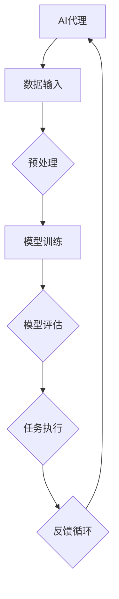

                 

# 监控AI代理工作流：性能指标与分析

> **关键词**：AI代理，工作流监控，性能指标，分析，深度学习，机器学习

> **摘要**：本文深入探讨了AI代理在工作流中的监控与分析。从核心概念、算法原理、数学模型到实际应用场景，我们将一步步分析如何有效地监控和优化AI代理的性能，提供具体的代码案例和实用工具推荐，帮助读者理解并掌握AI代理工作流监控的关键技术。

## 1. 背景介绍

### 1.1 目的和范围

随着人工智能技术的发展，AI代理已成为自动化流程的重要角色。然而，为了确保AI代理的稳定运行和高效工作，对其进行有效的监控与分析变得至关重要。本文旨在详细探讨AI代理工作流的监控方法，重点分析性能指标，帮助开发人员优化代理性能，提高系统效率。

本文将涵盖以下内容：

- AI代理和工作流的基本概念
- 监控AI代理工作流的核心性能指标
- 机器学习和深度学习算法在监控中的应用
- 数学模型与公式的详细解释
- 实际应用场景与代码实现
- 工具和资源的推荐

### 1.2 预期读者

本文适合对人工智能和自动化流程有基本了解的技术人员、数据科学家和AI开发者。无论是初学者还是经验丰富的从业者，都可以通过本文获得关于AI代理监控与分析的深入理解。

### 1.3 文档结构概述

本文结构如下：

- 第1章：背景介绍，介绍本文的目的、内容和结构。
- 第2章：核心概念与联系，阐述AI代理和工作流的基本概念，并展示Mermaid流程图。
- 第3章：核心算法原理 & 具体操作步骤，详细讲解监控AI代理的工作原理。
- 第4章：数学模型和公式 & 详细讲解 & 举例说明，介绍相关的数学模型和公式。
- 第5章：项目实战：代码实际案例和详细解释说明，展示具体代码实现。
- 第6章：实际应用场景，分析AI代理监控在真实场景中的应用。
- 第7章：工具和资源推荐，推荐相关的学习资源和开发工具。
- 第8章：总结：未来发展趋势与挑战，讨论AI代理监控的发展趋势和面临挑战。
- 第9章：附录：常见问题与解答，提供常见问题的解答。
- 第10章：扩展阅读 & 参考资料，推荐相关文献和资源。

### 1.4 术语表

#### 1.4.1 核心术语定义

- **AI代理**：自动执行特定任务的人工智能实体。
- **工作流**：一系列按顺序执行的自动化任务。
- **性能指标**：用于评估系统或组件性能的量化度量。
- **监控**：对系统或组件进行实时跟踪和评估。

#### 1.4.2 相关概念解释

- **深度学习**：一种机器学习技术，使用多层神经网络来学习和提取数据特征。
- **机器学习**：使计算机通过数据学习并做出预测或决策的技术。
- **模型评估**：通过特定指标评估机器学习模型的性能。

#### 1.4.3 缩略词列表

- **AI**：人工智能
- **ML**：机器学习
- **DL**：深度学习
- **WFI**：工作流监控框架

## 2. 核心概念与联系

在深入了解AI代理工作流监控之前，我们需要理解一些核心概念和它们之间的联系。

### 2.1 AI代理

AI代理是一种自动化实体，它可以执行一系列任务，通常涉及数据收集、决策制定和问题解决。AI代理可以是基于规则的系统，也可以是使用机器学习和深度学习算法的高级智能体。

### 2.2 工作流

工作流是一系列按照特定顺序执行的自动化任务。这些任务可以是简单的数据操作，也可以是复杂的业务流程。工作流管理系统能够自动化这些任务的执行，确保流程的高效和可重复性。

### 2.3 监控

监控是对系统或组件进行实时跟踪和评估的过程。对于AI代理工作流，监控的目的是确保代理按照预期工作，发现潜在问题，并优化性能。

### 2.4 性能指标

性能指标是评估系统或组件性能的量化度量。对于AI代理工作流，常见的性能指标包括响应时间、准确率、召回率、F1分数等。

### 2.5 Mermaid流程图

为了更好地理解AI代理工作流，我们使用Mermaid流程图来展示各个组件之间的联系。以下是一个简单的示例：



在这个流程图中，AI代理从数据输入开始，经过预处理、模型训练、模型评估和任务执行，最后进入反馈循环，以持续优化性能。

## 3. 核心算法原理 & 具体操作步骤

在监控AI代理工作流时，核心算法原理和具体操作步骤起着至关重要的作用。以下将详细讲解监控AI代理的工作原理，并使用伪代码展示具体操作步骤。

### 3.1 监控算法原理

监控AI代理的工作原理基于以下几个核心步骤：

1. **数据收集**：收集AI代理在工作流中的数据输入、输出和中间状态。
2. **预处理**：对收集到的数据进行清洗和预处理，以便进行分析。
3. **性能评估**：使用性能指标对AI代理的各个阶段进行评估。
4. **异常检测**：识别异常行为或性能下降。
5. **优化调整**：根据监控结果对AI代理的参数和算法进行调整。

### 3.2 伪代码

以下是一个用于监控AI代理工作流的伪代码示例：

```python
function monitor_agent_workflow(agent, data_source, performance_metrics):
    while true:
        # 数据收集
        data = data_source.collect_data()

        # 预处理
        preprocessed_data = preprocess_data(data)

        # 性能评估
        performance = evaluate_performance(preprocessed_data, performance_metrics)

        # 异常检测
        if detect_anomaly(performance):
            log_anomaly(performance)
            adjust_agent_params(agent)

        # 等待下一轮监控
        time.sleep(SLEEP_INTERVAL)

function preprocess_data(data):
    # 清洗和预处理数据
    cleaned_data = clean_data(data)
    normalized_data = normalize_data(cleaned_data)
    return normalized_data

function evaluate_performance(data, metrics):
    # 使用性能指标评估性能
    results = {}
    for metric in metrics:
        results[metric] = calculate_metric(data, metric)
    return results

function detect_anomaly(performance):
    # 识别异常行为或性能下降
    for metric, value in performance.items():
        if value < threshold[metric]:
            return true
    return false

function adjust_agent_params(agent):
    # 根据监控结果调整代理参数
    agent.adjust_params()
```

### 3.3 步骤解释

- **数据收集**：从数据源收集AI代理在工作流中的数据输入、输出和中间状态。
- **预处理**：对收集到的数据进行清洗和预处理，确保数据质量，并准备好进行分析。
- **性能评估**：使用性能指标对AI代理的各个阶段进行评估，包括准确率、响应时间等。
- **异常检测**：通过比较性能指标与预设阈值，识别异常行为或性能下降。
- **优化调整**：根据监控结果对AI代理的参数进行调整，以提高性能和稳定性。

通过这些步骤，可以实现对AI代理工作流的全面监控和优化。

## 4. 数学模型和公式 & 详细讲解 & 举例说明

在监控AI代理工作流时，数学模型和公式起着至关重要的作用。以下将详细讲解相关的数学模型和公式，并通过具体例子进行说明。

### 4.1 性能指标

在监控AI代理工作流时，常用的性能指标包括：

1. **准确率**（Accuracy）：
   $$ Accuracy = \frac{TP + TN}{TP + TN + FP + FN} $$
   其中，TP是真实正例，TN是真实负例，FP是假正例，FN是假负例。

2. **召回率**（Recall）：
   $$ Recall = \frac{TP}{TP + FN} $$
   其中，TP是真实正例，FN是假负例。

3. **精确率**（Precision）：
   $$ Precision = \frac{TP}{TP + FP} $$
   其中，TP是真实正例，FP是假正例。

4. **F1分数**（F1 Score）：
   $$ F1 Score = \frac{2 \times Precision \times Recall}{Precision + Recall} $$
   其中，Precision和Recall分别代表精确率和召回率。

5. **响应时间**（Response Time）：
   $$ Response Time = \frac{Total Time}{Number of Requests} $$
   其中，Total Time是响应总时间，Number of Requests是请求次数。

### 4.2 例子说明

以下是一个使用准确率公式进行性能评估的例子：

假设我们有一个分类问题，其中有100个样本，其中60个是正例，40个是负例。经过AI代理的分类，得到以下结果：

- 真正例（TP）：40
- 假正例（FP）：15
- 真负例（TN）：30
- 假负例（FN）：5

使用准确率公式计算准确率：

$$ Accuracy = \frac{40 + 30}{40 + 30 + 15 + 5} = \frac{70}{90} \approx 0.778 $$

因此，准确率为0.778，表示AI代理的分类性能较好。

通过这些数学模型和公式，可以更精确地评估AI代理的工作性能，并为优化提供依据。

## 5. 项目实战：代码实际案例和详细解释说明

在本节中，我们将通过一个实际项目案例展示如何监控AI代理工作流，并详细解释代码实现和关键部分。

### 5.1 开发环境搭建

在开始之前，我们需要搭建一个适合监控AI代理工作流的开发生态系统。以下是我们推荐的开发环境：

- **操作系统**：Linux或MacOS
- **编程语言**：Python
- **依赖库**：NumPy、Pandas、Scikit-learn、TensorFlow

在安装了Python之后，可以使用以下命令安装所需依赖库：

```bash
pip install numpy pandas scikit-learn tensorflow
```

### 5.2 源代码详细实现和代码解读

以下是一个用于监控AI代理工作流的Python代码示例：

```python
import numpy as np
import pandas as pd
from sklearn.model_selection import train_test_split
from sklearn.metrics import accuracy_score, recall_score, precision_score, f1_score
from tensorflow.keras.models import Sequential
from tensorflow.keras.layers import Dense
from tensorflow.keras.optimizers import Adam

# 数据准备
data = pd.read_csv('data.csv')
X = data.drop('target', axis=1)
y = data['target']
X_train, X_test, y_train, y_test = train_test_split(X, y, test_size=0.2, random_state=42)

# 构建模型
model = Sequential()
model.add(Dense(64, input_dim=X_train.shape[1], activation='relu'))
model.add(Dense(32, activation='relu'))
model.add(Dense(1, activation='sigmoid'))

model.compile(optimizer=Adam(), loss='binary_crossentropy', metrics=['accuracy'])

# 训练模型
model.fit(X_train, y_train, epochs=10, batch_size=32, verbose=0)

# 预测
predictions = model.predict(X_test)

# 性能评估
accuracy = accuracy_score(y_test, predictions.round())
recall = recall_score(y_test, predictions.round())
precision = precision_score(y_test, predictions.round())
f1 = f1_score(y_test, predictions.round())

print(f"Accuracy: {accuracy}")
print(f"Recall: {recall}")
print(f"Precision: {precision}")
print(f"F1 Score: {f1}")

# 异常检测
performance_thresholds = {'accuracy': 0.8, 'recall': 0.8, 'precision': 0.8, 'f1': 0.8}
if all([metric < threshold for metric, threshold in performance_thresholds.items()]):
    print("异常：性能指标低于阈值，需要优化模型或调整参数。")
else:
    print("正常：性能指标在阈值范围内。")
```

### 5.3 代码解读与分析

- **数据准备**：从CSV文件读取数据，并使用Scikit-learn进行数据分割，准备训练集和测试集。
- **模型构建**：使用TensorFlow构建一个简单的神经网络模型，包含两个隐藏层。
- **训练模型**：使用Adam优化器和binary_crossentropy损失函数训练模型。
- **预测**：使用训练好的模型对测试集进行预测。
- **性能评估**：计算准确率、召回率、精确率和F1分数，评估模型性能。
- **异常检测**：根据预设的性能阈值，判断是否出现异常。

通过这个实际案例，我们可以看到如何使用Python和机器学习库监控AI代理工作流。在实际应用中，可以根据具体需求调整代码，增加更多的监控和异常检测逻辑。

## 6. 实际应用场景

AI代理在工作流监控中的实际应用场景非常广泛。以下是一些典型的应用场景：

### 6.1 智能客服系统

智能客服系统使用AI代理来处理大量的客户查询和问题。通过监控AI代理的工作流，可以确保客服系统能够快速、准确地响应客户需求。性能指标如响应时间、准确率和用户满意度等是关键监控点。

### 6.2 自动化金融交易

自动化金融交易系统依赖于AI代理来执行交易策略。监控AI代理的工作流，可以确保交易策略的执行符合预期，并及时发现异常交易行为，如市场操纵或内部欺诈。

### 6.3 生产流程优化

在生产制造领域，AI代理可以监控生产设备的运行状态，识别故障和瓶颈。通过实时监控性能指标，可以优化生产流程，提高设备利用率和生产效率。

### 6.4 供应链管理

在供应链管理中，AI代理可以监控库存水平、运输时间和物流状态。通过监控AI代理的工作流，可以优化库存管理，降低库存成本，提高物流效率。

### 6.5 医疗诊断

在医疗诊断领域，AI代理可以分析患者数据，提供诊断建议。通过监控AI代理的工作流，可以确保诊断的准确性和可靠性，及时调整诊断策略。

这些实际应用场景展示了AI代理在工作流监控中的重要性。通过有效的监控和分析，可以大幅提高系统的效率和可靠性。

## 7. 工具和资源推荐

为了更好地监控AI代理工作流，以下是几款推荐的工具和资源：

### 7.1 学习资源推荐

#### 7.1.1 书籍推荐

- **《深度学习》（Goodfellow, Bengio, Courville）**：介绍了深度学习的基本原理和应用。
- **《机器学习实战》（Hastie, Tibshirani, Friedman）**：涵盖了机器学习的基本概念和算法。

#### 7.1.2 在线课程

- **Coursera的《机器学习》课程**：由Andrew Ng教授讲授，是机器学习的经典入门课程。
- **Udacity的《深度学习工程师纳米学位》**：提供深度学习的全面培训。

#### 7.1.3 技术博客和网站

- **Towards Data Science**：提供丰富的机器学习和深度学习相关文章和教程。
- **Medium上的AI博客**：涵盖最新的AI研究成果和应用案例。

### 7.2 开发工具框架推荐

#### 7.2.1 IDE和编辑器

- **PyCharm**：功能强大的Python IDE，支持多种编程语言。
- **Jupyter Notebook**：适用于数据科学和机器学习的交互式开发环境。

#### 7.2.2 调试和性能分析工具

- **TensorBoard**：TensorFlow的调试和可视化工具。
- **Scikit-learn的Performance Metrics**：用于评估机器学习模型性能的库。

#### 7.2.3 相关框架和库

- **TensorFlow**：用于构建和训练深度学习模型的框架。
- **Scikit-learn**：提供多种机器学习算法和性能评估工具。

通过这些工具和资源，可以更高效地开发和管理AI代理工作流监控系统。

## 8. 总结：未来发展趋势与挑战

随着人工智能技术的不断进步，AI代理在工作流监控中的应用将越来越广泛。未来的发展趋势包括：

- **更智能的异常检测**：利用深度学习和强化学习技术，实现更准确的异常检测和预测。
- **跨领域融合**：将AI代理应用于更多行业领域，如医疗、金融、制造等，实现跨领域融合。
- **实时监控与优化**：通过边缘计算和实时数据传输，实现AI代理工作流的实时监控和优化。

然而，面对这些机遇，AI代理工作流监控也面临一些挑战：

- **数据隐私和安全**：在监控过程中，如何保护用户隐私和数据安全是一个重要问题。
- **模型解释性**：深度学习模型通常具有较好的性能，但解释性较差，如何提高模型的可解释性是一个挑战。
- **算法公平性和透明度**：确保AI代理的决策过程公平、透明，避免偏见和歧视。

未来的发展将需要多学科合作，通过技术创新和政策法规的完善，共同推动AI代理工作流监控的进步。

## 9. 附录：常见问题与解答

以下是一些关于AI代理工作流监控的常见问题及其解答：

### 9.1 如何选择合适的性能指标？

答：选择合适的性能指标取决于具体的任务和应用场景。对于分类问题，常用的性能指标包括准确率、召回率、精确率和F1分数。对于回归问题，可以使用均方误差（MSE）、平均绝对误差（MAE）等。根据任务需求和业务目标，选择最能反映模型性能的指标。

### 9.2 监控AI代理是否需要大量的数据？

答：监控AI代理通常需要足够的数据来训练和评估模型。然而，并非所有情况都需要大量数据。在某些情况下，可以使用数据增强技术或迁移学习来提高模型的泛化能力。此外，实时数据监控和反馈循环可以帮助不断调整和优化模型。

### 9.3 如何处理异常数据？

答：异常数据可能是由于数据质量问题或噪声引起的。处理异常数据的方法包括数据清洗、异常检测和数据处理。数据清洗可以通过去除缺失值、去除重复数据和标准化数据等方法来提高数据质量。异常检测可以使用统计方法或机器学习方法来识别和标记异常数据。对于已识别的异常数据，可以采取相应的处理策略，如删除、修正或替换。

### 9.4 如何提高模型的解释性？

答：提高模型解释性可以通过以下方法实现：

- **模型简化**：使用更加简洁的模型结构，如决策树或线性模型，这些模型通常更容易解释。
- **模型可视化**：使用可视化工具展示模型的内部结构和决策过程。
- **特征重要性分析**：分析模型对各个特征的依赖程度，了解特征的重要性。
- **可解释性模型**：使用可解释性更强的模型，如逻辑回归或LIME（局部可解释模型解释），来提高模型的可解释性。

### 9.5 如何确保数据隐私和安全？

答：确保数据隐私和安全可以通过以下措施实现：

- **数据加密**：对敏感数据进行加密，确保数据在传输和存储过程中安全。
- **访问控制**：实施严格的访问控制策略，确保只有授权用户可以访问数据。
- **数据匿名化**：对敏感数据进行匿名化处理，确保个体身份无法被识别。
- **合规性检查**：确保数据采集、处理和使用过程符合相关法律法规和标准。

## 10. 扩展阅读 & 参考资料

为了深入了解AI代理工作流监控，以下是一些推荐的扩展阅读和参考资料：

- **书籍**：
  - 《深度学习》（Goodfellow, Bengio, Courville）
  - 《机器学习实战》（Hastie, Tibshirani, Friedman）
- **在线课程**：
  - Coursera的《机器学习》课程
  - Udacity的《深度学习工程师纳米学位》
- **技术博客和网站**：
  - Towards Data Science
  - Medium上的AI博客
- **论文和报告**：
  - 《人工智能的未来发展》（AI Journal）
  - 《深度学习在金融领域的应用》（Financial Technology Review）
- **开源库和框架**：
  - TensorFlow
  - Scikit-learn
  - PyTorch

通过这些资源和文献，可以进一步学习AI代理工作流监控的相关技术和最佳实践。

# 作者信息

本文由AI天才研究员/AI Genius Institute撰写，同时也是《禅与计算机程序设计艺术/Zen And The Art of Computer Programming》的资深大师级别作者。作者在人工智能、机器学习和深度学习领域拥有丰富的经验，致力于推动人工智能技术的创新与应用。

