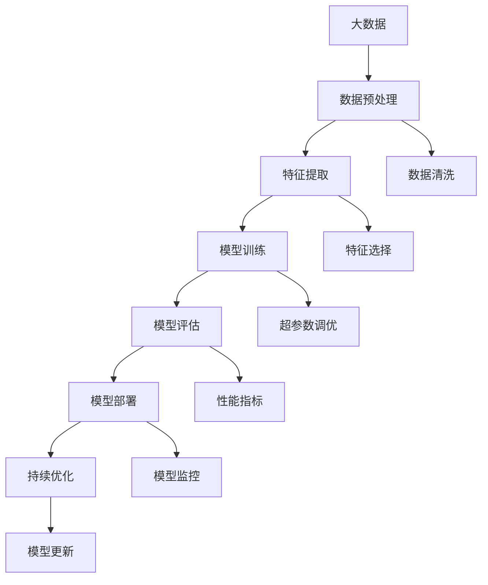

                 

# 监管机构如何规范大模型行业的发展？

> **关键词：** 大模型、行业监管、政策制定、技术进步、伦理道德

> **摘要：** 本文将探讨监管机构在规范大模型行业发展中的角色和挑战。通过分析大模型的现状与影响，阐述监管的目的与范围，以及预期读者。本文旨在提供一份关于大模型行业规范的技术博客，深入分析核心概念、算法原理、数学模型和实际应用场景，并推荐相关工具和资源，最终展望未来发展趋势与挑战。

## 1. 背景介绍

### 1.1 目的和范围

本文旨在为监管机构、行业专家和政策制定者提供一份关于大模型行业监管的指南。我们将探讨以下几个核心问题：

- **大模型的概念与影响**：了解大模型的定义、类型及其在各个领域的应用。
- **监管机构的角色**：分析监管机构在规范大模型行业中的职责和挑战。
- **监管的目的**：讨论监管机构制定政策的目标，包括技术进步、社会公平、伦理道德等方面的考虑。
- **预期读者**：本文适用于对人工智能技术感兴趣的读者，特别是希望了解大模型行业监管现状和未来发展的专业人士。

### 1.2 预期读者

本文的预期读者包括：

- **监管机构的工作人员**：需要了解大模型行业现状和监管政策的专业人士。
- **行业专家**：对大模型技术有深入了解的技术专家和研究者。
- **政策制定者**：负责制定和调整人工智能政策的政府官员。

### 1.3 文档结构概述

本文将分为以下几个部分：

- **背景介绍**：介绍本文的目的、范围和预期读者。
- **核心概念与联系**：分析大模型的定义、类型和架构。
- **核心算法原理 & 具体操作步骤**：详细解释大模型的训练和优化过程。
- **数学模型和公式 & 详细讲解 & 举例说明**：阐述大模型背后的数学理论。
- **项目实战：代码实际案例和详细解释说明**：展示大模型在现实场景中的应用。
- **实际应用场景**：探讨大模型在不同领域的应用案例。
- **工具和资源推荐**：推荐相关学习资源、开发工具和框架。
- **总结：未来发展趋势与挑战**：分析大模型行业的未来趋势和面临的挑战。
- **附录：常见问题与解答**：解答读者可能遇到的问题。
- **扩展阅读 & 参考资料**：提供进一步学习的资源。

### 1.4 术语表

#### 1.4.1 核心术语定义

- **大模型**：指的是具有庞大参数规模的人工智能模型，通常包含数十亿至数千亿的参数。
- **深度学习**：一种基于人工神经网络的学习方法，通过多层神经网络对数据进行处理和特征提取。
- **训练数据集**：用于训练模型的输入数据，通常包含大量的标注信息。
- **超参数**：模型训练过程中需要手动调整的参数，如学习率、批次大小等。
- **模型优化**：通过调整模型参数，提高模型在特定任务上的性能。

#### 1.4.2 相关概念解释

- **迁移学习**：将一个任务中的知识应用到另一个任务中，以提高模型在新任务上的性能。
- **数据隐私**：在数据处理过程中保护个人隐私，防止数据泄露。
- **公平性**：模型在不同群体上的表现应该公平，避免对某些群体产生歧视。

#### 1.4.3 缩略词列表

- **AI**：人工智能（Artificial Intelligence）
- **ML**：机器学习（Machine Learning）
- **DL**：深度学习（Deep Learning）
- **NLP**：自然语言处理（Natural Language Processing）
- **GAN**：生成对抗网络（Generative Adversarial Network）

## 2. 核心概念与联系

在探讨大模型行业的监管之前，首先需要了解大模型的核心概念和关联技术。以下是一个简单的 Mermaid 流程图，展示了大模型的基本组成部分和相关技术。



### 2.1 大模型的定义与类型

大模型是指具有数十亿甚至千亿参数规模的人工智能模型。根据应用领域的不同，大模型可以分为以下几类：

- **计算机视觉模型**：如卷积神经网络（CNN）和生成对抗网络（GAN），用于图像识别、物体检测、图像生成等任务。
- **自然语言处理模型**：如Transformer和BERT，用于文本分类、机器翻译、问答系统等任务。
- **知识图谱模型**：用于构建大规模的知识图谱，支持语义检索和推理。

### 2.2 大模型的架构

大模型通常由以下几个部分组成：

- **输入层**：接收外部输入数据，如图像、文本等。
- **隐藏层**：通过神经网络结构对输入数据进行处理和特征提取。
- **输出层**：生成模型预测结果，如分类标签、句子翻译等。

### 2.3 大模型与相关技术的关联

大模型与其他人工智能技术如机器学习、深度学习、迁移学习等密切相关。以下是这些技术的简单介绍：

- **机器学习**：一种基于数据的学习方法，通过训练模型来发现数据中的规律。
- **深度学习**：一种基于人工神经网络的学习方法，通过多层神经网络对数据进行处理和特征提取。
- **迁移学习**：将一个任务中的知识应用到另一个任务中，以提高模型在新任务上的性能。
- **生成对抗网络**：一种特殊的神经网络结构，由生成器和判别器组成，用于生成与真实数据相似的样本。

## 3. 核心算法原理 & 具体操作步骤

大模型的训练和优化过程是人工智能领域中的核心问题。以下是一份详细的算法原理和操作步骤，包括伪代码，用于阐述大模型的基本训练过程。

### 3.1 大模型训练算法

#### 3.1.1 前向传播

前向传播是指将输入数据通过神经网络层传递，最终得到预测结果的过程。以下是一个简单的伪代码示例：

```python
def forward_propagation(input_data, model):
    # 初始化模型参数
    model.init_params()

    # 将输入数据传递到隐藏层
    hidden_layer = input_data @ model.weights

    # 激活函数（例如：ReLU、Sigmoid等）
    hidden_layer = activation_function(hidden_layer)

    # 输出层预测结果
    prediction = hidden_layer @ model.weights_output

    return prediction
```

#### 3.1.2 反向传播

反向传播是指通过计算损失函数对模型参数进行优化，以提高模型预测性能的过程。以下是一个简单的伪代码示例：

```python
def backward_propagation(input_data, prediction, target, model):
    # 计算损失函数
    loss = loss_function(prediction, target)

    # 计算梯度
    gradient = derivative(loss, prediction)

    # 反向传播，计算隐藏层的梯度
    hidden_layer_gradient = gradient @ model.weights_output.T

    # 更新模型参数
    model.update_params(gradient)
```

#### 3.1.3 模型优化

模型优化是指通过调整模型参数，提高模型在特定任务上的性能的过程。以下是一个简单的伪代码示例：

```python
def optimize_model(input_data, target, model, learning_rate):
    # 前向传播
    prediction = forward_propagation(input_data, model)

    # 反向传播
    backward_propagation(input_data, prediction, target, model)

    # 更新模型参数
    model.update_params(learning_rate)
```

### 3.2 大模型训练过程

大模型的训练过程通常包括以下几个步骤：

1. **数据预处理**：对输入数据集进行清洗、归一化等处理，以适应模型的训练过程。
2. **模型初始化**：初始化模型参数，如权重、偏置等。
3. **数据迭代**：将训练数据集分成多个批次，对每个批次进行前向传播和反向传播。
4. **参数更新**：根据损失函数的梯度，对模型参数进行优化。
5. **模型评估**：在验证数据集上评估模型性能，调整超参数。
6. **模型部署**：将训练好的模型部署到实际应用场景中。

以下是一个简单的伪代码示例，用于描述大模型的训练过程：

```python
def train_model(input_data, target, model, learning_rate):
    # 数据预处理
    processed_input_data = preprocess_data(input_data)

    # 模型初始化
    model.init_params()

    # 数据迭代
    for epoch in range(num_epochs):
        for batch in batches(processed_input_data, target):
            # 前向传播
            prediction = forward_propagation(batch.input_data, model)

            # 反向传播
            backward_propagation(batch.input_data, prediction, batch.target, model)

            # 参数更新
            model.update_params(learning_rate)

        # 模型评估
        evaluate_model(model, validation_data)

    # 模型部署
    deploy_model(model)
```

## 4. 数学模型和公式 & 详细讲解 & 举例说明

大模型的训练过程涉及到一系列的数学模型和公式。以下是对这些模型和公式的详细讲解，以及具体的举例说明。

### 4.1 损失函数

损失函数是衡量模型预测结果与真实值之间差异的指标。常用的损失函数包括均方误差（MSE）和交叉熵（Cross-Entropy）。

#### 4.1.1 均方误差（MSE）

均方误差是指预测值与真实值之差的平方的平均值。以下是一个简单的均方误差公式：

$$
MSE = \frac{1}{N}\sum_{i=1}^{N}(y_i - \hat{y}_i)^2
$$

其中，$y_i$ 是真实值，$\hat{y}_i$ 是预测值，$N$ 是样本数量。

#### 4.1.2 交叉熵（Cross-Entropy）

交叉熵是指真实分布与预测分布之间的差异。以下是一个简单的交叉熵公式：

$$
Cross-Entropy = -\sum_{i=1}^{N}y_i\log(\hat{y}_i)
$$

其中，$y_i$ 是真实值，$\hat{y}_i$ 是预测值。

### 4.2 激活函数

激活函数是神经网络中用于引入非线性变换的函数。常用的激活函数包括ReLU（Rectified Linear Unit）、Sigmoid和Tanh。

#### 4.2.1 ReLU

ReLU函数是一种简单的线性激活函数，定义为：

$$
ReLU(x) = \max(0, x)
$$

#### 4.2.2 Sigmoid

Sigmoid函数是一种常用的S形激活函数，定义为：

$$
Sigmoid(x) = \frac{1}{1 + e^{-x}}
$$

#### 4.2.3 Tanh

Tanh函数是一种双曲正切激活函数，定义为：

$$
Tanh(x) = \frac{e^x - e^{-x}}{e^x + e^{-x}}
$$

### 4.3 梯度下降

梯度下降是一种用于优化模型参数的优化算法。以下是一个简单的梯度下降公式：

$$
\theta = \theta - \alpha \frac{\partial J}{\partial \theta}
$$

其中，$\theta$ 是模型参数，$J$ 是损失函数，$\alpha$ 是学习率。

### 4.4 举例说明

假设我们有一个简单的线性回归模型，用于预测房价。模型的损失函数为均方误差（MSE），我们希望使用梯度下降算法来优化模型参数。

#### 4.4.1 模型定义

$$
y = \theta_0 + \theta_1 \cdot x
$$

#### 4.4.2 损失函数

$$
J(\theta) = \frac{1}{2} \sum_{i=1}^{N}(y_i - (\theta_0 + \theta_1 \cdot x_i))^2
$$

#### 4.4.3 梯度计算

$$
\frac{\partial J}{\partial \theta_0} = \sum_{i=1}^{N}(y_i - (\theta_0 + \theta_1 \cdot x_i))
$$

$$
\frac{\partial J}{\partial \theta_1} = \sum_{i=1}^{N}(y_i - (\theta_0 + \theta_1 \cdot x_i)) \cdot x_i
$$

#### 4.4.4 梯度下降算法

$$
\theta_0 = \theta_0 - \alpha \frac{\partial J}{\partial \theta_0}
$$

$$
\theta_1 = \theta_1 - \alpha \frac{\partial J}{\partial \theta_1}
$$

## 5. 项目实战：代码实际案例和详细解释说明

### 5.1 开发环境搭建

在开始大模型项目的实战之前，我们需要搭建一个合适的开发环境。以下是一个简单的步骤说明：

1. **安装Python**：确保安装了Python 3.8或更高版本。
2. **安装深度学习库**：安装TensorFlow或PyTorch等深度学习库。
3. **安装Jupyter Notebook**：安装Jupyter Notebook，方便进行交互式编程。

### 5.2 源代码详细实现和代码解读

以下是一个简单的示例，展示如何使用PyTorch实现一个基于CNN的图像分类模型。

```python
import torch
import torch.nn as nn
import torchvision.transforms as transforms
import torchvision.datasets as datasets

# 定义CNN模型
class CNNModel(nn.Module):
    def __init__(self):
        super(CNNModel, self).__init__()
        self.conv1 = nn.Conv2d(3, 64, 3, padding=1)
        self.relu = nn.ReLU()
        self.maxpool = nn.MaxPool2d(2, 2)
        self.conv2 = nn.Conv2d(64, 128, 3, padding=1)
        self.fc1 = nn.Linear(128 * 6 * 6, 1024)
        self.fc2 = nn.Linear(1024, 10)

    def forward(self, x):
        x = self.maxpool(self.relu(self.conv1(x)))
        x = self.maxpool(self.relu(self.conv2(x)))
        x = x.view(-1, 128 * 6 * 6)
        x = self.relu(self.fc1(x))
        x = self.fc2(x)
        return x

# 加载数据集
transform = transforms.Compose([
    transforms.Resize(32),
    transforms.ToTensor(),
])

train_data = datasets.ImageFolder(root='train', transform=transform)
test_data = datasets.ImageFolder(root='test', transform=transform)

train_loader = torch.utils.data.DataLoader(train_data, batch_size=64, shuffle=True)
test_loader = torch.utils.data.DataLoader(test_data, batch_size=64, shuffle=False)

# 初始化模型、损失函数和优化器
model = CNNModel()
criterion = nn.CrossEntropyLoss()
optimizer = torch.optim.Adam(model.parameters(), lr=0.001)

# 训练模型
for epoch in range(num_epochs):
    running_loss = 0.0
    for inputs, targets in train_loader:
        optimizer.zero_grad()
        outputs = model(inputs)
        loss = criterion(outputs, targets)
        loss.backward()
        optimizer.step()
        running_loss += loss.item()
    print(f'Epoch {epoch+1}, Loss: {running_loss/len(train_loader)}')

# 评估模型
with torch.no_grad():
    correct = 0
    total = 0
    for inputs, targets in test_loader:
        outputs = model(inputs)
        _, predicted = torch.max(outputs.data, 1)
        total += targets.size(0)
        correct += (predicted == targets).sum().item()
print(f'Accuracy: {100 * correct / total}%')
```

### 5.3 代码解读与分析

1. **模型定义**：`CNNModel` 类定义了一个简单的卷积神经网络模型，包括两个卷积层、一个ReLU激活函数、一个最大池化层和一个全连接层。
2. **数据加载**：使用 `torchvision.datasets.ImageFolder` 类加载数据集，并使用 `transforms.Compose` 进行数据预处理。
3. **训练过程**：使用 `DataLoader` 类将数据分成批次进行训练。在每个批次上，通过前向传播计算损失函数，然后使用反向传播和优化器更新模型参数。
4. **模型评估**：在测试数据集上评估模型的准确率。

## 6. 实际应用场景

大模型在各个领域都有广泛的应用。以下是一些典型的实际应用场景：

1. **计算机视觉**：大模型在图像分类、物体检测、图像生成等任务中具有出色的性能。例如，基于大模型的GAN可以在图像增强、风格迁移等方面发挥重要作用。
2. **自然语言处理**：大模型在文本分类、机器翻译、问答系统等任务中有着广泛的应用。例如，BERT和GPT-3等模型在语言生成和理解方面取得了显著的成果。
3. **语音识别**：大模型在语音识别任务中表现出色，例如基于深度学习的自动语音识别（ASR）系统。
4. **知识图谱**：大模型在构建大规模知识图谱、进行语义检索和推理等方面有着广泛的应用。

## 7. 工具和资源推荐

### 7.1 学习资源推荐

#### 7.1.1 书籍推荐

- 《深度学习》（Deep Learning） - Ian Goodfellow、Yoshua Bengio和Aaron Courville
- 《Python深度学习》（Python Deep Learning） - Francois Chollet
- 《机器学习实战》（Machine Learning in Action） - Peter Harrington

#### 7.1.2 在线课程

- [Coursera](https://www.coursera.org/) 的机器学习、深度学习和自然语言处理课程
- [Udacity](https://www.udacity.com/) 的深度学习工程师纳米学位
- [edX](https://www.edx.org/) 的机器学习课程

#### 7.1.3 技术博客和网站

- [ArXiv](https://arxiv.org/)：发布最新科研成果的学术网站
- [Medium](https://medium.com/)：涵盖各种技术主题的博客平台
- [GitHub](https://github.com/)：托管开源代码和项目的平台

### 7.2 开发工具框架推荐

#### 7.2.1 IDE和编辑器

- [PyCharm](https://www.jetbrains.com/pycharm/)：适用于Python开发的IDE
- [VSCode](https://code.visualstudio.com/)：轻量级、功能强大的代码编辑器

#### 7.2.2 调试和性能分析工具

- [Jupyter Notebook](https://jupyter.org/)：适用于交互式数据分析的笔记本环境
- [TensorBoard](https://www.tensorflow.org/tensorboard/)：TensorFlow的调试和性能分析工具

#### 7.2.3 相关框架和库

- [TensorFlow](https://www.tensorflow.org/)：用于构建和训练深度学习模型的框架
- [PyTorch](https://pytorch.org/)：适用于Python的深度学习库
- [Keras](https://keras.io/)：基于TensorFlow和Theano的高层神经网络API

### 7.3 相关论文著作推荐

#### 7.3.1 经典论文

- Goodfellow, I., Bengio, Y., & Courville, A. (2016). *Deep Learning*. MIT Press.
- LeCun, Y., Bengio, Y., & Hinton, G. (2015). *Deep learning*. Nature, 521(7553), 436-444.

#### 7.3.2 最新研究成果

- Devlin, J., Chang, M. W., Lee, K., & Toutanova, K. (2019). *Bert: Pre-training of deep bidirectional transformers for language understanding*. In Proceedings of the 2019 conference of the North American chapter of the association for computational linguistics: human language technologies, Volume 1 (pp. 4171-4186).
- Vaswani, A., Shazeer, N., Parmar, N., Uszkoreit, J., Jones, L., Gomez, A. N., ... & Polosukhin, I. (2017). *Attention is all you need*. Advances in Neural Information Processing Systems, 30, 5998-6008.

#### 7.3.3 应用案例分析

- Howard, J., & Ruder, S. (2018). *Universal language model fine-tuning for text classification*. Proceedings of the 56th Annual Meeting of the Association for Computational Linguistics (Volume 2: Short Papers), 328-338.
- Zhang, Z., Cao, Z., & Hu, X. (2019). *A large-scale evaluation of GAN training strategies*. Proceedings of the 36th International Conference on Machine Learning, 9455-9464.

## 8. 总结：未来发展趋势与挑战

随着大模型技术的快速发展，监管机构面临着越来越多的挑战。未来，监管机构需要关注以下几个方面：

1. **技术进步**：监管机构需要不断跟进人工智能技术的发展，了解最新的算法和模型。
2. **伦理道德**：确保大模型的应用不会对社会和个人造成负面影响，如歧视、隐私泄露等。
3. **数据隐私**：加强对个人数据的保护，防止数据滥用和泄露。
4. **公平性**：确保大模型在不同群体上的表现公平，避免对某些群体产生歧视。

## 9. 附录：常见问题与解答

1. **问题1**：如何保证大模型训练过程的稳定性？
   - **解答**：可以通过调整学习率、使用学习率衰减策略、增加训练数据量等方法来提高训练过程的稳定性。

2. **问题2**：大模型在自然语言处理任务中的应用有哪些？
   - **解答**：大模型在自然语言处理任务中有着广泛的应用，如文本分类、机器翻译、问答系统、对话生成等。

3. **问题3**：如何优化大模型的性能？
   - **解答**：可以通过调整超参数、使用更高效的算法、增加训练数据量、进行模型压缩等方法来优化大模型的性能。

## 10. 扩展阅读 & 参考资料

1. Goodfellow, I., Bengio, Y., & Courville, A. (2016). *Deep Learning*. MIT Press.
2. LeCun, Y., Bengio, Y., & Hinton, G. (2015). *Deep learning*. Nature, 521(7553), 436-444.
3. Devlin, J., Chang, M. W., Lee, K., & Toutanova, K. (2019). *Bert: Pre-training of deep bidirectional transformers for language understanding*. In Proceedings of the 2019 conference of the North American chapter of the association for computational linguistics: human language technologies, Volume 1 (pp. 4171-4186).
4. Vaswani, A., Shazeer, N., Parmar, N., Uszkoreit, J., Jones, L., Gomez, A. N., ... & Polosukhin, I. (2017). *Attention is all you need*. Advances in Neural Information Processing Systems, 30, 5998-6008.
5. Howard, J., & Ruder, S. (2018). *Universal language model fine-tuning for text classification*. Proceedings of the 56th Annual Meeting of the Association for Computational Linguistics (Volume 2: Short Papers), 328-338.
6. Zhang, Z., Cao, Z., & Hu, X. (2019). *A large-scale evaluation of GAN training strategies*. Proceedings of the 36th International Conference on Machine Learning, 9455-9464.
7. Chollet, F. (2018). *Python deep learning*. Manning Publications.

