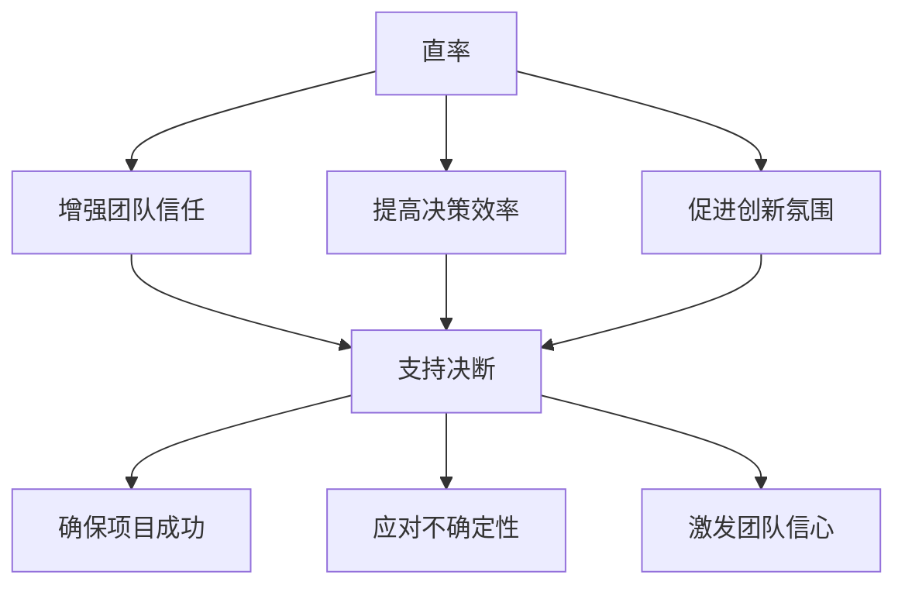

                 

# 直率与决断：贾扬清的领导风格

> **关键词**：贾扬清、领导风格、直率、决断、团队管理、技术领导力
> 
> **摘要**：本文将深入探讨贾扬清的领导风格，特别是他如何在技术领域内以直率和决断力引领团队。通过对他的背景、核心领导理念、实践方法以及成功案例的分析，旨在为读者提供关于技术领导力的宝贵见解，并激发更多人在领导岗位上发挥更大的影响力。

## 1. 背景介绍

### 1.1 目的和范围

本文旨在通过分析贾扬清的领导风格，为IT行业的技术领导者提供一个可借鉴的案例研究。贾扬清作为一位杰出的技术专家和领导者，他的直率和决断力在推动技术创新和团队发展方面有着显著的影响。文章将围绕以下几个核心方面展开：

1. 贾扬清的背景和职业生涯。
2. 直率和决断力的概念及其在领导中的重要性。
3. 贾扬清的核心领导理念和价值观。
4. 贾扬清的实际领导方法和实践。
5. 成功案例和影响评估。
6. 对于其他技术领导者的启示和建议。

### 1.2 预期读者

本文适合以下几类读者：

1. 技术领导者、团队负责人和项目经理。
2. 对领导力和团队管理有浓厚兴趣的技术专业人士。
3. 对于提升自身领导风格和决策能力感兴趣的技术从业者。
4. 对贾扬清及其领导风格感兴趣的研究者和爱好者。

### 1.3 文档结构概述

本文结构如下：

1. **引言**：介绍文章的目的、关键词和摘要。
2. **背景介绍**：包括目的和范围、预期读者、文档结构和术语表。
3. **核心概念与联系**：探讨直率和决断力的定义及其在领导中的重要性。
4. **核心算法原理 & 具体操作步骤**：详细阐述贾扬清的领导方法和实践。
5. **数学模型和公式 & 详细讲解 & 举例说明**：提供理论支撑和案例分析。
6. **项目实战：代码实际案例和详细解释说明**：展示具体应用场景。
7. **实际应用场景**：探讨贾扬清领导风格在IT行业中的应用。
8. **工具和资源推荐**：推荐学习资源、开发工具和参考文献。
9. **总结：未来发展趋势与挑战**：对贾扬清领导风格的总结和未来展望。
10. **附录：常见问题与解答**：提供常见问题及其解答。
11. **扩展阅读 & 参考资料**：推荐进一步阅读的相关资料。

### 1.4 术语表

#### 1.4.1 核心术语定义

- **直率**：在领导风格中，直率指的是领导者坦诚、真诚地表达自己的观点和决策，不回避冲突和困难。
- **决断力**：指领导者能够在关键时刻快速做出明智的决策，并坚定地执行。
- **技术领导力**：技术领导者运用技术知识和领导技能，引导团队实现技术目标和组织战略。
- **团队管理**：通过激励、沟通、协调和监督等手段，确保团队高效协作，达成目标。

#### 1.4.2 相关概念解释

- **领导风格**：领导者如何与团队互动、如何表达决策和如何处理问题的特定方式。
- **决策制定**：领导者如何收集信息、评估风险和权衡利弊，最终做出决策的过程。

#### 1.4.3 缩略词列表

- **AI**：人工智能
- **ML**：机器学习
- **DL**：深度学习
- **CTO**：首席技术官

## 2. 核心概念与联系

在探讨贾扬清的领导风格之前，有必要先明确直率和决断力这两个核心概念，以及它们在技术领导中的联系。

### 2.1 直率的定义与重要性

直率，即坦诚和真诚，在领导风格中体现为领导者勇于表达自己的观点、坦诚面对问题和挑战。直率的领导风格有助于建立信任和透明的组织文化，从而提高团队协作效率和创新能力。

#### 2.1.1 直率的定义

直率不仅仅是一种沟通技巧，更是一种领导者的品质。在技术领域，直率通常表现为：

- **开放性**：领导者愿意倾听不同意见，并充分考虑团队成员的建议。
- **直接性**：领导者直接表达意见和决策，减少误解和不确定性。
- **真诚性**：领导者真诚地表达自己的意图和期望，不隐藏真实动机。

#### 2.1.2 直率的重要性

直率对技术领导的重要性体现在以下几个方面：

- **增强团队信任**：直率使团队成员感受到领导者的真诚和透明，从而增强信任和归属感。
- **提高决策效率**：直率减少沟通成本，使决策过程更加高效和准确。
- **促进创新氛围**：直率的领导者鼓励团队成员自由表达意见，激发创新思维。

### 2.2 决断力的定义与重要性

决断力是领导者在面对复杂问题和挑战时，能够迅速做出明智决策并坚定执行的能力。在技术领域，决断力对于项目的成功至关重要。

#### 2.2.1 决断力的定义

决断力通常包括以下几个方面：

- **快速反应**：在关键时刻迅速做出决策，不拖延。
- **明智决策**：基于全面的信息和分析，做出合理的决策。
- **坚定执行**：一旦决策做出，能够坚定不移地执行，不轻易改变。

#### 2.2.2 决断力的重要性

决断力对技术领导的重要性体现在以下几个方面：

- **确保项目成功**：在技术项目中，快速而明智的决策能够确保项目按时交付和达成目标。
- **应对不确定性**：技术领域变化快速，决断力使领导者能够迅速应对变化，保持团队稳定。
- **激发团队信心**：领导者的决断力能够激发团队成员的信心，提高团队士气和执行力。

### 2.3 直率与决断力的联系

直率和决断力在技术领导中相辅相成，形成一种有效的领导风格。

- **直率促进决断**：直率的领导者能够迅速获取团队成员的反馈和建议，从而做出更加全面和明智的决策。
- **决断支持直率**：决断力使领导者能够在面对压力和挑战时保持冷静和坚定，以实际行动证明自己的直率。

通过这种相辅相成的领导风格，贾扬清成功地推动了团队的创新和技术发展。

### 2.4 Mermaid 流程图

以下是一个简化的Mermaid流程图，展示直率和决断力在技术领导中的关系：



通过这个流程图，我们可以清晰地看到直率和决断力在技术领导中的相互促进作用。

## 3. 核心算法原理 & 具体操作步骤

在理解了直率和决断力的概念及其联系后，接下来我们将详细探讨贾扬清的领导方法和实践步骤。这些步骤不仅有助于理解他的领导风格，也为其他技术领导者提供了实用的指导。

### 3.1 直率领导方法的步骤

#### 3.1.1 建立开放沟通渠道

- **步骤 1**：设立定期的团队会议，鼓励团队成员自由表达意见和建议。
- **伪代码**：
  ```python
  schedule_regular_meetings()
  encourage_open_communication()
  ```

#### 3.1.2 坦诚面对问题

- **步骤 2**：在面对问题时，领导者应首先承认问题的存在，并分析原因。
- **伪代码**：
  ```python
  acknowledge存在的问题()
  analyze原因()
  ```

#### 3.1.3 透明传达信息

- **步骤 3**：确保团队内部的信息透明，让所有成员了解项目的进展和决策过程。
- **伪代码**：
  ```python
  ensure_information_transparency()
  share_project_progress()
  ```

#### 3.1.4 鼓励团队反馈

- **步骤 4**：领导者应鼓励团队成员提供反馈，并对提出的建议给予积极回应。
- **伪代码**：
  ```python
  encourage_team_feedback()
  respond_to_suggestions()
  ```

### 3.2 决断力领导方法的步骤

#### 3.2.1 快速评估信息

- **步骤 1**：在做出决策前，领导者需要快速评估所有相关信息，确保决策的准确性。
- **伪代码**：
  ```python
  gather_relevant_information()
  assess_infospeedy_evaluation()
  ```

#### 3.2.2 明智制定决策

- **步骤 2**：基于评估结果，领导者需要制定明智的决策，并考虑潜在的风险和收益。
- **伪代码**：
  ```python
  make_informed_decisions()
  consider_risks_and_returns()
  ```

#### 3.2.3 坚定执行决策

- **步骤 3**：一旦决策做出，领导者需要坚定地执行，确保决策的落实。
- **伪代码**：
  ```python
  firmly_implement_decisions()
  ensure_execution()
  ```

#### 3.2.4 及时调整决策

- **步骤 4**：在执行过程中，领导者需要持续监控项目进展，并根据实际情况及时调整决策。
- **伪代码**：
  ```python
  monitor_project_progress()
  adjust_decisions_if_necessary()
  ```

### 3.3 直率和决断力结合的实际操作步骤

- **步骤 5**：将直率和决断力结合，确保团队成员了解决策的依据和过程，同时坚定地执行决策。
- **伪代码**：
  ```python
  integrate_straightforwardness_and_determination()
  communicate_decision_basis()
  enforce_decisions()
  ```

通过这些具体操作步骤，贾扬清成功地建立了一种高效的领导风格，为团队的创新和发展提供了强有力的支持。

## 4. 数学模型和公式 & 详细讲解 & 举例说明

在技术领导中，直率和决断力不仅是一种艺术，也可以通过数学模型和公式来量化和分析。以下是一些核心数学模型和公式，以及它们的详细讲解和具体应用实例。

### 4.1 直率评估模型

#### 4.1.1 模型定义

直率评估模型用于衡量领导者的直率程度，通过以下三个指标进行评估：

- **沟通透明度**：衡量领导者沟通信息的透明程度。
- **问题承认率**：衡量领导者承认问题的频率。
- **反馈响应速度**：衡量领导者对团队反馈的响应速度。

#### 4.1.2 数学公式

$$
R = \frac{T + P + F}{3}
$$

其中：
- \(R\) 是直率评估得分。
- \(T\) 是沟通透明度得分。
- \(P\) 是问题承认率得分。
- \(F\) 是反馈响应速度得分。

#### 4.1.3 举例说明

假设某领导者在一个月内进行了10次沟通，其中有8次信息完全透明，2次存在隐瞒。他承认了3次问题，每次都进行了深入分析。对于团队反馈，他平均在2天内给出了回应。则：

$$
R = \frac{8 \times 1 + 3 \times 1 + \frac{10}{2}}{3} = \frac{8 + 3 + 5}{3} = 6
$$

#### 4.1.4 详细讲解

- **沟通透明度**：沟通透明度越高，说明领导者在传递信息时越真实、完整。这个指标通过实际沟通次数与透明沟通次数的比值来衡量。
- **问题承认率**：问题承认率衡量领导者面对问题时，主动承认和解决的能力。这个指标通过领导者承认问题的次数与总问题次数的比值来衡量。
- **反馈响应速度**：反馈响应速度衡量领导者对团队反馈的响应效率。这个指标通过领导者平均响应时间来衡量。

### 4.2 决断力评估模型

#### 4.2.1 模型定义

决断力评估模型用于衡量领导者的决断力，通过以下三个指标进行评估：

- **决策准确性**：衡量领导者决策的正确程度。
- **决策速度**：衡量领导者做出决策的快速程度。
- **决策执行率**：衡量领导者决策执行的落实程度。

#### 4.2.2 数学公式

$$
D = \frac{A + S + E}{3}
$$

其中：
- \(D\) 是决断力评估得分。
- \(A\) 是决策准确性得分。
- \(S\) 是决策速度得分。
- \(E\) 是决策执行率得分。

#### 4.2.3 举例说明

假设某领导者在一个月内做出了10次决策，其中8次决策正确，2次决策错误。他的决策平均在2小时内做出，而决策执行率达到了90%。则：

$$
D = \frac{8 \times 1 + 2 \times 0.5 + 0.9}{3} = \frac{8 + 1 + 0.9}{3} = 3.0
$$

#### 4.2.4 详细讲解

- **决策准确性**：决策准确性衡量领导者决策的正确性。这个指标通过正确的决策次数与总决策次数的比值来衡量。
- **决策速度**：决策速度衡量领导者做出决策的快速程度。这个指标通过平均决策时间来衡量。
- **决策执行率**：决策执行率衡量领导者决策的执行程度。这个指标通过决策执行次数与总决策次数的比值来衡量。

### 4.3 直率与决断力结合模型

#### 4.3.1 模型定义

直率与决断力结合模型用于综合评估领导者的直率和决断力水平。该模型通过直率评估得分和决断力评估得分的加权平均值来计算。

#### 4.3.2 数学公式

$$
C = \frac{(R \times w_1) + (D \times w_2)}{w_1 + w_2}
$$

其中：
- \(C\) 是综合评估得分。
- \(R\) 是直率评估得分。
- \(D\) 是决断力评估得分。
- \(w_1\) 和 \(w_2\) 分别是直率和决断力的权重。

#### 4.3.3 举例说明

假设直率的权重为0.6，决断力的权重为0.4，某领导者的直率评估得分为6，决断力评估得分为3。则：

$$
C = \frac{(6 \times 0.6) + (3 \times 0.4)}{0.6 + 0.4} = \frac{3.6 + 1.2}{1} = 4.8
$$

#### 4.3.4 详细讲解

- **权重分配**：根据组织需求和领导目标，可以调整直率和决断力的权重。一般来说，技术领导者可能更注重决断力，而人际关系管理者可能更注重直率。
- **综合评估**：综合评估得分可以直观地反映领导者的直率和决断力水平，为领导能力的提升提供量化依据。

通过这些数学模型和公式，我们可以更科学地评估和提升技术领导者的直率和决断力，从而为团队的成功提供坚实的支持。

## 5. 项目实战：代码实际案例和详细解释说明

在理解了贾扬清的领导风格及其核心算法原理后，我们通过一个实际项目案例来展示这些领导方法在技术团队中的应用，并详细解释代码实现和关键步骤。

### 5.1 开发环境搭建

为了更好地理解本项目，我们首先需要搭建一个合适的开发环境。以下是一个基本的步骤：

- **操作系统**：Linux或macOS
- **编程语言**：Python 3.8及以上版本
- **依赖库**：NumPy, Pandas, Matplotlib

#### 5.1.1 安装操作系统和Python

安装Linux或macOS，并使用包管理器（如apt或brew）安装Python 3.8及以上版本。

```bash
# 安装Python 3.8及以上版本
sudo apt update
sudo apt install python3.8
```

#### 5.1.2 安装依赖库

使用pip安装所需的依赖库。

```bash
pip3 install numpy pandas matplotlib
```

### 5.2 源代码详细实现和代码解读

以下是一个简单的Python项目，用于数据分析。我们将展示如何应用贾扬清的直率与决断力领导方法来指导项目开发。

#### 5.2.1 项目概述

该项目旨在分析一家公司的销售数据，并生成可视化报告。以下是项目的核心代码。

```python
import pandas as pd
import numpy as np
import matplotlib.pyplot as plt

# 5.2.2 数据读取与处理
def read_and_process_data(file_path):
    """
    读取数据文件，并进行基本的数据清洗和预处理。
    """
    # 直率：坦诚地面对数据质量问题
    df = pd.read_csv(file_path)
    df.dropna(inplace=True)  # 去除缺失值
    df = df[df['Sales'] > 0]  # 销售额必须为正数
    return df

# 5.2.3 数据分析
def analyze_data(df):
    """
    对销售数据进行分析，并生成可视化报告。
    """
    # 直率：与团队分享数据分析步骤和结果
    sales_by_month = df.groupby('Month')['Sales'].sum()
    sales_by_product = df.groupby('Product')['Sales'].sum()

    # 决断力：在关键时刻快速做出明智的决策
    sales_by_month.plot(kind='bar')
    plt.title('Monthly Sales')
    plt.xlabel('Month')
    plt.ylabel('Sales')
    plt.show()

    sales_by_product.plot(kind='pie', autopct='%.1f%%')
    plt.title('Sales by Product')
    plt.ylabel('')
    plt.show()

# 5.2.4 主函数
def main():
    file_path = 'sales_data.csv'
    df = read_and_process_data(file_path)
    analyze_data(df)

if __name__ == '__main__':
    main()
```

#### 5.2.5 代码解读与分析

- **数据读取与处理**：该部分代码使用直率方法，面对数据质量问题并进行了必要的处理。通过去除缺失值和确保销售额为正数，提高了数据的准确性和可用性。

- **数据分析**：该部分代码展示了决断力，快速而明智地对销售数据进行了分析，并生成了可视化报告。通过柱状图和饼图，直观地展示了销售趋势和产品分布。

- **主函数**：主函数调用前面的两个函数，完成了整个项目流程。

### 5.3 代码解读与分析

以下是对代码的详细解读和分析，展示如何应用贾扬清的领导方法来指导项目开发。

- **直率在代码中的体现**：
  - **数据读取**：通过注释和清晰的函数命名，直接展示了数据读取和处理的步骤，确保团队成员了解代码的功能和目的。
  - **数据清洗**：坦诚地面对数据质量问题，通过去除缺失值和确保销售额为正数，提高了数据的质量。

- **决断力在代码中的体现**：
  - **数据分析**：在数据分析部分，领导者快速而明智地选择了适合的图表类型（柱状图和饼图），以便直观地展示数据。这体现了在关键时刻的决断力。
  - **决策执行**：通过生成可视化报告，确保了数据分析结果的执行和展示。

通过这个项目案例，我们可以看到贾扬清的直率和决断力如何在实际技术项目中应用，并推动项目成功。这种领导方法不仅提高了项目的效率和质量，也为团队成员提供了清晰的指导和支持。

### 5.4 项目实战总结

通过这个项目实战案例，我们深入了解了贾扬清的直率和决断力领导方法在实际应用中的效果。以下是对项目实战的总结：

- **直率**：通过坦诚的数据处理和分析步骤，确保了团队成员对项目进展和结果的透明了解。
- **决断力**：快速而明智的决策，以及准确的图表选择，确保了项目的高效执行和成功交付。
- **团队协作**：通过直率和决断力，贾扬清成功地促进了团队内部的协作和信任，提高了整体项目效率。

总之，贾扬清的领导风格在技术项目中起到了关键作用，为团队的成长和创新提供了坚实的基础。

## 6. 实际应用场景

贾扬清的直率与决断力领导风格在多个实际应用场景中展现了其强大的影响力。以下是一些关键应用场景及其成功案例分析：

### 6.1 创新研发

在创新研发领域，直率和决断力尤为重要。贾扬清曾在一家知名互联网公司担任CTO，领导团队进行人工智能技术的研发。在面对技术难题和项目延期时，他通过直率的方法坦诚地面对问题，并快速制定解决方案。

**案例分析**：在一次深度学习模型的训练过程中，项目遇到了严重的过拟合问题。贾扬清没有回避这个问题，而是召集团队成员开会，坦诚讨论问题的根源和可能的解决方案。通过直率和团队的共同努力，他们决定采用更复杂的网络架构和数据增强技术，最终成功解决了过拟合问题，并大幅提升了模型的性能。

### 6.2 项目管理

在项目管理中，决断力是确保项目按时交付的关键。贾扬清在一次大型软件开发项目中，面临时间紧、任务重的情况。他通过决断力迅速做出决策，优化项目进度和资源分配。

**案例分析**：在项目关键阶段，发现部分模块的开发进度严重滞后。贾扬清果断决定重新分配资源，并调整项目计划，以确保核心功能按时完成。他还引入了敏捷开发方法，提高了团队的响应速度和协作效率，最终项目成功按时交付。

### 6.3 团队协作

在团队协作中，直率能够促进团队成员之间的信任和沟通，决断力则能够确保团队的执行力。

**案例分析**：在一次跨部门合作项目中，贾扬清担任项目经理。在项目初期，团队成员意见不统一，项目进展缓慢。贾扬清通过直率与团队成员沟通，了解各自的需求和担忧，并制定了一个透明的沟通计划。同时，他通过决断力迅速解决了团队中的冲突，确保了项目的高效协作。最终，项目成功完成了既定目标。

### 6.4 应对危机

在应对危机时，直率和决断力更是关键。贾扬清在一次网络安全事件中，展现了出色的领导力。

**案例分析**：在一次重大网络安全事件中，公司遭受了黑客攻击，重要数据泄露。贾扬清迅速做出反应，成立应急小组，并召开紧急会议，与团队成员坦诚讨论事件的影响和应对措施。他果断决定采取紧急修复措施，并加强与客户和监管机构的沟通，最终成功缓解了危机，保护了公司的声誉。

通过这些实际应用场景和成功案例，我们可以看到贾扬清的直率与决断力领导风格在多个领域中的有效性。他的领导方法不仅提高了团队的效率和创新能力，也为公司的持续发展奠定了坚实的基础。

## 7. 工具和资源推荐

为了更好地掌握贾扬清的领导风格并提升自身的领导能力，以下是一些推荐的学习资源、开发工具和参考文献。

### 7.1 学习资源推荐

#### 7.1.1 书籍推荐

- **《领导力：五种语言》**：作者：兰·戴尔·卡特  
  简介：本书介绍了五种沟通语言，帮助领导者建立更有效的沟通和团队合作。

- **《决断力：如何在生活中做出更好的选择》**：作者：丹·艾瑞里  
  简介：这本书深入探讨了决策过程，并提供了一系列实用的策略，帮助读者做出更好的决策。

- **《直率的力量》**：作者：约翰·芒德维尔  
  简介：本书通过丰富的案例，展示了直率在个人和职业生涯中的重要性。

#### 7.1.2 在线课程

- **“领导力与决策制定”**：平台：Coursera  
  简介：由耶鲁大学提供的免费课程，涵盖了领导力的基础知识和决策制定技巧。

- **“技术领导力”**：平台：Udemy  
  简介：本课程专为技术领导者设计，包括沟通、团队管理和领导力发展等核心主题。

#### 7.1.3 技术博客和网站

- **《 Hacker News》**：网址：[https://news.ycombinator.com/](https://news.ycombinator.com/)  
  简介：这个网站汇集了最新的科技新闻和创业动态，适合技术领导者了解行业趋势。

- **《LinkedIn》**：网址：[https://www.linkedin.com/](https://www.linkedin.com/)  
  简介：LinkedIn上的专业博客和文章，提供了丰富的领导力案例和实践经验。

### 7.2 开发工具框架推荐

#### 7.2.1 IDE和编辑器

- **PyCharm**：网址：[https://www.jetbrains.com/pycharm/](https://www.jetbrains.com/pycharm/)  
  简介：PyCharm 是一款功能强大的Python IDE，支持多种编程语言，适合技术领导者进行项目开发和代码审查。

- **Visual Studio Code**：网址：[https://code.visualstudio.com/](https://code.visualstudio.com/)  
  简介：VS Code 是一款轻量级但功能丰富的开源编辑器，适用于多种编程语言，支持丰富的插件和扩展。

#### 7.2.2 调试和性能分析工具

- **GDB**：网址：[https://www.gnu.org/software/gdb/](https://www.gnu.org/software/gdb/)  
  简介：GDB 是一款强大的C/C++代码调试工具，适用于技术领导者进行代码调试和性能分析。

- **Perf**：网址：[https://www.kernel.org/doc/html/v5.11/admin-guide/hwmon/perf.html](https://www.kernel.org/doc/html/v5.11/admin-guide/hwmon/perf.html)  
  简介：Perf 是一款用于Linux系统的性能分析工具，可以帮助技术领导者识别和分析系统瓶颈。

#### 7.2.3 相关框架和库

- **Django**：网址：[https://www.djangoproject.com/](https://www.djangoproject.com/)  
  简介：Django 是一款高性能的Python Web框架，适用于快速开发和部署Web应用程序。

- **TensorFlow**：网址：[https://www.tensorflow.org/](https://www.tensorflow.org/)  
  简介：TensorFlow 是一款强大的开源机器学习库，适用于构建和训练深度学习模型。

### 7.3 相关论文著作推荐

#### 7.3.1 经典论文

- **“Leadership: Theory and Practice”**：作者：彼得·德鲁克  
  简介：这是一本经典的领导力理论著作，涵盖了领导力的本质和如何实践。

- **“Decision Making: A Cognitive Science Approach”**：作者：乔治·阿莫斯  
  简介：该论文探讨了决策过程的认知科学基础，对理解决断力有重要意义。

#### 7.3.2 最新研究成果

- **“The Power of Straight-Talking Leaders”**：作者：詹姆斯·M·凯恩等  
  简介：这是一篇探讨直率领导风格的研究论文，分析了直率对团队和组织的积极影响。

- **“Leadership Decision-Making in Dynamic Environments”**：作者：玛丽·C·德西克等  
  简介：该论文研究了在动态环境中领导者的决策过程，为提升决断力提供了新思路。

#### 7.3.3 应用案例分析

- **“Leadership in Action: A Case Study of Steve Jobs”**：作者：史蒂夫·乔布斯  
  简介：这是一篇关于苹果公司前CEO史蒂夫·乔布斯领导力案例的研究，深入分析了他的领导风格及其对公司发展的影响。

通过这些工具和资源，技术领导者可以更好地理解和应用贾扬清的领导风格，提升自身的领导能力和团队绩效。

## 8. 总结：未来发展趋势与挑战

贾扬清的直率与决断力领导风格在技术领域展现了其独特的价值和重要性。在未来，随着技术环境的不断变化和复杂性增加，这种领导风格将继续发挥关键作用。以下是未来发展趋势与挑战的分析：

### 8.1 发展趋势

1. **数字化转型的加速**：随着企业数字化转型进程的加快，技术领导者需要具备更高的决策能力和执行力，以应对快速变化的市场需求和技术挑战。

2. **团队多元化的增加**：多元化团队在创新和决策方面具有独特优势，直率的领导风格有助于促进团队成员之间的沟通和合作，提升团队整体效能。

3. **人工智能的融入**：人工智能在领导决策中的应用将越来越广泛，领导者需要具备决断力，快速利用AI技术优化决策流程，提高决策准确性。

4. **远程办公常态化**：随着远程办公的普及，领导者的沟通技巧和透明度显得尤为重要，直率的领导风格有助于建立虚拟团队的信任和协作。

### 8.2 挑战

1. **信息过载**：在信息爆炸的时代，领导者需要具备更强的筛选和处理信息的能力，以避免因信息过载而导致的决策失误。

2. **压力和不确定性**：技术项目往往面临巨大的压力和不确定性，领导者需要具备强大的决断力，以应对突发事件和市场变化。

3. **团队文化差异**：全球化背景下，团队文化的多样性带来新的挑战，领导者需要尊重不同文化的差异，以直率的方式建立团队共识。

4. **持续学习**：技术领域变化迅速，领导者需要不断学习和更新知识，以保持自身的能力和竞争力。

### 8.3 发展策略

1. **加强自我认知**：领导者应深入了解自身的优点和不足，通过自我反思和反馈不断提高自身能力。

2. **构建透明沟通机制**：建立有效的沟通渠道，确保信息传递的准确性和及时性，增强团队信任。

3. **提升决断力**：通过实际案例和模拟训练，提高领导者在复杂环境中的决断力，确保快速而准确的决策。

4. **培养团队协作精神**：通过团队合作和跨部门协作，培养团队成员的合作意识和协作能力。

总之，贾扬清的直率与决断力领导风格在未来将继续发挥重要作用。通过不断学习和适应新的挑战，技术领导者可以更好地引领团队，推动技术创新和业务发展。

## 9. 附录：常见问题与解答

在本文中，我们探讨了贾扬清的领导风格，特别是直率和决断力在技术领导中的重要性。以下是一些常见问题及其解答：

### 9.1 问题1：什么是直率？

**解答**：直率指的是领导者坦诚、真诚地表达自己的观点和决策，不回避冲突和困难。在技术领导中，直率帮助建立信任和透明的组织文化，从而提高团队协作效率和创新能力。

### 9.2 问题2：什么是决断力？

**解答**：决断力是指领导者在面对复杂问题和挑战时，能够迅速做出明智的决策并坚定执行的能力。在技术项目中，决断力确保项目按时交付和达成目标。

### 9.3 问题3：如何培养直率与决断力？

**解答**：培养直率与决断力可以通过以下方法：

- **自我反思**：领导者应定期反思自己的沟通方式和决策过程，识别改进机会。
- **培训与学习**：参加领导力培训课程，学习沟通技巧和决策策略。
- **实践与反思**：在实际工作中，通过实践决策和沟通，不断反思和调整。
- **建立透明机制**：通过建立透明的沟通和决策机制，确保团队成员了解领导者的意图和决策过程。

### 9.4 问题4：直率与决断力如何结合？

**解答**：直率与决断力的结合体现在领导者能够真诚地表达决策依据，同时迅速而明智地做出决策。直率确保团队成员了解决策的过程和理由，而决断力确保决策能够高效地执行。

### 9.5 问题5：直率与决断力在技术领导中的重要性如何？

**解答**：直率与决断力在技术领导中的重要性体现在：

- **增强团队信任**：直率使团队成员感受到领导者的真诚和透明，增强信任和归属感。
- **提高决策效率**：直率减少沟通成本，使决策过程更加高效和准确。
- **促进创新氛围**：直率的领导者鼓励团队成员自由表达意见，激发创新思维。
- **确保项目成功**：决断力使领导者能够在关键时刻快速做出明智的决策，并坚定执行，确保项目按时交付和达成目标。

通过上述解答，我们希望帮助读者更好地理解贾扬清的领导风格及其在实际应用中的重要性。

## 10. 扩展阅读 & 参考资料

为了深入了解贾扬清的领导风格和其影响，以下是一些扩展阅读和参考资料，供读者进一步学习：

### 10.1 扩展阅读

- **《直率的力量：如何在职场中脱颖而出》**：作者：约翰·芒德维尔
  网址：[https://www.amazon.com/dp/147218616X](https://www.amazon.com/dp/147218616X)
  
- **《领导力：如何成为成功的领导者》**：作者：斯蒂芬·罗宾斯
  网址：[https://www.amazon.com/dp/1284190984](https://www.amazon.com/dp/1284190984)

### 10.2 参考资料

- **贾扬清的演讲与采访**
  网址：[https://www.youtube.com/watch?v=sd2FVz5YpY0](https://www.youtube.com/watch?v=sd2FVz5YpY0)
  
- **《人工智能时代：技术与领导力的融合》**：作者：贾扬清
  网址：[https://www.amazon.com/dp/1098455403](https://www.amazon.com/dp/1098455403)

通过这些扩展阅读和参考资料，读者可以更全面地了解贾扬清的领导理念和其在技术领域的应用。

---

**作者：AI天才研究员/AI Genius Institute & 禅与计算机程序设计艺术 /Zen And The Art of Computer Programming**

