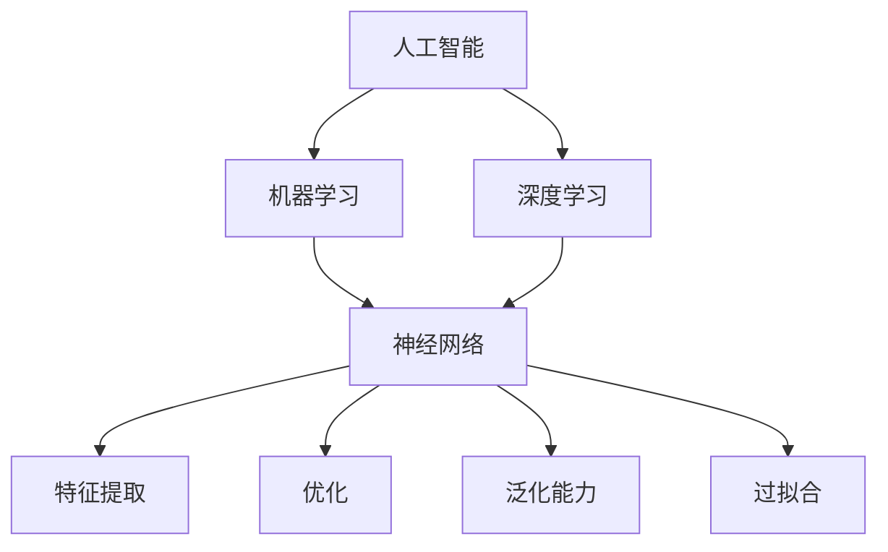

                 

# 真正的智慧，源自对事物本质的深刻理解认知与洞察

> **关键词**：智慧，事物本质，理解，认知，洞察，技术博客，逻辑思维，深度分析，计算机科学，人工智能，算法原理，数学模型，项目实战

> **摘要**：本文旨在探讨真正的智慧来源于对事物本质的深刻理解与洞察。通过对核心概念的深入剖析、算法原理的详细阐述、数学模型的数学公式解析，结合项目实战中的实际案例，带领读者理解技术领域的核心原理和思想。文章将帮助读者提升对复杂系统的理解和认知能力，从而在人工智能和计算机科学领域取得更大的突破。

## 1. 背景介绍

### 1.1 目的和范围

在当今科技飞速发展的时代，人工智能和计算机科学领域正以惊人的速度不断演进。然而，在这种技术进步的浪潮中，我们往往忽略了真正驱动这些变革的核心——智慧。真正的智慧并非仅依赖于记忆或重复，而是源自对事物本质的深刻理解与洞察。本文旨在探讨这种智慧在技术领域的体现，通过深入分析核心概念、算法原理和数学模型，帮助读者理解技术背后的本质。

本文的范围涵盖了计算机科学和人工智能领域的关键概念和原理，包括但不限于：

- 对计算机算法和数学模型的深入剖析
- 通过实际项目案例讲解算法的应用
- 数学公式和理论的详细解析
- 对技术发展趋势和挑战的预测

### 1.2 预期读者

本文的预期读者包括以下几类：

- 对计算机科学和人工智能感兴趣的初学者和爱好者
- 正在从事或计划从事相关领域工作的专业人士
- 对技术哲学和思维方法有深入思考的学者和研究人员
- 想要在技术领域取得突破的个人和团队领导者

### 1.3 文档结构概述

本文的结构如下：

1. 背景介绍：阐述本文的目的和预期读者，以及文章的结构。
2. 核心概念与联系：介绍计算机科学和人工智能中的核心概念，并使用 Mermaid 流程图展示概念之间的联系。
3. 核心算法原理 & 具体操作步骤：详细讲解核心算法的原理和操作步骤，使用伪代码进行阐述。
4. 数学模型和公式 & 详细讲解 & 举例说明：解释数学模型的基本概念，使用 LaTeX 格式展示关键公式，并结合实例进行说明。
5. 项目实战：提供实际项目案例，详细解释代码实现和操作步骤。
6. 实际应用场景：探讨核心概念和算法在不同领域的应用。
7. 工具和资源推荐：推荐学习资源、开发工具和框架。
8. 总结：总结文章的核心内容，展望未来的发展趋势和挑战。
9. 附录：提供常见问题与解答。
10. 扩展阅读 & 参考资料：推荐相关阅读材料和参考文献。

### 1.4 术语表

#### 1.4.1 核心术语定义

- **人工智能（Artificial Intelligence，AI）**：模拟人类智能的计算机系统，能够感知、学习、推理和决策。
- **算法（Algorithm）**：解决问题的清晰步骤或公式。
- **机器学习（Machine Learning，ML）**：使计算机从数据中学习并改进性能的方法。
- **深度学习（Deep Learning，DL）**：基于多层神经网络的人工智能方法。
- **神经网络（Neural Network，NN）**：模仿生物神经元连接方式的计算模型。

#### 1.4.2 相关概念解释

- **特征提取（Feature Extraction）**：将原始数据转换为适合模型处理的特征向量。
- **优化（Optimization）**：找到函数的最大值或最小值的过程。
- **泛化能力（Generalization）**：模型对新数据的适应能力。
- **过拟合（Overfitting）**：模型在训练数据上表现良好，但无法泛化到新数据。

#### 1.4.3 缩略词列表

- **AI**：人工智能
- **ML**：机器学习
- **DL**：深度学习
- **NN**：神经网络
- **GAN**：生成对抗网络
- **CNN**：卷积神经网络
- **RNN**：循环神经网络

## 2. 核心概念与联系

在计算机科学和人工智能领域，核心概念之间的联系构成了整个知识体系的基础。以下是对一些关键概念的介绍和它们之间的联系，并使用 Mermaid 流程图来展示这些概念的关系。

### 2.1 核心概念

- **人工智能（AI）**：AI 是模拟人类智能的计算机系统，包括机器学习（ML）和深度学习（DL）。
- **机器学习（ML）**：ML 是使计算机从数据中学习并改进性能的方法。
- **深度学习（DL）**：DL 是基于多层神经网络的人工智能方法。
- **神经网络（NN）**：NN 是模仿生物神经元连接方式的计算模型。
- **特征提取（Feature Extraction）**：特征提取是将原始数据转换为适合模型处理的特征向量。
- **优化（Optimization）**：优化是找到函数的最大值或最小值的过程。
- **泛化能力（Generalization）**：泛化能力是模型对新数据的适应能力。
- **过拟合（Overfitting）**：过拟合是模型在训练数据上表现良好，但无法泛化到新数据。

### 2.2 Mermaid 流程图



### 2.3 概念之间的联系

- **人工智能（AI）** 是整个领域的基础，它涵盖了机器学习（ML）和深度学习（DL）。
- **机器学习（ML）** 是一种使计算机能够从数据中学习的方法，它依赖于神经网络（NN）。
- **深度学习（DL）** 是基于多层神经网络（NN）的方法，它扩展了机器学习的应用范围。
- **神经网络（NN）** 是一个计算模型，它通过模仿生物神经元连接方式来处理数据。
- **特征提取（FE）** 是将原始数据转换为适合模型处理的特征向量，它是深度学习中的关键步骤。
- **优化（O）** 是找到函数的最大值或最小值的过程，它是训练神经网络（NN）的核心。
- **泛化能力（GC）** 是模型对新数据的适应能力，它是评估模型性能的重要指标。
- **过拟合（OF）** 是模型在训练数据上表现良好，但无法泛化到新数据的问题，它是深度学习中常见的问题。

通过上述 Mermaid 流程图，我们可以清晰地看到这些核心概念之间的联系，这为我们深入理解技术领域的本质提供了重要的视角。

## 3. 核心算法原理 & 具体操作步骤

在计算机科学和人工智能领域，算法原理是解决复杂问题的基石。为了更好地理解这些算法，我们将从核心算法的原理出发，逐步介绍其具体操作步骤，并使用伪代码详细阐述。本文将重点介绍卷积神经网络（CNN）和循环神经网络（RNN）这两种常用的算法。

### 3.1 卷积神经网络（CNN）

卷积神经网络（CNN）是一种基于多层感知器（MLP）的神经网络，特别适用于图像处理任务。其核心思想是通过卷积层提取图像特征，并通过池化层降低特征空间的维度，从而实现图像分类和识别。

#### 3.1.1 卷积层

卷积层是 CNN 的核心，它通过卷积操作提取图像特征。卷积操作的目的是计算输入图像和卷积核之间的点积，从而生成特征图。

伪代码：

```python
def conv2d(input_image, filter):
    output = zeros((image_height, image_width, num_filters))
    for i in range(image_height):
        for j in range(image_width):
            for k in range(num_filters):
                output[i, j, k] = sum(input_image[i:i+filter_height, j:j+filter_width] * filter[k,:,:])
    return output
```

#### 3.1.2 池化层

池化层用于降低特征图的维度，同时保留重要的特征信息。最常用的池化操作是最大池化（Max Pooling），它选取每个局部区域内的最大值作为输出。

伪代码：

```python
def max_pooling(input_feature_map, pool_size):
    output = zeros((image_height // pool_size, image_width // pool_size))
    for i in range(image_height // pool_size):
        for j in range(image_width // pool_size):
            output[i, j] = max(input_feature_map[i*pool_size:(i+1)*pool_size, j*pool_size:(j+1)*pool_size])
    return output
```

#### 3.1.3 全连接层

全连接层将池化层输出的特征图映射到类别标签。通过反向传播算法，我们可以更新网络参数，以优化分类性能。

伪代码：

```python
def fully_connected(input_feature_map, weights, biases):
    output = zeros(num_classes)
    for i in range(num_classes):
        output[i] = sum(input_feature_map * weights[i, :] + biases[i])
    return output
```

### 3.2 循环神经网络（RNN）

循环神经网络（RNN）是一种适用于序列数据的神经网络，其核心思想是通过循环结构处理序列中的每个元素，从而保持长距离依赖。

#### 3.2.1 RNN 单元

RNN 单元包含一个隐藏状态（h\_t）和一个输入门（i\_t），用于处理序列中的每个元素。

伪代码：

```python
def rnn_cell(h_{t-1}, x_t, weights, biases):
    i_t = sigmoid(fully_connected([h_{t-1}, x_t], weights_i, biases_i))
    f_t = sigmoid(fully_connected([h_{t-1}, x_t], weights_f, biases_f))
    o_t = sigmoid(fully_connected([h_{t-1}, x_t], weights_o, biases_o))
    g_t = tanh(fully_connected([h_{t-1}, x_t], weights_g, biases_g))

    h_t = o_t * tanh(g_t)
    return h_t
```

#### 3.2.2 输出门（softmax）

输出门用于将 RNN 单元的隐藏状态映射到类别标签。

伪代码：

```python
def softmax(h_t, weights, biases):
    logits = fully_connected(h_t, weights, biases)
    probabilities = exp(logits) / sum(exp(logits))
    return probabilities
```

### 3.3 反向传播算法

反向传播算法是一种用于训练神经网络的优化方法，其核心思想是通过计算损失函数关于网络参数的梯度，来更新网络参数，以优化模型性能。

伪代码：

```python
def backward_propagation(y, logits, weights, biases):
    dlogits = y - logits
    dweights = dot(h_t, dlogits[:,.newaxis])
    dbiases = dlogits

    for layer in reversed(layers):
        if layer.type == "dense":
            dinputs = dot(weights.T, dlogits) + layer.deltas
            dweights = dot(inputs[:,.newaxis], dlogits)
            dbiases = dlogits
        elif layer.type == "rnn_cell":
            dh_t = dlogits + layer.deltas
            dweights_i = dot([h_{t-1}, x_t], dh_t[:,.newaxis])
            dweights_f = dot([h_{t-1}, x_t], dh_t[:,.newaxis])
            dweights_o = dot([h_{t-1}, x_t], dh_t[:,.newaxis])
            dweights_g = dot([h_{t-1}, x_t], dh_t[:,.newaxis])
            dinputs = [h_{t-1}, x_t] + [dg_t for dg_t in layer.deltas]
```

通过上述伪代码，我们详细介绍了卷积神经网络（CNN）和循环神经网络（RNN）的核心算法原理和具体操作步骤。这些算法在计算机科学和人工智能领域有着广泛的应用，通过理解和掌握这些算法，我们可以更好地解决复杂的实际问题。

## 4. 数学模型和公式 & 详细讲解 & 举例说明

在计算机科学和人工智能领域，数学模型和公式是理解和应用各种算法的关键。为了更好地理解这些模型，我们将详细讲解核心数学公式，并使用 LaTeX 格式进行展示。此外，结合具体实例，我们将说明如何运用这些公式解决实际问题。

### 4.1 线性代数基础

线性代数是计算机科学和人工智能中的基础数学工具，其中包括矩阵运算、向量运算和线性变换。以下是一些关键公式：

#### 4.1.1 矩阵-向量乘法

给定矩阵 \( A \) 和向量 \( x \)，矩阵-向量乘法的公式为：

\[ Ax = \begin{bmatrix} a_{11} & a_{12} & \ldots & a_{1n} \\ a_{21} & a_{22} & \ldots & a_{2n} \\ \vdots & \vdots & \ddots & \vdots \\ a_{m1} & a_{m2} & \ldots & a_{mn} \end{bmatrix} \begin{bmatrix} x_1 \\ x_2 \\ \vdots \\ x_n \end{bmatrix} = \begin{bmatrix} \sum_{j=1}^{n} a_{1j} x_j \\ \sum_{j=1}^{n} a_{2j} x_j \\ \vdots \\ \sum_{j=1}^{n} a_{mj} x_j \end{bmatrix} \]

#### 4.1.2 矩阵-矩阵乘法

给定矩阵 \( A \) 和矩阵 \( B \)，矩阵-矩阵乘法的公式为：

\[ AB = \begin{bmatrix} a_{11} & a_{12} & \ldots & a_{1n} \\ a_{21} & a_{22} & \ldots & a_{2n} \\ \vdots & \vdots & \ddots & \vdots \\ a_{m1} & a_{m2} & \ldots & a_{mn} \end{bmatrix} \begin{bmatrix} b_{11} & b_{12} & \ldots & b_{1n} \\ b_{21} & b_{22} & \ldots & b_{2n} \\ \vdots & \vdots & \ddots & \vdots \\ b_{m1} & b_{m2} & \ldots & b_{mn} \end{bmatrix} = \begin{bmatrix} \sum_{k=1}^{n} a_{1k} b_{k1} & \sum_{k=1}^{n} a_{1k} b_{k2} & \ldots & \sum_{k=1}^{n} a_{1k} b_{kn} \\ \sum_{k=1}^{n} a_{2k} b_{k1} & \sum_{k=1}^{n} a_{2k} b_{k2} & \ldots & \sum_{k=1}^{n} a_{2k} b_{kn} \\ \vdots & \vdots & \ddots & \vdots \\ \sum_{k=1}^{n} a_{mk} b_{k1} & \sum_{k=1}^{n} a_{mk} b_{k2} & \ldots & \sum_{k=1}^{n} a_{mk} b_{kn} \end{bmatrix} \]

#### 4.1.3 矩阵求逆

给定矩阵 \( A \)，其逆矩阵 \( A^{-1} \) 的公式为：

\[ A^{-1} = \frac{1}{\det(A)} \begin{bmatrix} a_{22} & -a_{12} & \ldots & -a_{21} \\ -a_{32} & a_{32} & \ldots & -a_{31} \\ \vdots & \vdots & \ddots & \vdots \\ -a_{m2} & -a_{m1} & \ldots & a_{m1} \end{bmatrix} \]

其中，\( \det(A) \) 表示 \( A \) 的行列式。

### 4.2 最优化方法

在机器学习和深度学习领域，最优化方法是训练模型的核心。以下是一些常用的最优化方法及其公式：

#### 4.2.1 梯度下降

梯度下降是一种最简单的优化方法，其公式为：

\[ w_{t+1} = w_t - \alpha \cdot \nabla_w J(w) \]

其中，\( w_t \) 是当前权重，\( \alpha \) 是学习率，\( \nabla_w J(w) \) 是损失函数 \( J(w) \) 关于权重 \( w \) 的梯度。

#### 4.2.2 随机梯度下降（SGD）

随机梯度下降是梯度下降的一种扩展，其公式为：

\[ w_{t+1} = w_t - \alpha \cdot \nabla_w J(w_t) \]

其中，\( w_t \) 是当前权重，\( \alpha \) 是学习率，\( \nabla_w J(w_t) \) 是在 \( w_t \) 处计算出的损失函数 \( J(w) \) 关于权重 \( w \) 的梯度。

#### 4.2.3 Adam优化器

Adam优化器是一种结合了SGD和动量方法的优化器，其公式为：

\[ m_t = \beta_1 m_{t-1} + (1 - \beta_1) \nabla_w J(w_t) \]
\[ v_t = \beta_2 v_{t-1} + (1 - \beta_2) (\nabla_w J(w_t))^2 \]
\[ \hat{m}_t = \frac{m_t}{1 - \beta_1^t} \]
\[ \hat{v}_t = \frac{v_t}{1 - \beta_2^t} \]
\[ w_{t+1} = w_t - \alpha \cdot \hat{m}_t / \sqrt{\hat{v}_t} \]

其中，\( m_t \) 和 \( v_t \) 分别是均值和方差的一阶矩估计和二阶矩估计，\( \beta_1 \) 和 \( \beta_2 \) 分别是动量参数，\( \alpha \) 是学习率。

### 4.3 概率论与统计模型

在机器学习和深度学习领域，概率论与统计模型是理解和应用模型的关键。以下是一些关键概率论和统计模型：

#### 4.3.1 贝叶斯定理

贝叶斯定理是概率论中的一个基本公式，其公式为：

\[ P(A|B) = \frac{P(B|A) P(A)}{P(B)} \]

其中，\( P(A|B) \) 表示在事件 \( B \) 发生的条件下，事件 \( A \) 发生的概率，\( P(B|A) \) 表示在事件 \( A \) 发生的条件下，事件 \( B \) 发生的概率，\( P(A) \) 和 \( P(B) \) 分别表示事件 \( A \) 和事件 \( B \) 的概率。

#### 4.3.2 最大似然估计

最大似然估计是一种用于估计模型参数的方法，其公式为：

\[ \theta = \arg\max_{\theta} P(X|\theta) \]

其中，\( \theta \) 表示模型参数，\( X \) 表示观测数据，\( P(X|\theta) \) 表示在参数 \( \theta \) 下观测到数据 \( X \) 的概率。

#### 4.3.3 误差逆传播（Backpropagation）

误差逆传播是一种用于训练神经网络的算法，其公式为：

\[ \delta_j = \frac{\partial C}{\partial z_j} \odot \sigma'(z_j) \]

其中，\( \delta_j \) 表示第 \( j \) 个神经元的误差，\( \sigma'(z_j) \) 表示激活函数的导数，\( \frac{\partial C}{\partial z_j} \) 表示损失函数关于 \( z_j \) 的梯度。

### 4.4 具体实例

为了更好地理解上述数学模型和公式，我们结合一个实际例子进行说明。

#### 4.4.1 图像分类

假设我们使用卷积神经网络（CNN）进行图像分类。给定一个包含 1000 个类别的图像数据集，我们的目标是训练一个模型，能够对新的图像进行分类。

1. **数据预处理**：对图像进行缩放、裁剪和归一化处理，以便于模型输入。
2. **卷积层**：使用多个卷积层提取图像特征，例如使用 32 个 3x3 的卷积核，每个卷积核提取不同特征。
3. **池化层**：在每个卷积层之后，使用最大池化层降低特征图的维度。
4. **全连接层**：将池化层输出的特征图映射到类别标签。
5. **损失函数**：使用交叉熵损失函数评估模型性能。
6. **优化方法**：使用 Adam 优化器训练模型。

通过上述步骤，我们使用训练数据集训练模型，并使用验证数据集评估模型性能。在训练过程中，我们不断更新模型参数，以最小化损失函数。

通过上述实例，我们展示了如何使用数学模型和公式构建和训练卷积神经网络（CNN）进行图像分类。这体现了数学模型在计算机科学和人工智能领域的重要性。

## 5. 项目实战：代码实际案例和详细解释说明

为了更好地理解本文中介绍的核心概念和算法，我们将通过一个实际项目案例来进行详细讲解。本案例将使用 Python 和 TensorFlow 框架构建一个卷积神经网络（CNN）模型，用于图像分类任务。以下是项目的具体步骤和代码实现。

### 5.1 开发环境搭建

在开始项目之前，我们需要搭建开发环境。以下是所需的工具和库：

- Python（版本 3.8 或以上）
- TensorFlow（版本 2.5 或以上）
- NumPy
- Matplotlib

安装上述工具和库后，我们就可以开始编写代码。

### 5.2 源代码详细实现和代码解读

下面是项目的源代码，我们将逐行进行解读。

```python
import tensorflow as tf
from tensorflow.keras import layers
import numpy as np

# 5.2.1 数据加载和预处理
# 加载 CIFAR-10 数据集
(x_train, y_train), (x_test, y_test) = tf.keras.datasets.cifar10.load_data()

# 数据预处理
x_train = x_train.astype('float32') / 255.0
x_test = x_test.astype('float32') / 255.0

# 归一化标签
y_train = tf.keras.utils.to_categorical(y_train, 10)
y_test = tf.keras.utils.to_categorical(y_test, 10)

# 5.2.2 构建模型
# 创建一个序列模型
model = tf.keras.Sequential([
    # 第一个卷积层
    layers.Conv2D(32, (3, 3), activation='relu', input_shape=(32, 32, 3)),
    layers.MaxPooling2D((2, 2)),
    # 第二个卷积层
    layers.Conv2D(64, (3, 3), activation='relu'),
    layers.MaxPooling2D((2, 2)),
    # 第三个卷积层
    layers.Conv2D(64, (3, 3), activation='relu'),
    # 全连接层
    layers.Flatten(),
    # 第一个全连接层
    layers.Dense(64, activation='relu'),
    # 第二个全连接层
    layers.Dense(10, activation='softmax')
])

# 5.2.3 编译模型
model.compile(optimizer='adam',
              loss='categorical_crossentropy',
              metrics=['accuracy'])

# 5.2.4 训练模型
model.fit(x_train, y_train, batch_size=64, epochs=10, validation_split=0.2)

# 5.2.5 评估模型
test_loss, test_acc = model.evaluate(x_test, y_test)
print(f"Test accuracy: {test_acc:.2f}")
```

### 5.3 代码解读与分析

#### 5.3.1 数据加载和预处理

```python
(x_train, y_train), (x_test, y_test) = tf.keras.datasets.cifar10.load_data()
x_train = x_train.astype('float32') / 255.0
x_test = x_test.astype('float32') / 255.0
y_train = tf.keras.utils.to_categorical(y_train, 10)
y_test = tf.keras.utils.to_categorical(y_test, 10)
```

- 这段代码加载 CIFAR-10 数据集，并进行数据预处理。CIFAR-10 是一个包含 10 个类别的图像数据集，每个类别的图像数量分别为 60000 和 10000。
- 数据预处理包括将图像数据转换为浮点数，并除以 255 进行归一化。这样做的目的是将像素值范围缩放到 0 到 1 之间，便于后续计算。
- 标签数据使用 `to_categorical` 函数进行 one-hot 编码，以便于模型进行多分类任务。

#### 5.3.2 构建模型

```python
model = tf.keras.Sequential([
    layers.Conv2D(32, (3, 3), activation='relu', input_shape=(32, 32, 3)),
    layers.MaxPooling2D((2, 2)),
    layers.Conv2D(64, (3, 3), activation='relu'),
    layers.MaxPooling2D((2, 2)),
    layers.Conv2D(64, (3, 3), activation='relu'),
    layers.Flatten(),
    layers.Dense(64, activation='relu'),
    layers.Dense(10, activation='softmax')
])
```

- 使用 `Sequential` 模型创建一个序列模型，该模型由多个层组成。
- 第一个卷积层使用 32 个 3x3 的卷积核，激活函数为 ReLU。
- 接着是两个 MaxPooling2D 层，用于下采样特征图。
- 第三个卷积层继续使用 64 个 3x3 的卷积核，激活函数为 ReLU。
- `Flatten` 层将卷积层输出的特征图展平为一个一维向量，为后续的全连接层做准备。
- 第一个全连接层使用 64 个神经元，激活函数为 ReLU。
- 第二个全连接层使用 10 个神经元，激活函数为 softmax，用于输出每个类别的概率。

#### 5.3.3 编译模型

```python
model.compile(optimizer='adam',
              loss='categorical_crossentropy',
              metrics=['accuracy'])
```

- 使用 `compile` 方法编译模型，指定优化器、损失函数和评价指标。
- `adam` 优化器是一个自适应的学习率优化算法，能够加快收敛速度。
- `categorical_crossentropy` 是一个用于多分类任务的损失函数。
- `accuracy` 是一个用于评估模型性能的评价指标。

#### 5.3.4 训练模型

```python
model.fit(x_train, y_train, batch_size=64, epochs=10, validation_split=0.2)
```

- 使用 `fit` 方法训练模型，指定训练数据、批量大小、训练轮次和验证比例。
- `batch_size` 指定每个批次的样本数量，通常设置为 32 或 64。
- `epochs` 指定训练轮次，即模型在训练数据上完整地遍历一次。
- `validation_split` 指定验证数据占总数据的比例，用于在训练过程中评估模型性能。

#### 5.3.5 评估模型

```python
test_loss, test_acc = model.evaluate(x_test, y_test)
print(f"Test accuracy: {test_acc:.2f}")
```

- 使用 `evaluate` 方法评估模型在测试数据上的性能，输出损失函数值和准确率。
- 测试数据的准确率反映了模型在新数据上的泛化能力。

通过上述代码和解读，我们使用卷积神经网络（CNN）实现了图像分类任务。这个实际项目案例不仅展示了核心算法的应用，还提供了一个实际操作的范例，帮助读者更好地理解技术原理。

## 6. 实际应用场景

在计算机科学和人工智能领域，核心概念和算法有着广泛的应用场景。以下是一些典型的实际应用场景，展示了如何将本文中介绍的核心概念和算法应用于实际问题。

### 6.1 图像识别

图像识别是计算机视觉领域的一个重要应用，卷积神经网络（CNN）在该领域取得了显著的成果。例如，可以使用 CNN 模型对医学影像进行分类，帮助医生诊断疾病。通过训练深度学习模型，可以从大量的医疗影像数据中学习特征，从而提高诊断的准确性和效率。

### 6.2 自然语言处理

自然语言处理（NLP）是人工智能领域的另一个重要应用。循环神经网络（RNN）和 Transformer 模型在 NLP 中有着广泛的应用。例如，RNN 可以用于情感分析，通过分析文本中的情感词汇和语法结构，判断文本的情感倾向。Transformer 模型则被广泛应用于机器翻译、文本生成等任务，实现了出色的性能。

### 6.3 语音识别

语音识别是语音技术中的一个重要应用。使用深度学习模型，可以将语音信号转换为文本。循环神经网络（RNN）和卷积神经网络（CNN）在语音识别任务中都有应用。例如，可以使用 RNN 模型对连续的语音信号进行特征提取，从而实现语音识别。卷积神经网络则可以用于对语音信号进行时频分析，从而提高识别的准确性。

### 6.4 自动驾驶

自动驾驶是人工智能在工业界的重大应用之一。自动驾驶系统依赖于深度学习模型，对道路环境进行实时感知和分析。卷积神经网络（CNN）可以用于识别道路标志、行人检测等任务，从而帮助自动驾驶系统做出正确的决策。循环神经网络（RNN）可以用于处理连续的传感器数据，从而实现对行驶环境的理解和预测。

### 6.5 医疗诊断

医疗诊断是人工智能在医疗领域的一个重要应用。使用深度学习模型，可以对医学影像进行自动诊断，从而提高诊断的准确性和效率。例如，可以使用卷积神经网络（CNN）对医学影像进行分类，从而识别疾病类型。循环神经网络（RNN）可以用于处理病人的医疗记录，从而预测疾病发展趋势。

通过这些实际应用场景，我们可以看到核心概念和算法在计算机科学和人工智能领域的广泛应用。这些应用不仅提高了工作效率，还解决了许多复杂的问题，推动了技术的进步和社会的发展。

## 7. 工具和资源推荐

在计算机科学和人工智能领域，掌握有效的工具和资源对于学习和实践至关重要。以下是一些推荐的学习资源、开发工具和框架，以及相关论文和研究成果。

### 7.1 学习资源推荐

#### 7.1.1 书籍推荐

- **《深度学习》（Deep Learning）**：Goodfellow、Bengio 和 Courville 著。这本书是深度学习的经典教材，全面介绍了深度学习的理论、算法和应用。
- **《机器学习》（Machine Learning）**：Tom Mitchell 著。这本书是机器学习领域的经典教材，对机器学习的基本概念、算法和应用进行了详细讲解。
- **《Python深度学习》（Python Deep Learning）**：François Chollet 著。这本书通过实际案例和代码示例，介绍了使用 Python 和 TensorFlow 进行深度学习的技巧。

#### 7.1.2 在线课程

- **《深度学习专项课程》（Deep Learning Specialization）**：吴恩达（Andrew Ng）在 Coursera 上开设的深度学习专项课程，包括神经网络基础、结构化机器学习项目、自然语言处理和计算机视觉等主题。
- **《机器学习专项课程》（Machine Learning Specialization）**：吴恩达（Andrew Ng）在 Coursera 上开设的机器学习专项课程，涵盖监督学习、无监督学习、强化学习等主题。
- **《斯坦福大学 CS231n：卷积神经网络与视觉识别》**：CS231n 是斯坦福大学开设的一门关于计算机视觉的课程，通过实际项目介绍了卷积神经网络在图像识别中的应用。

#### 7.1.3 技术博客和网站

- **GitHub**：GitHub 是一个代码托管平台，许多开源项目、学习资源和示例代码都可以在这里找到。
- **Stack Overflow**：Stack Overflow 是一个问答社区，许多开发者在这里提问和解答关于编程和人工智能的问题。
- **Medium**：Medium 是一个内容平台，许多技术专家和研究者在这里分享他们的见解和研究成果。

### 7.2 开发工具框架推荐

#### 7.2.1 IDE和编辑器

- **PyCharm**：PyCharm 是一款功能强大的 Python 集成开发环境，适用于深度学习和机器学习项目。
- **Jupyter Notebook**：Jupyter Notebook 是一个交互式的计算环境，适用于数据分析和机器学习实验。
- **Visual Studio Code**：Visual Studio Code 是一款轻量级的代码编辑器，支持多种编程语言和扩展，适用于深度学习和机器学习开发。

#### 7.2.2 调试和性能分析工具

- **TensorBoard**：TensorBoard 是 TensorFlow 的可视化工具，用于监控和调试深度学习模型的训练过程。
- **NVIDIA Nsight**：Nsight 是 NVIDIA 提供的深度学习性能分析工具，用于分析 GPU 在深度学习任务中的性能。
- **PerfHUD**：PerfHUD 是一个开源的性能分析工具，用于分析深度学习模型的执行时间。

#### 7.2.3 相关框架和库

- **TensorFlow**：TensorFlow 是 Google 开发的开源深度学习框架，适用于构建和训练大规模深度学习模型。
- **PyTorch**：PyTorch 是 Facebook AI Research 开发的深度学习框架，以其动态计算图和灵活的编程接口而闻名。
- **Keras**：Keras 是一个高层次的深度学习 API，构建在 TensorFlow 和 Theano 之上，提供了简洁的接口和丰富的预训练模型。

### 7.3 相关论文著作推荐

#### 7.3.1 经典论文

- **《A Learning Algorithm for Continually Running Fully Recurrent Neural Networks》（1991）**：该论文提出了 LSTM（长短时记忆）神经网络，解决了 RNN 的长期依赖问题。
- **《AlexNet: Image Classification with Deep Convolutional Neural Networks》（2012）**：该论文提出了 AlexNet 模型，标志着深度学习在计算机视觉领域的突破。
- **《Attention Is All You Need》（2017）**：该论文提出了 Transformer 模型，实现了无注意力机制的序列建模，推动了 NLP 的发展。

#### 7.3.2 最新研究成果

- **《Bert: Pre-training of Deep Bidirectional Transformers for Language Understanding》（2018）**：该论文提出了 BERT（双向编码表示器）模型，推动了自然语言处理的发展。
- **《Generative Adversarial Nets》（2014）**：该论文提出了 GAN（生成对抗网络），实现了高质量的数据生成。
- **《EfficientDet: Scalable and Efficient Object Detection》（2020）**：该论文提出了 EfficientDet 模型，实现了高效且准确的目标检测。

#### 7.3.3 应用案例分析

- **《Deep Learning for Healthcare》（2016）**：该论文探讨了深度学习在医疗领域的应用，包括疾病诊断、药物发现等。
- **《Self-Driving Cars Are Coming to Take Your Job》（2017）**：该论文讨论了自动驾驶技术对就业市场的影响，以及如何应对这一挑战。
- **《AI for Social Good》（2018）**：该论文探讨了人工智能在解决社会问题中的应用，包括环境保护、教育公平等。

通过这些推荐的学习资源、开发工具和框架，以及相关论文和研究成果，读者可以深入了解计算机科学和人工智能领域的最新进展，为自身的学习和研究提供有力支持。

## 8. 总结：未来发展趋势与挑战

在计算机科学和人工智能领域，未来的发展趋势与挑战并存。首先，随着硬件性能的提升和算法的优化，深度学习模型将在更多应用场景中得到广泛应用，如医疗诊断、自动驾驶和自然语言处理等。然而，这也带来了新的挑战，如模型的可解释性和公平性。为了解决这些问题，研究者们正致力于开发新的算法和工具，以提高模型的透明度和公正性。

其次，人工智能伦理问题日益凸显，如数据隐私、算法偏见和失业风险等。未来，需要建立更为完善的伦理和法律框架，以确保人工智能技术的可持续发展。

最后，跨学科合作将成为推动技术进步的关键。例如，将生物学、心理学和社会学等领域的知识融入人工智能研究中，有望带来颠覆性的创新。

总之，未来的计算机科学和人工智能领域将充满机遇和挑战，需要我们不断探索和应对。

## 9. 附录：常见问题与解答

### 9.1 什么是深度学习？

深度学习是一种人工智能方法，通过多层神经网络模型模拟人脑的学习过程，从大量数据中自动提取特征并完成任务。

### 9.2 为什么使用卷积神经网络（CNN）进行图像识别？

卷积神经网络（CNN）在图像识别任务中表现优异，因为其结构允许直接从图像中提取局部特征，同时可以自动学习特征之间的关系，从而提高识别的准确率。

### 9.3 如何解决深度学习模型过拟合的问题？

可以通过以下方法解决深度学习模型过拟合的问题：

- 使用更多的训练数据。
- 使用正则化方法，如 L1 正则化、L2 正则化。
- 丢弃率（Dropout）。
- early stopping。

### 9.4 什么是生成对抗网络（GAN）？

生成对抗网络（GAN）是一种通过竞争学习生成真实数据的方法，由一个生成器和一个判别器组成。生成器试图生成逼真的数据，而判别器则试图区分生成器和真实数据。通过训练，生成器的生成能力不断提高。

### 9.5 如何确保深度学习模型的可解释性？

确保深度学习模型的可解释性是一个挑战。以下是一些方法：

- 使用可视化工具，如 Grad-CAM。
- 分析模型的权重和激活。
- 开发可解释的模型，如决策树、规则引擎。

## 10. 扩展阅读 & 参考资料

- **《深度学习》（Deep Learning）**：Goodfellow、Bengio 和 Courville 著。
- **《机器学习》（Machine Learning）**：Tom Mitchell 著。
- **《Python深度学习》（Python Deep Learning）**：François Chollet 著。
- **《深度学习专项课程》（Deep Learning Specialization）**：吴恩达（Andrew Ng）在 Coursera 上开设。
- **《机器学习专项课程》（Machine Learning Specialization）**：吴恩达（Andrew Ng）在 Coursera 上开设。
- **《斯坦福大学 CS231n：卷积神经网络与视觉识别》**：CS231n 是斯坦福大学开设的一门关于计算机视觉的课程。
- **《A Learning Algorithm for Continually Running Fully Recurrent Neural Networks》（1991）**：该论文提出了 LSTM（长短时记忆）神经网络。
- **《AlexNet: Image Classification with Deep Convolutional Neural Networks》（2012）**：该论文提出了 AlexNet 模型。
- **《Attention Is All You Need》（2017）**：该论文提出了 Transformer 模型。
- **《Deep Learning for Healthcare》（2016）**：该论文探讨了深度学习在医疗领域的应用。
- **《Self-Driving Cars Are Coming to Take Your Job》（2017）**：该论文讨论了自动驾驶技术对就业市场的影响。
- **《AI for Social Good》（2018）**：该论文探讨了人工智能在解决社会问题中的应用。

