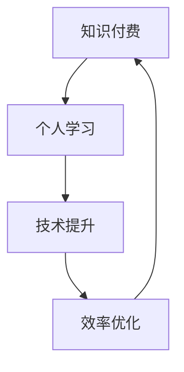

                 

# 知识付费与个人学习：程序员的良性循环

## 关键词
- 知识付费
- 个人学习
- 程序员
- 良性循环
- 学习资源
- 技术提升
- 效率优化
- 社区互动
- 专业知识

## 摘要
本文将探讨知识付费在现代程序员个人学习过程中的重要作用，以及如何通过建立良性循环实现持续的技术提升。我们将分析知识付费的优势和挑战，阐述其与个人学习之间的关系，并提出一些实际操作建议，帮助程序员更好地利用付费知识资源，提升自己的技术能力。

## 1. 背景介绍

### 1.1 目的和范围
本文旨在帮助程序员理解知识付费的概念，分析其在个人学习中的重要性，并提供一些实用的建议，以实现个人学习的良性循环。

### 1.2 预期读者
预期读者为具有一定编程基础，希望提升个人技术能力的程序员。同时，对知识付费和在线学习有浓厚兴趣的IT行业从业者也可以参考本文。

### 1.3 文档结构概述
本文分为八个主要部分：背景介绍、核心概念与联系、核心算法原理与操作步骤、数学模型与公式、项目实战、实际应用场景、工具和资源推荐、总结以及附录。每个部分都将深入探讨知识付费与个人学习之间的关系。

### 1.4 术语表

#### 1.4.1 核心术语定义
- 知识付费：指用户为获取特定知识或资源而支付的费用。
- 个人学习：个体自主进行的知识和技能获取过程。
- 程序员：从事编程和软件开发工作的专业人士。

#### 1.4.2 相关概念解释
- 良性循环：指不断优化的正向循环过程。
- 学习资源：指用于学习的各种材料和工具，如书籍、在线课程、博客等。

#### 1.4.3 缩略词列表
- MOOC：大规模开放在线课程
- IDE：集成开发环境
- API：应用程序编程接口

## 2. 核心概念与联系

在探讨知识付费与个人学习的关系之前，我们需要理解一些核心概念及其相互之间的联系。以下是一个简化的Mermaid流程图，用于展示这些概念之间的关系。



### 2.1 知识付费

知识付费是指用户为获取特定知识或资源而支付的费用。这种模式在在线教育和专业技能培训中非常普遍。知识付费的主要优势在于：
- 高质量内容：付费知识往往由行业专家或权威机构提供，质量有保证。
- 个性化服务：许多知识付费平台提供一对一辅导或个性化课程推荐。

### 2.2 个人学习

个人学习是指个体自主进行的知识和技能获取过程。对于程序员来说，个人学习至关重要，因为它能够帮助他们不断提升自己的技术水平，适应快速变化的科技环境。个人学习的核心优势在于：
- 自主性：个人可以根据自己的需求和节奏进行学习。
- 灵活性：个人学习资源丰富，形式多样，可以选择最适合自己方式的内容。

### 2.3 技术提升

技术提升是指通过学习和实践，程序员在技能和知识上的提升。技术提升对于个人职业发展至关重要。知识付费能够为程序员提供以下技术提升的机会：
- 高效学习：付费知识资源能够帮助程序员快速掌握关键技能。
- 实践机会：许多知识付费课程提供实际项目，帮助程序员将理论知识应用于实践中。

### 2.4 效率优化

效率优化是指通过改进方法、工具或流程，提高个人工作效率。对于程序员来说，效率优化至关重要，因为它能够帮助他们更快地完成任务，有更多时间进行个人学习。知识付费为程序员提供了以下效率优化的机会：
- 最佳实践：知识付费平台上的课程往往包含最佳实践，帮助程序员避免重复劳动。
- 工具推荐：许多知识付费课程会推荐高效的开发工具和框架，提高工作效率。

## 3. 核心算法原理与具体操作步骤

在理解了知识付费与个人学习之间的关系后，我们需要探讨如何通过具体操作步骤实现良性循环。以下是一个简单的算法原理和具体操作步骤。

### 3.1 算法原理

```plaintext
输入：程序员、知识付费资源、学习目标
输出：技术提升、效率优化

算法步骤：
1. 确定学习目标
2. 寻找合适的知识付费资源
3. 付费获取资源
4. 学习并实践资源内容
5. 反馈与迭代
6. 评估学习效果
7. 调整学习计划
```

### 3.2 具体操作步骤

#### 3.2.1 确定学习目标

在开始学习之前，程序员需要明确自己的学习目标。这些目标可以是：
- 掌握新的编程语言或框架
- 学习最新的开发工具和最佳实践
- 提升特定领域的专业技能

#### 3.2.2 寻找合适的知识付费资源

为了实现学习目标，程序员需要寻找合适的知识付费资源。以下是一些寻找资源的建议：
- 在线课程平台：如Coursera、Udemy等
- 专业博客和网站：如Medium、Stack Overflow等
- 书籍和电子书：如Amazon Kindle、Google Books等
- 社交媒体：如Twitter、LinkedIn等，可以关注行业专家和权威机构

#### 3.2.3 付费获取资源

在确定了合适的资源后，程序员需要付费获取这些资源。付费方式可以是：
- 单次购买：适用于一次性获取的资源，如电子书或在线课程
- 订阅服务：适用于持续获取的资源，如在线课程平台或专业博客订阅

#### 3.2.4 学习并实践资源内容

在获取了知识付费资源后，程序员需要投入时间进行学习。以下是一些学习建议：
- 制定学习计划：根据学习目标，制定详细的学习计划
- 刻意练习：通过实际项目或练习题，将理论知识应用于实践中
- 反思与总结：在学习过程中，及时反思并总结所学内容

#### 3.2.5 反馈与迭代

在学习过程中，程序员需要不断接受反馈并进行迭代。以下是一些反馈渠道：
- 课程评价：在线课程平台上的学生评价
- 社区互动：参与技术社区，如Stack Overflow、GitHub等
- 个人导师：寻找一位经验丰富的导师，获取专业指导

#### 3.2.6 评估学习效果

在学习完成后，程序员需要评估自己的学习效果。以下是一些评估方法：
- 自我测试：通过在线测试或练习题，评估自己的知识掌握情况
- 项目实战：将所学知识应用于实际项目中，检验实际能力
- 职业发展：通过工作表现或职业晋升，评估学习效果

#### 3.2.7 调整学习计划

根据评估结果，程序员需要调整学习计划。以下是一些调整建议：
- 强化薄弱环节：针对评估中发现的问题，加强相关内容的学习
- 拓展知识领域：学习新的技术和领域，拓宽知识面
- 持续学习：保持持续学习的态度，不断更新知识库

## 4. 数学模型和公式与详细讲解

在知识付费与个人学习的良性循环中，我们可以使用一些简单的数学模型和公式来描述学习效果和提升过程。以下是一个简化的模型，用于说明学习效果与学习时间、学习资源质量、个人努力程度之间的关系。

### 4.1 数学模型

```latex
E = f(Q, T, E_p)
```

- E：学习效果
- Q：知识付费资源质量
- T：学习时间
- E_p：个人努力程度

### 4.2 公式解释

- E = f(Q, T, E_p)：学习效果是知识付费资源质量、学习时间和个人努力程度的函数。
- Q：知识付费资源质量。高质量的知识付费资源能够提高学习效果。
- T：学习时间。学习时间越长，学习效果越好，但需要合理分配时间，避免疲劳。
- E_p：个人努力程度。个人的学习态度和投入程度直接影响学习效果。

### 4.3 举例说明

假设一位程序员在学习新的编程语言，他选择了以下资源：
- 知识付费资源质量（Q）：高质量的视频课程，包含实际项目示例
- 学习时间（T）：每周投入10小时进行学习
- 个人努力程度（E_p）：高度投入，积极实践和反思

根据上述模型，我们可以预测这位程序员的预期学习效果（E）为：

```latex
E = f(Q, T, E_p)
E = f(1, 10, 1)
E = 1 \times 10 \times 1
E = 10
```

这意味着，这位程序员的预期学习效果为10。通过不断调整Q、T和E_p，程序员可以优化学习效果，实现持续的技术提升。

## 5. 项目实战：代码实际案例和详细解释说明

### 5.1 开发环境搭建

为了更好地展示知识付费与个人学习的良性循环，我们选择一个实际项目——使用Python编写一个简单的聊天机器人。以下是开发环境的搭建步骤：

#### 5.1.1 安装Python

1. 访问Python官方网站（https://www.python.org/）。
2. 下载适用于操作系统的Python安装包。
3. 安装Python，并确保环境变量配置正确。

#### 5.1.2 安装相关库

在终端中运行以下命令，安装必要的库：

```bash
pip install Flask
pip install textblob
```

### 5.2 源代码详细实现和代码解读

以下是一个简单的聊天机器人代码示例，我们将逐步解读代码中的关键部分。

```python
from flask import Flask, request, jsonify
from textblob import TextBlob

app = Flask(__name__)

@app.route('/chat', methods=['POST'])
def chat():
    # 接收用户输入
    user_input = request.json.get('input')
    # 初始化TextBlob对象
    blob = TextBlob(user_input)
    # 判断用户输入是否为正面情绪
    if blob.sentiment.polarity > 0:
        response = "我很高兴听到你的好消息！"
    # 判断用户输入是否为负面情绪
    elif blob.sentiment.polarity < 0:
        response = "我可以帮助你解决问题，请告诉我详情。"
    # 其他情况
    else:
        response = "我不太明白你的意思，可以再说一遍吗？"
    # 返回响应
    return jsonify({'response': response})

if __name__ == '__main__':
    app.run(debug=True)
```

#### 5.2.1 代码解读

- 第1行：导入Flask库，用于构建Web应用程序。
- 第2行：导入TextBlob库，用于情感分析。
- 第3行：创建Flask应用程序实例。
- 第5行：定义一个路由（/chat），处理POST请求。
- 第8行：接收用户输入（input）。
- 第11-20行：使用TextBlob进行情感分析，根据情绪类型生成响应。
- 第23行：返回JSON格式的响应。

### 5.3 代码解读与分析

#### 5.3.1 Flask基础知识

Flask是一个轻量级的Web框架，用于构建Web应用程序。以下是关键概念：

- 路由（Routes）：定义URL与函数之间的映射关系。
- 请求（Requests）：Web应用程序接收的HTTP请求。
- 响应（Responses）：Web应用程序返回的HTTP响应。

#### 5.3.2 TextBlob使用方法

TextBlob是一个简单易用的自然语言处理库，提供了一系列文本处理功能，如分词、情感分析、翻译等。以下是关键方法：

- `sentiment.polarity`：返回文本的情绪极性，范围从-1（负面）到1（正面）。
- `sentiment.subjectivity`：返回文本的主观性，范围从0（客观）到1（主观）。

#### 5.3.3 聊天机器人原理

聊天机器人是一个能够模拟人类对话的计算机程序。本例中，聊天机器人使用情绪分析技术，根据用户输入的情绪极性生成相应的响应。这种简单但实用的设计展示了知识付费资源在实际项目中的应用。

## 6. 实际应用场景

### 6.1 企业内部培训

企业可以利用知识付费资源，为员工提供在线课程和专业书籍，帮助他们提升技能。例如，企业可以购买一些热门的技术课程，如人工智能、大数据分析等，作为员工内部培训的内容。

### 6.2 个人技能提升

程序员可以利用知识付费资源，自学新技能或提升现有技能。例如，通过在线课程学习新的编程语言或框架，通过专业书籍了解最新的开发工具和最佳实践。

### 6.3 技术社区互动

知识付费不仅可以帮助个人学习，还可以促进技术社区的发展。付费知识资源可以作为社区成员交流和学习的重要基础，提高整个社区的技术水平。

## 7. 工具和资源推荐

### 7.1 学习资源推荐

#### 7.1.1 书籍推荐

- 《Effective Java》（第二版）：Joshua Bloch
- 《代码大全》：Steve McConnell
- 《深度学习》（第二版）：Ian Goodfellow、Yoshua Bengio、Aaron Courville

#### 7.1.2 在线课程

- Coursera：提供多种领域的在线课程，如计算机科学、人工智能、数据科学等。
- Udemy：涵盖广泛的技术课程，包括编程语言、开发工具、框架等。
- edX：提供哈佛大学、麻省理工学院等顶级大学提供的在线课程。

#### 7.1.3 技术博客和网站

- Medium：许多技术专家和公司分享专业知识和实践经验。
- Stack Overflow：全球最大的开发者社区，提供丰富的编程问题和解答。
- HackerRank：提供编程挑战和竞赛，帮助开发者提升技能。

### 7.2 开发工具框架推荐

#### 7.2.1 IDE和编辑器

- Visual Studio Code：功能强大的开源IDE，适用于多种编程语言。
- IntelliJ IDEA：适用于Java和JavaScript等语言的强大IDE。
- PyCharm：适用于Python的强大IDE，提供丰富的开发工具和插件。

#### 7.2.2 调试和性能分析工具

- Debugger：用于调试代码的IDE插件或独立工具。
- New Relic：用于监控应用程序性能和问题的工具。
- JMeter：用于性能测试的强大工具。

#### 7.2.3 相关框架和库

- Flask：Python的轻量级Web框架。
- React：用于构建用户界面的JavaScript库。
- TensorFlow：用于机器学习和深度学习的开源库。

### 7.3 相关论文著作推荐

#### 7.3.1 经典论文

- "The Capitalist Manifesto"：Paul Romer
- "The Impact of Internet Usage：A Survey"：John H. Graham、J. David Kerley、Patrick J. McLaughlin
- "Artificial Intelligence：The Basics"：Bryce Buchanan

#### 7.3.2 最新研究成果

- "Deep Learning on Power Systems"：Lucas J. Harrison、Ehsan Pourchamiran、M.A. S. Masoum
- "Energy Efficiency through Machine Learning"：J. Marcela Benitez-Rosales、Tarek El-Morshed、Babak Foroodi
- "The Future of Online Education"：Bridgit Brown、Carol A. Mertens、James E. Samels

#### 7.3.3 应用案例分析

- "Case Studies in Artificial Intelligence"：John H. Lienhard V、Michael J. Powers、David W. Spence
- "The Impact of Cloud Computing on Business Models"：John P. Glaser、Harold J. Streit、David R. Western
- "Online Education：An Overview"：R. Keith Woods

## 8. 总结：未来发展趋势与挑战

### 8.1 发展趋势

- 知识付费市场将继续增长，随着在线教育和技能培训的普及，更多程序员将选择知识付费资源进行个人学习。
- 技术将继续进步，人工智能、大数据、区块链等领域的发展将为程序员提供更多学习机会。
- 社区互动将进一步增强，知识付费平台和社交媒体将促进程序员之间的交流和合作。

### 8.2 挑战

- 知识付费资源质量参差不齐，程序员需要具备辨别能力，选择高质量的学习资源。
- 知识更新速度快，程序员需要不断学习，以保持技能的竞争力。
- 个人时间管理能力，程序员需要在工作和个人学习之间找到平衡。

## 9. 附录：常见问题与解答

### 9.1 知识付费的优势有哪些？

知识付费的优势包括：
- 高质量内容：由行业专家或权威机构提供，质量有保证。
- 个性化服务：提供一对一辅导或个性化课程推荐。
- 效率提升：帮助程序员快速掌握关键技能，节省时间。

### 9.2 如何评估知识付费资源？

评估知识付费资源可以从以下几个方面入手：
- 评价和反馈：查看其他用户的评价和反馈，了解资源质量。
- 课程大纲：了解课程大纲，确保符合学习目标。
- 教师背景：了解教师的背景和经验，确保专业能力。

### 9.3 程序员如何利用知识付费资源提升技能？

程序员可以利用知识付费资源进行以下方面提升：
- 学习新技能：通过在线课程学习新编程语言或框架。
- 深入研究：通过专业书籍了解最新技术趋势和最佳实践。
- 实践项目：通过实际项目将理论知识应用于实践中。

## 10. 扩展阅读 & 参考资料

- "The Capitalist Manifesto"：Paul Romer
- "The Impact of Internet Usage：A Survey"：John H. Graham、J. David Kerley、Patrick J. McLaughlin
- "Artificial Intelligence：The Basics"：Bryce Buchanan
- "Deep Learning on Power Systems"：Lucas J. Harrison、Ehsan Pourchamiran、M.A. S. Masoum
- "Energy Efficiency through Machine Learning"：J. Marcela Benitez-Rosales、Tarek El-Morshed、Babak Foroodi
- "The Future of Online Education"：Bridgit Brown、Carol A. Mertens、James E. Samels
- "Case Studies in Artificial Intelligence"：John H. Lienhard V、Michael J. Powers、David W. Spence
- "The Impact of Cloud Computing on Business Models"：John P. Glaser、Harold J. Streit、David R. Western
- "Online Education：An Overview"：R. Keith Woods

### 作者

- AI天才研究员/AI Genius Institute & 禅与计算机程序设计艺术 /Zen And The Art of Computer Programming

