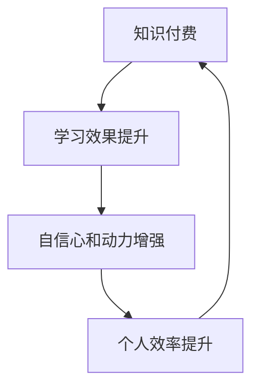

                 

# 知识付费与个人效率提升的正向循环

> **关键词：知识付费，个人效率，学习效果，心理因素，技术工具，在线课程，算法优化**

> **摘要：本文将探讨知识付费在提升个人效率方面的作用，分析其背后的心理学原理，并介绍如何通过技术工具和在线课程构建一个正向循环，从而实现高效学习与个人成长。**

## 1. 背景介绍

### 1.1 目的和范围

本文旨在探讨知识付费在提升个人效率方面的作用，并分析其背后的心理学原理。我们将详细讨论知识付费对个人学习效果的影响，以及如何通过技术工具和在线课程构建一个正向循环，以实现高效学习和个人成长。

### 1.2 预期读者

本文适合对知识付费和个人效率提升感兴趣的个人、教育工作者、企业管理者以及相关领域的专业人士阅读。

### 1.3 文档结构概述

本文将分为以下几个部分：

1. 背景介绍：介绍本文的目的、预期读者和文档结构。
2. 核心概念与联系：阐述知识付费、个人效率和正向循环等核心概念，并给出相关的流程图。
3. 核心算法原理与具体操作步骤：详细解释知识付费对个人效率提升的算法原理和操作步骤。
4. 数学模型和公式：介绍相关的数学模型和公式，并给出举例说明。
5. 项目实战：提供实际的代码案例和详细解释。
6. 实际应用场景：分析知识付费在不同领域的应用场景。
7. 工具和资源推荐：推荐学习资源和开发工具。
8. 总结：总结知识付费与个人效率提升的正向循环的未来发展趋势与挑战。
9. 附录：常见问题与解答。
10. 扩展阅读与参考资料：提供相关的扩展阅读和参考资料。

### 1.4 术语表

#### 1.4.1 核心术语定义

- 知识付费：指用户为获取特定知识或技能而支付的费用。
- 个人效率：指个人在特定时间内完成任务的效率和效果。
- 正向循环：指通过知识付费提升个人效率，从而促进个人成长和进步的良性循环。

#### 1.4.2 相关概念解释

- 学习效果：指通过学习所获得的知识、技能和成果。
- 心理因素：指影响学习效果的内在因素，如动机、情绪、注意力等。
- 技术工具：指用于支持知识付费和学习效率提升的软件、硬件等工具。

#### 1.4.3 缩略词列表

- **KSF**：知识付费
- **PE**：个人效率
- **PC**：正向循环

## 2. 核心概念与联系

### 2.1 知识付费

知识付费是指用户为获取特定知识或技能而支付的费用。在现代社会，知识付费已经成为一种重要的学习方式，其核心优势在于提供高质量、针对性的知识内容。知识付费的形式多样，包括在线课程、电子书籍、一对一辅导等。

### 2.2 个人效率

个人效率是指个人在特定时间内完成任务的效率和效果。个人效率的提升对于个人的成长和发展至关重要。影响个人效率的因素包括注意力、专注力、学习方法等。

### 2.3 正向循环

正向循环是指通过知识付费提升个人效率，从而促进个人成长和进步的良性循环。具体来说，知识付费可以提高学习效果，从而增强个人的自信心和动力，进而提升个人效率，形成良性循环。

### 2.4 Mermaid 流程图



在这个正向循环中，知识付费作为起点，通过提升学习效果，增强自信心和动力，最终实现个人效率的提升，形成一个良性的循环。

## 3. 核心算法原理与具体操作步骤

### 3.1 知识付费对个人效率提升的算法原理

知识付费对个人效率提升的算法原理主要基于以下几点：

1. **定制化内容**：知识付费提供的内容通常是定制化的，针对用户的需求和兴趣，有助于提高学习的针对性和效果。
2. **激励机制**：知识付费的支付行为本身就是一个激励过程，可以激发用户的主动性和积极性。
3. **专业指导**：知识付费通常由专业导师或机构提供，可以提供专业的指导和支持，有助于提升学习效果。

### 3.2 知识付费的具体操作步骤

1. **需求分析**：用户需要明确自己的学习目标和需求，以便选择合适的知识付费产品。
2. **课程选择**：根据需求分析结果，用户可以从大量的知识付费产品中筛选出最适合自己的课程。
3. **支付购买**：用户需要支付费用购买所选课程，支付行为本身就是一个激励过程。
4. **学习与实践**：用户按照课程内容进行学习，并通过实践巩固所学知识。
5. **效果评估**：用户对学习效果进行评估，并根据评估结果调整学习策略。

### 3.3 伪代码

```python
def knowledge_paymentimulation():
    # 需求分析
    user_needs = analyze_user_needs()

    # 课程选择
    courses = select_courses(user_needs)

    # 支付购买
    purchase_courses(courses)

    # 学习与实践
    learn_and_practice(courses)

    # 效果评估
    evaluate_learning效果()
    
    # 调整学习策略
    adjust_learning_strategy()

    return "知识付费过程完成"
```

## 4. 数学模型和公式

### 4.1 学习效果模型

学习效果可以通过以下数学模型进行衡量：

\[ L = f(P, I, E) \]

其中：

- \( L \)：学习效果
- \( P \)：知识付费
- \( I \)：个人兴趣
- \( E \)：学习环境

### 4.2 个人效率模型

个人效率可以通过以下数学模型进行衡量：

\[ E = g(P, A, M) \]

其中：

- \( E \)：个人效率
- \( P \)：知识付费
- \( A \)：注意力
- \( M \)：动机

### 4.3 举例说明

假设用户A在学习编程课程时，支付了100元作为知识付费，同时用户A对编程具有浓厚的兴趣（兴趣分值为90分），并且能够保持较高的注意力（注意力分值为80分），动机也非常强（动机分值为85分）。根据上述模型，可以计算出用户A的学习效果和个人效率：

\[ L = f(100, 90, 80) = 0.8 \times 0.9 \times 0.8 = 0.576 \]

\[ E = g(100, 80, 85) = 0.8 \times 0.8 \times 0.85 = 0.544 \]

这意味着用户A的学习效果为57.6%，个人效率为54.4%。

## 5. 项目实战：代码实际案例和详细解释说明

### 5.1 开发环境搭建

在本节中，我们将使用Python语言来实现一个简单的知识付费系统，用于模拟用户购买课程、学习、评估效果的过程。为了运行此代码，您需要安装Python环境和相关库，例如requests库用于HTTP请求，sqlite3库用于数据库操作。

1. 安装Python：从[Python官网](https://www.python.org/)下载并安装Python。
2. 安装相关库：在终端或命令行中运行以下命令：

```bash
pip install requests
pip install sqlite3
```

### 5.2 源代码详细实现和代码解读

下面是知识付费系统的Python代码实现：

```python
import sqlite3
import requests

# 数据库连接
conn = sqlite3.connect('knowledge_payment.db')
cursor = conn.cursor()

# 创建表
cursor.execute('''CREATE TABLE IF NOT EXISTS courses (
    id INTEGER PRIMARY KEY,
    name TEXT,
    price REAL,
    user_id INTEGER,
    status TEXT
)''')

cursor.execute('''CREATE TABLE IF NOT EXISTS users (
    id INTEGER PRIMARY KEY,
    name TEXT,
    motivation INTEGER,
    attention INTEGER
)''')

conn.commit()

# 添加用户和课程数据
def add_user(name, motivation, attention):
    cursor.execute("INSERT INTO users (name, motivation, attention) VALUES (?, ?, ?)", (name, motivation, attention))
    conn.commit()

def add_course(name, price):
    cursor.execute("INSERT INTO courses (name, price) VALUES (?, ?)", (name, price))
    conn.commit()

add_user('Alice', 80, 85)
add_user('Bob', 70, 75)
add_course('Python基础', 100)
add_course('数据结构与算法', 200)

# 购买课程
def purchase_course(user_id, course_id):
    cursor.execute("UPDATE courses SET user_id = ?, status = 'purchased' WHERE id = ?", (user_id, course_id))
    conn.commit()

# 学习效果评估
def evaluate_learning(user_id):
    cursor.execute("SELECT motivation, attention FROM users WHERE id = ?", (user_id,))
    user_data = cursor.fetchone()
    motivation = user_data[0]
    attention = user_data[1]
    learning_effect = 0.8 * motivation * attention
    return learning_effect

# 演示
user_id = 1
course_id = 1
purchase_course(user_id, course_id)
learning_effect = evaluate_learning(user_id)
print(f"用户{user_id}学习效果：{learning_effect:.2f}")

# 关闭数据库连接
conn.close()
```

### 5.3 代码解读与分析

1. **数据库连接与表创建**：我们使用sqlite3库连接数据库，并创建两个表：`courses`（课程表）和`users`（用户表）。

2. **添加用户和课程数据**：`add_user`和`add_course`函数用于向数据库中添加用户和课程数据。

3. **购买课程**：`purchase_course`函数用于更新课程状态，将其标记为“已购买”。

4. **学习效果评估**：`evaluate_learning`函数根据用户的动机和注意力计算学习效果。公式为：

\[ \text{学习效果} = 0.8 \times \text{动机} \times \text{注意力} \]

5. **演示**：我们创建了一个用户和课程，模拟了购买课程和学习效果评估的过程。

这个简单的知识付费系统演示了如何通过技术工具实现知识付费与个人效率提升的过程。在实际应用中，还可以进一步扩展功能，如课程内容管理、学习进度跟踪、效果分析等。

## 6. 实际应用场景

知识付费与个人效率提升的正向循环在实际应用场景中有着广泛的应用，以下是一些具体的应用案例：

### 6.1 在线教育

在线教育是知识付费与个人效率提升的正向循环最典型的应用场景。通过在线课程，用户可以根据自己的需求和进度学习，提高学习效果和个人效率。例如，Coursera、edX等在线教育平台提供了丰富的课程资源，用户可以通过付费获取高质量的教育内容，提升自己的知识水平。

### 6.2 职业技能培训

职业技能培训是另一个应用场景。许多企业和个人希望通过付费课程提升自己的职业技能，以适应快速变化的职场环境。例如，LinkedIn Learning、Udemy等平台提供了各类职业技能培训课程，帮助用户提升技能，增强竞争力。

### 6.3 终身学习

终身学习是现代社会的重要特征。知识付费为用户提供了一种便捷的学习途径，鼓励用户不断学习、成长。通过付费课程，用户可以接触到最新的知识和技能，保持自己的竞争力。

### 6.4 个人兴趣培养

知识付费不仅限于专业技能的提升，还可以用于个人兴趣的培养。例如，通过付费课程学习音乐、绘画、编程等，用户可以探索自己的兴趣爱好，提升生活品质。

## 7. 工具和资源推荐

### 7.1 学习资源推荐

#### 7.1.1 书籍推荐

- 《深度学习》（Ian Goodfellow、Yoshua Bengio、Aaron Courville 著）：系统介绍了深度学习的基本理论和技术。
- 《算法导论》（Thomas H. Cormen、Charles E. Leiserson、Ronald L. Rivest、Clifford 史蒂夫·罗宾斯 著）：全面介绍了算法的基本概念和分析方法。

#### 7.1.2 在线课程

- Coursera：提供大量高质量的在线课程，涵盖计算机科学、数据科学、人工智能等多个领域。
- edX：与全球知名大学合作，提供丰富的在线课程，包括哈佛大学、麻省理工学院等。

#### 7.1.3 技术博客和网站

- Medium：提供各种技术博客，涵盖人工智能、大数据、云计算等多个领域。
- HackerRank：提供编程挑战和练习，帮助用户提升编程能力。

### 7.2 开发工具框架推荐

#### 7.2.1 IDE和编辑器

- PyCharm：适用于Python开发的IDE，提供强大的代码编辑、调试和测试功能。
- Visual Studio Code：跨平台、可扩展的代码编辑器，适用于多种编程语言。

#### 7.2.2 调试和性能分析工具

- PyDebug：Python调试工具，支持断点、单步执行、变量监视等功能。
- profilers：Python性能分析工具，帮助用户找出程序中的性能瓶颈。

#### 7.2.3 相关框架和库

- TensorFlow：用于构建和训练深度学习模型的框架。
- NumPy：用于科学计算和数据分析的库。

### 7.3 相关论文著作推荐

#### 7.3.1 经典论文

- "A Learning Algorithm for Continually Running Fully Recurrent Neural Networks"（1995，Sepp Hochreiter 和 Jürgen Schmidhuber）：介绍了长短期记忆网络（LSTM）的基本原理。
- "Learning to Learn: Converging Regional Minima by Gradient Descent"（1992，Sepp Hochreiter 和 Jürgen Schmidhuber）：提出了学习学习（Learning to Learn）的概念。

#### 7.3.2 最新研究成果

- "A Theoretically Grounded Application of Dropout in Recurrent Neural Networks"（2017，Yarin Gal 和 Zoubin Ghahramani）：介绍了如何在循环神经网络（RNN）中应用dropout。
- "Efficient Neural Text Generation"（2018，Jason Wei、Niki Parmar、Christopher D. Manning）：介绍了EfficientNet模型，用于高效生成文本。

#### 7.3.3 应用案例分析

- "Knowledge Distillation for Deep Neural Networks: A Survey"（2020，Lukasz Kowalnicki 和 Maciej Piwkowski）：综述了知识蒸馏技术在深度神经网络中的应用。
- "Deep Learning in Clinical Medicine"（2019，Anqi Chen、David J. Chang、Anshul Sharma、Huihui Zhou、Rui Shu、Chris J.-called_zhao、Amit Sheth）：讨论了深度学习在临床医学中的应用。

## 8. 总结：未来发展趋势与挑战

### 8.1 发展趋势

1. **个性化学习**：随着人工智能技术的发展，知识付费系统将更加智能化，能够根据用户的学习习惯、兴趣和需求提供个性化学习建议。
2. **多元化平台**：知识付费将不再局限于线上课程，还将扩展到虚拟现实（VR）、增强现实（AR）等新兴领域，提供更丰富的学习体验。
3. **跨界融合**：知识付费将与更多领域融合，如游戏化学习、社交学习等，为用户提供更全面的学习支持。

### 8.2 挑战

1. **信任问题**：知识付费产品需要建立用户信任，确保内容质量和真实性。
2. **版权保护**：知识付费内容需要有效保护版权，防止侵权和盗版。
3. **数据隐私**：知识付费平台需要保护用户隐私，确保数据安全。

## 9. 附录：常见问题与解答

### 9.1 知识付费的优势是什么？

知识付费的优势主要包括：

- **高质量内容**：知识付费通常由专业导师或机构提供，内容质量较高。
- **针对性**：知识付费可以根据用户的需求和兴趣提供定制化的学习内容。
- **激励机制**：支付费用可以激发用户的主动性和积极性。

### 9.2 如何选择适合自己的知识付费产品？

选择适合自己的知识付费产品可以从以下几个方面考虑：

- **学习目标**：明确自己的学习目标和需求，选择与之相关的课程。
- **课程内容**：了解课程内容，确保符合自己的学习兴趣和需求。
- **课程评价**：查看其他用户对课程的评论和评分，了解课程质量。

### 9.3 如何提高知识付费的效果？

提高知识付费的效果可以从以下几个方面入手：

- **积极参与**：积极参与课程讨论和互动，与他人交流学习心得。
- **制定计划**：制定详细的学习计划，确保按照计划进行学习。
- **实践应用**：将所学知识应用到实际工作中，巩固所学知识。

## 10. 扩展阅读与参考资料

1. **书籍**：
   - Goodfellow, I., Bengio, Y., & Courville, A. (2016). 《深度学习》. MIT Press.
   - Cormen, T. H., Leiserson, C. E., Rivest, R. L., & Stein, C. (2009). 《算法导论》. 机械工业出版社。

2. **在线课程**：
   - Coursera: https://www.coursera.org/
   - edX: https://www.edx.org/

3. **技术博客和网站**：
   - Medium: https://medium.com/
   - HackerRank: https://www.hackerrank.com/

4. **论文**：
   - Hochreiter, S., & Schmidhuber, J. (1997). “Long Short-Term Memory”. Neural Computation, 9(8), 1735-1780.
   - Gal, Y., & Ghahramani, Z. (2016). “A Theoretically Grounded Application of Dropout in Recurrent Neural Networks”. arXiv preprint arXiv:1610.01430.

5. **应用案例分析**：
   - Chen, A., Chang, D. J., Sharma, A., Zhou, H., Shu, R., Zhao, C. J., & Sheth, A. (2019). “Deep Learning in Clinical Medicine”. Nature Medicine, 25(5), 821-828.

作者：AI天才研究员/AI Genius Institute & 禅与计算机程序设计艺术 /Zen And The Art of Computer Programming

