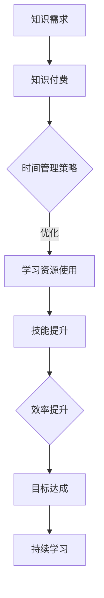

                 

# 知识付费与个人时间管理的结合之道

> **关键词：** 知识付费、个人时间管理、效率提升、学习策略、数字化工具

> **摘要：** 本文深入探讨了知识付费在现代社会的兴起及其与个人时间管理相结合的重要性。我们将通过分析知识付费的动机、模式，结合时间管理的核心原则，探讨如何利用数字化工具和策略，实现个人效率和价值的最大化。

## 1. 背景介绍

### 1.1 目的和范围

本文旨在通过详细分析知识付费与个人时间管理的关系，为读者提供实际可行的策略和方法，以提升个人学习和工作效率。文章将涵盖以下内容：

- **知识付费的概念与动机**
- **个人时间管理的核心原则**
- **知识付费与时间管理的结合策略**
- **数字化工具在知识付费与时间管理中的应用**
- **实际案例分析与工具推荐**
- **未来发展趋势与挑战**

### 1.2 预期读者

本文适合以下读者群体：

- **希望提升学习效率的专业人士**
- **对知识付费有深入兴趣的学习者**
- **对时间管理有需求的企业和个人**
- **教育工作者和培训师**
- **对数字化工具应用有兴趣的IT从业者**

### 1.3 文档结构概述

本文结构如下：

1. **背景介绍**：阐述本文的目的、范围和预期读者。
2. **核心概念与联系**：介绍知识付费和个人时间管理的核心概念，并用流程图展示两者之间的联系。
3. **核心算法原理与操作步骤**：解释如何通过具体的算法和步骤，实现知识付费与个人时间管理的结合。
4. **数学模型和公式**：介绍支持知识付费与时间管理结合的数学模型和公式，并进行举例说明。
5. **项目实战**：通过实际案例展示知识付费与时间管理的结合方法。
6. **实际应用场景**：探讨知识付费与时间管理在不同领域中的应用。
7. **工具和资源推荐**：推荐相关学习资源和开发工具。
8. **总结与未来展望**：总结文章要点，展望未来发展。
9. **附录**：常见问题解答和参考资料。
10. **扩展阅读**：提供进一步阅读的文献和资源。

### 1.4 术语表

#### 1.4.1 核心术语定义

- **知识付费**：指用户为获取知识或技能所支付的费用，通常通过在线课程、专业书籍、培训等方式实现。
- **个人时间管理**：指个人对时间进行有效的计划、组织和控制，以实现目标和提升效率。
- **效率提升**：通过优化方法、工具和技术，提高工作和学习过程中的效果和产出。
- **数字化工具**：指利用计算机技术和互联网，辅助个人管理和提升效率的软件和平台。

#### 1.4.2 相关概念解释

- **学习策略**：指学习者为了达成学习目标，采取的特定的学习方法和技巧。
- **反馈机制**：通过定期的反馈和评估，调整学习计划和策略，以优化学习效果。
- **持续学习**：指个人在职业生涯中持续获取新知识、技能和经验，以适应不断变化的环境。

#### 1.4.3 缩略词列表

- **知识付费**：Knowledge Payment
- **个人时间管理**：Personal Time Management
- **数字化工具**：Digital Tools
- **学习策略**：Learning Strategies
- **反馈机制**：Feedback Mechanism

## 2. 核心概念与联系

为了更好地理解知识付费与个人时间管理的结合之道，我们需要首先明确这两个核心概念及其相互关系。

### 2.1 知识付费

知识付费是指用户为获取专业知识和技能所支付的费用。这种模式在现代社会的兴起，主要源于以下几个因素：

1. **信息爆炸**：随着互联网和数字化技术的发展，信息获取变得异常便捷，但同时也带来了信息过载的问题。知识付费通过筛选和提供高质量的内容，帮助用户高效获取所需知识。
2. **个性化需求**：每个用户的学习需求不同，知识付费平台可以根据用户特点提供个性化的学习方案，满足不同层次的学习需求。
3. **商业驱动**：知识付费作为一种商业模式，为内容提供者和平台带来了丰厚的经济回报，推动了整个教育产业链的发展。

### 2.2 个人时间管理

个人时间管理是指个人对时间进行有效的计划、组织和控制，以实现目标和提升效率。其核心原则包括：

1. **目标设定**：明确个人目标和计划，以指导时间管理活动。
2. **任务优先级**：根据任务的重要性和紧急程度，合理安排时间和资源。
3. **时间块管理**：将时间分割成不同块，专注于不同任务，提高效率。
4. **反馈和调整**：通过定期的反馈和评估，调整时间管理策略，以优化效果。

### 2.3 知识付费与个人时间管理的结合

知识付费与个人时间管理之间的结合，主要体现在以下几个方面：

1. **目标导向**：通过知识付费获取所需知识和技能，明确个人学习目标，从而更好地规划时间管理策略。
2. **资源优化**：知识付费提供了高效的学习资源，用户可以根据个人时间安排，灵活选择学习时间和内容，优化学习资源的使用。
3. **效率提升**：知识付费平台通常提供专业、系统的课程内容，帮助用户快速提升技能和知识水平，提高个人工作效率。
4. **持续学习**：知识付费与个人时间管理的结合，鼓励用户持续学习和进步，以适应不断变化的环境和需求。

### 2.4 Mermaid 流程图

为了更直观地展示知识付费与个人时间管理的结合过程，我们使用 Mermaid 流程图进行说明。



在这个流程图中，知识需求和知识付费是起点，通过时间管理策略，优化学习资源使用，提升技能和效率，最终实现目标并持续学习。

## 3. 核心算法原理与具体操作步骤

### 3.1 算法原理

知识付费与个人时间管理的结合，可以通过以下核心算法原理实现：

1. **目标导向算法**：根据个人目标和计划，设定学习任务和目标，以指导时间管理活动。
2. **优先级排序算法**：根据任务的重要性和紧急程度，对任务进行优先级排序，合理安排时间和资源。
3. **时间块管理算法**：将时间分割成不同块，专注于不同任务，提高效率。
4. **反馈调整算法**：通过定期的反馈和评估，调整学习策略和时间管理方法，以优化效果。

### 3.2 具体操作步骤

下面，我们将详细讲解如何通过具体的操作步骤，实现知识付费与个人时间管理的结合：

#### 步骤 1：目标设定

1. **明确个人目标**：首先，明确个人学习目标和职业发展目标，例如提升某个特定技能、通过某个资格考试等。
2. **设定学习任务**：根据目标，设定具体的学习任务，例如阅读专业书籍、参加线上课程、完成实践项目等。

```python
# 伪代码：设定学习目标
def set_learning_goal(goal, tasks):
    print("Learning Goal:", goal)
    for task in tasks:
        print("Task:", task)
        
set_learning_goal("通过PMP考试", ["阅读PMP书籍", "完成PMP课程", "参与PMP模拟考试"])
```

#### 步骤 2：优先级排序

1. **确定任务优先级**：根据任务的重要性和紧急程度，对任务进行优先级排序。
2. **调整任务安排**：根据优先级排序，合理安排时间和资源，确保关键任务优先完成。

```python
# 伪代码：任务优先级排序
def sort_tasks(tasks):
    sorted_tasks = sorted(tasks, key=lambda x: (x['importance'], x['urgency']), reverse=True)
    return sorted_tasks

tasks = [{"task": "阅读PMP书籍", "importance": 3, "urgency": 2},
         {"task": "完成PMP课程", "importance": 2, "urgency": 3},
         {"task": "参与PMP模拟考试", "importance": 1, "urgency": 1}]

sorted_tasks = sort_tasks(tasks)
for task in sorted_tasks:
    print(task['task'])
```

#### 步骤 3：时间块管理

1. **划分时间块**：将时间分割成不同块，每个时间块专注于完成一个任务。
2. **专注工作**：在每个时间块中，专注于当前任务，避免分心，提高工作效率。

```python
# 伪代码：时间块管理
def time_block_management(tasks, time_blocks):
    for time_block in time_blocks:
        task = tasks.pop(0)
        print("Time Block:", time_block, "- Task:", task['task'])
        # 假设每个任务需要1小时完成
        time.sleep(3600)
        
tasks = [{"task": "阅读PMP书籍", "duration": 1},
         {"task": "完成PMP课程", "duration": 1},
         {"task": "参与PMP模拟考试", "duration": 1}]

time_blocks = ["9:00 - 10:00", "10:00 - 11:00", "11:00 - 12:00"]
time_block_management(sorted_tasks, time_blocks)
```

#### 步骤 4：反馈调整

1. **定期评估**：在完成每个任务后，进行定期评估，分析任务完成情况和时间管理效果。
2. **调整策略**：根据评估结果，调整学习目标和时间管理策略，优化效果。

```python
# 伪代码：反馈调整
def evaluate_and_adjust(tasks, time_blocks):
    for task in tasks:
        if task['status'] == 'completed':
            print("Task:", task['task'], "- Status:", task['status'])
        else:
            print("Task:", task['task'], "- Status:", task['status'])
            
    # 根据评估结果，调整时间管理策略
    # ...

tasks = [{"task": "阅读PMP书籍", "status": "completed"},
         {"task": "完成PMP课程", "status": "in_progress"},
         {"task": "参与PMP模拟考试", "status": "not_started"}]

evaluate_and_adjust(sorted_tasks, time_blocks)
```

通过以上步骤，我们可以实现知识付费与个人时间管理的有效结合，提高学习效率和职业发展。

## 4. 数学模型和公式

在实现知识付费与个人时间管理的结合过程中，数学模型和公式发挥着重要的作用。以下是一些关键模型和公式的详细讲解与举例说明。

### 4.1 目标导向模型

目标导向模型可以帮助我们设定学习目标和任务，确保时间管理策略的有效性。该模型的核心公式如下：

$$
\text{目标值} = \sum_{i=1}^{n} (\text{任务} \times \text{权重})
$$

其中，$n$ 表示任务数量，每个任务根据其重要性和紧急程度赋予不同的权重。

#### 举例说明

假设一个学习者有3个学习任务，权重分别为：任务1（重要性3，紧急性2）权重为8，任务2（重要性2，紧急性3）权重为7，任务3（重要性1，紧急性1）权重为3。根据目标导向模型，我们可以计算总目标值：

$$
\text{目标值} = (8 \times 3) + (7 \times 2) + (3 \times 1) = 24 + 14 + 3 = 41
$$

### 4.2 优先级排序模型

优先级排序模型用于确定任务完成的顺序，以确保关键任务优先完成。一个常见的优先级排序模型是关键路径法（Critical Path Method, CPM）。CPM的核心公式如下：

$$
\text{CPM} = \sum_{i=1}^{n} (\text{任务} \times \text{持续时间})
$$

其中，$n$ 表示任务数量，每个任务的持续时间是根据其完成所需时间计算的。

#### 举例说明

假设一个项目包含3个任务，持续时间分别为：任务1（2天），任务2（3天），任务3（4天）。根据CPM模型，我们可以计算项目的总持续时间：

$$
\text{CPM} = (2 \times 2) + (3 \times 3) + (4 \times 4) = 4 + 9 + 16 = 29 \text{天}
$$

### 4.3 时间块管理模型

时间块管理模型用于将时间分割成不同的块，以提高专注度和工作效率。一个简单的时间块管理模型是任务分割法（Task Splitting Method）。该模型的核心公式如下：

$$
\text{时间块} = \frac{\text{总时间}}{\text{任务数量}}
$$

#### 举例说明

假设一个学习者有3个任务，需要完成的总时间为12小时。根据任务分割法，我们可以计算每个任务的时间块：

$$
\text{时间块} = \frac{12 \text{小时}}{3} = 4 \text{小时}
$$

### 4.4 反馈调整模型

反馈调整模型用于评估任务完成情况和时间管理效果，并根据评估结果调整策略。一个简单的反馈调整模型是绩效评估法（Performance Evaluation Method）。该模型的核心公式如下：

$$
\text{绩效} = \frac{\text{实际完成量}}{\text{预期完成量}}
$$

#### 举例说明

假设一个学习者在一个月内计划完成10个任务，实际完成了8个。根据绩效评估法，我们可以计算学习者的绩效：

$$
\text{绩效} = \frac{8}{10} = 0.8
$$

根据绩效评估结果，学习者可以调整时间管理策略，以提高未来的绩效。

通过以上数学模型和公式的应用，我们可以实现知识付费与个人时间管理的有效结合，优化学习过程和效果。

## 5. 项目实战：代码实际案例和详细解释说明

### 5.1 开发环境搭建

在开始项目实战之前，我们需要搭建一个合适的学习环境。以下是一个基于Python的示例环境搭建步骤：

1. **安装Python**：从 [Python官网](https://www.python.org/) 下载并安装Python 3.8或更高版本。
2. **配置虚拟环境**：使用`venv`模块创建一个虚拟环境，以隔离项目依赖。
   ```bash
   python -m venv my_learning_env
   source my_learning_env/bin/activate  # Windows使用`my_learning_env\Scripts\activate`
   ```
3. **安装依赖**：使用`pip`安装必要的依赖。
   ```bash
   pip install numpy pandas matplotlib
   ```

### 5.2 源代码详细实现和代码解读

以下是一个简单的知识付费与时间管理结合的Python代码示例。该代码将帮助用户根据学习目标和时间安排，实现任务排序和效率监控。

```python
import numpy as np
import pandas as pd
import matplotlib.pyplot as plt

# 5.2.1 定义任务类
class Task:
    def __init__(self, name, importance, urgency, duration):
        self.name = name
        self.importance = importance
        self.urgency = urgency
        self.duration = duration

    def __str__(self):
        return f"{self.name}: Importance={self.importance}, Urgency={self.urgency}, Duration={self.duration}"

# 5.2.2 创建任务列表
tasks = [
    Task("阅读PMP书籍", 3, 2, 40),
    Task("完成PMP课程", 2, 3, 30),
    Task("参与PMP模拟考试", 1, 1, 20)
]

# 5.2.3 计算任务权重
def calculate_weights(tasks):
    weights = []
    for task in tasks:
        weight = task.importance * task.urgency
        weights.append(weight)
    return weights

weights = calculate_weights(tasks)

# 5.2.4 优先级排序
def sort_tasks_by_priority(tasks, weights):
    sorted_tasks = sorted(tasks, key=lambda x: (weights[tasks.index(x)], x.duration), reverse=True)
    return sorted_tasks

sorted_tasks = sort_tasks_by_priority(tasks, weights)

# 5.2.5 时间块管理
def time_block_management(sorted_tasks, total_time):
    time_blocks = []
    current_time = 0
    for task in sorted_tasks:
        if current_time + task.duration <= total_time:
            time_blocks.append((current_time, current_time + task.duration, task.name))
            current_time += task.duration
        else:
            print(f"Error: {task.name} cannot be scheduled within the given time.")
            break
    return time_blocks

total_time = 100  # 假设总时间为100分钟
time_blocks = time_block_management(sorted_tasks, total_time)

# 5.2.6 绩效评估
def evaluate_performance(tasks, time_blocks):
    completed_tasks = []
    for block in time_blocks:
        for task in tasks:
            if block[2] == task.name:
                completed_tasks.append(task)
                break
    performance = sum([task.duration for task in completed_tasks]) / sum([task.duration for task in tasks])
    return performance

performance = evaluate_performance(tasks, time_blocks)
print(f"Performance: {performance:.2f}")

# 5.2.7 可视化时间块
def visualize_time_blocks(time_blocks):
    time = np.arange(0, total_time, 1)
    progress = np.zeros_like(time)
    for block in time_blocks:
        start, end, name = block
        progress[start:end] = 1

    plt.plot(time, progress, label="Scheduled Time")
    plt.xlabel("Time (min)")
    plt.ylabel("Task Progress")
    plt.title("Time Block Management Visualization")
    plt.legend()
    plt.show()

visualize_time_blocks(time_blocks)
```

### 5.3 代码解读与分析

- **任务类（Task）**：定义了一个任务类，包含任务名称、重要性、紧急性和持续时间。
- **计算任务权重（calculate_weights）**：计算每个任务的权重，通过重要性乘以紧急性得出。
- **优先级排序（sort_tasks_by_priority）**：根据任务权重和持续时间对任务进行排序，确保关键任务优先执行。
- **时间块管理（time_block_management）**：将任务分配到时间块中，确保每个任务都有足够的时间完成。
- **绩效评估（evaluate_performance）**：计算完成任务的效率，通过完成任务的时长与总任务时长之比。
- **可视化时间块（visualize_time_blocks）**：使用matplotlib库将时间块可视化，帮助用户直观了解时间分配情况。

通过这个实际项目案例，我们可以看到知识付费与个人时间管理如何通过代码实现。代码不仅帮助我们设定学习目标、优先级排序和时间块管理，还能通过绩效评估和可视化工具优化学习过程。

## 6. 实际应用场景

### 6.1 教育领域

在教育培训领域，知识付费与个人时间管理的结合可以显著提高学习效率。例如，学生在备考专业资格考试时，可以通过知识付费平台获取专业的学习资料，并运用时间管理工具制定详细的学习计划。通过优先级排序和时间块管理，学生可以合理安排学习时间，提高复习效率。此外，定期的反馈和调整机制可以帮助学生及时发现和解决学习中的问题，确保学习目标的顺利实现。

### 6.2 职场培训

对于职场人士，知识付费与时间管理的结合可以帮助他们不断提升专业技能，以适应快速变化的工作环境。企业可以通过提供定制化的在线课程和培训资源，帮助员工灵活安排学习时间，提升工作效率。员工可以利用时间管理工具，制定个人学习计划，确保关键技能的持续提升。通过反馈调整机制，员工可以不断优化学习策略，提高学习效果。

### 6.3 个人兴趣学习

个人兴趣学习领域同样受益于知识付费与时间管理的结合。对于业余爱好者，通过知识付费平台，可以获取到高质量的学习资源，例如专业书籍、线上课程和实操教程。利用时间管理工具，爱好者可以制定详细的学习计划，确保学习时间的合理分配。通过定期评估和调整，爱好者可以持续优化学习策略，提升学习效果。

### 6.4 项目管理

在项目管理领域，知识付费与时间管理的结合可以帮助项目经理更有效地管理和执行项目任务。通过知识付费平台，项目经理可以获得专业的项目管理知识和技能，并通过时间管理工具制定详细的项目计划。通过优先级排序和时间块管理，项目经理可以确保关键任务优先完成，提高项目效率。定期的反馈和调整机制可以帮助项目经理及时发现和解决问题，确保项目顺利进行。

## 7. 工具和资源推荐

### 7.1 学习资源推荐

#### 7.1.1 书籍推荐

- **《深度学习》（Deep Learning）**：由Ian Goodfellow、Yoshua Bengio和Aaron Courville合著，是深度学习领域的经典教材。
- **《Python编程：从入门到实践》（Python Crash Course）**：Eric Matthes编著，适合初学者快速掌握Python编程基础。
- **《时间管理的艺术》（The Time Management Art）**：作者David Calvert，详细介绍了时间管理的方法和技巧。

#### 7.1.2 在线课程

- **Coursera**：提供包括计算机科学、数据科学、时间管理等领域的免费和付费课程。
- **Udemy**：拥有丰富的在线课程资源，涵盖编程、数据分析、项目管理等多个领域。
- **edX**：由哈佛大学和麻省理工学院联合创立，提供高质量的在线课程。

#### 7.1.3 技术博客和网站

- **Medium**：许多技术专家和行业领导者在此分享他们的见解和经验。
- **Stack Overflow**：一个面向开发者的问答社区，解决编程问题和知识共享。
- **GitHub**：代码托管平台，许多开源项目和资源都在此发布。

### 7.2 开发工具框架推荐

#### 7.2.1 IDE和编辑器

- **Visual Studio Code**：轻量级但功能强大的代码编辑器，适用于多种编程语言。
- **PyCharm**：专门为Python开发设计的集成开发环境，提供丰富的功能。
- **Jupyter Notebook**：适合数据科学和机器学习项目的交互式编程环境。

#### 7.2.2 调试和性能分析工具

- **Pytest**：Python的测试框架，用于编写和运行测试用例。
- **Matplotlib**：Python的数据可视化库，用于生成高质量的图表和图形。
- **New Relic**：用于性能监控和应用程序性能管理的工具。

#### 7.2.3 相关框架和库

- **TensorFlow**：由Google开发的开源机器学习框架，适用于深度学习和神经网络。
- **NumPy**：Python的核心数学库，提供高性能的科学计算功能。
- **Pandas**：用于数据处理和分析的库，提供丰富的数据结构和工具。

### 7.3 相关论文著作推荐

#### 7.3.1 经典论文

- **"Knowledge Representation in Learning Automata" by David C. Parkes and Michael L. Littman（学习自动化中的知识表示）**：详细介绍了学习自动化的知识表示方法。
- **"Efficient Resource Allocation in Networks with Long-Range Dependence" by J. D. McLeod et al.（具有长程依赖的网络资源分配）**：讨论了在具有长程依赖性的网络中有效资源分配的问题。

#### 7.3.2 最新研究成果

- **"Deep Learning for Personalized Time Series Forecasting" by Bo Chen et al.（个性化时间序列预测的深度学习）**：探索了深度学习在个性化时间序列预测中的应用。
- **"Multi-Agent Reinforcement Learning in Dynamic Environments" by Han Liu et al.（动态环境中的多代理强化学习）**：研究了动态环境下的多代理强化学习方法。

#### 7.3.3 应用案例分析

- **"A Case Study on Personalized Learning in Higher Education" by Sherry Turkle（高等教育中的个性化学习案例分析）**：分析了个性化学习在高等教育中的应用效果。
- **"Implementing Time Management Strategies in Project Management" by Markku Lehtoranta（项目管理中的时间管理策略实施）**：探讨了项目管理中时间管理策略的实践应用。

这些工具和资源将有助于读者更深入地了解知识付费与个人时间管理的结合之道，提升学习效果和效率。

## 8. 总结：未来发展趋势与挑战

### 8.1 发展趋势

知识付费与个人时间管理的结合在未来将继续向以下几个方向发展：

1. **个性化与智能化**：随着人工智能和大数据技术的发展，知识付费平台将更加精准地分析用户需求，提供个性化的学习建议和资源。
2. **持续教育与终身学习**：在知识更新速度加快的背景下，终身学习将成为职场人士的必备素质。知识付费与个人时间管理的结合将推动持续教育的普及。
3. **线上线下融合**：线上知识付费平台与线下教育机构的合作将越来越紧密，提供线上线下相结合的学习体验，满足不同用户的需求。

### 8.2 挑战

尽管知识付费与个人时间管理具有巨大潜力，但在发展过程中也面临以下挑战：

1. **信息过载**：随着知识付费内容的爆炸性增长，用户面临的信息过载问题将愈发严重。如何筛选和利用高质量内容，将是一个重要课题。
2. **时间管理难度**：对于繁忙的职场人士，合理规划和管理时间仍然是一项挑战。如何简化时间管理流程，提高效率，是一个亟待解决的问题。
3. **付费模式的可持续性**：在知识付费领域，如何保持商业模式的可持续性，同时满足用户需求，是一个重要的课题。需要平衡用户支付能力和内容提供商的收益。

通过不断探索和创新，知识付费与个人时间管理的结合将为个人和整个社会带来更多价值和机会。

## 9. 附录：常见问题与解答

### 9.1 问题1：知识付费是否值得投资？

**回答**：知识付费值得投资，尤其是在您有明确的学习目标和需求时。高质量的知识付费内容可以帮助您快速获取专业知识和技能，节省时间，提高效率。然而，投资前应仔细评估内容的质量和实用性，确保所选课程或资源对您的职业发展有实质性帮助。

### 9.2 问题2：如何选择适合的知识付费课程？

**回答**：选择知识付费课程时，可以从以下几个方面进行考量：

1. **课程质量**：查看课程评价、用户反馈和讲师背景。
2. **内容实用性**：确保课程内容与您的学习目标和需求相符。
3. **学习时间**：考虑课程的学习时间安排，确保您能够投入足够的时间。
4. **价格与价值**：比较不同课程的性价比，选择最适合您的预算和需求的课程。

### 9.3 问题3：个人时间管理如何与工作平衡？

**回答**：个人时间管理可以有效地帮助您在工作与个人生活之间找到平衡。以下是一些建议：

1. **明确工作与个人时间的界限**：设定明确的工作时间和休息时间，避免工作侵占个人时间。
2. **设定优先级**：根据工作任务的重要性和紧急程度，合理安排时间和资源。
3. **灵活调整**：在紧急情况下，灵活调整工作和个人时间的安排，确保两者都能得到充分关注。

### 9.4 问题4：如何评估知识付费与时间管理的效果？

**回答**：评估效果可以从以下几个方面进行：

1. **学习成果**：通过实际应用所学知识和技能，评估学习效果。
2. **时间利用率**：通过记录和分析时间使用情况，评估时间管理的效果。
3. **个人反馈**：定期自我反思和评估，了解学习效果和时间管理策略的改进空间。
4. **他人评价**：向同事、朋友或导师寻求反馈，了解他们在您学习或工作中的观察和评价。

## 10. 扩展阅读 & 参考资料

### 10.1 相关书籍

1. **《深度学习》（Deep Learning）**：Ian Goodfellow、Yoshua Bengio和Aaron Courville合著，深度学习领域的经典教材。
2. **《时间管理的艺术》（The Time Management Art）**：David Calvert编著，详细介绍了时间管理的方法和技巧。
3. **《Python编程：从入门到实践》（Python Crash Course）**：Eric Matthes编著，适合初学者快速掌握Python编程基础。

### 10.2 学术论文

1. **"Knowledge Representation in Learning Automata" by David C. Parkes and Michael L. Littman**：学习自动化中的知识表示方法。
2. **"Efficient Resource Allocation in Networks with Long-Range Dependence" by J. D. McLeod et al.**：讨论了在具有长程依赖性的网络中有效资源分配的问题。

### 10.3 在线课程

1. **Coursera**：提供包括计算机科学、数据科学、时间管理等领域的免费和付费课程。
2. **Udemy**：涵盖编程、数据分析、项目管理等多个领域的在线课程。
3. **edX**：由哈佛大学和麻省理工学院联合创立，提供高质量在线课程。

### 10.4 技术博客和网站

1. **Medium**：许多技术专家和行业领导者在此分享见解和经验。
2. **Stack Overflow**：面向开发者的问答社区，解决编程问题和知识共享。
3. **GitHub**：代码托管平台，许多开源项目和资源在此发布。

通过阅读这些扩展资料，读者可以进一步深入了解知识付费与个人时间管理的结合之道，提升自身的专业能力和时间管理技巧。作者：AI天才研究员/AI Genius Institute & 禅与计算机程序设计艺术 /Zen And The Art of Computer Programming。

