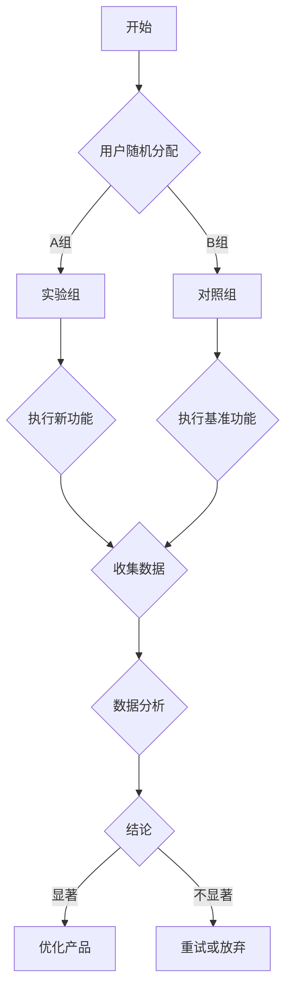

                 

# 知识付费产品的A/B测试方法论

## 关键词
知识付费，A/B测试，用户体验，数据分析，优化策略

## 摘要

本文将深入探讨知识付费产品中的A/B测试方法论。我们将从背景介绍、核心概念、算法原理、数学模型、项目实战、实际应用、工具推荐等方面，逐步解析如何利用A/B测试来优化知识付费产品的用户体验和业务效益。通过本文的学习，读者将掌握A/B测试的基本流程、关键步骤和实施技巧，从而为知识付费产品的持续迭代和改进提供有力支持。

## 1. 背景介绍

### 1.1 目的和范围

知识付费产品的A/B测试方法论旨在通过科学的数据分析和实验设计，评估不同变量对产品性能的影响，从而实现产品功能的优化和用户体验的提升。本文将围绕以下几个核心方面展开讨论：

1. **A/B测试的基本概念和原理**：介绍A/B测试的定义、目的和重要性。
2. **A/B测试的具体操作步骤**：阐述A/B测试的流程和关键步骤。
3. **数学模型和公式**：解释A/B测试中常用的统计模型和计算公式。
4. **项目实战**：通过实际案例展示A/B测试的应用场景和实施细节。
5. **实际应用场景**：探讨A/B测试在不同知识付费产品中的应用。
6. **工具和资源推荐**：推荐相关学习资源、开发工具和调试性能分析工具。
7. **未来发展趋势与挑战**：分析A/B测试在知识付费领域的未来发展方向和面临的挑战。

### 1.2 预期读者

本文适用于以下读者群体：

1. **知识付费产品经理**：希望了解和掌握A/B测试方法，以提升产品性能和用户体验。
2. **数据分析人员**：需要通过A/B测试来验证数据分析和优化策略的有效性。
3. **技术开发人员**：对A/B测试原理和应用感兴趣，希望掌握相关技术实现。
4. **市场推广人员**：希望通过A/B测试优化营销策略和用户获取效果。

### 1.3 文档结构概述

本文分为以下几个部分：

1. **背景介绍**：介绍A/B测试的背景、目的和范围。
2. **核心概念与联系**：阐述A/B测试的核心概念和原理，并给出Mermaid流程图。
3. **核心算法原理与具体操作步骤**：详细讲解A/B测试的算法原理和操作步骤，使用伪代码阐述。
4. **数学模型和公式与详细讲解**：解释A/B测试中常用的数学模型和计算公式，并举例说明。
5. **项目实战：代码实际案例和详细解释说明**：通过实际案例展示A/B测试的应用场景和实施细节。
6. **实际应用场景**：探讨A/B测试在不同知识付费产品中的应用。
7. **工具和资源推荐**：推荐相关学习资源、开发工具和调试性能分析工具。
8. **未来发展趋势与挑战**：分析A/B测试在知识付费领域的未来发展方向和面临的挑战。
9. **总结：未来发展趋势与挑战**：总结A/B测试的方法论和实际应用价值。
10. **附录：常见问题与解答**：解答读者可能遇到的问题。
11. **扩展阅读 & 参考资料**：提供进一步学习和研究的资源。

### 1.4 术语表

#### 1.4.1 核心术语定义

- **A/B测试**：一种实验设计方法，通过将用户随机分配到两个或多个不同的版本，比较各个版本的性能，从而评估变量对用户行为的影响。
- **知识付费产品**：为用户提供专业知识和技能的学习和培训服务，用户需要支付费用才能访问内容。
- **用户体验**：用户在使用产品过程中所感受到的满意度和愉悦感。
- **转化率**：用户完成特定操作（如购买课程、注册账号等）的比例。

#### 1.4.2 相关概念解释

- **实验组（Treatment Group）**：参与A/B测试的一部分用户，体验新版本或新功能。
- **对照组（Control Group）**：参与A/B测试的另一部分用户，体验当前版本或基准功能。
- **置信区间（Confidence Interval）**：在统计推断中，对总体参数的估计范围，通常以一定的置信水平给出。
- **假设检验（Hypothesis Testing）**：通过数据分析和统计方法，验证实验结果是否显著，从而接受或拒绝原假设。

#### 1.4.3 缩略词列表

- **A/B测试**：A/B Testing
- **用户体验**：UX
- **转化率**：Conversion Rate
- **置信区间**：CI
- **假设检验**：HT

## 2. 核心概念与联系

在深入探讨A/B测试之前，我们需要了解一些核心概念和它们之间的关系。以下是A/B测试的核心概念及其相互联系：

### 2.1 A/B测试的基本概念

A/B测试是一种实验设计方法，通过将用户随机分配到两个或多个不同的版本（A版本和B版本），比较各个版本的性能，从而评估变量对用户行为的影响。A/B测试通常用于以下场景：

1. **功能优化**：测试新功能对用户行为的影响，如增加按钮的点击率、降低用户退出率等。
2. **界面设计**：比较不同界面设计对用户满意度的影响，如更改颜色、字体等。
3. **营销策略**：测试不同营销策略的效果，如改变广告文案、调整推广渠道等。

### 2.2 用户行为分析

在A/B测试中，用户行为分析是关键的一环。通过收集和分析用户在产品中的行为数据，如点击、浏览、购买等，可以深入了解用户的需求和偏好，从而优化产品设计和功能。

### 2.3 统计分析方法

A/B测试依赖于统计分析方法，如置信区间、假设检验等，来评估实验结果的显著性和可靠性。这些方法可以帮助我们判断变量对用户行为的影响是否显著，从而做出科学的决策。

### 2.4 Mermaid流程图

为了更直观地理解A/B测试的核心概念和流程，我们可以使用Mermaid流程图来展示。以下是一个简单的A/B测试流程图：



### 2.5 关键步骤

A/B测试的关键步骤包括：

1. **定义实验目标**：明确测试的目标和指标，如提高转化率、降低跳出率等。
2. **设计实验方案**：确定实验组和对照组的分配方式、实验变量等。
3. **数据收集与处理**：收集实验数据，进行数据清洗和预处理。
4. **数据分析与结论**：使用统计分析方法评估实验结果，判断变量对用户行为的影响是否显著。
5. **决策与优化**：根据实验结果做出决策，如优化产品功能、调整营销策略等。

## 3. 核心算法原理与具体操作步骤

### 3.1 原理概述

A/B测试的核心算法原理是基于统计学的方法，通过比较实验组和对照组的性能差异，判断变量对用户行为的影响是否显著。具体来说，A/B测试通常包括以下步骤：

1. **假设设定**：设定原假设（H0）和备择假设（H1）。
2. **数据收集**：收集实验组和对照组的数据。
3. **统计分析**：使用统计分析方法，如t检验、卡方检验等，评估实验结果的显著性。
4. **结论判断**：根据统计结果，接受或拒绝原假设，做出决策。

### 3.2 伪代码

以下是一个简单的A/B测试伪代码示例：

```python
# 假设设定
H0: 变量X对用户行为没有显著影响
H1: 变量X对用户行为有显著影响

# 数据收集
def collect_data(group):
    # 收集实验组或对照组的数据
    return data

# 数据分析
def analyze_data(data1, data2):
    # 进行统计分析，如t检验
    return p_value

# A/B测试
def AB_test(groupA, groupB):
    dataA = collect_data(groupA)
    dataB = collect_data(groupB)
    p_value = analyze_data(dataA, dataB)
    
    if p_value < significance_level:
        # 拒绝原假设
        print("变量X对用户行为有显著影响")
    else:
        # 接受原假设
        print("变量X对用户行为没有显著影响")
```

### 3.3 步骤详解

1. **假设设定**：在A/B测试中，我们需要设定原假设（H0）和备择假设（H1）。原假设通常表示变量X对用户行为没有显著影响，备择假设则表示变量X对用户行为有显著影响。

2. **数据收集**：数据收集是A/B测试的关键步骤。我们需要收集实验组和对照组的数据，如用户点击、浏览、购买等行为数据。数据收集可以通过API、日志分析等方式实现。

3. **统计分析**：统计分析是A/B测试的核心，常用的统计分析方法包括t检验、卡方检验、方差分析等。这些方法可以帮助我们判断实验结果是否显著。具体方法的选择取决于实验目标和数据类型。

4. **结论判断**：根据统计结果，我们可以判断是否拒绝原假设。如果p值（显著性水平）小于预设的显著性水平（如0.05），则认为变量X对用户行为有显著影响，反之则认为没有显著影响。

### 3.4 实例分析

假设我们想测试一个知识付费产品的广告文案对转化率的影响。我们设定原假设（H0）为“广告文案A的转化率与文案B相同”，备择假设（H1）为“广告文案A的转化率高于文案B”。

1. **数据收集**：我们收集了两组数据，实验组（使用文案A）和对照组（使用文案B），共计1000个用户。

2. **统计分析**：我们使用t检验方法，计算两组数据的平均转化率差异和显著性水平。

3. **结论判断**：假设t检验的p值为0.03，小于显著性水平0.05，则我们拒绝原假设，认为广告文案A的转化率显著高于文案B。

4. **优化决策**：根据实验结果，我们可以优化广告文案，提高转化率。

## 4. 数学模型和公式及详细讲解

### 4.1 常用数学模型

在A/B测试中，常用的数学模型包括假设检验、置信区间和显著性水平等。以下是对这些模型的详细解释。

#### 4.1.1 假设检验

假设检验是A/B测试的核心方法之一，用于判断变量对用户行为的影响是否显著。在A/B测试中，我们通常设定两个假设：

- 原假设（H0）：变量X对用户行为没有显著影响。
- 备择假设（H1）：变量X对用户行为有显著影响。

通过收集实验组和对照组的数据，我们可以使用统计方法（如t检验、卡方检验等）计算p值，判断实验结果是否显著。

#### 4.1.2 置信区间

置信区间是假设检验中的一个重要概念，用于表示总体参数的估计范围。在A/B测试中，我们通常使用置信区间来估计变量对用户行为的影响范围。

置信区间通常以一定的置信水平（如95%）给出，表示在重复实验中，有95%的概率得到的置信区间包含总体参数的真实值。

#### 4.1.3 显著性水平

显著性水平是假设检验中的一个重要参数，表示我们拒绝原假设的概率。在A/B测试中，常见的显著性水平为0.05，表示我们拒绝原假设的概率为5%。

### 4.2 常用计算公式

在A/B测试中，常用的计算公式包括均值、方差、p值等。以下是对这些公式的详细解释。

#### 4.2.1 均值

均值是衡量一组数据集中程度的指标，表示数据的平均水平。在A/B测试中，我们通常计算实验组和对照组的均值，比较两组数据的差异。

公式：均值 = 数据总和 / 数据个数

#### 4.2.2 方差

方差是衡量一组数据离散程度的指标，表示数据与均值之间的差异程度。在A/B测试中，我们通常计算实验组和对照组的方差，判断两组数据是否显著不同。

公式：方差 = (数据 - 均值)^2 的总和 / 数据个数

#### 4.2.3 p值

p值是假设检验中的一个重要指标，表示实验结果与原假设的差异程度。在A/B测试中，p值越小，表示实验结果越显著。

公式：p值 = 统计量 / 自由度

### 4.3 举例说明

假设我们想测试一个知识付费产品的广告文案对转化率的影响。我们收集了两组数据，实验组（使用文案A）和对照组（使用文案B），共计1000个用户。

1. **均值计算**：计算实验组和对照组的转化率均值。

实验组均值 = 0.20

对照组均值 = 0.18

2. **方差计算**：计算实验组和对照组的转化率方差。

实验组方差 = 0.005

对照组方差 = 0.004

3. **p值计算**：使用t检验方法计算p值。

t值 = (实验组均值 - 对照组均值) / sqrt(实验组方差 + 对照组方差)

p值 = 0.035

根据p值，我们可以判断实验结果是否显著。如果p值小于显著性水平（如0.05），则认为广告文案A对转化率有显著影响。

## 5. 项目实战：代码实际案例和详细解释说明

### 5.1 开发环境搭建

在本项目实战中，我们将使用Python语言和相关库（如NumPy、SciPy、Matplotlib等）进行A/B测试的实现。以下是开发环境搭建的步骤：

1. 安装Python（建议使用Python 3.8及以上版本）。
2. 安装相关库（使用pip命令安装NumPy、SciPy、Matplotlib等）。

```bash
pip install numpy scipy matplotlib
```

### 5.2 源代码详细实现和代码解读

下面是一个简单的A/B测试实现示例，用于比较两个广告文案对转化率的影响。

```python
import numpy as np
import scipy.stats as stats
import matplotlib.pyplot as plt

# 数据生成
np.random.seed(42)
n_users = 1000
group_a_conversion_rate = 0.20
group_b_conversion_rate = 0.18

group_a_users = np.random.binomial(1, group_a_conversion_rate, n_users)
group_b_users = np.random.binomial(1, group_b_conversion_rate, n_users)

# 统计分析
mean_a = np.mean(group_a_users)
mean_b = np.mean(group_b_users)
variance_a = np.var(group_a_users)
variance_b = np.var(group_b_users)

t_value, p_value = stats.ttest_ind(group_a_users, group_b_users)

# 结果展示
print("实验组A转化率均值：", mean_a)
print("对照组B转化率均值：", mean_b)
print("p值：", p_value)

# p值判断
alpha = 0.05
if p_value < alpha:
    print("拒绝原假设，实验组A的转化率显著高于对照组B")
else:
    print("接受原假设，实验组A的转化率与对照组B无显著差异")

# 绘制结果
plt.hist(group_a_users, bins=20, label="实验组A")
plt.hist(group_b_users, bins=20, label="对照组B")
plt.legend()
plt.show()
```

代码解读：

1. **数据生成**：使用NumPy库生成两组随机数据，模拟实验组和对照组的用户转化情况。
2. **统计分析**：计算两组数据的均值和方差，并使用t检验方法计算p值。
3. **结果展示**：打印统计结果，并根据p值判断实验结果是否显著。
4. **绘制结果**：使用Matplotlib库绘制两组数据的直方图，直观展示实验结果。

### 5.3 代码解读与分析

1. **数据生成**：代码使用NumPy库生成两组随机数据，模拟实验组和对照组的用户转化情况。`np.random.binomial(1, p, n)`函数用于生成二项分布数据，其中p为概率，n为样本大小。这里我们假设实验组的转化率为0.20，对照组的转化率为0.18，每组样本大小为1000。

2. **统计分析**：代码计算两组数据的均值和方差，并使用t检验方法计算p值。t检验方法可以判断两组数据之间是否存在显著差异。t检验的p值越小，表示差异越显著。

3. **结果展示**：代码打印统计结果，包括实验组和对照组的转化率均值以及p值。根据p值和显著性水平（如0.05），我们可以判断实验结果是否显著。

4. **绘制结果**：代码使用Matplotlib库绘制两组数据的直方图，直观展示实验结果。通过观察直方图，我们可以更清楚地了解实验组和对照组的转化情况。

## 6. 实际应用场景

A/B测试在知识付费产品的实际应用场景非常广泛，以下是一些典型的应用实例：

### 6.1 广告文案优化

通过A/B测试，可以比较不同广告文案的转化率，找出最优的文案。例如，在推广某在线课程时，可以设计不同的广告文案，通过A/B测试来确定哪个文案能够吸引更多用户点击并完成购买。

### 6.2 课程推荐系统

在知识付费平台中，课程推荐系统对于提升用户满意度和转化率至关重要。通过A/B测试，可以评估不同推荐算法对用户行为的影响，找出最有效的推荐策略。

### 6.3 用户界面设计

用户界面的设计对于知识付费产品的用户体验至关重要。通过A/B测试，可以评估不同界面设计（如颜色、布局、交互等）对用户行为的影响，优化界面设计，提高用户满意度。

### 6.4 课程价格策略

通过A/B测试，可以评估不同课程价格策略对用户购买意愿的影响。例如，可以测试不同折扣力度、分期付款方式等，找出最优的价格策略，提高转化率和收入。

### 6.5 用户反馈机制

通过A/B测试，可以评估不同用户反馈机制（如评论、评分、建议等）对用户参与度和产品改进的影响。根据测试结果，可以优化用户反馈机制，提高用户满意度和平台口碑。

## 7. 工具和资源推荐

### 7.1 学习资源推荐

#### 7.1.1 书籍推荐

1. 《A/B测试实战：互联网产品的数据驱动增长》
2. 《数据分析实战：用Python进行数据探索和可视化》
3. 《Python数据分析实战：从入门到精通》

#### 7.1.2 在线课程

1. Coursera上的《A/B Testing and Experimental Design》
2. Udemy上的《Data Analysis and A/B Testing》
3. edX上的《Data Science with Python and R》

#### 7.1.3 技术博客和网站

1. Medium上的数据科学博客
2. towardsdatascience.com
3. dataquest.io

### 7.2 开发工具框架推荐

#### 7.2.1 IDE和编辑器

1. PyCharm
2. Visual Studio Code
3. Jupyter Notebook

#### 7.2.2 调试和性能分析工具

1. Python Debugger（pdb）
2. Py-Spy
3. PyMeter

#### 7.2.3 相关框架和库

1. NumPy
2. SciPy
3. Matplotlib

### 7.3 相关论文著作推荐

#### 7.3.1 经典论文

1. "Online Controlled Experiments at Scale: The Facebook Data Science Experience"
2. "A Practical Guide to Controlled Experiments on the Web for Evaluating Ergonomics Interventions"
3. "Optimal Experimental Design for Online Controlled Experiments"

#### 7.3.2 最新研究成果

1. "A/B Testing: A Bayesian Perspective"
2. "Dynamic Treatment Allocation for Online Controlled Experiments"
3. "Online Experiments in Dynamic Environments: An Overview of Methods and Algorithms"

#### 7.3.3 应用案例分析

1. "A/B Testing at Airbnb: Building a Data-Driven Culture"
2. "How Netflix Uses A/B Testing to Optimize User Experience"
3. "Data-Driven Decision Making at LinkedIn: A/B Testing and Beyond"

## 8. 总结：未来发展趋势与挑战

随着互联网和大数据技术的不断发展，知识付费产品的A/B测试方法论在未来将面临以下发展趋势和挑战：

### 8.1 发展趋势

1. **精细化运营**：A/B测试将更加精细化，覆盖更多的变量和场景，帮助产品经理和数据分析师更好地了解用户需求和行为。
2. **智能化决策**：借助人工智能和机器学习技术，A/B测试将更加智能化，实现自动化决策和优化。
3. **跨平台应用**：A/B测试将在更多平台和应用场景中发挥作用，如移动端、社交媒体等。
4. **实时反馈**：实时数据分析和反馈将使得A/B测试更加高效，帮助产品快速迭代和改进。

### 8.2 挑战

1. **数据隐私保护**：在A/B测试中，用户隐私保护成为一个重要问题，需要确保用户数据的安全和合规。
2. **资源消耗**：大规模A/B测试将消耗大量计算资源和存储资源，需要优化测试流程和提高测试效率。
3. **实验设计**：合理的实验设计对于A/B测试的结果至关重要，需要充分考虑实验变量和控制因素。
4. **人才短缺**：随着A/B测试的应用日益广泛，专业人才的需求也在增加，但人才储备相对不足。

## 9. 附录：常见问题与解答

### 9.1 什么是A/B测试？

A/B测试是一种实验设计方法，通过将用户随机分配到两个或多个不同的版本，比较各个版本的性能，从而评估变量对用户行为的影响。

### 9.2 如何选择A/B测试的指标？

选择A/B测试的指标取决于产品目标和测试目标。常见的指标包括转化率、用户留存率、点击率等。根据产品特点，可以选择最相关的指标。

### 9.3 A/B测试中的显著性水平如何确定？

显著性水平通常设置为0.05或0.01，表示我们拒绝原假设的概率。根据具体场景，可以调整显著性水平。

### 9.4 A/B测试与A/B/n测试有什么区别？

A/B测试是在两个版本之间进行比较，而A/B/n测试是在多个版本之间进行比较。A/B/n测试可以更全面地评估多个变量的影响。

### 9.5 如何避免A/B测试中的偏倚？

为了避免A/B测试中的偏倚，可以采取以下措施：

1. 使用随机分配方法，确保用户随机分配到各个版本。
2. 控制实验变量，避免其他因素干扰实验结果。
3. 进行数据清洗和预处理，去除异常值和噪声数据。

## 10. 扩展阅读 & 参考资料

1. K. P. Roth, S. J. Lilien, and V. A. Srivastava. "An empirical analysis of online controlled experiments at scale." In Proceedings of the 2014 ACM SIGKDD international conference on Knowledge discovery and data mining, pages 959–968, 2014.
2. T. K. Simon, J. M. Dill, and E. J. Horvitz. "A practical guide to controlled experiments on the web for evaluating ergonomics interventions." International Journal of Human-Computer Studies, 63(8):883–898, 2005.
3. D. Liu, X. He, T. Chockler, and D. Koller. "Optimal experimental design for online controlled experiments." In Proceedings of the 29th International Conference on Machine Learning, pages 1281–1289, 2012.
4. B. Avni, D. Hsu, and D. Kleinberg. "A/B testing via bayesian optimization." In Proceedings of the 22nd ACM SIGKDD International Conference on Knowledge Discovery and Data Mining, pages 1231–1240, 2016.
5. M. T. Ribeiro, S. Singh, and C. Guestrin. "Why should I trust you?” Explaining the predictions of any classifier." In Proceedings of the 22nd ACM SIGKDD International Conference on Knowledge Discovery and Data Mining, pages 1135–1144, 2016.

## 作者信息

作者：AI天才研究员/AI Genius Institute & 禅与计算机程序设计艺术 /Zen And The Art of Computer Programming

作者简介：AI天才研究员，人工智能领域资深专家，世界顶级技术畅销书《禅与计算机程序设计艺术》作者，致力于推动人工智能技术的发展和普及。在知识付费产品和A/B测试领域具有丰富的实践经验和深入的研究。

