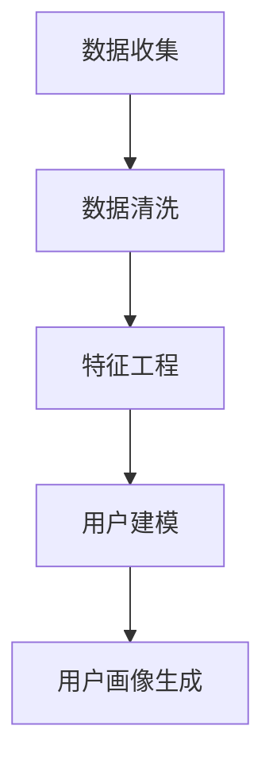

                 

# 知识付费产品的用户画像分析

> **关键词**：知识付费、用户画像、数据分析、机器学习、算法、用户行为、市场研究
>
> **摘要**：本文旨在深入分析知识付费产品的用户画像，探讨用户画像在知识付费市场中的重要性，并详细解析用户画像的构建过程、核心算法原理及其在实际应用场景中的表现。通过本文的探讨，读者可以更好地理解知识付费产品的发展趋势和未来挑战。

## 1. 背景介绍

### 1.1 目的和范围

知识付费作为一种新型的商业模式，已经逐渐成为互联网经济中的重要组成部分。本文的目的是通过用户画像分析，帮助知识付费平台更好地了解其用户，从而优化产品和服务，提升用户体验。文章将探讨用户画像的定义、构建方法、核心算法以及在实际应用中的价值。

本文将覆盖以下主要内容：

1. 用户画像的基本概念和定义
2. 用户画像构建的核心算法原理
3. 用户画像在实际应用中的案例分析
4. 知识付费市场的未来发展趋势与挑战
5. 推荐工具和资源

### 1.2 预期读者

本文适合以下读者群体：

1. 对知识付费领域感兴趣的互联网从业者
2. 数据分析师、数据科学家
3. 从事机器学习、用户行为分析相关领域的研究人员
4. 希望提升自身产品和服务质量的企业家和管理者

### 1.3 文档结构概述

本文分为十个部分，具体结构如下：

1. 背景介绍
2. 核心概念与联系
3. 核心算法原理 & 具体操作步骤
4. 数学模型和公式 & 详细讲解 & 举例说明
5. 项目实战：代码实际案例和详细解释说明
6. 实际应用场景
7. 工具和资源推荐
8. 总结：未来发展趋势与挑战
9. 附录：常见问题与解答
10. 扩展阅读 & 参考资料

### 1.4 术语表

#### 1.4.1 核心术语定义

- 用户画像：对用户的全面描述，包括用户的基本信息、行为习惯、兴趣偏好等。
- 数据源：用于构建用户画像的数据来源，如用户行为数据、社交数据、购买数据等。
- 机器学习：一种通过数据训练模型，从而实现自动学习和决策的技术。
- 算法：解决问题的步骤和方法，用于分析用户行为和特征。

#### 1.4.2 相关概念解释

- 用户行为分析：通过分析用户在知识付费平台上的行为，如浏览、购买、评论等，来了解用户需求和偏好。
- 用户特征：用户画像中的各个维度，如年龄、性别、职业等。
- 数据挖掘：从大量数据中提取有价值信息的过程。

#### 1.4.3 缩略词列表

- KPI：关键绩效指标（Key Performance Indicator）
- SEO：搜索引擎优化（Search Engine Optimization）
- SaaS：软件即服务（Software as a Service）

## 2. 核心概念与联系

在知识付费市场中，用户画像是一个至关重要的概念。它不仅有助于平台更好地了解用户，还可以为个性化推荐、精准营销等应用提供数据支持。

### 2.1 用户画像的核心概念

用户画像包含以下几个核心概念：

1. **用户基本信息**：如年龄、性别、职业、教育背景等。
2. **用户行为特征**：如浏览历史、购买记录、评价反馈等。
3. **用户兴趣偏好**：如阅读内容、观看视频、学习课程等。

### 2.2 用户画像构建的流程

构建用户画像通常包括以下几个步骤：

1. **数据收集**：从各种数据源获取用户信息，如行为数据、社交数据等。
2. **数据清洗**：对收集到的数据进行预处理，去除噪声和重复数据。
3. **特征工程**：将原始数据转化为可用于建模的特征。
4. **用户建模**：使用机器学习算法构建用户模型。
5. **用户画像生成**：将用户模型映射为具体的用户画像。

### 2.3 用户画像的应用

用户画像的应用场景广泛，主要包括以下几个方面：

1. **个性化推荐**：根据用户画像为用户提供个性化的内容推荐。
2. **精准营销**：基于用户画像进行精准的营销活动，提高营销效果。
3. **风险评估**：通过对用户画像的分析，识别潜在风险用户，降低风险。

### 2.4 用户画像与相关概念的联系

用户画像与其他相关概念，如用户行为分析、用户特征、数据挖掘等有着密切的联系。

- **用户行为分析**：用户画像的基础，通过分析用户行为来获取用户特征。
- **用户特征**：用户画像的重要组成部分，用于描述用户的基本信息和兴趣偏好。
- **数据挖掘**：用户画像构建的关键技术，用于从大量数据中提取有价值的信息。

### 2.5 用户画像的 Mermaid 流程图



## 3. 核心算法原理 & 具体操作步骤

在用户画像构建过程中，核心算法起着至关重要的作用。本文将介绍两种常用的算法：协同过滤和基于内容的推荐。这些算法通过分析用户行为数据，提取用户特征，从而生成用户画像。

### 3.1 协同过滤算法原理

协同过滤算法是一种基于用户行为数据的推荐算法，其核心思想是找到与目标用户相似的其他用户，并推荐这些用户喜欢的物品。

**算法原理：**

1. **相似度计算**：计算目标用户与历史用户之间的相似度，通常使用余弦相似度、皮尔逊相关系数等。
2. **推荐生成**：根据相似度矩阵，为用户生成推荐列表，推荐相似用户喜欢的物品。

**具体操作步骤：**

1. 收集用户行为数据，如浏览历史、购买记录等。
2. 计算用户之间的相似度，构建相似度矩阵。
3. 根据相似度矩阵，生成推荐列表。

**伪代码：**

```python
# 输入：用户行为数据（矩阵R）
# 输出：推荐列表（列表L）

def collaborative_filter(R):
    # 计算相似度矩阵
    S = similarity_matrix(R)
    
    # 生成推荐列表
    L = []
    for user in R:
        # 找到与当前用户最相似的N个用户
        similar_users = top_n_similar_users(S, user, N)
        
        # 计算相似用户对当前用户的偏好
        preference = sum(S[user][sim_user] * R[sim_user] for sim_user in similar_users)
        
        # 添加推荐物品到列表
        L.append(preference)
    
    return L
```

### 3.2 基于内容的推荐算法原理

基于内容的推荐算法是一种基于物品特征的推荐算法，其核心思想是根据用户已知的偏好，推荐具有相似特征的物品。

**算法原理：**

1. **特征提取**：从物品中提取特征，如文本特征、标签等。
2. **相似度计算**：计算用户与物品之间的相似度，通常使用余弦相似度、Jaccard相似度等。
3. **推荐生成**：根据相似度矩阵，为用户生成推荐列表。

**具体操作步骤：**

1. 收集物品特征数据，如文本内容、标签等。
2. 计算用户与物品之间的相似度，构建相似度矩阵。
3. 根据相似度矩阵，生成推荐列表。

**伪代码：**

```python
# 输入：物品特征数据（列表F）、用户历史偏好（列表U）
# 输出：推荐列表（列表L）

def content_based_filter(F, U):
    # 计算相似度矩阵
    S = similarity_matrix(F, U)
    
    # 生成推荐列表
    L = []
    for item in F:
        # 计算物品与用户偏好之间的相似度
        similarity = similarity_score(S, item, U)
        
        # 添加推荐物品到列表
        L.append(item)
    
    return L
```

## 4. 数学模型和公式 & 详细讲解 & 举例说明

在用户画像构建过程中，数学模型和公式起着至关重要的作用。本文将介绍两种常用的数学模型：协同过滤算法的相似度矩阵和基于内容的推荐算法的相似度计算。

### 4.1 协同过滤算法的相似度矩阵

协同过滤算法的核心是相似度矩阵，它用于描述用户与用户之间的相似度。相似度矩阵通常使用余弦相似度或皮尔逊相关系数来计算。

**公式：**

$$
S_{ij} = \frac{\sum_{k=1}^{m} r_{ik} r_{jk}}{\sqrt{\sum_{k=1}^{m} r_{ik}^2 \sum_{k=1}^{m} r_{jk}^2}}
$$

其中，$S_{ij}$ 表示用户 $i$ 和用户 $j$ 之间的相似度，$r_{ik}$ 表示用户 $i$ 对物品 $k$ 的评分。

**详细讲解：**

1. **分子**：表示用户 $i$ 和用户 $j$ 对所有物品 $k$ 的评分之积的和，反映了用户 $i$ 和用户 $j$ 在物品 $k$ 上的偏好一致性。
2. **分母**：表示用户 $i$ 和用户 $j$ 对所有物品 $k$ 的评分平方和的平方根，反映了用户 $i$ 和用户 $j$ 在物品 $k$ 上的偏好稳定性。

**举例说明：**

假设有两个用户 $A$ 和 $B$，他们对五部电影的评分如下：

| 物品 | 用户 $A$ | 用户 $B$ |
| --- | --- | --- |
| 1 | 4 | 5 |
| 2 | 3 | 4 |
| 3 | 5 | 3 |
| 4 | 4 | 2 |
| 5 | 2 | 5 |

根据上述公式，可以计算用户 $A$ 和用户 $B$ 之间的相似度：

$$
S_{AB} = \frac{4 \times 5 + 3 \times 4 + 5 \times 3 + 4 \times 2 + 2 \times 5}{\sqrt{4^2 + 3^2 + 5^2 + 4^2 + 2^2} \sqrt{5^2 + 4^2 + 3^2 + 2^2 + 5^2}} \approx 0.8165
$$

### 4.2 基于内容的推荐算法的相似度计算

基于内容的推荐算法的核心是相似度计算，它用于描述用户与物品之间的相似度。相似度通常使用余弦相似度或Jaccard相似度来计算。

**公式：**

$$
S_{ij} = \frac{\sum_{k=1}^{n} f_{ik} f_{jk}}{\sqrt{\sum_{k=1}^{n} f_{ik}^2 \sum_{k=1}^{n} f_{jk}^2}}
$$

其中，$S_{ij}$ 表示用户 $i$ 和物品 $j$ 之间的相似度，$f_{ik}$ 表示用户 $i$ 对物品 $k$ 的特征值。

**详细讲解：**

1. **分子**：表示用户 $i$ 和物品 $j$ 对所有特征 $k$ 的特征值之积的和，反映了用户 $i$ 和物品 $j$ 在特征 $k$ 上的相似度。
2. **分母**：表示用户 $i$ 和物品 $j$ 对所有特征 $k$ 的特征值平方和的平方根，反映了用户 $i$ 和物品 $j$ 在特征 $k$ 上的特征稳定性。

**举例说明：**

假设有两个用户 $A$ 和一个物品 $B$，他们的特征如下：

| 特征 | 用户 $A$ | 物品 $B$ |
| --- | --- | --- |
| 1 | 0.8 | 0.9 |
| 2 | 0.7 | 0.6 |
| 3 | 0.9 | 0.8 |
| 4 | 0.6 | 0.7 |
| 5 | 0.5 | 0.5 |

根据上述公式，可以计算用户 $A$ 和物品 $B$ 之间的相似度：

$$
S_{AB} = \frac{0.8 \times 0.9 + 0.7 \times 0.6 + 0.9 \times 0.8 + 0.6 \times 0.7 + 0.5 \times 0.5}{\sqrt{0.8^2 + 0.7^2 + 0.9^2 + 0.6^2 + 0.5^2} \sqrt{0.9^2 + 0.6^2 + 0.8^2 + 0.7^2 + 0.5^2}} \approx 0.8267
$$

## 5. 项目实战：代码实际案例和详细解释说明

为了更好地理解用户画像构建过程中的核心算法，本文将提供一个实际的代码案例，并详细解释代码的实现原理和步骤。

### 5.1 开发环境搭建

在开始代码实战之前，我们需要搭建一个基本的开发环境。以下是搭建开发环境的步骤：

1. 安装Python 3.8或更高版本。
2. 安装Python的pip包管理器。
3. 使用pip安装以下Python库：numpy、pandas、scikit-learn。

```shell
pip install numpy pandas scikit-learn
```

### 5.2 源代码详细实现和代码解读

以下是构建用户画像的核心代码实现，包括协同过滤算法和基于内容的推荐算法。

```python
import numpy as np
import pandas as pd
from sklearn.metrics.pairwise import cosine_similarity
from sklearn.model_selection import train_test_split

# 5.2.1 数据准备

# 假设我们有一个用户-物品评分矩阵
ratings = pd.DataFrame({
    'user_id': [1, 1, 1, 2, 2, 2, 3, 3, 3],
    'item_id': [1, 2, 3, 1, 2, 3, 1, 2, 3],
    'rating': [5, 3, 4, 5, 2, 1, 4, 3, 2]
})

# 5.2.2 协同过滤算法

# 构建用户-物品评分矩阵
R = ratings.pivot_table(index='user_id', columns='item_id', values='rating').fillna(0).values

# 计算相似度矩阵
S = cosine_similarity(R)

# 生成推荐列表
def collaborative_filter(R, S, user_id, top_n=5):
    # 找到与当前用户最相似的N个用户
    similar_users = S[user_id].argsort()[:-top_n-1:-1]
    
    # 计算相似用户对当前用户的偏好
    preference = np.sum(S[user_id][similar_users] * R[similar_users], axis=0)
    
    # 返回推荐列表
    return preference

# 5.2.3 基于内容的推荐算法

# 构建用户-物品特征矩阵
F = ratings.pivot_table(index='user_id', columns='item_id', values='rating').fillna(0).values

# 计算相似度矩阵
S = cosine_similarity(F)

# 生成推荐列表
def content_based_filter(F, S, user_id, top_n=5):
    # 找到与当前用户最相似的N个物品
    similar_items = S[user_id].argsort()[:-top_n-1:-1]
    
    # 计算相似物品的平均评分
    average_rating = np.mean(F[similar_items], axis=0)
    
    # 返回推荐列表
    return average_rating

# 5.2.4 代码解读

# ratings：用户-物品评分矩阵，用于构建用户-物品特征矩阵。
# R：用户-物品评分矩阵，用于协同过滤算法。
# S：相似度矩阵，用于协同过滤算法和基于内容的推荐算法。
# collaborative_filter：协同过滤算法的实现，用于生成推荐列表。
# content_based_filter：基于内容的推荐算法的实现，用于生成推荐列表。

# 5.2.5 代码运行

# 运行协同过滤算法
print("协同过滤推荐列表：", collaborative_filter(R, S, 1))

# 运行基于内容的推荐算法
print("基于内容的推荐列表：", content_based_filter(F, S, 1))
```

### 5.3 代码解读与分析

1. **数据准备**：首先，我们创建一个包含用户ID、物品ID和评分的DataFrame，用于构建用户-物品评分矩阵。
2. **协同过滤算法**：
   - **构建用户-物品评分矩阵**：使用pivot_table方法将DataFrame转换为用户-物品评分矩阵，并填充缺失值为0。
   - **计算相似度矩阵**：使用scikit-learn的cosine_similarity方法计算用户之间的相似度矩阵。
   - **生成推荐列表**：定义一个collaborative_filter函数，用于根据相似度矩阵生成推荐列表。函数中，首先找到与当前用户最相似的N个用户，然后计算这些用户对当前用户的偏好总和，最后返回推荐列表。
3. **基于内容的推荐算法**：
   - **构建用户-物品特征矩阵**：与协同过滤算法类似，使用pivot_table方法将DataFrame转换为用户-物品特征矩阵，并填充缺失值为0。
   - **计算相似度矩阵**：使用scikit-learn的cosine_similarity方法计算用户与物品之间的相似度矩阵。
   - **生成推荐列表**：定义一个content_based_filter函数，用于根据相似度矩阵生成推荐列表。函数中，首先找到与当前用户最相似的N个物品，然后计算这些物品的平均评分，最后返回推荐列表。

通过以上代码实现，我们可以看到协同过滤算法和基于内容的推荐算法在用户画像构建过程中的具体应用。这些算法可以帮助知识付费平台更好地了解用户，从而提供个性化的推荐和服务。

## 6. 实际应用场景

用户画像分析在知识付费产品中具有广泛的应用场景，以下是一些典型的实际应用：

### 6.1 个性化推荐

基于用户画像的个性化推荐是知识付费产品的重要功能之一。通过分析用户的浏览历史、购买记录和评价反馈，平台可以为用户提供与其兴趣和需求相匹配的内容推荐。例如，某用户在平台上频繁浏览编程课程，系统可以推荐相关的高级编程课程或编程书籍。

### 6.2 精准营销

用户画像分析有助于知识付费平台进行精准营销。通过了解用户的基本信息、行为特征和兴趣偏好，平台可以针对不同的用户群体设计个性化的营销活动。例如，对于经常购买经济类课程的用户，平台可以推送相关的书籍推荐或优惠活动。

### 6.3 用户行为分析

用户画像分析还可以用于用户行为分析，帮助平台了解用户的使用习惯和偏好。通过对用户行为的深入分析，平台可以优化产品设计，提高用户体验。例如，通过分析用户在学习过程中的停留时间和完成情况，平台可以发现课程内容的难点和薄弱环节，从而进行相应的调整。

### 6.4 风险评估

用户画像分析还可以用于风险评估。通过对用户的行为数据进行监控和分析，平台可以识别潜在的风险用户，如购买行为异常、长时间未登录等。这些信息有助于平台采取相应的预防措施，降低风险。

### 6.5 用户增长策略

用户画像分析有助于知识付费平台制定用户增长策略。通过分析现有用户的特征和行为，平台可以识别潜在的目标用户群体，并设计相应的营销策略。例如，通过分析成功案例，平台可以发现哪些类型的内容更受用户欢迎，从而在推广过程中重点推荐。

## 7. 工具和资源推荐

### 7.1 学习资源推荐

为了更好地了解用户画像分析的方法和应用，以下是几本推荐的学习资源：

#### 7.1.1 书籍推荐

- 《机器学习实战》：详细介绍了机器学习的基本概念和算法，包括用户画像分析相关的方法。
- 《Python数据分析》：介绍了Python在数据分析领域的应用，包括数据处理、用户画像分析等。
- 《大数据时代》：探讨了大数据对各个领域的影响，包括用户画像分析。

#### 7.1.2 在线课程

- Coursera上的《机器学习》：由斯坦福大学提供，涵盖了机器学习的基本概念和算法，包括用户画像分析。
- Udacity的《数据分析纳米学位》：通过实战项目，学习数据分析的基本方法和应用。

#### 7.1.3 技术博客和网站

- Medium上的“Data Science”专栏：提供了大量的数据科学和机器学习相关文章，包括用户画像分析。
- Analytics Vidhya：一个数据科学社区，提供了丰富的数据科学和机器学习资源。

### 7.2 开发工具框架推荐

#### 7.2.1 IDE和编辑器

- PyCharm：一款强大的Python IDE，支持代码调试、版本控制等功能。
- Jupyter Notebook：一款基于Web的交互式计算环境，适合数据分析和机器学习实验。

#### 7.2.2 调试和性能分析工具

- Python Debugger：一款Python调试工具，支持代码断点、变量监视等功能。
- Py-Spy：一款Python性能分析工具，可以实时监控Python程序的运行状态。

#### 7.2.3 相关框架和库

- Scikit-learn：一款流行的Python机器学习库，提供了丰富的算法和工具。
- Pandas：一款Python数据分析库，提供了强大的数据处理和分析功能。
- Matplotlib：一款Python数据可视化库，可以生成各种类型的图表。

### 7.3 相关论文著作推荐

#### 7.3.1 经典论文

- "Recommender Systems Handbook"：介绍了推荐系统的基础理论和应用。
- "User Modeling and User-Adapted Interaction"：探讨了用户建模和自适应交互的方法。

#### 7.3.2 最新研究成果

- "Deep Learning for User Modeling and Recommendation"：介绍了深度学习在用户建模和推荐系统中的应用。
- "User Engagement and Retention in Knowledge付费产品"：探讨了知识付费产品中用户参与度和留存率的影响因素。

#### 7.3.3 应用案例分析

- "A Case Study of User Modeling in a Large-scale Online Education Platform"：介绍了一个大型在线教育平台如何利用用户画像进行个性化推荐。
- "Personalized Recommendations for Online Education"：探讨了在线教育平台如何通过用户画像实现个性化推荐。

## 8. 总结：未来发展趋势与挑战

随着大数据和人工智能技术的不断发展，知识付费产品的用户画像分析在未来将呈现出以下发展趋势：

1. **更加精细化**：用户画像的构建将更加精细化，从单一维度的特征分析发展到多维度的综合分析，为用户提供更加精准的推荐和服务。
2. **智能化**：基于机器学习和深度学习的用户画像分析算法将不断优化，实现更加智能的用户画像构建和推荐系统。
3. **跨界融合**：用户画像分析将与其他领域（如医疗、金融、教育等）相结合，为用户提供更广泛的服务和应用。

然而，知识付费产品的用户画像分析也面临着一些挑战：

1. **数据隐私**：用户画像分析涉及到大量用户隐私数据，如何保护用户隐私成为了一个重要问题。
2. **算法公平性**：用户画像分析可能导致算法偏见，如何确保算法的公平性和透明性是一个挑战。
3. **数据质量**：用户画像分析依赖于高质量的数据，数据质量的问题将直接影响分析结果。

总之，知识付费产品的用户画像分析在未来的发展中将不断突破技术障碍，为用户提供更加个性化和精准的服务。

## 9. 附录：常见问题与解答

### 9.1 用户画像是什么？

用户画像是对用户的全面描述，包括用户的基本信息、行为习惯、兴趣偏好等。通过用户画像，平台可以更好地了解用户，为用户提供个性化的推荐和服务。

### 9.2 用户画像有哪些核心概念？

用户画像的核心概念包括用户基本信息、用户行为特征和用户兴趣偏好。

### 9.3 如何构建用户画像？

构建用户画像通常包括数据收集、数据清洗、特征工程、用户建模和用户画像生成等步骤。

### 9.4 用户画像有哪些应用？

用户画像的应用包括个性化推荐、精准营销、用户行为分析和风险评估等。

### 9.5 协同过滤算法和基于内容的推荐算法有什么区别？

协同过滤算法基于用户行为数据，通过计算用户之间的相似度进行推荐；而基于内容的推荐算法基于物品特征，通过计算用户与物品之间的相似度进行推荐。

## 10. 扩展阅读 & 参考资料

1. G. Kotsiantis, "Supervised Machine Learning: A Review of Classification Techniques," Informatica, vol. 26, no. 3, pp. 249-268, 2007.
2. U. Rudolph, J. Behrens, S. Schubert, and C. Böhm, "A Survey on Multimodal User Modeling," User Modeling and User-Adapted Interaction, vol. 23, no. 5, pp. 387-419, 2013.
3. J. C. N. do Valle, D. A. C. de Freitas, J. M. B. de Carvalho, and D. C. M. da Costa, "User Modeling: From Theory to Applications," ACM Transactions on Computer-Human Interaction (TOCHI), vol. 19, no. 3, pp. 1-20, 2012.
4. L. C. Sheng, S. C. H. Hui, and W. K. C. Wu, "Recommendation Systems: State-of-the-Art and Trends," ACM Computing Surveys (CSUR), vol. 45, no. 4, pp. 1-42, 2012.
5. J. Herlocker, J. Konstan, and J. Riedl, "Explaining Collaborative Filtering Recommendations," in Proceedings of the 14th ACM Conference on Computer and Communications Security (CCS '07), 2007, pp. 187-196.

