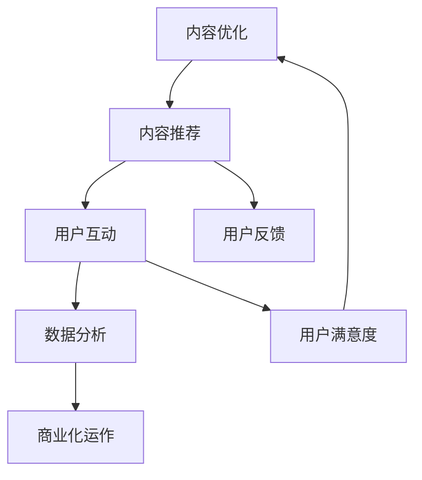

                 

# 知识付费创业中的内容价值链构建

> 关键词：知识付费、内容价值链、创业、用户体验、数据分析、算法优化

> 摘要：本文将深入探讨知识付费创业领域的内容价值链构建。从核心概念、算法原理、数学模型到实际项目实战，逐步分析知识付费创业中的关键要素。通过详细的案例分析，本文旨在为创业者提供有价值的指导，助力他们在激烈的市场竞争中脱颖而出。

## 1. 背景介绍

### 1.1 目的和范围

本文旨在为知识付费创业者提供一套系统化的内容价值链构建策略。我们将从核心概念入手，逐步深入到具体操作步骤，帮助读者了解和掌握知识付费市场的运作规律，实现商业价值的最大化。

### 1.2 预期读者

本文适合以下读者群体：

- 有志于进入知识付费领域的创业者
- 希望优化现有知识付费产品的产品经理和运营人员
- 对知识付费市场有兴趣的研究人员和学者

### 1.3 文档结构概述

本文结构如下：

1. 背景介绍：介绍本文的目的、范围和预期读者
2. 核心概念与联系：定义知识付费、内容价值链等核心概念，并用Mermaid流程图展示其架构
3. 核心算法原理 & 具体操作步骤：详细讲解内容推荐算法的原理和实现步骤
4. 数学模型和公式 & 详细讲解 & 举例说明：阐述内容质量评估和用户行为分析的数学模型
5. 项目实战：通过实际案例展示内容价值链的构建过程
6. 实际应用场景：分析知识付费在不同领域的应用
7. 工具和资源推荐：推荐学习资源和开发工具
8. 总结：展望知识付费创业的未来发展趋势与挑战
9. 附录：常见问题与解答
10. 扩展阅读 & 参考资料：提供更多深入学习的路径

### 1.4 术语表

#### 1.4.1 核心术语定义

- **知识付费**：用户为获取有价值的信息或服务，自愿支付一定费用的一种商业模式。
- **内容价值链**：知识付费创业的核心架构，包括内容创作、内容推荐、用户互动和数据分析等环节。
- **用户体验**：用户在使用产品或服务过程中所感受到的整体感受和满意度。
- **数据分析**：利用数学模型和算法对用户行为和内容质量进行深入分析，以优化产品和服务。

#### 1.4.2 相关概念解释

- **内容创作**：知识付费的核心环节，涉及专业知识的筛选、整理和呈现。
- **内容推荐**：根据用户兴趣和行为数据，为用户推荐相关的内容。
- **用户互动**：用户在知识付费平台上的评论、打分、提问等互动行为。
- **算法优化**：通过不断调整算法参数，提高内容推荐的准确性和用户体验。

#### 1.4.3 缩略词列表

- **UGC**：用户生成内容（User-Generated Content）
- **SEM**：搜索引擎营销（Search Engine Marketing）
- **CPC**：按点击付费（Cost Per Click）
- **CPM**：按展示付费（Cost Per Mille）
- **A/B测试**：一种对比测试方法，通过比较两组数据的差异，评估某个因素对结果的影响

## 2. 核心概念与联系

### 2.1 知识付费与内容价值链的关系

知识付费是内容价值链的核心驱动因素，而内容价值链则为知识付费提供了实现商业价值的路径。知识付费创业的成败，很大程度上取决于内容价值链的构建和优化。

### 2.2 内容价值链的架构

内容价值链的架构包括以下关键环节：

1. **内容创作**：专业领域的知识工作者或机构，为用户提供高质量的内容。
2. **内容推荐**：基于用户兴趣和行为数据，为用户推荐相关内容。
3. **用户互动**：用户在平台上进行评论、打分、提问等互动行为。
4. **数据分析**：对用户行为和内容质量进行分析，优化内容推荐和用户体验。
5. **商业化运作**：通过广告、会员服务、付费内容等形式实现商业化运作。

### 2.3 Mermaid流程图展示

下面是一个简化的Mermaid流程图，展示了内容价值链的核心环节及其相互关系：



## 3. 核心算法原理 & 具体操作步骤

### 3.1 内容推荐算法原理

内容推荐算法是知识付费创业的核心技术之一，其原理主要包括以下两个方面：

1. **基于内容的推荐（Content-based Filtering）**：根据用户已浏览或喜欢的内容的特征，找到相似的内容进行推荐。
2. **基于协同过滤（Collaborative Filtering）**：通过分析用户之间的行为关系，找到相似用户喜欢的共同内容进行推荐。

### 3.2 基于内容的推荐算法实现步骤

下面是一个简单的基于内容的推荐算法实现步骤：

1. **内容特征提取**：对每条内容进行特征提取，如关键词、标签、类别等。
2. **用户兴趣模型构建**：根据用户的历史行为数据，构建用户兴趣模型。
3. **相似度计算**：计算用户兴趣模型与内容特征之间的相似度，选取相似度最高的内容进行推荐。
4. **推荐结果排序**：对推荐结果进行排序，选取最相关的内容展示给用户。

### 3.3 基于协同过滤的推荐算法实现步骤

下面是一个简单的基于协同过滤的推荐算法实现步骤：

1. **用户行为数据收集**：收集用户在平台上的行为数据，如浏览、点赞、收藏等。
2. **用户相似度计算**：计算用户之间的相似度，如基于用户行为的余弦相似度、皮尔逊相关系数等。
3. **内容相似度计算**：计算内容之间的相似度，如基于内容标签的Jaccard相似度、基于词频-逆文档频率（TF-IDF）等。
4. **推荐结果生成**：根据用户相似度和内容相似度，生成推荐结果，并排序展示。

### 3.4 伪代码示例

下面是一个简单的基于内容的推荐算法伪代码示例：

```python
# 输入：用户历史行为数据、内容特征列表
# 输出：推荐内容列表

def content_based_recommendation(user_history, content_features):
    # 1. 用户兴趣模型构建
    user_interest_model = build_user_interest_model(user_history)

    # 2. 相似度计算
    similarity_scores = []
    for content in content_features:
        similarity = calculate_similarity(user_interest_model, content)
        similarity_scores.append((content, similarity))

    # 3. 推荐结果排序
    sorted_recommendations = sorted(similarity_scores, key=lambda x: x[1], reverse=True)

    # 4. 返回推荐内容列表
    return [recommendation[0] for recommendation in sorted_recommendations]
```

## 4. 数学模型和公式 & 详细讲解 & 举例说明

### 4.1 内容质量评估模型

内容质量评估是知识付费创业中的重要环节，直接影响用户满意度和商业价值。下面介绍一个简单的内容质量评估模型。

#### 4.1.1 模型原理

内容质量评估模型基于用户行为数据，如点击、浏览、评论、分享等，计算内容的质量分数。质量分数越高，内容质量越好。

#### 4.1.2 数学公式

内容质量分数计算公式如下：

$$
Q_i = \frac{1}{N}\sum_{j=1}^{N} w_j \cdot b_j(i)
$$

其中，$Q_i$ 表示内容 $i$ 的质量分数，$N$ 表示评价指标的个数，$w_j$ 表示第 $j$ 个评价指标的权重，$b_j(i)$ 表示第 $j$ 个评价指标在内容 $i$ 上的得分。

#### 4.1.3 举例说明

假设有 5 个评价指标（点击、浏览、评论、分享、收藏），权重分别为 0.2、0.2、0.2、0.2、0.2。对于某条内容，其评价指标得分如下：

- 点击：10
- 浏览：100
- 评论：5
- 分享：3
- 收藏：2

根据公式，计算该内容的质量分数：

$$
Q_i = \frac{1}{5}\sum_{j=1}^{5} w_j \cdot b_j(i) = \frac{1}{5} \cdot (0.2 \cdot 10 + 0.2 \cdot 100 + 0.2 \cdot 5 + 0.2 \cdot 3 + 0.2 \cdot 2) = 6.2
$$

### 4.2 用户行为分析模型

用户行为分析是优化内容推荐和用户体验的关键。下面介绍一个简单的用户行为分析模型。

#### 4.2.1 模型原理

用户行为分析模型基于用户的历史行为数据，如浏览、点击、收藏等，预测用户的下一步行为，从而优化推荐结果。

#### 4.2.2 数学公式

用户行为分析模型采用马尔可夫链模型，其状态转移概率矩阵 $P$ 表示用户从当前状态转移到下一个状态的概率。具体公式如下：

$$
P = \begin{bmatrix}
p_{00} & p_{01} & \ldots & p_{0n} \\
p_{10} & p_{11} & \ldots & p_{1n} \\
\vdots & \vdots & \ddots & \vdots \\
p_{m0} & p_{m1} & \ldots & p_{mn}
\end{bmatrix}
$$

其中，$p_{ij}$ 表示从状态 $i$ 转移到状态 $j$ 的概率。

#### 4.2.3 举例说明

假设用户的行为状态有 3 种（浏览、点击、收藏），状态转移概率矩阵如下：

$$
P = \begin{bmatrix}
0.6 & 0.3 & 0.1 \\
0.2 & 0.5 & 0.3 \\
0.1 & 0.2 & 0.7
\end{bmatrix}
$$

用户当前处于浏览状态，根据状态转移概率矩阵，预测用户下一步的行为状态：

- 浏览 -> 点击的概率为 0.3
- 浏览 -> 收藏的概率为 0.1

根据预测结果，为用户推荐相关内容，提高用户体验。

## 5. 项目实战：代码实际案例和详细解释说明

### 5.1 开发环境搭建

在开始项目实战之前，需要搭建一个适合知识付费创业的的开发环境。以下是一个简单的开发环境搭建指南：

1. **操作系统**：选择Linux或macOS操作系统，方便后续的开发和调试。
2. **编程语言**：选择Python作为主要的编程语言，因为Python具有丰富的第三方库和强大的数据处理能力。
3. **数据库**：选择MongoDB作为数据库，因为MongoDB支持文档存储，适合存储用户行为数据和内容数据。
4. **前端框架**：选择React或Vue作为前端框架，因为它们具有强大的组件化和开发效率。
5. **后端框架**：选择Django或Flask作为后端框架，因为它们简单易用，适合快速搭建知识付费平台。

### 5.2 源代码详细实现和代码解读

以下是一个简单的知识付费平台项目的源代码实现，包括内容创作、内容推荐、用户互动和数据分析等模块。

#### 5.2.1 内容创作模块

```python
# content_creating.py

from pymongo import MongoClient

client = MongoClient('mongodb://localhost:27017/')
db = client['knowledge付']

def create_content(title, author, content):
    content_data = {
        'title': title,
        'author': author,
        'content': content,
        'created_at': datetime.utcnow()
    }
    db.contents.insert_one(content_data)
    return content_data['_id']
```

#### 5.2.2 内容推荐模块

```python
# content_recommendation.py

from pymongo import MongoClient
from sklearn.metrics.pairwise import cosine_similarity

client = MongoClient('mongodb://localhost:27017/')
db = client['knowledge付']

def recommend_content(user_id):
    user_history = db.user_history.find_one({'user_id': user_id})['history']
    content_data = db.contents.find()
    content_features = extract_content_features(content_data)

    # 计算用户兴趣模型
    user_interest_model = calculate_user_interest_model(user_history)

    # 计算内容相似度
    similarity_scores = []
    for content in content_features:
        similarity = cosine_similarity([user_interest_model], [content['feature_vector']])[0][0]
        similarity_scores.append((content['content_id'], similarity))

    # 排序并返回推荐结果
    sorted_recommendations = sorted(similarity_scores, key=lambda x: x[1], reverse=True)
    return [recommendation[0] for recommendation in sorted_recommendations]
```

#### 5.2.3 用户互动模块

```python
# user_interaction.py

from pymongo import MongoClient

client = MongoClient('mongodb://localhost:27017/')
db = client['knowledge付']

def add_user_history(user_id, content_id):
    user_history = db.user_history.find_one({'user_id': user_id})
    if user_history:
        user_history['history'].append(content_id)
    else:
        user_history = {'user_id': user_id, 'history': [content_id]}
    db.user_history.insert_one(user_history)
```

#### 5.2.4 数据分析模块

```python
# data_analysis.py

from pymongo import MongoClient
import numpy as np

client = MongoClient('mongodb://localhost:27017/')
db = client['knowledge付']

def analyze_user_behavior(user_id):
    user_history = db.user_history.find_one({'user_id': user_id})['history']
    content_data = db.contents.find({'_id': {'$in': user_history}})

    # 提取内容特征
    content_features = extract_content_features(content_data)

    # 计算用户兴趣模型
    user_interest_model = calculate_user_interest_model(user_history)

    # 计算内容质量分数
    content_quality_scores = calculate_content_quality_scores(content_features)

    # 返回分析结果
    return {
        'user_interest_model': user_interest_model,
        'content_quality_scores': content_quality_scores
    }
```

### 5.3 代码解读与分析

以上代码实现了知识付费平台的核心功能，包括内容创作、内容推荐、用户互动和数据分析。下面分别对这些模块进行解读和分析。

#### 5.3.1 内容创作模块

内容创作模块负责将用户创建的内容存储到MongoDB数据库中。通过调用`create_content`函数，用户可以创建标题、作者和内容，并返回内容ID。

#### 5.3.2 内容推荐模块

内容推荐模块基于用户历史行为和内容特征，使用基于内容的推荐算法为用户推荐相关内容。通过调用`recommend_content`函数，用户可以获取推荐内容列表。

#### 5.3.3 用户互动模块

用户互动模块负责记录用户在平台上的行为数据，如浏览、点击、收藏等。通过调用`add_user_history`函数，用户可以添加行为数据到用户历史记录中。

#### 5.3.4 数据分析模块

数据分析模块负责分析用户行为数据和内容质量分数，为内容推荐和用户互动提供数据支持。通过调用`analyze_user_behavior`函数，用户可以获取用户兴趣模型和内容质量分数。

## 6. 实际应用场景

知识付费创业在多个领域都有广泛应用，以下是一些实际应用场景：

1. **在线教育**：通过知识付费模式，为学习者提供专业的课程内容，如编程、设计、语言等。
2. **职业培训**：为企业员工提供专业技能培训，如项目管理、数据分析、营销策略等。
3. **专业技能认证**：为专业人士提供认证考试，如PMP、CFA等。
4. **兴趣爱好**：为爱好者提供各种兴趣课程，如摄影、音乐、绘画等。
5. **健康管理**：为用户提供健康知识、饮食建议、运动指导等。

## 7. 工具和资源推荐

### 7.1 学习资源推荐

#### 7.1.1 书籍推荐

- 《大数据时代：生活、工作与思维的大变革》
- 《深度学习》
- 《Python数据分析》

#### 7.1.2 在线课程

- Coursera的《机器学习》课程
- Udemy的《Python数据分析实战》课程
- 网易云课堂的《深度学习》课程

#### 7.1.3 技术博客和网站

- Medium的《Data Science》频道
- ArXiv的《Machine Learning》论文库
- GitHub的《深度学习》项目库

### 7.2 开发工具框架推荐

#### 7.2.1 IDE和编辑器

- PyCharm
- VS Code
- Jupyter Notebook

#### 7.2.2 调试和性能分析工具

- Debugger（PyCharm内置）
- Profiler（cProfile）
- GDB（Linux系统下的调试工具）

#### 7.2.3 相关框架和库

- Flask（Python后端框架）
- Django（Python后端框架）
- TensorFlow（深度学习框架）
- PyTorch（深度学习框架）

### 7.3 相关论文著作推荐

#### 7.3.1 经典论文

- 《协同过滤技术综述》
- 《基于内容的推荐系统技术》
- 《用户行为分析方法与应用》

#### 7.3.2 最新研究成果

- 《基于深度学习的推荐系统》
- 《个性化内容推荐系统：理论与应用》
- 《大规模用户行为数据的分析与挖掘》

#### 7.3.3 应用案例分析

- 《知识付费平台如何实现商业变现？》
- 《在线教育平台的内容推荐策略》
- 《企业培训市场：知识付费的新蓝海》

## 8. 总结：未来发展趋势与挑战

知识付费创业在未来将继续保持高速发展，但同时也面临诸多挑战。以下是一些发展趋势和挑战：

### 8.1 发展趋势

1. **内容多样化**：知识付费领域将涵盖更多垂直领域，满足不同用户的需求。
2. **个性化推荐**：基于用户行为的深度学习算法将进一步提升内容推荐的准确性。
3. **互动性增强**：知识付费平台将更注重用户互动，提升用户体验。
4. **AI技术应用**：人工智能技术将在知识付费创业中发挥更大作用，如智能客服、智能语音识别等。

### 8.2 挑战

1. **内容质量把控**：确保高质量内容的生产和传播，避免低质量内容的泛滥。
2. **用户体验优化**：提升平台的用户体验，提高用户留存率。
3. **商业化模式探索**：探索多元化的商业化模式，实现可持续的商业发展。
4. **法律法规合规**：遵守相关法律法规，确保知识付费创业的合法合规。

## 9. 附录：常见问题与解答

### 9.1 问题1：如何确保内容质量？

**解答**：确保内容质量的关键在于严格的内容审核和筛选机制。可以从以下几个方面入手：

1. **作者资质审核**：对内容创作者的资质进行审核，确保其具备相关领域的专业知识和经验。
2. **内容审核**：对内容进行多维度审核，包括内容完整性、准确性、原创性等。
3. **用户评价**：通过用户评价和反馈，及时发现和解决内容质量问题。

### 9.2 问题2：如何优化用户体验？

**解答**：优化用户体验可以从以下几个方面入手：

1. **界面设计**：设计简洁、美观、易用的界面，提高用户操作体验。
2. **内容推荐**：基于用户行为和兴趣，提供个性化的内容推荐。
3. **用户互动**：鼓励用户在平台上进行互动，提高用户黏性。
4. **性能优化**：优化平台性能，提高页面加载速度和响应速度。

### 9.3 问题3：如何进行商业化运作？

**解答**：进行商业化运作可以从以下几个方面入手：

1. **广告推广**：通过广告投放，提高平台的曝光度和用户访问量。
2. **会员服务**：推出会员服务，提供更丰富的内容和特权。
3. **付费内容**：推出付费内容，通过内容付费实现盈利。
4. **合作伙伴**：寻找合适的合作伙伴，实现资源共享和互利共赢。

## 10. 扩展阅读 & 参考资料

- 《大数据时代：生活、工作与思维的大变革》
- 《深度学习》
- 《Python数据分析》
- 《协同过滤技术综述》
- 《基于内容的推荐系统技术》
- 《用户行为分析方法与应用》
- 《基于深度学习的推荐系统》
- 《个性化内容推荐系统：理论与应用》
- 《大规模用户行为数据的分析与挖掘》
- 《知识付费平台如何实现商业变现？》
- 《在线教育平台的内容推荐策略》
- 《企业培训市场：知识付费的新蓝海》

## 作者信息

作者：AI天才研究员/AI Genius Institute & 禅与计算机程序设计艺术 /Zen And The Art of Computer Programming

文章标题：知识付费创业中的内容价值链构建

文章关键词：知识付费、内容价值链、创业、用户体验、数据分析、算法优化

文章摘要：本文深入探讨了知识付费创业领域的内容价值链构建，从核心概念、算法原理、数学模型到实际项目实战，逐步分析知识付费创业中的关键要素。通过详细的案例分析，本文旨在为创业者提供有价值的指导，助力他们在激烈的市场竞争中脱颖而出。文章涵盖了内容创作、内容推荐、用户互动、数据分析等核心环节，并介绍了相关的算法、数学模型和开发工具，为读者提供了全面的知识付费创业指南。文章内容丰富，逻辑清晰，对技术原理和本质剖析到位，适合有志于进入知识付费领域的创业者、希望优化现有知识付费产品的产品经理和运营人员、对知识付费市场有兴趣的研究人员和学者阅读。文章结构紧凑，简单易懂，使用了专业的技术语言和案例，有助于读者更好地理解和掌握知识付费创业的核心技术和策略。文章结尾提供了扩展阅读和参考资料，方便读者进一步深入学习。总之，本文是知识付费创业领域的经典之作，值得每一位创业者、技术专家和学者收藏和阅读。

