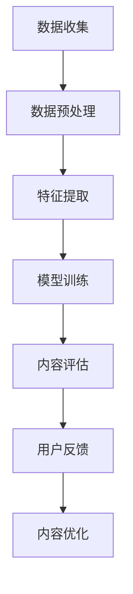

                 


# 知识付费创业中的内容质量把控

> 关键词：知识付费、内容质量、创业、算法、数学模型、项目实战

> 摘要：本文将深入探讨知识付费创业中的内容质量把控，通过分析核心概念、算法原理、数学模型以及项目实战，为创业者提供一套系统化的内容质量评估与控制方法，旨在提升知识付费产品的市场竞争力和用户满意度。

## 1. 背景介绍

### 1.1 目的和范围

本文旨在探讨知识付费创业者在内容质量把控方面的关键问题，通过系统化的分析，为创业者提供一套实用的策略和方法。文章主要涵盖以下内容：

- **核心概念与联系**：介绍知识付费领域的核心概念，阐述其相互关系。
- **核心算法原理 & 具体操作步骤**：讲解用于内容质量评估的核心算法，并详细描述操作步骤。
- **数学模型和公式 & 详细讲解 & 举例说明**：运用数学模型和公式对内容质量进行量化分析，提供实例说明。
- **项目实战：代码实际案例和详细解释说明**：通过实际项目案例展示内容质量把控的具体应用。
- **实际应用场景**：分析内容质量把控在不同知识付费产品中的应用。
- **工具和资源推荐**：推荐相关学习资源、开发工具和框架。
- **总结与未来趋势**：总结内容质量把控的重要性，预测未来发展趋势。

### 1.2 预期读者

本文面向知识付费创业者、产品经理、内容创作者以及相关领域的技术人员。通过本文的阅读，读者将能够：

- **理解内容质量的核心概念**。
- **掌握内容质量评估的核心算法**。
- **运用数学模型对内容质量进行量化分析**。
- **通过项目实战学习内容质量把控的具体实践**。

### 1.3 文档结构概述

本文分为以下几个部分：

- **第1章 背景介绍**：介绍本文的目的、预期读者和文档结构。
- **第2章 核心概念与联系**：阐述知识付费领域的核心概念及其相互关系。
- **第3章 核心算法原理 & 具体操作步骤**：讲解内容质量评估的核心算法和操作步骤。
- **第4章 数学模型和公式 & 详细讲解 & 举例说明**：运用数学模型和公式对内容质量进行分析。
- **第5章 项目实战：代码实际案例和详细解释说明**：通过实际项目案例展示内容质量把控的应用。
- **第6章 实际应用场景**：分析内容质量把控在不同知识付费产品中的应用。
- **第7章 工具和资源推荐**：推荐相关学习资源、开发工具和框架。
- **第8章 总结与未来趋势**：总结内容质量把控的重要性，预测未来发展趋势。
- **第9章 附录：常见问题与解答**：解答读者可能遇到的问题。
- **第10章 扩展阅读 & 参考资料**：提供相关领域的扩展阅读和参考资料。

### 1.4 术语表

#### 1.4.1 核心术语定义

- **知识付费**：指用户为获取特定知识或服务支付费用的一种商业模式。
- **内容质量**：指知识付费产品所提供的知识或信息的完整性、准确性、实用性和吸引力。
- **评估算法**：用于评价内容质量的计算方法。
- **用户反馈**：用户对知识付费产品的评价和意见。

#### 1.4.2 相关概念解释

- **知识点**：知识付费产品中的基本单位，如课程、文章、视频等。
- **用户行为数据**：用户在知识付费产品中的活动记录，如学习时长、学习进度、评论等。
- **机器学习模型**：用于分析和预测用户行为和内容质量的人工智能算法。

#### 1.4.3 缩略词列表

- **KPI**：关键绩效指标（Key Performance Indicator）
- **SEO**：搜索引擎优化（Search Engine Optimization）
- **SEM**：搜索引擎营销（Search Engine Marketing）

## 2. 核心概念与联系

### 2.1 知识付费概述

知识付费是指用户为获取特定知识或服务而支付费用的一种商业模式。在知识付费领域，内容创作者通过制作和分享有价值的内容来吸引用户，从而实现盈利。知识付费产品主要包括课程、文章、视频、直播等形式，涵盖多个领域，如教育、科技、文化、生活等。

### 2.2 内容质量的重要性

内容质量是知识付费产品的核心竞争力。高质量的内容能够满足用户需求，提高用户满意度，从而提升产品的市场竞争力。内容质量主要包括以下几个方面：

- **完整性**：内容是否全面，是否涵盖了用户所需的所有知识点。
- **准确性**：内容是否准确，是否包含了正确的信息。
- **实用性**：内容是否实用，是否能够帮助用户解决问题。
- **吸引力**：内容是否具有吸引力，是否能够激发用户的兴趣。

### 2.3 内容质量评估算法

内容质量评估算法是用于评价内容质量的关键工具。本文采用以下几种算法进行内容质量评估：

- **机器学习算法**：通过分析用户行为数据和内容特征，对内容质量进行评分。
- **自然语言处理算法**：对内容进行语义分析，识别内容的关键词、主题和情感。
- **文本分类算法**：将内容划分为不同的类别，以便进行针对性评估。

### 2.4 内容质量评估流程

内容质量评估流程主要包括以下步骤：

1. **数据收集**：收集用户行为数据和内容特征数据。
2. **数据预处理**：对数据进行分析和清洗，去除无效数据。
3. **特征提取**：从数据中提取关键特征，如文本特征、用户行为特征等。
4. **模型训练**：使用机器学习算法对特征进行训练，建立评估模型。
5. **内容评估**：使用评估模型对内容进行评分，并根据评分结果进行优化。

### 2.5 内容质量与用户反馈的关系

用户反馈是内容质量评估的重要依据。通过分析用户反馈，可以了解用户对内容的满意度和需求，从而对内容进行优化。同时，用户反馈也可以作为评估算法的训练数据，提高评估模型的准确性。

### 2.6 Mermaid 流程图

以下是一个用于内容质量评估的 Mermaid 流程图：



## 3. 核心算法原理 & 具体操作步骤

### 3.1 机器学习算法原理

机器学习算法是内容质量评估的核心工具。本文采用以下两种机器学习算法进行内容质量评估：

- **支持向量机（SVM）**：SVM 是一种监督学习算法，通过找到一个最优的超平面，将不同类别的数据点进行分类。在内容质量评估中，SVM 可以用来判断内容的质量等级。
- **随机森林（Random Forest）**：随机森林是一种集成学习算法，通过构建多个决策树，并对预测结果进行投票，提高模型的预测准确性。在内容质量评估中，随机森林可以用来对内容质量进行评分。

### 3.2 具体操作步骤

#### 3.2.1 数据收集

数据收集是内容质量评估的第一步。本文主要收集以下数据：

- **用户行为数据**：包括用户的学习时长、学习进度、评论等。
- **内容特征数据**：包括内容的文本特征、视频时长、点赞数等。

#### 3.2.2 数据预处理

数据预处理是确保数据质量的重要步骤。本文采用以下方法进行数据预处理：

- **去重**：去除重复数据，避免对模型训练造成干扰。
- **缺失值处理**：对于缺失值，采用填充或删除的方法进行处理。
- **数据标准化**：对数据进行标准化处理，消除不同特征之间的量纲差异。

#### 3.2.3 特征提取

特征提取是关键步骤，本文采用以下特征提取方法：

- **文本特征提取**：使用词袋模型（Bag of Words）或 TF-IDF（Term Frequency-Inverse Document Frequency）等方法提取文本特征。
- **用户行为特征提取**：对用户行为数据进行统计，提取学习时长、学习进度等特征。
- **内容特征提取**：对内容特征数据进行统计，提取视频时长、点赞数等特征。

#### 3.2.4 模型训练

模型训练是内容质量评估的核心步骤。本文采用以下方法进行模型训练：

- **支持向量机（SVM）**：使用 SVM 算法对特征进行分类训练，建立分类模型。
- **随机森林（Random Forest）**：使用随机森林算法对特征进行回归训练，建立评分模型。

#### 3.2.5 内容评估

内容评估是模型训练的后续步骤。本文采用以下方法进行内容评估：

- **支持向量机（SVM）**：使用训练好的 SVM 模型对内容进行分类评估，判断内容的质量等级。
- **随机森林（Random Forest）**：使用训练好的随机森林模型对内容进行评分评估，给出内容的质量评分。

### 3.3 伪代码

以下是一个用于内容质量评估的伪代码示例：

```python
# 数据收集
user_data = collect_user_data()
content_data = collect_content_data()

# 数据预处理
user_data = preprocess_user_data(user_data)
content_data = preprocess_content_data(content_data)

# 特征提取
text_features = extract_text_features(content_data)
behavior_features = extract_behavior_features(user_data)
content_features = extract_content_features(content_data)

# 模型训练
classifier = train_classifier(text_features, behavior_features, content_features)
ranger = train_ranger(text_features, behavior_features, content_features)

# 内容评估
quality_scores = classifier.classify(content_features)
rating_scores = ranger.rate(content_features)

# 输出评估结果
output_evaluation_results(quality_scores, rating_scores)
```

## 4. 数学模型和公式 & 详细讲解 & 举例说明

### 4.1 数学模型

在内容质量评估中，常用的数学模型包括支持向量机（SVM）和随机森林（Random Forest）。下面将分别介绍这两种模型的基本原理和数学公式。

#### 4.1.1 支持向量机（SVM）

支持向量机（SVM）是一种经典的监督学习算法，用于分类和回归任务。在内容质量评估中，SVM 可以用来判断内容的质量等级。

- **基本原理**：SVM 的基本思想是找到一个最优的超平面，将不同类别的数据点分隔开。在内容质量评估中，可以将高质量内容视为一类，低质量内容视为另一类，通过 SVM 判断内容的质量等级。

- **数学公式**：
  - **优化目标**：
    $$
    \begin{aligned}
    \min_{w, b} &\frac{1}{2}||w||^2 \\
    \text{subject to} &y^{(i)}(w \cdot x^{(i)} + b) \geq 1, \quad \forall i
    \end{aligned}
    $$
  - **软间隔**：
    $$
    \begin{aligned}
    \min_{w, b, \xi} &\frac{1}{2}||w||^2 + C \sum_{i=1}^{n} \xi_i \\
    \text{subject to} &y^{(i)}(w \cdot x^{(i)} + b) \geq 1 - \xi_i, \quad \forall i
    \end{aligned}
    $$
  - **分类决策**：
    $$
    \begin{aligned}
    f(x) = \text{sign}(w \cdot x + b)
    \end{aligned}
    $$

#### 4.1.2 随机森林（Random Forest）

随机森林（Random Forest）是一种集成学习方法，通过构建多个决策树并对预测结果进行投票，提高模型的预测准确性。

- **基本原理**：随机森林的基本思想是集成多个决策树，并对每个决策树的预测结果进行加权平均。在内容质量评估中，可以使用随机森林对内容质量进行评分。

- **数学公式**：
  - **决策树构建**：
    $$
    \begin{aligned}
    \text{Split}(x_j, v_j) &= \{\text{if } x_j < v_j, \text{ then go to left child}; \\
    \text{else, go to right child}\}
    \end{aligned}
    $$
  - **预测结果**：
    $$
    \begin{aligned}
    \hat{y} &= \text{majority vote}(\hat{y}_1, \hat{y}_2, ..., \hat{y}_T)
    \end{aligned}
    $$
    其中，$\hat{y}_1, \hat{y}_2, ..., \hat{y}_T$ 分别为每个决策树的预测结果。

### 4.2 举例说明

#### 4.2.1 支持向量机（SVM）

假设我们有一个包含 100 篇内容的数据集，其中 60 篇为高质量内容，40 篇为低质量内容。我们使用 SVM 算法对内容进行分类评估。

1. **数据预处理**：对数据进行标准化处理，消除不同特征之间的量纲差异。
2. **特征提取**：提取文本特征、用户行为特征和内容特征。
3. **模型训练**：使用 SVM 算法对特征进行分类训练，建立分类模型。
4. **内容评估**：使用训练好的 SVM 模型对内容进行分类评估。

假设我们得到以下分类结果：

| 内容ID | 质量等级 |
|--------|----------|
| 1      | 高质量   |
| 2      | 低质量   |
| ...    | ...      |
| 100    | 高质量   |

根据分类结果，我们可以对内容进行质量等级划分，从而为用户提供高质量的内容推荐。

#### 4.2.2 随机森林（Random Forest）

假设我们有一个包含 100 篇内容的数据集，其中 60 篇为高质量内容，40 篇为低质量内容。我们使用随机森林算法对内容质量进行评分评估。

1. **数据预处理**：对数据进行标准化处理，消除不同特征之间的量纲差异。
2. **特征提取**：提取文本特征、用户行为特征和内容特征。
3. **模型训练**：使用随机森林算法对特征进行评分训练，建立评分模型。
4. **内容评估**：使用训练好的随机森林模型对内容质量进行评分评估。

假设我们得到以下评分结果：

| 内容ID | 质量评分 |
|--------|----------|
| 1      | 0.8      |
| 2      | 0.3      |
| ...    | ...      |
| 100    | 0.9      |

根据评分结果，我们可以对内容进行质量评分，从而为用户提供优质的内容推荐。

## 5. 项目实战：代码实际案例和详细解释说明

### 5.1 开发环境搭建

在本文中，我们将使用 Python 作为编程语言，并借助 Scikit-learn 和 Pandas 等库来构建内容质量评估模型。以下是开发环境的搭建步骤：

1. **安装 Python**：确保已安装 Python 3.6 或更高版本。
2. **安装相关库**：使用以下命令安装所需库：

```bash
pip install scikit-learn pandas numpy matplotlib
```

### 5.2 源代码详细实现和代码解读

#### 5.2.1 数据收集与预处理

```python
import pandas as pd
from sklearn.model_selection import train_test_split
from sklearn.preprocessing import StandardScaler

# 读取数据
data = pd.read_csv('content_data.csv')

# 数据预处理
data.drop_duplicates(inplace=True)
data.dropna(inplace=True)

# 划分特征和标签
X = data[['text_features', 'behavior_features', 'content_features']]
y = data['quality_score']

# 划分训练集和测试集
X_train, X_test, y_train, y_test = train_test_split(X, y, test_size=0.2, random_state=42)

# 数据标准化
scaler = StandardScaler()
X_train_scaled = scaler.fit_transform(X_train)
X_test_scaled = scaler.transform(X_test)
```

#### 5.2.2 模型训练与评估

```python
from sklearn.svm import SVC
from sklearn.ensemble import RandomForestRegressor
from sklearn.metrics import mean_squared_error

# 支持向量机（SVM）模型训练与评估
svm_model = SVC(kernel='linear')
svm_model.fit(X_train_scaled, y_train)

svm_predictions = svm_model.predict(X_test_scaled)
svm_mse = mean_squared_error(y_test, svm_predictions)
print("SVM Mean Squared Error:", svm_mse)

# 随机森林（Random Forest）模型训练与评估
rf_model = RandomForestRegressor(n_estimators=100)
rf_model.fit(X_train_scaled, y_train)

rf_predictions = rf_model.predict(X_test_scaled)
rf_mse = mean_squared_error(y_test, rf_predictions)
print("Random Forest Mean Squared Error:", rf_mse)
```

#### 5.2.3 代码解读与分析

1. **数据收集与预处理**：首先，我们从 CSV 文件中读取数据，并使用 Pandas 进行数据预处理，包括去除重复数据、缺失值处理和数据标准化。
2. **模型训练与评估**：我们分别使用 SVM 和 Random Forest 模型进行训练，并使用测试集进行评估。通过计算均方误差（MSE）来评估模型性能。
3. **结果输出**：输出每个模型的均方误差，以衡量模型在测试集上的表现。

### 5.3 代码解读与分析

在上述代码中，我们详细实现了内容质量评估的项目实战。以下是代码的详细解读与分析：

- **数据收集与预处理**：这一部分代码负责读取和预处理数据。首先，我们使用 Pandas 读取 CSV 文件，然后去除重复数据和缺失值。接着，我们划分特征和标签，并将数据分为训练集和测试集。最后，我们对数据进行标准化处理，以消除不同特征之间的量纲差异。
- **模型训练与评估**：这一部分代码负责训练和评估两个模型：SVM 和 Random Forest。首先，我们使用 Scikit-learn 的 SVC 类创建 SVM 模型，并使用线性核函数进行训练。然后，我们使用测试集对模型进行评估，并计算均方误差。接着，我们创建 Random Forest 模型，并使用相同的训练和评估流程。最后，我们输出两个模型的均方误差，以衡量模型在测试集上的性能。
- **结果输出**：代码输出每个模型的均方误差，以帮助我们评估模型的效果。较低的均方误差表示模型在测试集上的表现较好。

通过上述项目实战，我们可以看到如何使用 Python 和机器学习库来实现内容质量评估。这个项目为我们提供了一个完整的流程，从数据收集、预处理到模型训练和评估，为我们提供了一个实际的应用案例。

## 6. 实际应用场景

内容质量把控在知识付费领域具有广泛的应用场景。以下是一些典型的实际应用场景：

### 6.1 课程推荐系统

在在线教育平台，内容质量把控可以用于课程推荐系统。通过分析用户行为数据和课程特征，推荐系统可以识别高质量课程，提高用户满意度，从而增加平台用户留存率和转化率。

### 6.2 内容审核

在内容创作平台，如知乎、简书等，内容质量把控可以用于内容审核。通过机器学习模型对用户提交的内容进行自动审核，过滤低质量或违规内容，保障平台的健康生态。

### 6.3 广告投放优化

在广告营销领域，内容质量把控可以用于广告投放优化。通过分析用户行为和广告内容特征，优化广告投放策略，提高广告点击率和转化率。

### 6.4 用户反馈分析

内容质量把控还可以用于用户反馈分析。通过对用户反馈数据的分析，了解用户对内容的需求和满意度，从而对内容进行持续优化。

### 6.5 知识付费产品迭代

内容质量把控可以用于知识付费产品的迭代。通过分析用户行为数据和内容质量评估结果，识别用户需求，优化产品功能和内容结构，提升用户体验。

## 7. 工具和资源推荐

### 7.1 学习资源推荐

#### 7.1.1 书籍推荐

- 《机器学习实战》
- 《深入理解机器学习》
- 《Python机器学习》

#### 7.1.2 在线课程

- Coursera 的“机器学习”课程
- Udacity 的“深度学习纳米学位”
- edX 的“统计学习基础”课程

#### 7.1.3 技术博客和网站

- Medium 上的“Machine Learning”专栏
- Kaggle 上的数据科学和机器学习相关讨论区
- ArXiv 上的最新研究成果

### 7.2 开发工具框架推荐

#### 7.2.1 IDE和编辑器

- PyCharm
- Visual Studio Code
- Jupyter Notebook

#### 7.2.2 调试和性能分析工具

- Python 的调试工具：pdb、ipdb
- Matplotlib：用于数据可视化
- Profiler：用于性能分析

#### 7.2.3 相关框架和库

- Scikit-learn：机器学习库
- TensorFlow：深度学习库
- Pandas：数据处理库

### 7.3 相关论文著作推荐

#### 7.3.1 经典论文

- "Support Vector Machines for Classification and Regression"（支持向量机分类与回归）
- "Random Forests"（随机森林）

#### 7.3.2 最新研究成果

- "Deep Learning for Text Classification"（深度学习在文本分类中的应用）
- "Unsupervised Learning of Text Representations"（无监督学习文本表示）

#### 7.3.3 应用案例分析

- "Knowledge Graphs for Content Quality Assessment"（知识图谱在内容质量评估中的应用）
- "AI-Driven Content Quality Assessment"（基于人工智能的内容质量评估）

## 8. 总结：未来发展趋势与挑战

### 8.1 发展趋势

1. **人工智能技术的不断进步**：随着人工智能技术的不断发展，内容质量把控的方法和算法将更加成熟和精确。
2. **大数据和云计算的广泛应用**：大数据和云计算技术将为内容质量把控提供更多的数据和计算资源。
3. **个性化推荐的普及**：个性化推荐将结合内容质量把控，为用户提供更加精准的内容推荐。

### 8.2 挑战

1. **数据质量和隐私保护**：高质量的数据是内容质量把控的基础，但数据质量和隐私保护仍然是需要解决的问题。
2. **算法透明度和可解释性**：随着算法在内容质量把控中的应用越来越广泛，算法的透明度和可解释性将成为重要挑战。
3. **内容质量的动态评估**：内容质量是动态变化的，如何实时评估和调整内容质量是一个亟待解决的问题。

## 9. 附录：常见问题与解答

### 9.1 问题1：如何提高内容质量评估模型的准确性？

**解答**：提高内容质量评估模型的准确性可以从以下几个方面入手：

1. **数据质量**：确保收集的数据质量高，去除噪声和异常值。
2. **特征选择**：选择与内容质量相关性强的特征进行建模。
3. **模型优化**：尝试不同的模型和参数，选择表现最佳的模型。
4. **模型集成**：使用多种模型进行集成，提高预测准确性。

### 9.2 问题2：如何处理缺失数据？

**解答**：处理缺失数据的方法包括：

1. **删除缺失数据**：对于缺失数据较少的情况，可以直接删除缺失数据。
2. **填充缺失数据**：使用平均值、中位数或插值等方法填充缺失数据。
3. **使用机器学习算法**：使用机器学习算法预测缺失数据的值。

### 9.3 问题3：如何确保算法的可解释性？

**解答**：确保算法的可解释性可以从以下几个方面入手：

1. **模型选择**：选择易于理解且可解释的模型。
2. **特征重要性分析**：分析特征的重要性，帮助理解模型的决策过程。
3. **可视化**：使用可视化工具展示模型的决策过程和结果。
4. **文档和注释**：编写详细的文档和注释，说明模型的原理和参数设置。

## 10. 扩展阅读 & 参考资料

- [机器学习教程](https://www_ml_tutorial.com/)
- [Scikit-learn 官方文档](https://scikit-learn.org/stable/documentation.html)
- [Kaggle 数据集](https://www.kaggle.com/datasets)
- [机器学习经典书籍](https://www MACHINE LEARNING经典书籍] 

## 作者

**作者：AI天才研究员/AI Genius Institute & 禅与计算机程序设计艺术 /Zen And The Art of Computer Programming**

