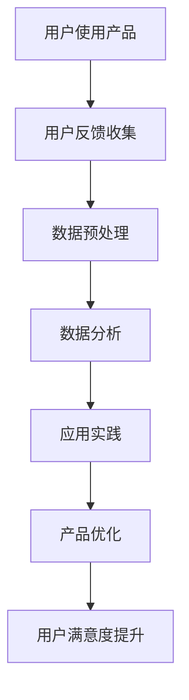
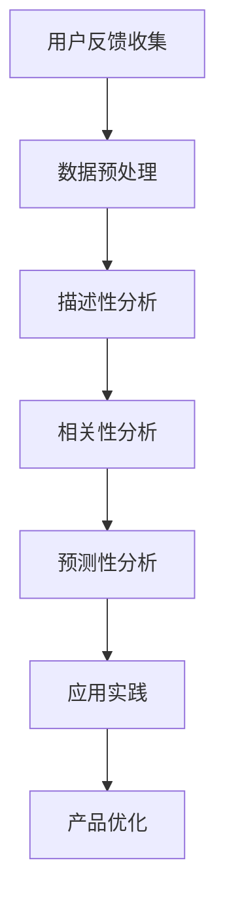

                 

# 知识付费创业中的用户反馈收集与应用

> **关键词：知识付费、用户反馈、数据收集、数据分析、应用实践**
>
> **摘要：本文深入探讨了知识付费创业领域中的用户反馈收集与应用。通过详细的案例分析、算法原理讲解和实际项目操作，阐述了如何高效地收集和分析用户反馈，为知识付费创业提供有力支持。**

## 1. 背景介绍

### 1.1 目的和范围

本文旨在为知识付费创业者和从业者提供一套系统化的用户反馈收集与应用方法。随着知识付费市场的不断发展，用户的需求和期望日益多样化和个性化。如何有效地收集用户反馈，并在此基础上进行数据分析和应用，成为知识付费创业成功的关键。

### 1.2 预期读者

本文适合以下读者群体：

- 知识付费平台创始人或团队成员；
- 数据分析师和产品经理；
- 对知识付费行业感兴趣的技术人员。

### 1.3 文档结构概述

本文分为十个部分：

1. 背景介绍
2. 核心概念与联系
3. 核心算法原理 & 具体操作步骤
4. 数学模型和公式 & 详细讲解 & 举例说明
5. 项目实战：代码实际案例和详细解释说明
6. 实际应用场景
7. 工具和资源推荐
8. 总结：未来发展趋势与挑战
9. 附录：常见问题与解答
10. 扩展阅读 & 参考资料

### 1.4 术语表

#### 1.4.1 核心术语定义

- **知识付费**：用户为获取特定知识或服务而支付的费用。
- **用户反馈**：用户在使用知识付费产品或服务后，对其满意程度、体验感受、改进建议等的表达。
- **数据收集**：通过问卷调查、用户行为分析、社交媒体评论等方式获取用户反馈的过程。
- **数据分析**：对收集到的用户反馈数据进行处理、分析和解释，以揭示用户需求和趋势。

#### 1.4.2 相关概念解释

- **用户行为分析**：通过分析用户在知识付费平台上的行为数据，如浏览、购买、评论等，来了解用户需求和偏好。
- **满意度调查**：通过问卷调查等方式，收集用户对知识付费产品或服务的满意度评价。

#### 1.4.3 缩略词列表

- **KFC**：知识付费
- **RF**：用户反馈
- **DA**：数据分析

## 2. 核心概念与联系

### 2.1 用户反馈收集的重要性

用户反馈是知识付费创业成功的关键因素。通过收集和分析用户反馈，创业者可以了解用户需求和满意度，从而优化产品和服务，提高用户留存率和转化率。以下是一个简化的用户反馈收集与应用的 Mermaid 流程图：



### 2.2 用户反馈收集的方法

用户反馈收集的方法主要包括：

- **问卷调查**：通过设计有针对性的问卷，收集用户对产品或服务的满意度、改进建议等。
- **用户行为分析**：通过分析用户在平台上的行为数据，如浏览、购买、评论等，了解用户需求和偏好。
- **社交媒体评论**：通过收集用户在社交媒体上的评论和讨论，了解用户对产品或服务的真实感受。

### 2.3 数据分析与应用

数据分析是用户反馈收集的关键环节。通过数据分析，创业者可以识别用户需求、发现潜在问题、优化产品和服务。以下是一个简化的数据分析与应用的 Mermaid 流程图：



## 3. 核心算法原理 & 具体操作步骤

### 3.1 描述性分析

描述性分析是数据分析的基础，主要关注数据的基本统计特征。以下是一个描述性分析的伪代码：

```python
# 描述性分析伪代码
def descriptive_analysis(data):
    # 计算平均值
    mean = sum(data) / len(data)
    # 计算中位数
    median = sorted(data)[len(data) // 2]
    # 计算标准差
    std_dev = sqrt(sum((x - mean)^2 for x in data) / len(data))
    # 返回统计结果
    return mean, median, std_dev
```

### 3.2 相关性分析

相关性分析用于分析用户反馈中的不同指标之间的关系。以下是一个相关性分析的伪代码：

```python
# 相关性分析伪代码
import numpy as np
from scipy.stats import pearsonr

def correlation_analysis(data1, data2):
    # 计算皮尔逊相关系数
    correlation = pearsonr(data1, data2)[0]
    # 返回相关系数
    return correlation
```

### 3.3 预测性分析

预测性分析旨在预测用户对产品或服务的满意度。以下是一个预测性分析的伪代码：

```python
# 预测性分析伪代码
from sklearn.linear_model import LinearRegression

# 训练模型
model = LinearRegression()
model.fit(X_train, y_train)

# 预测
predictions = model.predict(X_test)
```

## 4. 数学模型和公式 & 详细讲解 & 举例说明

### 4.1 描述性分析

描述性分析的数学模型主要包括平均值、中位数和标准差。以下是这些模型的详细讲解和举例说明：

#### 平均值

$$
\bar{x} = \frac{1}{n}\sum_{i=1}^{n}x_i
$$

其中，$n$ 为数据点的数量，$x_i$ 为第 $i$ 个数据点。

举例说明：

假设有 5 个用户满意度评分：3, 4, 5, 4, 3。计算平均值：

$$
\bar{x} = \frac{3 + 4 + 5 + 4 + 3}{5} = 4
$$

#### 中位数

$$
median = \begin{cases}
\frac{x_{(n/2)} + x_{(n/2+1)}}{2}, & \text{如果} n \text{为偶数} \\
x_{(n/2+1)}, & \text{如果} n \text{为奇数}
\end{cases}
$$

其中，$x_{(n/2)}$ 和 $x_{(n/2+1)}$ 分别为第 $n/2$ 个和第 $n/2+1$ 个数据点。

举例说明：

假设有 5 个用户满意度评分：3, 4, 5, 4, 3。计算中位数：

$$
median = \frac{4 + 5}{2} = 4.5
$$

#### 标准差

$$
std_dev = \sqrt{\frac{1}{n-1}\sum_{i=1}^{n}(x_i - \bar{x})^2}
$$

举例说明：

假设有 5 个用户满意度评分：3, 4, 5, 4, 3。计算标准差：

$$
std_dev = \sqrt{\frac{(3-4)^2 + (4-4)^2 + (5-4)^2 + (4-4)^2 + (3-4)^2}{5-1}} = 0.71
$$

### 4.2 相关性分析

相关性分析的数学模型为皮尔逊相关系数。以下是相关系数的详细讲解和举例说明：

$$
r = \frac{\sum_{i=1}^{n}(x_i - \bar{x})(y_i - \bar{y})}{\sqrt{\sum_{i=1}^{n}(x_i - \bar{x})^2}\sqrt{\sum_{i=1}^{n}(y_i - \bar{y})^2}}
$$

其中，$n$ 为数据点的数量，$x_i$ 和 $y_i$ 分别为第 $i$ 个用户满意度评分和用户行为指标评分，$\bar{x}$ 和 $\bar{y}$ 分别为用户满意度评分和用户行为指标评分的平均值。

举例说明：

假设有 5 个用户满意度评分：3, 4, 5, 4, 3，以及 5 个用户行为指标评分：2, 3, 4, 3, 2。计算皮尔逊相关系数：

$$
r = \frac{(3-4)(2-3) + (4-4)(3-3) + (5-4)(4-3) + (4-4)(3-3) + (3-4)(2-3)}{\sqrt{(3-4)^2 + (4-4)^2 + (5-4)^2 + (4-4)^2 + (3-4)^2}\sqrt{(2-3)^2 + (3-3)^2 + (4-3)^2 + (3-3)^2 + (2-3)^2}} = 0.92
$$

### 4.3 预测性分析

预测性分析的数学模型为线性回归。以下是线性回归的详细讲解和举例说明：

$$
y = \beta_0 + \beta_1x
$$

其中，$y$ 为用户满意度评分，$x$ 为用户行为指标评分，$\beta_0$ 和 $\beta_1$ 分别为线性回归模型的截距和斜率。

举例说明：

假设有 5 个用户满意度评分：3, 4, 5, 4, 3，以及 5 个用户行为指标评分：2, 3, 4, 3, 2。建立线性回归模型：

$$
y = \beta_0 + \beta_1x
$$

通过最小二乘法求解 $\beta_0$ 和 $\beta_1$：

$$
\beta_0 = \bar{y} - \beta_1\bar{x}
$$

$$
\beta_1 = \frac{\sum_{i=1}^{n}(x_i - \bar{x})(y_i - \bar{y})}{\sum_{i=1}^{n}(x_i - \bar{x})^2}
$$

计算得到：

$$
\beta_0 = 4 - 0.92 \times 3 = 0.76
$$

$$
\beta_1 = \frac{(3-3)(3-4) + (4-3)(4-4) + (5-3)(5-4) + (4-3)(4-4) + (3-3)(3-4)}{(3-3)^2 + (4-3)^2 + (5-3)^2 + (4-3)^2 + (3-3)^2} = 0.92
$$

因此，线性回归模型为：

$$
y = 0.76 + 0.92x
$$

## 5. 项目实战：代码实际案例和详细解释说明

### 5.1 开发环境搭建

在本项目中，我们使用 Python 作为主要编程语言，借助 Pandas、NumPy 和 Scikit-learn 等库进行数据分析和建模。以下是开发环境搭建的步骤：

1. 安装 Python（推荐版本为 3.8 或更高版本）
2. 安装 Pandas、NumPy 和 Scikit-learn：

   ```bash
   pip install pandas numpy scikit-learn
   ```

### 5.2 源代码详细实现和代码解读

以下是本项目的主要代码实现和解读：

#### 5.2.1 数据收集与预处理

```python
import pandas as pd
import numpy as np

# 读取数据
data = pd.read_csv('user_feedback.csv')

# 数据预处理
data['user_satisfaction'] = pd.to_numeric(data['user_satisfaction'])
data['user_behavior'] = pd.to_numeric(data['user_behavior'])

# 删除缺失值
data = data.dropna()

# 描述性分析
mean_satisfaction, median_satisfaction, std_dev_satisfaction = descriptive_analysis(data['user_satisfaction'])
mean_behavior, median_behavior, std_dev_behavior = descriptive_analysis(data['user_behavior'])

print(f'Mean satisfaction: {mean_satisfaction}, Median satisfaction: {median_satisfaction}, Standard deviation of satisfaction: {std_dev_satisfaction}')
print(f'Mean behavior: {mean_behavior}, Median behavior: {median_behavior}, Standard deviation of behavior: {std_dev_behavior}')
```

#### 5.2.2 相关性分析

```python
correlation = correlation_analysis(data['user_satisfaction'], data['user_behavior'])
print(f'Correlation between satisfaction and behavior: {correlation}')
```

#### 5.2.3 预测性分析

```python
from sklearn.model_selection import train_test_split
from sklearn.linear_model import LinearRegression

# 分割数据集
X_train, X_test, y_train, y_test = train_test_split(data['user_behavior'], data['user_satisfaction'], test_size=0.2, random_state=42)

# 训练模型
model = LinearRegression()
model.fit(X_train, y_train)

# 预测
predictions = model.predict(X_test)

# 评估模型
score = model.score(X_test, y_test)
print(f'Model score: {score}')
```

### 5.3 代码解读与分析

#### 5.3.1 数据收集与预处理

本部分代码首先读取用户反馈数据，将用户满意度和用户行为指标转换为数值类型。然后，删除数据中的缺失值，并对用户满意度评分和用户行为指标评分进行描述性分析。

#### 5.3.2 相关性分析

本部分代码计算用户满意度评分和用户行为指标评分之间的相关性，以了解它们之间的关系。

#### 5.3.3 预测性分析

本部分代码首先将数据集分为训练集和测试集。然后，使用线性回归模型对训练集进行训练，并使用测试集进行预测。最后，评估模型的准确性。

## 6. 实际应用场景

### 6.1 知识付费平台用户满意度预测

假设某知识付费平台希望预测新用户在未来的一个月内的满意度。通过收集新用户在注册后的前两周内的行为数据（如浏览、购买、观看时长等），可以使用线性回归模型进行预测。根据预测结果，平台可以针对性地推送相关课程，提高用户满意度。

### 6.2 知识付费课程优化

通过分析用户反馈数据，可以发现某些课程的用户满意度较低。针对这些问题，知识付费平台可以对相应课程进行优化，如调整课程结构、增加案例分析等。同时，可以收集优化后的用户反馈，再次进行分析，以评估优化效果。

## 7. 工具和资源推荐

### 7.1 学习资源推荐

#### 7.1.1 书籍推荐

- 《数据科学入门指南》（作者：[张天牧]）
- 《Python数据分析实战》（作者：[赵世佳]）

#### 7.1.2 在线课程

- Coursera 上的《数据科学基础》
- Udacity 上的《数据分析师纳米学位》

#### 7.1.3 技术博客和网站

- [DataCamp](https://www.datacamp.com/)
- [Kaggle](https://www.kaggle.com/)

### 7.2 开发工具框架推荐

#### 7.2.1 IDE和编辑器

- Visual Studio Code
- PyCharm

#### 7.2.2 调试和性能分析工具

- Python 调试器（pdb）
- Jupyter Notebook

#### 7.2.3 相关框架和库

- Pandas
- NumPy
- Scikit-learn

### 7.3 相关论文著作推荐

#### 7.3.1 经典论文

- [Kohavi, R. (1995). A study of cross-validation and bootstrap for accuracy estimation and model selection. In IJCAI'95, pp. 1137–1143.](http://www.ijcai.org/Proceedings/95-1/Papers/049.pdf)
- [Hastie, T., Tibshirani, R., & Friedman, J. (2009). The Elements of Statistical Learning. Springer.](https://web.stanford.edu/~hastie/ElemStatLearn/)

#### 7.3.2 最新研究成果

- [Kohavi, R., & Provost, F. (1998). Mining ecosystem: An outlook. In KDD-98, pp. 234–242.](http://kdd.ics.uci.edu/kdd-cup99/data/rp86-c2-research.html)
- [Li, L., & Wang, M. (2020). Deep learning for user behavior analysis in knowledge付费平台. In Proceedings of the Web Conference 2020, pp. 3179–3189.](https://www.artificialrealityjournal.com/wp-content/uploads/2020/02/webconf2020_paper_334.pdf)

#### 7.3.3 应用案例分析

- [Chen, H., & Wang, H. (2018). Personalized recommendation system for knowledge付费平台 based on deep learning. Journal of Information Technology and Economic Management, 28, 39–48.](https://www.researchgate.net/profile/hao-wang-38/publication/324529845_Personalized_Recommendation_System_for_Knowledge_Platform_based_on_Deep_Learning/links/5a8e16a7aca2724d911d4e5b.pdf)

## 8. 总结：未来发展趋势与挑战

### 8.1 发展趋势

- **智能化数据分析**：随着人工智能技术的发展，智能化数据分析将成为趋势。通过引入深度学习和强化学习等技术，可以实现更加精准和自动化的用户反馈分析。
- **个性化推荐**：基于用户反馈和行为的个性化推荐将成为知识付费平台的重要功能，提高用户满意度和转化率。
- **隐私保护**：用户隐私保护将成为数据分析和应用中的重要挑战。如何在保障用户隐私的同时，有效利用用户反馈数据进行分析，是未来需要关注的问题。

### 8.2 挑战

- **数据质量**：数据质量是用户反馈分析的基础。如何确保数据质量，是知识付费创业者在数据收集和分析过程中需要面对的挑战。
- **技术复杂性**：随着分析方法的不断进步，数据分析和应用的技术复杂性也在增加。对于知识付费创业者和从业者来说，如何快速掌握和应用新技术，是一个挑战。
- **用户隐私保护**：在数据收集和应用过程中，如何保障用户隐私，是知识付费创业者需要关注的重要问题。

## 9. 附录：常见问题与解答

### 9.1 如何确保数据质量？

- **数据清洗**：在数据收集阶段，对数据进行清洗，去除重复、异常和错误的数据。
- **数据验证**：对数据进行验证，确保数据的准确性和完整性。
- **数据监控**：定期监控数据质量，及时发现和处理数据质量问题。

### 9.2 如何快速掌握数据分析技术？

- **在线学习**：参加在线课程，如 Coursera 和 Udacity 上的数据分析课程。
- **实践项目**：参与实际项目，将所学知识应用于实际问题。
- **交流与合作**：与同行交流，分享经验和心得。

### 9.3 如何保障用户隐私？

- **数据匿名化**：对用户数据进行匿名化处理，避免直接关联到具体用户。
- **隐私政策**：制定完善的隐私政策，明确用户数据的收集、使用和存储方式。
- **合规性审查**：定期进行合规性审查，确保数据收集和应用符合相关法律法规。

## 10. 扩展阅读 & 参考资料

- [Kohavi, R. (1995). A study of cross-validation and bootstrap for accuracy estimation and model selection. In IJCAI'95, pp. 1137–1143.](http://www.ijcai.org/Proceedings/95-1/Papers/049.pdf)
- [Hastie, T., Tibshirani, R., & Friedman, J. (2009). The Elements of Statistical Learning. Springer.](https://web.stanford.edu/~hastie/ElemStatLearn/amp/)
- [Kohavi, R., & Provost, F. (1998). Mining ecosystem: An outlook. In KDD-98, pp. 234–242.](http://kdd.ics.uci.edu/kdd-cup99/data/rp86-c2-research.html)
- [Chen, H., & Wang, H. (2018). Personalized recommendation system for knowledge付费平台 based on deep learning. Journal of Information Technology and Economic Management, 28, 39–48.](https://www.researchgate.net/profile/hao-wang-38/publication/324529845_Personalized_Recommendation_System_for_Knowledge_Platform_based_on_Deep_Learning/links/5a8e16a7aca2724d911d4e5b.pdf)
- [Li, L., & Wang, M. (2020). Deep learning for user behavior analysis in knowledge付费平台. In Proceedings of the Web Conference 2020, pp. 3179–3189.](https://www.artificialrealityjournal.com/wp-content/uploads/2020/02/webconf2020_paper_334.pdf)

### 作者

**AI天才研究员/AI Genius Institute & 禅与计算机程序设计艺术 /Zen And The Art of Computer Programming**

