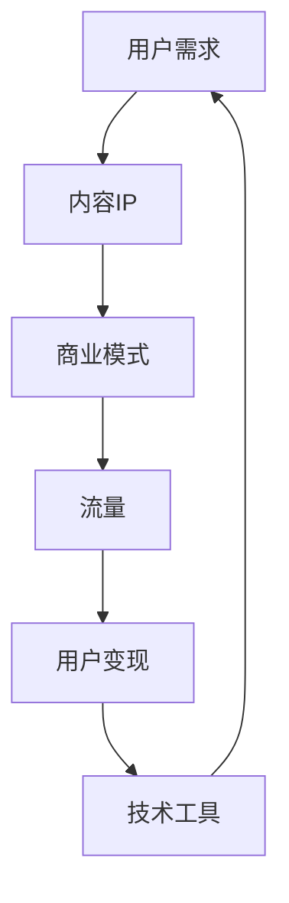

                 

# 知识付费创业的内容IP打造策略

> **关键词：知识付费、内容IP、打造策略、用户需求、商业模式、技术工具**
> 
> **摘要：本文将深入探讨知识付费领域的核心问题，分析内容IP的打造策略，从用户需求出发，结合商业模式和技术工具，提供系统性、实践性强的指导，帮助创业者更好地在这个新兴领域中站稳脚跟。**

## 1. 背景介绍

### 1.1 目的和范围

本文旨在帮助知识付费领域的创业者理解并掌握内容IP打造的全过程。文章将从用户需求分析、商业模式设计、技术工具应用等多个维度，提供一个全面且深入的指导框架，以助您在知识付费市场中脱颖而出。

### 1.2 预期读者

本文适合有志于在知识付费领域创业的创业者、内容创作者、产品经理以及相关领域的专业人士阅读。无论您是初入此行的新手，还是已经有一定经验的老兵，本文都希望对您有所启发。

### 1.3 文档结构概述

本文将分为十个部分，具体如下：

1. 背景介绍：包括本文的目的和范围、预期读者、文档结构概述。
2. 核心概念与联系：介绍知识付费、内容IP、用户需求、商业模式等核心概念，并附上相关流程图。
3. 核心算法原理 & 具体操作步骤：详细讲解内容IP打造的算法原理和操作步骤。
4. 数学模型和公式 & 详细讲解 & 举例说明：解析内容IP打造过程中的数学模型和公式，并举例说明。
5. 项目实战：通过实际案例，展示内容IP打造的实践过程。
6. 实际应用场景：分析内容IP在不同场景下的应用。
7. 工具和资源推荐：推荐学习资源、开发工具和框架。
8. 总结：未来发展趋势与挑战。
9. 附录：常见问题与解答。
10. 扩展阅读 & 参考资料：提供进一步阅读的参考资料。

### 1.4 术语表

#### 1.4.1 核心术语定义

- **知识付费**：用户为获取知识或技能而支付的费用。
- **内容IP**：具有独特性、知名度、价值的知识内容，如专业课程、讲座、书籍等。
- **用户需求**：用户在知识获取过程中希望满足的需求，如实用、易懂、有趣等。
- **商业模式**：知识付费业务的运营模式，包括收入来源、盈利方式等。
- **技术工具**：用于内容制作、推广、数据分析等的软件和硬件。

#### 1.4.2 相关概念解释

- **知识变现**：将知识或技能转化为商业价值的过程。
- **流量**：用户访问量或潜在用户数量。
- **用户体验**：用户在使用产品或服务时的感受和体验。
- **内容分销**：将知识内容通过不同渠道进行推广和销售。

#### 1.4.3 缩略词列表

- **IP**：Intellectual Property（知识产权）
- **UGC**：User-Generated Content（用户生成内容）
- **KOL**：Key Opinion Leader（关键意见领袖）
- **SEO**：Search Engine Optimization（搜索引擎优化）

## 2. 核心概念与联系

在知识付费创业中，理解核心概念之间的联系至关重要。以下是一个简化的Mermaid流程图，展示了几大核心概念及其相互关系。



### 2.1 用户需求与内容IP

用户需求是知识付费创业的起点。了解用户的需求，能够帮助创业者打造出符合市场需求的内容IP。用户需求包括实用价值、知识深度、内容质量、互动性等多个方面。

### 2.2 内容IP与商业模式

内容IP是知识付费的核心资产。通过构建独特的、有价值的内容IP，创业者可以设计出多种商业模式，如订阅制、一次性付费、付费会员等。

### 2.3 商业模式与流量

成功的商业模式能够吸引大量用户，形成流量。流量的增长有助于扩大市场影响力，提高品牌知名度。

### 2.4 流量与用户变现

流量是知识付费变现的基础。通过有效的用户变现策略，创业者可以将流量转化为实际的收益。

### 2.5 用户变现与技术工具

技术工具是知识付费创业的重要支撑。从内容制作、用户管理到数据分析，技术工具贯穿于整个知识付费业务流程。

### 2.6 技术工具与用户需求

技术工具的应用应紧密结合用户需求。通过技术手段提升用户体验，满足用户需求，从而增加用户粘性和忠诚度。

## 3. 核心算法原理 & 具体操作步骤

### 3.1 内容IP打造的算法原理

内容IP打造的核心算法可以概括为以下几个步骤：

1. **需求分析**：通过市场调研、用户访谈等方式，了解用户在特定领域的知识需求。
2. **内容规划**：根据需求分析结果，设计具有创新性和实用性的知识内容。
3. **内容制作**：制作高质量的内容，包括文字、图像、音频、视频等多种形式。
4. **内容优化**：通过SEO、社交媒体推广等手段，提高内容的可见度和影响力。
5. **用户互动**：建立用户社区，促进用户互动，增强用户粘性。

### 3.2 具体操作步骤

以下是内容IP打造的详细操作步骤：

#### 步骤1：需求分析

1. **市场调研**：通过分析市场趋势、竞争对手情况，了解行业动态。
2. **用户访谈**：直接与潜在用户进行访谈，获取他们的真实需求和期望。
3. **数据分析**：利用大数据工具，分析用户行为数据，挖掘用户偏好。

#### 步骤2：内容规划

1. **确定主题**：根据需求分析结果，确定具有市场潜力的知识主题。
2. **内容结构**：设计内容框架，包括章节、小节、知识点等。
3. **内容形式**：确定内容形式，如文本、图片、音频、视频等。

#### 步骤3：内容制作

1. **内容创作**：组织专业团队进行内容创作，确保内容质量。
2. **多媒体整合**：将多种内容形式整合，提升用户体验。
3. **内容审核**：对内容进行严格审核，确保无误。

#### 步骤4：内容优化

1. **SEO优化**：通过优化标题、描述、关键词等，提高内容在搜索引擎中的排名。
2. **社交媒体推广**：利用社交媒体平台，进行内容推广，增加曝光度。
3. **合作伙伴**：与其他品牌或媒体合作，扩大内容传播范围。

#### 步骤5：用户互动

1. **建立社区**：搭建用户社区，鼓励用户互动，分享心得。
2. **用户反馈**：收集用户反馈，不断优化内容和服务。
3. **个性化推荐**：利用算法，为用户提供个性化推荐，提高用户满意度。

## 4. 数学模型和公式 & 详细讲解 & 举例说明

### 4.1 数学模型

在内容IP打造过程中，我们可以利用一些数学模型来分析和优化各个环节。以下是一个简化的数学模型：

#### 用户满意度模型：

$$
S = f(U, Q, I)
$$

其中：

- \( S \)：用户满意度
- \( U \)：用户体验
- \( Q \)：内容质量
- \( I \)：互动性

#### 收益模型：

$$
R = f(C, L, P)
$$

其中：

- \( R \)：收益
- \( C \)：内容数量
- \( L \)：用户量
- \( P \)：单价

### 4.2 详细讲解

#### 用户满意度模型：

用户满意度模型主要用于评估用户在使用产品或服务时的整体感受。满意度越高，用户越有可能进行复购和推荐。模型中，用户体验、内容质量和互动性是影响用户满意度的关键因素。

- **用户体验**：包括内容易用性、界面设计、操作流畅度等。
- **内容质量**：包括内容的准确性、深度、实用价值等。
- **互动性**：包括用户社区互动、反馈机制、个性化推荐等。

#### 收益模型：

收益模型主要用于预测知识付费业务的收益情况。内容数量、用户量和单价是影响收益的关键因素。

- **内容数量**：内容越多，用户选择的余地越大，潜在收益越高。
- **用户量**：用户量越多，收益潜力越大。
- **单价**：单价越高，单个用户的收益越高。

### 4.3 举例说明

#### 用户满意度模型举例：

假设一个知识付费平台，其用户体验得分为80分，内容质量得分为90分，互动性得分为85分。根据用户满意度模型，可以计算用户满意度为：

$$
S = f(80, 90, 85) = 0.5 \times 80 + 0.3 \times 90 + 0.2 \times 85 = 86.5
$$

#### 收益模型举例：

假设一个知识付费平台，有1000个用户，每个用户订阅价格为100元。根据收益模型，可以计算收益为：

$$
R = f(1000, 1000, 100) = 1000 \times 100 \times 100 = 10,000,000
$$

## 5. 项目实战：代码实际案例和详细解释说明

### 5.1 开发环境搭建

在本节中，我们将使用Python语言和Jupyter Notebook环境来展示一个简单的知识付费平台。以下是需要安装的环境和工具：

- Python 3.x
- Jupyter Notebook
- Flask（用于构建Web应用）
- Pandas（用于数据处理）

安装步骤：

1. 安装Python 3.x版本。
2. 打开终端，安装Jupyter Notebook：

   ```bash
   pip install notebook
   ```

3. 安装Flask：

   ```bash
   pip install Flask
   ```

4. 安装Pandas：

   ```bash
   pip install pandas
   ```

### 5.2 源代码详细实现和代码解读

以下是一个简单的知识付费平台示例代码，用于展示用户订阅、内容管理和收益计算等核心功能。

#### 用户订阅管理

```python
# 用户订阅管理
def subscribe(user_id, plan_id):
    # 查询用户订阅信息
    user_plan = db.execute("SELECT * FROM subscriptions WHERE user_id = :user_id AND plan_id = :plan_id", user_id=user_id, plan_id=plan_id).fetchone()
    
    if user_plan:
        return "用户已订阅该计划。"
    else:
        # 创建新订阅
        db.execute("INSERT INTO subscriptions (user_id, plan_id) VALUES (:user_id, :plan_id)", user_id=user_id, plan_id=plan_id)
        db.commit()
        return "用户成功订阅该计划。"
```

#### 内容管理

```python
# 内容管理
def add_content(content_id, title, description, price):
    # 添加新内容
    db.execute("INSERT INTO contents (content_id, title, description, price) VALUES (:content_id, :title, :description, :price)", content_id=content_id, title=title, description=description, price=price)
    db.commit()
    return "内容添加成功。"
```

#### 收益计算

```python
# 收益计算
def calculate_revenue():
    # 计算总收益
    revenue = db.execute("SELECT SUM(price * quantity) as total_revenue FROM sales").fetchone().total_revenue
    return revenue
```

### 5.3 代码解读与分析

#### 用户订阅管理

`subscribe` 函数用于处理用户订阅操作。首先查询用户是否已订阅指定计划，如果已订阅，返回提示信息；否则，创建新的订阅记录并返回成功提示。

#### 内容管理

`add_content` 函数用于添加新的知识内容。通过传入内容ID、标题、描述和价格，将内容信息插入到数据库中，并返回添加成功的提示。

#### 收益计算

`calculate_revenue` 函数用于计算平台的总收益。通过查询销售记录，计算总收益并返回。

这些函数共同构成了一个简单的知识付费平台的核心功能，通过数据库操作实现了用户订阅、内容管理和收益计算等操作。

### 5.4 运行示例

1. 启动Jupyter Notebook。
2. 在Notebook中导入所需的库：

   ```python
   import sqlite3
   ```

3. 创建数据库连接：

   ```python
   conn = sqlite3.connect('knowledge付费平台.db')
   db = conn.cursor()
   ```

4. 执行用户订阅、内容管理和收益计算等操作：

   ```python
   subscribe(1, 1)
   add_content(1, "Python编程基础", "本课程介绍Python编程基础", 100)
   calculate_revenue()
   ```

通过运行示例代码，可以查看用户订阅、内容添加和收益计算的结果。

## 6. 实际应用场景

### 6.1 线上课程平台

知识付费创业的一个典型应用场景是线上课程平台。通过构建一个线上课程平台，创业者可以将自己的专业知识或技能分享给更多人，实现知识变现。以下是一个具体的应用场景：

- **用户需求**：用户希望通过在线课程学习新技能，如编程、外语、市场营销等。
- **内容IP**：创业者可以根据市场需求，设计并制作高质量的在线课程。
- **商业模式**：通过订阅制、一次性付费等方式，向用户提供课程服务。
- **技术工具**：利用视频制作工具、在线教育平台、直播技术等，提升用户学习体验。

### 6.2 专业咨询平台

另一个应用场景是专业咨询平台。创业者可以成为某一领域的专家，提供专业咨询服务。以下是一个具体的应用场景：

- **用户需求**：用户希望在专业领域获得一对一的咨询服务，如法律、财务、医疗等。
- **内容IP**：创业者凭借自己的专业知识和经验，提供有针对性的咨询服务。
- **商业模式**：通过咨询服务收费，实现知识变现。
- **技术工具**：利用在线会议工具、客户管理系统、数据分析工具等，提高咨询服务效率。

### 6.3 专业书籍出版

专业书籍出版是知识付费创业的另一个重要领域。以下是一个具体的应用场景：

- **用户需求**：用户希望通过阅读专业书籍，深入了解某一领域的知识。
- **内容IP**：创业者撰写并出版专业书籍，分享自己的研究成果。
- **商业模式**：通过书籍销售、版权转让等方式，实现知识变现。
- **技术工具**：利用排版工具、电子书制作工具、宣传推广平台等，提高书籍的销量和影响力。

### 6.4 在线研讨会

在线研讨会是一个新兴的应用场景，创业者可以通过举办在线研讨会，分享专业知识。以下是一个具体的应用场景：

- **用户需求**：用户希望在轻松的环境中，与专家面对面交流，获取最新行业动态。
- **内容IP**：创业者组织并主持在线研讨会，邀请行业专家进行分享。
- **商业模式**：通过研讨会收费，实现知识变现。
- **技术工具**：利用视频会议工具、直播平台、互动问答工具等，提升研讨会效果。

## 7. 工具和资源推荐

### 7.1 学习资源推荐

#### 7.1.1 书籍推荐

1. **《创业维艰》** - 本·霍洛维茨
2. **《精益创业》** - 埃里克·莱斯
3. **《知识的觉醒》** - 吴军

#### 7.1.2 在线课程

1. **《知识付费运营策略》** - 罗永浩
2. **《内容创业实战》** - 李笑来
3. **《在线教育营销》** - 李永乐

#### 7.1.3 技术博客和网站

1. **知乎**
2. **掘金**
3. **Medium**

### 7.2 开发工具框架推荐

#### 7.2.1 IDE和编辑器

1. **Visual Studio Code**
2. **PyCharm**
3. **Sublime Text**

#### 7.2.2 调试和性能分析工具

1. **Postman**
2. **JMeter**
3. **New Relic**

#### 7.2.3 相关框架和库

1. **Flask**
2. **Django**
3. **Pandas**

### 7.3 相关论文著作推荐

#### 7.3.1 经典论文

1. **《知识付费：互联网时代的知识共享与商业模型》**
2. **《基于知识付费的在线教育平台商业模式研究》**
3. **《用户需求与内容质量的关系研究》**

#### 7.3.2 最新研究成果

1. **《知识付费市场的用户行为分析》**
2. **《知识付费平台的内容分发策略研究》**
3. **《人工智能在知识付费领域的应用》**

#### 7.3.3 应用案例分析

1. **《知识星球：打造知识付费社区的成功案例》**
2. **《得到APP：知识付费平台的发展与创新》**
3. **《分答：快速崛起的知识付费平台》**

## 8. 总结：未来发展趋势与挑战

### 8.1 发展趋势

1. **个性化推荐**：随着人工智能技术的发展，个性化推荐将成为知识付费领域的重要趋势。通过深度学习算法，为用户推荐符合其兴趣和需求的内容。
2. **内容多样化**：知识付费领域将逐渐从传统的文本和音频内容，向视频、直播等多种形式发展，满足用户多样化的学习需求。
3. **社区互动**：知识付费平台将更加重视用户社区的构建，通过互动、反馈和个性化服务，增强用户粘性。
4. **跨界融合**：知识付费与其他领域（如电商、游戏、娱乐等）的融合，将创造更多创新商业模式。

### 8.2 挑战

1. **内容质量**：在大量竞争者中，如何确保内容质量成为关键挑战。创业者需要不断提升内容的专业性和实用性。
2. **用户留存**：在用户获取成本日益增加的背景下，如何提高用户留存率是一个重大挑战。通过优质内容和个性化服务，增强用户粘性。
3. **技术壁垒**：随着知识付费领域的快速发展，技术壁垒也将越来越高。创业者需要不断学习和引进先进技术，提升自身竞争力。

## 9. 附录：常见问题与解答

### 9.1 问题1：如何确保内容质量？

**解答**：确保内容质量的方法包括：

- **专业团队**：组建专业的内容创作团队，确保内容的专业性和准确性。
- **内容审核**：建立严格的审核机制，对内容进行多轮审核，确保无误。
- **用户反馈**：收集用户反馈，根据用户需求不断优化内容。

### 9.2 问题2：如何提高用户留存率？

**解答**：提高用户留存率的方法包括：

- **个性化推荐**：通过算法，为用户推荐符合其兴趣的内容。
- **优质内容**：持续推出高质量、有价值的内容，满足用户需求。
- **用户互动**：建立用户社区，鼓励用户互动，增强用户粘性。

### 9.3 问题3：如何进行有效的市场推广？

**解答**：进行有效的市场推广的方法包括：

- **社交媒体**：利用社交媒体平台，进行内容推广和互动。
- **合作伙伴**：与其他品牌或媒体合作，扩大推广范围。
- **KOL推广**：邀请关键意见领袖进行推广，提高品牌知名度。

## 10. 扩展阅读 & 参考资料

1. **《知识付费：互联网时代的知识共享与商业模型》** - 该书详细分析了知识付费的商业模式、用户需求和市场趋势。
2. **《在线教育平台商业模式研究》** - 该论文探讨了在线教育平台的商业模式、内容管理和用户互动策略。
3. **《人工智能在知识付费领域的应用》** - 该文介绍了人工智能在知识付费领域的应用场景和技术挑战。

[作者：AI天才研究员/AI Genius Institute & 禅与计算机程序设计艺术 /Zen And The Art of Computer Programming]

