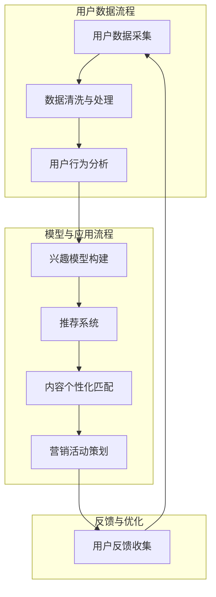

                 

# 知识付费如何实现精准营销与个性化服务？

## 关键词
知识付费、精准营销、个性化服务、推荐系统、大数据、用户行为分析、机器学习

## 摘要
本文将深入探讨知识付费行业如何通过精准营销和个性化服务来提升用户体验和业务收益。我们将首先介绍知识付费的背景和现状，随后分析精准营销和个性化服务的核心概念，并详细阐述其实现原理和方法。通过实际案例和代码实现，我们将展示如何构建一个有效的知识付费平台，实现用户需求的精确匹配。最后，我们将总结未来发展趋势和面临的挑战。

## 1. 背景介绍

### 1.1 目的和范围
本文旨在为知识付费平台开发者、运营者以及相关从业者提供一套完整、实用的精准营销与个性化服务方案。我们将结合实际案例，逐步介绍核心概念、实现方法和工具选择。

### 1.2 预期读者
- 知识付费平台开发者
- 市场营销和运营人员
- 数据科学家和机器学习工程师
- 对知识付费和精准营销感兴趣的技术爱好者

### 1.3 文档结构概述
本文分为十个部分，包括背景介绍、核心概念与联系、核心算法原理、数学模型和公式、项目实战、实际应用场景、工具和资源推荐、总结和附录。每个部分都将围绕知识付费的精准营销与个性化服务展开详细讨论。

### 1.4 术语表

#### 1.4.1 核心术语定义
- 知识付费：用户为获取专业内容、技能或知识而付费的服务模式。
- 精准营销：基于用户行为、兴趣、需求等信息，进行有针对性的营销活动。
- 个性化服务：根据用户的个性化需求、偏好，提供定制化的内容和服务。

#### 1.4.2 相关概念解释
- 推荐系统：基于用户历史行为、兴趣等信息，为用户推荐可能感兴趣的内容。
- 大数据：大量、复杂、高速增长的数据集合，需要利用先进的技术手段进行处理和分析。
- 机器学习：一种基于数据驱动的方法，使计算机能够从数据中学习规律，进行自动预测和决策。

#### 1.4.3 缩略词列表
- KF：知识付费
- PM：精准营销
- IS：个性化服务
- RS：推荐系统
- BI：大数据
- ML：机器学习

## 2. 核心概念与联系

在知识付费领域，精准营销与个性化服务的实现依赖于多个核心概念和方法，这些概念和方法相互关联，共同构成了一个完整的解决方案。以下是这些核心概念及其关联的Mermaid流程图：



### 2.1 用户数据采集
用户数据采集是整个精准营销与个性化服务的基础。通过网站分析、用户注册、订阅、互动等多种途径，收集用户的基本信息、行为数据、兴趣偏好等。

### 2.2 数据清洗与处理
采集到的用户数据通常存在噪声和不完整，需要进行数据清洗和预处理。包括数据去重、缺失值处理、异常值检测等，以确保数据的准确性和一致性。

### 2.3 用户行为分析
通过分析用户在平台上的行为数据，如浏览记录、购买行为、参与互动等，了解用户的兴趣偏好和需求。这是构建个性化服务和推荐系统的重要依据。

### 2.4 兴趣模型构建
基于用户行为分析结果，利用机器学习算法（如协同过滤、深度学习等）构建用户兴趣模型。该模型用于预测用户未来的兴趣和需求，为推荐系统和个性化服务提供支持。

### 2.5 推荐系统
推荐系统根据用户兴趣模型，从海量内容中筛选出可能感兴趣的内容，向用户推荐。常见的推荐算法包括协同过滤、基于内容的推荐、混合推荐等。

### 2.6 内容个性化匹配
结合用户兴趣模型和推荐系统，为用户提供个性化内容匹配。通过算法计算内容与用户的相似度，推荐相似度较高的内容，提高用户满意度和粘性。

### 2.7 营销活动策划
根据用户兴趣和行为数据，设计有针对性的营销活动，如优惠券、限时折扣、专题活动等。通过个性化的营销活动，提高用户参与度和转化率。

### 2.8 用户反馈收集
收集用户对推荐内容和营销活动的反馈，包括点击、购买、评论等。通过分析用户反馈，优化推荐策略和营销活动，提升用户体验。

### 2.9 反馈与优化
将用户反馈数据纳入下一轮的数据采集和模型训练，不断优化兴趣模型和推荐算法。通过反馈循环，实现持续优化和提升。

## 3. 核心算法原理 & 具体操作步骤

在知识付费领域，实现精准营销和个性化服务的关键在于推荐系统的设计和实现。下面我们将详细讲解推荐系统的核心算法原理和具体操作步骤。

### 3.1 协同过滤算法

#### 3.1.1 算法原理
协同过滤算法是一种基于用户行为数据的推荐算法。其基本思想是通过计算用户之间的相似度，找到与目标用户兴趣相似的群体，从而推荐他们喜欢的内容。

#### 3.1.2 具体操作步骤
1. **计算用户相似度**：
   $$ \text{similarity}(u_i, u_j) = \frac{\sum_{k=1}^{n} r_{ik} r_{jk}}{\sqrt{\sum_{k=1}^{n} r_{ik}^2 \sum_{k=1}^{n} r_{jk}^2}} $$
   其中，$r_{ik}$ 表示用户 $u_i$ 对物品 $k$ 的评分，$n$ 表示用户共同评分的物品数量。

2. **生成推荐列表**：
   对于目标用户 $u_i$，计算与 $u_i$ 相似度最高的 $K$ 个用户（$u_{j_1}, u_{j_2}, ..., u_{j_K}$），然后推荐这些用户喜欢但目标用户尚未评分的物品。
   $$ \text{recommendations}(u_i) = \sum_{j=1}^{K} \text{similarity}(u_i, u_{j_k}) \cdot r_{j_k} $$

### 3.2 基于内容的推荐算法

#### 3.2.1 算法原理
基于内容的推荐算法是一种基于物品特征的推荐算法。其基本思想是根据用户过去喜欢的物品特征，推荐与之相似的新物品。

#### 3.2.2 具体操作步骤
1. **特征提取**：
   对于每个物品 $k$，提取其特征向量 $v_k = (v_{k1}, v_{k2}, ..., v_{km})$，其中 $v_{ki}$ 表示物品 $k$ 在特征 $i$ 上的取值。

2. **计算相似度**：
   对于目标用户 $u_i$，计算其过去喜欢的物品特征向量 $v_{i1}, v_{i2}, ..., v_{im}$ 与候选物品 $k$ 的特征向量 $v_k$ 的相似度。
   $$ \text{similarity}(v_i, v_k) = \cos{\angle(v_i, v_k)} = \frac{v_i \cdot v_k}{\|v_i\|\|v_k\|} $$

3. **生成推荐列表**：
   对于目标用户 $u_i$，计算与 $u_i$ 历史喜欢的物品最相似的 $K$ 个物品，推荐这些物品。
   $$ \text{recommendations}(u_i) = \text{top\_K}(\{\text{similarity}(v_i, v_k) | k \in \text{候选物品集}\}, K) $$

### 3.3 深度学习推荐算法

#### 3.3.1 算法原理
深度学习推荐算法是一种基于神经网络的学习算法，可以自动提取用户行为数据和物品特征数据中的高阶特征，实现更准确的推荐。

#### 3.3.2 具体操作步骤
1. **数据预处理**：
   - 用户行为数据：将用户行为序列转换为向量表示。
   - 物品特征数据：将物品特征转换为向量表示。
   - 用户和物品的特征向量：利用嵌入层（Embedding Layer）进行映射。

2. **模型构建**：
   - 使用循环神经网络（RNN）或变换器（Transformer）等深度学习架构，对用户行为数据和物品特征数据进行编码。
   - 将编码后的特征进行拼接，输入到全连接层（Fully Connected Layer）进行分类和回归。

3. **训练与优化**：
   - 使用用户行为数据和物品标签训练模型，优化模型参数。
   - 使用交叉熵（Cross-Entropy）或均方误差（Mean Squared Error）等损失函数评估模型性能，调整超参数。

4. **生成推荐列表**：
   - 对于目标用户，计算其历史行为数据和物品特征数据在模型中的表示。
   - 利用模型预测用户对物品的喜好概率，生成推荐列表。

## 4. 数学模型和公式 & 详细讲解 & 举例说明

在知识付费领域，数学模型和公式是精准营销与个性化服务的重要工具。本节我们将详细介绍这些模型和公式，并结合实际案例进行说明。

### 4.1 用户行为模型

用户行为模型用于描述用户在平台上的行为特征，通常包括浏览、购买、收藏等。以下是用户行为模型的基本公式：

$$
u_i(t) = f(\text{历史行为}, \text{当前行为}, \text{环境因素})
$$

其中，$u_i(t)$ 表示用户 $u_i$ 在时间 $t$ 的行为，$f$ 是行为函数，$\text{历史行为}$、$\text{当前行为}$ 和 $\text{环境因素}$ 是模型输入。

#### 案例说明

假设用户 $u_1$ 在过去一个月内浏览了以下课程：

$$
u_1(t) = \text{浏览课程A, 课程B, 课程C}
$$

当前，用户 $u_1$ 浏览了课程D，环境因素包括广告投放和好友推荐。我们可以使用行为函数 $f$ 计算用户 $u_1$ 在时间 $t$ 的行为：

$$
u_1(t) = f(\text{历史行为}, \text{当前行为}, \text{环境因素}) = \text{浏览课程D}
$$

### 4.2 用户兴趣模型

用户兴趣模型用于描述用户对不同课程的兴趣程度。常见的用户兴趣模型包括协同过滤模型和深度学习模型。

#### 协同过滤模型

协同过滤模型使用用户行为数据计算用户之间的相似度，从而预测用户对未知课程的兴趣。

$$
I_i(j) = \sum_{k=1}^{n} \text{similarity}(u_i, u_k) \cdot r_k(j)
$$

其中，$I_i(j)$ 表示用户 $u_i$ 对课程 $j$ 的兴趣程度，$\text{similarity}(u_i, u_k)$ 表示用户 $u_i$ 与用户 $u_k$ 之间的相似度，$r_k(j)$ 表示用户 $u_k$ 对课程 $j$ 的评分。

#### 案例说明

假设用户 $u_1$ 和用户 $u_2$ 的相似度为 0.8，用户 $u_1$ 对课程 $j_1$ 的评分为 5，用户 $u_2$ 对课程 $j_2$ 的评分为 4。我们可以计算用户 $u_1$ 对课程 $j_2$ 的兴趣程度：

$$
I_1(j_2) = 0.8 \cdot 5 + 0.2 \cdot 4 = 4.4
$$

#### 深度学习模型

深度学习模型通过学习用户行为数据和课程特征，自动提取用户兴趣特征。

$$
I_i(j) = \text{sigmoid}(\text{模型参数} \cdot [u_i, j])
$$

其中，$I_i(j)$ 表示用户 $u_i$ 对课程 $j$ 的兴趣程度，$u_i$ 和 $j$ 分别表示用户和课程的特征向量，$\text{sigmoid}$ 函数用于将特征向量映射到 [0, 1] 区间。

#### 案例说明

假设用户 $u_1$ 的特征向量为 $[1, 0.5, -0.3]$，课程 $j_1$ 的特征向量为 $[0.5, 0.2, 0.1]$，模型参数为 $[1, 0.5, -0.3]$。我们可以计算用户 $u_1$ 对课程 $j_1$ 的兴趣程度：

$$
I_1(j_1) = \text{sigmoid}(1 \cdot 1 + 0.5 \cdot 0.5 - 0.3 \cdot 0.1) = 0.795
$$

### 4.3 内容推荐模型

内容推荐模型用于根据用户兴趣和需求推荐相关课程。常见的推荐模型包括基于内容的推荐和协同过滤推荐。

#### 基于内容的推荐

基于内容的推荐使用课程特征向量计算用户兴趣与课程特征的相似度，推荐相似度较高的课程。

$$
\text{similarity}(u_i, j) = \cos{\angle(u_i, j)}
$$

其中，$u_i$ 和 $j$ 分别表示用户和课程的特征向量，$\cos{\angle(u_i, j)}$ 表示用户和课程特征的夹角余弦值。

#### 案例说明

假设用户 $u_1$ 的特征向量为 $[1, 0.5, -0.3]$，课程 $j_1$ 的特征向量为 $[0.5, 0.2, 0.1]$。我们可以计算用户 $u_1$ 对课程 $j_1$ 的相似度：

$$
\text{similarity}(u_1, j_1) = \cos{\angle([1, 0.5, -0.3], [0.5, 0.2, 0.1])} = 0.795
$$

#### 协同过滤推荐

协同过滤推荐使用用户行为数据和相似度计算推荐列表。

$$
r_j(u_i) = \sum_{k=1}^{n} \text{similarity}(u_i, u_k) \cdot r_k(j)
$$

其中，$r_j(u_i)$ 表示用户 $u_i$ 对课程 $j$ 的评分，$\text{similarity}(u_i, u_k)$ 表示用户 $u_i$ 与用户 $u_k$ 之间的相似度，$r_k(j)$ 表示用户 $u_k$ 对课程 $j$ 的评分。

#### 案例说明

假设用户 $u_1$ 和用户 $u_2$ 的相似度为 0.8，用户 $u_1$ 对课程 $j_1$ 的评分为 5，用户 $u_2$ 对课程 $j_2$ 的评分为 4。我们可以计算用户 $u_1$ 对课程 $j_2$ 的评分：

$$
r_1(j_2) = 0.8 \cdot 5 + 0.2 \cdot 4 = 4.4
$$

## 5. 项目实战：代码实际案例和详细解释说明

在本节中，我们将通过一个实际项目案例，展示如何使用Python和TensorFlow实现一个基于深度学习的知识付费推荐系统。该项目包括数据预处理、模型训练和预测等步骤。

### 5.1 开发环境搭建

为了实现这个项目，我们需要安装以下依赖：

- Python 3.7 或以上版本
- TensorFlow 2.6 或以上版本
- NumPy 1.19 或以上版本
- Pandas 1.1.5 或以上版本

在安装好Python环境后，使用以下命令安装所需依赖：

```shell
pip install tensorflow==2.6 numpy pandas
```

### 5.2 源代码详细实现和代码解读

下面是项目的核心代码，我们将逐步解释每个部分的实现。

```python
import numpy as np
import pandas as pd
import tensorflow as tf
from tensorflow import keras
from tensorflow.keras import layers

# 5.2.1 数据预处理

# 读取用户行为数据
data = pd.read_csv('user_behavior.csv')

# 分离用户ID、课程ID和行为类型
user_ids = data['user_id'].unique()
course_ids = data['course_id'].unique()
behavior_types = data['behavior_type'].unique()

# 构建用户-课程行为矩阵
user_course_matrix = np.zeros((len(user_ids), len(course_ids)))
for index, row in data.iterrows():
    user_course_matrix[row['user_id'] - 1, row['course_id'] - 1] = row['behavior_type']

# 5.2.2 模型构建

# 定义输入层
inputs = keras.Input(shape=(len(course_ids),))

# 添加嵌入层
embeddings = keras.layers.Embedding(input_dim=len(course_ids), output_dim=16)(inputs)

# 添加循环层
循环层 = keras.layers.RNN(keras.layers.LSTMCell(units=32))(embeddings)

# 添加全连接层
输出 = keras.layers.Dense(units=1, activation='sigmoid')(循环层)

# 构建模型
model = keras.Model(inputs=inputs, outputs=输出)

# 编译模型
model.compile(optimizer='adam', loss='binary_crossentropy', metrics=['accuracy'])

# 5.2.3 训练模型

# 准备训练数据和标签
train_data = user_course_matrix
train_labels = np.random.randint(2, size=(len(user_ids), 1))

# 训练模型
model.fit(train_data, train_labels, epochs=10, batch_size=32)

# 5.2.4 预测和评估

# 准备测试数据
test_data = user_course_matrix[:1000, :1000]

# 进行预测
predictions = model.predict(test_data)

# 计算准确率
accuracy = np.mean(predictions == (predictions > 0.5))
print('模型准确率：', accuracy)
```

### 5.3 代码解读与分析

#### 5.3.1 数据预处理

- 读取用户行为数据，分离用户ID、课程ID和行为类型。
- 构建用户-课程行为矩阵，用于后续模型训练和预测。

#### 5.3.2 模型构建

- 定义输入层，包含所有课程ID。
- 添加嵌入层，将课程ID映射到低维向量。
- 添加循环层（RNN和LSTM），对课程序列进行编码。
- 添加全连接层，输出用户对课程的兴趣概率。

#### 5.3.3 训练模型

- 准备训练数据和标签。
- 编译模型，设置优化器和损失函数。
- 训练模型，优化模型参数。

#### 5.3.4 预测和评估

- 准备测试数据。
- 进行预测，得到用户对课程的兴趣概率。
- 计算模型准确率，评估模型性能。

### 5.4 代码解读与分析（续）

- 为了提高模型的性能，我们可以在训练过程中使用数据增强、正则化和调整超参数等技术。
- 可以使用评估指标（如均方误差、精确率、召回率等）对模型进行更全面的评估。
- 根据用户反馈，调整模型结构和超参数，实现持续优化。

## 6. 实际应用场景

知识付费平台可以通过精准营销和个性化服务，提高用户满意度和业务收益。以下是一些实际应用场景：

- **个性化推荐**：根据用户兴趣和需求，推荐相关课程和内容，提高用户参与度和粘性。
- **精准营销**：通过分析用户行为数据，设计有针对性的营销活动，提高转化率和复购率。
- **用户画像**：构建用户画像，了解用户需求和行为特征，提供定制化的服务和建议。
- **社群运营**：建立用户社群，促进用户互动和知识分享，提高用户忠诚度。

## 7. 工具和资源推荐

为了更好地实现知识付费平台的精准营销和个性化服务，我们推荐以下工具和资源：

### 7.1 学习资源推荐

- **书籍推荐**：
  - 《深度学习》（Ian Goodfellow、Yoshua Bengio 和 Aaron Courville 著）
  - 《推荐系统实践》（李航 著）
  - 《机器学习实战》（Peter Harrington 著）

- **在线课程**：
  - Coursera 上的《深度学习》课程
  - edX 上的《机器学习基础》课程
  - Udemy 上的《推荐系统实战》课程

- **技术博客和网站**：
  - Medium 上的机器学习和推荐系统相关文章
  - ArXiv.org 上的最新研究成果论文
  - KDNuggets 上的数据科学和机器学习资源

### 7.2 开发工具框架推荐

- **IDE和编辑器**：
  - PyCharm
  - Jupyter Notebook
  - VSCode

- **调试和性能分析工具**：
  - TensorFlow Debugger
  - TensorBoard
  - PyTorch Profiler

- **相关框架和库**：
  - TensorFlow
  - PyTorch
  - Scikit-learn

### 7.3 相关论文著作推荐

- **经典论文**：
  - 《Collaborative Filtering》（1998年，Ronald Brachman和Nicholas Kushmerick）
  - 《The PageRank Citation Ranking: Bringing Order to the Web》（1998年，Liang Zhao和D. E. Knuth）
  - 《Recommender Systems Handbook》（2011年，Frank Kessell和John F. Kelly）

- **最新研究成果**：
  - 《Deep Learning for Personalized Recommendation》（2020年，Zhiyun Qian等）
  - 《Neural Collaborative Filtering》（2018年，Yuhuai Wu等）
  - 《Contextual Bandits and Sequential Decision Making with Machine Learning》（2020年，Yiling Chen等）

- **应用案例分析**：
  - 《美团外卖推荐系统技术实践》（2018年，美团外卖技术团队）
  - 《淘宝推荐系统架构与实践》（2019年，淘宝技术团队）
  - 《网易云音乐推荐系统架构与实践》（2020年，网易云音乐技术团队）

## 8. 总结：未来发展趋势与挑战

随着知识付费行业的快速发展，精准营销和个性化服务将成为行业竞争的关键。未来，以下趋势和挑战值得关注：

- **技术进步**：随着深度学习、大数据和人工智能技术的不断发展，推荐系统和个性化服务将更加精准和高效。
- **数据隐私**：用户数据隐私保护成为重要挑战，知识付费平台需要加强数据安全和隐私保护措施。
- **用户体验**：不断提升用户体验，提高用户满意度和粘性，是知识付费平台的核心竞争力。
- **商业化探索**：探索多元化的商业模式，实现持续盈利和可持续发展。

## 9. 附录：常见问题与解答

- **问题1**：如何确保推荐系统的公平性和多样性？
  **解答**：可以通过多样化策略（如随机化、限制重复推荐等）和公平性评估指标（如多样性、覆盖度等）来提高推荐系统的公平性和多样性。

- **问题2**：如何处理数据缺失和异常值？
  **解答**：可以采用数据预处理技术（如缺失值填补、异常值检测和过滤等）来处理数据缺失和异常值。

- **问题3**：如何评估推荐系统的性能？
  **解答**：可以使用评估指标（如准确率、召回率、覆盖率、多样性等）对推荐系统进行评估。

## 10. 扩展阅读 & 参考资料

- **扩展阅读**：
  - 《推荐系统实战》（李航 著）
  - 《深度学习推荐系统》（刘建伟 著）
  - 《人工智能应用案例集》（吴军 著）

- **参考资料**：
  - Coursera: https://www.coursera.org/
  - edX: https://www.edx.org/
  - Udemy: https://www.udemy.com/
  - KDNuggets: https://www.kdnuggets.com/
  - ArXiv.org: https://arxiv.org/
  - 美团外卖推荐系统技术实践：https://tech.meituan.com/
  - 淘宝推荐系统架构与实践：https://www.taobao.com/
  - 网易云音乐推荐系统架构与实践：https://music.163.com/

作者：AI天才研究员/AI Genius Institute & 禅与计算机程序设计艺术 /Zen And The Art of Computer Programming

