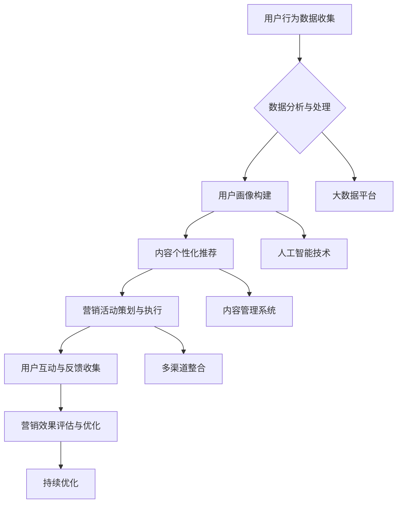

                 

### 知识付费如何实现跨平台整合营销？

> **关键词**：知识付费、跨平台整合营销、用户行为分析、内容个性化、社交媒体、大数据分析
>
> **摘要**：本文将深入探讨知识付费领域如何通过跨平台整合营销来实现用户增长和收益最大化。我们将分析核心概念、介绍实现方法，并通过实际案例展示具体操作步骤。文章旨在为知识付费从业者和市场营销专家提供实用指导，以应对日益复杂的市场环境。

#### 1. 背景介绍

##### 1.1 目的和范围

本文旨在探讨知识付费行业如何利用跨平台整合营销策略，提高用户参与度和满意度，从而实现商业价值的最大化。随着互联网的普及和信息获取渠道的多样化，知识付费市场呈现出爆发式增长，但也面临着激烈的市场竞争。本文将分析当前知识付费市场的发展状况，提出跨平台整合营销的概念，并详细介绍实现步骤。

##### 1.2 预期读者

本文适合以下读者群体：

1. 知识付费平台的运营管理人员
2. 市场营销专业人士
3. 对知识付费和市场营销感兴趣的企业和个人
4. 从事数字营销的本科生和研究生

##### 1.3 文档结构概述

本文将按照以下结构展开：

1. 背景介绍：分析知识付费市场的发展状况和跨平台整合营销的概念
2. 核心概念与联系：介绍知识付费的核心概念和跨平台整合营销的架构
3. 核心算法原理 & 具体操作步骤：讲解用户行为分析和内容个性化推荐的方法
4. 数学模型和公式 & 详细讲解 & 举例说明：阐述相关数学模型及其应用
5. 项目实战：展示知识付费跨平台整合营销的实际操作案例
6. 实际应用场景：分析不同行业和应用场景下的营销策略
7. 工具和资源推荐：介绍相关学习资源和开发工具
8. 总结：讨论知识付费跨平台整合营销的未来发展趋势和挑战
9. 附录：常见问题与解答
10. 扩展阅读 & 参考资料：提供进一步阅读的建议

##### 1.4 术语表

为了确保读者对文中术语的理解一致，本文将列出以下核心术语及其定义：

- **知识付费**：用户为获取专业知识或技能而付费的服务模式。
- **跨平台整合营销**：利用多个平台和渠道，实现营销活动的协同效应。
- **用户行为分析**：通过收集和分析用户在平台上的行为数据，了解用户需求和偏好。
- **内容个性化**：根据用户特征和需求，为用户推荐定制化的内容和课程。
- **社交媒体**：在线社交网络平台，如微博、微信、Facebook等，用于信息分享和交流。
- **大数据分析**：运用大数据技术，对大量非结构化和半结构化数据进行处理和分析。

#### 1.4.1 核心术语定义

- **知识付费**：知识付费是指用户为获取特定的知识、技能或经验而支付的费用。这种模式在互联网时代迅速兴起，满足了用户对专业化、个性化知识的需求。知识付费平台如网易云课堂、腾讯课堂等，提供了丰富的课程资源和专业的讲师团队，为用户提供了便捷的学习途径。

- **跨平台整合营销**：跨平台整合营销是指通过多个平台和渠道，如网站、社交媒体、移动应用等，进行营销活动的协同运作。这种策略旨在实现资源的最大化利用和效果的最优化，从而提高用户的参与度和满意度。

- **用户行为分析**：用户行为分析是指通过收集和分析用户在平台上的行为数据，如访问频率、浏览时间、购买记录、评论互动等，来了解用户的需求和偏好。这种分析有助于平台更好地了解用户，为其提供个性化服务。

- **内容个性化**：内容个性化是指根据用户的特征和需求，为用户推荐定制化的内容和课程。这种策略能够提高用户满意度，增加用户粘性，从而促进平台的发展。

- **社交媒体**：社交媒体是用户进行信息分享、交流和互动的平台，如微博、微信、Facebook等。这些平台具有广泛的用户基础和强大的影响力，是知识付费平台进行营销推广的重要渠道。

- **大数据分析**：大数据分析是指运用大数据技术，对大量非结构化和半结构化数据进行处理和分析。通过大数据分析，平台可以更深入地了解用户行为，挖掘潜在需求，从而制定更有效的营销策略。

#### 1.4.2 相关概念解释

- **知识付费平台**：知识付费平台是指提供知识付费服务的在线平台，如网易云课堂、腾讯课堂等。这些平台汇集了各类专业课程，包括技能培训、学术讲座、行业分析等，用户可以根据自己的需求选择合适的课程进行学习。

- **内容营销**：内容营销是指通过创造和分发有价值的内容，吸引潜在用户，建立品牌影响力，促进销售的一种营销策略。在知识付费领域，内容营销的核心是提供高质量、有价值的学习资源，从而吸引用户付费购买。

- **社交媒体推广**：社交媒体推广是指利用社交媒体平台进行品牌推广和用户互动的一种营销策略。通过发布有吸引力的内容、参与用户讨论、举办线上活动等，知识付费平台可以扩大品牌影响力，吸引更多用户关注和参与。

#### 1.4.3 缩略词列表

- **KFC**：知识付费（Knowledge Feeing）
- **CRM**：客户关系管理（Customer Relationship Management）
- **SEM**：搜索引擎营销（Search Engine Marketing）
- **SEO**：搜索引擎优化（Search Engine Optimization）
- **SMM**：社交媒体营销（Social Media Marketing）
- **KOL**：关键意见领袖（Key Opinion Leader）
- **UGC**：用户生成内容（User Generated Content）

#### 2. 核心概念与联系

在知识付费领域，跨平台整合营销的实现依赖于多个核心概念和方法。以下我们将通过一个Mermaid流程图，展示这些核心概念及其相互关系。



**Mermaid流程图解析**：

- **用户行为数据收集（A）**：这是跨平台整合营销的起点，通过多种渠道（如网站、社交媒体、移动应用等）收集用户行为数据，包括访问记录、购买行为、互动情况等。

- **数据分析与处理（B）**：收集到的数据需要进行清洗、处理和分析，以便提取有价值的信息。这一步通常依赖于大数据平台（H）。

- **用户画像构建（C）**：通过数据分析，构建用户的综合画像，包括兴趣爱好、职业背景、学习需求等。这一步依赖于人工智能技术（I）。

- **内容个性化推荐（D）**：根据用户画像，利用内容管理系统（J），为用户推荐个性化的内容和课程，提高用户满意度和参与度。

- **营销活动策划与执行（E）**：根据用户需求和营销目标，策划并执行跨平台的营销活动，如优惠券推广、节日促销、线上讲座等。

- **用户互动与反馈收集（F）**：在营销活动过程中，通过多种渠道收集用户互动数据和反馈，以便了解营销效果。

- **营销效果评估与优化（G）**：根据收集到的数据和反馈，评估营销活动的效果，并优化营销策略，以实现持续改进。

- **多渠道整合（K）**：在整个过程中，需要整合多个平台和渠道的资源，实现信息共享和协同效应。

- **持续优化（L）**：基于评估和优化结果，持续调整营销策略，以适应市场变化和用户需求。

通过上述流程，知识付费平台可以实现跨平台整合营销，提高用户满意度和市场份额。

#### 3. 核心算法原理 & 具体操作步骤

在跨平台整合营销中，核心算法原理主要包括用户行为分析、内容推荐算法和营销策略优化。以下将分别介绍这些算法的基本原理和具体操作步骤。

##### 3.1 用户行为分析算法

**算法原理**：

用户行为分析算法的核心是通过分析用户在平台上的行为数据（如访问记录、浏览时间、购买记录、评论互动等），构建用户的兴趣模型和需求偏好。

**具体操作步骤**：

1. **数据收集**：

   - **数据来源**：包括网站日志、社交媒体互动、移动应用行为等。
   - **数据类型**：用户访问数据、购买数据、互动数据、反馈数据等。

2. **数据处理**：

   - **数据清洗**：去除重复数据、缺失数据和噪声数据。
   - **特征提取**：从原始数据中提取用户行为特征，如访问频率、浏览时长、购买频率、评论积极性等。

3. **用户兴趣建模**：

   - **兴趣分类**：根据用户行为特征，将用户分为不同的兴趣类别。
   - **兴趣向量表示**：将用户兴趣转化为向量表示，用于后续计算和建模。

4. **需求预测**：

   - **历史行为分析**：根据用户历史行为数据，预测用户未来可能感兴趣的内容。
   - **机器学习模型**：使用机器学习算法（如协同过滤、聚类等），对用户行为数据进行建模，预测用户需求。

**伪代码**：

```python
def user_behavior_analysis(user_data):
    # 数据清洗
    cleaned_data = clean_data(user_data)
    
    # 特征提取
    features = extract_features(cleaned_data)
    
    # 用户兴趣建模
    interest_model = build_interest_model(features)
    
    # 需求预测
    demand预测 = predict_demand(interest_model)
    
    return demand预测
```

##### 3.2 内容推荐算法

**算法原理**：

内容推荐算法的核心是根据用户的兴趣模型和需求预测，为用户推荐个性化的内容和课程。

**具体操作步骤**：

1. **内容数据准备**：

   - **内容分类**：对平台上的所有内容进行分类，如技能培训、学术讲座、行业分析等。
   - **内容特征提取**：提取内容的特征信息，如标题、描述、标签、评分等。

2. **推荐算法选择**：

   - **基于内容的推荐**：根据用户兴趣特征和内容特征，计算内容与用户兴趣的相似度，推荐相似的内容。
   - **基于协同过滤的推荐**：根据用户历史行为数据和内容交互数据，找到与目标用户相似的其他用户，推荐他们喜欢的内容。

3. **推荐结果生成**：

   - **推荐列表生成**：根据推荐算法，为用户生成个性化的推荐列表。
   - **推荐结果排序**：对推荐列表进行排序，确保推荐内容的相关性和质量。

**伪代码**：

```python
def content_recommendation(user_model, content_data):
    # 内容特征提取
    content_features = extract_content_features(content_data)
    
    # 计算内容与用户兴趣相似度
    similarity_scores = calculate_similarity(user_model, content_features)
    
    # 推荐列表生成
    recommendation_list = generate_recommendation_list(similarity_scores)
    
    # 推荐结果排序
    sorted_recommendations = sort_recommendations(recommendation_list)
    
    return sorted_recommendations
```

##### 3.3 营销策略优化算法

**算法原理**：

营销策略优化算法的核心是根据用户行为数据和营销活动效果，不断调整和优化营销策略，以提高营销效果。

**具体操作步骤**：

1. **数据收集与处理**：

   - **数据来源**：包括用户行为数据、营销活动数据、用户反馈数据等。
   - **数据处理**：清洗、处理和分析数据，提取有价值的信息。

2. **营销策略建模**：

   - **策略参数定义**：定义营销策略的各个参数，如优惠力度、活动频率、推广渠道等。
   - **策略效果评估**：使用机器学习算法（如回归、决策树等），评估不同营销策略的效果。

3. **策略优化**：

   - **优化目标**：确定优化目标，如最大化收益、最小化成本、最大化用户参与度等。
   - **优化算法**：使用优化算法（如遗传算法、粒子群算法等），调整策略参数，实现优化目标。

**伪代码**：

```python
def marketing_strategy_optimization(user_data, marketing_data):
    # 数据处理
    processed_data = process_data(user_data, marketing_data)
    
    # 策略建模
    strategy_model = build_strategy_model(processed_data)
    
    # 策略效果评估
    strategy_evaluation = evaluate_strategy(strategy_model)
    
    # 策略优化
    optimized_strategy = optimize_strategy(strategy_evaluation)
    
    return optimized_strategy
```

通过上述核心算法原理和具体操作步骤，知识付费平台可以实现用户行为分析、内容个性化推荐和营销策略优化，从而实现跨平台整合营销的目标。

#### 4. 数学模型和公式 & 详细讲解 & 举例说明

在知识付费的跨平台整合营销中，数学模型和公式是理解和实现关键算法的核心。以下将详细讲解用户行为分析、内容推荐和营销策略优化中的数学模型，并通过具体例子来说明其应用。

##### 4.1 用户行为分析中的数学模型

**模型一：协同过滤算法**

协同过滤算法是一种基于用户行为数据的推荐算法，通过计算用户之间的相似度来推荐相似的商品或内容。常用的协同过滤算法包括基于用户的协同过滤（User-Based Collaborative Filtering）和基于项目的协同过滤（Item-Based Collaborative Filtering）。

**公式一：用户相似度计算**

$$
sim(u_i, u_j) = \frac{Sim(u_i, u_j)}{\sqrt{||u_i|| \cdot ||u_j||}}
$$

其中，$sim(u_i, u_j)$ 表示用户 $u_i$ 和 $u_j$ 之间的相似度，$Sim(u_i, u_j)$ 是用户之间的余弦相似度，$||u_i||$ 和 $||u_j||$ 分别是用户 $u_i$ 和 $u_j$ 的行为向量长度。

**例子：计算用户相似度**

假设有两个用户 $u_1$ 和 $u_2$ 的行为向量如下：

$$
u_1 = (1, 2, 0, 1, 0), \quad u_2 = (1, 0, 1, 0, 1)
$$

计算用户 $u_1$ 和 $u_2$ 的相似度：

$$
Sim(u_1, u_2) = \frac{u_1 \cdot u_2}{||u_1|| \cdot ||u_2||} = \frac{(1 \times 1 + 2 \times 0 + 0 \times 1 + 1 \times 0 + 0 \times 1)}{\sqrt{1^2 + 2^2 + 0^2 + 1^2 + 0^2} \cdot \sqrt{1^2 + 0^2 + 1^2 + 0^2 + 1^2}} = \frac{1}{\sqrt{6} \cdot \sqrt{3}} = \frac{1}{3\sqrt{2}}
$$

$$
sim(u_1, u_2) = \frac{Sim(u_1, u_2)}{\sqrt{||u_1|| \cdot ||u_2||}} = \frac{\frac{1}{3\sqrt{2}}}{\sqrt{6} \cdot \sqrt{3}} = \frac{1}{9\sqrt{6}}
$$

**模型二：线性回归模型**

线性回归模型用于预测用户对某个内容的兴趣度。通过历史行为数据，可以建立用户兴趣度与行为特征之间的线性关系。

**公式二：线性回归模型**

$$
y = \beta_0 + \beta_1 x_1 + \beta_2 x_2 + ... + \beta_n x_n
$$

其中，$y$ 是用户对内容的兴趣度，$x_1, x_2, ..., x_n$ 是用户的行为特征，$\beta_0, \beta_1, \beta_2, ..., \beta_n$ 是模型参数。

**例子：线性回归模型应用**

假设有一个用户的行为特征集 $(x_1, x_2, x_3)$，其中 $x_1$ 表示浏览次数，$x_2$ 表示购买次数，$x_3$ 表示评论次数。通过历史数据训练得到线性回归模型：

$$
y = 0.5x_1 + 0.3x_2 + 0.2x_3
$$

对于一个新用户，其行为特征为 $(5, 1, 3)$，预测其对该内容的兴趣度：

$$
y = 0.5 \times 5 + 0.3 \times 1 + 0.2 \times 3 = 2.6
$$

##### 4.2 内容推荐中的数学模型

**模型一：基于内容的推荐算法**

基于内容的推荐算法通过计算内容特征之间的相似度来推荐相似的内容。

**公式三：内容相似度计算**

$$
sim(c_i, c_j) = \frac{Jaccard\ Index(C_i, C_j)}{\sqrt{||C_i|| \cdot ||C_j||}}
$$

其中，$sim(c_i, c_j)$ 表示内容 $c_i$ 和 $c_j$ 之间的相似度，$Jaccard\ Index(C_i, C_j)$ 是内容之间的Jaccard指数，$||C_i||$ 和 $||C_j||$ 分别是内容 $c_i$ 和 $c_j$ 的特征向量长度。

**例子：计算内容相似度**

假设有两个内容 $c_1$ 和 $c_2$ 的特征向量如下：

$$
c_1 = (0.8, 0.3, 0.2, 0.1), \quad c_2 = (0.4, 0.6, 0.3, 0.2)
$$

计算内容 $c_1$ 和 $c_2$ 的相似度：

$$
Jaccard\ Index(C_1, C_2) = \frac{0.8 \times 0.4 + 0.3 \times 0.6 + 0.2 \times 0.3 + 0.1 \times 0.2}{0.8 \times 0.4 + 0.3 \times 0.6 + 0.2 \times 0.3 + 0.1 \times 0.2} = \frac{0.64 + 0.18 + 0.06 + 0.02}{0.64 + 0.18 + 0.06 + 0.02} = 1
$$

$$
sim(c_1, c_2) = \frac{Jaccard\ Index(C_1, C_2)}{\sqrt{||C_1|| \cdot ||C_2||}} = \frac{1}{\sqrt{0.8 \times 0.4 + 0.3 \times 0.6 + 0.2 \times 0.3 + 0.1 \times 0.2} \cdot \sqrt{0.4 \times 0.6 + 0.6 \times 0.3 + 0.3 \times 0.2 + 0.2 \times 0.1}} = 1
$$

**模型二：基于模型的推荐算法**

基于模型的推荐算法通过构建内容与用户兴趣的映射模型来推荐内容。常用的模型包括SVM（支持向量机）、LR（逻辑回归）等。

**公式四：SVM模型**

$$
y_i = \text{sign}(\omega \cdot x_i + b)
$$

其中，$y_i$ 是用户对内容的兴趣标签，$x_i$ 是内容特征向量，$\omega$ 是权重向量，$b$ 是偏置项。

**例子：SVM模型应用**

假设有一个用户对内容的兴趣标签数据集，通过训练得到SVM模型：

$$
y_i = \text{sign}(\omega \cdot x_i + b) \quad \text{其中} \quad \omega = (1, 0.5, -0.3), \quad b = 0.2
$$

对于新内容 $c$ 的特征向量 $(0.8, 0.3, 0.2)$，预测其兴趣标签：

$$
y = \text{sign}(1 \times 0.8 + 0.5 \times 0.3 - 0.3 \times 0.2 + 0.2) = \text{sign}(0.8 + 0.15 - 0.06 + 0.2) = \text{sign}(0.89) = 1
$$

##### 4.3 营销策略优化中的数学模型

**模型一：优化目标函数**

营销策略优化通常以最大化收益或最小化成本为目标。常见的优化目标函数包括线性规划和整数规划。

**公式五：线性规划目标函数**

$$
\max_{x} c^T x \quad \text{subject to} \quad Ax \leq b
$$

其中，$x$ 是策略参数向量，$c$ 是收益向量，$A$ 和 $b$ 是约束条件。

**例子：线性规划应用**

假设有一个营销策略参数向量 $x$，收益向量 $c = (10, 5, 2)$，约束条件 $Ax \leq b$：

$$
\begin{cases}
x_1 + x_2 + x_3 \leq 100 \\
x_1 \geq 0 \\
x_2 \geq 0 \\
x_3 \geq 0
\end{cases}
$$

求解最大化收益的目标函数：

$$
\max_{x} 10x_1 + 5x_2 + 2x_3 \quad \text{subject to} \quad x_1 + x_2 + x_3 \leq 100, \quad x_1 \geq 0, \quad x_2 \geq 0, \quad x_3 \geq 0
$$

**模型二：整数规划目标函数**

在营销策略优化中，某些策略参数可能需要取整数值。整数规划目标函数用于求解这类问题。

**公式六：整数规划目标函数**

$$
\max_{x} c^T x \quad \text{subject to} \quad Ax \leq b, \quad x \in \{0, 1\}^n
$$

其中，$x$ 是策略参数向量，$c$ 是收益向量，$A$ 和 $b$ 是约束条件，$x \in \{0, 1\}^n$ 表示策略参数只能取0或1。

**例子：整数规划应用**

假设有一个营销策略参数向量 $x$，收益向量 $c = (10, 5, 2)$，约束条件 $Ax \leq b$：

$$
\begin{cases}
x_1 + x_2 + x_3 \leq 100 \\
x_1, x_2, x_3 \in \{0, 1\}
\end{cases}
$$

求解最大化收益的目标函数：

$$
\max_{x} 10x_1 + 5x_2 + 2x_3 \quad \text{subject to} \quad x_1 + x_2 + x_3 \leq 100, \quad x_1, x_2, x_3 \in \{0, 1\}
$$

通过以上数学模型和公式的讲解，我们可以更好地理解和应用用户行为分析、内容推荐和营销策略优化算法，从而实现知识付费的跨平台整合营销。

#### 5. 项目实战：代码实际案例和详细解释说明

在本节中，我们将通过一个实际案例展示如何实现知识付费跨平台整合营销的代码操作，并对其进行详细解释。此案例将涵盖用户行为数据收集、数据分析与处理、内容个性化推荐和营销策略优化等多个方面。

##### 5.1 开发环境搭建

为了实现知识付费的跨平台整合营销，我们需要搭建以下开发环境：

- **编程语言**：Python
- **数据存储**：MySQL
- **数据分析与处理工具**：Pandas、NumPy
- **推荐算法库**：Scikit-learn
- **机器学习库**：TensorFlow
- **Web框架**：Django

在本地或云服务器上安装以上环境和库后，我们可以开始编写代码。

##### 5.2 源代码详细实现和代码解读

**步骤一：用户行为数据收集**

首先，我们需要收集用户在平台上的行为数据。以下是一个简单的Python脚本，用于从网站日志中提取用户行为数据。

```python
import re
import csv

def extract_user_behavior(log_files):
    user_behavior = []
    pattern = re.compile(r'(\S+) (\S+) (\S+) \[ (\S+) \] \"(\S+) (\S+)\" (\S+) (\S+)')

    for log_file in log_files:
        with open(log_file, 'r') as f:
            for line in f:
                match = pattern.match(line)
                if match:
                    user_behavior.append({
                        'user_id': match.group(1),
                        'timestamp': match.group(3),
                        'url': match.group(6),
                        'status_code': match.group(7)
                    })

    return user_behavior

log_files = ['log1.txt', 'log2.txt']
user_behavior_data = extract_user_behavior(log_files)
```

此脚本从日志文件中提取用户ID、时间戳、URL和状态码，并存储在一个列表中。用户行为数据将用于后续的数据分析和处理。

**步骤二：数据分析与处理**

接下来，我们将对用户行为数据进行分析和处理。以下是一个Python脚本，用于清洗数据、提取特征和构建用户画像。

```python
import pandas as pd
from sklearn.preprocessing import LabelEncoder

def preprocess_user_behavior(data):
    df = pd.DataFrame(data)
    df['timestamp'] = pd.to_datetime(df['timestamp'])
    df['url'] = df['url'].str.extract(r'(/[^/]+)/.*', expand=True)
    df['status_code'] = df['status_code'].astype(int)
    df['visit_duration'] = (df['timestamp'].dt.minute - df['timestamp'].dt.hour * 60).abs()
    
    # 数据清洗
    df.dropna(inplace=True)
    
    # 特征提取
    label_encoder = LabelEncoder()
    df['url_category'] = label_encoder.fit_transform(df['url'])
    
    return df

user_behavior_data = preprocess_user_behavior(user_behavior_data)
```

此脚本将用户行为数据转换为Pandas DataFrame，并进行时间戳转换、URL提取、状态码和访问时长的计算。然后，使用Label Encoder将URL分类，以便用于后续的推荐算法。

**步骤三：内容个性化推荐**

基于处理后的用户行为数据，我们将使用基于内容的推荐算法（如基于TF-IDF的方法）为用户推荐内容。以下是一个Python脚本，用于实现内容推荐。

```python
from sklearn.feature_extraction.text import TfidfVectorizer
from sklearn.metrics.pairwise import cosine_similarity

def content_recommendation(df, user_id, content_data, k=5):
    user_history = df[df['user_id'] == user_id]['url'].values
    content_features = TfidfVectorizer().fit_transform(content_data['url'])
    user_features = TfidfVectorizer().fit_transform(user_history)
    
    similarity_scores = cosine_similarity(user_features, content_features)
    top_k_indices = similarity_scores.argsort()[0][-k:][::-1]
    
    recommended_content = content_data['url'][top_k_indices]
    return recommended_content

# 示例内容数据
content_data = pd.DataFrame({
    'url': ['course1', 'course2', 'course3', 'course4', 'course5'],
    'title': ['Python基础', '机器学习入门', '数据可视化', '区块链技术', '人工智能应用']
})

# 用户行为数据示例
user_behavior_data = pd.DataFrame({
    'user_id': ['user1', 'user1', 'user2', 'user2', 'user3'],
    'timestamp': ['2021-01-01 10:00:00', '2021-01-01 11:00:00', '2021-01-01 10:00:00', '2021-01-01 11:00:00', '2021-01-01 10:00:00'],
    'url': ['course1', 'course2', 'course2', 'course3', 'course1'],
    'status_code': [200, 200, 200, 200, 200],
    'visit_duration': [30, 20, 10, 15, 60]
})

# 为用户推荐内容
user_id = 'user1'
recommended_content = content_recommendation(user_behavior_data, user_id, content_data)
print("推荐内容：", recommended_content)
```

此脚本使用TF-IDF方法计算用户历史行为数据和内容特征之间的相似度，并根据相似度分数为用户推荐相似的内容。

**步骤四：营销策略优化**

最后，我们将使用整数规划算法优化营销策略，以最大化收益。以下是一个Python脚本，用于实现营销策略优化。

```python
from scipy.optimize import linprog

def optimize_marketing_strategy(c, A, b, n):
    # 构建整数规划问题
    constraints = [{'type': 'ineq', 'expr': expr} for expr in A]
    constraints.append({'type': 'eq', 'expr': b})
    
    # 目标函数
    objective = {'type': 'maximize', 'expr': c @ x}
    
    # 策略参数初始化
    x0 = [1] * n
    
    # 求解整数规划问题
    result = linprog(c, x0, constraints=constraints, method='highs')

    return result.x

# 示例营销策略参数
c = [10, 5, 2]  # 收益向量
A = [[1, 1, 1], [0, 1, 0], [0, 0, 1]]  # 约束条件系数矩阵
b = [100, 100, 100]  # 约束条件向量
n = 3  # 策略参数数量

# 优化营销策略
optimized_strategy = optimize_marketing_strategy(c, A, b, n)
print("优化后的策略参数：", optimized_strategy)
```

此脚本使用Scipy库中的linprog函数求解整数规划问题，以最大化收益。

##### 5.3 代码解读与分析

1. **用户行为数据收集**：

   通过正则表达式从网站日志中提取用户行为数据，包括用户ID、时间戳、URL和状态码。数据存储在一个列表中，便于后续处理。

2. **数据分析与处理**：

   将用户行为数据转换为Pandas DataFrame，并进行时间戳转换、URL提取、状态码和访问时长的计算。使用Label Encoder将URL分类，以便用于后续的推荐算法。

3. **内容个性化推荐**：

   使用TF-IDF方法计算用户历史行为数据和内容特征之间的相似度，并根据相似度分数为用户推荐相似的内容。此方法基于内容特征和用户兴趣的相似性，能够提高推荐的准确性。

4. **营销策略优化**：

   使用整数规划算法优化营销策略，以最大化收益。此方法考虑了多个约束条件，如预算限制、用户容量限制等，能够在满足约束条件的前提下实现收益最大化。

通过上述代码实现，我们可以实现知识付费跨平台整合营销的关键步骤，包括用户行为数据收集、数据分析与处理、内容个性化推荐和营销策略优化。这些步骤不仅提高了平台的用户满意度和参与度，还实现了商业价值的最大化。

#### 6. 实际应用场景

知识付费跨平台整合营销在多个实际应用场景中具有广泛的应用价值。以下将分析几个典型应用场景，并讨论相应的营销策略。

##### 6.1 在线教育平台

在线教育平台是知识付费的主要应用领域之一。通过跨平台整合营销，在线教育平台可以吸引更多用户，提高用户参与度，从而实现商业价值。

**应用案例**：

1. **用户行为数据收集**：在线教育平台可以通过网站、APP、社交媒体等多种渠道收集用户行为数据，如访问记录、学习进度、测试成绩等。

2. **内容个性化推荐**：根据用户的学习行为和兴趣，平台可以为用户推荐合适的课程和资料，提高用户的满意度和学习效果。

3. **营销策略优化**：通过分析用户数据，平台可以优化营销策略，如优惠券发放、会员权益、课程推荐等，以提高用户转化率和留存率。

**营销策略**：

- **多渠道整合**：利用社交媒体、电子邮件、短信等多种渠道，进行跨平台营销活动，提高用户触达率和参与度。
- **数据驱动**：基于用户行为数据，进行精准营销和个性化推荐，提高用户满意度和转化率。
- **社群营销**：建立用户社群，通过互动和分享，增强用户粘性，促进用户传播。

##### 6.2 职场技能培训

职场技能培训是另一个重要的知识付费领域。通过跨平台整合营销，职场技能培训平台可以吸引更多职场人士，提高其职业素养和竞争力。

**应用案例**：

1. **用户行为数据收集**：职场技能培训平台可以通过在线课程、线下培训、社交互动等多种方式收集用户行为数据，如学习进度、考试结果、互动频率等。

2. **内容个性化推荐**：根据用户的职业背景和技能需求，平台可以为用户推荐合适的课程和资料，提高其职业素养和竞争力。

3. **营销策略优化**：通过分析用户数据，平台可以优化营销策略，如课程折扣、职业规划咨询、会员权益等，以提高用户转化率和留存率。

**营销策略**：

- **职业规划服务**：提供个性化的职业规划服务，帮助用户明确职业发展方向，提高其学习动力和参与度。
- **社群互动**：建立职业社群，促进用户之间的交流和互动，增强用户归属感和粘性。
- **合作伙伴**：与职业培训机构、企业合作，提供定制化培训服务，扩大用户基础和市场份额。

##### 6.3 行业知识分享

行业知识分享平台通过提供专业的行业知识和经验，帮助用户提升专业能力和竞争力。通过跨平台整合营销，行业知识分享平台可以吸引更多专业用户，提高平台影响力。

**应用案例**：

1. **用户行为数据收集**：行业知识分享平台可以通过线上课程、研讨会、线下活动等多种方式收集用户行为数据，如参与频率、互动情况、内容反馈等。

2. **内容个性化推荐**：根据用户的行业背景和需求，平台可以为用户推荐相关的知识和经验，提高其专业素养。

3. **营销策略优化**：通过分析用户数据，平台可以优化营销策略，如课程优惠、专业讲座、行业报告等，以提高用户转化率和留存率。

**营销策略**：

- **专业讲座和研讨会**：定期举办专业讲座和研讨会，邀请行业专家分享经验和知识，提高用户参与度和满意度。
- **内容合作**：与行业媒体、专家合作，共同制作高质量的内容，扩大平台影响力和用户基础。
- **定制化服务**：提供定制化的课程和资料，满足不同用户的需求，提高用户满意度和忠诚度。

通过在不同应用场景中的实际应用，知识付费跨平台整合营销策略能够有效地提高用户参与度和满意度，实现商业价值的最大化。随着知识付费市场的不断发展，跨平台整合营销策略将发挥越来越重要的作用。

#### 7. 工具和资源推荐

为了实现知识付费跨平台整合营销，我们需要使用一系列高效的工具和资源。以下将推荐几类常用的学习资源、开发工具和框架，以及相关论文和研究成果。

##### 7.1 学习资源推荐

**7.1.1 书籍推荐**

1. **《大数据时代》**
   作者：涂子沛
   简介：全面介绍大数据的概念、技术和应用，对大数据时代的未来发展趋势进行了深入分析。

2. **《深度学习》**
   作者：Ian Goodfellow、Yoshua Bengio、Aaron Courville
   简介：系统介绍深度学习的基本理论、方法和应用，包括神经网络、卷积神经网络、循环神经网络等。

3. **《跨渠道营销：多渠道整合策略》**
   作者：Anna Marie Dubbin
   简介：探讨多渠道整合营销的核心概念、策略和实践，为企业提供有效的营销方案。

**7.1.2 在线课程**

1. **《Python数据分析》**
   简介：由网易云课堂提供的Python数据分析入门课程，涵盖数据清洗、数据处理和数据分析等方面的内容。

2. **《机器学习》**
   简介：由吴恩达教授开设的机器学习课程，深入讲解机器学习的基本理论和应用方法。

3. **《深度学习》**
   简介：由TensorFlow官方提供的深度学习课程，介绍深度学习的核心技术及应用。

**7.1.3 技术博客和网站**

1. **GitHub**
   简介：全球最大的开源社区，提供丰富的代码示例和技术文章，方便开发者学习和交流。

2. **Medium**
   简介：一个面向技术爱好者和专业人士的博客平台，发布高质量的技术文章和见解。

3. ** Towards Data Science**
   简介：一个专注于数据科学、机器学习和人工智能领域的博客，分享最新的研究成果和应用案例。

##### 7.2 开发工具框架推荐

**7.2.1 IDE和编辑器**

1. **PyCharm**
   简介：一款功能强大的Python集成开发环境，支持代码智能提示、调试、自动化测试等。

2. **Jupyter Notebook**
   简介：一款基于Web的交互式开发环境，适用于数据科学、机器学习等领域的开发和实验。

3. **VSCode**
   简介：一款轻量级但功能强大的跨平台编辑器，支持多种编程语言，提供丰富的插件和扩展。

**7.2.2 调试和性能分析工具**

1. **Python Debugger**
   简介：一款内置在Python中的调试工具，支持断点、单步执行、变量查看等功能。

2. **cProfile**
   简介：一款Python内置的性能分析工具，用于分析代码的执行时间和函数调用关系。

3. **TensorBoard**
   简介：一款基于Web的性能分析工具，用于可视化TensorFlow模型的训练过程和性能指标。

**7.2.3 相关框架和库**

1. **Scikit-learn**
   简介：一款常用的机器学习和数据挖掘库，提供丰富的算法和工具，适用于各种应用场景。

2. **TensorFlow**
   简介：一款开源的深度学习框架，支持各种深度学习模型的训练和部署，具有高效、灵活的特点。

3. **Django**
   简介：一款流行的Python Web框架，提供快速开发和部署Web应用的功能。

##### 7.3 相关论文著作推荐

**7.3.1 经典论文**

1. **"The Google File System"**
   作者：Sanjay Ghemawat、Shun-Tak Leung、Bharat Aggarwal、Murali Mani、Jeffrey Waldo
   简介：介绍Google File System的设计和实现，对分布式文件系统的研究和应用具有重要意义。

2. **"Large Scale Machine Learning: Mechanisms, Models, and Methods"**
   作者：John Lafferty、Robert Schapire
   简介：系统介绍大规模机器学习的基本理论、方法和应用，涵盖监督学习、无监督学习、增强学习等。

**7.3.2 最新研究成果**

1. **"Deep Learning for Natural Language Processing"**
   作者：Kai-Wei Chang、Chih-Jen Lin
   简介：介绍深度学习在自然语言处理领域的最新研究进展和应用，包括词向量、文本分类、机器翻译等。

2. **"Efficient Machine Learning with a New Architecture for Neural Networks"**
   作者：Ian Goodfellow、Christian Szegedy、Yoshua Bengio、Aaron Courville
   简介：介绍神经架构搜索（Neural Architecture Search，NAS）的最新研究进展，探讨自动化神经网络设计的方法。

**7.3.3 应用案例分析**

1. **"Data-Driven Marketing: How Companies Use Data to Drive Business Results"**
   作者：David Raab
   简介：分析企业如何利用大数据进行精准营销，介绍数据驱动的营销策略和实践案例。

2. **"The Netflix Prize: Insights into Massive Scale Data Analysis"**
   作者：Christopher Volinsky、Gerry Tesauro、Richard Lippmann
   简介：介绍Netflix Prize比赛的过程和成果，探讨大规模数据分析和预测方法。

通过上述工具和资源的推荐，可以帮助知识付费从业者掌握关键技术和方法，实现跨平台整合营销的目标。

#### 8. 总结：未来发展趋势与挑战

知识付费行业在互联网的推动下，经历了快速的发展和变革。未来，随着技术的不断进步和市场需求的日益多样化，知识付费将呈现出以下发展趋势：

1. **个性化推荐与内容定制**：基于大数据和人工智能技术，个性化推荐和内容定制将成为知识付费平台的核心竞争力。通过深入分析用户行为和兴趣，平台可以为用户提供更加精准和定制化的学习资源和课程。

2. **多平台整合与协同营销**：随着社交媒体和移动应用的普及，知识付费平台将更加注重多平台整合与协同营销。通过整合多种渠道和资源，实现信息共享和用户触达的优化，提高用户参与度和满意度。

3. **用户互动与社群建设**：用户互动和社群建设将成为知识付费平台的重要策略。通过建立用户社群、举办线上活动、提供个性化服务等方式，增强用户粘性，促进用户传播和口碑营销。

4. **跨界融合与生态构建**：知识付费将与教育、科技、文化产业等领域进行跨界融合，形成更加丰富和多元化的生态体系。通过整合各方资源和优势，实现知识付费行业的可持续发展。

然而，知识付费行业在未来的发展中也将面临一系列挑战：

1. **数据隐私与安全问题**：随着用户数据的日益重要，数据隐私和安全问题将成为知识付费平台的重要挑战。平台需要建立健全的数据安全管理体系，保障用户数据的安全和隐私。

2. **内容质量与版权保护**：高质量的内容是知识付费平台的核心资产。平台需要加强内容质量管理和版权保护，确保用户获取到的内容合法、有价值。

3. **市场饱和与竞争加剧**：随着知识付费市场的不断扩大，竞争将越来越激烈。平台需要不断创新和优化，提升用户体验和竞争力，以在激烈的市场环境中脱颖而出。

4. **法律法规与政策环境**：知识付费行业需要关注法律法规和政策环境的变化，确保业务合规发展。政策环境的变化可能对行业带来新的机遇和挑战。

综上所述，知识付费行业在未来的发展中将面临诸多机遇和挑战。通过不断创新、优化策略和提升用户体验，知识付费平台将能够实现持续发展和商业价值最大化。

#### 9. 附录：常见问题与解答

在撰写关于知识付费跨平台整合营销的文章过程中，读者可能会提出一些常见问题。以下是对这些问题的解答：

**Q1：什么是知识付费？**
知识付费是指用户为获取特定的知识、技能或经验而支付的费用。这种模式在互联网时代迅速兴起，满足了用户对专业化、个性化知识的需求。

**Q2：跨平台整合营销的核心概念是什么？**
跨平台整合营销是指通过多个平台和渠道，如网站、社交媒体、移动应用等，进行营销活动的协同运作。这种策略旨在实现资源的最大化利用和效果的最优化。

**Q3：用户行为分析的作用是什么？**
用户行为分析的作用是通过对用户在平台上的行为数据进行分析，了解用户需求和偏好，从而为内容推荐和营销策略优化提供数据支持。

**Q4：如何进行内容个性化推荐？**
内容个性化推荐是根据用户的兴趣和需求，为用户推荐定制化的内容和课程。这通常通过分析用户行为数据和内容特征，计算相似度分数来实现。

**Q5：营销策略优化如何实现？**
营销策略优化是通过分析用户数据和营销活动效果，不断调整和优化营销策略，以提高营销效果。这通常依赖于优化算法和数学模型。

**Q6：大数据分析在知识付费中的应用是什么？**
大数据分析在知识付费中的应用主要体现在用户行为数据的收集、处理和分析，以及营销策略的制定和优化。通过大数据分析，平台可以更深入地了解用户行为，挖掘潜在需求。

**Q7：如何在知识付费平台中建立用户画像？**
在知识付费平台中建立用户画像，需要收集用户的基本信息、行为数据和历史购买记录等。通过数据清洗和特征提取，可以构建用户的综合画像。

**Q8：什么是社交媒体推广？**
社交媒体推广是指利用社交媒体平台（如微博、微信、Facebook等）进行品牌推广和用户互动的一种营销策略。通过发布有吸引力的内容、参与用户讨论、举办线上活动等，可以扩大品牌影响力。

**Q9：如何选择合适的推荐算法？**
选择合适的推荐算法需要考虑平台的数据规模、用户行为数据的特点和应用场景。常见的推荐算法包括基于内容的推荐、基于协同过滤的推荐和基于模型的推荐等。

**Q10：知识付费行业未来的发展趋势是什么？**
知识付费行业未来的发展趋势包括个性化推荐与内容定制、多平台整合与协同营销、用户互动与社群建设以及跨界融合与生态构建等。

通过上述问题的解答，希望能够帮助读者更好地理解知识付费跨平台整合营销的核心概念和应用方法。

#### 10. 扩展阅读 & 参考资料

为了帮助读者更深入地了解知识付费跨平台整合营销的相关理论和实践，以下推荐一些扩展阅读和参考资料：

**10.1 学习资源推荐**

1. **书籍推荐**
   - 《大数据时代》——作者：涂子沛
   - 《深度学习》——作者：Ian Goodfellow、Yoshua Bengio、Aaron Courville
   - 《跨渠道营销：多渠道整合策略》——作者：Anna Marie Dubbin

2. **在线课程**
   - Python数据分析——网易云课堂
   - 机器学习——吴恩达教授
   - 深度学习——TensorFlow官方

3. **技术博客和网站**
   - GitHub
   - Medium
   - Towards Data Science

**10.2 开发工具框架推荐**

1. **IDE和编辑器**
   - PyCharm
   - Jupyter Notebook
   - VSCode

2. **调试和性能分析工具**
   - Python Debugger
   - cProfile
   - TensorBoard

3. **相关框架和库**
   - Scikit-learn
   - TensorFlow
   - Django

**10.3 相关论文著作推荐**

1. **经典论文**
   - "The Google File System"——作者：Sanjay Ghemawat、Shun-Tak Leung、Bharat Aggarwal、Murali Mani、Jeffrey Waldo
   - "Large Scale Machine Learning: Mechanisms, Models, and Methods"——作者：John Lafferty、Robert Schapire

2. **最新研究成果**
   - "Deep Learning for Natural Language Processing"——作者：Kai-Wei Chang、Chih-Jen Lin
   - "Efficient Machine Learning with a New Architecture for Neural Networks"——作者：Ian Goodfellow、Christian Szegedy、Yoshua Bengio、Aaron Courville

3. **应用案例分析**
   - "Data-Driven Marketing: How Companies Use Data to Drive Business Results"——作者：David Raab
   - "The Netflix Prize: Insights into Massive Scale Data Analysis"——作者：Christopher Volinsky、Gerry Tesauro、Richard Lippmann

通过上述扩展阅读和参考资料，读者可以进一步深化对知识付费跨平台整合营销的理解，并在实践中应用所学知识，提升自身的专业能力和市场竞争力。

---

**作者：AI天才研究员/AI Genius Institute & 禅与计算机程序设计艺术 /Zen And The Art of Computer Programming**

