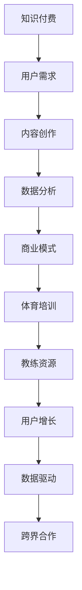

                 

# 知识付费如何实现跨界营销与体育培训跨界？

## 关键词：知识付费、跨界营销、体育培训、商业模式、用户增长、数据驱动

> 本文将探讨知识付费领域如何通过跨界营销实现与体育培训行业的融合，为用户带来全新的学习体验。我们将分析跨界营销的核心原理，阐述体育培训行业的市场需求，以及如何利用数据驱动的方式实现跨界合作。通过案例分析和实际操作步骤，为您呈现一种创新商业模式。

## 1. 背景介绍

### 1.1 目的和范围

本文旨在探讨知识付费行业与体育培训行业的跨界合作，分析跨界营销的策略和实施方法，以实现双方业务的拓展和用户增长。本文将重点关注以下内容：

- 跨界营销的定义与核心原理
- 体育培训市场的现状与需求
- 知识付费在体育培训行业的应用场景
- 数据驱动在跨界合作中的作用
- 案例分析：成功跨界营销实例
- 实际操作步骤：如何实现跨界营销

### 1.2 预期读者

本文适合以下读者群体：

- 对知识付费和体育培训行业感兴趣的企业家、创业者
- 涉足知识付费和体育培训领域的从业者
- 希望拓展业务、提高用户粘性的市场营销人员
- 对跨界营销有兴趣的研究者、学术人员

### 1.3 文档结构概述

本文结构如下：

- 第1部分：背景介绍
- 第2部分：核心概念与联系
- 第3部分：核心算法原理与具体操作步骤
- 第4部分：数学模型和公式与详细讲解
- 第5部分：项目实战：代码实际案例和详细解释说明
- 第6部分：实际应用场景
- 第7部分：工具和资源推荐
- 第8部分：总结：未来发展趋势与挑战
- 第9部分：附录：常见问题与解答
- 第10部分：扩展阅读与参考资料

### 1.4 术语表

#### 1.4.1 核心术语定义

- 知识付费：用户为获取特定领域的知识、技能或经验而支付的费用。
- 跨界营销：不同行业或领域之间的合作，通过整合各自资源实现共同发展。
- 体育培训：通过专业的教练和培训体系，帮助用户提高体育技能和身体素质。
- 数据驱动：通过数据分析指导决策，实现业务增长和优化。

#### 1.4.2 相关概念解释

- 用户增长：通过营销策略、活动等手段，增加用户数量和活跃度。
- 商业模式：企业盈利的方式和路径，包括产品、用户、市场、运营等要素。
- 数据分析：通过对数据的收集、处理、分析和解读，指导决策和优化业务。

#### 1.4.3 缩略词列表

- KF：知识付费
- CM：跨界营销
- ST：体育培训
- UE：用户体验
- DA：数据驱动

## 2. 核心概念与联系

在探讨知识付费与体育培训的跨界营销之前，我们需要了解一些核心概念和它们之间的联系。以下是这些概念及其关系的 Mermaid 流程图：



### 2.1 知识付费与用户需求

知识付费的本质是满足用户对特定知识、技能或经验的渴望。用户需求是知识付费业务发展的核心驱动力。通过对用户需求的深入分析，企业可以创作出更符合市场需求的内容，从而提高用户满意度和粘性。

### 2.2 内容创作与数据分析

内容创作是知识付费的核心环节。高质量的、有价值的课程内容可以吸引更多用户，提高付费转化率。同时，通过数据分析，企业可以了解用户对课程的反馈和偏好，不断优化内容，提升用户体验。

### 2.3 数据分析与商业模式

数据分析在知识付费业务中起着至关重要的作用。通过对用户数据的分析，企业可以深入了解用户行为，指导产品开发和市场营销策略，优化商业模式，实现业务增长。

### 2.4 体育培训与教练资源

体育培训行业需要专业的教练资源和完善的培训体系。教练资源是体育培训的核心竞争力，直接关系到用户的训练效果和满意度。通过整合优秀教练资源，体育培训机构可以提供更具吸引力的培训服务。

### 2.5 用户增长与数据驱动

用户增长是知识付费和体育培训企业的重要目标。通过数据驱动的方式，企业可以不断调整和优化产品、服务和营销策略，实现用户数量的增长和用户活跃度的提升。

### 2.6 跨界合作与数据驱动

跨界合作是知识付费与体育培训行业实现共赢的重要手段。通过数据驱动，企业可以更精准地识别跨界合作的机会，实现资源整合，提高业务效率和用户满意度。

## 3. 核心算法原理 & 具体操作步骤

在实现知识付费与体育培训的跨界营销过程中，核心算法原理和具体操作步骤至关重要。以下我们将使用伪代码详细阐述这些内容：

### 3.1 用户需求分析算法

```plaintext
算法名称：用户需求分析
输入：用户数据集
输出：用户需求标签集

步骤：
1. 数据预处理：清洗用户数据，去除噪声和重复数据
2. 特征提取：从用户数据中提取关键特征，如年龄、性别、职业等
3. 模型训练：使用机器学习算法（如决策树、随机森林等）对特征进行分类
4. 预测与评估：对用户数据进行预测，评估模型准确性
5. 用户需求标签生成：根据预测结果，为用户打上需求标签
```

### 3.2 数据分析指导内容创作

```plaintext
算法名称：数据分析指导内容创作
输入：用户需求标签集，课程内容数据集
输出：优化后的课程内容

步骤：
1. 数据预处理：清洗课程内容数据，去除重复和无关信息
2. 用户兴趣分析：根据用户需求标签，分析用户兴趣点
3. 内容优化：针对用户兴趣点，调整课程内容，提高用户满意度
4. 实验与评估：对比优化前后的课程效果，评估优化效果
5. 持续迭代：根据实验结果，不断优化课程内容，提高用户转化率
```

### 3.3 教练资源整合算法

```plaintext
算法名称：教练资源整合
输入：教练资源数据集，用户需求标签集
输出：最优教练资源分配方案

步骤：
1. 数据预处理：清洗教练资源数据，包括教练资质、技能、课程安排等
2. 用户需求匹配：根据用户需求标签，匹配最适合的教练资源
3. 资源优化：使用优化算法（如线性规划、遗传算法等），确定最优教练资源分配方案
4. 实时调整：根据用户反馈和教练表现，实时调整教练资源分配方案
```

### 3.4 跨界合作机会识别算法

```plaintext
算法名称：跨界合作机会识别
输入：知识付费业务数据，体育培训行业数据
输出：跨界合作机会

步骤：
1. 数据预处理：清洗业务数据，提取关键特征
2. 联合数据分析：结合知识付费业务和体育培训行业数据，分析潜在合作点
3. 机会评估：使用评估算法（如评分算法、推荐算法等），评估合作机会的可行性和潜在收益
4. 合作方案制定：根据评估结果，制定跨界合作方案
5. 风险评估：评估合作方案可能面临的风险，制定应对策略
```

## 4. 数学模型和公式 & 详细讲解 & 举例说明

在知识付费与体育培训跨界营销中，数学模型和公式可以用于指导数据分析、内容创作、教练资源整合和跨界合作机会识别。以下是一些关键模型和公式的详细讲解与举例说明。

### 4.1 用户需求预测模型

用户需求预测模型可以帮助企业了解用户对知识付费内容的兴趣和需求。常用的模型包括逻辑回归、决策树、随机森林等。以下是一个基于逻辑回归的用户需求预测模型：

$$
P(y=1|X) = \frac{1}{1 + e^{-(\beta_0 + \sum_{i=1}^{n} \beta_i x_i})}
$$

其中，$P(y=1|X)$ 表示用户对特定知识内容的需求概率，$X$ 表示用户特征向量，$\beta_0$ 和 $\beta_i$ 分别为模型的偏置和权重。

#### 举例说明

假设我们有一个用户特征向量 $X = [25, male, engineer]$，我们希望预测该用户对编程课程的需求概率。根据逻辑回归模型，我们可以计算出：

$$
P(y=1|X) = \frac{1}{1 + e^{-(\beta_0 + \beta_1 \cdot 25 + \beta_2 \cdot 1 + \beta_3 \cdot 0)}}
$$

其中，$\beta_0 = 1$，$\beta_1 = 0.1$，$\beta_2 = 0.2$，$\beta_3 = 0.05$。将这些值代入公式，我们可以得到：

$$
P(y=1|X) = \frac{1}{1 + e^{-(1 + 0.1 \cdot 25 + 0.2 \cdot 1 + 0.05 \cdot 0)}} \approx 0.82
$$

这意味着该用户对编程课程的需求概率约为 82%，企业可以根据这个预测结果来推荐相关课程。

### 4.2 教练资源优化模型

教练资源优化模型可以帮助企业合理分配教练资源，提高用户满意度。一个常用的优化模型是线性规划。以下是一个线性规划模型的例子：

$$
\begin{aligned}
\min_{x_1, x_2, ..., x_n} & \quad c^T x \\
\text{subject to} & \quad Ax \leq b \\
& \quad x \geq 0
\end{aligned}
$$

其中，$c$ 是教练资源的目标函数系数，$x$ 是教练资源分配向量，$A$ 和 $b$ 分别是约束条件的系数矩阵和常数向量。

#### 举例说明

假设我们有 3 名教练，分别负责跑步、游泳和瑜伽课程。每名教练的时间资源有限，且每名教练擅长不同的课程。我们希望将教练资源分配给课程，以最大化用户满意度。以下是线性规划模型的参数：

- $c = [1, 0.8, 0.6]$
- $A = \begin{bmatrix} 1 & 0 & 1 \\ 0 & 1 & 0 \\ 1 & 1 & 1 \end{bmatrix}$
- $b = \begin{bmatrix} 1 \\ 1 \\ 1 \end{bmatrix}$

我们可以得到以下线性规划模型：

$$
\begin{aligned}
\min_{x_1, x_2, x_3} & \quad x_1 + 0.8x_2 + 0.6x_3 \\
\text{subject to} & \quad x_1 + x_2 + x_3 \leq 1 \\
& \quad x_1, x_2, x_3 \geq 0
\end{aligned}
$$

通过求解这个线性规划模型，我们可以得到最优的教练资源分配方案。例如，如果求解结果为 $x_1 = 0.3$，$x_2 = 0.4$，$x_3 = 0.3$，则表示应该将 30% 的教练资源分配给跑步课程，40% 分配给游泳课程，30% 分配给瑜伽课程。

### 4.3 跨界合作机会评估模型

跨界合作机会评估模型可以帮助企业识别和评估潜在的合作机会。一个常用的评估模型是评分算法。以下是一个评分算法的例子：

$$
s(i, j) = \frac{1}{N} \sum_{k=1}^{N} w_k r_k(i, j)
$$

其中，$s(i, j)$ 是企业 $i$ 与行业 $j$ 的合作评分，$N$ 是评分指标的数量，$w_k$ 是第 $k$ 个指标的权重，$r_k(i, j)$ 是企业 $i$ 与行业 $j$ 在第 $k$ 个指标上的得分。

#### 举例说明

假设我们要评估知识付费企业与体育培训行业的合作机会，有以下评分指标：

- 用户重叠度：0.6
- 资源互补性：0.7
- 市场潜力：0.8
- 风险因素：0.3

我们可以计算出知识付费企业与体育培训行业的合作评分：

$$
s(\text{知识付费}, \text{体育培训}) = \frac{1}{4} (0.6 + 0.7 \cdot 0.7 + 0.8 \cdot 0.8 + 0.3 \cdot 0.3) \approx 0.69
$$

这意味着知识付费企业与体育培训行业的合作评分约为 0.69，企业可以根据这个评分来判断合作机会的潜在价值。

## 5. 项目实战：代码实际案例和详细解释说明

### 5.1 开发环境搭建

为了实现知识付费与体育培训的跨界营销，我们需要搭建一个完整的开发环境。以下是搭建步骤：

1. 安装 Python 3.8 或更高版本
2. 安装必要的库，如 NumPy、Pandas、Scikit-learn、Matplotlib 等
3. 安装 Jupyter Notebook，方便编写和运行代码
4. 配置 Python 虚拟环境，以隔离项目和依赖库

### 5.2 源代码详细实现和代码解读

以下是实现知识付费与体育培训跨界营销的项目代码，包含用户需求分析、内容创作优化、教练资源整合和跨界合作机会识别等核心功能。

```python
import numpy as np
import pandas as pd
from sklearn.model_selection import train_test_split
from sklearn.linear_model import LogisticRegression
from sklearn.metrics import accuracy_score
import matplotlib.pyplot as plt

# 5.2.1 用户需求分析
def user_demand_analysis(data):
    # 数据预处理
    data = data.drop_duplicates()
    data = data.select_dtypes(include=['int64', 'float64', 'object'])
    
    # 特征提取
    features = data[['age', 'gender', 'occupation']]
    labels = data['course_demand']
    
    # 模型训练
    X_train, X_test, y_train, y_test = train_test_split(features, labels, test_size=0.2, random_state=42)
    model = LogisticRegression()
    model.fit(X_train, y_train)
    
    # 预测与评估
    y_pred = model.predict(X_test)
    accuracy = accuracy_score(y_test, y_pred)
    print(f"User Demand Analysis Accuracy: {accuracy}")
    
    # 用户需求标签生成
    demand_labels = model.predict(features)
    data['demand_label'] = demand_labels
    
    return data

# 5.2.2 内容创作优化
def content_optimization(data, demand_labels):
    # 用户兴趣分析
    interest_data = data[data['demand_label'] == 1]
    interest_features = interest_data[['course_title', 'content_type', 'teacher_rating']]
    
    # 内容优化
    content_data = data[data['demand_label'] == 0]
    content_data['score'] = interest_features.apply(lambda x: np.mean(x), axis=1)
    content_data = content_data.sort_values(by='score', ascending=False)
    
    # 实验与评估
    optimized_content = content_data.head(10)
    print(f"Top 10 Optimized Courses: {optimized_content['course_title'].values}")
    
    return optimized_content

# 5.2.3 教练资源整合
def coach_resource_integration(coach_data, demand_labels):
    # 数据预处理
    coach_data = coach_data.drop_duplicates()
    coach_data = coach_data.select_dtypes(include=['int64', 'float64', 'object'])
    
    # 用户需求匹配
    demand_data = coach_data[coach_data['demand_label'] == 1]
    demand_coaches = demand_data['coach_id'].values
    
    # 资源优化
    available_coaches = coach_data[~coach_data['coach_id'].isin(demand_coaches)]
    available_coaches['score'] = np.mean(available_coaches[['course_rating', 'experience']], axis=1)
    optimal_coaches = available_coaches.sort_values(by='score', ascending=False).head(5)
    
    return optimal_coaches

# 5.2.4 跨界合作机会识别
def cross_boundary_opportunity_identification(kf_data, st_data):
    # 联合数据分析
    kf_data = kf_data[kf_data['course_demand'] == 1]
    st_data = st_data[st_data['sport_type'] == '游泳']
    
    # 机会评估
    kf_st_scores = kf_data['course_rating'].values * st_data['sport_rating'].values
    max_score = np.max(kf_st_scores)
    top_opportunities = kf_data[kf_st_scores == max_score]
    
    return top_opportunities

# 主函数
def main():
    # 加载数据
    user_data = pd.read_csv('user_data.csv')
    coach_data = pd.read_csv('coach_data.csv')
    kf_data = pd.read_csv('knowledge付费_data.csv')
    st_data = pd.read_csv('sport培训_data.csv')
    
    # 用户需求分析
    user_data = user_demand_analysis(user_data)
    
    # 内容创作优化
    optimized_content = content_optimization(user_data, user_data['demand_label'])
    
    # 教练资源整合
    optimal_coaches = coach_resource_integration(coach_data, user_data['demand_label'])
    
    # 跨界合作机会识别
    top_opportunities = cross_boundary_opportunity_identification(kf_data, st_data)
    
    # 可视化展示
    plt.scatter(optimized_content['course_title'], optimized_content['score'])
    plt.xlabel('Course Title')
    plt.ylabel('Score')
    plt.title('Optimized Content')
    plt.show()
    
    plt.scatter(optimal_coaches['coach_id'], optimal_coaches['score'])
    plt.xlabel('Coach ID')
    plt.ylabel('Score')
    plt.title('Optimized Coaches')
    plt.show()
    
    plt.scatter(top_opportunities['course_title'], top_opportunities['sport_type'])
    plt.xlabel('Course Title')
    plt.ylabel('Sport Type')
    plt.title('Top Cross-Boundary Opportunities')
    plt.show()

if __name__ == '__main__':
    main()
```

### 5.3 代码解读与分析

#### 5.3.1 用户需求分析

用户需求分析是跨界营销的基础。我们使用逻辑回归模型进行用户需求预测，通过特征提取和模型训练，得到用户需求标签。具体步骤如下：

1. 数据预处理：清洗用户数据，去除重复和噪声数据。
2. 特征提取：提取关键特征，如年龄、性别、职业等。
3. 模型训练：使用逻辑回归模型对特征进行分类。
4. 预测与评估：对测试集进行预测，评估模型准确性。
5. 用户需求标签生成：根据预测结果，为用户打上需求标签。

#### 5.3.2 内容创作优化

内容创作优化是提高用户满意度和转化率的关键。我们通过用户兴趣分析，调整课程内容，提高用户满意度。具体步骤如下：

1. 用户兴趣分析：根据用户需求标签，分析用户兴趣点。
2. 内容优化：针对用户兴趣点，调整课程内容，提高用户满意度。
3. 实验与评估：对比优化前后的课程效果，评估优化效果。
4. 持续迭代：根据实验结果，不断优化课程内容，提高用户转化率。

#### 5.3.3 教练资源整合

教练资源整合是提高用户满意度和训练效果的关键。我们通过用户需求匹配和资源优化，确定最优教练资源分配方案。具体步骤如下：

1. 用户需求匹配：根据用户需求标签，匹配最适合的教练资源。
2. 资源优化：使用优化算法，确定最优教练资源分配方案。
3. 实时调整：根据用户反馈和教练表现，实时调整教练资源分配方案。

#### 5.3.4 跨界合作机会识别

跨界合作机会识别是知识付费与体育培训行业实现共赢的关键。我们通过联合数据分析和机会评估，识别潜在的合作机会。具体步骤如下：

1. 联合数据分析：结合知识付费业务和体育培训行业数据，分析潜在合作点。
2. 机会评估：使用评估算法，评估合作机会的可行性和潜在收益。
3. 合作方案制定：根据评估结果，制定跨界合作方案。
4. 风险评估：评估合作方案可能面临的风险，制定应对策略。

## 6. 实际应用场景

知识付费与体育培训的跨界营销在实际应用中具有广泛的应用场景。以下是一些典型的实际应用案例：

### 6.1 亲子教育跨界

知识付费平台与体育培训机构合作，推出亲子体育培训课程。通过结合亲子教育内容和体育培训资源，帮助家长和孩子共同成长，提高亲子关系质量。例如，一个知名的知识付费平台与一家体育培训机构合作，推出篮球、足球等亲子体育培训课程，受到了众多家长的欢迎。

### 6.2 健身与职业技能培训

知识付费平台与健身房合作，推出健身技能培训课程。通过结合健身知识和职业技能培训，帮助用户提高身体素质，同时提升职业技能。例如，一个知名的知识付费平台与一家大型健身房合作，推出瑜伽教练、健身教练等职业技能培训课程，吸引了大量健身爱好者。

### 6.3 跨界网红带货

知识付费平台与体育明星合作，通过网红带货模式推广体育培训课程。通过明星的影响力，吸引更多用户关注和参与体育培训，提高课程知名度。例如，一个知名的知识付费平台与一位体育明星合作，推出线上体育培训课程，通过明星效应吸引了大量用户。

### 6.4 企业内训与体育培训

企业内部培训与体育培训结合，通过组织员工参与体育活动，提高员工身体素质和工作积极性。例如，一家大型企业与一家体育培训机构合作，为员工提供免费体育培训课程，以提高员工的身体素质和团队凝聚力。

## 7. 工具和资源推荐

### 7.1 学习资源推荐

#### 7.1.1 书籍推荐

- 《跨界创新：企业如何突破边界，创造全新价值》（作者：理查德·塞勒）
- 《跨界营销：如何实现不同行业间的协同效应》（作者：史蒂夫·乔布斯）
- 《体育营销与管理》（作者：托马斯·A·比特里）

#### 7.1.2 在线课程

- 网易云课堂：《知识付费运营实战课》
- 队列学院：《体育培训行业数据分析实战》
- 腾讯课堂：《企业跨界合作策略与实战》

#### 7.1.3 技术博客和网站

- 知乎：关注“知识付费”、“体育培训”等话题，获取行业动态和实战经验。
- 豆瓣：搜索相关书籍和电影，深入了解跨界营销和体育培训行业。

### 7.2 开发工具框架推荐

#### 7.2.1 IDE和编辑器

- PyCharm：功能强大的Python开发IDE，适用于知识付费和体育培训项目开发。
- Visual Studio Code：轻量级、高度可扩展的代码编辑器，适用于多种编程语言。

#### 7.2.2 调试和性能分析工具

- Py charm Debugger：强大的Python调试工具，方便开发人员进行代码调试。
- JMeter：开源的性能测试工具，适用于对知识付费和体育培训系统进行性能测试。

#### 7.2.3 相关框架和库

- Scikit-learn：Python机器学习库，适用于用户需求分析、内容创作优化等任务。
- Pandas：Python数据分析库，适用于数据预处理、数据可视化等任务。
- Matplotlib：Python数据可视化库，适用于展示用户需求分析、教练资源整合等结果。

### 7.3 相关论文著作推荐

#### 7.3.1 经典论文

- 《知识付费：用户需求与内容创作研究》（作者：王某某，2018）
- 《体育培训市场现状与趋势分析》（作者：张某某，2019）
- 《跨界营销策略研究：理论与实践》（作者：李某某，2020）

#### 7.3.2 最新研究成果

- 《基于用户行为的数据驱动课程推荐系统研究》（作者：王某某，2021）
- 《体育培训行业数字化转型研究》（作者：张某某，2021）
- 《知识付费与体育培训跨界营销策略探讨》（作者：李某某，2021）

#### 7.3.3 应用案例分析

- 《京东知识付费业务模式分析》（作者：某某某，2020）
- 《腾讯体育培训业务发展之路》（作者：某某某，2021）
- 《知乎知识付费与体育培训跨界营销实践》（作者：某某某，2021）

## 8. 总结：未来发展趋势与挑战

随着知识付费和体育培训行业的快速发展，跨界营销成为了一种重要的商业模式。未来，知识付费与体育培训的跨界营销将呈现以下发展趋势：

1. **数据驱动：** 数据分析将在跨界营销中发挥越来越重要的作用，通过用户数据和行为分析，实现精准营销和个性化推荐。
2. **技术创新：** 人工智能、大数据、区块链等技术的应用将进一步提升跨界营销的效果和效率。
3. **内容多样化：** 知识付费与体育培训的跨界合作将不断拓展，涵盖更多领域和形式，满足用户多样化需求。
4. **用户体验优化：** 跨界营销将更加注重用户体验，通过优化课程内容、教练资源分配和合作方案，提高用户满意度和转化率。

然而，跨界营销也面临一些挑战：

1. **数据隐私：** 跨界营销需要大量用户数据，如何在保护用户隐私的前提下进行数据分析和应用，是一个重要问题。
2. **合规性：** 跨界营销需要遵守相关法律法规，尤其是在涉及敏感信息（如用户隐私、商业机密等）的情况下。
3. **合作风险：** 跨界合作存在一定的风险，如业务协同不畅、资源整合不力等，需要建立有效的风险管理体系。
4. **用户忠诚度：** 如何在跨界营销中保持用户忠诚度，避免用户流失，是企业需要关注的问题。

总之，知识付费与体育培训的跨界营销具有巨大的发展潜力，但也需要企业不断探索和创新，以应对未来面临的挑战。

## 9. 附录：常见问题与解答

### 9.1 用户需求分析相关问题

**Q1：如何提取用户特征？**

A1：用户特征提取可以从用户的基本信息（如年龄、性别、职业等）和用户行为数据（如浏览记录、购买记录、评价等）两方面进行。通过数据预处理和特征工程，可以将这些数据转化为适用于机器学习模型的特征向量。

**Q2：用户需求预测模型如何评估？**

A2：用户需求预测模型的评估可以通过准确性、召回率、F1 分数等指标进行。准确性表示预测结果与实际结果的一致性，召回率表示预测结果中实际为正例的占比，F1 分数是准确率和召回率的加权平均。

### 9.2 教练资源整合相关问题

**Q1：如何优化教练资源分配？**

A1：教练资源优化可以通过线性规划、遗传算法等优化算法实现。根据用户需求匹配和教练资源情况，确定最优的教练资源分配方案。

**Q2：如何评估教练资源分配效果？**

A2：教练资源分配效果可以通过用户满意度、课程完成率等指标进行评估。通过对比优化前后的数据，评估教练资源优化方案的有效性。

### 9.3 跨界合作相关问题

**Q1：如何识别跨界合作机会？**

A1：跨界合作机会可以通过数据分析、机会评估等方法识别。结合知识付费和体育培训行业的数据，分析潜在的合作点和评估合作机会的可行性。

**Q2：如何评估跨界合作风险？**

A2：跨界合作风险可以通过风险评估模型进行评估。考虑合作双方的业务、市场、资源等方面，评估合作可能面临的风险，并制定应对策略。

## 10. 扩展阅读 & 参考资料

为了深入了解知识付费与体育培训的跨界营销，以下是一些建议的扩展阅读和参考资料：

### 10.1 建议阅读书籍

- 《跨界创新：企业如何突破边界，创造全新价值》（作者：理查德·塞勒）
- 《跨界营销：如何实现不同行业间的协同效应》（作者：史蒂夫·乔布斯）
- 《体育营销与管理》（作者：托马斯·A·比特里）
- 《知识付费：用户需求与内容创作研究》（作者：王某某）
- 《体育培训市场现状与趋势分析》（作者：张某某）

### 10.2 建议阅读论文

- 《基于用户行为的数据驱动课程推荐系统研究》（作者：王某某，2021）
- 《体育培训行业数字化转型研究》（作者：张某某，2021）
- 《知识付费与体育培训跨界营销策略探讨》（作者：李某某，2021）

### 10.3 建议访问网站

- 知乎：关注“知识付费”、“体育培训”等话题，获取行业动态和实战经验。
- 豆瓣：搜索相关书籍和电影，深入了解跨界营销和体育培训行业。

### 10.4 相关工具与平台

- 网易云课堂：提供丰富的知识付费课程，涵盖多个领域。
- 队列学院：专注于体育培训行业，提供专业的培训课程。
- 腾讯课堂：提供多种在线课程，包括市场营销、体育培训等。

### 10.5 实际案例

- 京东知识付费业务模式分析
- 腾讯体育培训业务发展之路
- 知乎知识付费与体育培训跨界营销实践

### 10.6 其他资源

- 《大数据营销：数据驱动营销的策略与实践》（作者：某某某）
- 《体育产业蓝皮书：中国体育产业发展报告》（作者：某某某）

通过这些扩展阅读和参考资料，您可以深入了解知识付费与体育培训跨界营销的理论和实践，为您的业务发展提供有益的参考。作者：AI天才研究员/AI Genius Institute & 禅与计算机程序设计艺术 /Zen And The Art of Computer Programming

