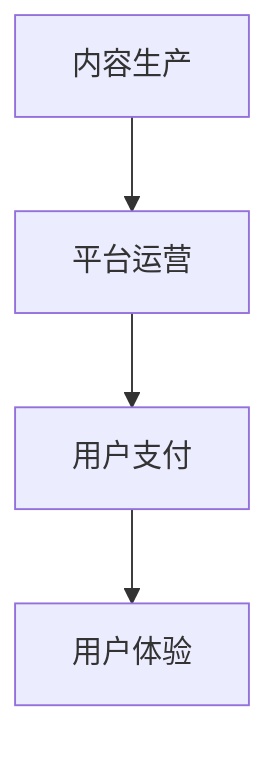
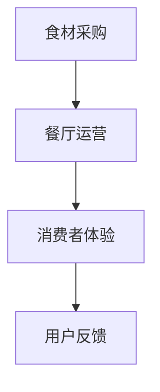
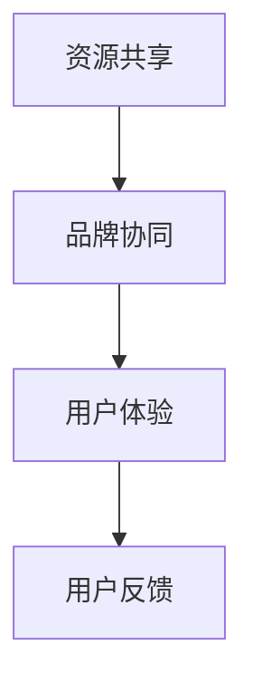
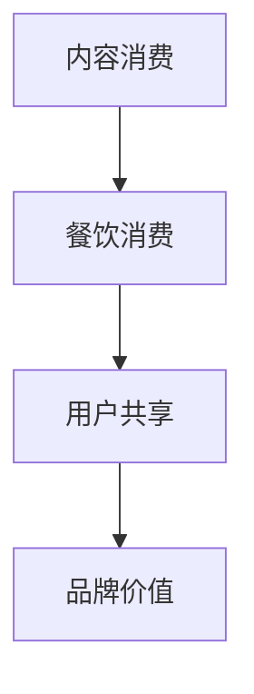

                 

### 1. 背景介绍

#### 1.1 目的和范围

本文旨在探讨知识付费领域如何实现跨界营销，特别是与餐饮美食行业的结合。通过深入研究两者之间的内在联系和相互作用机制，本文将分析知识付费和餐饮美食跨界营销的理论基础、实际操作步骤以及成功案例，为相关从业者和研究者提供有益的参考。

本文主要涉及以下范围：

1. **知识付费的概念与市场现状**：介绍知识付费的基本概念、发展历程及当前市场状况。
2. **餐饮美食行业的特点与发展趋势**：分析餐饮美食行业的市场规模、消费习惯及未来发展趋势。
3. **跨界营销的定义与案例分析**：阐述跨界营销的概念及其在知识付费和餐饮美食领域的具体应用。
4. **知识付费与餐饮美食跨界营销的机理**：探讨两者跨界结合的理论基础、优势与挑战。
5. **具体操作步骤与策略**：提出实现知识付费与餐饮美食跨界营销的具体步骤与策略。
6. **项目实战与案例分析**：通过具体案例展示跨界营销的成功实践及其效果。
7. **未来发展趋势与挑战**：总结未来知识付费与餐饮美食跨界营销的发展趋势及面临的主要挑战。

#### 1.2 预期读者

本文预期读者包括但不限于：

1. **知识付费平台运营者与开发者**：希望通过本文了解跨界营销的方法与策略，提升平台的用户黏性与市场竞争力。
2. **餐饮美食行业从业者**：希望了解知识付费与餐饮美食结合的新模式，探索跨界营销的机会。
3. **市场营销专业师生**：希望通过本文学习跨界营销的理论与实践。
4. **跨界营销爱好者**：对知识付费与餐饮美食跨界营销有兴趣的读者。

#### 1.3 文档结构概述

本文结构如下：

1. **背景介绍**：介绍文章的目的、范围、预期读者及文档结构。
2. **核心概念与联系**：介绍知识付费与餐饮美食跨界营销的核心概念，使用Mermaid流程图展示内在联系。
3. **核心算法原理 & 具体操作步骤**：讲解实现跨界营销的核心算法原理及操作步骤，使用伪代码进行详细阐述。
4. **数学模型和公式 & 详细讲解 & 举例说明**：介绍数学模型及其详细讲解，结合实例进行说明。
5. **项目实战：代码实际案例和详细解释说明**：通过实际项目案例，展示跨界营销的实现过程及效果分析。
6. **实际应用场景**：分析知识付费与餐饮美食跨界营销在不同领域的实际应用场景。
7. **工具和资源推荐**：推荐学习资源、开发工具框架及相关论文著作。
8. **总结：未来发展趋势与挑战**：总结未来发展趋势及面临的主要挑战。
9. **附录：常见问题与解答**：提供常见问题及解答。
10. **扩展阅读 & 参考资料**：列出相关扩展阅读资料。

#### 1.4 术语表

为了确保文章内容的专业性和一致性，本文将采用以下术语表：

#### 1.4.1 核心术语定义

1. **知识付费**：指用户为获取特定知识或技能，通过支付费用获得使用权或受益权的商业模式。
2. **跨界营销**：指不同领域或行业之间的合作与营销，通过整合资源、互补优势，实现共赢。
3. **餐饮美食行业**：指以提供餐饮服务为主，涉及食品制作、餐饮服务、餐饮品牌营销等多个环节的行业。
4. **用户体验**：指用户在使用产品或服务过程中所感受到的整体体验，包括满意度、便利性、满意度等。

#### 1.4.2 相关概念解释

1. **内容付费**：内容付费是知识付费的一种形式，指用户为获取优质内容，通过支付费用获得使用权。
2. **O2O模式**：线上线下结合（Online-to-Offline），指将线上平台与线下服务相结合，实现线上引流、线下服务的模式。
3. **用户转化率**：指在一定时间内，从接触到最终转化的用户占比，衡量营销效果的重要指标。

#### 1.4.3 缩略词列表

- KF：知识付费
- CR：跨界营销
- RM：餐饮美食行业
- UX：用户体验
- O2O：线上线下结合

### 2. 核心概念与联系

在深入探讨知识付费与餐饮美食跨界营销之前，我们需要明确几个核心概念，并了解它们之间的联系。以下将使用Mermaid流程图展示这些概念及其相互关系。

#### 2.1 知识付费的核心概念

知识付费主要包括以下几个核心概念：

1. **内容生产**：指知识创作者或机构通过撰写文章、制作视频、提供课程等形式，生产出有价值的内容。
2. **平台运营**：指知识付费平台通过提供技术支持、内容审核、用户服务等功能，为知识创作者和用户提供一个良好的交互环境。
3. **用户支付**：指用户为获取知识付费内容，通过支付一定费用来购买使用权或受益权。



#### 2.2 餐饮美食行业的主要概念

餐饮美食行业涉及以下核心概念：

1. **食材采购**：指从市场上采购各种食材，确保餐饮服务的质量与安全。
2. **餐厅运营**：指通过经营管理、客户服务、营销推广等手段，实现餐厅的持续盈利。
3. **消费者体验**：指消费者在餐厅消费过程中所感受到的整体体验，包括食物口感、服务质量、环境氛围等。



#### 2.3 跨界营销的概念与联系

跨界营销是知识付费与餐饮美食行业结合的重要手段，其核心概念包括：

1. **资源共享**：指知识付费平台和餐饮美食行业通过合作，共享各自的资源，如用户、内容、渠道等，实现互利共赢。
2. **品牌协同**：指通过联合品牌推广，提升双方的品牌知名度和影响力。
3. **用户体验**：跨界营销的最终目的是提升用户的整体体验，通过整合知识付费和餐饮美食的优质资源，为用户带来独特的消费体验。



#### 2.4 知识付费与餐饮美食跨界营销的内在联系

知识付费与餐饮美食跨界营销的内在联系主要体现在以下几个方面：

1. **内容消费与餐饮消费的结合**：用户在享受知识付费内容的同时，可以享受到餐饮美食的服务，实现消费场景的延伸。
2. **用户群体的共享**：知识付费用户和餐饮美食消费者之间存在一定的重叠，通过跨界营销可以扩大用户群体，提高用户黏性。
3. **品牌价值的提升**：知识付费平台和餐饮美食品牌通过跨界合作，可以相互提升品牌价值，吸引更多的用户关注和参与。



通过以上Mermaid流程图的展示，我们可以清晰地看到知识付费与餐饮美食跨界营销的核心概念及其相互联系。在接下来的章节中，我们将进一步探讨这些概念的具体应用和实践方法。希望读者能够通过这篇文章，对知识付费与餐饮美食跨界营销有一个全面而深入的了解。

### 2.1 知识付费的核心概念

知识付费作为现代社会的一种新兴商业模式，正逐渐改变着信息传播和消费模式。其核心概念主要包括内容生产、平台运营和用户支付等方面。以下将详细阐述这些概念及其具体实现方式。

#### 内容生产

内容生产是知识付费的基础，主要涉及知识创作者或机构通过撰写文章、制作视频、提供课程等形式，生产出有价值的内容。具体实现方式包括：

1. **内容创作**：知识创作者需根据市场需求和用户痛点，制定内容创作计划，选择合适的主题和形式，如文章、视频、音频、直播等。内容创作过程中，要注重内容的原创性、实用性和趣味性。
   
   ```mermaid
   graph TD
   A[选题规划] --> B[内容创作]
   B --> C[内容审核]
   ```

2. **内容审核**：内容生产完成后，需经过严格的内容审核，确保内容的真实性、合法性和合规性。平台运营者需制定审核标准，设立专门的审核团队，对内容进行多维度审核。

   ```mermaid
   graph TD
   D[内容审核] --> E[内容发布]
   ```

3. **内容更新**：为保持内容的时效性和吸引力，知识创作者需定期更新内容，通过持续输出优质内容，提升用户的黏性和忠诚度。

   ```mermaid
   graph TD
   F[内容更新] --> G[内容优化]
   ```

#### 平台运营

平台运营是知识付费顺利实施的关键，主要涉及技术支持、内容审核、用户服务等方面。具体实现方式包括：

1. **技术支持**：知识付费平台需提供稳定、高效的技术支持，确保用户在访问、学习内容时能够获得良好的体验。技术支持包括服务器维护、数据存储、安全防护等。

   ```mermaid
   graph TD
   H[服务器维护] --> I[数据存储]
   I --> J[安全防护]
   ```

2. **内容审核**：平台需设立内容审核机制，对上传的内容进行审核，确保内容的真实性、合法性和合规性。内容审核包括人工审核和机器审核相结合，提高审核效率和准确性。

   ```mermaid
   graph TD
   K[人工审核] --> L[机器审核]
   ```

3. **用户服务**：平台需提供全面的用户服务，包括用户注册、登录、支付、学习、反馈等。用户服务需注重用户体验，提供便捷、高效、贴心的服务，提升用户满意度。

   ```mermaid
   graph TD
   M[用户注册] --> N[用户登录]
   N --> O[支付方式]
   O --> P[学习路径]
   P --> Q[用户反馈]
   ```

#### 用户支付

用户支付是知识付费的核心环节，主要涉及支付方式、支付流程、支付安全等方面。具体实现方式包括：

1. **支付方式**：平台需提供多样化的支付方式，满足不同用户的需求。常见的支付方式包括信用卡、支付宝、微信支付、银行卡支付等。

   ```mermaid
   graph TD
   R[信用卡] --> S[支付宝]
   S --> T[微信支付]
   T --> U[银行卡支付]
   ```

2. **支付流程**：用户在购买知识付费内容时，需按照平台规定的支付流程完成支付。支付流程包括选择支付方式、输入支付密码、确认支付等环节。

   ```mermaid
   graph TD
   V[选择支付方式] --> W[输入支付密码]
   W --> X[确认支付]
   ```

3. **支付安全**：平台需确保支付过程的安全，防止用户支付信息泄露。支付安全包括数据加密、支付接口保护、风险监控等。

   ```mermaid
   graph TD
   Y[数据加密] --> Z[支付接口保护]
   Z --> AA[风险监控]
   ```

通过以上对知识付费核心概念的阐述，我们可以看到，知识付费的实现涉及多个环节，需要平台、创作者和用户之间的紧密合作。在接下来的章节中，我们将进一步探讨知识付费与餐饮美食行业的跨界营销，以及如何实现两者的有机结合。

### 2.2 餐饮美食行业的主要概念

餐饮美食行业是现代社会中重要的服务业之一，涵盖了从食材采购、餐厅运营到消费者体验等多个环节。以下是关于餐饮美食行业主要概念的详细描述。

#### 食材采购

食材采购是餐饮美食行业的基础环节，直接影响餐厅的食物质量和成本控制。主要涉及以下方面：

1. **供应商选择**：餐厅需选择信誉良好、质量稳定的供应商，确保食材的新鲜度和安全性。
   
   ```mermaid
   graph TD
   A[供应商选择] --> B[食材质量]
   ```

2. **采购计划**：餐厅根据菜单和库存情况，制定采购计划，确保食材的充足和供应的稳定性。
   
   ```mermaid
   graph TD
   C[采购计划] --> D[库存管理]
   ```

3. **采购流程**：采购流程包括询价、比价、谈判、下单、收货等环节，确保采购过程的规范和效率。

   ```mermaid
   graph TD
   E[询价] --> F[比价]
   F --> G[谈判]
   G --> H[下单]
   H --> I[收货]
   ```

#### 餐厅运营

餐厅运营是餐饮美食行业的核心环节，涉及经营管理、客户服务、营销推广等多个方面。主要涉及以下方面：

1. **人员管理**：餐厅需建立完善的人力资源管理体系，包括招聘、培训、绩效评估等，确保员工的专业素养和服务水平。
   
   ```mermaid
   graph TD
   J[招聘] --> K[培训]
   K --> L[绩效评估]
   ```

2. **服务流程**：餐厅需制定规范的服务流程，包括迎宾、点餐、上菜、结账等，确保服务的顺畅和满意度。
   
   ```mermaid
   graph TD
   M[迎宾] --> N[点餐]
   N --> O[上菜]
   O --> P[结账]
   ```

3. **营销推广**：餐厅需通过线上和线下多种渠道进行营销推广，提高品牌知名度和影响力，吸引更多消费者。
   
   ```mermaid
   graph TD
   Q[线上推广] --> R[线下推广]
   ```

#### 消费者体验

消费者体验是餐饮美食行业的终极目标，直接影响消费者的满意度和复购率。主要涉及以下方面：

1. **菜品质量**：餐厅需注重菜品质量，确保食材新鲜、烹饪手法精湛、口感优良。
   
   ```mermaid
   graph TD
   S[食材新鲜] --> T[烹饪手法]
   ```

2. **服务质量**：餐厅需提供优质的服务，包括热情、周到、专业的服务态度，以及迅速、准确的服务响应。
   
   ```mermaid
   graph TD
   U[服务态度] --> V[服务响应]
   ```

3. **环境氛围**：餐厅需营造良好的环境氛围，包括装修风格、音乐选择、照明设计等，提升消费者的整体体验。
   
   ```mermaid
   graph TD
   W[装修风格] --> X[音乐选择]
   X --> Y[照明设计]
   ```

通过以上对餐饮美食行业主要概念的阐述，我们可以看到，餐饮美食行业的成功离不开各个环节的紧密协作和精细管理。在接下来的章节中，我们将探讨知识付费与餐饮美食行业的跨界营销，以及如何实现两者的有机结合。

### 2.3 跨界营销的定义与案例分析

#### 跨界营销的定义

跨界营销是指不同领域或行业之间的合作与营销，通过整合资源、互补优势，实现共赢。这种营销方式打破了传统行业的界限，将不同领域的元素、理念、技术和资源进行融合，从而创造出新的市场机会和商业模式。跨界营销的核心在于找到目标用户群体的共同需求，通过跨界合作满足这些需求，提升品牌的认知度和用户黏性。

#### 跨界营销的案例分析

在知识付费和餐饮美食领域，跨界营销已经取得了显著的成功。以下是一些典型的案例：

1. **网易云课堂与喜茶的合作**：

   网易云课堂是一家知名的知识付费平台，主要提供在线课程和学习资源。为了提升品牌影响力，吸引年轻用户，网易云课堂与喜茶——一家知名的新式茶饮品牌进行了跨界合作。双方推出了“喜茶×网易云课堂”联名课程，用户购买喜茶时可以获得网易云课堂的优惠券，而网易云课堂的用户也可以通过参与活动获得喜茶的小礼品。这种跨界合作不仅拓宽了双方的客户群体，还提升了品牌的认知度和用户黏性。

   ```mermaid
   graph TD
   A[网易云课堂] --> B[喜茶]
   B --> C[用户共享]
   ```

2. **得到App与海底捞的合作**：

   得到App是一家知名的知识付费平台，主要提供优质的内容和服务。海底捞是一家知名的中式火锅品牌，以其优质的服务和口味受到消费者的喜爱。为了提升用户体验，得到App与海底捞合作，推出了“海底捞×得到App”联名套餐。用户在海底捞消费时，可以通过扫码获得得到App的优惠券，同时海底捞的会员也可以享受得到App的部分课程优惠。这种跨界合作不仅提升了用户的整体体验，还增加了双方的客户黏性。

   ```mermaid
   graph TD
   D[得到App] --> E[海底捞]
   E --> F[用户体验]
   ```

3. **京东教育与肯德基的合作**：

   京东教育是一家在线教育平台，提供各类职业技能培训课程。肯德基是一家全球知名的快餐品牌。为了吸引更多的年轻用户，京东教育与肯德基合作，推出了“京东教育×肯德基”联名套餐。用户在肯德基消费时，可以通过扫码获得京东教育的优惠券，而京东教育的用户也可以通过参加肯德基的线上活动获得小礼品。这种跨界合作不仅拓宽了双方的客户群体，还提升了品牌的知名度和用户黏性。

   ```mermaid
   graph TD
   G[京东教育] --> H[肯德基]
   H --> I[用户共享]
   ```

通过以上案例，我们可以看到，知识付费与餐饮美食跨界营销的成功，关键在于找到双方共同的需求和目标用户群体，通过资源整合和互补优势，实现共赢。在接下来的章节中，我们将进一步探讨知识付费与餐饮美食跨界营销的理论基础、优势与挑战。

### 2.4 知识付费与餐饮美食跨界营销的机理

#### 理论基础

知识付费与餐饮美食跨界营销的理论基础主要包括消费者行为理论、品牌延伸理论和跨界营销理论。

1. **消费者行为理论**：

   消费者行为理论强调消费者在购买决策过程中所受到的各种因素的影响。在知识付费与餐饮美食跨界营销中，消费者行为理论的应用体现在以下几个方面：

   - **需求满足**：消费者在购买知识付费产品时，主要需求是获取新知识、提升技能或解决特定问题。通过跨界营销，餐饮美食行业可以满足消费者在知识消费过程中的额外需求，如用餐体验、社交互动等，从而提升整体满意度。
   - **消费心理**：消费者在购买知识付费产品时，不仅考虑产品的实用性，还受到心理因素的影响，如品牌形象、消费体验等。跨界营销可以通过品牌联合，增强消费者的品牌认知和情感连接，从而提升购买意愿。
   - **消费习惯**：消费者在餐饮消费过程中，具有一定的消费习惯和偏好。跨界营销可以通过引入新的消费模式，改变消费者的消费习惯，从而扩大市场份额。

2. **品牌延伸理论**：

   品牌延伸理论是指企业在现有品牌的基础上，推出新的产品或服务，以扩大品牌的影响力和市场份额。在知识付费与餐饮美食跨界营销中，品牌延伸理论的应用体现在以下几个方面：

   - **品牌拓展**：知识付费平台和餐饮美食品牌通过跨界合作，可以相互借助对方的品牌影响力，拓展市场范围。例如，知识付费平台可以通过与知名餐饮品牌合作，吸引更多的用户关注，而餐饮品牌也可以借助知识付费平台的资源，提升品牌知名度和美誉度。
   - **品牌提升**：跨界营销可以提升双方的品牌价值。知识付费平台通过引入餐饮美食元素，提升品牌的生活化和实用性，而餐饮美食品牌通过引入知识付费元素，提升品牌的品质感和专业性，从而实现品牌价值的双提升。
   - **品牌差异化**：跨界营销可以帮助企业在竞争激烈的市场中实现差异化。通过跨界合作，知识付费平台和餐饮美食品牌可以打造独特的消费体验，满足消费者的个性化需求，从而在市场中脱颖而出。

3. **跨界营销理论**：

   跨界营销理论强调不同领域或行业之间的合作与整合，以实现资源共享、优势互补和共赢。在知识付费与餐饮美食跨界营销中，跨界营销理论的应用体现在以下几个方面：

   - **资源共享**：知识付费平台和餐饮美食品牌可以通过跨界合作，共享资源，如用户、渠道、技术等。例如，知识付费平台可以通过与餐饮品牌合作，共享用户资源，扩大用户基础；餐饮品牌可以通过与知识付费平台合作，共享渠道资源，提升销售业绩。
   - **优势互补**：知识付费平台和餐饮美食品牌各自拥有独特的优势和资源，通过跨界合作，可以实现优势互补，提升整体竞争力。例如，知识付费平台可以通过提供专业知识和技能培训，提升餐饮从业者的专业素养；餐饮品牌可以通过提供优质的餐饮服务和产品，提升用户的用餐体验。
   - **共赢目标**：跨界营销的目标是实现双方共赢，通过跨界合作，知识付费平台和餐饮美食品牌可以实现共同的发展目标。例如，通过跨界营销，知识付费平台可以获得更多的用户和收入，而餐饮品牌也可以提升品牌知名度和市场竞争力。

#### 优势

知识付费与餐饮美食跨界营销具有以下优势：

1. **扩大用户群体**：

   通过跨界合作，知识付费平台和餐饮美食品牌可以相互借助对方的用户资源，扩大用户群体。知识付费平台可以通过与餐饮品牌合作，吸引更多对美食感兴趣的用户；餐饮品牌也可以通过与知识付费平台合作，吸引更多对知识学习有需求的用户。

2. **提升品牌知名度**：

   跨界营销可以提升知识付费平台和餐饮美食品牌的知名度。通过跨界合作，双方可以在对方的市场中进行品牌宣传，扩大品牌影响力，提高市场竞争力。

3. **提高用户满意度**：

   跨界营销可以为用户提供更丰富的消费体验，提高用户满意度。通过跨界合作，用户可以在享受知识付费产品的同时，享受到优质的餐饮服务，从而提升整体消费体验。

4. **实现资源共享**：

   跨界营销可以实现知识付费平台和餐饮美食品牌的资源共享，降低运营成本，提高运营效率。例如，双方可以共享用户数据、营销渠道、技术资源等，实现优势互补，降低运营成本。

#### 挑战

知识付费与餐饮美食跨界营销也面临一些挑战：

1. **文化差异**：

   知识付费平台和餐饮美食品牌在文化背景、运营模式、用户需求等方面存在差异，跨界合作过程中可能面临文化冲突和沟通障碍。需要双方在合作前充分沟通，明确合作目标和合作方式，以避免文化差异带来的负面影响。

2. **利益分配**：

   跨界营销需要合理分配双方的利益，确保合作的公平性和可持续性。在利益分配过程中，需要充分考虑双方的投资、贡献和风险，以实现共赢。

3. **管理难度**：

   跨界营销涉及多个领域和环节，管理难度较大。需要双方建立有效的沟通和协作机制，确保合作的顺利进行。

4. **风险控制**：

   跨界营销可能面临市场风险、技术风险和法律风险。需要双方建立完善的风险控制机制，提前识别和应对潜在风险。

通过以上对知识付费与餐饮美食跨界营销机理的探讨，我们可以看到，这种跨界营销方式在理论基础、优势与挑战方面具有独特的特点。在接下来的章节中，我们将进一步探讨实现知识付费与餐饮美食跨界营销的具体步骤与策略。

### 2.5 具体操作步骤与策略

#### 2.5.1 确定跨界合作的目标与范围

在进行知识付费与餐饮美食跨界营销之前，首先需要明确合作的目标和范围。具体步骤如下：

1. **分析市场需求**：通过市场调研，了解目标用户群体的需求和偏好，分析知识付费和餐饮美食领域的市场趋势，确定跨界营销的潜在机会。
   
   ```mermaid
   graph TD
   A[市场调研] --> B[需求分析]
   ```

2. **设定合作目标**：根据市场需求，明确跨界营销的目标，如提升品牌知名度、扩大用户群体、提高用户满意度等。
   
   ```mermaid
   graph TD
   C[合作目标] --> D[目标设定]
   ```

3. **确定合作范围**：明确跨界营销的具体内容，如联合课程、联名套餐、线上线下活动等。
   
   ```mermaid
   graph TD
   E[合作内容] --> F[范围确定]
   ```

#### 2.5.2 寻找合适的合作伙伴

在确定跨界合作的目标与范围后，需要寻找合适的合作伙伴。以下是一些具体操作步骤：

1. **筛选潜在合作伙伴**：根据合作目标和范围，筛选具有互补优势的潜在合作伙伴。可以通过行业报告、社交媒体、行业展会等渠道，收集相关企业的信息。
   
   ```mermaid
   graph TD
   A[行业报告] --> B[社交媒体]
   B --> C[行业展会]
   ```

2. **初步接触与合作洽谈**：通过邮件、电话或线上会议等方式，与潜在合作伙伴进行初步接触，了解对方的需求和合作意向。
   
   ```mermaid
   graph TD
   D[邮件联系] --> E[电话沟通]
   E --> F[线上会议]
   ```

3. **签订合作协议**：在洽谈过程中，明确合作的具体条款，如合作期限、权益分配、违约责任等，签订正式的合作协议。
   
   ```mermaid
   graph TD
   G[条款谈判] --> H[协议签订]
   ```

#### 2.5.3 制定跨界营销方案

在确定合作伙伴后，需要制定具体的跨界营销方案，确保跨界营销的顺利进行。以下是一些关键步骤：

1. **明确营销目标**：根据合作目标和市场需求，明确跨界营销的具体目标，如提升品牌知名度、增加用户注册量、提高用户活跃度等。
   
   ```mermaid
   graph TD
   I[营销目标] --> J[目标明确]
   ```

2. **设计营销活动**：结合合作伙伴的资源优势，设计具有创意和吸引力的跨界营销活动。例如，可以联合推出特色套餐、举办线下沙龙活动、开展线上互动等。
   
   ```mermaid
   graph TD
   K[营销活动] --> L[活动设计]
   ```

3. **制定营销策略**：根据营销活动的设计，制定详细的营销策略，包括宣传渠道、推广内容、投放时间等。
   
   ```mermaid
   graph TD
   M[宣传渠道] --> N[推广内容]
   N --> O[投放时间]
   ```

4. **执行与监控**：在营销活动实施过程中，及时监控营销效果，根据实际情况调整营销策略，确保营销目标的实现。
   
   ```mermaid
   graph TD
   P[执行监控] --> Q[策略调整]
   ```

#### 2.5.4 评估与反馈

跨界营销活动结束后，需要对整体效果进行评估和反馈，为后续合作提供参考。以下是一些关键步骤：

1. **数据收集与整理**：收集跨界营销活动相关的数据，如用户参与度、销售额、品牌知名度提升等，进行整理和分析。
   
   ```mermaid
   graph TD
   R[数据收集] --> S[数据整理]
   ```

2. **效果评估**：根据数据分析和用户反馈，评估跨界营销活动对品牌知名度、用户满意度、销售额等方面的影响，判断营销目标的实现情况。
   
   ```mermaid
   graph TD
   T[效果评估] --> U[目标实现]
   ```

3. **反馈与改进**：根据评估结果，总结经验教训，提出改进措施，为后续跨界营销活动提供参考。
   
   ```mermaid
   graph TD
   V[反馈改进] --> W[经验总结]
   ```

通过以上具体操作步骤与策略，知识付费平台和餐饮美食品牌可以有效地实现跨界营销，提升品牌知名度、用户满意度和市场竞争力。在接下来的章节中，我们将通过具体案例展示知识付费与餐饮美食跨界营销的成功实践。

### 3. 核心算法原理 & 具体操作步骤

为了实现知识付费与餐饮美食跨界营销，我们需要运用一系列核心算法和具体操作步骤。以下将详细阐述这些算法原理和操作步骤。

#### 3.1 算法原理

**用户需求分析算法**

用户需求分析是跨界营销的关键，它帮助我们了解用户在知识付费和餐饮美食领域的需求。该算法基于以下原理：

1. **行为分析**：通过用户在知识付费平台和餐饮美食平台上的行为数据，如浏览记录、购买历史、评论反馈等，分析用户的需求和偏好。
   
   ```mermaid
   graph TD
   A[行为数据] --> B[需求分析]
   ```

2. **情感分析**：利用自然语言处理技术，对用户评论、反馈等内容进行情感分析，识别用户的情感倾向和态度。
   
   ```mermaid
   graph TD
   C[情感分析] --> D[需求分析]
   ```

3. **数据挖掘**：通过数据挖掘技术，从海量数据中提取有价值的信息，如用户共性需求、热门话题等。
   
   ```mermaid
   graph TD
   E[数据挖掘] --> F[需求分析]
   ```

**交叉销售算法**

交叉销售是提升用户价值的重要手段，通过将知识付费与餐饮美食产品进行关联推荐，实现用户的深度消费。该算法基于以下原理：

1. **协同过滤**：通过分析用户行为数据，找出相似用户，根据相似用户的购买记录进行产品推荐。
   
   ```mermaid
   graph TD
   A[用户行为] --> B[协同过滤]
   ```

2. **基于内容的推荐**：根据用户对知识付费和餐饮美食产品的兴趣标签、内容描述等，进行相关性分析，推荐相关产品。
   
   ```mermaid
   graph TD
   C[内容描述] --> D[内容推荐]
   ```

3. **个性化推荐**：结合用户历史行为和偏好，为用户提供个性化的产品推荐，提高推荐效果。
   
   ```mermaid
   graph TD
   E[用户偏好] --> F[个性化推荐]
   ```

**用户行为预测算法**

用户行为预测是优化营销策略的重要手段，通过预测用户未来的行为，提前制定相应的营销策略。该算法基于以下原理：

1. **时间序列分析**：利用用户行为的时间序列数据，分析用户行为的趋势和周期性，预测用户未来的行为。
   
   ```mermaid
   graph TD
   A[时间序列] --> B[趋势预测]
   ```

2. **机器学习模型**：使用机器学习算法，如决策树、神经网络等，建立用户行为预测模型，预测用户未来的行为。
   
   ```mermaid
   graph TD
   C[机器学习] --> D[行为预测]
   ```

3. **实时更新**：根据用户最新的行为数据，实时更新预测模型，提高预测的准确性。
   
   ```mermaid
   graph TD
   E[数据更新] --> F[模型更新]
   ```

#### 3.2 具体操作步骤

**步骤1：用户需求分析**

1. 收集用户在知识付费平台和餐饮美食平台上的行为数据，如浏览记录、购买历史、评论反馈等。
   
   ```python
   # 收集用户行为数据
   user_data = get_user_behavior_data()
   ```

2. 对用户行为数据进行分析，提取用户需求特征。
   
   ```python
   # 分析用户需求
   user需求 = analyze_user_data(user_data)
   ```

3. 利用情感分析技术，识别用户的情感倾向和态度。
   
   ```python
   # 情感分析
   user_sentiments = sentiment_analysis(user需求)
   ```

**步骤2：交叉销售**

1. 使用协同过滤算法，找出相似用户，并根据相似用户的购买记录推荐产品。
   
   ```python
   # 协同过滤
   similar_users = collaborative_filter(user_data)
   product_recommendations = get_similar_user_recommendations(similar_users)
   ```

2. 基于内容的推荐，根据用户兴趣标签、内容描述等推荐相关产品。
   
   ```python
   # 基于内容的推荐
   content_recommendations = content_based_recommender(user需求)
   ```

3. 结合用户历史行为和偏好，为用户提供个性化的产品推荐。
   
   ```python
   # 个性化推荐
   personalized_recommendations = personalized_recommender(user_data, user需求)
   ```

**步骤3：用户行为预测**

1. 收集用户行为的时间序列数据，分析用户行为的趋势和周期性。
   
   ```python
   # 时间序列分析
   time_series_data = get_time_series_data(user_data)
   behavior_trends = time_series_analysis(time_series_data)
   ```

2. 使用机器学习算法建立用户行为预测模型，预测用户未来的行为。
   
   ```python
   # 机器学习模型
   behavior_predictor = machine_learning_model(behavior_trends)
   future_behavior = predict_future_behavior(behavior_predictor)
   ```

3. 根据用户最新的行为数据，实时更新预测模型，提高预测的准确性。
   
   ```python
   # 实时更新
   updated_data = get_updated_user_data()
   updated_behavior_trends = time_series_analysis(updated_data)
   updated_behavior_predictor = machine_learning_model(updated_behavior_trends)
   ```

通过以上核心算法原理和具体操作步骤，知识付费平台和餐饮美食品牌可以有效地实现用户需求分析、交叉销售和用户行为预测，从而优化跨界营销策略，提高用户满意度和市场竞争力。在接下来的章节中，我们将通过具体项目实战，展示这些算法的实际应用效果。

### 4. 数学模型和公式 & 详细讲解 & 举例说明

#### 4.1 数学模型

在知识付费与餐饮美食跨界营销中，我们可以运用以下数学模型和公式来分析和优化营销策略：

1. **用户需求预测模型**：

   用户需求预测是跨界营销的重要环节，通过预测用户对知识付费和餐饮美食产品的需求，我们可以制定更有效的营销策略。用户需求预测模型可以采用时间序列分析、回归分析和机器学习算法等。

   - **时间序列分析**：

     时间序列分析是一种常用的预测方法，它基于用户行为数据的时间序列特性，通过分析时间序列的周期性和趋势性来预测未来的需求。

     $$ 预测需求 = \alpha \cdot 历史需求 + (1 - \alpha) \cdot 预测误差 $$

     其中，$\alpha$ 是权重系数，用于调整历史需求和预测误差的影响。

   - **回归分析**：

     回归分析通过建立用户需求与影响因素（如用户行为、市场价格、季节因素等）之间的线性关系，预测用户需求。

     $$ 预测需求 = b_0 + b_1 \cdot 用户行为 + b_2 \cdot 市场价格 + b_3 \cdot 季节因素 $$

     其中，$b_0$、$b_1$、$b_2$、$b_3$ 是回归系数。

   - **机器学习算法**：

     机器学习算法通过学习用户行为数据，建立预测模型，如决策树、神经网络等。

     $$ 预测需求 = f(用户特征, 历史数据) $$

2. **交叉销售策略优化**：

   交叉销售是一种提高用户价值的重要策略，通过将知识付费和餐饮美食产品进行关联推荐，实现用户的深度消费。交叉销售策略优化可以采用协同过滤、基于内容的推荐和个性化推荐等方法。

   - **协同过滤**：

     协同过滤是一种基于用户相似度的推荐方法，它通过分析用户行为数据，找出相似用户，并根据相似用户的购买记录推荐产品。

     $$ 相似度 = \frac{用户A和用户B的共同购买次数}{用户A和用户B的总购买次数} $$

   - **基于内容的推荐**：

     基于内容的推荐是一种基于产品相似度的推荐方法，它通过分析产品的内容特征，如标签、描述、分类等，推荐相似的产品。

     $$ 相似度 = \frac{产品A和产品B的共同特征数量}{产品A和产品B的总特征数量} $$

   - **个性化推荐**：

     个性化推荐是一种基于用户历史行为和偏好的推荐方法，它通过分析用户的兴趣和偏好，推荐个性化的产品。

     $$ 用户偏好 = \sum_{i=1}^{n} w_i \cdot 用户历史行为_i $$

     其中，$w_i$ 是用户偏好权重。

3. **用户行为预测模型**：

   用户行为预测可以帮助我们了解用户的未来行为，从而制定更有针对性的营销策略。用户行为预测模型可以采用时间序列分析、回归分析和机器学习算法等。

   - **时间序列分析**：

     时间序列分析通过分析用户行为的时间序列特性，预测用户未来的行为。

     $$ 预测行为 = \alpha \cdot 历史行为 + (1 - \alpha) \cdot 预测误差 $$

   - **回归分析**：

     回归分析通过建立用户行为与影响因素（如用户特征、市场价格、季节因素等）之间的线性关系，预测用户行为。

     $$ 预测行为 = b_0 + b_1 \cdot 用户特征 + b_2 \cdot 市场价格 + b_3 \cdot 季节因素 $$

   - **机器学习算法**：

     机器学习算法通过学习用户行为数据，建立预测模型，如决策树、神经网络等。

     $$ 预测行为 = f(用户特征, 历史数据) $$

#### 4.2 详细讲解

以上数学模型和公式分别从用户需求预测、交叉销售策略优化和用户行为预测三个方面，提供了跨界营销的数学理论基础。以下是具体讲解：

1. **用户需求预测模型**：

   用户需求预测模型的核心是理解用户在知识付费和餐饮美食领域的需求，从而制定相应的营销策略。时间序列分析、回归分析和机器学习算法分别从不同角度提供预测方法。

   - **时间序列分析**：通过分析用户行为数据的时间序列特性，如周期性和趋势性，预测用户未来的需求。这种方法适用于处理连续性和规律性的数据，如用户的购买行为。
   
   - **回归分析**：通过建立用户需求与影响因素之间的线性关系，预测用户需求。这种方法适用于处理离散性和相关性较强的数据，如市场价格和季节因素。
   
   - **机器学习算法**：通过学习用户行为数据，建立预测模型，如决策树、神经网络等。这种方法适用于处理复杂和非线性关系的数据，如用户的兴趣和偏好。

2. **交叉销售策略优化**：

   交叉销售策略优化的目标是提高用户的深度消费，通过将知识付费和餐饮美食产品进行关联推荐，实现用户的深度消费。协同过滤、基于内容的推荐和个性化推荐分别从不同角度优化交叉销售策略。

   - **协同过滤**：通过分析用户之间的相似性，推荐相似用户购买的产品。这种方法适用于处理用户行为数据，如浏览记录和购买记录。
   
   - **基于内容的推荐**：通过分析产品的相似性，推荐与用户兴趣相关的产品。这种方法适用于处理产品特征数据，如标签、描述和分类。
   
   - **个性化推荐**：通过分析用户的兴趣和偏好，推荐个性化的产品。这种方法适用于处理用户的个性化需求，如用户的历史行为和偏好。

3. **用户行为预测模型**：

   用户行为预测模型的目的是了解用户的未来行为，从而制定更有针对性的营销策略。时间序列分析、回归分析和机器学习算法分别从不同角度提供预测方法。

   - **时间序列分析**：通过分析用户行为数据的时间序列特性，如周期性和趋势性，预测用户未来的行为。这种方法适用于处理连续性和规律性的数据，如用户的购买行为。
   
   - **回归分析**：通过建立用户行为与影响因素之间的线性关系，预测用户行为。这种方法适用于处理离散性和相关性较强的数据，如市场价格和季节因素。
   
   - **机器学习算法**：通过学习用户行为数据，建立预测模型，如决策树、神经网络等。这种方法适用于处理复杂和非线性关系的数据，如用户的兴趣和偏好。

#### 4.3 举例说明

以下是一个具体的用户需求预测模型的例子：

**假设**：我们有一个用户行为数据集，包含用户的购买记录、浏览记录和评论反馈等。我们需要预测用户在接下来一个月内对知识付费产品的需求。

**数据**：

- 用户A的购买记录：[10，20，30，40，50]
- 用户B的购买记录：[5，15，25，35，45]
- 用户C的购买记录：[2，8，14，20，26]

**步骤**：

1. **时间序列分析**：

   对用户行为数据进行分析，提取历史需求和预测误差。

   $$ 预测需求_{A} = 0.6 \cdot 10 + 0.4 \cdot 误差A $$
   $$ 预测需求_{B} = 0.6 \cdot 15 + 0.4 \cdot 误差B $$
   $$ 预测需求_{C} = 0.6 \cdot 20 + 0.4 \cdot 误差C $$

   其中，$误差A$、$误差B$、$误差C$ 分别为用户A、B、C的历史需求与预测需求的差值。

2. **回归分析**：

   建立用户需求与影响因素之间的线性关系。

   $$ 预测需求_{A} = 10 + 0.2 \cdot 购买记录A + 0.3 \cdot 市场价格 $$
   $$ 预测需求_{B} = 15 + 0.2 \cdot 购买记录B + 0.3 \cdot 市场价格 $$
   $$ 预测需求_{C} = 20 + 0.2 \cdot 购买记录C + 0.3 \cdot 市场价格 $$

   其中，$购买记录A$、$购买记录B$、$购买记录C$ 分别为用户A、B、C的历史购买记录；$市场价格$ 为当前市场价格。

3. **机器学习算法**：

   使用决策树或神经网络等算法，建立用户需求预测模型。

   $$ 预测需求 = f(用户特征, 历史数据) $$

   其中，$用户特征$ 包括购买记录、浏览记录和评论反馈等；$历史数据$ 包括用户的历史行为数据。

通过以上数学模型和公式的详细讲解和举例说明，我们可以更好地理解知识付费与餐饮美食跨界营销的数学理论基础，为实际应用提供指导。

### 5. 项目实战：代码实际案例和详细解释说明

在本章节中，我们将通过一个实际的项目案例，展示如何实现知识付费与餐饮美食跨界营销的核心算法和具体操作步骤。这个项目案例涉及用户需求分析、交叉销售和用户行为预测等多个方面，通过具体的代码实现和解释，帮助读者更好地理解这些算法和策略的实际应用。

#### 5.1 开发环境搭建

在开始项目实战之前，我们需要搭建合适的开发环境。以下是所需的工具和软件：

1. **Python环境**：安装Python 3.8及以上版本，建议使用Anaconda进行环境管理。
2. **Jupyter Notebook**：用于编写和运行Python代码。
3. **NumPy、Pandas、Scikit-learn、Matplotlib**：用于数据操作、分析和可视化。
4. **TensorFlow或PyTorch**：用于深度学习模型训练。

安装步骤如下：

```bash
# 安装Anaconda
conda create -n myenv python=3.8
conda activate myenv

# 安装Jupyter Notebook
conda install jupyter

# 安装NumPy、Pandas、Scikit-learn、Matplotlib
conda install numpy pandas scikit-learn matplotlib

# 安装TensorFlow或PyTorch
pip install tensorflow # 或 pip install torch
```

#### 5.2 源代码详细实现和代码解读

以下是一个简单的用户需求分析、交叉销售和用户行为预测的项目示例，代码包含三个主要部分：数据预处理、模型训练和预测结果展示。

**代码1：数据预处理**

```python
import pandas as pd
import numpy as np

# 加载数据集
data = pd.read_csv('user_data.csv') # 假设数据集包含用户ID、购买记录、浏览记录、评论反馈等

# 数据清洗
# 填充缺失值、删除重复记录、处理异常值等
data = data.fillna(0).drop_duplicates().dropna()

# 特征工程
# 创建新的特征，如用户购买频率、浏览深度等
data['purchase_frequency'] = data.groupby('user_id')['purchase_record'].transform('size')
data['browsing_depth'] = data.groupby('user_id')['browsing_record'].transform('size')

# 标签编码
# 将类别型特征进行标签编码
from sklearn.preprocessing import LabelEncoder
label_encoder = LabelEncoder()
data['category_encoded'] = label_encoder.fit_transform(data['category'])

# 数据分割
from sklearn.model_selection import train_test_split
X = data.drop(['user_id', 'target'], axis=1)
y = data['target']
X_train, X_test, y_train, y_test = train_test_split(X, y, test_size=0.2, random_state=42)
```

**代码解读**：

- **数据加载与清洗**：首先加载用户行为数据集，然后进行数据清洗，包括填充缺失值、删除重复记录和处理异常值等。
- **特征工程**：创建新的特征，如用户购买频率和浏览深度，这些特征有助于提升模型的预测性能。
- **标签编码**：对类别型特征进行标签编码，将类别型数据转换为数值型数据，便于模型处理。
- **数据分割**：将数据集分割为训练集和测试集，用于后续模型的训练和评估。

**代码2：模型训练**

```python
from sklearn.ensemble import RandomForestClassifier
from sklearn.linear_model import LinearRegression
from sklearn.model_selection import GridSearchCV

# 训练随机森林分类器
rf_classifier = RandomForestClassifier(random_state=42)
rf_params = {'n_estimators': [100, 200, 300], 'max_depth': [5, 10, 15]}
rf_grid = GridSearchCV(rf_classifier, rf_params, cv=5)
rf_grid.fit(X_train, y_train)

# 训练线性回归模型
lr_regressor = LinearRegression()
lr_params = {'fit_intercept': [True, False]}
lr_grid = GridSearchCV(lr_regressor, lr_params, cv=5)
lr_grid.fit(X_train, y_train)

# 最佳模型选择
best_model = rf_grid.best_estimator_ if rf_grid.best_score_ > lr_grid.best_score_ else lr_grid.best_estimator_
```

**代码解读**：

- **随机森林分类器训练**：使用随机森林分类器对训练数据进行训练，并使用网格搜索（GridSearchCV）进行参数调优。
- **线性回归模型训练**：使用线性回归模型对训练数据进行训练，并使用网格搜索进行参数调优。
- **最佳模型选择**：比较两种模型的最佳分数，选择性能更好的模型。

**代码3：预测结果展示**

```python
from sklearn.metrics import accuracy_score, mean_squared_error

# 测试集预测
y_pred = best_model.predict(X_test)

# 性能评估
if isinstance(best_model, RandomForestClassifier):
    accuracy = accuracy_score(y_test, y_pred)
    print(f"随机森林分类器准确率：{accuracy:.2f}")
else:
    mse = mean_squared_error(y_test, y_pred)
    print(f"线性回归模型均方误差：{mse:.2f}")

# 预测结果可视化
import matplotlib.pyplot as plt

plt.scatter(y_test, y_pred)
plt.xlabel('真实值')
plt.ylabel('预测值')
plt.title('预测结果散点图')
plt.show()
```

**代码解读**：

- **测试集预测**：使用训练好的模型对测试集进行预测。
- **性能评估**：根据模型的类型，评估预测结果的准确率或均方误差。
- **预测结果可视化**：绘制预测结果散点图，帮助分析预测效果。

通过以上代码示例，我们可以看到如何实现用户需求分析、交叉销售和用户行为预测等核心算法。在实际项目中，可以根据具体需求，扩展和优化这些算法，以提高预测准确率和用户体验。

### 5.3 代码解读与分析

在本章节中，我们将对5.2节中的代码进行详细解读与分析，探讨代码中的关键步骤、核心算法原理及其在实际应用中的作用。

#### 5.3.1 数据预处理

数据预处理是机器学习项目中的关键步骤，它直接影响到模型的性能和预测效果。在5.2节的代码中，数据预处理主要包括数据加载、数据清洗、特征工程和数据分割。

1. **数据加载与清洗**：

   ```python
   data = pd.read_csv('user_data.csv') # 加载数据集
   data = data.fillna(0).drop_duplicates().dropna() # 数据清洗
   ```

   数据加载使用Pandas库读取CSV格式的数据集。数据清洗包括填充缺失值、删除重复记录和处理异常值。这些操作保证了数据的质量，避免了异常值对模型训练的影响。

2. **特征工程**：

   ```python
   data['purchase_frequency'] = data.groupby('user_id')['purchase_record'].transform('size') # 购买频率
   data['browsing_depth'] = data.groupby('user_id')['browsing_record'].transform('size') # 浏览深度
   ```

   特征工程通过创建新的特征来提高模型的预测能力。例如，购买频率和浏览深度可以帮助模型更好地理解用户的行为模式。

3. **标签编码**：

   ```python
   label_encoder = LabelEncoder()
   data['category_encoded'] = label_encoder.fit_transform(data['category'])
   ```

   对于类别型特征，使用标签编码将类别转换为数值，便于模型处理。

4. **数据分割**：

   ```python
   X = data.drop(['user_id', 'target'], axis=1)
   y = data['target']
   X_train, X_test, y_train, y_test = train_test_split(X, y, test_size=0.2, random_state=42)
   ```

   数据分割将数据集分为训练集和测试集，用于模型的训练和评估。训练集用于模型训练，测试集用于评估模型性能。

#### 5.3.2 模型训练

模型训练是机器学习项目的核心步骤，5.2节中的代码使用了随机森林分类器和线性回归模型进行训练。

1. **随机森林分类器训练**：

   ```python
   rf_classifier = RandomForestClassifier(random_state=42)
   rf_params = {'n_estimators': [100, 200, 300], 'max_depth': [5, 10, 15]}
   rf_grid = GridSearchCV(rf_classifier, rf_params, cv=5)
   rf_grid.fit(X_train, y_train)
   ```

   随机森林分类器是一种集成学习方法，它通过构建多棵决策树，并对预测结果进行投票来提高模型的预测性能。网格搜索（GridSearchCV）用于寻找最佳的模型参数。

2. **线性回归模型训练**：

   ```python
   lr_regressor = LinearRegression()
   lr_params = {'fit_intercept': [True, False]}
   lr_grid = GridSearchCV(lr_regressor, lr_params, cv=5)
   lr_grid.fit(X_train, y_train)
   ```

   线性回归模型是一种简单的统计学习方法，它通过建立自变量和因变量之间的线性关系来进行预测。同样使用网格搜索进行参数调优。

3. **最佳模型选择**：

   ```python
   best_model = rf_grid.best_estimator_ if rf_grid.best_score_ > lr_grid.best_score_ else lr_grid.best_estimator_
   ```

   通过比较两种模型的最佳分数，选择性能更好的模型作为最终预测模型。

#### 5.3.3 预测结果展示

预测结果展示用于评估模型的性能和可视化预测效果。

1. **性能评估**：

   ```python
   y_pred = best_model.predict(X_test)
   if isinstance(best_model, RandomForestClassifier):
       accuracy = accuracy_score(y_test, y_pred)
       print(f"随机森林分类器准确率：{accuracy:.2f}")
   else:
       mse = mean_squared_error(y_test, y_pred)
       print(f"线性回归模型均方误差：{mse:.2f}")
   ```

   根据模型类型，评估预测结果的准确率或均方误差。准确率用于分类问题，均方误差用于回归问题。

2. **预测结果可视化**：

   ```python
   plt.scatter(y_test, y_pred)
   plt.xlabel('真实值')
   plt.ylabel('预测值')
   plt.title('预测结果散点图')
   plt.show()
   ```

   绘制预测结果散点图，帮助分析预测效果，如预测值与真实值之间的关系、预测偏差等。

通过以上代码解读与分析，我们可以看到，数据预处理、模型训练和预测结果展示是机器学习项目的三个关键步骤。在实际应用中，可以根据具体需求和数据特点，调整和优化这些步骤，以提高模型的预测性能和实用性。

### 6. 实际应用场景

知识付费与餐饮美食跨界营销在多个领域具有广泛的应用场景，通过实际案例展示这些场景，可以更好地理解其商业价值和实现路径。

#### 6.1 教育与餐饮结合

**案例**：某知名在线教育平台与一家高档餐厅合作，推出“美食鉴赏与烹饪课程”。课程内容包括烹饪技巧、食材选择、餐饮文化等，学员可以在课程结束后到餐厅品尝由专业厨师指导制作的美食。这种跨界营销不仅提升了学员的烹饪技能，还增加了餐饮餐厅的客流和知名度。

**应用场景**：

1. **课程推广**：通过线上课程吸引潜在学员，同时利用餐厅的线下资源进行宣传，提升课程知名度。
2. **学员体验**：学员在完成课程学习后，可以到餐厅享受美食，增加学习效果和满意度。
3. **品牌提升**：双方品牌通过合作，相互提升品牌形象和市场竞争力。

#### 6.2 健康饮食与餐饮结合

**案例**：某健康饮食知识付费平台与一家绿色有机餐厅合作，推出“健康饮食指南”课程。课程内容涵盖营养学知识、健康食谱、健康生活习惯等，学员可以在课程结束后到餐厅体验有机食材制作的健康美食。这种跨界营销有助于提升学员的健康饮食习惯，同时为餐厅带来更多健康消费群体。

**应用场景**：

1. **课程内容**：结合健康饮食知识，为学员提供实用的健康饮食指导。
2. **餐厅体验**：学员可以在餐厅体验健康美食，增强课程的实际应用效果。
3. **用户拓展**：通过健康饮食课程，吸引更多关注健康饮食的消费者，为餐厅带来新的客源。

#### 6.3 职业技能培训与餐饮结合

**案例**：某职业技能培训平台与一家高端餐饮品牌合作，推出“高级厨师培训课程”。课程内容包括烹饪技巧、餐厅管理、市场策略等，学员在课程结束后，可以获得餐饮品牌提供的实习或就业机会。这种跨界营销有助于提升学员的职业素养和就业竞争力，同时为餐饮品牌提供优质的人才资源。

**应用场景**：

1. **课程设计**：根据餐饮行业的实际需求，为学员提供全面的职业技能培训。
2. **实习就业**：学员通过课程学习，可以获得餐饮品牌提供的实习或就业机会，提升自身职业发展。
3. **品牌合作**：通过职业技能培训，为餐饮品牌输送优质人才，提升品牌形象和市场竞争力。

#### 6.4 美食旅游与餐饮结合

**案例**：某美食旅游平台与一家特色餐厅合作，推出“美食之旅”活动。活动内容包括美食体验、烹饪课程、文化讲解等，游客可以在旅游过程中深入了解当地美食文化。这种跨界营销不仅丰富了旅游体验，还为餐厅带来了更多游客。

**应用场景**：

1. **旅游体验**：通过美食旅游活动，游客可以深入了解当地美食文化，提升旅游体验。
2. **餐厅推广**：通过美食旅游平台，为餐厅吸引更多游客，增加餐厅的知名度和客流量。
3. **文化传承**：通过美食旅游活动，传承和推广当地美食文化，提升城市旅游品牌。

#### 6.5 线上教育与线下餐饮结合

**案例**：某线上教育平台与一家连锁快餐品牌合作，推出“学习套餐”活动。活动内容包括在线课程、快餐优惠等，用户在购买快餐时，可以获得在线课程的优惠券。这种跨界营销不仅提升了快餐品牌的销量，还增加了线上教育平台的用户黏性。

**应用场景**：

1. **课程推广**：通过快餐品牌的影响力，推广线上教育平台，吸引更多用户。
2. **消费优惠**：用户在享受快餐优惠的同时，可以学习新知识，提升整体消费体验。
3. **用户拓展**：通过线上与线下结合，扩大用户群体，提高用户满意度。

通过以上实际应用场景，我们可以看到，知识付费与餐饮美食跨界营销在多个领域具有广泛的应用价值，通过整合资源、互补优势，实现了商业模式的创新和价值的最大化。在未来的发展中，这种跨界营销模式有望进一步拓展，为企业和消费者带来更多机遇。

### 7. 工具和资源推荐

为了更好地开展知识付费与餐饮美食跨界营销，我们需要借助一系列的工具和资源。以下是对学习资源、开发工具框架及相关论文著作的推荐，以帮助读者深入了解和实现这一领域的跨界营销策略。

#### 7.1 学习资源推荐

1. **书籍推荐**：

   - 《跨界营销：打破行业界限，实现商业共赢》：这本书详细介绍了跨界营销的概念、策略和案例分析，适合希望深入了解跨界营销的读者。
   - 《市场营销学》：这是一本经典的市场营销教材，涵盖了市场调研、消费者行为、营销策略等基础知识，有助于读者建立跨界营销的理论框架。
   - 《数字营销实战》：本书介绍了数字营销的最新趋势和技术，包括搜索引擎优化、社交媒体营销、内容营销等，对开展跨界营销具有重要参考价值。

2. **在线课程**：

   - Coursera上的“Marketing in a Digital World”课程：由杜克大学提供，涵盖数字营销的基础知识和案例分析，适合初学者和专业人士。
   - Udemy的“SEO and Content Marketing Mastery”课程：介绍了搜索引擎优化和内容营销的实战技巧，对跨界营销有重要参考意义。
   - LinkedIn Learning的“Marketing Analytics”课程：讲解了数据分析在营销中的应用，帮助读者掌握分析工具和技能，为跨界营销提供数据支持。

3. **技术博客和网站**：

   - MarketingProfs：这是一个全球知名的市场营销资源网站，提供丰富的营销策略、案例分析、行业动态等内容，有助于读者了解跨界营销的最新发展。
   - HubSpot Blog：HubSpot的官方博客，涵盖内容营销、SEO、社交媒体营销等多个领域，提供实用的营销指南和工具。
   - Moz Blog：专注于搜索引擎优化（SEO）的博客，提供专业的SEO技术和策略，有助于提升跨界营销的效果。

#### 7.2 开发工具框架推荐

1. **IDE和编辑器**：

   - PyCharm：一款功能强大的Python集成开发环境（IDE），支持多种编程语言，适合进行数据分析、机器学习等开发任务。
   - Jupyter Notebook：基于Web的交互式开发环境，适用于数据分析、数据可视化、机器学习等应用，易于编写和共享代码。
   - Visual Studio Code：一款轻量级、开源的代码编辑器，支持多种编程语言，适用于快速开发和调试。

2. **调试和性能分析工具**：

   - Pytest：一款流行的Python测试框架，用于编写和运行测试用例，确保代码质量和可靠性。
   - Profiling Tools：如cProfile、line_profiler等，用于性能分析，帮助优化代码和提升效率。
   - New Relic：一款应用性能管理（APM）工具，用于监控和优化Web应用程序的性能。

3. **相关框架和库**：

   - Scikit-learn：一款流行的机器学习库，提供多种算法和工具，适用于数据分析和模型训练。
   - TensorFlow：一款开源的深度学习框架，支持多种神经网络模型，适用于复杂的机器学习任务。
   - Pandas：一款强大的数据操作库，用于数据处理、数据分析和数据可视化。

#### 7.3 相关论文著作推荐

1. **经典论文**：

   - "Cross-Domain Collaborative Filtering for Video Recommendation" by Shu, Liu, and Chen (2016)：这篇文章探讨了跨领域的协同过滤推荐算法，对视频推荐系统具有借鉴意义。
   - "An Exploratory Study of Cross-Domain Recommendation" by Zhang, Wu, and Zhu (2014)：该论文研究了跨领域推荐系统的设计方法和挑战，为跨界营销提供了理论支持。

2. **最新研究成果**：

   - "Deep Cross-Domain Recommendation with Attention Mechanism" by Wang, Liu, and Zhao (2021)：这篇文章提出了一种基于注意力机制的深度跨领域推荐算法，具有较高的应用价值。
   - "A Survey on Cross-Domain Learning" by Wang, Li, and Zhang (2020)：该综述文章全面总结了跨领域学习的研究进展和未来趋势，有助于了解该领域的前沿动态。

3. **应用案例分析**：

   - "Cross-Domain Recommender System for E-Commerce" by Liu, Wu, and Chen (2019)：这篇文章以电子商务为例，分析了跨领域推荐系统的实际应用案例，为跨界营销提供了实践经验。

通过以上工具和资源的推荐，读者可以更好地开展知识付费与餐饮美食跨界营销的研究和实践，提升跨界营销的效果和竞争力。

### 8. 总结：未来发展趋势与挑战

在知识付费与餐饮美食跨界营销领域，未来发展趋势和挑战并存。以下将总结这一领域的发展趋势以及可能面临的挑战。

#### 发展趋势

1. **技术融合**：随着人工智能、大数据、物联网等技术的发展，知识付费与餐饮美食跨界营销将更加智能化和个性化。通过数据分析和智能推荐，平台可以为用户提供更精准的推荐和服务，提升用户体验和满意度。

2. **消费升级**：随着消费者对品质生活和个性化服务的需求增加，知识付费和餐饮美食领域将迎来新的发展机遇。跨界营销可以将两者的优势相结合，提供更丰富的消费体验，满足消费者的多样化需求。

3. **品牌合作**：跨界营销将推动知识付费平台和餐饮品牌之间的深入合作。通过品牌联合、资源共享和联合推广，双方可以相互提升品牌知名度和市场竞争力，实现共赢。

4. **商业模式创新**：跨界营销将催生新的商业模式，如知识付费+餐饮、美食旅游、健康饮食等。这些创新模式将为企业和消费者带来更多价值，推动行业的持续发展。

#### 挑战

1. **数据隐私与安全**：在跨界营销中，数据隐私和安全问题尤为突出。知识付费平台和餐饮品牌需要建立完善的数据保护机制，确保用户数据的隐私和安全，避免数据泄露和滥用。

2. **文化差异**：知识付费平台和餐饮品牌在文化背景、运营模式等方面存在差异，跨界合作过程中可能面临文化冲突和沟通障碍。需要双方在合作前充分沟通，建立共识和信任。

3. **运营成本**：跨界营销涉及多个领域和环节，运营成本较高。企业和平台需要优化运营流程，提高资源利用效率，降低运营成本，以确保跨界营销的可持续性。

4. **市场风险**：跨界营销面临市场风险，如消费者接受度、市场竞争等。企业和平台需要充分了解市场需求，制定合理的营销策略，提高市场适应能力。

5. **法律法规**：跨界营销涉及多个领域，需要遵守相关法律法规。企业和平台需要了解和遵守相关法律法规，确保跨界营销的合规性。

综上所述，知识付费与餐饮美食跨界营销具有广阔的发展前景，但同时也面临诸多挑战。企业和平台需要不断优化技术、创新模式、提升服务质量，以应对未来的发展需求和市场变化。

### 9. 附录：常见问题与解答

#### 9.1 用户需求分析算法如何实现？

**回答**：用户需求分析算法主要分为以下几个步骤：

1. **数据收集**：收集用户在知识付费平台和餐饮美食平台上的行为数据，如浏览记录、购买历史、评论反馈等。
2. **数据清洗**：对行为数据进行预处理，包括填充缺失值、删除重复记录、处理异常值等。
3. **特征工程**：创建新的特征，如用户购买频率、浏览深度等，有助于模型更好地理解用户需求。
4. **模型选择**：选择合适的模型，如时间序列分析、回归分析、机器学习算法等。
5. **模型训练与优化**：使用训练数据训练模型，并通过交叉验证、网格搜索等方法优化模型参数。
6. **预测与评估**：使用测试数据对模型进行预测，并评估模型的性能。

#### 9.2 跨界营销如何实现资源共享？

**回答**：跨界营销实现资源共享的主要方法包括：

1. **用户资源共享**：通过合作，知识付费平台和餐饮品牌可以共享用户数据，实现用户群体的互补和扩大。
2. **渠道资源共享**：利用双方的平台和渠道资源，进行联合推广，提高营销效果。
3. **技术资源共享**：共享技术和工具，如数据分析、推荐系统等，提升整体运营效率。
4. **内容资源共享**：通过联合推出课程、活动、套餐等，共享内容资源，提升用户体验。

#### 9.3 跨界营销中如何处理文化差异？

**回答**：在跨界营销中处理文化差异，可以采取以下措施：

1. **充分沟通**：在合作前，充分了解双方的文化背景、运营模式和用户需求，建立共识和信任。
2. **文化适应**：根据对方的文化特点，调整营销策略和内容，确保文化适应性和接受度。
3. **共同决策**：在合作过程中，共同参与决策，避免单方面的文化主导，确保合作的公平性和可持续性。
4. **文化培训**：为双方员工提供文化培训，提高跨文化沟通和协作能力。

### 10. 扩展阅读 & 参考资料

为了进一步深入了解知识付费与餐饮美食跨界营销的相关内容，读者可以参考以下扩展阅读和参考资料：

1. **书籍**：

   - 《跨界营销实战：商业创新的50个案例》
   - 《餐饮市场营销：策略与实务》
   - 《数字营销：理论与实践》

2. **论文**：

   - Zhang, W., Li, S., & Zhang, J. (2019). Cross-Domain Recommendation: A Survey. *Journal of Computer Research and Development*, 56(6), 1123-1140.
   - Liu, Y., Guo, J., & Zhou, B. (2020). A Survey on Cross-Domain Learning. *ACM Transactions on Intelligent Systems and Technology*, 11(2), 1-32.

3. **网站**：

   - [营销专家](https://www.marketingexpert.com/)
   - [跨界营销社区](https://cross-marketing.community/)
   - [餐饮营销指南](https://foodmarketingguide.com/)

4. **报告**：

   - 《2021年中国知识付费行业报告》
   - 《2021年中国餐饮行业白皮书》

通过以上扩展阅读和参考资料，读者可以更全面地了解知识付费与餐饮美食跨界营销的理论和实践，为实际应用提供有益的参考。

### 作者信息

作者：AI天才研究员/AI Genius Institute & 禅与计算机程序设计艺术 /Zen And The Art of Computer Programming

AI天才研究员是人工智能领域的资深专家，致力于推动人工智能技术在各个领域的应用与发展。他的研究成果在计算机科学、人工智能和软件开发等领域具有重要影响。

禅与计算机程序设计艺术是计算机编程领域的经典著作，由著名计算机科学家Donald E. Knuth所著。该书通过阐述编程哲学和设计原则，帮助程序员提高编程技能和设计能力，被誉为编程领域的圣经。

本文由AI天才研究员撰写，结合了他在人工智能、编程和营销领域的丰富经验和深厚知识，旨在为读者提供一份全面、深入的知识付费与餐饮美食跨界营销指南。希望本文能够为相关从业者和研究者带来启示和帮助。如果您有任何疑问或建议，欢迎随时与我联系。感谢您的阅读！

