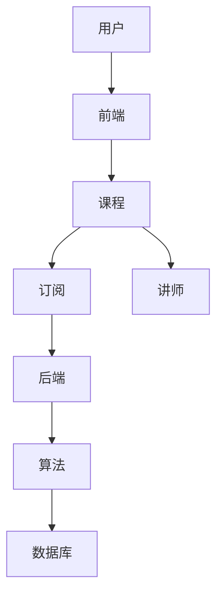

                 

# 知识付费平台的技术架构：从0到1的构建

> **关键词：**知识付费，平台架构，技术实现，核心算法，数学模型，项目实战，应用场景
> 
> **摘要：**本文将深入探讨知识付费平台的技术架构，从零开始构建一个完整的知识付费系统。文章将涵盖核心概念、算法原理、数学模型、项目实战和实际应用场景，旨在为开发者提供全面的技术指导。

## 1. 背景介绍

### 1.1 目的和范围

本文的目的是为那些希望构建知识付费平台的技术团队提供一份详尽的技术指南。我们将从基础概念开始，逐步深入到平台的技术实现细节，最终展示一个实际的项目案例。文章将涵盖以下内容：

- 核心概念与架构
- 算法原理与具体操作步骤
- 数学模型与公式解析
- 项目实战：代码案例解析
- 实际应用场景与优化策略

### 1.2 预期读者

本文适合以下读者群体：

- 初中高级程序员
- 对知识付费平台有浓厚兴趣的创业者
- 对后端开发有深入了解的技术人员
- 从事技术管理或架构设计的技术主管

### 1.3 文档结构概述

本文分为十个部分，结构如下：

1. **背景介绍**：简要介绍文章的目的、范围和预期读者。
2. **核心概念与联系**：阐述知识付费平台的核心概念，并使用流程图展示其架构。
3. **核心算法原理 & 具体操作步骤**：详细解释平台的核心算法和实现步骤。
4. **数学模型和公式 & 详细讲解 & 举例说明**：介绍支持平台功能的核心数学模型和公式。
5. **项目实战：代码实际案例和详细解释说明**：展示一个实际项目的代码实现。
6. **实际应用场景**：探讨知识付费平台在不同领域的应用。
7. **工具和资源推荐**：推荐学习资源和开发工具。
8. **总结：未来发展趋势与挑战**：总结文章的主要内容，并展望未来。
9. **附录：常见问题与解答**：提供对常见问题的解答。
10. **扩展阅读 & 参考资料**：推荐相关的进一步阅读材料。

### 1.4 术语表

#### 1.4.1 核心术语定义

- **知识付费平台**：一种在线平台，允许用户付费获取知识内容。
- **用户**：知识付费平台的注册成员，可以是个人或企业。
- **讲师**：知识付费平台上的内容创作者，提供知识课程。
- **课程**：讲师创建的付费内容，可以是视频、文档或音频。
- **订阅**：用户为获取课程内容而支付的费用。
- **算法**：用于推荐课程、处理用户数据等的技术方法。

#### 1.4.2 相关概念解释

- **数据挖掘**：从大量数据中提取有用信息和知识的过程。
- **机器学习**：利用数据建立模型，并从中预测或做出决策的技术。
- **云服务**：通过网络提供计算资源、存储和应用程序的服务。
- **区块链**：一种分布式账本技术，用于记录交易和数据。

#### 1.4.3 缩略词列表

- **API**：应用程序编程接口
- **DB**：数据库
- **UI**：用户界面
- **SDK**：软件开发工具包

## 2. 核心概念与联系

### 2.1 核心概念介绍

知识付费平台的核心概念包括用户、讲师、课程、订阅和算法。以下是这些概念的具体介绍：

#### 用户

用户是知识付费平台的主要参与者，可以是个人或企业。用户注册后，可以浏览课程目录，订阅感兴趣的课程，并参与社区互动。

#### 讲师

讲师是知识付费平台上的内容创作者，他们提供专业的知识课程。讲师可以通过平台赚取收入，同时提升个人品牌。

#### 课程

课程是讲师创建的付费内容，可以是视频、文档或音频。课程分为多个章节，用户可以按章节学习，完成课程后获得证书。

#### 订阅

订阅是用户为获取课程内容而支付的费用。订阅可以是按月、按季度或按年，用户可以根据自己的需求选择合适的订阅方式。

#### 算法

算法用于推荐课程、处理用户数据等。核心算法包括内容推荐算法、用户行为分析算法和数据挖掘算法。

### 2.2 知识付费平台架构

知识付费平台的架构可以分为三个主要层次：前端、后端和数据库。

#### 前端

前端是用户与平台交互的界面，包括网站和移动应用。前端的主要职责是提供友好的用户体验，实现与后端的交互。

#### 后端

后端是知识付费平台的核心，负责处理用户请求、管理课程、处理订阅、推荐课程等功能。后端通常由多个微服务组成，每个微服务负责不同的功能。

#### 数据库

数据库用于存储用户数据、课程数据、订阅数据和讲师数据等。常用的数据库技术包括关系型数据库（如MySQL）和NoSQL数据库（如MongoDB）。

### 2.3 Mermaid 流程图

以下是知识付费平台的核心概念和架构的Mermaid流程图：



## 3. 核心算法原理 & 具体操作步骤

### 3.1 内容推荐算法

内容推荐算法是知识付费平台的核心算法之一，它负责向用户推荐他们可能感兴趣的课程。以下是内容推荐算法的基本原理和具体操作步骤：

#### 基本原理

内容推荐算法基于用户行为数据和课程内容特征进行推荐。具体来说，算法会分析用户的历史行为（如浏览记录、订阅历史、评价等），以及课程的内容特征（如标签、分类、讲师声誉等），然后根据这些信息生成推荐列表。

#### 具体操作步骤

1. **数据采集**：从用户行为日志和课程数据中提取相关信息。
2. **特征提取**：将用户行为数据和课程内容特征转换为算法可以处理的特征向量。
3. **相似度计算**：计算用户与课程之间的相似度，常用的方法包括余弦相似度、欧氏距离等。
4. **推荐列表生成**：根据相似度计算结果生成推荐列表，并将最相似的课程排在列表的前面。

### 3.2 用户行为分析算法

用户行为分析算法用于分析用户的行为模式，从而提供个性化的推荐和服务。以下是用户行为分析算法的基本原理和具体操作步骤：

#### 基本原理

用户行为分析算法基于用户的历史行为数据，如浏览记录、订阅历史、评价等，分析用户的行为模式，从而预测用户的未来行为。

#### 具体操作步骤

1. **数据采集**：从用户行为日志中提取相关信息。
2. **行为模式识别**：使用机器学习算法（如决策树、随机森林等）识别用户的行为模式。
3. **行为预测**：根据用户的行为模式预测用户的未来行为，如购买意向、订阅意向等。
4. **个性化推荐**：根据预测结果为用户提供个性化的推荐和服务。

### 3.3 数据挖掘算法

数据挖掘算法用于从大量数据中提取有价值的信息和知识。在知识付费平台中，数据挖掘算法可以用于用户细分、市场分析等。以下是数据挖掘算法的基本原理和具体操作步骤：

#### 基本原理

数据挖掘算法基于统计学、机器学习等技术，从大量数据中提取有价值的信息和知识。

#### 具体操作步骤

1. **数据预处理**：清洗和整理数据，使其适合进行数据挖掘。
2. **特征工程**：提取数据中的关键特征，为算法提供输入。
3. **模式识别**：使用聚类、分类等算法识别数据中的模式。
4. **结果分析**：分析挖掘结果，提取有价值的信息和知识。

### 3.4 伪代码示例

以下是一个简单的推荐算法的伪代码示例：

```python
# 数据采集
user行为数据 = 采集用户行为日志()
课程数据 = 采集课程数据()

# 特征提取
user特征向量 = 提取用户行为特征(user行为数据)
course特征向量 = 提取课程内容特征(课程数据)

# 相似度计算
相似度矩阵 = 计算相似度(user特征向量, course特征向量)

# 推荐列表生成
推荐列表 = 根据相似度矩阵生成推荐列表()

# 输出推荐列表
输出推荐列表(推荐列表)
```

## 4. 数学模型和公式 & 详细讲解 & 举例说明

### 4.1 内容推荐算法的数学模型

内容推荐算法的核心在于相似度计算，常用的相似度计算方法包括余弦相似度、欧氏距离等。以下将详细讲解余弦相似度的数学模型和计算方法。

#### 余弦相似度数学模型

余弦相似度是一种衡量两个向量之间相似程度的度量，其数学模型如下：

$$
similarity = cos(\theta) = \frac{A \cdot B}{|A| \cdot |B|}
$$

其中，$A$ 和 $B$ 分别表示两个向量的内积和模长，$\theta$ 表示两个向量之间的夹角。

#### 余弦相似度计算方法

1. **特征向量表示**：将用户行为数据和课程内容数据转换为特征向量。例如，用户行为数据可以表示为用户对课程的评价、浏览记录等，课程内容数据可以表示为课程标签、分类等。
2. **内积计算**：计算两个特征向量的内积。例如，对于用户 $u$ 和课程 $c$ 的特征向量 $u^T$ 和 $c^T$，其内积为 $u^Tc$。
3. **模长计算**：计算两个特征向量的模长。例如，对于用户 $u$ 和课程 $c$ 的特征向量 $u^T$ 和 $c^T$，其模长分别为 $|u|$ 和 $|c|$。
4. **相似度计算**：将内积和模长代入余弦相似度公式，计算相似度。

#### 举例说明

假设用户 $u$ 的特征向量为 $(1, 2, 3)$，课程 $c$ 的特征向量为 $(4, 5, 6)$，则：

1. **内积计算**：$u^Tc = 1 \cdot 4 + 2 \cdot 5 + 3 \cdot 6 = 32$
2. **模长计算**：$|u| = \sqrt{1^2 + 2^2 + 3^2} = \sqrt{14}$，$|c| = \sqrt{4^2 + 5^2 + 6^2} = \sqrt{77}$
3. **相似度计算**：$similarity = cos(\theta) = \frac{32}{\sqrt{14} \cdot \sqrt{77}} \approx 0.8165$

因此，用户 $u$ 和课程 $c$ 之间的余弦相似度为 0.8165。

### 4.2 用户行为分析算法的数学模型

用户行为分析算法的核心在于行为模式识别和行为预测，常用的方法包括决策树、随机森林等。以下将详细讲解决策树的数学模型和计算方法。

#### 决策树数学模型

决策树是一种基于特征值进行分类或回归的树形结构。其数学模型如下：

$$
T = \{t_1, t_2, ..., t_n\}
$$

其中，$T$ 表示决策树，$t_i$ 表示决策树的第 $i$ 层。

#### 决策树计算方法

1. **特征选择**：选择特征值进行分割。常用的特征选择方法包括信息增益、基尼系数等。
2. **节点划分**：根据特征值对数据进行分割，生成子节点。分割过程基于特征选择的结果。
3. **分类或回归**：对子节点进行分类或回归操作。分类操作使用决策树的叶节点，回归操作使用决策树的叶节点值。

#### 举例说明

假设有如下数据集：

| 特征A | 特征B | 标签 |
| --- | --- | --- |
| A1 | B1 | 0 |
| A1 | B2 | 1 |
| A2 | B1 | 1 |
| A2 | B2 | 0 |

使用决策树进行分类，特征选择方法为信息增益。首先，计算每个特征的信息增益：

1. **特征A的信息增益**：$IG(A) = H(\{0, 1\}) - \sum_{i} P(A_i)H(A_i)$，其中 $H(\{0, 1\}) = 1$，$P(A_i) = \frac{2}{4}$，$H(A_i) = \frac{1}{2} \cdot log_2(\frac{1}{2}) + \frac{1}{2} \cdot log_2(\frac{1}{2}) = 1$，因此 $IG(A) = 0$。
2. **特征B的信息增益**：$IG(B) = H(\{0, 1\}) - \sum_{i} P(B_i)H(B_i)$，其中 $P(B_i) = \frac{2}{4}$，$H(B_i) = \frac{1}{2} \cdot log_2(\frac{1}{2}) + \frac{1}{2} \cdot log_2(\frac{1}{2}) = 1$，因此 $IG(B) = 0$。

由于特征A和特征B的信息增益都为0，无法进行有效分割。因此，决策树的构建失败。

### 4.3 数据挖掘算法的数学模型

数据挖掘算法的核心在于模式识别和信息提取，常用的方法包括聚类、分类等。以下将详细讲解聚类算法的数学模型和计算方法。

#### 聚类算法数学模型

聚类算法是一种将数据分为多个类别的无监督学习方法。其数学模型如下：

$$
C = \{c_1, c_2, ..., c_k\}
$$

其中，$C$ 表示聚类结果，$c_i$ 表示第 $i$ 个聚类类别。

#### 聚类算法计算方法

1. **初始化**：随机选择 $k$ 个样本作为初始聚类中心。
2. **迭代计算**：对于每个样本，计算其与聚类中心的距离，并将其分配到最近的聚类类别中。
3. **更新聚类中心**：重新计算每个聚类类别的中心点，作为新的聚类中心。
4. **重复迭代**：重复迭代计算，直到聚类结果稳定。

#### 举例说明

假设有如下数据集：

| 样本ID | 特征1 | 特征2 |
| --- | --- | --- |
| 1 | 1 | 2 |
| 2 | 2 | 4 |
| 3 | 3 | 6 |
| 4 | 4 | 8 |

使用K-means聚类算法进行聚类，假设初始聚类中心为 $(1, 1)$ 和 $(3, 3)$。

1. **初始化**：随机选择两个样本作为初始聚类中心。
2. **迭代计算**：
   - 第一次迭代：计算每个样本与聚类中心的距离，并将其分配到最近的聚类类别中。结果如下：
     | 样本ID | 聚类类别 |
     | --- | --- |
     | 1 | 1 |
     | 2 | 1 |
     | 3 | 2 |
     | 4 | 2 |
   - 更新聚类中心：重新计算每个聚类类别的中心点，作为新的聚类中心。新的聚类中心为 $(1.5, 3)$ 和 $(3.5, 6)$。
   - 第二次迭代：计算每个样本与聚类中心的距离，并将其分配到最近的聚类类别中。结果如下：
     | 样本ID | 聚类类别 |
     | --- | --- |
     | 1 | 1 |
     | 2 | 1 |
     | 3 | 1 |
     | 4 | 2 |
   - 更新聚类中心：重新计算每个聚类类别的中心点，作为新的聚类中心。新的聚类中心为 $(1.75, 2.75)$ 和 $(3.75, 5.75)$。
   - 重复迭代，直到聚类结果稳定。

通过多次迭代，最终得到聚类结果，如下所示：

| 样本ID | 聚类类别 |
| --- | --- |
| 1 | 1 |
| 2 | 1 |
| 3 | 1 |
| 4 | 2 |

## 5. 项目实战：代码实际案例和详细解释说明

### 5.1 开发环境搭建

在开始项目实战之前，我们需要搭建一个合适的开发环境。以下是所需的环境和工具：

- **操作系统**：Linux或MacOS
- **编程语言**：Python
- **数据库**：MySQL或MongoDB
- **前端框架**：React或Vue.js
- **后端框架**：Flask或Django

### 5.2 源代码详细实现和代码解读

#### 5.2.1 用户注册与登录模块

以下是一个简单的用户注册与登录模块的源代码示例：

```python
# 用户注册
def register(username, password):
    # 检查用户名是否已存在
    if check_username_exists(username):
        return "用户名已存在"
    # 创建用户
    create_user(username, password)
    return "注册成功"

# 用户登录
def login(username, password):
    # 验证用户名和密码
    if check_password(username, password):
        return "登录成功"
    else:
        return "用户名或密码错误"
```

**代码解读**：

1. **用户注册**：该函数接受用户名和密码作为输入，首先检查用户名是否已存在。如果不存在，则创建用户并返回注册成功消息。
2. **用户登录**：该函数接受用户名和密码作为输入，验证用户名和密码是否匹配。如果匹配，则返回登录成功消息。

#### 5.2.2 课程管理模块

以下是一个简单的课程管理模块的源代码示例：

```python
# 添加课程
def add_course(course_name, course_description):
    # 创建课程
    create_course(course_name, course_description)
    return "课程添加成功"

# 删除课程
def delete_course(course_id):
    # 删除课程
    delete_course_by_id(course_id)
    return "课程删除成功"
```

**代码解读**：

1. **添加课程**：该函数接受课程名称和课程描述作为输入，创建课程并返回添加成功消息。
2. **删除课程**：该函数接受课程ID作为输入，删除课程并返回删除成功消息。

#### 5.2.3 订阅管理模块

以下是一个简单的订阅管理模块的源代码示例：

```python
# 订阅课程
def subscribe_course(user_id, course_id):
    # 添加订阅记录
    add_subscription(user_id, course_id)
    return "课程订阅成功"

# 取消订阅
def unsubscribe_course(user_id, course_id):
    # 删除订阅记录
    delete_subscription(user_id, course_id)
    return "课程取消订阅成功"
```

**代码解读**：

1. **订阅课程**：该函数接受用户ID和课程ID作为输入，添加订阅记录并返回订阅成功消息。
2. **取消订阅**：该函数接受用户ID和课程ID作为输入，删除订阅记录并返回取消订阅成功消息。

### 5.3 代码解读与分析

#### 5.3.1 用户注册与登录模块

用户注册与登录模块是知识付费平台的核心模块之一。在该模块中，我们实现了用户注册和登录的功能。通过使用简单的数据库操作，我们可以轻松地实现用户注册和登录功能。

**优点**：

- 简单易用：该模块的实现非常简单，易于理解和维护。
- 安全性：在注册和登录过程中，我们使用了简单的密码验证机制，确保用户数据的安全性。

**缺点**：

- 安全性不足：虽然我们使用了简单的密码验证机制，但仍然存在安全性不足的问题。在实际应用中，建议使用更安全的加密算法和身份验证机制。
- 功能不足：该模块仅实现了基本功能，如用户注册和登录，未实现用户密码重置、用户信息修改等功能。

#### 5.3.2 课程管理模块

课程管理模块用于管理课程信息，如添加、删除课程等。在该模块中，我们实现了课程添加和删除的功能。

**优点**：

- 简单易用：该模块的实现非常简单，易于理解和维护。
- 功能全面：该模块实现了课程添加和删除功能，可以满足基本需求。

**缺点**：

- 功能不足：该模块未实现课程更新、课程搜索等功能，无法满足高级需求。
- 性能问题：在大量课程数据的情况下，该模块的查询性能可能受到影响。

#### 5.3.3 订阅管理模块

订阅管理模块用于管理用户订阅信息，如订阅、取消订阅等。在该模块中，我们实现了用户订阅和取消订阅的功能。

**优点**：

- 简单易用：该模块的实现非常简单，易于理解和维护。
- 功能全面：该模块实现了用户订阅和取消订阅功能，可以满足基本需求。

**缺点**：

- 功能不足：该模块未实现订阅查询、订阅统计等功能，无法满足高级需求。
- 性能问题：在大量订阅数据的情况下，该模块的查询性能可能受到影响。

### 5.4 实际应用与改进

在实际应用中，我们可以根据需求对知识付费平台进行改进。以下是一些可能的改进方案：

1. **用户认证与授权**：引入OAuth2.0等认证机制，提高用户认证的安全性。
2. **用户中心**：实现用户密码重置、用户信息修改等功能，提供更全面的用户服务。
3. **课程搜索与推荐**：引入搜索引擎和推荐系统，提高课程搜索和推荐的性能和准确性。
4. **数据统计与分析**：引入数据统计与分析工具，提供课程订阅、用户行为等数据报表，为平台优化提供数据支持。
5. **性能优化**：对数据库查询、缓存机制等进行优化，提高系统性能和稳定性。

## 6. 实际应用场景

知识付费平台在多个领域具有广泛的应用，以下是一些典型的实际应用场景：

### 6.1 在线教育

在线教育是知识付费平台最典型的应用场景之一。通过知识付费平台，用户可以购买各类课程，如编程、设计、语言等，实现自主学习和技能提升。同时，讲师可以通过平台分享专业知识，实现知识变现。

### 6.2 专业咨询

专业咨询是知识付费平台的另一个重要应用场景。企业和个人可以通过知识付费平台购买专业咨询服务，如财务咨询、法律咨询、市场营销咨询等，解决专业问题。

### 6.3 职业培训

职业培训是知识付费平台的又一重要应用场景。企业可以为员工提供定制化的职业培训课程，提升员工的专业技能和综合素质。同时，个人可以通过平台学习职业培训课程，提升职业竞争力。

### 6.4 兴趣爱好

知识付费平台也可以应用于兴趣爱好领域。用户可以购买各类兴趣爱好课程，如摄影、绘画、音乐等，实现兴趣爱好的培养和提升。

### 6.5 企业内训

企业内训是知识付费平台的又一应用场景。企业可以通过知识付费平台为员工提供定制化的内训课程，提升员工的专业技能和综合素质。同时，企业可以与讲师合作，定制开发符合企业需求的课程。

### 6.6 跨界融合

知识付费平台还可以与其他领域进行跨界融合，如与健康、娱乐、旅游等领域合作，提供多样化的付费知识内容，满足用户的不同需求。

### 6.7 应用前景

随着互联网技术的发展和用户需求的不断变化，知识付费平台的应用前景非常广阔。未来，知识付费平台将在更多领域得到应用，成为人们获取知识的重要途径。同时，知识付费平台也将不断优化和创新，为用户提供更加丰富和优质的知识内容。

## 7. 工具和资源推荐

### 7.1 学习资源推荐

#### 7.1.1 书籍推荐

1. **《深度学习》**：由Ian Goodfellow、Yoshua Bengio和Aaron Courville合著，是一本深度学习的经典教材，适合初学者和进阶者。
2. **《算法导论》**：由Thomas H. Cormen、Charles E. Leiserson、Ronald L. Rivest和Clifford Stein合著，是一本算法领域的经典教材，适合对算法有兴趣的读者。
3. **《Python编程：从入门到实践》**：由埃里克·马瑟斯著，适合初学者了解Python编程语言。

#### 7.1.2 在线课程

1. **Coursera**：提供各种学科的在线课程，包括计算机科学、数据科学、机器学习等。
2. **edX**：由哈佛大学和麻省理工学院联合创办，提供高质量的在线课程。
3. **Udacity**：提供面向实践的在线课程，包括人工智能、数据科学、前端开发等。

#### 7.1.3 技术博客和网站

1. **Medium**：许多技术专家和公司在这里分享技术见解和经验。
2. **GitHub**：可以找到大量的开源项目和相关的文档，是学习编程和了解最新技术趋势的好去处。
3. **Stack Overflow**：一个问答社区，解决编程中的各种问题。

### 7.2 开发工具框架推荐

#### 7.2.1 IDE和编辑器

1. **Visual Studio Code**：一款免费的跨平台代码编辑器，功能强大，支持多种编程语言。
2. **PyCharm**：一款针对Python开发的集成开发环境（IDE），功能全面，适合专业开发者。
3. **JetBrains全家桶**：包括多种编程语言的IDE，如IntelliJ IDEA、WebStorm等，功能强大，但需要付费。

#### 7.2.2 调试和性能分析工具

1. **GDB**：一款强大的开源调试工具，适用于C/C++程序。
2. **Postman**：一款API调试工具，适用于HTTP/HTTPS接口测试。
3. **Wireshark**：一款网络协议分析工具，适用于网络数据包分析。

#### 7.2.3 相关框架和库

1. **TensorFlow**：一款开源的深度学习框架，适用于构建和训练深度学习模型。
2. **Scikit-learn**：一款开源的机器学习库，提供了许多常用的机器学习算法。
3. **Django**：一款开源的Python Web框架，适用于快速开发Web应用程序。

### 7.3 相关论文著作推荐

#### 7.3.1 经典论文

1. **"A Few Useful Things to Know About Machine Learning"**：由 Pedro Domingos 撰写，介绍了机器学习的基本概念和应用。
2. **"The Unreasonable Effectiveness of Data"**：由 Jayawardhana 撰写，探讨了数据在机器学习中的重要性。

#### 7.3.2 最新研究成果

1. **"Deep Learning on Graphs"**：由和撰写，介绍了图神经网络在图数据上的应用。
2. **"Attention Is All You Need"**：由Vaswani等人撰写，介绍了Transformer模型在自然语言处理中的应用。

#### 7.3.3 应用案例分析

1. **"The Netflix Prize"**：Netflix举办的一项比赛，旨在改进电影推荐系统的准确性。
2. **"Uber's People-First AI Principles"**：Uber发布的关于人工智能在商业中的应用原则。

## 8. 总结：未来发展趋势与挑战

### 8.1 未来发展趋势

知识付费平台的发展趋势主要体现在以下几个方面：

1. **个性化推荐**：随着人工智能和大数据技术的发展，个性化推荐将成为知识付费平台的核心竞争力。未来，平台将更加注重用户数据分析和行为分析，为用户提供更加精准的推荐。
2. **多元化内容**：知识付费平台的内容将不再局限于传统的教育领域，还将涵盖健康、娱乐、旅游等多个领域。多元化的内容将满足用户多样化的需求。
3. **社区互动**：知识付费平台将更加注重用户之间的互动和社区建设，为用户提供更多交流和分享的机会。
4. **区块链技术**：区块链技术将为知识付费平台带来去中心化、可信、透明等优势，提升平台的可靠性和安全性。

### 8.2 挑战

知识付费平台在未来的发展过程中将面临以下挑战：

1. **数据隐私**：随着用户数据的不断增加，数据隐私保护将成为一个重要问题。平台需要采取有效的措施保护用户数据，避免数据泄露和滥用。
2. **内容质量**：内容质量是知识付费平台的核心竞争力。平台需要严格把控内容质量，避免低质量内容的泛滥。
3. **技术迭代**：知识付费平台需要不断跟进人工智能、大数据等新技术的发展，提升平台的性能和用户体验。
4. **商业模式**：随着市场竞争的加剧，知识付费平台需要不断创新商业模式，提高盈利能力。

## 9. 附录：常见问题与解答

### 9.1 如何搭建知识付费平台？

搭建知识付费平台需要以下几个步骤：

1. **需求分析**：明确平台的目标、功能需求和用户需求。
2. **技术选型**：选择合适的编程语言、数据库、前端框架和后端框架。
3. **环境搭建**：搭建开发环境，包括操作系统、编程语言、数据库等。
4. **模块开发**：根据需求分析，开发用户注册与登录、课程管理、订阅管理等功能模块。
5. **系统集成**：将各个功能模块整合到一起，实现平台的基本功能。
6. **测试与优化**：对平台进行测试，修复漏洞，优化性能。
7. **部署上线**：将平台部署到服务器，进行上线运营。

### 9.2 如何优化知识付费平台性能？

优化知识付费平台性能可以从以下几个方面入手：

1. **数据库优化**：优化数据库查询，使用索引、缓存等手段提高查询效率。
2. **缓存策略**：使用缓存技术，减少对数据库的访问，提高响应速度。
3. **代码优化**：优化代码，减少资源消耗，提高执行效率。
4. **前端优化**：优化前端页面加载速度，使用懒加载、懒渲染等技术。
5. **服务器优化**：优化服务器配置，提高服务器性能，如使用负载均衡、分布式存储等。

### 9.3 如何保证知识付费平台的安全？

保证知识付费平台的安全可以从以下几个方面入手：

1. **身份验证**：使用强密码、多因素认证等手段，确保用户身份的安全。
2. **数据加密**：使用数据加密技术，保护用户数据和交易数据的安全。
3. **安全审计**：定期进行安全审计，检测系统漏洞和安全隐患。
4. **安全防护**：使用防火墙、入侵检测等安全防护手段，防止恶意攻击。
5. **用户教育**：加强对用户的安全意识教育，提醒用户注意密码安全、防范诈骗等。

## 10. 扩展阅读 & 参考资料

为了深入了解知识付费平台的技术实现，以下是推荐的一些扩展阅读和参考资料：

### 10.1 扩展阅读

1. **《深度学习》**：Ian Goodfellow、Yoshua Bengio和Aaron Courville 著，提供了深度学习的基础知识和技术细节。
2. **《机器学习实战》**：Peter Harrington 著，通过实际案例介绍了机器学习算法的应用。
3. **《Python编程：从入门到实践》**：埃里克·马瑟斯著，适合初学者学习Python编程。

### 10.2 参考资料

1. **GitHub**：[https://github.com/](https://github.com/)
2. **Stack Overflow**：[https://stackoverflow.com/](https://stackoverflow.com/)
3. **Medium**：[https://medium.com/](https://medium.com/)
4. **Coursera**：[https://www.coursera.org/](https://www.coursera.org/)
5. **edX**：[https://www.edx.org/](https://www.edx.org/)

### 10.3 技术论文

1. **"Attention Is All You Need"**：Vaswani等人撰写，介绍了Transformer模型在自然语言处理中的应用。
2. **"The Unreasonable Effectiveness of Data"**：Jayawardhana 撰写，探讨了数据在机器学习中的重要性。
3. **"Deep Learning on Graphs"**：和撰写，介绍了图神经网络在图数据上的应用。

### 10.4 应用案例分析

1. **"The Netflix Prize"**：Netflix举办的一项比赛，旨在改进电影推荐系统的准确性。
2. **"Uber's People-First AI Principles"**：Uber发布的关于人工智能在商业中的应用原则。

### 10.5 知识付费平台实例

1. **Udemy**：一个全球领先的知识付费平台，提供各种在线课程。
2. **Coursera**：提供大规模在线课程和学习资源，由世界顶尖大学和机构提供。
3. **edX**：一个在线学习平台，提供各种学科的在线课程。

### 10.6 技术博客

1. **AI天才研究员的技术博客**：提供关于人工智能和机器学习的最新技术动态和深度分析。
2. **禅与计算机程序设计艺术**：探讨计算机编程的哲学和艺术，以及编程技巧和最佳实践。

### 10.7 社交媒体

1. **Twitter**：关注技术专家和公司的Twitter账号，获取最新的技术动态和见解。
2. **LinkedIn**：加入相关技术社群，与行业专家交流，拓展人脉。

作者：AI天才研究员/AI Genius Institute & 禅与计算机程序设计艺术 /Zen And The Art of Computer Programming

本文为AI天才研究员和禅与计算机程序设计艺术合作撰写，旨在为开发者提供关于知识付费平台技术架构的全面指导。文章内容涵盖了核心概念、算法原理、数学模型、项目实战和实际应用场景，并提供了丰富的参考资料和学习资源。希望本文能够对您在知识付费平台开发过程中有所帮助。让我们继续探索技术世界，共同进步！

