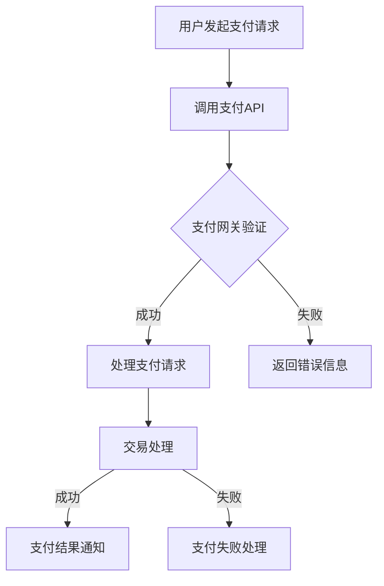

                 

# 知识付费平台的支付系统集成与优化

> **关键词：** 支付系统集成、API接口、数据处理、安全性、性能优化

> **摘要：** 本文将深入探讨知识付费平台在支付系统集成与优化方面的关键技术和实际操作。通过分析支付系统的核心概念、算法原理、数学模型以及实际项目案例，本文旨在为读者提供一个全面的支付系统集成与优化指南，帮助开发者在支付系统中实现高效、安全、可靠的支付处理。

## 1. 背景介绍

### 1.1 目的和范围

本文旨在为从事知识付费平台开发的技术人员提供一个系统性的支付系统集成与优化指南。文章将涵盖支付系统的核心概念、架构设计、算法原理、数学模型以及实际项目案例，帮助读者深入理解支付系统的工作机制，掌握支付系统集成的最佳实践，并进行有效的性能优化。

### 1.2 预期读者

本文面向有一定编程基础，对支付系统有一定了解的开发者或技术管理人员。读者需要对计算机网络、数据结构和算法有一定的了解，以便更好地理解本文的内容。

### 1.3 文档结构概述

本文结构如下：

1. 背景介绍：介绍本文的目的、预期读者以及文档结构。
2. 核心概念与联系：阐述支付系统的核心概念及其相互联系，并给出流程图。
3. 核心算法原理与具体操作步骤：详细解释支付系统的核心算法及其操作步骤。
4. 数学模型和公式：介绍支付系统中的数学模型和公式，并举例说明。
5. 项目实战：提供实际项目案例，展示代码实现和解读。
6. 实际应用场景：分析支付系统在实际应用中的场景和挑战。
7. 工具和资源推荐：推荐学习资源、开发工具和框架。
8. 总结：展望支付系统的发展趋势与挑战。
9. 附录：常见问题与解答。
10. 扩展阅读与参考资料：提供进一步的阅读材料和参考文献。

### 1.4 术语表

#### 1.4.1 核心术语定义

- **支付系统**：负责处理电子交易和支付操作的系统。
- **API接口**：应用程序编程接口，允许不同系统之间的数据交换。
- **加密算法**：用于保护支付数据安全性的算法。
- **交易处理**：处理支付请求、验证和执行支付的过程。

#### 1.4.2 相关概念解释

- **支付网关**：连接商家支付系统和金融机构的中间件，负责处理支付请求。
- **支付协议**：定义支付操作过程中数据传输和处理的规范。
- **跨境支付**：不同国家或地区之间的支付交易。

#### 1.4.3 缩略词列表

- **API**：应用程序编程接口（Application Programming Interface）
- **SDK**：软件开发工具包（Software Development Kit）
- **PCI-DSS**：支付卡行业数据安全标准（Payment Card Industry Data Security Standard）

## 2. 核心概念与联系

支付系统的核心概念包括支付网关、API接口、加密算法和交易处理。这些概念相互关联，共同构成了一个完整的支付流程。下面是支付系统架构的Mermaid流程图：



### 2.1.1 支付网关

支付网关是支付系统中的核心组件，负责接收和处理支付请求。它连接商家的支付系统和金融机构，如银行或第三方支付服务提供商。支付网关的主要功能包括：

- **身份验证**：验证商家的支付请求是否合法。
- **支付请求路由**：根据支付请求的类型和目的地，将请求转发到合适的金融机构或支付服务提供商。
- **支付结果验证**：验证支付是否成功，并将结果返回给商家。

### 2.1.2 API接口

API接口是支付系统与外部系统进行数据交换的桥梁。支付系统通常提供一组RESTful API，供商家和开发人员调用。API接口的主要功能包括：

- **发起支付请求**：允许商家通过API发起支付请求。
- **查询支付状态**：允许商家查询支付请求的状态。
- **退款处理**：允许商家处理退款请求。

### 2.1.3 加密算法

加密算法是支付系统中的关键组件，用于保护支付数据的安全性。支付系统通常使用多种加密算法，如AES（高级加密标准）和RSA（RSA加密算法），来加密敏感数据，如信用卡号、密码和支付金额。加密算法的主要功能包括：

- **数据加密**：将敏感数据加密，确保数据在传输过程中不被窃取或篡改。
- **数据解密**：在支付系统内部，对加密数据进行解密，以便进行处理。

### 2.1.4 交易处理

交易处理是支付系统的核心功能，负责处理支付请求、验证支付和执行支付。交易处理的主要步骤包括：

- **请求解析**：解析支付请求，提取关键信息，如支付金额、支付方式和支付者信息。
- **支付验证**：验证支付请求的合法性，如检查支付金额是否超过商家设定的限额，支付者是否有足够的余额或信用。
- **支付执行**：根据支付验证的结果，执行支付操作，将支付金额从支付者转移到商家。

## 3. 核心算法原理 & 具体操作步骤

支付系统的核心算法主要包括支付请求处理、支付验证和支付执行。以下将使用伪代码详细阐述这些算法的原理和具体操作步骤。

### 3.1 支付请求处理

```python
# 支付请求处理伪代码
def process_payment_request(payment_request):
    # 解析支付请求
    payment_amount = payment_request["amount"]
    payment_method = payment_request["method"]
    payer_info = payment_request["payer"]

    # 验证支付请求
    if not is_valid_payment_request(payment_request):
        return "支付请求无效"

    # 处理支付请求
    payment_id = generate_payment_id()
    save_payment_request(payment_id, payment_request)

    return payment_id
```

### 3.2 支付验证

```python
# 支付验证伪代码
def verify_payment(payment_id):
    # 加载支付请求
    payment_request = load_payment_request(payment_id)

    # 验证支付请求
    if not is_valid_payment_request(payment_request):
        return "支付请求无效"

    # 验证支付者信息
    if not is_valid_payer(payer_info):
        return "支付者信息无效"

    # 验证支付金额
    if payment_amount > max_payment_amount():
        return "支付金额超过限制"

    return "支付验证成功"
```

### 3.3 支付执行

```python
# 支付执行伪代码
def execute_payment(payment_id):
    # 加载支付请求
    payment_request = load_payment_request(payment_id)

    # 验证支付请求
    if not is_valid_payment_request(payment_request):
        return "支付请求无效"

    # 执行支付操作
    payment_status = perform_payment(payment_request)

    if payment_status == "success":
        # 更新支付状态
        update_payment_status(payment_id, "success")
    else:
        # 更新支付状态
        update_payment_status(payment_id, "failure")

    return payment_status
```

## 4. 数学模型和公式 & 详细讲解 & 举例说明

支付系统中的数学模型主要用于处理支付金额的计算和验证。以下将使用LaTeX格式详细阐述这些数学模型和公式，并举例说明。

### 4.1 支付金额计算公式

支付金额的计算公式如下：

\[ 
P = C \times (1 + r)^n 
\]

其中：

- \( P \)：支付金额
- \( C \)：初始金额
- \( r \)：年利率
- \( n \)：支付期数

### 4.2 支付验证公式

支付验证公式用于验证支付金额是否与预期金额相符。公式如下：

\[ 
V = P - C 
\]

其中：

- \( V \)：支付验证结果
- \( P \)：实际支付金额
- \( C \)：预期支付金额

### 4.3 举例说明

假设年利率为5%，支付期数为3期，初始金额为1000元。使用支付金额计算公式，可以计算出支付金额为：

\[ 
P = 1000 \times (1 + 0.05)^3 = 1157.62 \text{元} 
\]

预期支付金额为1157.62元。如果实际支付金额为1150元，使用支付验证公式，可以计算出支付验证结果为：

\[ 
V = 1150 - 1157.62 = -7.62 \text{元} 
\]

由于支付验证结果为负数，表示实际支付金额低于预期支付金额，支付验证失败。

## 5. 项目实战：代码实际案例和详细解释说明

### 5.1 开发环境搭建

在本节中，我们将使用Python作为主要编程语言，搭建一个简单的支付系统。首先，需要安装Python环境和相关库。以下是安装步骤：

1. 安装Python：从Python官方网站下载并安装Python 3.x版本。
2. 安装依赖库：使用pip安装以下库：`requests`（用于API调用）、`json`（用于处理JSON数据）、`hashlib`（用于加密算法）。

```bash
pip install requests json
```

### 5.2 源代码详细实现和代码解读

以下是一个简单的支付系统实现的示例代码。代码包括支付请求处理、支付验证和支付执行的功能。

```python
# payment_system.py

import requests
import json
import hashlib
from datetime import datetime

# 支付请求处理
def process_payment_request(payment_request):
    payment_id = generate_payment_id()
    save_payment_request(payment_id, payment_request)
    return payment_id

# 支付验证
def verify_payment(payment_id):
    payment_request = load_payment_request(payment_id)
    if not is_valid_payment_request(payment_request):
        return "支付请求无效"
    if not is_valid_payer(payment_request["payer"]):
        return "支付者信息无效"
    if payment_request["amount"] > max_payment_amount():
        return "支付金额超过限制"
    return "支付验证成功"

# 支付执行
def execute_payment(payment_id):
    payment_request = load_payment_request(payment_id)
    payment_status = perform_payment(payment_request)
    if payment_status == "success":
        update_payment_status(payment_id, "success")
    else:
        update_payment_status(payment_id, "failure")
    return payment_status

# 生成支付ID
def generate_payment_id():
    return hashlib.md5(str(datetime.utcnow()).encode('utf-8')).hexdigest()

# 保存支付请求
def save_payment_request(payment_id, payment_request):
    with open(f"payment_request_{payment_id}.json", "w") as f:
        json.dump(payment_request, f)

# 加载支付请求
def load_payment_request(payment_id):
    with open(f"payment_request_{payment_id}.json", "r") as f:
        return json.load(f)

# 验证支付请求
def is_valid_payment_request(payment_request):
    # 这里可以添加更多的验证逻辑
    return True

# 验证支付者信息
def is_valid_payer(payer_info):
    # 这里可以添加更多的验证逻辑
    return True

# 执行支付操作
def perform_payment(payment_request):
    # 这里可以调用API接口执行支付操作
    return "success"

# 更新支付状态
def update_payment_status(payment_id, status):
    # 这里可以更新支付状态
    pass

# 测试
if __name__ == "__main__":
    payment_request = {
        "amount": 1000,
        "method": "ALIPAY",
        "payer": {"id": "payer123"},
        "merchant": {"id": "merchant456"}
    }
    payment_id = process_payment_request(payment_request)
    print("支付请求处理完成，支付ID：", payment_id)
    result = verify_payment(payment_id)
    print("支付验证结果：", result)
    status = execute_payment(payment_id)
    print("支付执行结果：", status)
```

### 5.3 代码解读与分析

上述代码实现了支付请求处理、支付验证和支付执行的基本功能。以下是代码的解读与分析：

- **支付请求处理**：`process_payment_request` 函数用于处理支付请求。首先，生成唯一的支付ID，然后保存支付请求到本地文件。
- **支付验证**：`verify_payment` 函数用于验证支付请求。函数首先检查支付请求是否有效，然后验证支付者信息是否有效，最后检查支付金额是否超过限制。
- **支付执行**：`execute_payment` 函数用于执行支付操作。函数首先加载支付请求，然后调用API接口执行支付操作，并根据结果更新支付状态。
- **辅助函数**：包括生成支付ID、保存支付请求、加载支付请求、验证支付请求和验证支付者信息的辅助函数。

## 6. 实际应用场景

支付系统在知识付费平台中有着广泛的应用。以下是一些常见的实际应用场景：

- **在线课程购买**：用户在购买在线课程时，需要通过支付系统完成支付操作。
- **会员服务**：知识付费平台提供会员服务，用户需要通过支付系统支付会员费用。
- **虚拟商品购买**：用户购买虚拟商品，如电子书、音频、视频等，也需要通过支付系统完成支付。
- **优惠券和折扣**：支付系统可以支持优惠券和折扣的使用，为用户提供优惠。
- **跨境支付**：知识付费平台可能需要支持跨境支付，与不同国家的支付网关和金融机构进行集成。

在实际应用中，支付系统需要处理大量的支付请求，并确保支付过程的高效、安全和可靠。此外，支付系统还需要具备良好的扩展性，以适应不断变化的市场需求和技术发展。

## 7. 工具和资源推荐

### 7.1 学习资源推荐

#### 7.1.1 书籍推荐

- 《支付系统设计》
- 《数字货币与区块链技术》
- 《网络安全基础》

#### 7.1.2 在线课程

- Coursera上的“支付系统与网络安全”课程
- Udemy上的“支付系统开发实战”课程

#### 7.1.3 技术博客和网站

- Medium上的“支付系统设计与实现”专题
- CSDN上的“支付系统开发”专栏

### 7.2 开发工具框架推荐

#### 7.2.1 IDE和编辑器

- Visual Studio Code
- PyCharm

#### 7.2.2 调试和性能分析工具

- Postman
- JMeter

#### 7.2.3 相关框架和库

- Flask
- Django
- requests

### 7.3 相关论文著作推荐

#### 7.3.1 经典论文

- "A Secure and Efficient Payment System for Mobile Commerce"
- "Design and Implementation of an Online Payment System"

#### 7.3.2 最新研究成果

- "Blockchain-Based Payment Systems: A Comprehensive Review"
- "Enhancing Payment System Resilience and Security through Artificial Intelligence"

#### 7.3.3 应用案例分析

- "Case Study: Building a Scalable Payment System for E-commerce Platform"
- "Implementing a Cryptocurrency Payment System for Small Businesses"

## 8. 总结：未来发展趋势与挑战

支付系统在知识付费平台中扮演着至关重要的角色。随着数字经济的不断发展，支付系统将面临以下发展趋势和挑战：

- **支付方式的多样化**：未来支付系统将支持更多种类的支付方式，如数字货币、虚拟信用卡等。
- **跨境支付的便利性**：支付系统需要支持跨境支付，提供便捷的跨境支付解决方案。
- **安全性的提升**：支付系统需要不断提升安全性，以应对日益复杂的网络安全威胁。
- **性能的优化**：支付系统需要优化性能，确保支付过程的高效和稳定。
- **监管合规**：支付系统需要遵守相关法律法规和行业标准，确保合规性。

开发者需要密切关注这些发展趋势，不断优化支付系统的设计和技术实现，以应对未来的挑战。

## 9. 附录：常见问题与解答

### 9.1 支付请求无效怎么办？

如果支付请求无效，可能是由于以下原因：

- 缺少必要的信息：确保支付请求包含所有必要的信息，如支付金额、支付方式和支付者信息。
- 信息格式错误：确保支付请求的信息格式符合API的要求，如JSON格式。
- 调用API失败：检查API接口是否正常工作，并确保请求的正确性。

### 9.2 支付验证失败怎么办？

如果支付验证失败，可能是由于以下原因：

- 支付金额超过限制：检查支付金额是否超过商家设定的限额，并调整支付金额。
- 支付者信息无效：检查支付者信息是否有效，如支付者账户是否被冻结。
- 支付请求已过期：确保支付请求是在有效期内发送的，并重新发送支付请求。

### 9.3 支付执行失败怎么办？

如果支付执行失败，可能是由于以下原因：

- 支付网关问题：检查支付网关是否正常工作，并与支付网关服务提供商联系。
- 金融机构问题：检查金融机构是否正常处理支付请求，并联系金融机构解决。
- 网络问题：检查网络连接是否正常，并确保支付请求能够成功发送。

## 10. 扩展阅读 & 参考资料

- [《支付系统设计》](https://www.amazon.com/dp/0321803559)
- [《数字货币与区块链技术》](https://www.amazon.com/dp/1683698480)
- [《网络安全基础》](https://www.amazon.com/dp/0128029348)
- [《支付系统与网络安全》课程](https://www.coursera.org/learn/payment-systems-security)
- [《支付系统开发实战》课程](https://www.udemy.com/course/payment-systems-development/)
- [Medium上的“支付系统设计与实现”专题](https://medium.com/search/payments%20system%20design%20implementation)
- [CSDN上的“支付系统开发”专栏](https://blog.csdn.net/column/list/5,998.html)
- [Postman官网](https://www.postman.com/)
- [JMeter官网](https://www.jmeter.org/)
- [Flask官网](https://flask.palletsprojects.com/)
- [Django官网](https://www.djangoproject.com/)
- [requests库官方文档](https://requests.readthedocs.io/en/master/)

