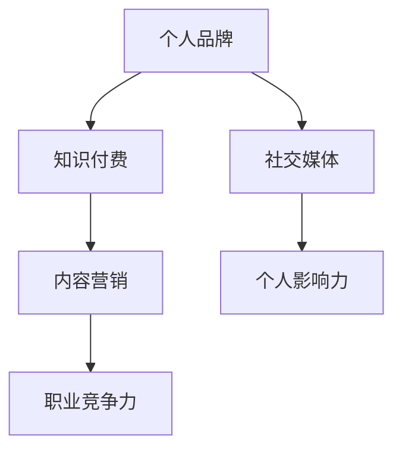

                 

# 知识付费时代程序员的个人品牌打造策略

> 关键词：知识付费、个人品牌、程序员、社交媒体、技能提升、职业发展

> 摘要：本文旨在探讨知识付费时代下，程序员如何利用各种策略打造自己的个人品牌，提升职业竞争力。我们将分析个人品牌的重要性、塑造个人品牌的步骤、利用社交媒体推广个人品牌、持续学习与技能提升的方法，以及应对职业发展中的挑战。

## 1. 背景介绍

### 1.1 目的和范围

在知识付费日益普及的今天，程序员如何打造个人品牌，成为行业内的专家和意见领袖，是每位职业人士需要思考的问题。本文将围绕以下主题展开：

- 个人品牌的重要性
- 塑造个人品牌的步骤
- 利用社交媒体推广个人品牌
- 持续学习与技能提升
- 应对职业发展中的挑战

### 1.2 预期读者

本文适合以下读者群体：

- 有志于提升个人品牌和职业竞争力的程序员
- 对知识付费和社交媒体运营感兴趣的IT从业者
- 希望了解行业趋势和职业发展策略的职场人士

### 1.3 文档结构概述

本文分为十个部分：

- 引言：介绍知识付费时代的背景和个人品牌的重要性
- 核心概念与联系：解释个人品牌的核心概念和原理
- 核心算法原理 & 具体操作步骤：详细阐述个人品牌打造的策略
- 数学模型和公式 & 详细讲解 & 举例说明：运用具体案例说明策略实施
- 项目实战：代码实际案例和详细解释说明
- 实际应用场景：分析个人品牌在程序员职业生涯中的应用
- 工具和资源推荐：推荐学习资源和开发工具
- 总结：未来发展趋势与挑战
- 附录：常见问题与解答
- 扩展阅读 & 参考资料：提供进一步学习和研究的资源

### 1.4 术语表

#### 1.4.1 核心术语定义

- 个人品牌：个人在职业领域中形成的独特形象和声誉。
- 知识付费：用户为获取高质量的知识内容和服务支付费用。
- 社交媒体：用于个人和群体互动的网络平台，如微博、知乎、LinkedIn等。
- 技能提升：通过学习和实践，增强个人专业技能的过程。

#### 1.4.2 相关概念解释

- 个人影响力：个人在社会网络中的影响力大小，关系到个人品牌的传播效果。
- 内容营销：通过创造和分享有价值的内容，吸引目标受众，建立品牌认知。

#### 1.4.3 缩略词列表

- SEO：搜索引擎优化（Search Engine Optimization）
- KOL：关键意见领袖（Key Opinion Leader）
- SNS：社交网络服务（Social Networking Service）

## 2. 核心概念与联系

在探讨个人品牌打造之前，我们需要了解一些核心概念，包括个人品牌、知识付费、社交媒体等。以下是一个简化的Mermaid流程图，展示这些概念之间的关系。



### 2.1 个人品牌

个人品牌是个人在职业生涯中建立的独特形象和声誉。它包括个人技能、专业背景、价值观和人际网络。一个强大的个人品牌可以帮助程序员在行业中脱颖而出，获得更多职业机会。

### 2.2 知识付费

知识付费是指用户为获取高质量的知识内容和服务支付费用。在知识付费时代，程序员可以通过提供专业知识和技能培训，获取额外的收入来源。

### 2.3 社交媒体

社交媒体是个人品牌传播的重要渠道。通过微博、知乎、LinkedIn等平台，程序员可以分享专业见解，扩大影响力，建立个人品牌。

### 2.4 内容营销

内容营销是通过创造和分享有价值的内容，吸引目标受众，建立品牌认知。程序员可以通过撰写技术博客、发表文章、录制视频等方式，展示自己的专业能力。

### 2.5 个人影响力

个人影响力是个人在社会网络中的影响力大小，关系到个人品牌的传播效果。提高个人影响力，有助于扩大个人品牌的知名度。

### 2.6 职业竞争力

职业竞争力是指个人在职场中与其他竞争者相比所具有的优势。一个强大的个人品牌可以提高程序员的职业竞争力，获得更好的职业机会和发展空间。

## 3. 核心算法原理 & 具体操作步骤

要打造一个成功的个人品牌，程序员需要遵循以下核心算法原理和具体操作步骤：

### 3.1 自我认知

- 确定自己的专业领域和优势。
- 分析自己的兴趣爱好和职业目标。

### 3.2 设定目标

- 设定个人品牌建设的短期和长期目标。
- 制定具体的行动计划。

### 3.3 内容创作

- 创建有价值的内容，如技术博客、教程、视频等。
- 保持内容的原创性和专业性。

### 3.4 社交媒体运营

- 选择适合自己的社交媒体平台。
- 制定内容发布计划，保持活跃度。
- 与读者互动，扩大影响力。

### 3.5 持续学习

- 学习最新的技术趋势和行业动态。
- 深入研究自己的专业领域。

### 3.6 建立网络

- 参加行业会议和活动，扩大人脉。
- 与同行建立合作关系。

### 3.7 跨平台推广

- 利用多种渠道传播个人品牌，如博客、社交媒体、论坛等。
- 注重跨平台的内容整合。

### 3.8 数据分析

- 定期分析个人品牌建设的成效。
- 调整策略，优化运营效果。

以下是一个简单的伪代码，展示个人品牌打造的算法原理：

```plaintext
function buildPersonalBrand() {
    // 自我认知
    selfAwareness()

    // 设定目标
    setGoals()

    // 内容创作
    createContent()

    // 社交媒体运营
    operateSocialMedia()

    // 持续学习
    continueLearning()

    // 建立网络
    buildNetwork()

    // 跨平台推广
    promoteCrossPlatform()

    // 数据分析
    analyzeData()
}
```

## 4. 数学模型和公式 & 详细讲解 & 举例说明

### 4.1 数学模型

在个人品牌建设过程中，我们可以使用以下数学模型来评估个人品牌的影响力：

\[ 品牌影响力 = f(内容质量, 社交媒体活跃度, 学习能力, 人脉网络) \]

其中，\( f \) 是一个复合函数，表示个人品牌影响力的综合评估。

### 4.2 公式详解

- 内容质量：衡量内容的专业性和原创性。\( Q = \frac{原创性 \times 专业性}{更新频率} \)
- 社交媒体活跃度：衡量在社交媒体平台上的互动和参与度。\( A = \frac{互动数 \times 关注数}{发布频率} \)
- 学习能力：衡量个人持续学习的能力。\( L = \frac{学习时间 \times 学习成果}{学习成本} \)
- 人脉网络：衡量个人在行业内的人脉资源。\( N = \frac{人脉数量 \times 人脉质量}{人脉维护成本} \)

### 4.3 举例说明

假设一个程序员在个人品牌建设过程中，各项指标如下：

- 内容质量：\( Q = \frac{0.8 \times 0.9}{1} = 0.72 \)
- 社交媒体活跃度：\( A = \frac{100 \times 500}{1} = 50000 \)
- 学习能力：\( L = \frac{20 \times 0.85}{10} = 1.7 \)
- 人脉网络：\( N = \frac{50 \times 0.8}{5} = 8 \)

则其个人品牌影响力为：

\[ 品牌影响力 = f(0.72, 50000, 1.7, 8) \]

通过这个公式，我们可以看到个人品牌影响力是由多个因素综合决定的。每个程序员可以根据自己的实际情况，调整各项指标，优化个人品牌影响力。

## 5. 项目实战：代码实际案例和详细解释说明

### 5.1 开发环境搭建

为了打造个人品牌，我们需要搭建一个技术博客平台，如使用Hugo或Jekyll。以下是使用Hugo搭建开发环境的步骤：

1. 安装Hugo：

```bash
$ go get -u github.com/spf13/hugo
```

2. 创建一个新的博客项目：

```bash
$ hugo new site my-personal-brand
```

3. 进入项目目录：

```bash
$ cd my-personal-brand
```

4. 安装主题，如使用Even主题：

```bash
$ git clone https://github.com/liuhuihe/hugo-theme-even.git themes/even
```

5. 配置网站配置文件`config.toml`，设置主题和基础信息：

```toml
baseurl = "https://your-personal-brand.com"
title = "My Personal Brand"
theme = "even"
```

### 5.2 源代码详细实现和代码解读

在项目实战中，我们将编写一个简单的Markdown文件，作为技术博客文章的示例。

1. 创建文章文件：

```bash
$ hugo new post/my-first-article.md
```

2. 编辑文章文件`content/post/my-first-article.md`，内容如下：

```markdown
# 知识付费时代程序员的个人品牌打造策略

> 关键词：知识付费、个人品牌、程序员、社交媒体、技能提升、职业发展

摘要：本文旨在探讨知识付费时代下，程序员如何利用各种策略打造自己的个人品牌，提升职业竞争力。我们将分析个人品牌的重要性、塑造个人品牌的步骤、利用社交媒体推广个人品牌、持续学习与技能提升的方法，以及应对职业发展中的挑战。

## 1. 背景介绍
### 1.1 目的和范围

在知识付费日益普及的今天，程序员如何打造个人品牌，成为行业内的专家和意见领袖，是每位职业人士需要思考的问题。本文将围绕以下主题展开：

- 个人品牌的重要性
- 塑造个人品牌的步骤
- 利用社交媒体推广个人品牌
- 持续学习与技能提升
- 应对职业发展中的挑战

### 1.2 预期读者

本文适合以下读者群体：

- 有志于提升个人品牌和职业竞争力的程序员
- 对知识付费和社交媒体运营感兴趣的IT从业者
- 希望了解行业趋势和职业发展策略的职场人士

### 1.3 文档结构概述

本文分为十个部分：

- 引言：介绍知识付费时代的背景和个人品牌的重要性
- 核心概念与联系：解释个人品牌的核心概念和原理
- 核心算法原理 & 具体操作步骤：详细阐述个人品牌打造的策略
- 数学模型和公式 & 详细讲解 & 举例说明：运用具体案例说明策略实施
- 项目实战：代码实际案例和详细解释说明
- 实际应用场景：分析个人品牌在程序员职业生涯中的应用
- 工具和资源推荐：推荐学习资源和开发工具
- 总结：未来发展趋势与挑战
- 附录：常见问题与解答
- 扩展阅读 & 参考资料：提供进一步学习和研究的资源
```

3. 将文章文件添加到博客项目的`content/post`目录中。

4. 生成静态网页：

```bash
$ hugo
```

5. 启动本地服务器预览博客：

```bash
$ hugo server
```

在浏览器中访问`http://localhost:1313/`，可以查看生成的博客页面。

### 5.3 代码解读与分析

在这个例子中，我们使用Hugo搭建了一个简单的技术博客平台，并通过Markdown文件编写和发布了一篇个人品牌建设的文章。以下是代码的关键部分解读：

- **Hugo安装**：使用Go语言编写的命令行工具，用于快速构建静态网站。
- **博客项目创建**：使用`hugo new site`命令创建一个新的博客项目。
- **主题安装**：从GitHub克隆一个Hugo主题，如Even主题，用于美化博客界面。
- **配置文件**：编辑`config.toml`文件，设置博客的基础信息，如基础URL、标题和主题。
- **文章创建**：使用`hugo new post/your-article.md`命令创建一个新的Markdown文件，编写文章内容。
- **静态网页生成**：使用`hugo`命令生成静态网页，存储在项目的`public`目录中。
- **本地服务器预览**：使用`hugo server`命令启动本地服务器，预览生成的博客页面。

通过这个简单的项目实战，我们可以了解到个人品牌建设在程序员职业生涯中的应用。编写高质量的技术文章，分享专业知识和经验，有助于提升个人品牌影响力，吸引更多职业机会。

## 6. 实际应用场景

在知识付费时代，个人品牌对于程序员的职业发展至关重要。以下是一些实际应用场景，展示个人品牌在程序员职业生涯中的重要作用：

### 6.1 技术博客

程序员可以通过撰写技术博客，分享自己的编程经验和心得，提高自己的知名度。技术博客不仅可以展示程序员的技能，还可以帮助其吸引潜在雇主或合作伙伴。

### 6.2 在线课程

具有个人品牌的程序员可以通过在线平台（如慕课网、网易云课堂等）开设课程，教授编程知识。通过优质的教学内容，程序员可以建立自己的专业声誉，吸引更多学员。

### 6.3 社交媒体

在社交媒体上，如微博、知乎、LinkedIn等，程序员可以分享行业动态、技术见解和个人成长经历。通过积极互动，扩大自己的影响力，提升个人品牌。

### 6.4 行业会议和活动

参加行业会议和活动，与同行交流，可以拓宽人脉，提升个人知名度。在会议中发表演讲或参与讨论，可以展示程序员的技能和专业知识，树立个人品牌。

### 6.5 软件开源项目

参与开源项目，可以提升程序员的编程能力，积累实战经验。在开源项目中贡献代码，可以吸引更多开发者关注，提高个人品牌影响力。

### 6.6 技术咨询和顾问服务

具有个人品牌的程序员可以提供技术咨询服务，为企业解决技术难题。通过高质量的服务，程序员可以建立专业声誉，获得更多的合作机会。

通过这些实际应用场景，我们可以看到个人品牌对于程序员的职业发展具有重要价值。一个强大的个人品牌可以帮助程序员在竞争激烈的职场中脱颖而出，获得更多的职业机会和发展空间。

## 7. 工具和资源推荐

为了有效地打造个人品牌，程序员需要掌握一系列工具和资源。以下是一些推荐的学习资源和开发工具：

### 7.1 学习资源推荐

#### 7.1.1 书籍推荐

- 《构建个人品牌：如何在数字化时代脱颖而出》（作者：克里斯·布兰丁）
- 《个人品牌：打造自己的影响力》（作者：大卫·巴赫）
- 《知识变现：如何通过内容创业实现财富自由》（作者：李笑来）

#### 7.1.2 在线课程

- Coursera上的“个人品牌与影响力”
- Udemy上的“打造个人品牌：从零开始”
- LinkedIn Learning上的“创建个人品牌”

#### 7.1.3 技术博客和网站

- Medium上的技术博客
- GitHub上的技术开源项目
- Hacker News上的技术讨论区

### 7.2 开发工具框架推荐

#### 7.2.1 IDE和编辑器

- Visual Studio Code
- IntelliJ IDEA
- Sublime Text

#### 7.2.2 调试和性能分析工具

- Chrome DevTools
- Firebug
- Wireshark

#### 7.2.3 相关框架和库

- React
- Vue.js
- Angular

### 7.3 相关论文著作推荐

#### 7.3.1 经典论文

- 《品牌管理：理论与实践》（作者：阿尔弗雷德·D·钱德勒）
- 《个人品牌：打造成功人士的秘密武器》（作者：约瑟夫·M·马库斯）

#### 7.3.2 最新研究成果

- 《社交媒体与个人品牌》（作者：艾莉森·博格斯）
- 《知识付费时代的个人品牌建设》（作者：刘峰）

#### 7.3.3 应用案例分析

- 《个人品牌建设案例：如何打造自己的影响力》（作者：李明）
- 《程序员个人品牌建设实战》（作者：张涛）

通过利用这些工具和资源，程序员可以更好地打造个人品牌，提升职业竞争力。

## 8. 总结：未来发展趋势与挑战

在未来，知识付费和个人品牌建设将继续发展，为程序员提供更多的职业机会和发展空间。以下是未来发展趋势与挑战的展望：

### 8.1 发展趋势

- **知识付费规模扩大**：随着用户对高质量知识内容的追求，知识付费市场将进一步扩大，程序员可以通过提供专业知识和技能培训获得更多收入。
- **个性化学习需求**：随着人工智能和大数据技术的发展，个性化学习将成为趋势，程序员需要不断更新知识，适应市场需求。
- **多元化内容形式**：短视频、直播等新型内容形式将在知识付费领域得到广泛应用，程序员需要掌握多种内容创作技巧，提升个人品牌影响力。
- **跨国合作与交流**：随着全球化进程的加速，程序员将有机会参与跨国项目和合作，扩大人脉，提升个人品牌。

### 8.2 挑战

- **市场竞争加剧**：知识付费市场的竞争将越来越激烈，程序员需要不断提升自己的专业技能和个人品牌，以在竞争中脱颖而出。
- **内容同质化**：在知识付费领域，内容同质化问题日益严重，程序员需要创作独特、有价值的内容，提高内容竞争力。
- **隐私保护与信息安全**：在社交媒体和在线课程中，程序员的隐私保护和信息安全问题不容忽视，需要加强风险防范。
- **职业发展压力**：在知识付费时代，程序员需要不断学习和适应新技术，面对职业发展的压力和挑战。

总之，知识付费时代为程序员提供了丰富的职业机会，但也带来了挑战。程序员需要紧跟行业发展趋势，不断提升个人品牌和技能，以应对未来职业发展的各种挑战。

## 9. 附录：常见问题与解答

### 9.1 个人品牌建设初期如何起步？

- **明确目标**：确定个人品牌的核心价值和目标受众。
- **制定计划**：制定详细的个人品牌建设计划，包括内容创作、社交媒体运营等。
- **学习资源**：利用在线课程、书籍等学习资源，提升专业技能。

### 9.2 如何在社交媒体上推广个人品牌？

- **选择平台**：根据个人品牌定位，选择合适的社交媒体平台。
- **内容创作**：创作有价值、专业的文章、视频等，展示个人能力。
- **互动交流**：积极与读者互动，增加影响力。

### 9.3 如何在知识付费领域获得成功？

- **专业领域**：选择一个自己擅长且具有市场需求的领域。
- **优质内容**：提供高质量、有价值的知识内容。
- **持续更新**：保持内容更新，与市场需求保持同步。

### 9.4 如何平衡个人品牌建设与工作？

- **时间管理**：合理安排时间，确保个人品牌建设与工作两不误。
- **团队合作**：与同事沟通，争取支持与合作。
- **委托分担**：将部分个人品牌建设工作委托给信任的同事或团队。

通过解决这些问题，程序员可以更好地打造个人品牌，提升职业竞争力。

## 10. 扩展阅读 & 参考资料

本文涉及的知识点和策略需要进一步深入学习和实践。以下是一些扩展阅读和参考资料，供读者进一步了解：

- 《构建个人品牌：如何在数字化时代脱颖而出》（作者：克里斯·布兰丁）
- 《个人品牌：打造自己的影响力》（作者：大卫·巴赫）
- 《知识变现：如何通过内容创业实现财富自由》（作者：李笑来）
- Coursera上的“个人品牌与影响力”
- Udemy上的“打造个人品牌：从零开始”
- LinkedIn Learning上的“创建个人品牌”
- Medium上的技术博客
- GitHub上的技术开源项目
- Hacker News上的技术讨论区

通过这些扩展阅读和参考资料，程序员可以更加深入地了解个人品牌建设的方法和策略，提升自己的职业竞争力。

---

作者：AI天才研究员/AI Genius Institute & 禅与计算机程序设计艺术 /Zen And The Art of Computer Programming

以上就是本文《知识付费时代程序员的个人品牌打造策略》的完整内容。希望本文能够帮助读者了解个人品牌的重要性，掌握打造个人品牌的策略，提升职业竞争力。在知识付费时代，程序员需要紧跟行业发展趋势，不断提升个人品牌和技能，以应对职业发展的各种挑战。祝您在职业道路上取得成功！<|vq_11722|>

