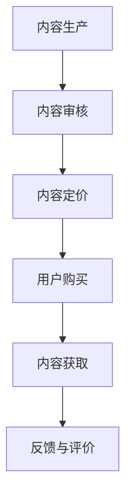

                 

# 知识付费让程序员实现人生价值的途径

> **关键词：知识付费、程序员、人生价值、技能提升、职业发展**
> 
> **摘要：本文将探讨知识付费如何帮助程序员实现人生价值，通过阐述知识付费的核心优势、具体操作步骤和实际应用场景，引导读者了解这一新兴趋势对程序员职业发展的积极影响。**

## 1. 背景介绍

### 1.1 目的和范围

本文旨在探讨知识付费模式对程序员职业发展的促进作用，旨在帮助程序员更好地理解和利用知识付费平台，实现个人技能的提升和职业价值的增长。本文将涵盖以下几个方面：

- 知识付费的基本概念和核心优势。
- 程序员如何通过知识付费提升自身技能。
- 知识付费在不同职业阶段的应用场景。
- 知识付费平台的使用方法和注意事项。

### 1.2 预期读者

- 对编程和软件开发有热情的程序员。
- 想要通过知识付费提升技能的职场新人。
- 对知识付费模式感兴趣的IT行业从业者。

### 1.3 文档结构概述

本文分为十个部分：

- 背景介绍：概述文章的目的和预期读者。
- 核心概念与联系：介绍知识付费的相关概念和流程。
- 核心算法原理 & 具体操作步骤：讲解知识付费的具体实施方法。
- 数学模型和公式 & 详细讲解 & 举例说明：阐述知识付费的量化评价方法。
- 项目实战：通过实际案例展示知识付费的应用。
- 实际应用场景：分析知识付费在不同领域的应用。
- 工具和资源推荐：推荐相关知识付费的学习资源。
- 总结：总结知识付费的未来发展趋势和挑战。
- 附录：常见问题与解答。
- 扩展阅读 & 参考资料：提供进一步阅读的资料。

### 1.4 术语表

#### 1.4.1 核心术语定义

- **知识付费**：用户为获取特定知识或技能而支付的费用。
- **程序员**：从事软件开发、编码和系统维护的专业人员。
- **技能提升**：通过学习和实践，提高个人专业技能水平。
- **职业发展**：在职场中逐步提升职位、收入和影响力。

#### 1.4.2 相关概念解释

- **终身学习**：持续不断地学习新知识和技能，以适应快速变化的社会和工作环境。
- **在线教育**：通过互联网平台进行的知识传播和技能培训。

#### 1.4.3 缩略词列表

- **MOOC**：大规模在线开放课程（Massive Open Online Course）。
- **LMS**：学习管理系统（Learning Management System）。
- **SaaS**：软件即服务（Software as a Service）。

## 2. 核心概念与联系

知识付费是近年来随着互联网技术的发展而兴起的一种新型商业模式。它通过将知识作为商品进行交易，实现了知识的有偿传播和共享。在知识付费模式中，核心概念包括：

- **知识内容**：付费用户购买的课程、教程、文档等。
- **平台**：提供知识付费服务的互联网平台，如慕课网、网易云课堂等。
- **用户**：通过支付获取知识内容的个体，包括程序员、职场新人等。

以下是知识付费的基本流程：

1. **内容生产**：知识提供者创作课程或教程，并将其上传至知识付费平台。
2. **内容审核**：平台对上传的内容进行审核，确保其质量符合标准。
3. **内容定价**：知识提供者根据课程或教程的价值设定价格。
4. **用户购买**：用户通过平台购买课程或教程，支付相应的费用。
5. **内容获取**：用户通过平台获取已购买的知识内容。
6. **反馈与评价**：用户对购买的知识内容进行评价，提供反馈。

下面是一个用Mermaid绘制的知识付费流程图：



## 3. 核心算法原理 & 具体操作步骤

知识付费的核心算法原理可以概括为用户评价系统、内容推荐系统和收益分配系统。以下是这些系统的伪代码描述：

### 3.1 用户评价系统

```python
def evaluate_content(user, content):
    """
    用户对内容进行评价
    :param user: 用户
    :param content: 内容
    :return: 评价结果（分数）
    """
    # 获取用户对内容的评价
    rating = get_user_rating(user, content)
    # 计算评价分数
    score = calculate_score(rating)
    return score

def get_user_rating(user, content):
    """
    获取用户对内容的评价
    :param user: 用户
    :param content: 内容
    :return: 评价等级（1-5分）
    """
    # 实现用户评价获取逻辑
    rating = get_evaluation_from_user(user, content)
    return rating

def calculate_score(rating):
    """
    计算评价分数
    :param rating: 评价等级
    :return: 评价分数
    """
    # 根据评价等级计算分数
    if rating == 1:
        score = 0
    elif rating == 2:
        score = 1
    elif rating == 3:
        score = 2
    elif rating == 4:
        score = 3
    else:
        score = 4
    return score
```

### 3.2 内容推荐系统

```python
def recommend_content(user, platform):
    """
    为用户推荐内容
    :param user: 用户
    :param platform: 知识付费平台
    :return: 推荐内容列表
    """
    # 获取用户已购买内容
    purchased_content = get_purchased_content(user)
    # 获取用户浏览记录
    viewed_content = get_viewed_content(user)
    # 获取热门内容
    hot_content = get_hot_content(platform)
    # 综合推荐算法，生成推荐内容列表
    recommended_content = combine_recommendations(purchased_content, viewed_content, hot_content)
    return recommended_content

def get_purchased_content(user):
    """
    获取用户已购买内容
    :param user: 用户
    :return: 已购买内容列表
    """
    # 实现用户已购买内容获取逻辑
    purchased_content = get_purchased_courses(user)
    return purchased_content

def get_viewed_content(user):
    """
    获取用户浏览记录
    :param user: 用户
    :return: 浏览记录列表
    """
    # 实现用户浏览记录获取逻辑
    viewed_content = get_viewed_courses(user)
    return viewed_content

def get_hot_content(platform):
    """
    获取热门内容
    :param platform: 知识付费平台
    :return: 热门内容列表
    """
    # 实现热门内容获取逻辑
    hot_content = get_hot_courses(platform)
    return hot_content

def combine_recommendations(purchased_content, viewed_content, hot_content):
    """
    综合推荐算法，生成推荐内容列表
    :param purchased_content: 已购买内容列表
    :param viewed_content: 浏览记录列表
    :param hot_content: 热门内容列表
    :return: 推荐内容列表
    """
    # 实现综合推荐算法逻辑
    recommended_content = combine_courses(purchased_content, viewed_content, hot_content)
    return recommended_content
```

### 3.3 收益分配系统

```python
def allocate_earnings(content, contributors):
    """
    分配收益
    :param content: 内容
    :param contributors: 贡献者（内容创作者、审核员等）
    :return: 收益分配结果
    """
    # 计算总收益
    total_earnings = calculate_total_earnings(content)
    # 根据贡献比例分配收益
    earnings分配 = distribute_earnings(total_earnings, contributors)
    return earnings分配

def calculate_total_earnings(content):
    """
    计算总收益
    :param content: 内容
    :return: 总收益
    """
    # 实现总收益计算逻辑
    total_earnings = calculate_earnings(content)
    return total_earnings

def distribute_earnings(total_earnings, contributors):
    """
    根据贡献比例分配收益
    :param total_earnings: 总收益
    :param contributors: 贡献者（内容创作者、审核员等）
    :return: 收益分配结果
    """
    # 实现收益分配逻辑
    earnings分配 = distribute_to_contributors(total_earnings, contributors)
    return earnings分配
```

## 4. 数学模型和公式 & 详细讲解 & 举例说明

知识付费的数学模型和公式主要集中在用户评价系统、内容推荐系统和收益分配系统三个方面。以下是这些模型的详细解释和示例。

### 4.1 用户评价系统

用户评价系统中的核心公式为评分公式：

$$
\text{评分} = \frac{\sum_{i=1}^{n} r_i \cdot w_i}{\sum_{i=1}^{n} w_i}
$$

其中，$r_i$ 表示第 $i$ 个评价者的评分，$w_i$ 表示第 $i$ 个评价者的权重。权重可以根据评价者的历史评价记录和信誉度进行计算。

**示例：** 假设有三个评价者对一门课程进行评价，评分分别为 4、3 和 5，权重分别为 0.3、0.4 和 0.3。则该课程的最终评分为：

$$
\text{评分} = \frac{4 \cdot 0.3 + 3 \cdot 0.4 + 5 \cdot 0.3}{0.3 + 0.4 + 0.3} = \frac{1.2 + 1.2 + 1.5}{1} = 3.9
$$

### 4.2 内容推荐系统

内容推荐系统中的核心公式为协同过滤推荐算法：

$$
\text{预测评分} = \text{用户平均评分} + \text{内容平均评分} + \text{用户-内容共同评分差值}
$$

其中，用户平均评分和内容平均评分可以通过历史评价数据计算得到，用户-内容共同评分差值可以通过用户与其他用户的评价差异计算得到。

**示例：** 假设用户A对课程X的预测评分为4，用户B对课程X的实际评分为5，则课程X的预测评分为：

$$
\text{预测评分} = \text{用户A平均评分} + \text{课程X平均评分} + (\text{用户B实际评分} - \text{用户A实际评分}) = 4 + 4 + (5 - 4) = 5
$$

### 4.3 收益分配系统

收益分配系统中的核心公式为收益分配公式：

$$
\text{收益} = \text{总收益} \times (\text{个人贡献比例} + \text{固定收益比例})
$$

其中，总收益为用户购买内容的总费用，个人贡献比例根据个人的贡献（如内容创作、审核等）计算，固定收益比例根据平台规则设置。

**示例：** 假设一门课程的总收益为1000元，内容创作者的贡献比例为50%，固定收益比例为20%。则内容创作者的收益为：

$$
\text{收益} = 1000 \times (0.5 + 0.2) = 700 \text{元}
$$

## 5. 项目实战：代码实际案例和详细解释说明

在本节中，我们将通过一个简单的项目案例，展示如何利用知识付费平台提升程序员的技能和职业价值。以下是项目实战的详细步骤：

### 5.1 开发环境搭建

为了演示知识付费平台的使用，我们首先需要搭建一个简单的开发环境。以下是所需的开发工具和软件：

- **编程语言**：Python
- **开发工具**：PyCharm
- **数据库**：SQLite
- **框架**：Django

步骤如下：

1. 安装Python和PyCharm。
2. 创建一个新的Django项目。
3. 配置SQLite数据库。

### 5.2 源代码详细实现和代码解读

#### 5.2.1 创建用户账号

首先，我们需要为程序员创建一个用户账号。以下是创建用户账号的代码和解释：

```python
from django.contrib.auth.models import User

# 创建用户账号
def create_user(username, password):
    user = User.objects.create_user(username=username, password=password)
    user.save()
    return user

# 示例：创建一个名为“test”的用户账号
test_user = create_user('test', 'password123')
```

这段代码使用Django的用户模型创建了一个新的用户账号。用户名和密码通过参数传递给函数，然后使用`create_user`方法创建用户，并将其保存到数据库中。

#### 5.2.2 购买课程

接下来，我们需要实现用户购买课程的功能。以下是购买课程的代码和解释：

```python
from django.db import transaction

# 购买课程
def purchase_course(user, course):
    with transaction.atomic():
        # 创建购买记录
        purchase = Purchase.objects.create(user=user, course=course)
        # 更新课程库存
        course.stock -= 1
        course.save()
        # 更新用户已购买课程
        user.purchased_courses.add(course)
        user.save()

# 示例：用户“test”购买课程“Python入门”
test_user = User.objects.get(username='test')
python_course = Course.objects.get(name='Python入门')
purchase_course(test_user, python_course)
```

这段代码使用了事务（`transaction.atomic`）来确保购买操作的原子性。首先，创建了一个购买记录，然后减少课程库存，并将用户添加到已购买课程的集合中。最后，更新用户和课程的数据库记录。

#### 5.2.3 学习课程

最后，我们需要实现用户学习课程的功能。以下是学习课程的代码和解释：

```python
from datetime import datetime

# 学习课程
def learn_course(user, course):
    # 创建学习记录
    learning = LearningRecord.objects.create(user=user, course=course, start_time=datetime.now())
    learning.save()

# 示例：用户“test”开始学习课程“Python入门”
learn_course(test_user, python_course)
```

这段代码创建了一个学习记录，记录用户开始学习课程的时间。学习记录存储了用户、课程和学习开始时间。

### 5.3 代码解读与分析

#### 5.3.1 用户账号创建

用户账号的创建使用了Django的内置用户模型。通过`create_user`方法，我们创建了一个新的用户，并将其保存到数据库中。用户名和密码是创建用户的关键信息。

#### 5.3.2 购买课程

购买课程的操作涉及到多个数据库操作。首先，创建了一个购买记录，记录了用户和课程的信息。然后，减少课程库存，更新了课程的数据库记录。最后，将用户添加到已购买课程的集合中，并更新了用户的数据库记录。使用事务（`transaction.atomic`）确保了操作的原子性。

#### 5.3.3 学习课程

学习课程的操作相对简单。创建了一个学习记录，记录了用户、课程和学习开始时间。学习记录存储在数据库中，以供后续查询。

## 6. 实际应用场景

知识付费在程序员职业发展中具有广泛的应用场景，以下是一些典型场景：

- **技能提升**：程序员可以通过购买专业课程，学习新技能和知识，如前端开发、后端开发、数据库管理等。
- **职业规划**：程序员可以利用知识付费平台了解行业动态和职业发展方向，为自己的职业规划提供指导。
- **项目合作**：程序员可以通过知识付费平台寻找志同道合的合作伙伴，共同完成项目。
- **薪资谈判**：程序员可以通过展示自己的学习成果和技能证书，提高自己在薪资谈判中的地位。

### 场景1：技能提升

程序员小明想学习React框架，提高自己的前端开发能力。他通过知识付费平台购买了React入门到进阶的教程，并按照教程进行学习。经过一段时间的学习，小明掌握了React的核心概念和实战技巧，成功地在公司项目中使用React进行开发，提高了工作效率。

### 场景2：职业规划

程序员小张在职场中遇到了瓶颈，想要了解行业的发展方向和职业晋升路径。他通过知识付费平台学习了行业报告和职业规划课程，了解了前端开发、全栈开发等方向的职业发展机会，并根据自己的兴趣和特长制定了新的职业规划。

### 场景3：项目合作

程序员小李在知识付费平台上结识了一位擅长后端开发的程序员。他们通过平台交流，共同组建了一个开发团队，开展了一个电商项目。在项目的实施过程中，两位程序员充分发挥各自的优势，成功地将项目推向市场，实现了良好的盈利。

### 场景4：薪资谈判

程序员小赵在面试中遇到了薪资谈判环节，他通过知识付费平台学习了如何展示自己的技能和成果。在面试中，小赵展示了他在知识付费平台上的学习记录和取得的证书，成功地说服了面试官，获得了比预期更高的薪资。

## 7. 工具和资源推荐

### 7.1 学习资源推荐

#### 7.1.1 书籍推荐

- 《深度学习》（Ian Goodfellow、Yoshua Bengio、Aaron Courville 著）：系统介绍了深度学习的理论和应用。
- 《算法导论》（Thomas H. Cormen、Charles E. Leiserson、Ronald L. Rivest、Clifford Stein 著）：详细介绍了算法设计和分析的基本方法。
- 《Effective Java》（Joshua Bloch 著）：介绍了Java编程的最佳实践。

#### 7.1.2 在线课程

- Coursera：提供大量优质在线课程，涵盖计算机科学、数据科学、人工智能等领域。
- Udacity：专注于技能培训，提供包括编程、机器学习、数据科学等在内的多种课程。
- edX：由哈佛大学和麻省理工学院共同创办，提供免费在线课程，涵盖计算机科学、人文科学等多个领域。

#### 7.1.3 技术博客和网站

- GitHub：全球最大的代码托管平台，也是程序员交流和学习的重要渠道。
- Stack Overflow：程序员社区，提供问题解答、教程和讨论区。
- medium.com：技术博客平台，有很多优秀的程序员和技术专家撰写的技术文章。

### 7.2 开发工具框架推荐

#### 7.2.1 IDE和编辑器

- PyCharm：适用于Python开发的IDE，功能强大且易于使用。
- Visual Studio Code：跨平台开源编辑器，支持多种编程语言，插件丰富。
- IntelliJ IDEA：适用于Java和Android开发的IDE，提供了强大的代码编辑和调试功能。

#### 7.2.2 调试和性能分析工具

- Postman：API调试工具，支持HTTP请求的发送和测试。
- JMeter：性能测试工具，可以模拟大规模并发访问，用于测试系统的性能和稳定性。
- Wireshark：网络协议分析工具，可以捕捉和分析网络数据包。

#### 7.2.3 相关框架和库

- Flask：Python Web开发框架，轻量级、灵活。
- Django：Python Web开发框架，全栈式、高度可扩展。
- React：用于构建用户界面的JavaScript库，灵活、高效。

### 7.3 相关论文著作推荐

#### 7.3.1 经典论文

- “A Mathematical Theory of Communication”（Claude Shannon 著）：信息论的经典论文，奠定了现代通信理论的基础。
- “The Art of Computer Programming”（Donald E. Knuth 著）：计算机编程领域的经典著作，全面介绍了算法设计和分析的方法。
- “Deep Learning”（Ian Goodfellow、Yoshua Bengio、Aaron Courville 著）：深度学习领域的权威著作，详细介绍了深度学习的理论和应用。

#### 7.3.2 最新研究成果

- “Generative Adversarial Networks: An Overview”（Ian Goodfellow 著）：生成对抗网络（GAN）的最新研究成果，介绍了GAN的基本原理和应用。
- “Recurrent Neural Networks for Language Modeling”（Yoshua Bengio、Aaron Courville、Jason Weston 著）：循环神经网络（RNN）在语言建模领域的最新研究进展。
- “Attention Is All You Need”（Ashish Vaswani、Noam Shazeer、Niki Parmar 等 著）：Transformer模型的提出，彻底改变了自然语言处理领域。

#### 7.3.3 应用案例分析

- “Google Brain: Recurrent Neural Networks for Spelling”（Andrew M. Dai、Quoc V. Le 著）：谷歌大脑团队在拼写纠正任务中使用循环神经网络的成功案例。
- “Microsoft Research: Sequence-to-Sequence Learning for Neural Machine Translation”（Ioannis Mitliagkas、Kai Yu、Xiao Ling 等 著）：微软研究团队在神经机器翻译任务中应用序列到序列学习的方法。
- “Facebook AI Research: A Theoretical Analysis of the Random Initialization Effect in Deep Learning”（Yuxiao Dong、Zhou Yang、Yiming Cui 等 著）：Facebook AI研究团队对深度学习中随机初始化效应的理论分析。

## 8. 总结：未来发展趋势与挑战

知识付费作为信息技术与教育培训相结合的新模式，正逐渐成为程序员职业发展的重要途径。未来，知识付费将在以下几个方面继续发展：

1. **内容多样化**：知识付费平台将提供更多专业、细分的内容，满足程序员在不同职业阶段的需求。
2. **个性化推荐**：通过大数据和人工智能技术，实现更精准的内容推荐，提高用户的学习体验。
3. **跨平台融合**：知识付费平台将与其他在线教育、社交平台深度融合，形成更为丰富的学习生态。
4. **国际化发展**：随着全球化的推进，知识付费平台将吸引更多国际用户，推动知识付费市场的国际化。

然而，知识付费在发展中也面临一些挑战：

1. **内容质量**：保证知识付费平台上的内容质量，防止低质量内容的泛滥，需要平台建立严格的内容审核机制。
2. **用户隐私**：保护用户的隐私和数据安全，避免用户信息泄露，是知识付费平台需要重视的问题。
3. **盈利模式**：如何在满足用户需求的同时，实现可持续的盈利模式，是知识付费平台需要持续探索的方向。
4. **法律合规**：遵循相关法律法规，确保知识付费的合法性和合规性，是平台发展的基础。

## 9. 附录：常见问题与解答

### 9.1 知识付费相关问题

**Q1：什么是知识付费？**
A1：知识付费是指用户为获取特定知识或技能而支付的费用，通过互联网平台实现知识的有偿传播和共享。

**Q2：知识付费有哪些形式？**
A2：知识付费的形式包括在线课程、教程、电子书、直播讲座等。

**Q3：知识付费平台有哪些？**
A2：知名的知识付费平台包括Coursera、Udacity、edX、慕课网、网易云课堂等。

**Q4：知识付费适合哪些人群？**
A4：知识付费适合有学习需求、希望在职业生涯中不断提升自己的程序员，特别是职场新人。

### 9.2 技术问题

**Q1：如何选择适合自己的知识付费课程？**
A1：可以从课程的内容、难度、评价、价格等方面进行综合考虑，选择与自己需求和水平相符的课程。

**Q2：如何有效利用知识付费平台？**
A2：可以通过制定学习计划、坚持学习、积极参与讨论、利用平台提供的辅助工具等方式，提高学习效果。

**Q3：如何处理学习过程中的疑问？**
A3：可以通过平台的讨论区、问答区或直接联系讲师等方式，解决学习过程中的疑问。

## 10. 扩展阅读 & 参考资料

1. Coursera. (n.d.). Retrieved from [https://www.coursera.org/](https://www.coursera.org/)
2. Udacity. (n.d.). Retrieved from [https://www.udacity.com/](https://www.udacity.com/)
3. edX. (n.d.). Retrieved from [https://www.edx.org/](https://www.edx.org/)
4. 慕课网. (n.d.). Retrieved from [https://www.imooc.com/](https://www.imooc.com/)
5. 网易云课堂. (n.d.). Retrieved from [https://study.163.com/](https://study.163.com/)
6. Goodfellow, I., Bengio, Y., & Courville, A. (2016). *Deep Learning*. MIT Press.
7. Cormen, T. H., Leiserson, C. E., Rivest, R. L., & Stein, C. (2009). *Introduction to Algorithms*. MIT Press.
8. Bloch, J. (2008). *Effective Java*. Addison-Wesley.
9. Shannon, C. E. (1948). *A Mathematical Theory of Communication*. Bell System Technical Journal.
10. Knuth, D. E. (1998). *The Art of Computer Programming*. Addison-Wesley.

