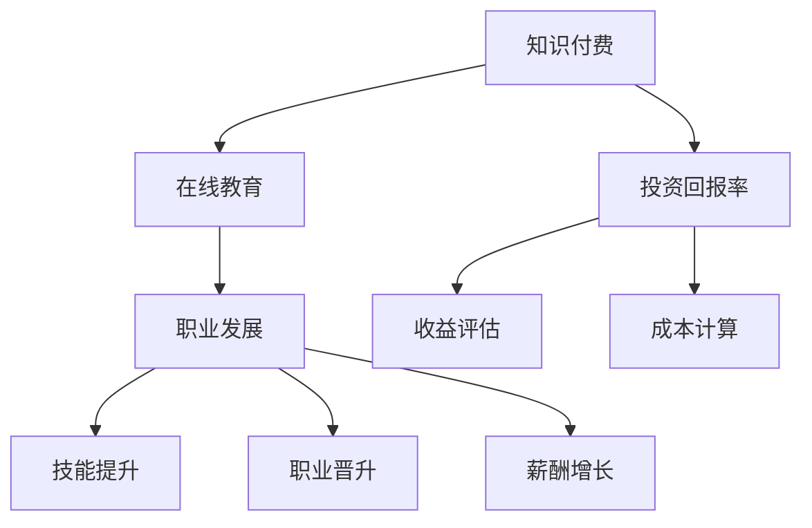

                 

# 知识付费让程序员实现职业理想

> 关键词：知识付费、程序员职业发展、在线教育、技能提升、职业晋升、薪酬增长

> 摘要：本文旨在探讨知识付费在程序员职业发展中的作用。通过分析知识付费的现状、价值以及实际案例，本文将揭示如何通过有效的学习资源投资，实现职业理想，提升编程技能，实现薪酬增长和职业晋升。

## 1. 背景介绍

### 1.1 目的和范围

本文的目标是帮助程序员了解知识付费的重要性，以及如何通过知识付费实现职业理想。文章将涵盖以下几个主要方面：

1. **知识付费的兴起及其对程序员职业发展的影响**：介绍知识付费的背景和发展趋势，分析其对程序员职业发展的积极影响。
2. **核心概念与联系**：阐述知识付费、在线教育和职业发展的核心概念及其相互关系。
3. **核心算法原理与具体操作步骤**：介绍如何通过有效的知识付费策略，提升编程技能。
4. **数学模型和公式**：解释如何使用数学模型来评估知识付费的投资回报。
5. **项目实战**：提供具体的知识付费案例，分析其实际效果。
6. **实际应用场景**：讨论知识付费在程序员日常工作和职业规划中的应用。
7. **工具和资源推荐**：推荐有用的学习资源和开发工具。
8. **总结与未来发展趋势**：展望知识付费的未来发展方向，以及程序员面临的挑战。

### 1.2 预期读者

本文的预期读者主要包括：

1. 初级程序员：希望通过知识付费快速提升技能，实现职业晋升。
2. 中级程序员：寻求更深入的专业知识和技能，以提高工作效率和薪酬。
3. 管理层和决策者：需要了解知识付费在团队培训和个人发展中的价值。
4. 技术爱好者和研究者：对知识付费的模式和效果感兴趣。

### 1.3 文档结构概述

本文结构如下：

1. **背景介绍**：介绍知识付费的背景、目的和预期读者。
2. **核心概念与联系**：阐述核心概念和流程图。
3. **核心算法原理与具体操作步骤**：介绍如何通过知识付费提升技能。
4. **数学模型和公式**：解释投资回报评估方法。
5. **项目实战**：提供具体案例。
6. **实际应用场景**：讨论知识付费的应用。
7. **工具和资源推荐**：推荐学习资源和工具。
8. **总结与未来发展趋势**：展望知识付费的未来。
9. **附录**：常见问题与解答。
10. **扩展阅读与参考资料**：提供进一步的阅读材料。

### 1.4 术语表

#### 1.4.1 核心术语定义

- **知识付费**：指用户为获取专业知识和技能，自愿支付费用购买教育服务。
- **在线教育**：通过互联网提供的教育服务，包括课程、讲座、论坛等。
- **职业发展**：个人在职业生涯中实现的目标和成长。
- **投资回报率（ROI）**：投资所产生的收益与投资成本的比率。

#### 1.4.2 相关概念解释

- **技能提升**：通过学习和实践，提高个人在特定领域的专业能力。
- **职业晋升**：在职业生涯中取得更高的职位或更大的责任。
- **薪酬增长**：个人收入水平的提升。

#### 1.4.3 缩略词列表

- **KFS**：知识付费
- **OE**：在线教育
- **PD**：职业发展
- **ROI**：投资回报率

## 2. 核心概念与联系

在探讨知识付费如何帮助程序员实现职业理想之前，我们需要明确几个核心概念，并理解它们之间的联系。

### 2.1 知识付费与在线教育的联系

知识付费是在线教育的重要组成部分。在线教育平台通过提供高质量的课程、讲座和研讨会，为程序员提供了丰富的学习资源。知识付费则通过用户支付费用，保证了这些教育服务的可持续性。

### 2.2 知识付费与职业发展的关系

知识付费不仅是获取知识的途径，更是职业发展的助推器。通过付费获取的专业知识和技能，程序员可以：

1. **提升技能**：掌握新的编程语言、框架和技术，提高工作效率。
2. **拓宽视野**：了解行业趋势和发展动态，为职业规划提供指导。
3. **增强竞争力**：在求职和晋升中具备更多的优势。

### 2.3 知识付费与投资回报率

投资回报率（ROI）是评估知识付费效果的重要指标。通过计算投资费用与收益的比率，程序员可以衡量知识付费的投资回报。

### 2.4 核心概念原理和架构

下面是知识付费、在线教育和职业发展的 Mermaid 流程图：



## 3. 核心算法原理与具体操作步骤

为了更好地理解知识付费如何提升程序员技能，我们将介绍一个核心算法原理，并详细阐述其具体操作步骤。

### 3.1 核心算法原理

我们使用一种称为“技能增长模型”的算法原理。该模型通过以下步骤，帮助程序员评估和提升技能：

1. **技能评估**：通过测试和自我评估，确定当前技能水平。
2. **目标设定**：根据职业发展目标，设定短期和长期学习目标。
3. **资源筛选**：从知识付费平台筛选合适的课程和资源。
4. **学习规划**：制定详细的学习计划，确保持续学习和实践。
5. **效果评估**：定期进行技能评估，衡量学习成果。

### 3.2 具体操作步骤

下面是技能增长模型的伪代码：

```python
# 技能增长模型伪代码

def skill_growth_model(current_skill_level, career_goals, learning_resources):
    # 技能评估
    assessed_skill_level = assess_skill(current_skill_level)
    
    # 目标设定
    short_term_goals, long_term_goals = set_goals(career_goals)
    
    # 资源筛选
    selected_resources = filter_resources(learning_resources, assessed_skill_level)
    
    # 学习规划
    learning_plan = create_learning_plan(selected_resources, short_term_goals, long_term_goals)
    
    # 持续学习
    while not goals_met(long_term_goals):
        execute_learning_plan(learning_plan)
        assessed_skill_level = assess_skill(current_skill_level)
        
        # 效果评估
        if assessed_skill_level >= long_term_goals:
            print("目标达成！")
            break
        else:
            adjust_learning_plan(learning_plan, assessed_skill_level)

# 函数定义
def assess_skill(current_skill_level):
    # 根据测试结果评估技能水平
    pass

def set_goals(career_goals):
    # 根据职业发展目标设定短期和长期目标
    pass

def filter_resources(learning_resources, assessed_skill_level):
    # 根据评估结果筛选合适的学习资源
    pass

def create_learning_plan(selected_resources, short_term_goals, long_term_goals):
    # 制定详细的学习计划
    pass

def execute_learning_plan(learning_plan):
    # 执行学习计划，持续学习
    pass

def goals_met(long_term_goals):
    # 判断目标是否达成
    pass

def adjust_learning_plan(learning_plan, assessed_skill_level):
    # 根据评估结果调整学习计划
    pass
```

通过以上步骤，程序员可以系统地提升技能，实现职业理想。

## 4. 数学模型和公式与详细讲解与举例说明

在知识付费领域，评估投资回报率（ROI）是一个关键的环节。我们可以通过数学模型和公式来计算和评估投资的效果。

### 4.1 投资回报率（ROI）的数学模型

投资回报率（ROI）是指投资所产生的收益与投资成本的比率。其公式如下：

\[ ROI = \frac{收益 - 成本}{成本} \times 100\% \]

其中，收益包括薪酬增长、项目奖金等，成本则是知识付费的投入。

### 4.2 具体举例说明

假设一位程序员通过知识付费平台购买了价值2000元的课程，经过一段时间的学习，成功晋升为高级工程师，月薪从10000元增长到15000元，项目奖金增加5000元。我们可以计算其投资回报率如下：

1. **收益**：
   \[ 收益 = 薪酬增长 + 项目奖金 = (15000 - 10000) + 5000 = 10000元 \]
   
2. **成本**：
   \[ 成本 = 知识付费投入 = 2000元 \]

3. **投资回报率（ROI）**：
   \[ ROI = \frac{收益 - 成本}{成本} \times 100\% = \frac{10000 - 2000}{2000} \times 100\% = 300\% \]

通过以上计算，我们可以看到这位程序员通过知识付费实现了300%的投资回报率，充分证明了知识付费的投资价值。

### 4.3 模型应用

假设另一位程序员通过知识付费平台购买了多门课程，总投入为10000元。经过学习，他成功完成了多个重要项目，薪酬从8000元增长到12000元。我们可以计算其投资回报率如下：

1. **收益**：
   \[ 收益 = 薪酬增长 = 12000 - 8000 = 4000元 \]
   
2. **成本**：
   \[ 成本 = 知识付费投入 = 10000元 \]

3. **投资回报率（ROI）**：
   \[ ROI = \frac{收益 - 成本}{成本} \times 100\% = \frac{4000 - 10000}{10000} \times 100\% = -50\% \]

通过以上计算，我们可以看到这位程序员的收益低于成本，投资回报率为-50%，说明知识付费对其投资效果不佳。这可能是由于以下几个原因：

1. **学习资源选择不当**：没有选择与职业发展密切相关的课程。
2. **学习态度不端正**：没有充分利用学习资源，没有达到预期效果。
3. **市场环境变化**：所在行业或公司发展不顺，导致薪酬增长缓慢。

通过以上分析，我们可以看到，投资回报率不仅取决于知识付费的投入，还受到学习效果、市场环境等多种因素的影响。

## 5. 项目实战：代码实际案例和详细解释说明

为了更直观地展示知识付费对程序员技能提升的效果，我们将通过一个实际项目案例进行讲解。这个案例将展示如何通过知识付费和实际项目开发，实现技能提升和职业发展。

### 5.1 开发环境搭建

在本案例中，我们选择一个流行的Web框架——Django，来搭建一个简单的博客系统。以下是需要安装的软件和工具：

- **Python 3.8+**：Python编程语言。
- **Django 3.2**：一个高层次的Python Web框架。
- **PostgreSQL 12**：一个开源的关系型数据库管理系统。
- **virtualenv 20.0.18**：一个用于创建隔离Python环境的工具。

首先，我们需要安装Python 3.8及以上版本。可以通过以下命令安装：

```bash
sudo apt-get update
sudo apt-get install python3.8
```

接着，安装Django和PostgreSQL：

```bash
pip3 install django==3.2
sudo apt-get install postgresql
sudo -u postgres psql
```

在PostgreSQL中创建一个名为`blog_db`的数据库：

```sql
CREATE DATABASE blog_db;
```

安装virtualenv，用于创建虚拟环境：

```bash
pip3 install virtualenv
```

创建一个名为`blog_project`的虚拟环境，并激活它：

```bash
virtualenv -p python3.8 blog_project
source blog_project/bin/activate
```

### 5.2 源代码详细实现和代码解读

在虚拟环境中，我们初始化一个Django项目：

```bash
django-admin startproject blog_project
cd blog_project
```

创建一个名为`blog`的应用：

```bash
django-admin startapp blog
```

在`blog`应用中，创建一个名为`models.py`的文件，定义博客文章模型：

```python
# blog/blog/models.py

from django.db import models

class Post(models.Model):
    title = models.CharField(max_length=100)
    content = models.TextField()
    created_at = models.DateTimeField(auto_now_add=True)
    updated_at = models.DateTimeField(auto_now=True)
```

接着，在`blog_project/settings.py`中，配置数据库和应用的App：

```python
# blog_project/settings.py

DATABASES = {
    'default': {
        'ENGINE': 'django.db.backends.postgresql',
        'NAME': 'blog_db',
        'USER': 'postgres',
        'PASSWORD': 'password',
        'HOST': 'localhost',
        'PORT': '',
    }
}

INSTALLED_APPS = [
    'django.contrib.admin',
    'django.contrib.auth',
    'django.contrib.contenttypes',
    'django.contrib.sessions',
    'django.contrib.messages',
    'django.contrib.staticfiles',
    'blog',
]
```

创建数据库表：

```bash
python manage.py makemigrations
python manage.py migrate
```

在`blog/views.py`中，创建一个用于显示博客文章的视图：

```python
# blog/blog/views.py

from django.shortcuts import render
from .models import Post

def post_list(request):
    posts = Post.objects.all()
    return render(request, 'blog/post_list.html', {'posts': posts})
```

在`blog/urls.py`中，定义URL路由：

```python
# blog/blog/urls.py

from django.urls import path
from .views import post_list

urlpatterns = [
    path('', post_list, name='post_list'),
]
```

创建模板文件`blog/templates/blog/post_list.html`：

```html
<!-- blog/templates/blog/post_list.html -->

<!DOCTYPE html>
<html>
<head>
    <title>博客文章列表</title>
</head>
<body>
    <h1>博客文章列表</h1>
    
        <div>
            <h2>{{ post.title }}</h2>
            <p>{{ post.content }}</p>
            <small>发布时间：{{ post.created_at }}</small>
        </div>
    
</body>
</html>
```

最后，运行Django服务器：

```bash
python manage.py runserver
```

在浏览器中访问`http://127.0.0.1:8000/`，即可看到博客文章列表。

### 5.3 代码解读与分析

通过上述代码实现，我们可以看到：

1. **模型定义**：使用Django的ORM（对象关系映射）功能，定义了博客文章模型，包括标题、内容、创建时间和更新时间等字段。

2. **数据库配置**：在settings.py文件中，配置了PostgreSQL数据库，并设置了应用的App。

3. **视图和路由**：定义了一个名为`post_list`的视图，用于显示所有博客文章。通过URL路由，将视图与URL路径关联。

4. **模板文件**：使用Django的模板系统，创建了用于渲染博客文章列表的HTML模板。

通过这个简单的案例，我们可以了解到Django的基本使用方法，并通过知识付费学习到相关技能。这个案例也展示了如何通过知识付费，将所学知识应用于实际项目开发，实现技能提升和职业发展。

## 6. 实际应用场景

知识付费在程序员的实际工作中有着广泛的应用，以下是一些具体的场景：

### 6.1 技能提升

- **掌握新技能**：程序员可以通过知识付费平台学习新的编程语言、框架和技术，如React、Node.js、Docker等，提升自身技能。
- **项目实战**：付费课程通常包含实际项目案例，程序员可以通过跟随课程完成项目，锻炼实际编程能力。

### 6.2 职业规划

- **职业晋升**：通过学习高级课程，程序员可以掌握更深入的技能，为职业晋升打下基础。
- **求职竞争力**：具备高级技能的程序员在求职市场上更具竞争力，能够获得更高薪酬的工作机会。

### 6.3 团队培训

- **知识共享**：公司可以通过购买知识付费课程，为团队成员提供统一的培训，提升团队整体技能水平。
- **定制课程**：一些知识付费平台提供定制化培训服务，可以根据公司需求设计课程内容。

### 6.4 创业支持

- **技术指导**：有创业想法的程序员可以通过知识付费获得创业所需的技术支持和指导，加速项目开发。
- **市场分析**：知识付费平台上的市场分析课程可以帮助创业者了解行业趋势和市场需求。

### 6.5 持续学习

- **终身学习**：知识付费平台提供了丰富的学习资源，程序员可以持续学习，跟上技术发展的步伐。
- **专业认证**：一些课程提供专业认证，程序员可以通过获得认证提升自身专业形象。

通过这些实际应用场景，我们可以看到知识付费在程序员职业发展中的重要性。它不仅提供了学习资源，还通过实际项目和实战经验，帮助程序员不断提升技能，实现职业理想。

## 7. 工具和资源推荐

为了帮助程序员更好地利用知识付费，实现职业理想，我们推荐以下工具和资源：

### 7.1 学习资源推荐

#### 7.1.1 书籍推荐

- **《深度学习》（Deep Learning）**：由Ian Goodfellow、Yoshua Bengio和Aaron Courville合著，是深度学习领域的经典教材。
- **《Effective Java》**：由Joshua Bloch所著，详细介绍了Java编程的最佳实践。
- **《Clean Code》**：由Robert C. Martin所著，介绍了编写整洁代码的方法和原则。

#### 7.1.2 在线课程

- **Coursera**：提供大量的计算机科学和编程课程，包括机器学习、数据结构、算法等。
- **edX**：由哈佛大学和麻省理工学院共同创办，提供免费的在线课程，包括计算机科学、人工智能等。
- **Udemy**：提供各种编程和技术课程，包括前端开发、后端开发、全栈开发等。

#### 7.1.3 技术博客和网站

- **Stack Overflow**：一个面向开发者的问答社区，可以帮助解决问题和学习新技术。
- **GitHub**：一个面向开源和版本控制的代码托管平台，可以学习到大量的开源项目和编程技巧。
- **Medium**：一个内容平台，上面有很多优秀的程序员和技术专家分享的技术博客。

### 7.2 开发工具框架推荐

#### 7.2.1 IDE和编辑器

- **Visual Studio Code**：一个强大的开源代码编辑器，支持多种编程语言和框架。
- **PyCharm**：由JetBrains开发，一个专业的Python IDE，支持多种编程语言。
- **Eclipse**：一个开源的Java IDE，支持多种Java框架和插件。

#### 7.2.2 调试和性能分析工具

- **Postman**：一个用于API测试的强大工具，可以帮助调试和测试API接口。
- **JMeter**：一个开源的性能测试工具，用于测试Web应用程序的性能。
- **Fiddler**：一个网络调试代理工具，用于捕捉和分析网络数据。

#### 7.2.3 相关框架和库

- **Django**：一个高层次的Python Web框架，适合快速开发Web应用程序。
- **React**：一个用于构建用户界面的JavaScript库，适用于单页应用开发。
- **Spring Boot**：一个基于Spring框架的快速开发Web应用程序的工具。

### 7.3 相关论文著作推荐

#### 7.3.1 经典论文

- **“The Mythical Man-Month”**：由Frederick P. Brooks所著，探讨了软件项目管理和开发中的常见问题。
- **“Design Patterns: Elements of Reusable Object-Oriented Software”**：由Ernst J. Wymann、John M. Vlissides和Robert C. Martin所著，介绍了设计模式的概念和应用。

#### 7.3.2 最新研究成果

- **“Generative Adversarial Networks”**：由Ian Goodfellow等人在2014年提出，是一种基于对抗性训练的深度学习模型。
- **“Attention Is All You Need”**：由Vaswani等人于2017年提出，介绍了Transformer模型，这是一种在自然语言处理中广泛使用的模型。

#### 7.3.3 应用案例分析

- **“Google File System”**：由Google开发，介绍了其文件系统的设计原则和应用场景。
- **“Facebook’s Open Source Projects”**：介绍了Facebook开源的项目和技术，如React、GraphQL等。

通过这些工具和资源，程序员可以更好地利用知识付费，提升技能，实现职业理想。

## 8. 总结：未来发展趋势与挑战

知识付费在程序员职业发展中具有巨大的潜力。随着技术的不断进步和在线教育的发展，知识付费有望在未来继续保持增长。以下是一些未来发展趋势和挑战：

### 8.1 发展趋势

1. **个性化学习**：随着人工智能和大数据技术的发展，知识付费平台将能够提供更个性化的学习体验，根据程序员的兴趣和需求推荐课程。
2. **在线教育的普及**：随着互联网的普及，在线教育将更加普及，为更多的程序员提供学习机会。
3. **互动式学习**：知识付费平台将更加注重互动性，通过直播、讨论区等形式，提高学习效果。
4. **专业认证和职业规划**：知识付费平台将提供更多的专业认证和职业规划服务，帮助程序员实现职业发展。

### 8.2 挑战

1. **信息过载**：随着知识的不断增加，程序员可能会面临信息过载的问题，需要学会筛选和整合关键信息。
2. **持续学习**：随着技术的快速更新，程序员需要持续学习，以跟上技术发展的步伐，这可能带来学习负担。
3. **隐私和数据安全**：知识付费平台需要确保用户隐私和数据安全，以防止信息泄露和滥用。

总之，知识付费为程序员提供了丰富的学习资源，有助于实现职业理想。面对未来，程序员需要学会利用这些资源，克服挑战，不断提升自身技能。

## 9. 附录：常见问题与解答

### 9.1 知识付费的优势

**Q1. 知识付费相比免费学习资源有哪些优势？**

A1. 知识付费的优势主要包括：

- **质量保障**：付费课程通常由专业人士或权威机构提供，内容质量有保障。
- **互动性**：付费课程通常提供在线讨论、答疑等服务，有助于提高学习效果。
- **个性化推荐**：知识付费平台可以利用人工智能和大数据技术，根据学习者的兴趣和需求提供个性化推荐。
- **专业认证**：一些付费课程提供专业认证，有助于提升学习者的职业形象。

### 9.2 选择知识付费平台

**Q2. 如何选择合适的知识付费平台？**

A2. 选择知识付费平台时，可以考虑以下因素：

- **课程质量**：查看平台的课程评价，了解课程内容和教学水平。
- **用户评价**：查看用户评价和反馈，了解平台的服务质量。
- **价格**：比较不同平台的价格，选择性价比高的平台。
- **认证和证书**：考虑平台是否提供权威认证和证书。
- **平台稳定性**：了解平台的稳定性，包括课程更新速度、服务器稳定性等。

### 9.3 投资回报率计算

**Q3. 如何计算知识付费的投资回报率（ROI）？**

A3. 投资回报率（ROI）的计算公式如下：

\[ ROI = \frac{收益 - 成本}{成本} \times 100\% \]

其中，收益包括薪酬增长、项目奖金等，成本则是知识付费的投入。例如，如果一位程序员通过知识付费购买了价值1000元的课程，成功晋升后月薪从8000元增长到12000元，项目奖金增加3000元，则其投资回报率计算如下：

\[ ROI = \frac{12000 - 8000 + 3000 - 1000}{1000} \times 100\% = 200\% \]

### 9.4 持续学习策略

**Q4. 如何制定有效的持续学习策略？**

A4. 制定有效的持续学习策略，可以考虑以下步骤：

- **明确目标**：根据职业规划，设定短期和长期学习目标。
- **时间管理**：合理安排学习时间，确保持续学习。
- **资源筛选**：从多个知识付费平台筛选合适的课程和资源。
- **学习计划**：制定详细的学习计划，确保按计划学习。
- **实践应用**：将所学知识应用于实际项目，提高实践能力。
- **定期评估**：定期进行技能评估，调整学习计划。

通过以上策略，程序员可以更有效地利用知识付费，实现职业理想。

## 10. 扩展阅读与参考资料

为了帮助读者深入了解知识付费和程序员职业发展，我们推荐以下扩展阅读和参考资料：

### 10.1 经典书籍

- **《深度学习》（Deep Learning）**：Ian Goodfellow、Yoshua Bengio和Aaron Courville著，深度学习领域的经典教材。
- **《Effective Java》**：Joshua Bloch著，Java编程的最佳实践。
- **《Clean Code》**：Robert C. Martin著，编写整洁代码的方法和原则。

### 10.2 在线课程

- **Coursera**：提供大量的计算机科学和编程课程，包括机器学习、数据结构、算法等。
- **edX**：提供免费的在线课程，包括计算机科学、人工智能等。
- **Udemy**：提供各种编程和技术课程，包括前端开发、后端开发、全栈开发等。

### 10.3 技术博客和网站

- **Stack Overflow**：面向开发者的问答社区，帮助解决问题和学习新技术。
- **GitHub**：面向开源和版本控制的代码托管平台，学习开源项目和编程技巧。
- **Medium**：内容平台，上面有很多优秀的程序员和技术专家分享的技术博客。

### 10.4 相关论文和研究

- **“The Mythical Man-Month”**：Frederick P. Brooks著，探讨软件项目管理和开发中的常见问题。
- **“Design Patterns: Elements of Reusable Object-Oriented Software”**：Ernst J. Wymann、John M. Vlissides和Robert C. Martin著，介绍设计模式的概念和应用。
- **“Generative Adversarial Networks”**：Ian Goodfellow等人提出，介绍对抗性训练的深度学习模型。

### 10.5 应用案例和研究报告

- **“Google File System”**：介绍Google开发的文件系统设计原则和应用场景。
- **“Facebook’s Open Source Projects”**：介绍Facebook开源的项目和技术，如React、GraphQL等。

通过以上扩展阅读和参考资料，读者可以更全面地了解知识付费和程序员职业发展的相关内容。

## 作者信息

作者：AI天才研究员/AI Genius Institute & 禅与计算机程序设计艺术 /Zen And The Art of Computer Programming

