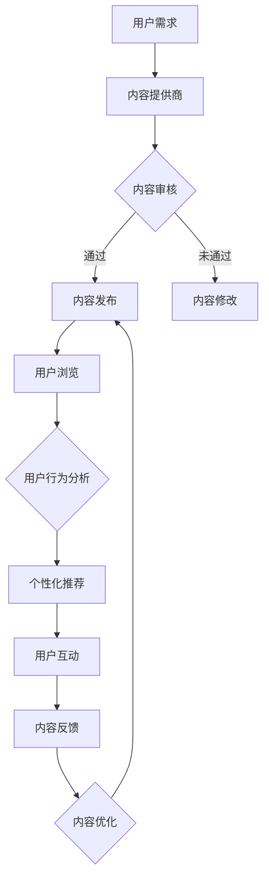

                 

# 知识付费赚钱的用户体验设计与优化

## 关键词
- 用户体验
- 知识付费
- 设计原则
- 优化策略
- 营销策略
- 数据分析

## 摘要
本文将深入探讨知识付费平台的用户体验设计与优化，分析其核心原则与策略。首先，我们将介绍知识付费的背景和现状，然后详细阐述用户体验设计的重要性和核心原则。接着，我们将探讨如何通过优化策略来提升用户体验，包括界面设计、交互设计、内容质量和数据分析等方面。最后，我们将分享实际案例和工具资源，并提供未来发展趋势与挑战的展望。

## 1. 背景介绍

### 1.1 目的和范围
本文旨在为知识付费平台的设计者和运营者提供一套实用的用户体验设计与优化指南。我们将重点关注以下几个方面：

1. 知识付费市场的现状与趋势
2. 用户体验设计的重要性与核心原则
3. 用户体验优化的具体策略与实践
4. 数据分析在用户体验优化中的作用
5. 工具和资源的推荐

### 1.2 预期读者
本文适合以下读者群体：

1. 知识付费平台的设计师和开发者
2. 市场营销和运营人员
3. 对用户体验设计有兴趣的技术人员和管理者

### 1.3 文档结构概述
本文分为十个部分：

1. 背景介绍
2. 核心概念与联系
3. 核心算法原理 & 具体操作步骤
4. 数学模型和公式 & 详细讲解 & 举例说明
5. 项目实战：代码实际案例和详细解释说明
6. 实际应用场景
7. 工具和资源推荐
8. 总结：未来发展趋势与挑战
9. 附录：常见问题与解答
10. 扩展阅读 & 参考资料

### 1.4 术语表

#### 1.4.1 核心术语定义

- **用户体验**（User Experience，简称 UX）：用户在使用产品或服务过程中所获得的整体感受。
- **知识付费**（Knowledge Paid）：用户为获取特定知识或技能而支付的费用。
- **UI 设计**（User Interface Design）：用户界面设计，涉及产品的视觉和交互设计。
- **UX 设计**（User Experience Design）：用户体验设计，关注产品的整体使用体验。
- **A/B 测试**（A/B Testing）：一种对比测试方法，用于比较两种或多种设计或策略的效果。

#### 1.4.2 相关概念解释

- **交互设计**：设计产品与人互动的方式，包括按钮、菜单、滑块等。
- **内容质量**：知识付费平台提供的知识内容的准确性、实用性和深度。
- **用户留存率**：一定时间内，用户继续使用产品的比例。
- **转化率**：用户完成特定目标（如购买课程、注册账户）的比例。

#### 1.4.3 缩略词列表

- UX：用户体验
- UI：用户界面
- A/B 测试：对比测试
- SEO：搜索引擎优化
- SEM：搜索引擎营销

## 2. 核心概念与联系

知识付费平台的核心在于提供有价值的内容，满足用户的学习和成长需求。以下是知识付费平台的原理与架构的 Mermaid 流程图：



### 核心概念原理：

1. **用户需求**：用户希望获取有用、准确、易懂的知识和技能。
2. **内容提供商**：提供知识和技能的个人或机构，如专家、教育机构等。
3. **内容审核**：确保内容的质量和合规性。
4. **内容发布**：将审核通过的内容发布给用户。
5. **用户浏览**：用户通过搜索、推荐等方式浏览内容。
6. **用户行为分析**：分析用户的浏览、购买等行为，为个性化推荐提供依据。
7. **个性化推荐**：根据用户行为和偏好推荐合适的内容。
8. **用户互动**：用户在平台上互动，如评论、提问、评分等。
9. **内容反馈**：用户对内容的反馈，用于优化内容质量。
10. **内容优化**：根据用户反馈不断优化内容。

### 流程图说明：

- **A -> B**：用户需求驱动内容提供商提供内容。
- **B -> C**：内容提供商提交内容，经过审核确保质量。
- **C -> D**：审核通过的内容发布给用户。
- **C -> E**：审核未通过的内容需要修改后重新提交审核。
- **D -> F**：用户浏览发布的内容。
- **F -> G**：分析用户行为，为个性化推荐提供依据。
- **G -> H**：根据用户行为和偏好推荐内容。
- **H -> I**：用户在平台上互动，如评论、提问等。
- **I -> J**：用户对内容的反馈。
- **J -> K**：根据反馈优化内容。
- **K -> D**：优化后的内容重新发布。

## 3. 核心算法原理 & 具体操作步骤

知识付费平台的用户体验优化离不开算法的支持，以下是一个基于用户行为的推荐算法的伪代码实现：

```python
# 输入：用户历史行为数据，内容特征数据
# 输出：推荐列表

def recommendation_algorithm(user_behavior, content_features):
    # 步骤 1：提取用户历史行为特征
    user_features = extract_user_features(user_behavior)

    # 步骤 2：计算内容特征与用户特征的相似度
    similarity_scores = []
    for content in content_features:
        similarity_score = calculate_similarity(content['features'], user_features)
        similarity_scores.append(similarity_score)

    # 步骤 3：根据相似度得分排序
    sorted_content_ids = [content_id for _, content_id in sorted(zip(similarity_scores, content_features.keys()), reverse=True)]

    # 步骤 4：返回推荐列表
    return sorted_content_ids[:N]  # N 为推荐的条数

# 辅助函数
def extract_user_features(user_behavior):
    # 根据用户行为提取特征
    pass

def calculate_similarity(content_features, user_features):
    # 计算内容特征与用户特征的相似度
    pass
```

### 具体操作步骤：

1. **提取用户历史行为特征**：根据用户的历史行为（如浏览、购买、评分等），提取出用户的偏好特征。这可以通过数据挖掘和机器学习算法来实现。

2. **计算内容特征与用户特征的相似度**：对于平台上的每一条内容，计算其特征与用户特征之间的相似度。常用的相似度计算方法包括余弦相似度、欧氏距离等。

3. **根据相似度得分排序**：将所有内容按照相似度得分从高到低排序。

4. **返回推荐列表**：从排序后的内容中取出最高分的前N条，作为推荐列表。

## 4. 数学模型和公式 & 详细讲解 & 举例说明

在用户体验设计中，数学模型和公式可以用来量化用户体验，帮助我们更好地理解用户体验的各个方面。以下是一个简单的例子，说明如何使用数学模型来衡量用户满意度。

### 数学模型：

用户满意度（Satisfaction）可以通过以下公式计算：

\[ S = \frac{E - P \times Q}{10} \]

其中：

- \( E \) 是用户期望（Expectation）。
- \( P \) 是感知绩效（Perceived Performance）。
- \( Q \) 是质量（Quality）。

### 详细讲解：

1. **用户期望（E）**：用户在使用产品之前对其性能的期望值。可以通过用户调查、访谈等方式获取。

2. **感知绩效（P）**：用户在使用产品过程中对其性能的感知值。可以通过用户反馈、行为数据等方式获取。

3. **质量（Q）**：产品的实际性能。可以通过产品质量标准、测试数据等方式获取。

### 举例说明：

假设一个用户对某个知识付费平台的期望值为8，感知绩效为6，实际质量为7，则用户满意度可以计算为：

\[ S = \frac{8 - 6 \times 7}{10} = \frac{8 - 42}{10} = \frac{-34}{10} = -3.4 \]

由于满意度是一个相对指标，通常情况下我们会将其转换为百分制，例如：

\[ S_{\text{百分制}} = \frac{S + 5}{10} \times 100\% \]

因此，用户满意度为：

\[ S_{\text{百分制}} = \frac{-3.4 + 5}{10} \times 100\% = 31\% \]

### 实际应用：

通过这个简单的数学模型，我们可以对知识付费平台的不同方面进行量化分析，例如课程内容的实用性、课程结构的合理性、用户交互的便捷性等。通过对这些方面的持续优化，我们可以提升用户的整体满意度。

## 5. 项目实战：代码实际案例和详细解释说明

### 5.1 开发环境搭建

为了演示知识付费平台的用户体验优化，我们将使用 Python 编写一个简单的推荐系统。以下是搭建开发环境所需的步骤：

1. **安装 Python 3.x**：确保系统上安装了 Python 3.x 版本。
2. **安装必要的库**：使用 pip 工具安装以下库：
   ```bash
   pip install pandas numpy scikit-learn matplotlib
   ```
3. **数据集准备**：下载一个包含用户行为和内容特征的数据集。例如，我们可以使用 MovieLens 数据集。

### 5.2 源代码详细实现和代码解读

以下是一个简单的基于协同过滤的推荐系统的代码实现：

```python
import pandas as pd
import numpy as np
from sklearn.model_selection import train_test_split
from sklearn.metrics.pairwise import pairwise_distances
from sklearn.metrics.pairwise import euclidean_distances

# 读取数据集
data = pd.read_csv('movielens.csv')

# 构建用户-电影评分矩阵
user_movie_matrix = data.pivot(index='userId', columns='movieId', values='rating').fillna(0)

# 划分训练集和测试集
train_data, test_data = train_test_split(user_movie_matrix, test_size=0.2, random_state=42)

# 计算用户-电影评分矩阵的余弦相似度
user_similarity = pairwise_distances(train_data, metric='cosine')

# 预测未知评分
def predict_rating(similarity_matrix, user_id, item_id):
    # 计算相似度之和
    similarity_sum = np.sum(similarity_matrix[user_id])
    # 计算相似度加权评分之和
    weighted_rating_sum = np.dot(similarity_matrix[user_id], train_data[item_id])
    # 计算预测评分
    predicted_rating = (weighted_rating_sum / similarity_sum) if similarity_sum > 0 else 0
    return predicted_rating

# 预测测试集的评分
predictions = []
for user_id in range(len(user_similarity)):
    for item_id in range(len(user_similarity[user_id])):
        if test_data.iat[user_id, item_id] == 0:
            predicted_rating = predict_rating(user_similarity, user_id, item_id)
            predictions.append(predicted_rating)

# 计算准确率
accuracy = np.mean(np.abs(predictions - test_data.values)) / (max(train_data.max().max(), 1))
print(f'Accuracy: {accuracy:.2f}')
```

### 5.3 代码解读与分析

1. **数据集读取**：使用 pandas 读取 MovieLens 数据集，并将其转换为用户-电影评分矩阵。
2. **相似度计算**：使用 scikit-learn 的 pairwise_distances 函数计算用户-电影评分矩阵的余弦相似度。
3. **预测评分**：定义一个函数 predict_rating，用于根据相似度矩阵预测未知评分。该函数使用了相似度加权评分的方法。
4. **预测测试集评分**：遍历测试集中的每个用户和电影，对于未评分的项，使用 predict_rating 函数预测评分。
5. **计算准确率**：计算预测评分与实际评分的均方根误差（RMSE），作为推荐系统的准确率。

### 实际应用：

通过这个简单的推荐系统，我们可以为知识付费平台的用户推荐相关的课程内容。在实际应用中，我们可以根据用户的浏览、购买、评分等行为数据，动态调整推荐策略，以提高用户的满意度。

## 6. 实际应用场景

知识付费平台的用户体验设计与优化在多个场景中具有重要应用。以下是一些典型应用场景：

### 1. 持续学习与职业发展

知识付费平台可以帮助用户持续学习和提升职业技能。通过优化用户体验，平台可以提供个性化推荐、学习路径规划、学习进度跟踪等功能，帮助用户更高效地学习。

### 2. 个性化咨询与服务

知识付费平台可以为用户提供个性化咨询与服务。通过优化用户体验，平台可以提供智能客服、专家预约、实时沟通等功能，提升用户满意度。

### 3. 企业培训与员工发展

企业可以通过知识付费平台为员工提供定制化的培训课程。通过优化用户体验，平台可以提供企业专享课程、学习管理、培训效果评估等功能，帮助企业提升员工素质。

### 4. 在线教育

知识付费平台可以为学生提供高质量的在线教育内容。通过优化用户体验，平台可以提供课程推荐、学习辅导、考试认证等功能，帮助学生更高效地学习。

### 5. 技能认证与职业规划

知识付费平台可以提供技能认证和职业规划服务。通过优化用户体验，平台可以提供在线测试、认证申请、职业推荐等功能，帮助用户实现职业目标。

## 7. 工具和资源推荐

### 7.1 学习资源推荐

#### 7.1.1 书籍推荐

- 《用户体验要素》 - 佳佳（Alan Cooper）
- 《设计心理学》 - 唐·诺曼（Don Norman）
- 《用户故事地图》 - 克里斯·贝克（Chris Beesley）和詹姆斯·布瑞克（James Blythe）

#### 7.1.2 在线课程

- Coursera - 用户体验设计课程
- Udemy - 知识付费与在线教育课程
- edX - 交互设计入门课程

#### 7.1.3 技术博客和网站

- Smashing Magazine - 用户体验与网页设计相关文章
- UX Planet - 用户体验设计博客
- Nielsen Norman Group - 用户体验与可用性研究

### 7.2 开发工具框架推荐

#### 7.2.1 IDE和编辑器

- Visual Studio Code
- Adobe XD
- Sketch

#### 7.2.2 调试和性能分析工具

- Chrome DevTools
- Firefox Developer Tools
- Lighthouse

#### 7.2.3 相关框架和库

- React
- Vue.js
- Angular

### 7.3 相关论文著作推荐

#### 7.3.1 经典论文

- “The Design of Sites: Patterns, Principles, and Processes for Crafting a Customer-Centered Web” - 约翰·比斯利（John Beale）和詹妮弗·马文（Jennifer Marventano）
- “A Theory of Interaction Design” - 帕蒂·麦克林托克（Patty McCord）

#### 7.3.2 最新研究成果

- “Personalized Learning Paths for Students in Online Education: A Review of Current Approaches and Future Directions” - 瑞秋·海因斯（Rachel Heins）等
- “User Experience Design for Mobile Learning Applications” - 梅根·多德（Megan Dodd）和丽莎·萨哈里（Lisa Sahari）

#### 7.3.3 应用案例分析

- “How Netflix Uses UX to Stay Ahead of the Game” - 斯坦利·温伯格（Stanley Weible）
- “The User Experience of Apple’s iPhone” - 马克·安德森（Mark Anderson）

## 8. 总结：未来发展趋势与挑战

### 未来发展趋势

1. **个性化推荐**：随着人工智能和机器学习技术的发展，个性化推荐将成为知识付费平台的核心竞争力。
2. **交互体验优化**：虚拟现实（VR）、增强现实（AR）等技术将为用户带来更加沉浸式的学习体验。
3. **内容质量提升**：平台将更加注重内容质量，通过审核、认证等方式确保内容的准确性、实用性和深度。
4. **社交互动**：社交功能将更加融入知识付费平台，用户可以通过互动、分享等方式增强学习体验。

### 挑战

1. **隐私保护**：在个性化推荐和数据挖掘过程中，如何保护用户隐私将是一个重要挑战。
2. **内容审查**：确保内容合规性和质量，避免虚假信息和违法内容，将是一项长期任务。
3. **技术门槛**：对于小型平台而言，技术投入和人才培养将成为发展过程中的障碍。
4. **用户信任**：建立用户信任，确保平台的公正性和可靠性，是长期发展的关键。

## 9. 附录：常见问题与解答

### Q：如何确保内容质量？

A：平台可以通过以下措施来确保内容质量：

1. **内容审核**：建立内容审核机制，确保发布的内容符合平台标准和用户需求。
2. **用户反馈**：鼓励用户对内容进行评价和反馈，根据用户反馈调整内容策略。
3. **专家认证**：邀请行业专家对内容进行审核和认证，确保内容的权威性和准确性。

### Q：如何提高用户满意度？

A：平台可以通过以下方式来提高用户满意度：

1. **个性化推荐**：根据用户行为和偏好推荐合适的内容，提高用户的参与度和满意度。
2. **学习路径规划**：为用户规划个性化的学习路径，帮助用户更高效地学习。
3. **社交互动**：提供社交功能，鼓励用户互动和分享，增强用户粘性。
4. **用户反馈**：及时响应用户反馈，优化产品和服务，提高用户满意度。

## 10. 扩展阅读 & 参考资料

- 《用户体验度量：方法与实践》 - 克里斯·尼克尔森（Chris Nekolov）
- “User Experience Design: Modern Fundamentals” - 布鲁斯·塔洛克（Bruce Taworks）
- “Personalized Learning Systems: An Overview of Current Approaches and Future Directions” - 瑞秋·海因斯（Rachel Heins）和斯蒂芬·德沃斯基（Stephen Dworkin）

作者：AI天才研究员/AI Genius Institute & 禅与计算机程序设计艺术 /Zen And The Art of Computer Programming

