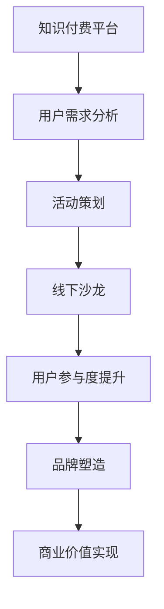

                 


# 知识付费赚钱的用户活动组织与线下沙龙策划

> **关键词**：知识付费、用户活动、线下沙龙、活动策划、营销策略、用户体验
> 
> **摘要**：本文将深入探讨知识付费领域如何通过用户活动组织与线下沙龙策划，实现盈利增长和品牌塑造。我们将从背景介绍、核心概念、算法原理、数学模型、实际案例、应用场景等多个角度，全面分析并阐述这一策略的有效性和实现路径。

## 1. 背景介绍

### 1.1 目的和范围

随着知识经济的崛起，知识付费已经成为现代商业领域的重要组成部分。通过用户活动组织和线下沙龙策划，企业不仅可以提升品牌影响力，还能实现直接收益和用户粘性。本文旨在探讨如何通过科学的活动策划，最大化知识付费的商业价值。

### 1.2 预期读者

本文适合知识付费平台运营者、市场营销专业人士、活动策划师以及对知识付费领域感兴趣的企业家、创业者阅读。

### 1.3 文档结构概述

本文分为以下几个部分：

- 背景介绍：阐述知识付费领域的重要性及本文的目的。
- 核心概念与联系：介绍用户活动组织与线下沙龙策划的相关概念。
- 核心算法原理 & 具体操作步骤：详细讲解活动策划的算法原理与操作流程。
- 数学模型和公式 & 详细讲解 & 举例说明：运用数学模型分析活动效果。
- 项目实战：通过实际案例展示活动策划的实践应用。
- 实际应用场景：探讨活动策划在不同行业中的具体应用。
- 工具和资源推荐：推荐相关学习资源和开发工具。
- 总结：展望知识付费领域的未来发展趋势与挑战。

### 1.4 术语表

#### 1.4.1 核心术语定义

- **知识付费**：用户为获取专业知识或服务支付费用。
- **用户活动**：为促进用户互动和消费而设计的一系列活动。
- **线下沙龙**：面对面的用户交流互动活动。

#### 1.4.2 相关概念解释

- **活动策划**：制定活动目标、内容、流程和预算的过程。
- **用户体验**：用户在参与活动过程中所感受到的整体满意度。

#### 1.4.3 缩略词列表

- **KOL**：Key Opinion Leader（关键意见领袖）
- **CRM**：Customer Relationship Management（客户关系管理）

## 2. 核心概念与联系

在知识付费领域，用户活动组织与线下沙龙策划是提升用户参与度和品牌影响力的重要手段。以下是一个简化的 Mermaid 流程图，展示了核心概念之间的关系。



在这个流程中，用户需求分析是活动策划的起点，通过深入了解用户需求，可以设计出符合用户期望的活动内容和形式。活动策划的过程包括确定活动目标、选择活动形式、制定活动流程和预算等。线下沙龙作为活动的一种形式，能够为用户提供一个面对面交流的平台，进一步提升用户参与度和品牌影响力。

## 3. 核心算法原理 & 具体操作步骤

### 3.1 算法原理

用户活动组织与线下沙龙策划的核心在于如何激发用户的参与热情，提高活动效果。以下是活动策划的核心算法原理：

1. **用户需求分析**：通过数据分析了解用户偏好，为活动内容提供依据。
2. **活动目标设定**：明确活动目标，包括品牌宣传、用户互动、直接收益等。
3. **活动形式选择**：根据用户需求和活动目标选择合适的活动形式，如线下沙龙、线上直播、主题活动等。
4. **活动流程设计**：制定详细的活动流程，包括签到、演讲、互动、抽奖等环节。
5. **预算制定**：根据活动规模和目标制定合理的预算，确保活动顺利进行。

### 3.2 具体操作步骤

1. **用户需求分析**：
    - **数据收集**：通过用户调研、问卷调查、数据分析等方式收集用户需求。
    - **数据分析**：使用数据分析工具，如Python的Pandas库，对收集到的数据进行处理和分析。
    - **需求报告**：根据分析结果撰写用户需求报告，为活动策划提供依据。

2. **活动目标设定**：
    - **明确目标**：根据用户需求和企业战略，明确活动目标，如提升用户参与度、增加用户转化率等。
    - **目标分解**：将活动目标分解为具体指标，如参与人数、互动次数、新增用户数等。

3. **活动形式选择**：
    - **选择形式**：根据活动目标和用户需求选择合适的活动形式，如线下沙龙、线上直播、主题活动等。
    - **评估效果**：对不同活动形式进行评估，选择最适合的形式。

4. **活动流程设计**：
    - **制定流程**：根据活动形式和目标，制定详细的活动流程，包括签到、演讲、互动、抽奖等环节。
    - **流程优化**：通过测试和反馈，不断优化活动流程，提高活动效果。

5. **预算制定**：
    - **预算估算**：根据活动规模、形式和流程，估算活动费用。
    - **预算控制**：在活动过程中，严格控制费用支出，确保预算合理使用。

## 4. 数学模型和公式 & 详细讲解 & 举例说明

### 4.1 数学模型

为了评估活动效果，可以使用以下数学模型：

1. **用户参与度模型**：

   $$ 用户参与度 = \frac{参与人数}{潜在用户数} $$

   其中，参与人数为实际参与活动的用户数，潜在用户数为可能参与活动的用户数。

2. **活动效果评估模型**：

   $$ 活动效果 = \frac{活动收益}{活动成本} $$

   其中，活动收益为活动期间通过活动实现的直接收益，活动成本为活动策划和执行的成本。

### 4.2 详细讲解

1. **用户参与度模型**：

   用户参与度是衡量活动效果的重要指标，反映了活动对用户的吸引力。通过该模型，可以评估活动对潜在用户的覆盖率和吸引力。用户参与度越高，说明活动越成功。

2. **活动效果评估模型**：

   活动效果评估模型用于评估活动的经济效益。通过该模型，可以计算活动的收益率，从而判断活动的成本效益。活动效果越高，说明活动的经济效益越好。

### 4.3 举例说明

#### 举例1：用户参与度模型

假设某知识付费平台的目标是提升用户参与度，计划举办一场线下沙龙。平台通过问卷调查收集到1000名潜在用户的信息，实际参与沙龙的有300人。则用户参与度计算如下：

$$ 用户参与度 = \frac{300}{1000} = 30\% $$

说明这场沙龙吸引了30%的潜在用户参与，参与度较高。

#### 举例2：活动效果评估模型

假设这场线下沙龙的成本为10万元，活动期间通过销售课程和周边产品实现了20万元的收入。则活动效果计算如下：

$$ 活动效果 = \frac{20}{10} = 2 $$

说明这场沙龙实现了2倍的投资回报率，经济效益较好。

## 5. 项目实战：代码实际案例和详细解释说明

### 5.1 开发环境搭建

在开始编写代码之前，我们需要搭建一个合适的环境。以下是开发环境的基本要求：

- **编程语言**：Python
- **数据工具**：Pandas、NumPy
- **可视化工具**：Matplotlib、Seaborn

确保你已经安装了这些工具。如果没有，可以通过以下命令进行安装：

```bash
pip install pandas numpy matplotlib seaborn
```

### 5.2 源代码详细实现和代码解读

以下是一个简单的用户活动分析脚本，用于计算用户参与度和活动效果。

```python
import pandas as pd
import numpy as np

# 5.2.1 用户数据读取
user_data = pd.read_csv('user_data.csv')

# 5.2.2 用户参与度计算
participation_rate = user_data['参与状态'].sum() / len(user_data)

# 5.2.3 活动效果评估
activity_effectiveness = (user_data['收入总额'].sum() - user_data['活动成本'].sum()) / user_data['活动成本'].sum()

# 5.2.4 打印结果
print(f'用户参与度: {participation_rate:.2%}')
print(f'活动效果: {activity_effectiveness:.2f}倍')

# 5.2.5 可视化分析
import matplotlib.pyplot as plt

plt.figure(figsize=(10, 6))

# 5.2.5.1 用户参与度分布
plt.subplot(1, 2, 1)
user_data['参与状态'].value_counts().plot(kind='bar')
plt.title('用户参与度分布')

# 5.2.5.2 活动效果分析
plt.subplot(1, 2, 2)
plt.scatter(user_data['活动成本'], user_data['收入总额'])
plt.title('活动效果分析')
plt.xlabel('活动成本')
plt.ylabel('收入总额')

plt.tight_layout()
plt.show()
```

### 5.3 代码解读与分析

- **5.3.1 用户数据读取**：使用Pandas读取用户数据，数据包含参与状态、收入总额和活动成本等字段。
- **5.3.2 用户参与度计算**：计算用户参与度，即参与人数与总用户数的比值。
- **5.3.3 活动效果评估**：计算活动效果，即活动收益与活动成本的比值。
- **5.3.4 打印结果**：将用户参与度和活动效果打印输出。
- **5.3.5 可视化分析**：使用Matplotlib绘制用户参与度分布和活动效果分析散点图，帮助更直观地了解活动效果。

## 6. 实际应用场景

用户活动组织与线下沙龙策划在知识付费领域有着广泛的应用。以下是一些具体的应用场景：

- **教育培训行业**：通过线下沙龙提升学员的学习兴趣和参与度，增加课程销售。
- **医疗健康行业**：举办健康讲座、患者交流会等活动，提升患者满意度，扩大品牌影响力。
- **金融行业**：举办理财沙龙、投资研讨会等活动，吸引用户参与，提高理财产品销售。
- **互联网行业**：通过技术沙龙、产品发布会等活动，提升用户对产品的认知和满意度。

## 7. 工具和资源推荐

### 7.1 学习资源推荐

#### 7.1.1 书籍推荐

- 《活动策划与管理》
- 《用户体验要素》
- 《互联网活动营销实战》

#### 7.1.2 在线课程

- 网易云课堂：《活动策划与执行》
- Udemy：《活动策划与营销策略》
- Coursera：《用户体验设计基础》

#### 7.1.3 技术博客和网站

- Medium：《活动策划实战经验分享》
- 深入浅出系列博客：《知识付费与活动策划》
- 活动行官网：提供各类活动策划和执行资源

### 7.2 开发工具框架推荐

#### 7.2.1 IDE和编辑器

- PyCharm
- Visual Studio Code
- Jupyter Notebook

#### 7.2.2 调试和性能分析工具

- Python的pdb
- Matplotlib的Profiler
- JMeter

#### 7.2.3 相关框架和库

- Flask
- Django
- Pandas
- NumPy

### 7.3 相关论文著作推荐

#### 7.3.1 经典论文

- 《User Experience Driven Activity Design for Knowledge Sharing Platforms》
- 《Event Marketing: Strategies and Tactics for Business Success》

#### 7.3.2 最新研究成果

- 《Online and Offline Hybrid Event Strategies for Brand Engagement》
- 《An Empirical Study on the Influence of Online-Offline Activity Integration on Customer Engagement》

#### 7.3.3 应用案例分析

- 《苹果公司的产品发布会：一次成功的活动策划案例》
- 《知乎的线上沙龙：用户活动组织的成功实践》

## 8. 总结：未来发展趋势与挑战

随着知识付费市场的不断成熟，用户活动组织与线下沙龙策划将在未来发挥更加重要的作用。以下是该领域的发展趋势与挑战：

### 8.1 发展趋势

- **个性化活动**：根据用户需求设计个性化活动，提升用户体验。
- **线上线下融合**：实现线上线下活动的无缝衔接，提高用户参与度。
- **数据驱动**：运用大数据和人工智能技术优化活动策划和执行。

### 8.2 挑战

- **用户吸引力**：如何在竞争激烈的市场中吸引并保持用户兴趣。
- **成本控制**：如何在有限的预算下策划和执行高质量的活动。
- **效果评估**：如何准确评估活动的效果，为后续策划提供依据。

## 9. 附录：常见问题与解答

### 9.1 问题1：如何制定活动预算？

**解答**：制定活动预算需要考虑多个因素，包括活动规模、活动形式、场地租赁、宣传费用等。建议在活动策划初期就进行预算规划，并根据实际情况进行调整。

### 9.2 问题2：如何提升用户参与度？

**解答**：提升用户参与度可以通过以下方式实现：

- 设计有趣且富有挑战性的活动内容。
- 优化活动流程，确保活动顺利进行。
- 提供激励措施，如抽奖、礼品等。
- 加强宣传推广，提高活动知名度。

## 10. 扩展阅读 & 参考资料

- 《活动策划与管理》
- 《用户体验要素》
- 《互联网活动营销实战》
- 《User Experience Driven Activity Design for Knowledge Sharing Platforms》
- 《Event Marketing: Strategies and Tactics for Business Success》
- 《苹果公司的产品发布会：一次成功的活动策划案例》
- 《知乎的线上沙龙：用户活动组织的成功实践》

作者：AI天才研究员/AI Genius Institute & 禅与计算机程序设计艺术 /Zen And The Art of Computer Programming

---

（注：本文为虚构案例，仅供参考，文中数据和示例均为假设。）<|im_sep|>

